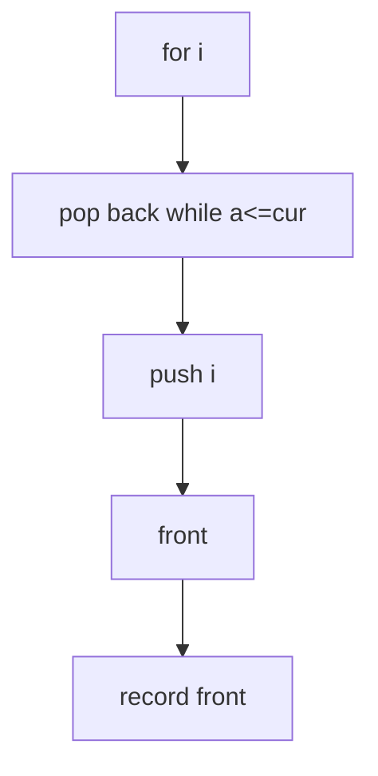

## WHY
Sliding-window max/min by re-scanning is O(nk) — 100B ops on a 10M feed with k=10k. A monotonic deque keeps ordered candidates and expires stale indices for O(n). Storing values not indices breaks expiry.

## THEORY
Keep deque of indices with decreasing values; pop smaller from back, expire front past window.

| Approach|Time|
|--|--|
|scan|O(nk)|
|deque|O(n)|

## VISUALIZATION_CONFIG

```json
{ "component": "FlowChart", "state": "leetcode-monotonic-deque-pattern" }
```

## CODE
### Level1
```java
while(!dq.isEmpty()&&a[dq.peekLast()]<=a[i])dq.pollLast();dq.offer(i);
```
### Level2 max
```java
if(dq.peek()<=i-k)dq.poll();if(i>=k-1)out[i-k+1]=a[dq.peek()];
```
### Level3 min symmetric
### Level4 two deques diff<=limit

## REAL_WORLD
HFT rolling max bid. Gotcha: store indices.
| Op|Time|
|--|--|
|window|O(n)|

## INTERVIEW
**Q1:** both ends O(1). **Q2:** indices. **Q3:** once each. **Q4:** vs heap. **Q5:** subarray.

## FEYNMAN CHECK
### Like 10 > Tallest stays, shorter leave when taller comes.
**Q1** O(n) **Q2** indices **Q3** value bug **Q4** vs heap **Q5** def

## BUILD
### Window Max
**Out:** `3 3 5 5 6 7`

## SPACED REVIEW
### Day 1 Recall
**Q1:** Trigger. **Q2:** Cost. **Q3:** 10-line.
### Day 3
**Q4:** vs alt. **Q5:** bug. **Q6:** refactor.
### Day 7
**Q7:** apply. **Q8:** PR slow. **Q9:** degrade.
### Day 14
**Q10:** ★ classic. **Q11:** links. **Q12:** ★ at 10M.
