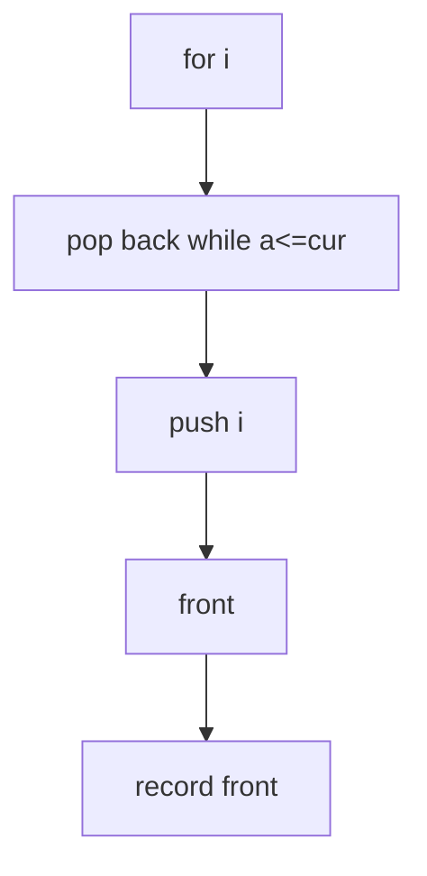

## WHY
Sliding-window max/min by re-scanning is O(nk) — 100B ops on a 10M feed with k=10k. A monotonic deque keeps ordered candidates and expires stale indices for O(n). Storing values not indices breaks expiry.

## THEORY
Keep deque of indices with decreasing values; pop smaller from back, expire front past window.

| Approach|Time|
|--|--|
|scan|O(nk)|
|deque|O(n)|

## VISUALIZATION_CONFIG
```json
{
  "steps": [
    {
      "title": "Monotonic Deque",
      "description": "Double-ended queue maintaining order — supports both directions in O(1).",
      "code": "// Sliding window maximum with deque\nfunction maxSlidingWindow(nums, k) {\n  const deque = []; // stores indices, decreasing values\n  const result = [];\n  for (let i = 0; i < nums.length; i++) {\n    // Remove out-of-window (front)\n    while (deque.length && deque[0] < i - k + 1) deque.shift();\n    // Remove smaller (back)\n    while (deque.length && nums[deque[deque.length-1]] < nums[i]) deque.pop();\n    deque.push(i);\n    if (i >= k - 1) result.push(nums[deque[0]]);\n  }\n  return result;\n}",
      "highlight": [
        3,
        5,
        6,
        7,
        8,
        9,
        10,
        11
      ],
      "diagram": {
        "kind": "flow",
        "steps": [
          {
            "label": "Deque of indices"
          },
          {
            "label": "Front: out-of-window"
          },
          {
            "label": "Back: smaller than curr"
          },
          {
            "label": "Push current"
          },
          {
            "label": "Front = window max"
          }
        ]
      }
    },
    {
      "title": "Sliding Window Minimum",
      "description": "Same pattern with min — deque maintains increasing values.",
      "code": "// Sliding window minimum\nfunction minSlidingWindow(nums, k) {\n  const deque = [];\n  const result = [];\n  for (let i = 0; i < nums.length; i++) {\n    while (deque.length && deque[0] < i - k + 1) deque.shift();\n    while (deque.length && nums[deque[deque.length-1]] > nums[i]) deque.pop();\n    deque.push(i);\n    if (i >= k - 1) result.push(nums[deque[0]]);\n  }\n  return result;\n}",
      "highlight": [
        3,
        4,
        5,
        6,
        7,
        8,
        9
      ],
      "diagram": {
        "kind": "flow",
        "steps": [
          {
            "label": "Increasing deque"
          },
          {
            "label": "Remove larger from back"
          },
          {
            "label": "Front = min"
          },
          {
            "label": "Window sliding"
          },
          {
            "label": "O(n)"
          }
        ]
      }
    },
    {
      "title": "Shortest Subarray with Sum ≥ K",
      "description": "Prefix sum + monotonic deque — O(n) advanced technique.",
      "code": "// LC 862: Shortest Subarray with Sum at Least K\nfunction shortestSubarray(nums, k) {\n  const n = nums.length;\n  const prefix = new Array(n + 1).fill(0);\n  for (let i = 0; i < n; i++) prefix[i + 1] = prefix[i] + nums[i];\n\n  let minLen = Infinity;\n  const deque = []; // increasing prefix values\n  for (let i = 0; i <= n; i++) {\n    // Try to shrink from front while sum ≥ k\n    while (deque.length && prefix[i] - prefix[deque[0]] >= k) {\n      minLen = Math.min(minLen, i - deque.shift());\n    }\n    // Maintain increasing deque\n    while (deque.length && prefix[i] <= prefix[deque[deque.length-1]]) deque.pop();\n    deque.push(i);\n  }\n  return minLen === Infinity ? -1 : minLen;\n}",
      "highlight": [
        4,
        5,
        8,
        9,
        10,
        11,
        12,
        13,
        14,
        15,
        16
      ],
      "diagram": {
        "kind": "flow",
        "steps": [
          {
            "label": "Prefix sums"
          },
          {
            "label": "Deque of increasing prefixes"
          },
          {
            "label": "Sum ≥ k? shrink front"
          },
          {
            "label": "Track min length"
          },
          {
            "label": "O(n) amortized"
          }
        ]
      }
    },
    {
      "title": "Constrained Subsequence Sum",
      "description": "DP + monotonic deque — max sum with distance constraint.",
      "code": "// LC 1425: Constrained Subsequence Sum\nfunction constrainedSubsetSum(nums, k) {\n  const dp = [...nums];\n  const deque = [0];\n  let max = nums[0];\n  for (let i = 1; i < nums.length; i++) {\n    // Remove out-of-range (front)\n    while (deque.length && deque[0] < i - k) deque.shift();\n    // dp[i] = nums[i] + max(0, dp[deque[0]])\n    dp[i] = nums[i] + Math.max(0, dp[deque[0]]);\n    // Maintain decreasing dp values\n    while (deque.length && dp[deque[deque.length-1]] <= dp[i]) deque.pop();\n    deque.push(i);\n    max = Math.max(max, dp[i]);\n  }\n  return max;\n}",
      "highlight": [
        4,
        6,
        7,
        8,
        9,
        10,
        11,
        12,
        14
      ],
      "diagram": {
        "kind": "flow",
        "steps": [
          {
            "label": "DP with distance constraint"
          },
          {
            "label": "Deque of decreasing dp"
          },
          {
            "label": "Get best in [i-k..i-1]"
          },
          {
            "label": "Update dp[i]"
          },
          {
            "label": "O(n)"
          }
        ]
      }
    },
    {
      "title": "When to Use Monotonic Deque",
      "description": "Signals: sliding window, min/max in window, distance-bounded DP, prefix-sum optimization.",
      "code": "// Deque template\nconst deque = [];\nfor (let i = 0; i < n; i++) {\n  // 1. Remove out-of-window indices from front\n  while (deque.length && deque[0] < i - k + 1) deque.shift();\n\n  // 2. Maintain monotonicity (remove from back)\n  while (deque.length && shouldRemove(deque[deque.length-1], i)) {\n    deque.pop();\n  }\n\n  // 3. Push current\n  deque.push(i);\n\n  // 4. Query (usually front)\n  if (i >= k - 1) result.push(process(deque[0]));\n}\n// Each element pushed and popped once → O(n) amortized",
      "highlight": [
        4,
        5,
        7,
        8,
        9,
        12,
        13,
        15,
        16,
        17
      ],
      "diagram": {
        "kind": "boxes",
        "items": [
          {
            "label": "Sliding window min/max",
            "color": "#1e88e5"
          },
          {
            "label": "Distance-bounded DP",
            "color": "#43a047"
          },
          {
            "label": "Prefix sum + query",
            "color": "#fb8c00"
          }
        ]
      }
    }
  ]
}
```

## CODE
### Level1
```java
while(!dq.isEmpty()&&a[dq.peekLast()]<=a[i])dq.pollLast();dq.offer(i);
```
### Level2 max
```java
if(dq.peek()<=i-k)dq.poll();if(i>=k-1)out[i-k+1]=a[dq.peek()];
```
### Level3 min symmetric
### Level4 two deques diff<=limit

## REAL_WORLD
HFT rolling max bid. Gotcha: store indices.
| Op|Time|
|--|--|
|window|O(n)|

## INTERVIEW
**Q1:** both ends O(1). **Q2:** indices. **Q3:** once each. **Q4:** vs heap. **Q5:** subarray.

## FEYNMAN CHECK
### Like 10 > Tallest stays, shorter leave when taller comes.
**Q1** O(n) **Q2** indices **Q3** value bug **Q4** vs heap **Q5** def

## BUILD
### Window Max
**Out:** `3 3 5 5 6 7`

## SPACED REVIEW
### Day 1 Recall
**Q1:** Trigger. **Q2:** Cost. **Q3:** 10-line.
### Day 3
**Q4:** vs alt. **Q5:** bug. **Q6:** refactor.
### Day 7
**Q7:** apply. **Q8:** PR slow. **Q9:** degrade.
### Day 14
**Q10:** ★ classic. **Q11:** links. **Q12:** ★ at 10M.
