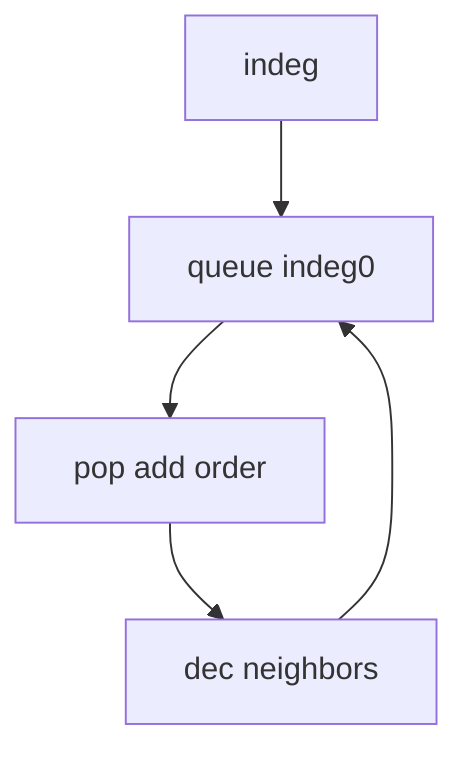

## WHY
Ordering tasks with dependencies by guessing fails on cycles. Kahn BFS / DFS gives valid order O(V+E) and detects cycles. Build systems, course schedules depend on it.

## THEORY
Compute indegrees; queue zero-indegree; pop, decrement neighbors.


## VISUALIZATION_CONFIG

```json
{ "component": "FlowChart", "state": "leetcode-topological-sort-pattern" }
```

## CODE
### Level1 indeg
```java
for(var e:adj.get(u))indeg[e]++;
```
### Level2 Kahn
```java
while(!q.isEmpty()){int u=q.poll();order.add(u);for(int v:adj.get(u))if(--indeg[v]==0)q.add(v);}
```
### Level3 cycle if order<n
### Level4 course schedule II

## REAL_WORLD
Maven/Gradle order modules. Gotcha: cycle = no order.
| Op|Time|
|--|--|
|sort|O(V+E)|

## INTERVIEW
**Q1:** indegree. **Q2:** cycle detect. **Q3:** O(V+E). **Q4:** Kahn vs DFS. **Q5:** schedule.

## FEYNMAN CHECK
### Like10 > Wear socks before shoes; order chores by what must come first.
**Q1** dag **Q2** indeg **Q3** cycle **Q4** kahn/dfs **Q5** def

## BUILD
### Course Schedule
**Out:** `[0,1,2,3]`

## SPACED REVIEW
### Day 1 Recall
**Q1:** Trigger. **Q2:** Cost. **Q3:** 10-line.
### Day 3
**Q4:** vs alt. **Q5:** bug. **Q6:** refactor.
### Day 7
**Q7:** apply. **Q8:** PR slow. **Q9:** degrade.
### Day 14
**Q10:** ★ classic. **Q11:** links. **Q12:** ★ at 10M.
