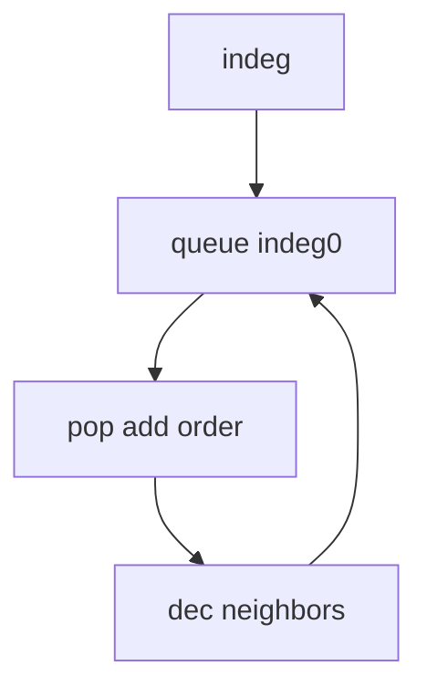

## WHY
Ordering tasks with dependencies by guessing fails on cycles. Kahn BFS / DFS gives valid order O(V+E) and detects cycles. Build systems, course schedules depend on it.

## THEORY
Compute indegrees; queue zero-indegree; pop, decrement neighbors.


## VISUALIZATION_CONFIG
```json
{
  "steps": [
    {
      "title": "Kahn's Algorithm (BFS)",
      "description": "Topological sort using in-degree — pick nodes with 0 in-degree, remove, repeat.",
      "code": "// LC 207: Course Schedule (Kahn's)\nfunction findOrder(numCourses, prerequisites) {\n  const graph = Array.from({ length: numCourses }, () => []);\n  const inDegree = new Array(numCourses).fill(0);\n  for (const [a, b] of prerequisites) {\n    graph[b].push(a);\n    inDegree[a]++;\n  }\n  const queue = [];\n  for (let i = 0; i < numCourses; i++) {\n    if (inDegree[i] === 0) queue.push(i);\n  }\n  const order = [];\n  while (queue.length) {\n    const node = queue.shift();\n    order.push(node);\n    for (const next of graph[node]) {\n      if (--inDegree[next] === 0) queue.push(next);\n    }\n  }\n  return order.length === numCourses ? order : []; // cycle if incomplete\n}",
      "highlight": [
        4,
        5,
        6,
        7,
        9,
        10,
        11,
        13,
        14,
        15,
        16,
        17,
        18
      ],
      "diagram": {
        "kind": "flow",
        "steps": [
          {
            "label": "Compute in-degrees"
          },
          {
            "label": "Queue 0-degree nodes"
          },
          {
            "label": "Process node → decrease neighbors"
          },
          {
            "label": "New 0-degree → queue"
          },
          {
            "label": "Order = topological"
          }
        ]
      }
    },
    {
      "title": "DFS Topological Sort",
      "description": "DFS post-order gives reverse topological order — great for cycle detection.",
      "code": "// DFS topological sort\nfunction topoSort(graph, n) {\n  const state = new Array(n).fill(0); // 0=white, 1=gray, 2=black\n  const stack = [];\n\n  const dfs = (v) => {\n    if (state[v] === 1) return false; // cycle\n    if (state[v] === 2) return true;\n    state[v] = 1;\n    for (const next of graph[v]) {\n      if (!dfs(next)) return false;\n    }\n    state[v] = 2;\n    stack.push(v);\n    return true;\n  };\n\n  for (let i = 0; i < n; i++) {\n    if (state[i] === 0 && !dfs(i)) return [];\n  }\n  return stack.reverse();\n}",
      "highlight": [
        7,
        8,
        9,
        13,
        14,
        15,
        20
      ],
      "diagram": {
        "kind": "flow",
        "steps": [
          {
            "label": "DFS from each unvisited"
          },
          {
            "label": "Mark gray on enter"
          },
          {
            "label": "Recurse neighbors"
          },
          {
            "label": "Post-order push"
          },
          {
            "label": "Reverse = topo order"
          }
        ]
      }
    },
    {
      "title": "Alien Dictionary",
      "description": "Determine character order from sorted alien words — build graph + topo sort.",
      "code": "// LC 269: Alien Dictionary\nfunction alienOrder(words) {\n  const graph = new Map(), inDegree = new Map();\n  for (const w of words) for (const c of w) {\n    graph.set(c, new Set()); inDegree.set(c, 0);\n  }\n  for (let i = 0; i < words.length - 1; i++) {\n    const [a, b] = [words[i], words[i+1]];\n    if (a.length > b.length && a.startsWith(b)) return '';\n    for (let j = 0; j < Math.min(a.length, b.length); j++) {\n      if (a[j] !== b[j]) {\n        if (!graph.get(a[j]).has(b[j])) {\n          graph.get(a[j]).add(b[j]);\n          inDegree.set(b[j], inDegree.get(b[j]) + 1);\n        }\n        break;\n      }\n    }\n  }\n  const queue = [...inDegree].filter(([_, d]) => d === 0).map(([c]) => c);\n  let result = '';\n  while (queue.length) {\n    const c = queue.shift();\n    result += c;\n    for (const n of graph.get(c)) {\n      if (--inDegree.set(n, inDegree.get(n) - 1).get(n) === 0) queue.push(n);\n    }\n  }\n  return result.length === graph.size ? result : '';\n}",
      "highlight": [
        7,
        8,
        9,
        10,
        11,
        12,
        13,
        20,
        21,
        22,
        23,
        24,
        25
      ],
      "diagram": {
        "kind": "flow",
        "steps": [
          {
            "label": "Parse pairs of words"
          },
          {
            "label": "Find first diff char"
          },
          {
            "label": "Build edge a→b"
          },
          {
            "label": "Kahn topo sort"
          },
          {
            "label": "Return order or \"\""
          }
        ]
      }
    },
    {
      "title": "Minimum Height Trees",
      "description": "Trim leaves iteratively — final nodes are the tree centers (1 or 2 nodes).",
      "code": "// LC 310: Minimum Height Trees\nfunction findMinHeightTrees(n, edges) {\n  if (n === 1) return [0];\n  const graph = Array.from({ length: n }, () => new Set());\n  for (const [a, b] of edges) {\n    graph[a].add(b);\n    graph[b].add(a);\n  }\n  let leaves = [];\n  for (let i = 0; i < n; i++) if (graph[i].size === 1) leaves.push(i);\n  let remaining = n;\n  while (remaining > 2) {\n    remaining -= leaves.length;\n    const newLeaves = [];\n    for (const leaf of leaves) {\n      const neighbor = [...graph[leaf]][0];\n      graph[neighbor].delete(leaf);\n      if (graph[neighbor].size === 1) newLeaves.push(neighbor);\n    }\n    leaves = newLeaves;\n  }\n  return leaves;\n}",
      "highlight": [
        9,
        10,
        12,
        13,
        14,
        15,
        16,
        17,
        18,
        19
      ],
      "diagram": {
        "kind": "flow",
        "steps": [
          {
            "label": "Find all leaves"
          },
          {
            "label": "Trim leaves iteratively"
          },
          {
            "label": "New leaves formed"
          },
          {
            "label": "Repeat until ≤ 2 nodes"
          },
          {
            "label": "Tree center(s)"
          }
        ]
      }
    },
    {
      "title": "Task Scheduling",
      "description": "Topological sort determines valid task execution order with dependencies.",
      "code": "// Task scheduler with duration\n// Each task: { id, deps: [], duration }\nfunction schedule(tasks) {\n  const graph = new Map(), inDegree = new Map();\n  for (const t of tasks) { graph.set(t.id, []); inDegree.set(t.id, 0); }\n  for (const t of tasks) {\n    for (const d of t.deps) {\n      graph.get(d).push(t.id);\n      inDegree.set(t.id, inDegree.get(t.id) + 1);\n    }\n  }\n  const startTime = new Map();\n  const queue = tasks.filter(t => t.deps.length === 0);\n  while (queue.length) {\n    const t = queue.shift();\n    const s = Math.max(0, ...t.deps.map(d => startTime.get(d) + tasks.find(x=>x.id===d).duration));\n    startTime.set(t.id, s);\n    for (const nextId of graph.get(t.id)) {\n      if (--inDegree.get(nextId) === 0) queue.push(tasks.find(x=>x.id===nextId));\n    }\n  }\n  return startTime;\n}",
      "highlight": [
        12,
        13,
        15,
        16,
        17,
        18,
        19
      ],
      "diagram": {
        "kind": "flow",
        "steps": [
          {
            "label": "Parse dependencies"
          },
          {
            "label": "Kahn ordering"
          },
          {
            "label": "Compute start times"
          },
          {
            "label": "Max(dep_end) + duration"
          },
          {
            "label": "Critical path"
          }
        ]
      }
    }
  ]
}
```

## CODE
### Level1 indeg
```java
for(var e:adj.get(u))indeg[e]++;
```
### Level2 Kahn
```java
while(!q.isEmpty()){int u=q.poll();order.add(u);for(int v:adj.get(u))if(--indeg[v]==0)q.add(v);}
```
### Level3 cycle if order<n
### Level4 course schedule II

## REAL_WORLD
Maven/Gradle order modules. Gotcha: cycle = no order.
| Op|Time|
|--|--|
|sort|O(V+E)|

## INTERVIEW
**Q1:** indegree. **Q2:** cycle detect. **Q3:** O(V+E). **Q4:** Kahn vs DFS. **Q5:** schedule.

## FEYNMAN CHECK
### Like10 > Wear socks before shoes; order chores by what must come first.
**Q1** dag **Q2** indeg **Q3** cycle **Q4** kahn/dfs **Q5** def

## BUILD
### Course Schedule
**Out:** `[0,1,2,3]`

## SPACED REVIEW
### Day 1 Recall
**Q1:** Trigger. **Q2:** Cost. **Q3:** 10-line.
### Day 3
**Q4:** vs alt. **Q5:** bug. **Q6:** refactor.
### Day 7
**Q7:** apply. **Q8:** PR slow. **Q9:** degrade.
### Day 14
**Q10:** ★ classic. **Q11:** links. **Q12:** ★ at 10M.
