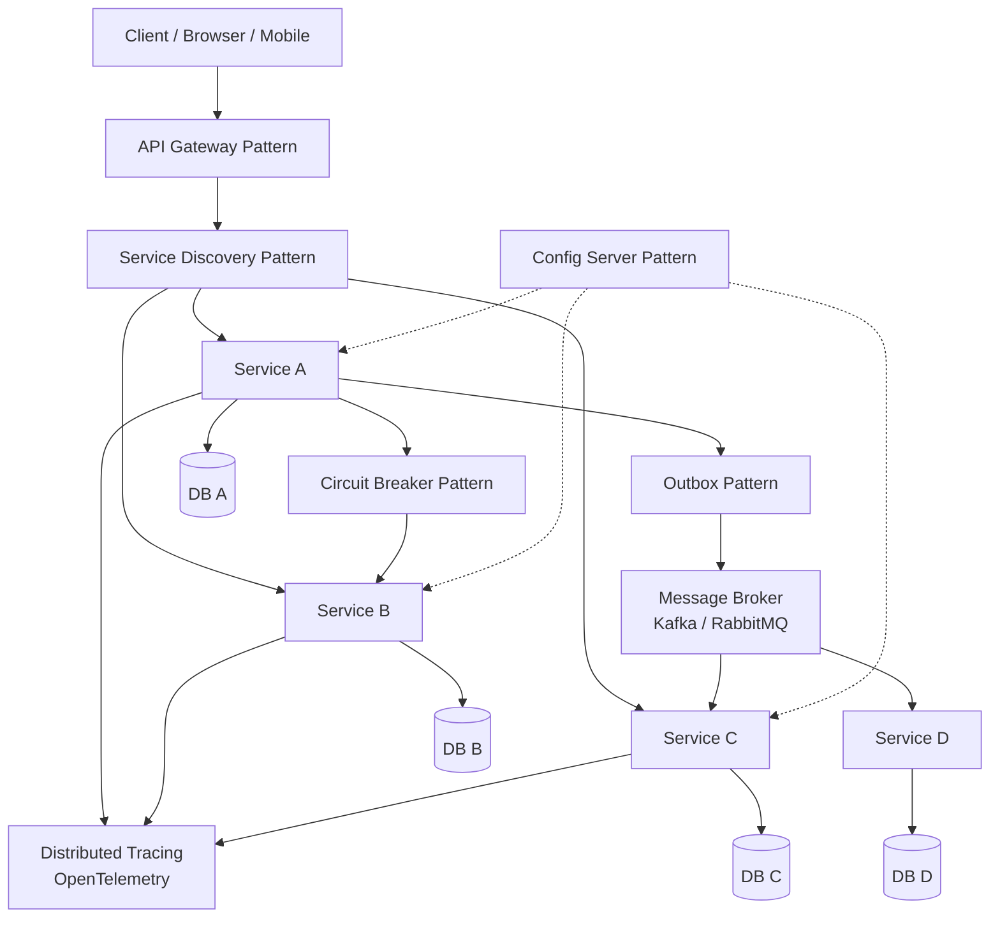

## WHY

Microservices architecture is not a single pattern — it's a constellation of patterns that must work together. A team that adopts "microservices" but doesn't understand the constituent architectural patterns ends up misapplying them: they use synchronous calls where they should use events, they share databases where they should isolate, they put orchestration where choreography would be safer. Every major microservices incident pattern (the cascade failure, the distributed monolith, the data inconsistency storm) traces back to misapplying one of these core architectural patterns.

The specific pain this knowledge prevents: **architecture cargo-culting** — copying Netflix's architecture without understanding why each piece exists. Netflix uses Hystrix (circuit breakers) not because circuit breakers are cool, but because cascading failures across 1000 services would be catastrophic without them. They use Kafka not because Kafka is trendy, but because synchronous chains across dozens of services would mean multi-second latency and cascading failure risk. Understanding *why* each pattern exists lets you apply it selectively — circuit breakers where cascading failure risk is high, events where temporal decoupling matters, sagas where you need distributed consistency. Patterns applied without understanding become ceremony.

The production failure mode from not understanding architecture patterns is **re-inventing solutions to known problems, badly**. Teams build ad-hoc retry logic (without backoff, causing thundering herd on recovery), ad-hoc health checks (without circuit-breaking, causing cascade failures), ad-hoc event delivery (without idempotency, causing duplicate processing). Each of these is a well-documented problem with a well-documented solution in the patterns literature. Not knowing the patterns means spending 6 months building what the community solved in 6 years.

Senior engineers must be able to: name the core architectural patterns for microservices, explain what problem each solves, identify which patterns are required vs optional for a given system, and detect when a pattern is being misapplied.

## THEORY

### The Core Microservices Architecture Pattern Map



### The Eight Core Patterns

| # | Pattern | Problem Solved | Key Tool |
|---|---------|---------------|----------|
| 1 | **Service Discovery** | How do services find each other dynamically? | Eureka, Kubernetes DNS |
| 2 | **API Gateway** | Single entry point; auth, routing, rate limiting | Spring Cloud Gateway, Kong |
| 3 | **Circuit Breaker** | Stop cascading failures when a service is slow/down | Resilience4j, Istio |
| 4 | **Database-per-Service** | Prevent data coupling between services | Convention + enforcement |
| 5 | **Event-Driven / Pub-Sub** | Async decoupling; temporal independence | Kafka, RabbitMQ |
| 6 | **Saga** | Distributed transactions without 2PC | Choreography or Orchestration |
| 7 | **API Composition** | Aggregate data from multiple services for a UI query | BFF or API Gateway |
| 8 | **Config Server** | Centralised, environment-specific config | Spring Cloud Config, Vault |

### Pattern Selection Guide

```
Which patterns are MANDATORY for any microservices system?
  ✅ Database-per-Service — without this, you have a distributed monolith
  ✅ Service Discovery — without this, you have hardcoded hostnames that break on any scale
  ✅ Distributed Tracing — without this, cross-service debugging takes hours
  ✅ Health Checks + Circuit Breaker — without this, one slow service cascades to everything

Which patterns are conditional on your design choices?
  📦 Event-Driven / Pub-Sub — needed when temporal decoupling matters (notification, analytics)
  📦 Saga — needed when multi-service transactions are required
  📦 Outbox — needed when you publish events and write to DB atomically
  📦 API Gateway — needed for external-facing APIs; optional for pure backend systems
  📦 Config Server — useful for 10+ services; overkill for 2-3 services
  📦 API Composition — needed when UI needs data from 3+ services in one call

Which patterns are ANTI-PATTERNS if over-applied?
  ❌ Synchronous orchestration — if everything calls everything, you get a distributed monolith
  ❌ Shared database — defeats database-per-service, brings back coupling
  ❌ Saga for every transaction — massive complexity; use only where needed
```

### Common Misconception

> "You must implement all microservices patterns from day one."

**Reality:** Adopt patterns as needed, driven by concrete problems. Start with the mandatory four (database-per-service, service discovery, distributed tracing, health checks). Add event-driven when you have actual temporal-coupling problems. Add sagas when you have actual multi-service transaction requirements. Add API gateway when external client complexity requires it. Patterns adopted ahead of their need add complexity without value. Many teams add Kafka "for scalability" before they have any throughput problem, then spend months debugging Kafka failures instead of building features.

## VISUALIZATION_CONFIG

```json
{ "component": "NetworkDiagram", "state": "microservices-ms-arch-overview" }
```

## CODE

### Level 1 — Beginner: Minimal Architecture With Just the Mandatory Patterns

```yaml
# docker-compose.yml — minimal microservices setup with just the 4 mandatory patterns
version: "3.9"
services:
  # Service Discovery via Docker Compose DNS (simplest form of service discovery)
  user-service:
    build: ./user-service
    ports: ["8081:8080"]
    # Health check — mandatory for circuit breakers to work
    healthcheck:
      test: ["CMD", "curl", "-f", "http://localhost:8080/actuator/health"]
      interval: 10s
      retries: 3

  order-service:
    build: ./order-service
    ports: ["8082:8080"]
    environment:
      # Service discovery: by name, not hardcoded IP
      USER_SERVICE_URL: http://user-service:8080
    depends_on:
      user-service:
        condition: service_healthy

  # Distributed Tracing — mandatory from day 1
  jaeger:
    image: jaegertracing/all-in-one:1.50
    ports: ["16686:16686"]  # Jaeger UI
```

```java
// Minimal application.yml for every microservice — mandatory patterns only
// application.yml
// management.endpoints.web.exposure.include: health,info
// management.health.defaults.enabled: true
// spring.application.name: order-service

// Distributed tracing — one dependency, automatic instrumentation
// build.gradle.kts:
// implementation("io.micrometer:micrometer-tracing-bridge-otel")
// implementation("io.opentelemetry.instrumentation:opentelemetry-spring-boot-starter")
```

### Level 2 — Intermediate: API Gateway + Circuit Breaker Pattern

```java
// spring.application.yml for API Gateway
// spring:
//   cloud:
//     gateway:
//       routes:
//         - id: user-service
//           uri: lb://user-service     # lb:// = load-balanced via Eureka
//           predicates: [Path=/users/**]
//           filters:
//             - name: CircuitBreaker
//               args:
//                 name: user-service
//                 fallbackUri: forward:/fallback/users

@SpringBootApplication
@EnableDiscoveryClient
public class ApiGatewayApp {
    public static void main(String[] args) {
        SpringApplication.run(ApiGatewayApp.class, args);
    }
}

// Fallback controller — when user-service is down, return a graceful response
@RestController
@RequestMapping("/fallback")
class FallbackController {

    @GetMapping("/users")
    public Map<String, Object> userFallback() {
        return Map.of(
            "status", "degraded",
            "message", "User service temporarily unavailable",
            "data", Collections.emptyList()
        );
    }

    @GetMapping("/orders")
    public Map<String, Object> orderFallback() {
        return Map.of(
            "status", "degraded",
            "message", "Order service temporarily unavailable — please try again"
        );
    }
}
```

### Level 3 — Advanced: Event-Driven + Config Server Pattern

```java
// Config Server — centralised configuration for all services
// config-server/src/main/java/com/config/ConfigServerApp.java
import org.springframework.boot.SpringApplication;
import org.springframework.boot.autoconfigure.SpringBootApplication;
import org.springframework.cloud.config.server.EnableConfigServer;

@SpringBootApplication
@EnableConfigServer
public class ConfigServerApp {
    public static void main(String[] args) {
        SpringApplication.run(ConfigServerApp.class, args);
    }
}
// application.yml:
// spring:
//   cloud:
//     config:
//       server:
//         git:
//           uri: https://github.com/myorg/config-repo
//           searchPaths: microservices/{application}

// Config repo structure:
// config-repo/
//   microservices/
//     order-service/
//       application.yml
//       application-prod.yml
//     user-service/
//       application.yml
//       application-prod.yml

// --- Event-Driven pattern — order-service publishes event, notification-service subscribes
@SpringBootApplication
public class NotificationServiceApp {
    public static void main(String[] args) { SpringApplication.run(NotificationServiceApp.class, args); }
}

@Component
class OrderEventConsumer {

    @KafkaListener(topics = "orders.placed", groupId = "notification-service")
    public void onOrderPlaced(OrderPlacedEvent event) {
        // notification-service reacts to events from order-service
        // No direct coupling — notification-service can be down and catch up when it comes back
        System.out.printf("Sending order confirmation to %s for order %d%n",
            event.userEmail(), event.orderId());
    }
}

record OrderPlacedEvent(long orderId, String userEmail, String sku, int quantity) {}

// Corresponding publisher in order-service:
@Service
class OrderEventPublisher {
    private final KafkaTemplate<String, OrderPlacedEvent> kafka;
    OrderEventPublisher(KafkaTemplate<String, OrderPlacedEvent> kafka) { this.kafka = kafka; }

    public void publishOrderPlaced(OrderPlacedEvent event) {
        kafka.send("orders.placed", String.valueOf(event.orderId()), event);
    }
}
```

### Level 4 — Expert / Production: Full Architecture Decision Record Template

```java
package com.architecture;

import java.util.*;

/**
 * Production Architecture Decision Record (ADR) — documents pattern choices.
 * Use one ADR per major architectural decision. Store in Git alongside code.
 * Format based on Michael Nygard's ADR template, adapted for microservices patterns.
 */
public class ArchitectureDecisionRecord {

    /**
     * ADR-001: Service Communication Pattern
     * Decision: Use synchronous REST for queries, async Kafka for write-side events
     *
     * Context:
     * - 5 services at launch (user, order, payment, inventory, notification)
     * - Order placement involves payment and inventory changes
     * - Notification (email/SMS) is a side-effect, not blocking
     *
     * Decision:
     * SYNCHRONOUS REST for:
     *   - Query paths (GET /users/{id}, GET /orders/{id})
     *   - Payment authorization (blocking — we need the result to proceed)
     *   - Inventory check (blocking — we need to know if items are available)
     *
     * ASYNC KAFKA for:
     *   - notification-service (doesn't block checkout)
     *   - analytics-service (doesn't need to be real-time)
     *   - inventory.reserved event (after payment success, notification to warehouse)
     *
     * Consequences:
     * Positive:
     *   - Notification service can be down without affecting checkout
     *   - Analytics can be down without any user impact
     *   - Checkout only depends on user + payment services synchronously (3 total hops)
     * Negative:
     *   - Must implement outbox pattern for reliable Kafka publishing
     *   - Notification delivery is eventually consistent (delay of seconds)
     *
     * Status: Accepted
     */
    public static final String ADR_001 = "Service Communication Pattern";

    /**
     * ADR-002: Database Strategy
     *
     * Decision: Database-per-service with PostgreSQL for all services
     *
     * Context:
     * - All services need ACID transactions within their own domain
     * - Services must not share database tables (distributed monolith prevention)
     *
     * Decision:
     * - Each service gets its own PostgreSQL schema in a shared cluster (cost efficiency)
     * - Services connect via their own DB URL, different credentials
     * - NO direct DB queries across service schemas — always via service API
     * - Exception: read-only reporting DB gets a replica of all schemas (for analytics only)
     *
     * Consequences:
     * Positive:
     *   - Each service can evolve its schema independently
     *   - A schema migration in order-service doesn't risk user-service data
     * Negative:
     *   - No cross-service JOIN queries — reporting must use API composition
     *   - Data duplication (order-service copies user email for order confirmation display)
     *
     * Status: Accepted
     */
    public static final String ADR_002 = "Database Strategy";

    /**
     * ADR-003: Resilience Pattern
     *
     * Decision: Resilience4j circuit breakers on all synchronous service calls
     *
     * Context:
     * - order-service calls payment-service synchronously
     * - If payment-service degrades, order-service threads stack up waiting → OOM
     *
     * Decision:
     * - Circuit breaker on every RestClient call to another service
     * - Settings: 50% failure rate threshold, 10s wait in open state, 3 test calls in half-open
     * - 2s timeout on every call (user-perceivable timeout budget is 5s; 2s leaves headroom)
     * - Fallback: cached result or graceful degradation response (never 500)
     *
     * Status: Accepted
     */
    public static final String ADR_003 = "Resilience Pattern";

    public static void printAllAdrs() {
        List.of(ADR_001, ADR_002, ADR_003).forEach(adr ->
            System.out.println("ADR: " + adr));
    }
}
```

## REAL_WORLD

### How Uber Applies These Patterns in Their Ride-Matching System

Uber's core ride-matching flow is a textbook application of microservices patterns. A single "request a ride" operation touches: SupplyService (find drivers), PricingService (surge calculation), GeoService (location lookup), DriverService (notify driver), TripService (create trip record), PaymentService (auth card), NotificationService (rider + driver notifications). Uber's architecture: synchronous calls for blocking operations (pricing, auth card, create trip), async events for non-blocking (push notifications, analytics, surge map updates). Service discovery via their internal H3 routing system. Circuit breakers on all external calls. Kafka for all event streams. Distributed tracing (Jaeger) for cross-service debugging.

```java
// Simplified Uber-style ride request flow demonstrating pattern selection
@RestController
@RequestMapping("/rides")
class RideController {
    private final PricingClient pricing;    // synchronous — need fare before confirming
    private final TripService trips;        // local — owns trip state
    private final PaymentClient payment;    // synchronous — need auth before proceeding
    private final KafkaTemplate<String, RideRequestedEvent> events;

    RideController(PricingClient pricing, TripService trips,
                   PaymentClient payment, KafkaTemplate<String, RideRequestedEvent> events) {
        this.pricing = pricing;
        this.trips = trips;
        this.payment = payment;
        this.events = events;
    }

    @PostMapping
    @Transactional  // covers trip creation + outbox event atomically
    public RideConfirmation requestRide(@RequestBody RideRequest req) {
        // Synchronous: need price to quote rider — blocking call OK
        Fare fare = pricing.calculateFare(req.origin(), req.destination(), req.rideType());

        // Synchronous: need payment auth before creating trip — blocking OK
        PaymentAuth auth = payment.authorize(req.riderId(), fare.estimatedCents());

        // Local: trip creation in our own DB — no network call
        Trip trip = trips.create(req, fare, auth);

        // Async: driver matching, notifications, analytics — non-blocking
        // If driver-matching-service is down, the event queues and the service catches up
        events.send("rides.requested", new RideRequestedEvent(
            trip.id(), req.origin(), req.destination(), fare.estimatedCents()));

        return new RideConfirmation(trip.id(), fare.displayPrice());
    }
}

record RideRequest(long riderId, double[] origin, double[] destination, String rideType) {}
record Fare(long estimatedCents, String displayPrice) {}
record PaymentAuth(String authCode) {}
record Trip(long id) {
    static Trip create() { return new Trip(System.nanoTime()); }
}
record RideRequestedEvent(long tripId, double[] origin, double[] destination, long fareCents) {}
record RideConfirmation(long tripId, String fare) {}
interface PricingClient { Fare calculateFare(double[] origin, double[] dest, String type); }
interface PaymentClient { PaymentAuth authorize(long riderId, long cents); }
interface TripService { Trip create(RideRequest req, Fare fare, PaymentAuth auth); }
```

### Production Gotcha: Pattern Mismatch

```
❌ COMMON MISTAKE — using synchronous calls where events are appropriate

Example: Order service synchronously calls notification service:
  OrderService → NotificationService.sendConfirmation()

Problems:
  - If NotificationService is down, order creation FAILS (500 error to user)
  - If NotificationService is slow (email provider timeout), order creation is slow
  - For users: "I couldn't place an order because the email server was slow" — terrible UX
  - For engineers: NotificationService must be deployed before OrderService changes

✅ FIX — use the correct pattern (event) for this use case:
  OrderService publishes OrderPlaced event
  NotificationService subscribes, sends email when it receives the event

Benefits:
  - NotificationService can be down for hours — email sends when it recovers
  - NotificationService slowness doesn't affect order placement
  - Independent deployment: notification can ship without ordering coordination

Rule of thumb: "would the user be sad if this particular step was delayed by 10 minutes?"
  YES (payment confirmation, order creation) → synchronous
  NO (notification email, analytics update, warehouse notification) → async event
```

**Why it happens:** Synchronous calls feel natural (it's a method call — familiar). Events feel complex (setup a Kafka topic, write consumer, handle at-least-once delivery, etc.). Teams default to synchronous and discover the coupling pain only in production when the downstream service degrades.

### Performance Characteristics

| Pattern | Latency overhead | Coupling | Consistency | Complexity |
|---------|-----------------|----------|-------------|------------|
| Synchronous REST | 1-20ms per hop | Tight | Immediate | Low |
| Async event (Kafka) | 10-1000ms to consumer | Loose | Eventual | Medium |
| Saga (choreography) | Eventual | Loose | Eventual | High |
| Saga (orchestration) | Synchronous to orchestrator | Medium | Eventual | High |
| API Gateway | +5-10ms | Decoupled | Immediate | Low |
| Config Server | Startup only | Decoupled | Near-realtime | Low |

## INTERVIEW

**Q1 (Junior): Name the 8 core microservices architecture patterns and what problem each solves.**
A: (1) **Service Discovery** — services register their location dynamically; callers look up by name, not hardcoded IP; (2) **API Gateway** — single entry point for external clients; handles routing, auth, rate limiting; (3) **Circuit Breaker** — stops calling a failing service to prevent cascade failure; allows recovery time; (4) **Database-per-Service** — each service owns its data store; prevents data coupling; (5) **Event-Driven/Pub-Sub** — services communicate via events asynchronously; temporal decoupling; (6) **Saga** — handles distributed transactions; coordinates multi-service state changes with compensation on failure; (7) **API Composition** — aggregates data from multiple services for a UI query; (8) **Config Server** — centralizes configuration so environment-specific properties don't live in service code. The mandatory four for any microservices system: service discovery, circuit breakers, database-per-service, and distributed tracing.

**Q2 (Junior): When should you use synchronous REST vs asynchronous events between services?**
A: Use synchronous REST when: (1) the caller needs an immediate answer to proceed (payment authorization — you need the auth code before creating the order); (2) consistency is required before responding to the user (inventory check — you must confirm availability before confirming the order); (3) simple query patterns (GET /users/{id} — you need the data now). Use async events when: (1) the operation is a side-effect that doesn't block the main flow (send welcome email after user registration); (2) temporal decoupling is desirable (notification service can be down for an hour without affecting order placement); (3) fan-out communication (order placed → notify warehouse + notify analytics + notify crm simultaneously). Rule of thumb: "would a 10-minute delay be acceptable to the user for this operation?" If yes, use events.

**Q3 (Mid): Explain the API Composition pattern and when it's needed.**
A: API Composition is the pattern for answering a query that requires data from multiple services. Example: a "user profile page" needs: user details (from user-service), recent orders (from order-service), subscription status (from billing-service). In a monolith, one JOIN query fetches all this. In microservices, the API layer (via an API Gateway or Backend-for-Frontend) makes 3 parallel calls, assembles the result, and returns a single response. The pattern is needed whenever a UI feature requires data that spans multiple services' databases — which is common because data cannot be joined across service databases. Variants: (1) Gateway composition (API gateway makes the parallel calls) — simple, suitable for read-only queries; (2) BFF (Backend-for-Frontend) — a service specific to one client type (mobile BFF, web BFF) that composes data for that client's specific needs; (3) GraphQL federation — each service exposes its graph, a gateway stitches them together.

**Q4 (Mid): What is the difference between Saga choreography and Saga orchestration?**
A: **Choreography**: each service listens for events and decides what to do next independently. Order created → payment service hears "order created" → publishes "payment completed" → inventory service hears "payment completed" → reserves stock. No central coordinator. Pros: loose coupling, no single point of failure. Cons: the workflow is implicit (you must trace event subscriptions to understand what happens). **Orchestration**: a central workflow service (the orchestrator) calls each service in turn and coordinates the sequence. Pros: explicit, easy to visualize, central place for retries and compensations. Cons: the orchestrator is a knowledge hotspot and potential single point of failure. Use choreography when services are truly independent and the flow is simple; use orchestration when the business workflow is complex, has many steps, or requires explicit audit trails (insurance claims, loan approvals).

**Q5 (Senior): Why is "database-per-service" the most important microservices pattern?**
A: Database-per-service is what makes the other patterns possible. Without it: (1) **no independent deployment** — if two services share tables, a schema migration in one service can break the other; they must deploy together; (2) **no independent evolution** — one service's data model constrains the other; (3) **coupling through the database** — services can "cheat" by querying the other's tables directly, bypassing the service's API and creating invisible coupling; (4) **no scalability independence** — the database becomes a shared bottleneck that all services must scale together. Database-per-service is the "principle of least authority" applied to data: a service can only read and write data it legitimately owns. The strict version: separate database servers. The pragmatic version: separate schemas in a shared cluster, different credentials, and a hard rule that no service queries another's schema. Without this rule, teams will violate it, and within 18 months the system is a distributed monolith sharing a database.

**Q6 (Senior): How do you decide which patterns a new microservices system needs from day one?**
A: Start minimal, add as needed. Day-one mandatory: (1) **Service discovery** — without this, hostnames are hardcoded and the system breaks under any infrastructure change; (2) **Health checks** — every service exposes `/actuator/health`; orchestrators use it for routing; (3) **Distributed tracing** — add OpenTelemetry from the start; retrofitting tracing is painful; (4) **Database-per-service** — architectural constraint, not a tool; enforce from the first schema migration. Add when you have the specific problem: **Circuit breaker** — when you've experienced or modeled cascade failure risk; **Kafka events** — when you have actual temporal decoupling needs (not "for scalability"); **Config Server** — when managing env-specific config for 5+ services becomes painful; **Saga** — only when you have multi-service transaction requirements with real consistency guarantees. Pattern adoption driven by concrete pain, not preemptive complexity.

**Q7 (Senior+): How do these patterns interact with observability at hyperscale?**
A: At hyperscale, patterns don't just interact with observability — they *require* it to be operational. Circuit breakers generate metrics (open/closed/half-open state, failure rate) that feed Prometheus dashboards; without these, you can't distinguish "circuit open protecting the system" from "circuit stuck open due to config bug." Service discovery generates health-check failures that feed alerting; without alerts, a dead service silently drops traffic. Sagas require trace correlation — following a saga across 5 services requires a single trace_id threaded through all events. Kafka consumers require consumer-group lag monitoring; without it, you don't know that your notifications are 2 hours behind. At Netflix/Uber scale, each pattern has a dedicated observability plane: Circuit breakers → Hystrix Dashboard (now Resilience4j metrics). Event streams → Kafka consumer lag dashboards. API Gateway → request volume/latency by route. Service mesh (Istio) → automatic mTLS, traffic metrics, and fault injection *without code changes*. The patterns themselves become observable artifacts; the observability stack is not separate from the architecture, it's integral to it.

## FEYNMAN CHECK

### Explain Microservices Architecture Patterns Like I'm 10 Years Old

> Imagine a big city with many shops (services). **Service discovery** is like having a phone book — every shop registers its address, and when one shop needs to find another, it looks up the phone book instead of memorizing every address. **API Gateway** is like the city's main entrance — all visitors come through one gate, which checks tickets, gives directions, and stops people trying to enter without permission. **Circuit Breaker** is like a breaker in your house's electricity — if one room's wiring is bad, the breaker trips and cuts just that room, so the whole house doesn't burn down. **Events** are like newsletters — the bakery publishes "fresh bread available!" and anyone who subscribed gets notified, without the bakery calling each customer individually. These aren't just fancy names; each pattern is the solution to a problem city engineers discovered the hard way — without phone books, addresses break when shops move; without a main gate, chaos ensues; without circuit breakers, one bad appliance burns the whole house.

---

### 5 Deep Conceptual Questions

**Q1: Why can't you pick just one microservices pattern — why do they need to work together?**
> **A:** Because each pattern solves a different failure mode, and a system without any one of the mandatory patterns has a guaranteed failure class that nothing else can prevent. Service discovery alone doesn't help when the service it found is down — you need circuit breakers. Circuit breakers alone don't help when you can't debug which service caused the cascade — you need distributed tracing. Database-per-service alone doesn't help when you need multi-service consistency — you need sagas. The patterns form a *defense-in-depth* stack: each layer prevents one category of failure that the previous layers can't. Adopting only some patterns is like having a car with brakes but no seatbelt — you've reduced one risk while leaving another fully open.

**Q2: What is the ONE mental model for choosing synchronous vs asynchronous patterns?**
> **A:** "Is the caller's next action gated on this call's result?" If yes → synchronous. If no → asynchronous. Placing an order is gated on payment authorization (synchronous). Sending a confirmation email is not gated on by anything that happens next in the checkout flow (asynchronous). This model also reveals the blast radius: synchronous calls create a fan of dependencies that all fail if the callee fails; asynchronous events decouple that failure. Once you apply this model consistently, your synchronous chains become 1-3 hops (fast, acceptable latency), and everything else uses events (resilient, loosely coupled). The mental model extends to circuit breakers: the breaker cuts the synchronous chain when the callee is failing, preventing the cascade. Without the circuit breaker, a slow synchronous callee causes the caller to queue threads, which causes its callers to queue threads, which is the cascade failure.

**Q3: What is the most dangerous pattern misapplication? Show it with architecture.**
> **A:** Using synchronous orchestration where choreography should be used — making the entire flow fragile to a single service's failure.
> ```
> // ❌ ORCHESTRATION ANTI-PATTERN
> // order-service calls every downstream service synchronously in series:
> OrderService.placeOrder() {
>   1. userClient.getUser(userId)        // 15ms
>   2. inventoryClient.checkAvail(sku)   // 20ms
>   3. pricingClient.getPrice(sku)       // 30ms
>   4. paymentClient.charge(amount)      // 80ms
>   5. inventoryClient.reserve(sku)      // 20ms
>   6. notificationClient.sendEmail()    // 200ms (email provider timeout!)
>   7. analyticsClient.trackOrder()      // 50ms
> }
> // Total: 415ms minimum. If email provider timeouts, user waits 200ms+ for a side-effect.
> // If EITHER service 1-7 is down, the whole order fails.
>
> // ✅ CHOREOGRAPHY + MINIMAL SYNC:
> OrderService.placeOrder() {
>   1. Sync: inventoryClient.checkAndReserve(sku)   // 20ms — must succeed
>   2. Sync: paymentClient.charge(amount)             // 80ms — must succeed
>   3. Local: create order in DB (+ outbox event)     // 5ms
> }
> // Event: OrderPlaced → notification-service reacts (async, doesn't block)
> // Event: OrderPlaced → analytics-service reacts (async, doesn't block)
> // Total blocking time: 105ms. Email/analytics failures don't affect ordering.
> ```

**Q4: How does the choice of patterns interact with team structure (Conway's Law)?**
> **A:** Conway's Law creates pattern selection constraints: the patterns a team can *operate* are limited by the team's size and capabilities. A 5-person team can't maintain a complex saga orchestration engine, a Kafka cluster, a Config Server, a service mesh, and 8 services simultaneously — the operational cognitive load exceeds the team's capacity. The patterns also reflect team communication: synchronous calls between services that are always deployed together (one team owns both) suggest those services should be merged. Event-driven patterns between services owned by different teams suggest correct bounded context separation — teams are truly independent when their services communicate only via events. A useful diagnostic: if two services always have PRs that cross team boundaries simultaneously, they're coupled and should either merge or enforce async-only communication.

**Q5: One-sentence technical definition of the microservices pattern landscape.**
> **A:** "Microservices architecture patterns are a set of solutions to the distributed-system problems that emerge when decomposing a monolith into independently-deployable services: Service Discovery (dynamic location binding), API Gateway (external request routing, auth, rate limiting), Circuit Breaker (cascade failure prevention), Database-per-Service (data ownership enforcement), Event-Driven/Pub-Sub (temporal decoupling for non-blocking side-effects), Saga (multi-service consistency without 2PC), API Composition (cross-service query aggregation), and Config Server (environment-specific configuration management) — with the mandatory core being service discovery, circuit breakers, database-per-service, and distributed tracing, while the remaining patterns are adopted incrementally as concrete problems materialize, preventing premature complexity that delivers cost without benefit."

## BUILD

### 🏗️ Mini Project: Architecture Pattern Selector

**What you will build:** A decision tool that takes a service interaction requirement as input (blocking/non-blocking, consistency level, failure tolerance) and recommends the correct architectural pattern (REST, event, saga, etc.).
**Why this project:** Forces you to think through the tradeoffs of each pattern as decision criteria — the same reasoning you'd use in an architecture review meeting.
**Time estimate:** 25 minutes

---

#### Step 1 — Setup

```bash
mkdir pattern-selector && cd pattern-selector
mkdir -p src/main/java/com/patterns
touch src/main/java/com/patterns/{PatternSelector,Requirement,PatternRecommendation,Main}.java
touch src/test/java/com/patterns/PatternSelectorTest.java
```

#### Step 2 — Core Implementation

```java
package com.patterns;
import java.util.*;

public class PatternSelector {
    public enum Consistency { IMMEDIATE, EVENTUAL, BEST_EFFORT }
    public enum Blocking { CALLER_MUST_WAIT, NON_BLOCKING_OK }
    public enum FailureMode { CASCADE_RISK_HIGH, ISOLATED_OK }
    public enum DataOwnership { SINGLE_SERVICE, MULTI_SERVICE }

    public record Requirement(String description, Blocking blocking,
                               Consistency consistency, FailureMode failureMode,
                               DataOwnership ownership) {}
    public record Recommendation(String pattern, String tool, String rationale) {}

    public static Recommendation recommend(Requirement r) {
        if (r.blocking() == Blocking.NON_BLOCKING_OK && r.consistency() == Consistency.EVENTUAL) {
            return new Recommendation(
                "Async Event (Pub/Sub)",
                "Kafka or RabbitMQ",
                "Caller doesn't need result immediately; decouple via events for resilience"
            );
        }
        if (r.ownership() == DataOwnership.MULTI_SERVICE && r.consistency() != Consistency.BEST_EFFORT) {
            return new Recommendation(
                "Saga Pattern",
                "Kafka + compensating events, or Temporal/Camunda",
                "Multi-service state change; use saga with compensating actions for failure handling"
            );
        }
        if (r.failureMode() == FailureMode.CASCADE_RISK_HIGH) {
            return new Recommendation(
                "Synchronous REST + Circuit Breaker",
                "RestClient + Resilience4j",
                "Synchronous call required; circuit breaker prevents cascade failure"
            );
        }
        return new Recommendation(
            "Synchronous REST",
            "RestClient (Spring)",
            "Blocking call, single service, low cascade risk — direct REST is simplest"
        );
    }
}
```

#### Step 3 — Main Demo

```java
package com.patterns;
import java.util.List;

public class Main {
    public static void main(String[] args) {
        var requirements = List.of(
            new PatternSelector.Requirement(
                "User places order → send confirmation email",
                PatternSelector.Blocking.NON_BLOCKING_OK,
                PatternSelector.Consistency.EVENTUAL,
                PatternSelector.FailureMode.ISOLATED_OK,
                PatternSelector.DataOwnership.SINGLE_SERVICE
            ),
            new PatternSelector.Requirement(
                "Create order + charge payment + reserve inventory",
                PatternSelector.Blocking.CALLER_MUST_WAIT,
                PatternSelector.Consistency.IMMEDIATE,
                PatternSelector.FailureMode.CASCADE_RISK_HIGH,
                PatternSelector.DataOwnership.MULTI_SERVICE
            ),
            new PatternSelector.Requirement(
                "Fetch user details to display on profile page",
                PatternSelector.Blocking.CALLER_MUST_WAIT,
                PatternSelector.Consistency.IMMEDIATE,
                PatternSelector.FailureMode.ISOLATED_OK,
                PatternSelector.DataOwnership.SINGLE_SERVICE
            )
        );

        requirements.forEach(req -> {
            var rec = PatternSelector.recommend(req);
            System.out.printf("Use case: %s%n  → Pattern: %s (%s)%n  → %s%n%n",
                req.description(), rec.pattern(), rec.tool(), rec.rationale());
        });
    }
}
```

#### Step 4 — Error Handling

```java
public static Recommendation recommendSafe(Requirement r) {
    Objects.requireNonNull(r, "Requirement must not be null");
    Objects.requireNonNull(r.description(), "Description required");
    Objects.requireNonNull(r.blocking(), "Blocking mode required");
    Objects.requireNonNull(r.consistency(), "Consistency level required");
    return recommend(r);
}
```

#### Step 5 — Tests

```java
import org.junit.jupiter.api.*;
import com.patterns.*;
import static org.junit.jupiter.api.Assertions.*;

class PatternSelectorTest {
    @Test
    void nonBlockingEventualUsesKafka() {
        var req = new PatternSelector.Requirement("email",
            PatternSelector.Blocking.NON_BLOCKING_OK,
            PatternSelector.Consistency.EVENTUAL,
            PatternSelector.FailureMode.ISOLATED_OK,
            PatternSelector.DataOwnership.SINGLE_SERVICE);
        var rec = PatternSelector.recommend(req);
        assertTrue(rec.pattern().contains("Event") || rec.pattern().contains("Async"));
    }

    @Test
    void multiServiceTransactionUsesSaga() {
        var req = new PatternSelector.Requirement("multi-service tx",
            PatternSelector.Blocking.CALLER_MUST_WAIT,
            PatternSelector.Consistency.IMMEDIATE,
            PatternSelector.FailureMode.CASCADE_RISK_HIGH,
            PatternSelector.DataOwnership.MULTI_SERVICE);
        var rec = PatternSelector.recommend(req);
        assertTrue(rec.pattern().contains("Saga"));
    }
}
```

**Expected Output:**
```
Use case: User places order → send confirmation email
  → Pattern: Async Event (Pub/Sub) (Kafka or RabbitMQ)
  → Caller doesn't need result immediately; decouple via events for resilience

Use case: Create order + charge payment + reserve inventory
  → Pattern: Saga Pattern (Kafka + compensating events, or Temporal/Camunda)
  → Multi-service state change; use saga with compensating actions

Use case: Fetch user details to display on profile page
  → Pattern: Synchronous REST (RestClient (Spring))
  → Blocking call, single service, low cascade risk — direct REST is simplest
```

**Stretch Challenges:**
- [ ] Add more nuanced criteria (fan-out factor, team ownership, retry strategy)
- [ ] Output architecture diagrams in Mermaid format for each recommendation
- [ ] Add a "pattern cost" estimate in developer-days to implement

## SPACED REVIEW

> **How to use:** Answer each question from memory before reading ahead.

---

### Day 1 — Recall

**Q1:** Name the 8 core microservices architecture patterns and what problem each solves.

**Q2:** Which 4 patterns are mandatory for any microservices system? Why?

**Q3:** What is the rule of thumb for choosing synchronous REST vs. async events?

---

### Day 3 — Comprehension

**Q4:** Describe API Composition. When is it needed and what are its variants?

**Q5:** Compare Saga choreography vs. Saga orchestration. Give one scenario where each is better.

**Q6:** Refactor this synchronous chain to use the correct pattern mix:
```java
placeOrder() {
    getUser() → checkInventory() → calcPrice() → charge() → sendEmail() → updateAnalytics()
}
```

---

### Day 7 — Application

**Q7:** Design the architecture for a ride-sharing app. List which patterns you'd use for each service interaction and justify your choices.

**Q8:** You've been asked to add "order history" to a mobile app. The data spans order-service, payment-service, and shipping-service. Which pattern do you use and why?

**Q9:** A microservices system has no circuit breakers. Describe the failure scenario when payment-service degrades to 10-second response times. What happens to order-service threads?

---

### Day 14 — Synthesis & Interview Prep

**Q10:** ★ Classic interview: *"Walk me through the key microservices architecture patterns and when you'd apply each."*

**Q11:** Draw a complete microservices architecture diagram for an e-commerce checkout flow (user, order, payment, inventory, notification) showing which patterns are used for each interaction.

**Q12:** ★ System design: *"Design a food delivery platform (like DoorDash). Identify the services, their interactions, and which architectural patterns (REST, events, saga, circuit breaker) you'd apply to each interaction. Justify your choices."*

