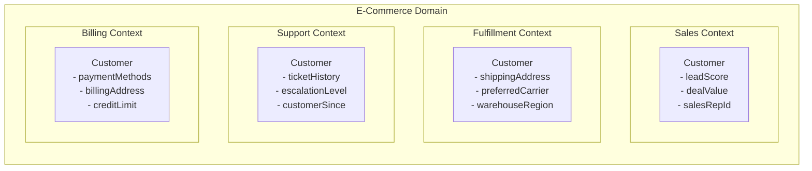

## WHY

Bounded contexts — the central strategic pattern from Eric Evans's Domain-Driven Design (2003) — are the secret ingredient that separates successful microservices decompositions from failed ones. Every microservices adoption that produced a "distributed monolith" failed because teams split services along technical boundaries (auth-service, db-service) or administrative boundaries (team A's service, team B's service) rather than along *semantic* business domain boundaries. A bounded context is the answer to "where does this service's responsibility begin and end?" — and getting that answer right is the difference between services that evolve independently and services that must change in lockstep.

The specific pain bounded contexts solve: **ubiquitous language ambiguity**. The word "Customer" means something different in the Sales context (prospect, lead score, deal value), the Fulfillment context (shipping address, preferred carrier), and the Support context (ticket history, escalation level). In a monolith, a single `Customer` class accumulates all these meanings — 150 fields that no single team fully understands. In microservices with bounded contexts, each context has its OWN `Customer` representation with only the fields relevant to that context. Sales has `LeadCustomer`, Fulfillment has `ShippingCustomer`, Support has `SupportCustomer`. Each is small, focused, and semantically coherent.

The production failure mode of not using bounded contexts is **the god object spreading across services**: a `CustomerDTO` shared via a common-library that grows to 200 fields, where every service adds their own requirements, and a change to the shared schema requires 15 teams to coordinate. This is the canonical data model failure that killed SOA, now manifesting in microservices as a shared Java library that everything imports. Teams can't evolve independently because they all depend on the same shared type.

Senior engineers must understand: bounded context identification via DDD event storming, context maps (the relationships between bounded contexts — shared kernel, customer-supplier, conformist, anti-corruption layer), and how to translate DDD concepts into concrete service boundaries and data models.

## THEORY

### What is a Bounded Context?



Same concept ("Customer"), four different models. Each bounded context has authority over *its* model. No shared class.

### Context Maps — Relationships Between Bounded Contexts

| Relationship | Description | Implementation |
|-------------|-------------|----------------|
| **Shared Kernel** | Two contexts share a common model subset | Shared library; changes require joint approval |
| **Customer-Supplier** | Downstream (customer) depends on upstream (supplier) | Upstream publishes events; downstream adapts |
| **Conformist** | Downstream must use upstream's model as-is | Downstream imports upstream's schema verbatim |
| **Anti-Corruption Layer** | Downstream protects itself from upstream's model | ACL translates upstream model to downstream's clean model |
| **Open Host Service** | Upstream publishes a well-defined protocol | REST API with published schema (most common) |
| **Published Language** | Well-documented shared language between contexts | OpenAPI spec, Avro/Protobuf schemas |

### Identifying Bounded Contexts via Event Storming

```
Event Storming Workshop (2-4 hours with domain experts):

Step 1: Orange sticky notes — Domain Events
  "OrderPlaced", "PaymentProcessed", "ItemShipped", "CustomerRegistered"

Step 2: Blue sticky notes — Commands
  "PlaceOrder", "ProcessPayment", "ShipItem", "RegisterCustomer"

Step 3: Yellow sticky notes — Aggregates
  "Order", "Payment", "Shipment", "Customer"

Step 4: Identify clusters — groups of aggregates + events + commands
  that naturally belong together:

  Cluster A: Order, OrderItem, Cart → "Ordering" bounded context
  Cluster B: Payment, Refund, Transaction → "Billing" bounded context
  Cluster C: Shipment, TrackingEvent, Warehouse → "Fulfillment" bounded context
  Cluster D: Customer, Address, ContactInfo → "Identity" bounded context

Step 5: Draw the bounded context boundaries around each cluster
  Each cluster = one microservice (or a modular monolith module)
```

### Common Misconception

> "One bounded context = one database table."

**Reality:** A bounded context typically owns *multiple* tables (the Ordering context owns orders, order_items, cart, and cart_items tables). The boundary is around the *aggregate* — a cluster of related entities that change together and are owned by the same team. The key rule: a bounded context is identified by *who has authority to change the data model*, not by how many tables it has. If changing the order_items table always requires changing the orders table too, they belong to the same aggregate (Order) and the same bounded context (Ordering).

## VISUALIZATION_CONFIG

```json
{ "component": "ConceptMap", "state": "microservices-ms-bounded-contexts" }
```

## CODE

### Level 1 — Beginner: Same Concept, Different Models Per Bounded Context

```java
// ❌ ANTI-PATTERN: shared Customer class across all contexts
// Everyone imports this from a shared library — coupling factory
public class Customer {
    private long id;
    private String email;
    private String name;
    // Sales fields:
    private double leadScore;
    private String salesRepId;
    private String dealStage;
    // Fulfillment fields:
    private String shippingAddress;
    private String preferredCarrier;
    // Support fields:
    private int openTickets;
    private String escalationLevel;
    // Billing fields:
    private String paymentMethodId;
    private String billingAddress;
    private double creditLimit;
    // 47 more fields that no single context uses...
    // Any change requires 6 teams to review the shared library PR
}

// ✅ CORRECT: each bounded context has its own representation
// Sales context — knows about deals and leads
package com.shop.sales;
record SalesCustomer(long customerId, String email, double leadScore, String salesRepId) {}

// Fulfillment context — knows about shipping
package com.shop.fulfillment;
record FulfillmentCustomer(long customerId, String shippingAddress, String preferredCarrier) {}

// Support context — knows about tickets
package com.shop.support;
record SupportCustomer(long customerId, String email, int openTickets, String escalationLevel) {}

// Each context owns its model. When Sales needs a new field, only Sales changes.
// No coordination with Fulfillment, Support, or Billing teams.
```

### Level 2 — Intermediate: Aggregate Design Within a Bounded Context

```java
package com.shop.ordering;

import jakarta.persistence.*;
import java.math.BigDecimal;
import java.time.Instant;
import java.util.*;

// Ordering bounded context — owns: Order, OrderItem, Cart, CartItem
// Aggregate root: Order
@Entity
@Table(name = "orders")
public class Order {
    @Id @GeneratedValue(strategy = GenerationType.IDENTITY)
    private Long id;

    // Stores customerId — does NOT reference the Customer entity (different bounded context)
    @Column(nullable = false)
    private Long customerId;

    // Stores customer email at time of order — denormalized for this context's use
    // This is the bounded context's "translation" of what it needs from Identity context
    @Column(nullable = false)
    private String customerEmail;

    @Column(nullable = false)
    private String status;  // PENDING, CONFIRMED, SHIPPED, DELIVERED, CANCELLED

    @OneToMany(mappedBy = "order", cascade = CascadeType.ALL, orphanRemoval = true)
    private List<OrderItem> items = new ArrayList<>();

    @Column(nullable = false, precision = 19, scale = 4)
    private BigDecimal total;

    @Column(nullable = false)
    private Instant placedAt;

    @Version
    private Long version;

    protected Order() {}

    public static Order create(long customerId, String customerEmail) {
        Order o = new Order();
        o.customerId = customerId;
        o.customerEmail = customerEmail;
        o.status = "PENDING";
        o.placedAt = Instant.now();
        o.total = BigDecimal.ZERO;
        return o;
    }

    public void addItem(String sku, String description, int quantity, BigDecimal unitPrice) {
        items.add(new OrderItem(this, sku, description, quantity, unitPrice));
        recalculateTotal();
    }

    public void confirm() {
        if (!"PENDING".equals(status)) throw new IllegalStateException("Can only confirm PENDING orders");
        this.status = "CONFIRMED";
    }

    private void recalculateTotal() {
        this.total = items.stream()
            .map(i -> i.getUnitPrice().multiply(BigDecimal.valueOf(i.getQuantity())))
            .reduce(BigDecimal.ZERO, BigDecimal::add);
    }

    public Long getId() { return id; }
    public Long getCustomerId() { return customerId; }
    public String getCustomerEmail() { return customerEmail; }
    public String getStatus() { return status; }
    public List<OrderItem> getItems() { return Collections.unmodifiableList(items); }
    public BigDecimal getTotal() { return total; }
}

@Entity
@Table(name = "order_items")
class OrderItem {
    @Id @GeneratedValue Long id;
    @ManyToOne(fetch = FetchType.LAZY) @JoinColumn(name = "order_id") private Order order;
    @Column(nullable = false) private String sku;
    @Column(nullable = false) private String description;
    @Column(nullable = false) private int quantity;
    @Column(nullable = false, precision = 19, scale = 4) private BigDecimal unitPrice;

    protected OrderItem() {}
    OrderItem(Order order, String sku, String description, int quantity, BigDecimal unitPrice) {
        this.order = order; this.sku = sku; this.description = description;
        this.quantity = quantity; this.unitPrice = unitPrice;
    }
    BigDecimal getUnitPrice() { return unitPrice; }
    int getQuantity() { return quantity; }
    String getSku() { return sku; }
}
```

### Level 3 — Advanced: Context Map — Anti-Corruption Layer Between Contexts

```java
package com.shop.ordering;

import org.springframework.stereotype.Component;
import org.springframework.web.client.RestClient;
import java.util.Optional;

/**
 * Anti-Corruption Layer: translates between the Identity context's Customer model
 * and the Ordering context's own representation.
 *
 * When Identity context changes their schema, only this ACL needs to change.
 * The Ordering context's OrderService never knows the Identity context's schema.
 */
@Component
public class IdentityContextAcl {

    private final RestClient identityClient;

    public IdentityContextAcl(RestClient identityClient) {
        this.identityClient = identityClient;
    }

    /**
     * Returns an OrderingCustomer — Ordering context's own representation.
     * NOT the Identity context's CustomerDto — that would leak Identity's model into Ordering.
     */
    public Optional<OrderingCustomer> findOrderingCustomer(long customerId) {
        try {
            IdentityCustomerDto dto = identityClient.get()
                .uri("/customers/{id}", customerId)
                .retrieve()
                .body(IdentityCustomerDto.class);

            if (dto == null) return Optional.empty();

            // TRANSLATION: map Identity's fields to Ordering's fields
            // Only extract what Ordering cares about; ignore Identity-specific fields
            return Optional.of(new OrderingCustomer(
                dto.id(),
                dto.emailAddress(),    // Identity uses "emailAddress"; Ordering uses "email"
                dto.fullName(),
                dto.isActive()
            ));
        } catch (Exception e) {
            return Optional.empty();
        }
    }
}

// Ordering context's own model — never imported from Identity context
record OrderingCustomer(long id, String email, String name, boolean active) {}

// Identity context's response model — only used inside the ACL
record IdentityCustomerDto(long id, String emailAddress, String fullName,
                            boolean isActive, String legalEntityId,
                            String preferredLanguage /* fields we don't care about */) {}
```

### Level 4 — Expert / Production: Event Storming Output → Bounded Context Design

```java
package com.shop;

import java.util.*;
import java.util.stream.*;

/**
 * Production output of an Event Storming workshop:
 * Defines bounded contexts, their aggregates, commands, events, and relationships.
 * This becomes the architectural blueprint for service decomposition.
 */
public class EventStormingOutput {

    public record DomainEvent(String name, String aggregate, String context) {}
    public record Command(String name, String aggregate, String context) {}
    public record Aggregate(String name, String context, List<String> entities) {}

    public record BoundedContext(
        String name,
        String description,
        List<Aggregate> aggregates,
        List<Command> commands,
        List<DomainEvent> events,
        List<ContextRelationship> relationships
    ) {}

    public record ContextRelationship(
        String upstreamContext,
        String downstreamContext,
        String relationshipType,  // CUSTOMER_SUPPLIER, ACL, OPEN_HOST, CONFORMIST
        String translationMechanism  // "REST API + ACL", "Kafka events", "Shared library"
    ) {}

    // Full event storming output for e-commerce domain
    public static final List<BoundedContext> E_COMMERCE_CONTEXTS = List.of(

        new BoundedContext("identity",
            "User accounts, authentication, contact information",
            List.of(new Aggregate("Customer", "identity",
                List.of("Customer", "Address", "ContactPreference"))),
            List.of(
                new Command("RegisterCustomer", "Customer", "identity"),
                new Command("UpdateEmail", "Customer", "identity"),
                new Command("DeactivateCustomer", "Customer", "identity")
            ),
            List.of(
                new DomainEvent("CustomerRegistered", "Customer", "identity"),
                new DomainEvent("EmailUpdated", "Customer", "identity"),
                new DomainEvent("CustomerDeactivated", "Customer", "identity")
            ),
            List.of() // no upstream dependencies
        ),

        new BoundedContext("ordering",
            "Shopping cart, order placement, order lifecycle",
            List.of(
                new Aggregate("Order", "ordering", List.of("Order", "OrderItem")),
                new Aggregate("Cart", "ordering", List.of("Cart", "CartItem"))
            ),
            List.of(
                new Command("AddToCart", "Cart", "ordering"),
                new Command("PlaceOrder", "Order", "ordering"),
                new Command("CancelOrder", "Order", "ordering")
            ),
            List.of(
                new DomainEvent("OrderPlaced", "Order", "ordering"),
                new DomainEvent("OrderCancelled", "Order", "ordering"),
                new DomainEvent("OrderConfirmed", "Order", "ordering")
            ),
            List.of(
                new ContextRelationship("identity", "ordering",
                    "CUSTOMER_SUPPLIER", "REST API + ACL"),
                new ContextRelationship("ordering", "billing",
                    "CUSTOMER_SUPPLIER", "Sync REST (payment auth) + Async Kafka (payment confirmed)"),
                new ContextRelationship("ordering", "fulfillment",
                    "OPEN_HOST", "Async Kafka events")
            )
        ),

        new BoundedContext("billing",
            "Payment processing, invoicing, refunds",
            List.of(
                new Aggregate("Payment", "billing", List.of("Payment", "PaymentMethod")),
                new Aggregate("Invoice", "billing", List.of("Invoice", "InvoiceLineItem")),
                new Aggregate("Refund", "billing", List.of("Refund"))
            ),
            List.of(
                new Command("AuthorizePayment", "Payment", "billing"),
                new Command("CapturePayment", "Payment", "billing"),
                new Command("IssueRefund", "Refund", "billing")
            ),
            List.of(
                new DomainEvent("PaymentAuthorized", "Payment", "billing"),
                new DomainEvent("PaymentCaptured", "Payment", "billing"),
                new DomainEvent("RefundIssued", "Refund", "billing")
            ),
            List.of(
                new ContextRelationship("billing", "notifications",
                    "CUSTOMER_SUPPLIER", "Async Kafka events")
            )
        ),

        new BoundedContext("fulfillment",
            "Warehouse picking, shipping, tracking",
            List.of(
                new Aggregate("Shipment", "fulfillment",
                    List.of("Shipment", "ShipmentItem", "TrackingEvent"))
            ),
            List.of(
                new Command("CreateShipment", "Shipment", "fulfillment"),
                new Command("UpdateTracking", "Shipment", "fulfillment")
            ),
            List.of(
                new DomainEvent("ShipmentCreated", "Shipment", "fulfillment"),
                new DomainEvent("ShipmentDelivered", "Shipment", "fulfillment")
            ),
            List.of(
                new ContextRelationship("fulfillment", "notifications",
                    "CUSTOMER_SUPPLIER", "Async Kafka events")
            )
        )
    );

    public static void printContextMap() {
        System.out.println("=== E-Commerce Bounded Context Map ===\n");
        E_COMMERCE_CONTEXTS.forEach(ctx -> {
            System.out.printf("Context: %s%n  %s%n", ctx.name(), ctx.description());
            System.out.println("  Aggregates: " + ctx.aggregates().stream()
                .map(Aggregate::name).collect(Collectors.joining(", ")));
            System.out.println("  Events:     " + ctx.events().stream()
                .map(DomainEvent::name).collect(Collectors.joining(", ")));
            if (!ctx.relationships().isEmpty()) {
                System.out.println("  Relationships:");
                ctx.relationships().forEach(r ->
                    System.out.printf("    %s → %s [%s] via %s%n",
                        r.upstreamContext(), r.downstreamContext(),
                        r.relationshipType(), r.translationMechanism()));
            }
            System.out.println();
        });
    }

    public static void main(String[] args) {
        printContextMap();
    }
}
```

## REAL_WORLD

### How Amazon Uses DDD Bounded Contexts for Their Services

Amazon's famous "Working Backwards" press release process, combined with the "two-pizza team" mandate, is effectively an Inverse Conway Maneuver driven by bounded contexts. Each two-pizza team owns one bounded context end-to-end. Amazon's product catalog: `catalog-service` (item metadata, brand info, relationships), `inventory-service` (stock levels, warehouse locations), `pricing-service` (base price, promotions, surge pricing), `review-service` (ratings, reviews, abuse detection) — each is a separate bounded context with separate data, APIs, and teams. The bounded context boundary ensures that a change to how inventory levels are tracked doesn't require coordination with the catalog team. The catalog team's "Product" has fields like `title`, `description`, `brandId`, `imageUrls` — it does NOT have inventory levels or pricing (those are other contexts' responsibility).

```java
// Amazon-style bounded context separation in product catalog
// Each context has its own Product representation

// catalog-service: context = "Catalog"
package com.amazon.catalog;
record CatalogProduct(
    String asin,             // Amazon Standard Identification Number
    String title,
    String description,
    String brandId,
    List<String> imageUrls,
    List<String> categoryIds
    // NO price, NO inventory level, NO review count — those are other contexts
) {}

// pricing-service: context = "Pricing"
package com.amazon.pricing;
record PricedProduct(
    String asin,
    java.math.BigDecimal basePrice,
    java.math.BigDecimal currentPrice,
    String promotionCode,
    boolean isPrimeEligible
    // NO title, NO description, NO brand — that's Catalog's responsibility
) {}

// inventory-service: context = "Inventory"
package com.amazon.inventory;
record InventoryProduct(
    String asin,
    int unitsOnHand,
    String warehouseId,
    String reorderThreshold,
    boolean isAvailableForSameDay
    // NO price, NO title, NO description
) {}

// The product detail page aggregates all three via API composition:
// GET /products/{asin} calls:
//   1. catalog-service.getCatalogProduct(asin) → title, description
//   2. pricing-service.getPrice(asin) → price, prime eligibility
//   3. inventory-service.getAvailability(asin) → in stock, delivery estimate
// Result assembled by BFF (Backend-for-Frontend) service
```

### Production Gotcha: The Shared Library Anti-Pattern

```java
// ❌ DANGEROUS — common-dtos shared library that every service imports
// Initially tempting: "let's avoid code duplication!"
// File: common-dtos/src/main/java/com/shop/dto/CustomerDto.java

package com.shop.dto;
public class CustomerDto {
    private Long id;
    private String email;     // added by identity team
    private String name;      // added by identity team
    private String salesRepId; // added by sales team
    private String leadScore; // added by sales team
    private String shippingAddress; // added by fulfillment team
    // ... every team adds their fields here
}

// What happens:
// - Version 1.0.0: id, email, name
// - Version 1.1.0: sales team adds leadScore, salesRepId
//   → fulfillment team must update their dependency and redeploy (NO independence!)
// - Version 1.2.0: fulfillment adds shippingAddress
//   → identity team must update and redeploy (NO independence!)
// - Eventually: 60 fields. Nobody knows which context owns what.
//   Changing ONE field requires 8 teams to review a PR to a shared library.
//   All services go through a coordinated release whenever the library changes.
//   = You've built shared state between your "independent" services.

// ✅ FIX — each service owns its own DTOs
// identity-service/src/main/java/com/shop/identity/dto/CustomerDto.java
package com.shop.identity.dto;
record CustomerDto(long id, String email, String name) {}  // only identity fields

// ordering-service: never imports from identity-service's DTOs
// Instead: ordering-service has its own representation of what it needs from identity:
package com.shop.ordering.external;
record IdentityCustomerView(long id, String email, String name) {}  // local representation
// This is the anti-corruption layer's input model — local, doesn't leak identity's schema
```

**Why it happens:** "DRY (Don't Repeat Yourself)" is misapplied across bounded context boundaries. Within a bounded context, DRY applies — don't duplicate code within the same service. Across bounded context boundaries, **each context should have its own representation** of shared concepts. The duplication of a few field names is far cheaper than the coupling of a shared library. The principle: "share nothing except contracts (API schemas)."

### Performance Characteristics

| Aspect | Shared Model (Anti-Pattern) | Bounded Context Models (Correct) |
|--------|----------------------------|----------------------------------|
| Schema change coordination | All services → O(N teams) | Only the owning service → O(1) |
| Deploy independence | Coupled via shared library releases | Fully independent |
| Model complexity | Grows to 50-200 fields | Stays small per context (10-30 fields) |
| Code comprehensibility | Hard — which team uses which field? | Easy — each model is for one context |
| Context evolution speed | Slow — global coordination | Fast — team decides independently |

## INTERVIEW

**Q1 (Junior): What is a bounded context in Domain-Driven Design?**
A: A bounded context is the explicit boundary within which a particular domain model is valid and consistent — within that boundary, domain terms have precise, agreed-upon meanings; outside that boundary, the same term may mean something different. For example, "Product" in an e-commerce system means different things to the Catalog team (title, description, images), the Inventory team (stock levels, warehouse locations), and the Pricing team (base price, promotions). Each of these is a separate bounded context with its own Product model. The boundary is enforced at the service level: a service only has authority over its own bounded context's data, and communicates with other contexts via stable API contracts. The key benefit: each team can evolve their model independently without coordinating with other contexts.

**Q2 (Junior): What is an aggregate root in DDD?**
A: An aggregate root is the single entry point for a cluster of related entities that must change together as a unit. All access to the aggregate goes through the root — external code (including other aggregates) can only hold references to the aggregate root, never directly to internal entities. Example: `Order` is an aggregate root; `OrderItem` is an internal entity. External code calls `order.addItem(...)` — it never directly constructs or modifies `OrderItem`. This ensures invariants are maintained: the order's total is always recalculated when items change; items can't be added to a cancelled order. In Spring Data: only aggregate roots have repositories (`OrderRepository` exists; `OrderItemRepository` does not). This maps to microservices: one service = one or more aggregates; one aggregate = one consistency boundary in the service's database.

**Q3 (Mid): How do you identify bounded context boundaries in a new domain?**
A: The primary tool is **Event Storming** (Alberto Brandolini, 2013): a collaborative workshop where domain experts and developers place sticky notes on a wall in timeline order: (1) Domain Events (things that happened, past tense): "OrderPlaced", "PaymentProcessed", "ItemShipped"; (2) Commands (what triggered events): "PlaceOrder", "ProcessPayment", "ShipItem"; (3) Aggregates (what handles the command): "Order", "Payment", "Shipment". Clusters of aggregates that naturally go together — sharing invariants, owned by the same domain experts, changing together — form a bounded context. The boundaries appear where the language changes: "Customer" in the Ordering context means something different than "Customer" in the Support context; where language changes, a bounded context boundary exists. Secondary signals: where you draw organizational separation between domain experts, where data authority changes, where consistency requirements change.

**Q4 (Mid): Explain context mapping — specifically the Anti-Corruption Layer pattern.**
A: Context mapping describes the relationships between bounded contexts. The Anti-Corruption Layer (ACL) is the defensive pattern used by a downstream context to protect itself from being "corrupted" by an upstream context's model. Without an ACL, the downstream context uses the upstream's types directly — when the upstream changes their schema, the downstream must update too (tight coupling, no independence). With an ACL, the downstream has a thin translation layer that accepts the upstream's schema and converts it to the downstream's own model. Changes in the upstream only require changes to the ACL, not the downstream's business logic. Implementation: the ACL is typically a component/class that wraps the HTTP client to the upstream service and does the translation. The ACL concept extends to database migration: when decomposing a monolith, each service's ACL wraps the legacy database schema and translates to the service's clean model.

**Q5 (Senior): When should you split one bounded context into two, and when should you merge two contexts into one?**
A: **Split when**: (1) Two aggregates have radically different change rates (the Catalog team needs to update product descriptions hourly; the Inventory team updates stock levels every second — different rates suggest different contexts); (2) Two aggregates have different ownership teams — Conway's Law dictates they should be separate contexts; (3) Two aggregates have different consistency requirements (cart items need strong consistency during checkout; wish list items can be eventually consistent); (4) The combined context becomes too large for one team to own coherently (>7 aggregates is a signal). **Merge when**: (1) Changes to one aggregate always require changes to the other — they're the same aggregate in disguise; (2) They're owned by the same team and share a consistency requirement; (3) The split creates a chatty service pair that calls each other synchronously for every request — they belong together. The test: "can this context be deployed and operated independently by one team?" If no, it should either be merged or its interface with other contexts should be async.

**Q6 (Senior): How does the bounded context pattern prevent the shared-library anti-pattern?**
A: The bounded context pattern explicitly prohibits sharing domain model types across context boundaries. Each bounded context has authority over its own model — if the Ordering context needs to know a customer's name, it has its own `OrderingCustomer` record (or similar) with only the fields it needs. It does NOT import the Identity context's `Customer` class. The mechanism: instead of calling `identityService.getCustomer(id)` and storing the result as Identity's `Customer` type, the Ordering context's ACL translates it to `OrderingCustomer` (a local type). This means: when Identity adds a new field to their Customer model, Ordering doesn't need to change. When Ordering needs a new field (e.g., `isActiveSubscriber`), it requests it via the API contract; the ACL extracts it. The practical rule: a service should have zero runtime dependencies on other services' domain model classes. Only accept data via network calls (REST/events) and immediately translate to the local context's types.

**Q7 (Senior+): How does bounded context design interact with eventual consistency in microservices?**
A: Bounded contexts and eventual consistency are deeply coupled: when an event crosses a context boundary (e.g., `OrderPlaced` event published from Ordering, consumed by Billing and Fulfillment), the consuming contexts receive the event asynchronously — there is a window between the order being created and the payment being authorized, between the payment being captured and the shipment being created. Each context's view of "what's happening" is eventually consistent with the other contexts. The bounded context design determines *where* the eventual consistency boundaries are: within a bounded context, strong consistency is enforced by the aggregate root (all changes to an Order happen within the Ordering context's transaction boundary); across bounded contexts, only eventual consistency is possible (Fulfillment cannot participate in the same ACID transaction as Ordering). This is the design trade-off: the bounded context boundary is precisely where you accept eventual consistency. Well-designed bounded contexts minimize the number of operations that require cross-context coordination, thereby minimizing the scenarios where eventual consistency is painful.

## FEYNMAN CHECK

### Explain Bounded Contexts Like I'm 10 Years Old

> Imagine you're at school and the word "bank" means something different to different teachers. The geography teacher says "bank" means the side of a river. The maths teacher says "bank" means where you keep money. The history teacher says "bank" means a big pile of earth used as a barrier. Each classroom is a **bounded context** — within each classroom, "bank" has one precise meaning, and everyone in that room agrees on it. Outside that classroom, the same word means something different. **In software, when you have different teams working on different parts of a business, the same word (like "Customer" or "Product") means different things in different teams.** Instead of trying to make one definition that everyone uses (which gets confusing and bloated), you let each team have their own definition within their boundaries, and they communicate at the edges with translators.

---

### 5 Deep Conceptual Questions

**Q1: Why is the shared Customer class (canonical model) the original sin of enterprise architecture?**
> **A:** A shared canonical model seems like DRY (Don't Repeat Yourself) applied correctly — one definition of Customer, used everywhere. But it violates the Single Responsibility Principle at the architectural level: the Customer class becomes responsible for representing customers in Sales, Fulfillment, Support, Billing, and every other context simultaneously. As each context adds their requirements, the class grows to 100+ fields with no coherent owner. Changing a field requires coordinating with every team that uses the class. This is the canonical data model that destroyed SOA. The correct principle: DRY applies *within* a bounded context (don't duplicate code in the same service). *Across* bounded contexts, each context should have its own representation — the small duplication of field names is far less costly than the coupling of a shared model.

**Q2: What is the ONE mental model that makes bounded contexts click?**
> **A:** "Each bounded context is a dictionary for one team's domain language." Within the Billing context, "Customer" means "entity with payment methods and billing address." Within Fulfillment, "Customer" means "entity with shipping addresses and carrier preferences." These are the same real-world person, but each context only cares about their slice. The dictionary analogy: each team has their own glossary, and the same word can have different definitions in different glossaries. At the boundary between teams, there's a translator (ACL) that maps one team's terminology to the other's. The mental model solves the naming confusion: "why do we have so many different Customer classes?" — because they're different things to different teams, and that's correct.

**Q3: What is the most dangerous bounded context mistake? Show it with code.**
> **A:** Violating bounded context boundaries by sharing mutable domain types across services.
> ```java
> // ❌ SHARED LIBRARY anti-pattern — every service imports this:
> // common-domain/src/main/java/CustomerDto.java
> class CustomerDto {
>     Long id, String email, String salesRepId, String shippingAddress, int openTickets;
> }
>
> // ordering-service/pom.xml:
> // <dependency>com.shop:common-domain:1.2.3</dependency>
>
> // Problem: identity team updates CustomerDto → forces ALL services to redeploy
> // ordering-service, billing-service, support-service all get pulled into the release
> // Releases are now coordinated → no independence
>
> // ✅ CORRECT — each context defines its own local representation:
> // ordering-service/src/main/java/com/shop/ordering/external/IdentityCustomerView.java
> record IdentityCustomerView(long id, String email, String name) {}
> // This is local to ordering-service, never shared
> // Identity team can add/remove fields; ordering-service only takes what it needs
> // via its ACL.
> ```

**Q4: How does aggregate design within a bounded context prevent data corruption?**
> **A:** Aggregate roots are the gatekeepers of invariants — the business rules that must always be true. Example: "an order's total must always equal the sum of its items' prices." Without an aggregate root, any code (including other services accidentally querying the database directly) could insert an `order_items` row without updating the `orders.total` — corrupting the invariant. With an aggregate root, ALL changes go through `order.addItem(...)`, which always calls `recalculateTotal()`. External code cannot get a direct handle to `OrderItem` — it can only operate via `Order`. This maps directly to microservices: the service *is* the enforcer of its aggregate root's invariants. No other service can write directly to your database (database-per-service rule) — they must call your API, which maintains all invariants. The aggregate root's invariant enforcement is what makes each service's data trustworthy.

**Q5: One-sentence definition of bounded contexts for a senior FAANG engineer.**
> **A:** "A bounded context is the explicit boundary within which a specific domain model is valid — defined by a team's ownership, a ubiquitous language's precise scope, and the consistency requirements of its aggregates — implemented as a microservice (or a strictly-bounded module) that owns its data exclusively, accepts external context data via anti-corruption layers that translate upstream schemas to local types, publishes domain events for downstream contexts to consume asynchronously, and refuses to share its model types across context boundaries — the violation of which (via canonical shared-library schemas) is the architectural failure mode that produced the SOA canonical-model problem and, when replicated in microservices, produces shared-library coupling that defeats the independence promise of the entire architecture."

## BUILD

### 🏗️ Mini Project: DDD Bounded Context for Order Management

**What you will build:** A complete ordering bounded context: Order aggregate root with business rules, anti-corruption layer calling a fake identity service, and domain events published on state transitions.
**Why this project:** Forces you to implement all the key DDD building blocks — aggregate root, invariant enforcement, ACL translation, domain event publishing — in one coherent bounded context.
**Time estimate:** 40 minutes

---

#### Step 1 — Setup

```bash
mkdir ordering-context && cd ordering-context
mkdir -p src/main/java/com/shop/ordering/{domain,application,infrastructure,external}
```

#### Step 2 — Domain Model (Core)

```java
// domain/Order.java — aggregate root
package com.shop.ordering.domain;
import java.math.BigDecimal;
import java.time.Instant;
import java.util.*;

public class Order {
    private final long id;
    private final long customerId;
    private final String customerEmail;
    private final List<OrderItem> items = new ArrayList<>();
    private String status;
    private BigDecimal total = BigDecimal.ZERO;
    private final Instant placedAt;
    private final List<DomainEvent> events = new ArrayList<>();

    private Order(long id, long customerId, String customerEmail) {
        this.id = id;
        this.customerId = customerId;
        this.customerEmail = customerEmail;
        this.status = "PENDING";
        this.placedAt = Instant.now();
    }

    public static Order create(long id, long customerId, String customerEmail) {
        var order = new Order(id, customerId, customerEmail);
        order.events.add(new OrderCreated(id, customerId));
        return order;
    }

    public void addItem(String sku, int quantity, BigDecimal unitPrice) {
        if ("CANCELLED".equals(status)) throw new IllegalStateException("Cannot add items to cancelled order");
        items.add(new OrderItem(sku, quantity, unitPrice));
        total = items.stream().map(i -> i.unitPrice().multiply(BigDecimal.valueOf(i.quantity())))
                     .reduce(BigDecimal.ZERO, BigDecimal::add);
    }

    public void confirm() {
        if (!"PENDING".equals(status)) throw new IllegalStateException("Only PENDING orders can be confirmed");
        if (items.isEmpty()) throw new IllegalStateException("Cannot confirm empty order");
        this.status = "CONFIRMED";
        events.add(new OrderConfirmed(id, customerId, total));
    }

    public long getId() { return id; }
    public String getStatus() { return status; }
    public BigDecimal getTotal() { return total; }
    public List<DomainEvent> flushEvents() {
        var copy = new ArrayList<>(events);
        events.clear();
        return copy;
    }
}

record OrderItem(String sku, int quantity, BigDecimal unitPrice) {}
interface DomainEvent { String eventType(); }
record OrderCreated(long orderId, long customerId) implements DomainEvent {
    public String eventType() { return "OrderCreated"; }
}
record OrderConfirmed(long orderId, long customerId, java.math.BigDecimal total) implements DomainEvent {
    public String eventType() { return "OrderConfirmed"; }
}
```

#### Step 3 — ACL and Application Service

```java
// external/IdentityAcl.java
package com.shop.ordering.external;
record OrderingCustomer(long id, String email) {}
record RemoteIdentityDto(long id, String emailAddress, String fullName) {}

// application/PlaceOrderUseCase.java
package com.shop.ordering.application;
import com.shop.ordering.domain.*;
import com.shop.ordering.external.*;
import java.math.BigDecimal;

public class PlaceOrderUseCase {
    private final OrderingCustomer customer; // injected (ACL result)
    private long nextId = 1;

    public PlaceOrderUseCase(OrderingCustomer customer) { this.customer = customer; }

    public Order execute(String sku, int qty, BigDecimal price) {
        if (!customer.email().contains("@")) throw new IllegalArgumentException("Invalid customer");
        Order order = Order.create(nextId++, customer.id(), customer.email());
        order.addItem(sku, qty, price);
        order.confirm();
        return order;
    }
}
```

#### Step 4 — Error Handling

```java
public Order executeSafe(String sku, int qty, BigDecimal price) {
    if (sku == null || sku.isBlank()) throw new IllegalArgumentException("SKU required");
    if (qty <= 0) throw new IllegalArgumentException("Quantity must be positive");
    if (price == null || price.compareTo(BigDecimal.ZERO) < 0)
        throw new IllegalArgumentException("Price must be non-negative");
    return execute(sku, qty, price);
}
```

#### Step 5 — Tests

```java
import org.junit.jupiter.api.*;
import com.shop.ordering.domain.*;
import com.shop.ordering.application.*;
import com.shop.ordering.external.*;
import java.math.BigDecimal;
import static org.junit.jupiter.api.Assertions.*;

class OrderBoundedContextTest {
    @Test
    void placeOrderProducesConfirmedOrderWithCorrectTotal() {
        var customer = new OrderingCustomer(1, "alice@example.com");
        var useCase = new PlaceOrderUseCase(customer);
        Order order = useCase.execute("SKU-42", 3, new BigDecimal("9.99"));
        assertEquals("CONFIRMED", order.getStatus());
        assertEquals(new BigDecimal("29.97"), order.getTotal());
    }

    @Test
    void confirmingEmptyOrderThrows() {
        Order order = Order.create(1, 1, "a@b.com");
        assertThrows(IllegalStateException.class, order::confirm);
    }

    @Test
    void confirmedOrderPublishesDomainEvent() {
        Order order = Order.create(1, 1, "a@b.com");
        order.addItem("SKU-1", 1, new BigDecimal("10"));
        order.confirm();
        var events = order.flushEvents();
        assertTrue(events.stream().anyMatch(e -> e.eventType().equals("OrderConfirmed")));
    }
}
```

**Expected Output:**
```
Tests passed:
  ✅ placeOrderProducesConfirmedOrderWithCorrectTotal
  ✅ confirmingEmptyOrderThrows
  ✅ confirmedOrderPublishesDomainEvent
Order status: CONFIRMED, Total: 29.97
```

**Stretch Challenges:**
- [ ] Implement a full ACL that calls a mock IdentityService
- [ ] Add the outbox pattern to publish domain events reliably to Kafka
- [ ] Add optimistic locking via `@Version` to the Order aggregate

## SPACED REVIEW

> **How to use:** Answer each question from memory before reading ahead.

---

### Day 1 — Recall

**Q1:** What is a bounded context? Why does "Customer" mean different things in different contexts?

**Q2:** What is an aggregate root? What invariants does it enforce?

**Q3:** Name the 5 context relationship types from DDD context mapping.

---

### Day 3 — Comprehension

**Q4:** Why is a shared-library canonical model (a common `CustomerDto` all services import) harmful?

**Q5:** Describe Event Storming. What are the 4 types of sticky notes and what do they represent?

**Q6:** Design the bounded contexts for a library management system (books, members, loans, fines). Name each context and its aggregates.

---

### Day 7 — Application

**Q7:** Implement an Order aggregate root that enforces: (a) can't add items to a cancelled order, (b) total always equals sum of items, (c) can only confirm a non-empty order.

**Q8:** Design an Anti-Corruption Layer between an Ordering context (downstream) and an Identity context (upstream). Show the local type, the remote type, and the translation method.

**Q9:** Two aggregates: `Order` and `Payment`. Should they be in the same bounded context or different contexts? Justify your answer.

---

### Day 14 — Synthesis & Interview Prep

**Q10:** ★ Classic interview: *"How do you identify bounded contexts when designing a microservices system?"*

**Q11:** Draw a context map for an e-commerce system showing: Identity, Ordering, Billing, Fulfillment, and Notification contexts. Indicate the relationship type (ACL, customer-supplier, open-host) between each pair.

**Q12:** ★ System design: *"You're designing a healthcare platform with patients, appointments, medical records, billing, and insurance. Identify the bounded contexts, design the context map, and specify which context relationships require ACLs and why."*

