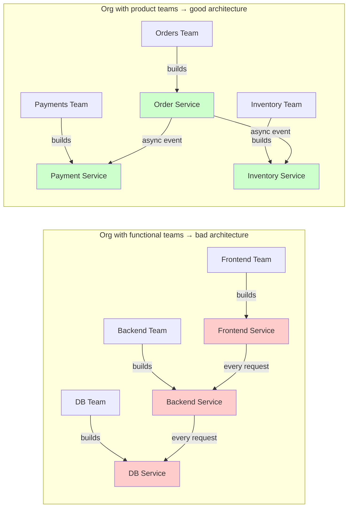

## WHY

Conway's Law — "any organization that designs a system will produce a design whose structure is a copy of the organization's communication structure" (Melvin Conway, 1967) — is the most important and least-heeded principle in microservices architecture. It explains why microservices projects succeed or fail along team lines, not technology lines. A company that organizes its engineers into "frontend team, backend team, database team" and then tries to build microservices will inevitably build a three-layer architecture (frontend service, backend service, database service) — not because that's the right architecture, but because that's how their teams communicate. The services will be tightly coupled, because the teams are tightly coupled.

The specific pain Conway's Law prevents: **wrong service decomposition**. Services that are split along technical boundaries (not business boundaries) end up chatty — every request from the frontend-service calls the backend-service which calls the database-service, producing a distributed three-layer monolith that is more fragile than the original. Services that are split along team boundaries (which follow business capabilities) end up independent: the "orders team" owns everything from the API to the database for the orders bounded context, and they can ship without coordinating with anyone else. The difference in outcomes is dramatic and well-documented.

The production failure mode from violating Conway's Law is **Organizational Resistance Architecture**: where the technical system's coupling exactly mirrors dysfunctional team communication patterns. A team that must coordinate their code deploys with three other teams every time — despite "having microservices" — hasn't gotten microservices' autonomy benefit, only its operational cost. They're running a microservices operations burden on top of a monolith's coordination burden: the worst of both worlds. The architecture can only be fixed by fixing the org structure.

Senior engineers must understand the Inverse Conway Maneuver (deliberately restructuring teams to produce the desired architecture), why Conway's Law applies even within a team (if one developer owns a module, it becomes coupled to their working style), and how to use Team Topologies patterns (stream-aligned, platform, enabling, complicated-subsystem teams) to drive the right system architecture.

## THEORY

### Conway's Law in Action



### Team Topology Patterns (from the "Team Topologies" book)

| Team Type | Description | Produces |
|-----------|-------------|---------|
| **Stream-aligned** | Owns a business domain end-to-end (front to DB) | Business-capability microservice |
| **Platform** | Builds internal developer platform (CI/CD, observability) | Platform tools; not direct user features |
| **Enabling** | Temporarily coaches other teams on new tech/practices | Capability uplift, then disbands |
| **Complicated-subsystem** | Owns a technically-complex component (ML model, crypto) | Shared library or specialized service |

### The Inverse Conway Maneuver

```
Inverse Conway Maneuver:
  INSTEAD OF:  Pick an architecture, then structure teams to match
  DO THIS:     Structure teams how you WANT the architecture to look, then let the
               architecture emerge from team communication patterns

Steps:
  1. Define desired bounded contexts (DDD event storming)
  2. Create one stream-aligned team per bounded context
  3. Each team owns their service end-to-end (API + code + DB + deploy + on-call)
  4. Teams communicate via stable API contracts, not personal relationships
  5. Architecture evolves to match team structure — guaranteed by Conway's Law

Result: when you look at the service dependency graph, it mirrors the org chart — but correctly.
```

### Signs of Conway's Law Violation

| Symptom | Root Cause | Fix |
|---------|------------|-----|
| Every feature requires 3 services to change | Services mirror technical layers, not business capabilities | Reorganize teams around business capabilities |
| "Microservices" deploys are always coordinated | Teams not truly independent; they coordinate daily | Restructure team boundaries to match service boundaries |
| Services have no clear owner | Team boundaries don't match service boundaries | Assign one team per service (or small group of related services) |
| PR reviews always involve 5+ people from 3 teams | Team boundaries cross service boundaries | Align team ownership with service ownership |
| Service A's schema change breaks Service B | Services share implicit coupling (not just data schema) | Strengthen service boundaries; enforce API contracts |

### Common Misconception

> "Conway's Law only matters for large organizations."

**Reality:** Conway's Law applies at every scale, including within a small team. On a 5-person team, if one engineer de-facto "owns" the authentication code while another owns the data model, those two pieces will end up tightly coupled in ways that reflect their communication patterns (or lack thereof). Within a team, "team" can be read as "individual developer communication patterns." A pair of developers who sit next to each other and talk constantly will produce tightly-coupled code between their areas of ownership. A solo developer who owns a complete bounded context from API to DB will produce a clean, encapsulated module. The principle is universal.

## VISUALIZATION_CONFIG
```json
{
  "language": "java",
  "fileName": "ConwayLaw.java",
  "steps": [
    {
      "title": "Conway's Law",
      "description": "\"Any organization that designs a system will produce a design whose structure is a copy of the organization's communication structure.\" — Mel Conway, 1968.",
      "code": "// If org has: frontend team + backend team + DB team\n// → System has: frontend layer + backend layer + DB layer (layered arch)\n// If org has: checkout team + catalog team + payment team\n// → System has: checkout-service + catalog-service + payment-service",
      "diagram": {
        "kind": "boxes",
        "title": "Conway Law examples",
        "items": [
          {
            "label": "2 teams: monolith with 2 layers",
            "color": "#818cf8"
          },
          {
            "label": "5 teams: 5 microservices",
            "color": "#10b981",
            "highlight": true
          },
          {
            "label": "org structure mirrors system structure",
            "color": "#818cf8"
          }
        ]
      }
    },
    {
      "title": "Inverse Conway Maneuver",
      "description": "Don't let org structure happen accidentally. Deliberately design the org to produce the architecture you want.",
      "code": "// Want microservices? → Create small autonomous teams\n// Want loosely coupled services? → Minimize team dependencies\n// Amazon 2-pizza rule: teams small enough\n//   that 2 pizzas can feed everyone",
      "diagram": {
        "kind": "flow",
        "steps": [
          {
            "label": "choose target architecture first",
            "done": true
          },
          {
            "label": "design org structure to match",
            "done": true
          },
          {
            "label": "autonomous teams → autonomous services",
            "active": true
          }
        ]
      }
    },
    {
      "title": "Team Topologies",
      "description": "Stream-aligned teams: each owns a business domain end-to-end. Platform teams: provide infrastructure. Enabling teams: upskill stream teams.",
      "code": "// Stream-aligned: checkout team owns checkout-service\n// Platform: k8s team manages shared platform\n// Enabling: security team helps teams adopt security practices",
      "diagram": {
        "kind": "boxes",
        "title": "Team Topologies",
        "items": [
          {
            "label": "stream-aligned: business domain",
            "color": "#10b981",
            "highlight": true
          },
          {
            "label": "platform: shared infrastructure",
            "color": "#818cf8"
          },
          {
            "label": "enabling: expertise sharing",
            "color": "#818cf8"
          },
          {
            "label": "complicated subsystem: specialized tech",
            "color": "#818cf8"
          }
        ]
      }
    },
    {
      "title": "Communication overhead — Brooks's Law",
      "description": "Adding people to a late project makes it later. Communication overhead grows as n(n-1)/2. Microservices reduce coupling between teams.",
      "code": "// Team of 10: 10*9/2 = 45 communication channels\n// Two teams of 5: 5*4/2 + 5*4/2 = 20 channels\n// + 1 API contract between them\n// Smaller, more autonomous teams = less coordination overhead",
      "diagram": {
        "kind": "boxes",
        "title": "Communication channels",
        "items": [
          {
            "label": "1 team of 10: 45 channels",
            "color": "#ef4444"
          },
          {
            "label": "2 teams of 5: 20 internal + 1 API",
            "color": "#10b981",
            "highlight": true
          },
          {
            "label": "well-defined API = team boundary",
            "color": "#10b981"
          }
        ]
      }
    },
    {
      "title": "Practical implication",
      "description": "Before designing microservices boundaries, look at your org chart. Align service boundaries with team boundaries. Misalignment causes constant cross-team coordination.",
      "code": "// Anti-pattern: microservice boundary crosses team\n// order-service (team A) calls inventory-service (team A)\n// → still in same team → could be a module in a monolith\n// Good: each team owns one service (their domain)",
      "diagram": {
        "kind": "boxes",
        "title": "Alignment check",
        "items": [
          {
            "label": "same team owns both services → merge?",
            "color": "#f59e0b"
          },
          {
            "label": "different teams → service boundary correct",
            "color": "#10b981",
            "highlight": true
          },
          {
            "label": "Conway's Law predicts this",
            "color": "#818cf8"
          }
        ]
      }
    }
  ]
}
```

## CODE

### Level 1 — Beginner: Conway's Law in Code

```java
// ❌ FUNCTIONAL TEAM STRUCTURE → technical-layer services (Conway's Law violation)
// "Frontend team" builds UI service, "backend team" builds API service,
// "DBA team" builds data service. Result: 3-tier distributed monolith.

// frontend-service/src/main/java/.../FrontendService.java
@RestController
class FrontendService {
    @GetMapping("/checkout")
    public String checkout() {
        // Calls backend service for every operation — frontend-service is useless alone
        return backendClient.processCheckout();
    }
}

// backend-service — all "business logic" here, owned by backend team
@RestController
class BackendService {
    @GetMapping("/checkout")
    public String processCheckout() {
        // Calls DB service for every data operation — backend-service has no data
        return dbClient.getCheckoutData();
    }
}

// db-service — just a thin SQL wrapper, owned by DBA team
@RestController
class DbService {
    @GetMapping("/checkout-data")
    public String getCheckoutData() {
        return jdbcTemplate.queryForObject("SELECT ...", String.class);
    }
}
// This is a distributed 3-layer monolith. Every user request hits 3 services.
// Any one team making a change requires coordination with the other two.
// Conway's Law at work: 3 functional teams → 3-tier architecture.

// ✅ PRODUCT TEAM STRUCTURE → business-capability services (Conway's Law aligned)
// "Checkout team" owns the entire checkout flow: API, business logic, DB schema.
// "Catalog team" owns the entire catalog: API, business logic, DB schema.

@SpringBootApplication
public class CheckoutServiceApp {
    // This team owns EVERYTHING about checkout: API, logic, database, deploy, on-call.
    // No coordination needed with catalog team or payment team for checkout changes.
    public static void main(String[] args) { SpringApplication.run(CheckoutServiceApp.class, args); }
}

@RestController
@RequestMapping("/checkout")
class CheckoutController {
    private final CartRepository cartRepo;         // owned by checkout team
    private final CheckoutService checkoutService; // owned by checkout team

    @PostMapping
    public CheckoutResult checkout(@RequestBody CheckoutRequest req) {
        // Calls payment-service (different team) only for payment — narrow, stable contract
        return checkoutService.processCheckout(req);
    }
}
record CheckoutRequest(long cartId, long userId) {}
record CheckoutResult(String confirmationId, String status) {}
interface CartRepository {}
interface CheckoutService { CheckoutResult processCheckout(CheckoutRequest req); }
```

### Level 2 — Intermediate: Team Topology Mapping to Architecture

```java
// The Team Topologies patterns applied to a real microservices org
// Demonstrating how team type → service type

// === Stream-Aligned Team: Orders Team ===
// Owns a business domain end-to-end. Has full authority over their service.
@SpringBootApplication
public class OrderServiceApp {
    // Stream-aligned team: 4 engineers, own order creation/management
    // They deploy independently, they're on-call for their service
    // They decide their own tech stack (though they align with company defaults)
    public static void main(String[] args) { SpringApplication.run(OrderServiceApp.class, args); }
}

// === Platform Team Service: Observability Platform ===
// Platform team builds tools that stream-aligned teams USE, not own
@SpringBootApplication
public class ObservabilityPlatformApp {
    // Platform team: 3 engineers, build dashboards, tracing infra, alerting
    // Other teams DON'T own this — they self-service from it
    // Platform team IS the "customer" of their internal developer portal
    public static void main(String[] args) { SpringApplication.run(ObservabilityPlatformApp.class, args); }
}

// === Complicated-Subsystem Team Service: ML Recommendation Engine ===
// High technical complexity; only this team has the expertise
@SpringBootApplication
public class RecommendationEngineApp {
    // 2 ML engineers + 1 platform engineer
    // Other teams use their service via a simple API — they don't care about model internals
    // This team is NOT stream-aligned (they don't own a business domain)
    // They provide a service to stream-aligned teams
    public static void main(String[] args) { SpringApplication.run(RecommendationEngineApp.class, args); }
}

// What this org's architecture looks like:
// order-service (stream-aligned: orders team)
// payment-service (stream-aligned: payments team)
// catalog-service (stream-aligned: catalog team)
// recommendation-engine (complicated-subsystem: ML team)
// observability-platform (platform: platform team)
//
// Conway's Law predicts: the service dependency graph mirrors the team communication graph.
// Orders → Payment: orders team must coordinate a PR with payments team occasionally (API contract)
// Orders → Recommendation: orders team calls recommendation API, but doesn't coordinate PRs
```

### Level 3 — Advanced: Inverse Conway Maneuver Implementation

```java
package com.architecture;

import java.util.*;

/**
 * The Inverse Conway Maneuver in practice:
 * 1. Use DDD event storming to identify bounded contexts
 * 2. Design the team structure to match bounded contexts
 * 3. Let the service boundaries emerge from team ownership
 *
 * This is a planning tool for org restructuring + architecture design.
 */
public class InverseConwayManeuver {

    public record BoundedContext(
        String name,
        List<String> capabilities,   // what this context does
        List<String> owns,           // data/entities it owns
        List<String> dependencies,   // other contexts it calls
        String communicationType     // sync/async/mixed
    ) {}

    public record TeamStructure(
        String teamName,
        String teamType,             // stream-aligned, platform, enabling, complicated-subsystem
        int headcount,
        BoundedContext context,
        String deploymentCadence,
        String techStack
    ) {}

    public static List<TeamStructure> planTeamStructure(List<BoundedContext> contexts) {
        List<TeamStructure> teams = new ArrayList<>();

        for (BoundedContext ctx : contexts) {
            // Each bounded context becomes a stream-aligned team
            String teamType = "stream-aligned";
            int headcount = estimateHeadcount(ctx);
            teams.add(new TeamStructure(
                ctx.name() + "-team",
                teamType,
                headcount,
                ctx,
                recommendedDeploymentCadence(ctx),
                "Spring Boot (JVM)"  // default; team can override
            ));
        }

        // Add platform team if there are multiple stream-aligned teams
        if (contexts.size() >= 3) {
            teams.add(new TeamStructure(
                "platform-team", "platform", Math.max(2, contexts.size() / 6),
                null,  // platform team doesn't own a business context
                "Continuous", "Various"
            ));
        }
        return teams;
    }

    private static int estimateHeadcount(BoundedContext ctx) {
        // Two-pizza rule: ~4-8 engineers per team
        // More capabilities in context = more engineers needed
        return Math.min(8, Math.max(4, ctx.capabilities().size()));
    }

    private static String recommendedDeploymentCadence(BoundedContext ctx) {
        if (ctx.dependencies().isEmpty()) return "hourly";       // no dependencies → ship freely
        if (ctx.communicationType().equals("async")) return "daily";    // async deps → daily
        return "multiple-per-week";  // sync deps require some coordination on contract changes
    }

    public static void main(String[] args) {
        List<BoundedContext> contexts = List.of(
            new BoundedContext("orders",
                List.of("create-order", "update-order", "cancel-order"),
                List.of("Order", "OrderItem", "OrderStatus"),
                List.of("payments", "inventory"),
                "mixed"  // sync to payment, async to inventory
            ),
            new BoundedContext("payments",
                List.of("authorize", "charge", "refund"),
                List.of("PaymentMethod", "Transaction", "Refund"),
                List.of(),  // payments calls no other context
                "sync"
            ),
            new BoundedContext("inventory",
                List.of("check-availability", "reserve", "release"),
                List.of("Product", "StockLevel", "Reservation"),
                List.of(),
                "sync"
            ),
            new BoundedContext("notifications",
                List.of("send-email", "send-sms", "send-push"),
                List.of("NotificationPreference", "NotificationLog"),
                List.of("users"),
                "async"  // purely event-driven
            )
        );

        List<TeamStructure> teams = planTeamStructure(contexts);
        System.out.println("=== Inverse Conway Maneuver: Team Structure Plan ===\n");
        teams.forEach(t -> {
            System.out.printf("Team: %-25s Type: %-20s Headcount: %d  Deploy: %s%n",
                t.teamName(), t.teamType(), t.headcount(), t.deploymentCadence());
            if (t.context() != null) {
                System.out.println("  Owns: " + t.context().owns());
                System.out.println("  Calls: " + t.context().dependencies() + " (" + t.context().communicationType() + ")");
            }
            System.out.println();
        });
    }
}
```

### Level 4 — Expert / Production: Conway's Law Detection in Code

```java
package com.architecture;

import java.util.*;
import java.util.stream.*;

/**
 * Production tool: detect Conway's Law violations in your codebase.
 * Given a service dependency graph + team ownership map, identify:
 *   - Services that don't align with team boundaries
 *   - Services that require constant cross-team coordination
 *   - Services that belong to the wrong team
 *
 * Input comes from:
 *   - Backstage service catalogue (team ownership)
 *   - Distributed tracing data (service dependency graph)
 *   - GitHub PR data (who reviews what code)
 */
public class ConwayViolationDetector {

    public record ServiceOwnership(String service, String owningTeam) {}
    public record ServiceCall(String caller, String callee, int callsPerDay) {}

    public record ViolationReport(
        String violationType,
        List<String> affectedServices,
        List<String> affectedTeams,
        String diagnosis,
        String recommendation
    ) {}

    public static List<ViolationReport> detect(
            List<ServiceOwnership> ownership,
            List<ServiceCall> calls) {

        List<ViolationReport> violations = new ArrayList<>();
        Map<String, String> serviceToTeam = ownership.stream()
            .collect(Collectors.toMap(ServiceOwnership::service, ServiceOwnership::owningTeam));

        // Find cross-team calls (different teams calling each other frequently)
        Map<String, Long> crossTeamCallVolume = calls.stream()
            .filter(c -> !Objects.equals(serviceToTeam.get(c.caller()), serviceToTeam.get(c.callee())))
            .collect(Collectors.groupingBy(
                c -> serviceToTeam.getOrDefault(c.caller(), "unknown") + " → "
                   + serviceToTeam.getOrDefault(c.callee(), "unknown"),
                Collectors.summingLong(ServiceCall::callsPerDay)
            ));

        crossTeamCallVolume.forEach((teamPair, volume) -> {
            if (volume > 10000) {  // threshold: >10K cross-team calls/day = likely tight coupling
                String[] teams = teamPair.split(" → ");
                violations.add(new ViolationReport(
                    "HIGH_CROSS_TEAM_COUPLING",
                    ownership.stream().map(ServiceOwnership::service).collect(Collectors.toList()),
                    List.of(teams),
                    String.format("Teams %s and %s make %d calls/day — very high coupling", teams[0], teams[1], volume),
                    "Consider: merging into one team, or converting to async events to reduce coupling"
                ));
            }
        });

        // Find services with no clear owner (multiple teams modifying)
        // (In practice: fetch from GitHub who authored the last 20 commits per service)
        // Simplified here as services with ambiguous ownership
        serviceToTeam.forEach((service, team) -> {
            if (team.equals("UNKNOWN")) {
                violations.add(new ViolationReport(
                    "UNOWNED_SERVICE",
                    List.of(service),
                    List.of(),
                    "Service has no clear owner team — will drift and accumulate tech debt",
                    "Assign this service to one team immediately; if it spans teams, split or merge"
                ));
            }
        });

        return violations;
    }

    public static void main(String[] args) {
        List<ServiceOwnership> ownership = List.of(
            new ServiceOwnership("order-service", "orders-team"),
            new ServiceOwnership("order-validator", "orders-team"),
            new ServiceOwnership("order-formatter", "UNKNOWN"),     // violation: no owner
            new ServiceOwnership("payment-service", "payments-team"),
            new ServiceOwnership("payment-gateway-adapter", "payments-team")
        );

        List<ServiceCall> calls = List.of(
            new ServiceCall("order-service", "payment-service", 5000),
            new ServiceCall("order-service", "order-validator", 50000),   // within team: OK
            new ServiceCall("payment-service", "order-service", 500),
            new ServiceCall("order-service", "payment-gateway-adapter", 15000)  // high cross-team
        );

        List<ViolationReport> violations = detect(ownership, calls);
        if (violations.isEmpty()) {
            System.out.println("✅ No Conway's Law violations detected");
        } else {
            violations.forEach(v -> {
                System.out.printf("❌ [%s]%n  %s%n  Recommendation: %s%n%n",
                    v.violationType(), v.diagnosis(), v.recommendation());
            });
        }
    }
}
```

## REAL_WORLD

### How Spotify Uses Team Topologies (Squads, Tribes, Chapters, Guilds)

Spotify's famous Squad Model is one of the most imitated (and most misunderstood) applications of Conway's Law. Spotify organises engineers into Squads (5-9 people, own a feature area end-to-end), Tribes (collection of squads working on related areas), Chapters (horizontal functional groups: iOS developers across squads), and Guilds (interest communities: security, performance). The architectural outcome: services align to Squad ownership. The Discovery Squad owns the discovery service. The Radio Squad owns the radio service. The Mission Squad owns the mission planner. No cross-squad coordination required for squad-owned services — Conway's Law in action.

The key insight: Spotify explicitly designed the org structure to produce the desired service ownership. They didn't "do microservices" and then hope the team structure would align. They did the Inverse Conway Maneuver: identified the autonomous product areas, created squads around them, and let the services emerge.

```java
// Spotify-style service ownership model
// Each squad owns one or more services end-to-end

// Squad: Discovery
// Owns: search-service, recommendation-service, browse-service
// They deploy independently, they're on-call for their services
// They never file tickets to the "platform team" for routine deploys

@SpringBootApplication
public class SearchService {
    // Discovery Squad: 6 engineers, deploy 3x/day, own their Elasticsearch cluster
    public static void main(String[] args) { SpringApplication.run(SearchService.class, args); }
}

// Squad: Radio
// Owns: radio-station-service, auto-mix-service
// Cross-squad interaction: Discovery → Radio via async event (not synchronous)
// When a user saves a song in Discovery, Radio receives a SongSaved event
// — no synchronous dependency between squads

@Component
class RadioEventConsumer {
    @KafkaListener(topics = "discovery.song-saved")
    public void onSongSaved(SongSavedEvent event) {
        // Radio squad processes this on their own schedule
        // Discovery squad doesn't know or care about Radio's processing
        System.out.println("Updating radio model for user " + event.userId());
    }
}

record SongSavedEvent(long userId, String trackId, long playlistId) {}
```

### Production Gotcha: Reporting to Multiple Teams Breaks Conway's Law

```
❌ COMMON CONWAY'S LAW VIOLATION: Engineers report to functional managers but
work on product teams.

Example:
  - Alice, Bob, Carol are Java engineers. They report to the "Java Team" manager.
  - They're "embedded" in: Orders team (Alice), Payments team (Bob),
    Platform team (Carol)
  - Quarterly goals come from the Java Team manager, not the product teams

Result:
  - Alice prioritizes "Java best practices" over "orders team delivery velocity"
  - When the Orders team wants to switch from Java to Kotlin, Alice's manager says no
  - The services Alice owns reflect Java Team decisions, not Orders Team decisions
  - Conway's Law: service boundaries blur because reporting structure ≠ product structure

✅ FIX — True autonomous teams:
  - Engineers report to their product team lead (not a functional manager)
  - Or: matrix org where functional manager handles career, product team lead handles work
  - Key property: team OWNS their service end-to-end, including technology decisions
  - Platform team provides OPTIONAL standards; product teams choose whether to adopt
  - Conway's Law then produces the right architecture: tight within team, loose across teams
```

**Why it happens:** Traditional HR structures are functional (all engineers report to an engineering manager). This creates a pull toward functional services (infra team → infra service). The fix requires explicit Inverse Conway Maneuver: either move reporting to product teams (full squad model) or create a clear "technical ownership" separation that overrides reporting hierarchy for architecture decisions.

### Performance Characteristics

| Org Structure | Deploy Frequency | Cross-Team Coordination | Service Quality |
|---------------|-----------------|-------------------------|-----------------|
| Functional teams | Low (weekly, coordinated) | Very high (every deploy) | Inconsistent (no ownership) |
| Product/Squad teams | High (daily or hourly) | Low (API contract only) | High (clear ownership) |
| Matrix (hybrid) | Medium | Medium | Variable |
| Platform + stream-aligned | High | Low for features | High (platform provides foundation) |

## INTERVIEW

**Q1 (Junior): What is Conway's Law?**
A: Conway's Law states that "any organization that designs a system will produce a design whose structure is a copy of the organization's communication structure." It was observed by Melvin Conway in 1967 and has been validated empirically in dozens of studies since. In practical terms: if your org has three teams (frontend, backend, database), you will build a three-tier architecture — not because it's the right architecture, but because that's how the teams communicate. If your org has product teams aligned to business capabilities (orders, payments, catalog), you will build capability-aligned services. The implication: you can't design a microservices architecture independently of your org structure. Trying to do so produces services that mirror the wrong boundaries, leading to tight coupling and the "distributed monolith" anti-pattern.

**Q2 (Junior): What is the Inverse Conway Maneuver?**
A: The Inverse Conway Maneuver is the deliberate use of Conway's Law to produce a desired architecture. Instead of designing an architecture and hoping the org structure aligns, you *first* restructure the teams to match the desired architecture boundaries, then let the code/services emerge from how those teams naturally communicate. Steps: (1) Identify the desired bounded contexts via DDD event storming; (2) Create one autonomous team per bounded context; (3) Each team gets full ownership (API + code + DB + deploy + on-call) for their service; (4) Teams communicate only via stable API contracts; (5) Architecture emerges from team communication patterns. Used by Spotify (Squad model), Amazon (two-pizza teams), and Netflix — all cite the Inverse Conway Maneuver as a key to their architectural success.

**Q3 (Mid): How does Conway's Law explain why services split along technical layers fail?**
A: When a company organises engineers into functional teams (frontend team, backend team, DBA team), Conway's Law predicts the resulting architecture will be a three-layer system: frontend service, API service, database service. Every feature change touches all three layers (and thus all three teams), requiring cross-team coordination for every PR. Services can't be deployed independently because they have deep synchronous chains — every request flows frontend → API → DB. The fundamental problem: the team boundaries don't match business capability boundaries. An order placement feature needs code from all three teams, but it logically belongs to one team (the "orders" team). The fix is to reorganize teams along business capabilities, not technical layers. After the reorganisation, the orders team owns the full stack from HTTP API to database schema — no coordination with other teams required for orders features.

**Q4 (Mid): What are the four Team Topology team types and how do they relate to service types?**
A: From "Team Topologies" (2019): (1) **Stream-aligned team** — owns a business domain end-to-end (user-facing product flow), produces business-capability microservices; (2) **Platform team** — builds internal developer tooling (CI/CD, observability, service mesh), provides self-service platforms that other teams use; (3) **Enabling team** — temporarily coaches stream-aligned teams on new practices (DDD, security, performance), then disbands — doesn't own services long-term; (4) **Complicated-subsystem team** — owns a technically-complex component (ML model, cryptography, search index) that requires specialization; other teams use it via a simple API. The mapping: stream-aligned teams produce user-facing microservices; platform teams produce platform services; complicated-subsystem teams produce shared technical services; enabling teams leave no long-term artifacts. This framework gives architects a vocabulary for describing the right org structure for any system.

**Q5 (Senior): How do you use Conway's Law to diagnose a microservices system that's failing?**
A: Five diagnostic questions: (1) **Map service calls to team calls**: for every inter-service call, does it cross a team boundary? If inter-service calls mirror inter-team meetings, the system is correctly Conway-aligned. If services owned by the same team call each other a lot, consider merging them. (2) **Map deploy events to team coordination**: log which teams are involved in each production deploy. If 3+ teams are involved, you have a distributed monolith — Conway's Law violation. (3) **Map incident response to team structure**: when a production incident occurs, how many teams join the incident response? Multiple teams = systemic coupling problem. (4) **Count PR reviewers per service**: a well-aligned service should have >80% of its PR reviews from one team. If 5 teams are reviewing PRs to one service, it belongs to the wrong team or to no team. (5) **Ask "who calls who"**: the service call graph should closely mirror the org chart. If they don't match, you're violating Conway's Law.

**Q6 (Senior): Explain why a team split doesn't automatically fix architecture problems.**
A: A team split requires a corresponding *data and service split* to take effect. Teams that share a database — even if organisationally separate — will violate Conway's Law because they communicate through database state rather than APIs. Their services remain coupled at the data layer; any schema change requires cross-team coordination. Similarly, teams that share code libraries (not just platform libraries, but business-logic libraries) will remain coupled because the library acts as an implicit communication channel — it must be versioned, deployed, and updated across teams. The full Inverse Conway Maneuver requires: separate databases (database-per-service), separate APIs (no shared business logic libraries), separate CI/CD pipelines, separate monitoring dashboards, and separate on-call rotations. Only when ALL of these are separated do teams achieve genuine independence — which is what Conway's Law then encodes into the system architecture.

**Q7 (Senior+): How does Conway's Law interact with platform engineering at scale?**
A: At scale (100+ teams), Conway's Law creates a risk of *platform fragmentation*: each stream-aligned team builds their own observability, their own CI/CD, their own service mesh configuration — because their communication is "inward-focused" and they don't coordinate on shared infrastructure. The platform team pattern directly counteracts this: a dedicated team whose job is to build and maintain the "developer platform" that all stream-aligned teams use as self-service. The key Conway's Law insight: the platform team communicates *with all stream-aligned teams* through their platform API (documentation, self-service portals, SDKs). This produces a platform that is maximally reusable rather than fragmented. The platform team's output is not a service in the traditional sense — it's a product used by other engineering teams. The success metric: how quickly can a brand-new engineer spin up a new microservice? At Netflix, Spotify, and Google, the answer is "minutes" — thanks to platform teams applying the Inverse Conway Maneuver to infrastructure.

## FEYNMAN CHECK

### Explain Conway's Law Like I'm 10 Years Old

> Imagine you have 3 groups of kids designing a school: the Decoration Group, the Building Group, and the Furniture Group. Each group works separately and only talks to the other groups when they absolutely must. What school do you get? A school with three things: decoration, a building, and furniture — separately designed, not fitting together well. **That's Conway's Law**: the school design mirrors how the groups were organized. Now imagine you organize the groups differently: Group A designs the classroom, Group B designs the gym, Group C designs the cafeteria. Now each group talks *within* their area constantly, and only needs to coordinate with other groups at the doors and hallways. The result: three great rooms that connect at their boundaries — just like microservices where teams own bounded contexts.

---

### 5 Deep Conceptual Questions

**Q1: Why can't you design a microservices architecture without also designing the org structure?**
> **A:** Because the architecture will inevitably converge to mirror the org structure, regardless of what the architects intended. This is Conway's Law — not a theory, but an empirical observation backed by decades of evidence. An architect can design beautiful bounded-context services on a whiteboard, but if the dev teams don't align to those boundaries, the code will drift back to match the team structure within months. Engineers coordinate with the people they sit with, eat lunch with, and report to — and that communication creates code coupling. The only way to sustain an architecture is to make the team structure mirror it, so that Conway's Law works *for* you rather than against you.

**Q2: What is the ONE mental model that makes Conway's Law practical?**
> **A:** "Code coupling mirrors communication coupling." If two engineers talk every day, their code will be tightly coupled. If two teams communicate only via an API spec, their services will be loosely coupled. The mental model: every line of code is a crystallized communication decision. If you want loose coupling between two services, make the two owning teams communicate less (only via stable API contracts). If you want tight integration, co-locate the teams. This model makes Conway's Law *actionable*: instead of trying to fight the natural coupling, engineer the communication structure to produce the coupling you want. Move engineers between teams, change meeting structures, change reporting lines — the architecture will follow.

**Q3: What is the most dangerous Conway's Law misconception? Show it.**
> **A:** "We reorganized into product teams, so our architecture will fix itself."
> ```
> // ❌ Team reorganization without service + data reorganization
> // Before: 3 functional teams → 3-tier architecture (shared DB)
> // After reorg: 2 product teams (orders-team, payments-team) but STILL sharing the DB
>
> // orders-team and payments-team both write to the same "shop" database
> // Conway's Law: they communicate through the database → still tightly coupled
>
> @Entity
> class Order {
>     Long id;
>     Long userId;
>     String status;
>     // BOTH teams add fields to this table — coupling persists!
>     String paymentAuthCode;   // added by payments team
>     String orderSource;       // added by orders team
> }
>
> // ✅ CORRECT: team reorg + service split + database split
> // orders-team: owns Order entity in orders_schema
> // payments-team: owns PaymentAuth entity in payments_schema
> // Communication: orders calls payments API (not shared DB table)
> // NOW Conway's Law produces the right architecture: two independent services
> ```

**Q4: How does Conway's Law interact with the daily standup and PR review process?**
> **A:** These are the two highest-frequency communication channels in a software team, and Conway's Law predicts they'll directly shape the code. If standup involves engineers from 3 teams discussing a shared feature, expect tight coupling — they're communicating tightly, so they'll code tightly. If standup is purely within one team, expect well-encapsulated code for that team's bounded context. PR reviews are even more direct: if an engineer from the payments team regularly reviews PRs in the orders service, Conway's Law predicts the orders service will accumulate payments-specific logic (because the reviewer's mental model bleeds into review comments). The fix: enforce that >90% of PRs for a service are reviewed by that service's team. Cross-team reviews should be reserved for API contract changes, not implementation details. This keeps communication structure aligned with service ownership.

**Q5: One-sentence definition of Conway's Law for a senior FAANG engineer.**
> **A:** "Conway's Law is the empirical observation that software systems inevitably mirror the communication structure of the organizations that build them — making org design an architectural decision of equal importance to technical design, demanding the Inverse Conway Maneuver (restructure teams to match desired bounded contexts before decomposing services) as the only reliable path to loosely-coupled microservices, because team communication creates code coupling that no amount of architectural governance can permanently override when team boundaries don't align with service boundaries."

## BUILD

### 🏗️ Mini Project: Conway's Law Violation Detector

**What you will build:** A command-line tool that analyzes a service dependency map + team ownership map and flags Conway's Law violations (services that cross team boundaries unnecessarily, or teams that coordinate too frequently).
**Why this project:** Applies Conway's Law as a measurable engineering principle — you'll be able to detect violations from real data (Backstage service catalogue + tracing data).
**Time estimate:** 25 minutes

---

#### Step 1 — Setup

```bash
mkdir conway-detector && cd conway-detector
mkdir -p src/main/java/com/conway
touch src/main/java/com/conway/{ConwayDetector,ServiceGraph,Main}.java
touch src/test/java/com/conway/ConwayDetectorTest.java
```

#### Step 2 — Core Implementation

```java
package com.conway;
import java.util.*;
import java.util.stream.*;

public class ConwayDetector {
    public record Service(String name, String team) {}
    public record Call(String from, String to, int dailyCalls) {}
    public record Violation(String type, String from, String to, String description) {}

    public static List<Violation> detect(List<Service> services, List<Call> calls) {
        Map<String, String> teamOf = services.stream()
            .collect(Collectors.toMap(Service::name, Service::team));
        List<Violation> violations = new ArrayList<>();

        calls.forEach(c -> {
            String fromTeam = teamOf.getOrDefault(c.from(), "unknown");
            String toTeam = teamOf.getOrDefault(c.to(), "unknown");

            if (!fromTeam.equals(toTeam) && c.dailyCalls() > 50_000) {
                violations.add(new Violation("HIGH_FREQUENCY_CROSS_TEAM",
                    c.from(), c.to(),
                    String.format("%s→%s: %d calls/day across team boundary (%s→%s) — tight coupling",
                        c.from(), c.to(), c.dailyCalls(), fromTeam, toTeam)));
            }
            if (fromTeam.equals("unknown") || toTeam.equals("unknown")) {
                violations.add(new Violation("UNOWNED_SERVICE",
                    c.from(), c.to(),
                    "Service with unknown owner: " + (fromTeam.equals("unknown") ? c.from() : c.to())));
            }
        });
        return violations;
    }
}
```

#### Step 3 — Main

```java
package com.conway;
import java.util.*;

public class Main {
    public static void main(String[] args) {
        var services = List.of(
            new ConwayDetector.Service("order-service", "orders-team"),
            new ConwayDetector.Service("payment-service", "payments-team"),
            new ConwayDetector.Service("order-validator", "orders-team"),
            new ConwayDetector.Service("mystery-helper", "unknown")
        );
        var calls = List.of(
            new ConwayDetector.Call("order-service", "payment-service", 10000),
            new ConwayDetector.Call("order-service", "order-validator", 80000),  // same team OK
            new ConwayDetector.Call("order-service", "mystery-helper", 5000)    // unowned
        );

        var violations = ConwayDetector.detect(services, calls);
        if (violations.isEmpty()) {
            System.out.println("✅ No violations detected");
        } else {
            violations.forEach(v -> System.out.println("❌ [" + v.type() + "] " + v.description()));
        }
    }
}
```

#### Step 4 — Error Handling + Step 5 — Tests

```java
public static List<Violation> detectSafe(List<Service> services, List<Call> calls) {
    if (services == null || services.isEmpty()) throw new IllegalArgumentException("Services required");
    if (calls == null) return List.of();
    return detect(services, calls);
}
```

```java
import org.junit.jupiter.api.*;
import com.conway.*;
import java.util.*;
import static org.junit.jupiter.api.Assertions.*;

class ConwayDetectorTest {
    @Test
    void withinTeamCallsNotViolations() {
        var services = List.of(new ConwayDetector.Service("svc-a", "team-1"),
                               new ConwayDetector.Service("svc-b", "team-1"));
        var calls = List.of(new ConwayDetector.Call("svc-a", "svc-b", 100000));
        assertTrue(ConwayDetector.detect(services, calls).isEmpty());
    }

    @Test
    void highFrequencyCrossTeamIsViolation() {
        var services = List.of(new ConwayDetector.Service("svc-a", "team-1"),
                               new ConwayDetector.Service("svc-b", "team-2"));
        var calls = List.of(new ConwayDetector.Call("svc-a", "svc-b", 100000));
        assertFalse(ConwayDetector.detect(services, calls).isEmpty());
    }
}
```

**Expected Output:**
```
❌ [UNOWNED_SERVICE] Service with unknown owner: mystery-helper
```

**Stretch Challenges:**
- [ ] Load data from Backstage API (service catalogue) and Jaeger (tracing)
- [ ] Generate a Mermaid diagram showing the service call graph colored by team
- [ ] Calculate a "Conway score" (0-100) for the entire system

## SPACED REVIEW

> **How to use:** Answer each question from memory before reading ahead.

---

### Day 1 — Recall

**Q1:** State Conway's Law in one sentence and its author.

**Q2:** What is the Inverse Conway Maneuver? How do you apply it?

**Q3:** Name the 4 Team Topology team types.

---

### Day 3 — Comprehension

**Q4:** An engineering org has a Frontend Team, Backend Team, and DB Team. What architecture does Conway's Law predict? Is this good or bad?

**Q5:** Describe 3 concrete symptoms of a Conway's Law violation in a codebase.

**Q6:** A company reorganizes into product teams but keeps a shared database. Is the Conway's Law problem solved? Why or why not?

---

### Day 7 — Application

**Q7:** Design the team structure (using Team Topologies patterns) for a ride-sharing company with 80 engineers. Name each team, its type, and the services it would own.

**Q8:** Given a service call graph where order-service calls user-service 50,000 times/day, is this a Conway's Law violation? What additional information would you need to determine this?

**Q9:** Build a tool that, given a list of services and their team owners, detects potential Conway's Law violations based on cross-team call frequency.

---

### Day 14 — Synthesis & Interview Prep

**Q10:** ★ Classic interview: *"How does team structure affect system architecture? Explain Conway's Law and its practical implications."*

**Q11:** Draw a before/after diagram showing how an org restructured from functional teams to product teams, and how the architecture changed as a result.

**Q12:** ★ System design: *"You're the new engineering director of a 200-person company. The architecture is a mess — services are tightly coupled, releases always involve 5+ teams, and developer velocity is collapsing. You suspect Conway's Law violations. How would you diagnose the problem, design the fix (both org structure and architecture), and roll it out over 12 months?"*

