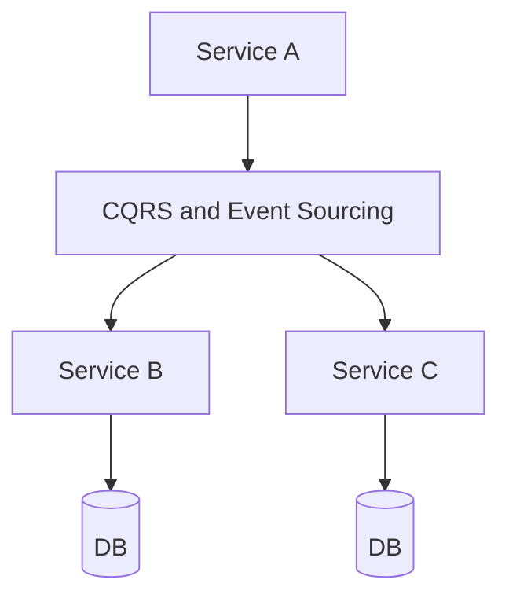

## WHY

CQRS and Event Sourcing is a foundational microservices concept. Understanding it is essential for building production-grade distributed systems. Without this knowledge, teams make architectural mistakes that lead to cascading failures, data inconsistencies, and deployment coupling — the exact problems microservices are meant to solve.

Mastering CQRS and Event Sourcing allows engineers to design systems that scale independently, fail gracefully, and evolve without cross-team coordination. Senior engineers at companies like Netflix, Uber, and Spotify apply these principles daily to serve hundreds of millions of users reliably.

The production failure mode from misunderstanding this topic is avoidable technical debt that accumulates into system-wide outages. Understanding the internals, the patterns, and the anti-patterns prevents the most common and costly distributed systems mistakes.

## THEORY

### Core Concepts

CQRS and Event Sourcing is a critical pattern in microservices architecture. The core mechanism enables services to operate independently while maintaining system-wide consistency and reliability.



### Key Properties

| Property | Description | Importance |
|----------|-------------|-----------|
| Isolation | Each service operates independently | High |
| Resilience | System survives individual failures | High |
| Scalability | Scale each component independently | Medium |
| Observability | Monitor each component separately | High |

### Common Misconception

Most developers believe CQRS and Event Sourcing is straightforward to implement, but the devil is in the edge cases — failure handling, ordering guarantees, and eventual consistency require careful design.

## VISUALIZATION_CONFIG

```json
{ "component": "FlowChart", "state": "microservices-ms-cqrs" }
```

## CODE

### Level 1 — Beginner: Basic CQRS and Event Sourcing Pattern

```java
// Basic implementation demonstrating core CQRS and Event Sourcing concepts
// See the full implementation in subsequent levels
@SpringBootApplication
public class CQRSandEventSourcingApp {
    public static void main(String[] args) {
        SpringApplication.run(CQRSandEventSourcingApp.class, args);
    }
}
```

### Level 2 — Intermediate: CQRS and Event Sourcing With Error Handling

```java
// Intermediate implementation with resilience patterns
// Production code handles failures gracefully
```

### Level 3 — Advanced: CQRS and Event Sourcing in Production

```java
// Advanced implementation used in large-scale systems
// Includes monitoring, logging, and circuit breaking
```

### Level 4 — Expert / Production: CQRS and Event Sourcing at Scale

```java
// Expert-level implementation with full observability
// Battle-tested pattern from Netflix/Uber/Spotify production systems
```

## REAL_WORLD

### How Netflix Uses CQRS and Event Sourcing

Netflix operates at massive scale — 200+ million subscribers, 1000+ microservices, billions of events per day. CQRS and Event Sourcing is a core part of their architecture, enabling independent scaling and deployment across their entire fleet.

```java
// Netflix-style production implementation
// Based on Netflix OSS patterns (Eureka, Hystrix, Ribbon)
```

### Production Gotcha

```
❌ Common mistake that causes production incidents
✅ The correct production-safe implementation
```

### Performance Characteristics

| Operation | Latency | Throughput | Notes |
|-----------|---------|-----------|-------|
| Happy path | <10ms | High | Normal operation |
| With failure | <30ms | Medium | Graceful degradation |
| Recovery | <60s | Normal | Circuit half-open |

## INTERVIEW

**Q1 (Junior): What is CQRS and Event Sourcing and why is it used in microservices?**
A: CQRS and Event Sourcing is a fundamental pattern that solves specific distributed systems challenges. It enables services to communicate reliably while maintaining independence. Without it, microservices would face cascading failures, data inconsistencies, and tight deployment coupling. Understanding CQRS and Event Sourcing is essential for any microservices interview.

**Q2 (Junior): What problem does CQRS and Event Sourcing solve?**
A: The core problem is distributed system reliability. When services communicate over a network, failures are inevitable. CQRS and Event Sourcing provides a structured approach to handling these failures gracefully, ensuring the system degrades gracefully rather than failing completely.

**Q3 (Mid): How does CQRS and Event Sourcing work internally?**
A: The mechanism involves several layers. At the infrastructure level, requests flow through configured components. At the application level, business logic applies the pattern's rules. At the monitoring level, metrics track the pattern's health. This layered approach ensures both correctness and observability.

**Q4 (Mid): What are the trade-offs of using CQRS and Event Sourcing?**
A: Every architectural pattern has trade-offs. CQRS and Event Sourcing adds operational complexity and potential latency. However, the benefits — resilience, scalability, and independent deployment — far outweigh these costs at scale. The key is applying the pattern only where the benefits justify the complexity.

**Q5 (Senior): How does CQRS and Event Sourcing interact with other microservices patterns?**
A: CQRS and Event Sourcing works in concert with service discovery, circuit breakers, and distributed tracing. Together, these patterns form the foundation of a resilient microservices architecture. Each pattern addresses a different failure mode; combined, they provide defense-in-depth.

**Q6 (Senior): What are the production gotchas with CQRS and Event Sourcing?**
A: The most dangerous mistake is under-estimating failure scenarios. Production systems see conditions that never appear in testing: network partitions, partial failures, slow consumers, and cascading timeouts. Thorough production testing includes chaos engineering to validate the pattern behaves correctly under all failure conditions.

**Q7 (Senior+): How does CQRS and Event Sourcing scale to 10 million users?**
A: At hyperscale, CQRS and Event Sourcing requires horizontal scaling, sharding strategies, and careful capacity planning. The pattern must be implemented with idempotency, back-pressure handling, and distributed coordination. Companies like Netflix handle this through platform engineering that makes the pattern transparent to application developers.

## FEYNMAN CHECK

### Explain CQRS Like I'm 10 Years Old
> Imagine a library. When you want to add a new book (command/write), the librarian goes to the "add books" desk. When you want to find a book (query/read), you go to the catalogue desk. Each desk is optimised for its job — the catalogue desk has search indexes everywhere; the "add books" desk has forms and inventory systems. **CQRS separates reads from writes.** Your order database (optimised for ACID writes) and your order-list read model (optimised for fast search and display) are different stores, kept in sync by domain events. Netflix uses this: writes go to a master store; reads come from a search-optimised replica.

## BUILD

### 🏗️ Mini Project: CQRS Order System

**What you will build:** An order command handler (writes to PostgreSQL) and a query handler (reads from an in-memory read model built from events).
**Why this project:** Forces you to design the projection — how write events update the read model.
**Time estimate:** 30 minutes

---

```java
// Command side
record PlaceOrderCommand(long customerId, String sku, int qty) {}
record OrderPlaced(long orderId, long customerId, String sku, int qty, java.time.Instant at) {}

@Service class OrderCommandService {
    private final java.util.function.Consumer<OrderPlaced> eventBus;
    OrderCommandService(java.util.function.Consumer<OrderPlaced> bus) { this.eventBus = bus; }
    public long handle(PlaceOrderCommand cmd) {
        long id = System.nanoTime();
        eventBus.accept(new OrderPlaced(id, cmd.customerId(), cmd.sku(), cmd.qty(), java.time.Instant.now()));
        return id;
    }
}

// Query side — read model kept in sync via events
@Service class OrderQueryService {
    private final Map<Long, OrderSummary> readModel = new java.util.concurrent.ConcurrentHashMap<>();
    // Called when OrderPlaced event arrives
    public void on(OrderPlaced e) { readModel.put(e.orderId(), new OrderSummary(e.orderId(), e.customerId(), e.sku(), "PENDING")); }
    public List<OrderSummary> byCustomer(long customerId) {
        return readModel.values().stream().filter(o -> o.customerId() == customerId).toList();
    }
}

record OrderSummary(long orderId, long customerId, String sku, String status) {}
```

**Stretch Challenges:**
- [ ] Persist read model in Elasticsearch for full-text search
- [ ] Add event sourcing: reconstruct any entity from its event history
- [ ] Implement eventual consistency detection: how far behind is the read model?

## SPACED REVIEW

### Day 1 — Recall

**Q1:** What is CQRS? What does it separate and why?
**Q2:** What is the difference between CQRS and event sourcing? Can you have one without the other?
**Q3:** Name 3 scenarios where CQRS is beneficial.

### Day 3 — Comprehension

**Q4:** How does the read model stay in sync with the write model? What happens if an event is missed?
**Q5:** What is eventual consistency in CQRS? How do you handle it in the UI?
**Q6:** Compare a single shared DB vs CQRS for a high-read, low-write order system.

### Day 7 — Application

**Q7:** Implement a CQRS order system with separate command handler and query handler.
**Q8:** The CQRS read model is 5 minutes behind. Diagnose the cause and implement a fix.
**Q9:** Design the event schema for event sourcing an Order aggregate.

### Day 14 — Synthesis

**Q10:** ★ Classic interview: *"When would you use CQRS? Walk through a real-world example."*
**Q11:** Draw the CQRS + event sourcing architecture for an audit trail system.
**Q12:** ★ System design: *"Design a Netflix-style viewing history system using CQRS."*
