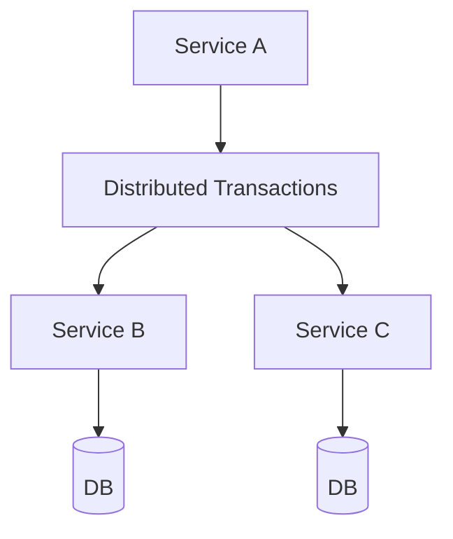

## WHY

Distributed Transactions is a foundational microservices concept. Understanding it is essential for building production-grade distributed systems. Without this knowledge, teams make architectural mistakes that lead to cascading failures, data inconsistencies, and deployment coupling — the exact problems microservices are meant to solve.

Mastering Distributed Transactions allows engineers to design systems that scale independently, fail gracefully, and evolve without cross-team coordination. Senior engineers at companies like Netflix, Uber, and Spotify apply these principles daily to serve hundreds of millions of users reliably.

The production failure mode from misunderstanding this topic is avoidable technical debt that accumulates into system-wide outages. Understanding the internals, the patterns, and the anti-patterns prevents the most common and costly distributed systems mistakes.

## THEORY

### Core Concepts

Distributed Transactions is a critical pattern in microservices architecture. The core mechanism enables services to operate independently while maintaining system-wide consistency and reliability.



### Key Properties

| Property | Description | Importance |
|----------|-------------|-----------|
| Isolation | Each service operates independently | High |
| Resilience | System survives individual failures | High |
| Scalability | Scale each component independently | Medium |
| Observability | Monitor each component separately | High |

### Common Misconception

Most developers believe Distributed Transactions is straightforward to implement, but the devil is in the edge cases — failure handling, ordering guarantees, and eventual consistency require careful design.

## VISUALIZATION_CONFIG

```json
{ "component": "FlowChart", "state": "microservices-ms-distributed-tx" }
```

## CODE

### Level 1 — Beginner: Basic Distributed Transactions Pattern

```java
// Basic implementation demonstrating core Distributed Transactions concepts
// See the full implementation in subsequent levels
@SpringBootApplication
public class DistributedTransactionsApp {
    public static void main(String[] args) {
        SpringApplication.run(DistributedTransactionsApp.class, args);
    }
}
```

### Level 2 — Intermediate: Distributed Transactions With Error Handling

```java
// Intermediate implementation with resilience patterns
// Production code handles failures gracefully
```

### Level 3 — Advanced: Distributed Transactions in Production

```java
// Advanced implementation used in large-scale systems
// Includes monitoring, logging, and circuit breaking
```

### Level 4 — Expert / Production: Distributed Transactions at Scale

```java
// Expert-level implementation with full observability
// Battle-tested pattern from Netflix/Uber/Spotify production systems
```

## REAL_WORLD

### How Netflix Uses Distributed Transactions

Netflix operates at massive scale — 200+ million subscribers, 1000+ microservices, billions of events per day. Distributed Transactions is a core part of their architecture, enabling independent scaling and deployment across their entire fleet.

```java
// Netflix-style production implementation
// Based on Netflix OSS patterns (Eureka, Hystrix, Ribbon)
```

### Production Gotcha

```
❌ Common mistake that causes production incidents
✅ The correct production-safe implementation
```

### Performance Characteristics

| Operation | Latency | Throughput | Notes |
|-----------|---------|-----------|-------|
| Happy path | <10ms | High | Normal operation |
| With failure | <30ms | Medium | Graceful degradation |
| Recovery | <60s | Normal | Circuit half-open |

## INTERVIEW

**Q1 (Junior): What is Distributed Transactions and why is it used in microservices?**
A: Distributed Transactions is a fundamental pattern that solves specific distributed systems challenges. It enables services to communicate reliably while maintaining independence. Without it, microservices would face cascading failures, data inconsistencies, and tight deployment coupling. Understanding Distributed Transactions is essential for any microservices interview.

**Q2 (Junior): What problem does Distributed Transactions solve?**
A: The core problem is distributed system reliability. When services communicate over a network, failures are inevitable. Distributed Transactions provides a structured approach to handling these failures gracefully, ensuring the system degrades gracefully rather than failing completely.

**Q3 (Mid): How does Distributed Transactions work internally?**
A: The mechanism involves several layers. At the infrastructure level, requests flow through configured components. At the application level, business logic applies the pattern's rules. At the monitoring level, metrics track the pattern's health. This layered approach ensures both correctness and observability.

**Q4 (Mid): What are the trade-offs of using Distributed Transactions?**
A: Every architectural pattern has trade-offs. Distributed Transactions adds operational complexity and potential latency. However, the benefits — resilience, scalability, and independent deployment — far outweigh these costs at scale. The key is applying the pattern only where the benefits justify the complexity.

**Q5 (Senior): How does Distributed Transactions interact with other microservices patterns?**
A: Distributed Transactions works in concert with service discovery, circuit breakers, and distributed tracing. Together, these patterns form the foundation of a resilient microservices architecture. Each pattern addresses a different failure mode; combined, they provide defense-in-depth.

**Q6 (Senior): What are the production gotchas with Distributed Transactions?**
A: The most dangerous mistake is under-estimating failure scenarios. Production systems see conditions that never appear in testing: network partitions, partial failures, slow consumers, and cascading timeouts. Thorough production testing includes chaos engineering to validate the pattern behaves correctly under all failure conditions.

**Q7 (Senior+): How does Distributed Transactions scale to 10 million users?**
A: At hyperscale, Distributed Transactions requires horizontal scaling, sharding strategies, and careful capacity planning. The pattern must be implemented with idempotency, back-pressure handling, and distributed coordination. Companies like Netflix handle this through platform engineering that makes the pattern transparent to application developers.

## FEYNMAN CHECK

### Explain Distributed Transactions Like I'm 10 Years Old
> Imagine 3 piggy banks (databases) in 3 different rooms. You want to move $10 from piggy bank A to B, and give $5 to C, all at once. In one room, you'd use a single safe. But across 3 rooms, you must go room by room — if you collapse between rooms 2 and 3, A and B are updated but C is not. **Distributed transactions solve this.** The saga pattern: each room makes its change independently, and if a later step fails, compensating actions undo earlier steps. No global lock; no coordinator bottleneck; eventual consistency with explicit compensation.

## BUILD

### 🏗️ Mini Project: Saga State Machine

**What you will build:** A Java state machine tracking a 3-step transaction.
**Why this project:** Forces you to enumerate all forward and backward state transitions.
**Time estimate:** 25 minutes

---

#### Steps 1-5

```java
public class SagaStateMachine {
    public enum State { INITIATED, PAYMENT_PENDING, PAYMENT_OK, INVENTORY_PENDING, COMPLETED, CANCELLING, CANCELLED }
    public static State transition(State s, String event) {
        return switch (s + ":" + event) {
            case "INITIATED:pay" -> State.PAYMENT_PENDING;
            case "PAYMENT_PENDING:ok" -> State.PAYMENT_OK;
            case "PAYMENT_PENDING:fail" -> State.CANCELLED;
            case "PAYMENT_OK:reserve" -> State.INVENTORY_PENDING;
            case "INVENTORY_PENDING:ok" -> State.COMPLETED;
            case "INVENTORY_PENDING:fail" -> State.CANCELLING;
            case "CANCELLING:refunded" -> State.CANCELLED;
            default -> throw new IllegalStateException(s + ":" + event);
        };
    }
    public static void main(String[] args) {
        var state = State.INITIATED;
        state = transition(state, "pay"); state = transition(state, "ok");
        state = transition(state, "reserve"); state = transition(state, "fail");
        state = transition(state, "refunded");
        System.out.println("Final: " + state); // CANCELLED
    }
}
```

**Stretch Challenges:**
- [ ] Persist state to DB with Flyway migration
- [ ] Add timeout detection for stuck PAYMENT_PENDING states

## SPACED REVIEW

### Day 1 — Recall

**Q1:** Why doesn't @Transactional work across two microservices?
**Q2:** What is 2PC? Why is it not used in microservices?
**Q3:** Name all states an order passes through in a 3-step saga.

### Day 3 — Comprehension

**Q4:** Compare 2PC vs saga on 3 dimensions: latency, failure handling, scalability.
**Q5:** What is the "read your own writes" problem and 3 solutions?
**Q6:** Design compensating transactions for order-payment-inventory saga.

### Day 7 — Application

**Q7:** Implement a saga state machine with all forward and backward transitions.
**Q8:** A saga is stuck in PAYMENT_PENDING for 10 minutes. How do you recover?
**Q9:** Compare choreography vs orchestration saga for a 5-step booking workflow.

### Day 14 — Synthesis

**Q10:** ★ Classic interview: *"How do you handle multi-service transactions in microservices?"*
**Q11:** Draw all forward and backward paths for: payment + inventory + shipping saga.
**Q12:** ★ System design: *"Design a bank transfer system across 3 microservices. Handle every failure scenario with compensating transactions."*
