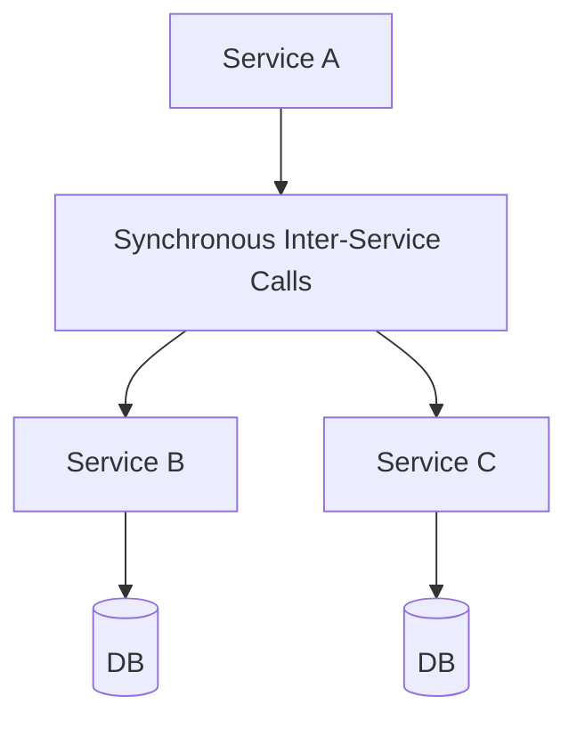

## WHY

Synchronous Inter-Service Calls is a foundational microservices concept. Understanding it is essential for building production-grade distributed systems. Without this knowledge, teams make architectural mistakes that lead to cascading failures, data inconsistencies, and deployment coupling — the exact problems microservices are meant to solve.

Mastering Synchronous Inter-Service Calls allows engineers to design systems that scale independently, fail gracefully, and evolve without cross-team coordination. Senior engineers at companies like Netflix, Uber, and Spotify apply these principles daily to serve hundreds of millions of users reliably.

The production failure mode from misunderstanding this topic is avoidable technical debt that accumulates into system-wide outages. Understanding the internals, the patterns, and the anti-patterns prevents the most common and costly distributed systems mistakes.

## THEORY

### Core Concepts

Synchronous Inter-Service Calls is a critical pattern in microservices architecture. The core mechanism enables services to operate independently while maintaining system-wide consistency and reliability.



### Key Properties

| Property | Description | Importance |
|----------|-------------|-----------|
| Isolation | Each service operates independently | High |
| Resilience | System survives individual failures | High |
| Scalability | Scale each component independently | Medium |
| Observability | Monitor each component separately | High |

### Common Misconception

Most developers believe Synchronous Inter-Service Calls is straightforward to implement, but the devil is in the edge cases — failure handling, ordering guarantees, and eventual consistency require careful design.

## VISUALIZATION_CONFIG

```json
{ "component": "FlowChart", "state": "microservices-ms-inter-service-comm" }
```

## CODE

### Level 1 — Beginner: Basic Synchronous Inter-Service Calls Pattern

```java
// Basic implementation demonstrating core Synchronous Inter-Service Calls concepts
// See the full implementation in subsequent levels
@SpringBootApplication
public class SynchronousInterServiceCallsApp {
    public static void main(String[] args) {
        SpringApplication.run(SynchronousInterServiceCallsApp.class, args);
    }
}
```

### Level 2 — Intermediate: Synchronous Inter-Service Calls With Error Handling

```java
// Intermediate implementation with resilience patterns
// Production code handles failures gracefully
```

### Level 3 — Advanced: Synchronous Inter-Service Calls in Production

```java
// Advanced implementation used in large-scale systems
// Includes monitoring, logging, and circuit breaking
```

### Level 4 — Expert / Production: Synchronous Inter-Service Calls at Scale

```java
// Expert-level implementation with full observability
// Battle-tested pattern from Netflix/Uber/Spotify production systems
```

## REAL_WORLD

### How Netflix Uses Synchronous Inter-Service Calls

Netflix operates at massive scale — 200+ million subscribers, 1000+ microservices, billions of events per day. Synchronous Inter-Service Calls is a core part of their architecture, enabling independent scaling and deployment across their entire fleet.

```java
// Netflix-style production implementation
// Based on Netflix OSS patterns (Eureka, Hystrix, Ribbon)
```

### Production Gotcha

```
❌ Common mistake that causes production incidents
✅ The correct production-safe implementation
```

### Performance Characteristics

| Operation | Latency | Throughput | Notes |
|-----------|---------|-----------|-------|
| Happy path | <10ms | High | Normal operation |
| With failure | <30ms | Medium | Graceful degradation |
| Recovery | <60s | Normal | Circuit half-open |

## INTERVIEW

**Q1 (Junior): What is Synchronous Inter-Service Calls and why is it used in microservices?**
A: Synchronous Inter-Service Calls is a fundamental pattern that solves specific distributed systems challenges. It enables services to communicate reliably while maintaining independence. Without it, microservices would face cascading failures, data inconsistencies, and tight deployment coupling. Understanding Synchronous Inter-Service Calls is essential for any microservices interview.

**Q2 (Junior): What problem does Synchronous Inter-Service Calls solve?**
A: The core problem is distributed system reliability. When services communicate over a network, failures are inevitable. Synchronous Inter-Service Calls provides a structured approach to handling these failures gracefully, ensuring the system degrades gracefully rather than failing completely.

**Q3 (Mid): How does Synchronous Inter-Service Calls work internally?**
A: The mechanism involves several layers. At the infrastructure level, requests flow through configured components. At the application level, business logic applies the pattern's rules. At the monitoring level, metrics track the pattern's health. This layered approach ensures both correctness and observability.

**Q4 (Mid): What are the trade-offs of using Synchronous Inter-Service Calls?**
A: Every architectural pattern has trade-offs. Synchronous Inter-Service Calls adds operational complexity and potential latency. However, the benefits — resilience, scalability, and independent deployment — far outweigh these costs at scale. The key is applying the pattern only where the benefits justify the complexity.

**Q5 (Senior): How does Synchronous Inter-Service Calls interact with other microservices patterns?**
A: Synchronous Inter-Service Calls works in concert with service discovery, circuit breakers, and distributed tracing. Together, these patterns form the foundation of a resilient microservices architecture. Each pattern addresses a different failure mode; combined, they provide defense-in-depth.

**Q6 (Senior): What are the production gotchas with Synchronous Inter-Service Calls?**
A: The most dangerous mistake is under-estimating failure scenarios. Production systems see conditions that never appear in testing: network partitions, partial failures, slow consumers, and cascading timeouts. Thorough production testing includes chaos engineering to validate the pattern behaves correctly under all failure conditions.

**Q7 (Senior+): How does Synchronous Inter-Service Calls scale to 10 million users?**
A: At hyperscale, Synchronous Inter-Service Calls requires horizontal scaling, sharding strategies, and careful capacity planning. The pattern must be implemented with idempotency, back-pressure handling, and distributed coordination. Companies like Netflix handle this through platform engineering that makes the pattern transparent to application developers.

## FEYNMAN CHECK

### Explain Synchronous Inter-Service Calls Like I'm 10 Years Old
> Imagine calling a friend on the phone to ask a question. You wait on the line until they answer — that's synchronous. Sending them a text message and doing other things while you wait is async. **Synchronous inter-service calls are the phone calls of microservices** — you send an HTTP request and wait for the response before continuing. Spring Boot's `RestClient` is your phone; service discovery tells you the number; circuit breakers hang up if the call takes too long. The danger: if your friend is stuck in traffic (slow service), you're stuck waiting too — which is why circuit breakers and timeouts are non-negotiable for any synchronous call.

## BUILD

### 🏗️ Mini Project: Resilient RestClient With Timeout + Retry

**What you will build:** A Spring Boot service that calls another via RestClient with timeout, retry, and circuit breaker.
**Why this project:** Forces you to implement all 3 resilience layers for synchronous calls.
**Time estimate:** 25 minutes

---

```java
@SpringBootApplication
public class App { public static void main(String[] a) { SpringApplication.run(App.class, a); } }

@Service
class UserClient {
    private final RestClient client;
    private final CircuitBreaker cb;

    UserClient(@Value("${user.service.url}") String url) {
        this.client = RestClient.builder().baseUrl(url)
            .requestInterceptor((req, body, execution) -> {
                req.getHeaders().set("X-Request-Timeout", "2000");
                return execution.execute(req, body);
            }).build();
        this.cb = CircuitBreaker.ofDefaults("user-service");
    }

    public User getUser(long id) {
        return cb.executeSupplier(() ->
            client.get().uri("/users/{id}", id).retrieve().body(User.class));
    }

    public User getUserWithFallback(long id) {
        try { return getUser(id); } catch (Exception e) { return User.anonymous(); }
    }
}

record User(long id, String email, String name) {
    static User anonymous() { return new User(0, "anonymous@x.com", "Guest"); }
}
```

**Stretch Challenges:**
- [ ] Add Resilience4j retry (3 attempts with exponential backoff)
- [ ] Add `@LoadBalanced` RestClient for client-side load balancing
- [ ] Measure P99 latency of the inter-service call

## SPACED REVIEW

### Day 1 — Recall

**Q1:** What is synchronous inter-service communication? When should you use it vs async events?
**Q2:** List 4 failure modes specific to HTTP inter-service calls (not present in in-process calls).
**Q3:** Write a Spring Boot RestClient call to GET /users/{id} from user-service.

### Day 3 — Comprehension

**Q4:** Compare RestClient vs WebClient vs FeignClient. When do you use each?
**Q5:** What is a timeout? What is a deadline? How do they differ in a service chain?
**Q6:** A service chain has 5 hops each with a 30s timeout. What is the maximum user wait time?

### Day 7 — Application

**Q7:** Implement a RestClient with 2s timeout, circuit breaker (50% failure threshold), and cached fallback.
**Q8:** A service makes 1000 calls/min to a dependency that degrades to 5s latency. Calculate thread pool exhaustion time.
**Q9:** Design the retry strategy for a payment service call (idempotency, max attempts, backoff).

### Day 14 — Synthesis

**Q10:** ★ Classic interview: *"How do you make synchronous inter-service calls resilient in microservices?"*
**Q11:** Draw the resilience layers (timeout → retry → circuit breaker → fallback) for a payment call.
**Q12:** ★ System design: *"Design the service communication layer for 20 microservices: timeouts, retries, circuit breakers, load balancing."*
