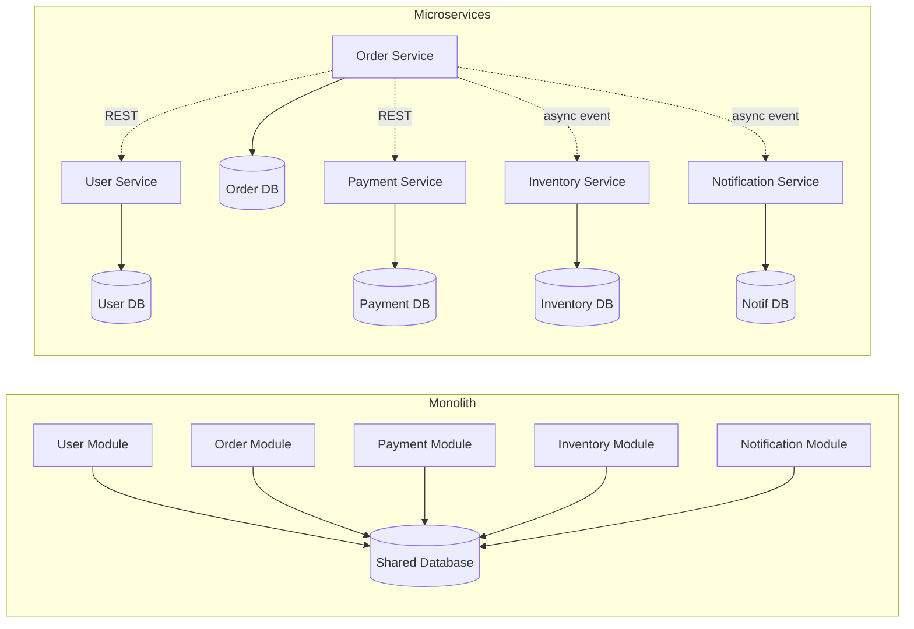

## WHY

Before microservices became mainstream around 2014 (popularised by Netflix, Amazon, and Martin Fowler's seminal article), every large application was a **monolith**: a single deployable artifact containing every feature, every dependency, and every team's code. A 50-engineer team would all commit to the same Git repository, build the same WAR file, and deploy it together every Friday at 2am — because if one team's change broke the build, everyone was blocked. A simple typo in the billing module meant a full redeploy of the entire 2GB application, including the unrelated user-management, search, recommendation, and reporting modules. Releases happened every 2-4 weeks under enormous coordination overhead, and rollbacks meant reverting the entire monolith — losing all teams' changes.

Microservices solve this by decomposing a monolith into many small, independently-deployable services, each owned by a single team, each with its own database, each communicating over the network via REST or messaging. Now the billing team can deploy 50 times a day without touching anyone else's code. The recommendation team can rewrite their service in Python while the rest of the company stays on Java. A bug in search doesn't take down checkout. Teams ship faster, scale independently (Black Friday? scale only the checkout service 100x, not everything), and own their full stack end-to-end.

The production failure mode microservices create is **distributed-system complexity**: every method call that was an in-process function call in the monolith is now a network call that can fail, time out, retry, or silently corrupt data due to partial failures. A single user request that touches 8 services has 8 chances to fail. Without circuit breakers, retries, idempotency keys, distributed tracing, and saga patterns, you trade monolith pain for "death by a thousand cuts" — cascading failures, debugging nightmares spread across 20 service logs, and data inconsistency between services because there's no longer a single ACID transaction. The famous 2017 GitLab incident, the 2021 Fastly outage, and countless smaller incidents trace back to under-investing in microservices' operational complexity.

Senior engineers must understand: when microservices are worth the cost (>50 engineers, multiple deployment cadences, clear bounded contexts), when they are a mistake (early-stage startups, small teams, simple CRUD apps — "monolith first" per Fowler), and the non-negotiable infrastructure investments (CI/CD per service, observability stack, service mesh or API gateway, distributed tracing) without which microservices become a productivity killer.

## THEORY

### Monolith → Microservices Decomposition



### Microservices Architecture — The 8 Pillars

A "real" microservice (not just a small REST API) requires all eight:

| # | Pillar | Why it matters |
|---|--------|---------------|
| 1 | **Single business capability** | One bounded context per service (DDD) |
| 2 | **Own data store** | No shared DB — each service owns its data |
| 3 | **Independently deployable** | Deploy without coordinating with other teams |
| 4 | **Loosely coupled** | Communicate via API contracts, not shared code |
| 5 | **Independently scalable** | Scale each service based on its load profile |
| 6 | **Polyglot allowed** | Each team picks their language/runtime |
| 7 | **Owned by one team** | Conway's Law — team boundary = service boundary |
| 8 | **Failure-tolerant** | Survive other services' outages |

### Synchronous vs Asynchronous Communication

```
Synchronous (REST/gRPC): Caller blocks until callee responds.
  ✅ Simple to reason about
  ❌ Tight coupling (caller depends on callee being UP)
  ❌ Cascading failures
  ❌ Latency adds up across hops

Asynchronous (Events/Messages): Caller publishes event, doesn't wait.
  ✅ Loose coupling (callee can be down — message queues)
  ✅ Better fault tolerance
  ❌ Eventually consistent
  ❌ Harder to debug (no linear stack trace)
```

### Microservices vs Monolith — Detailed Comparison

| Dimension | Monolith | Microservices |
|-----------|----------|---------------|
| Code organisation | Single repo, single artifact | Many repos, many artifacts |
| Deployment | All-or-nothing, weekly | Per-service, hourly |
| Database | Single shared DB | Database per service |
| Transactions | ACID via DB | Saga / eventually consistent |
| Communication | In-process calls | Network calls (REST/Kafka) |
| Tech stack | Uniform | Polyglot allowed |
| Team coordination | High (shared repo) | Low (API contracts only) |
| Operational cost | Low (1 service to run) | High (50+ services) |
| Debugging | Single stack trace | Distributed tracing required |
| Best for team size | 1–20 engineers | 50+ engineers |
| Best for domain | Simple, well-understood | Complex, multiple bounded contexts |

### Common Misconception

> "Microservices are smaller, so they're simpler than a monolith."

**Reality:** Each individual microservice is simpler, but the *system* is dramatically more complex. You traded "one big complicated thing" for "many small things plus a complicated network between them." The complexity didn't go away — it moved into the gaps between services: service discovery, retries, circuit breakers, distributed tracing, eventual consistency, schema evolution, deployment orchestration. A team of 5 engineers running 30 microservices is suffering. The same team running one well-modularized monolith ships features faster. Microservices are a *scaling* solution, not a *simplicity* solution — they pay off only when team coordination cost exceeds operational cost, which typically happens around 50+ engineers across multiple bounded contexts.

## VISUALIZATION_CONFIG

```json
{ "component": "NetworkDiagram", "state": "microservices-ms-intro" }
```

## CODE

### Level 1 — Beginner: A Tiny Spring Boot Microservice

```java
// build.gradle.kts
// plugins {
//     id("org.springframework.boot") version "3.2.0"
//     kotlin("jvm") version "1.9.20"
// }
// dependencies {
//     implementation("org.springframework.boot:spring-boot-starter-web")
// }

package com.shop.userservice;

import org.springframework.boot.SpringApplication;
import org.springframework.boot.autoconfigure.SpringBootApplication;
import org.springframework.web.bind.annotation.*;
import java.util.*;
import java.util.concurrent.ConcurrentHashMap;

@SpringBootApplication
public class UserServiceApplication {
    public static void main(String[] args) {
        SpringApplication.run(UserServiceApplication.class, args);
    }
}

// A microservice is just a focused Spring Boot app — one bounded context, one DB
@RestController
@RequestMapping("/users")
class UserController {

    // In-memory store for demo; real service uses its own DB
    private final Map<Long, User> users = new ConcurrentHashMap<>();
    private long nextId = 1;

    @PostMapping
    public User create(@RequestBody CreateUserRequest req) {
        long id = nextId++;
        User user = new User(id, req.email(), req.name());
        users.put(id, user);
        return user;
    }

    @GetMapping("/{id}")
    public User get(@PathVariable long id) {
        User user = users.get(id);
        if (user == null) throw new RuntimeException("User not found: " + id);
        return user;
    }
}

record User(long id, String email, String name) {}
record CreateUserRequest(String email, String name) {}
```

### Level 2 — Intermediate: Two Microservices Communicating via REST

```java
// === Order Service (calls User Service via REST) ===
package com.shop.orderservice;

import org.springframework.boot.SpringApplication;
import org.springframework.boot.autoconfigure.SpringBootApplication;
import org.springframework.context.annotation.Bean;
import org.springframework.web.bind.annotation.*;
import org.springframework.web.client.*;
import java.util.*;
import java.util.concurrent.ConcurrentHashMap;

@SpringBootApplication
public class OrderServiceApplication {
    public static void main(String[] args) {
        SpringApplication.run(OrderServiceApplication.class, args);
    }

    @Bean
    public RestClient userServiceClient() {
        return RestClient.builder()
            .baseUrl("http://user-service:8080")  // service name in K8s/Docker
            .build();
    }
}

@RestController
@RequestMapping("/orders")
class OrderController {

    private final RestClient userClient;
    private final Map<Long, Order> orders = new ConcurrentHashMap<>();
    private long nextId = 1;

    OrderController(RestClient userClient) {
        this.userClient = userClient;
    }

    @PostMapping
    public Order placeOrder(@RequestBody PlaceOrderRequest req) {
        // 1. Verify the user exists by calling User Service
        UserDto user;
        try {
            user = userClient.get()
                .uri("/users/{id}", req.userId())
                .retrieve()
                .body(UserDto.class);
        } catch (RestClientException e) {
            // Network failure or 4xx/5xx — fail fast with clear error
            throw new RuntimeException("Cannot place order: user lookup failed", e);
        }

        // 2. Create the order owned by THIS service's database
        long id = nextId++;
        Order order = new Order(id, user.id(), user.email(), req.productSku(), req.quantity());
        orders.put(id, order);
        return order;
    }
}

record Order(long id, long userId, String userEmail, String productSku, int quantity) {}
record PlaceOrderRequest(long userId, String productSku, int quantity) {}
record UserDto(long id, String email, String name) {}
```

### Level 3 — Advanced: Resilient REST Call with Circuit Breaker and Timeout

```java
package com.shop.orderservice;

import io.github.resilience4j.circuitbreaker.annotation.CircuitBreaker;
import io.github.resilience4j.retry.annotation.Retry;
import io.github.resilience4j.timelimiter.annotation.TimeLimiter;
import org.springframework.stereotype.Service;
import org.springframework.web.client.*;
import java.time.Duration;
import java.util.Optional;
import java.util.concurrent.CompletableFuture;

/**
 * Production pattern: every inter-service call has timeout + retry + circuit breaker.
 * If user-service is down, we fail fast (circuit open) instead of stacking up threads.
 */
@Service
public class UserClient {

    private final RestClient restClient;

    public UserClient(RestClient userServiceClient) {
        this.restClient = userServiceClient;
    }

    @CircuitBreaker(name = "user-service", fallbackMethod = "fallbackGetUser")
    @Retry(name = "user-service")
    @TimeLimiter(name = "user-service")
    public CompletableFuture<Optional<UserDto>> getUser(long userId) {
        return CompletableFuture.supplyAsync(() -> {
            try {
                UserDto user = restClient.get()
                    .uri("/users/{id}", userId)
                    .retrieve()
                    .body(UserDto.class);
                return Optional.ofNullable(user);
            } catch (HttpClientErrorException.NotFound e) {
                return Optional.empty();  // 404 — user doesn't exist, not an error
            }
        });
    }

    /**
     * Fallback method when circuit is open or all retries exhausted.
     * Must have same signature + Throwable param.
     * Return cached/stale data or a sentinel rather than throwing.
     */
    public CompletableFuture<Optional<UserDto>> fallbackGetUser(long userId, Throwable t) {
        // Production: try a local cache, then a stale-but-survivable response
        return CompletableFuture.completedFuture(Optional.empty());
    }
}

// application.yml
// resilience4j:
//   circuitbreaker:
//     instances:
//       user-service:
//         registerHealthIndicator: true
//         slidingWindowSize: 100
//         minimumNumberOfCalls: 10
//         failureRateThreshold: 50      # 50% failures → open circuit
//         waitDurationInOpenState: 30s  # wait 30s, then half-open
//         permittedNumberOfCallsInHalfOpenState: 3
//   retry:
//     instances:
//       user-service:
//         maxAttempts: 3
//         waitDuration: 200ms
//         exponentialBackoffMultiplier: 2
//   timelimiter:
//     instances:
//       user-service:
//         timeoutDuration: 2s
//         cancelRunningFuture: true

record UserDto(long id, String email, String name) {}
```

### Level 4 — Expert / Production: Event-Driven Microservice with Outbox

```java
package com.shop.orderservice;

import jakarta.persistence.*;
import org.springframework.boot.SpringApplication;
import org.springframework.boot.autoconfigure.SpringBootApplication;
import org.springframework.data.jpa.repository.JpaRepository;
import org.springframework.kafka.core.KafkaTemplate;
import org.springframework.scheduling.annotation.*;
import org.springframework.stereotype.*;
import org.springframework.transaction.annotation.Transactional;
import org.springframework.web.bind.annotation.*;
import java.time.Instant;
import java.util.*;

/**
 * Production microservice pattern:
 *  - Own database (Postgres) for orders
 *  - Transactional Outbox: write event in same TX as business data, publish async later
 *  - Idempotency: requests carry an idempotency key, stored to deduplicate retries
 *  - Async processing: heavy work happens via Kafka, not blocking the HTTP call
 */
@SpringBootApplication
@EnableScheduling
public class OrderServiceApplication {
    public static void main(String[] args) {
        SpringApplication.run(OrderServiceApplication.class, args);
    }
}

@Entity @Table(name = "orders")
class OrderEntity {
    @Id @GeneratedValue(strategy = GenerationType.IDENTITY) Long id;
    @Column(nullable = false) Long userId;
    @Column(nullable = false) String productSku;
    @Column(nullable = false) int quantity;
    @Column(nullable = false) String status;        // PENDING, CONFIRMED, CANCELLED
    @Column(nullable = false, unique = true) String idempotencyKey;
    @Column(nullable = false) Instant createdAt;
    @Version Long version;
    // getters/setters omitted
}

@Entity @Table(name = "outbox_events")
class OutboxEvent {
    @Id @GeneratedValue(strategy = GenerationType.IDENTITY) Long id;
    @Column(nullable = false) String aggregateType;   // "order"
    @Column(nullable = false) String aggregateId;     // order id as string
    @Column(nullable = false) String eventType;       // "OrderPlaced"
    @Column(nullable = false, columnDefinition = "TEXT") String payload;  // JSON
    @Column(nullable = false) Instant createdAt;
    @Column(nullable = false) boolean published;
    // getters/setters omitted
}

interface OrderRepository extends JpaRepository<OrderEntity, Long> {
    Optional<OrderEntity> findByIdempotencyKey(String key);
}

interface OutboxRepository extends JpaRepository<OutboxEvent, Long> {
    List<OutboxEvent> findTop100ByPublishedFalseOrderByCreatedAtAsc();
}

@RestController @RequestMapping("/orders")
class OrderController {
    private final OrderService service;
    OrderController(OrderService service) { this.service = service; }

    @PostMapping
    public OrderEntity placeOrder(
            @RequestHeader("Idempotency-Key") String idempotencyKey,
            @RequestBody PlaceOrderRequest req) {
        return service.placeOrder(idempotencyKey, req);
    }
}

record PlaceOrderRequest(long userId, String productSku, int quantity) {}

@Service
class OrderService {
    private final OrderRepository orders;
    private final OutboxRepository outbox;

    OrderService(OrderRepository orders, OutboxRepository outbox) {
        this.orders = orders;
        this.outbox = outbox;
    }

    /**
     * ATOMIC: order row + outbox event written in same DB transaction.
     * If Kafka is down later, we still committed the order — the publisher will
     * retry the outbox event when Kafka recovers. No lost events, no dual-write bug.
     */
    @Transactional
    public OrderEntity placeOrder(String idempotencyKey, PlaceOrderRequest req) {
        // Idempotency: if this key was already used, return the previously-created order
        Optional<OrderEntity> existing = orders.findByIdempotencyKey(idempotencyKey);
        if (existing.isPresent()) return existing.get();

        OrderEntity order = new OrderEntity();
        order.userId = req.userId();
        order.productSku = req.productSku();
        order.quantity = req.quantity();
        order.status = "PENDING";
        order.idempotencyKey = idempotencyKey;
        order.createdAt = Instant.now();
        orders.save(order);

        OutboxEvent event = new OutboxEvent();
        event.aggregateType = "order";
        event.aggregateId = String.valueOf(order.id);
        event.eventType = "OrderPlaced";
        event.payload = String.format(
            "{\"orderId\":%d,\"userId\":%d,\"sku\":\"%s\",\"qty\":%d}",
            order.id, req.userId(), req.productSku(), req.quantity());
        event.createdAt = Instant.now();
        event.published = false;
        outbox.save(event);

        return order;
    }
}

@Component
class OutboxPublisher {
    private final OutboxRepository outbox;
    private final KafkaTemplate<String, String> kafka;

    OutboxPublisher(OutboxRepository outbox, KafkaTemplate<String, String> kafka) {
        this.outbox = outbox;
        this.kafka = kafka;
    }

    /**
     * Polls outbox table every 500ms, publishes unpublished events to Kafka.
     * Decoupled from request path → API latency stays sub-100ms even if Kafka is slow.
     */
    @Scheduled(fixedDelay = 500)
    @Transactional
    public void publishOutbox() {
        List<OutboxEvent> pending = outbox.findTop100ByPublishedFalseOrderByCreatedAtAsc();
        for (OutboxEvent e : pending) {
            try {
                kafka.send("orders." + e.eventType, e.aggregateId, e.payload).get();
                e.published = true;
                outbox.save(e);
            } catch (Exception ex) {
                // Leave published=false; next tick will retry
                return;  // back off if Kafka is unhealthy
            }
        }
    }
}
```

## REAL_WORLD

### How Netflix Decomposed Its Monolith Into 1000+ Microservices

Netflix's transition from a Java monolith (2008) to AWS-hosted microservices (2012) is the canonical case study. Pre-migration: a single rented data center, a single relational database, weekly deploys, every outage a company-wide event. Their famous 2008 corruption incident took the entire DVD-shipping pipeline down for three days — a single database corruption took down everything. Post-migration: each Netflix UI screen is rendered by 8-20 microservices, each with its own team, database, and deployment pipeline. The Recommendations service, the Personalisation service, the Subscriber service, the Playback service — independent. Netflix deploys thousands of times per day across the fleet.

The infrastructure that made this possible: **Eureka** (service discovery), **Ribbon** (client-side load balancing), **Hystrix** (circuit breakers — now Resilience4j), **Zuul** (API gateway), **Atlas** (metrics), and **Spinnaker** (deployment orchestration). Most of these tools were open-sourced — collectively the "Netflix OSS stack" became the de-facto Spring Cloud blueprint.

```java
// Simplified Netflix-style microservice with all the production essentials
@SpringBootApplication
@EnableDiscoveryClient   // registers with Eureka
@EnableFeignClients      // declarative REST clients
public class PlaybackServiceApp {
    public static void main(String[] args) {
        SpringApplication.run(PlaybackServiceApp.class, args);
    }
}

@FeignClient(name = "user-service")  // resolved via Eureka, not hard-coded URL
interface UserClient {
    @GetMapping("/users/{id}")
    UserDto getUser(@PathVariable("id") long id);
}

@FeignClient(name = "subscription-service")
interface SubscriptionClient {
    @GetMapping("/subscriptions/{userId}/active")
    SubscriptionDto getActiveSubscription(@PathVariable("userId") long userId);
}

@RestController
@RequestMapping("/playback")
class PlaybackController {
    private final UserClient userClient;
    private final SubscriptionClient subClient;

    PlaybackController(UserClient userClient, SubscriptionClient subClient) {
        this.userClient = userClient;
        this.subClient = subClient;
    }

    @GetMapping("/can-watch/{userId}/{titleId}")
    @CircuitBreaker(name = "playback", fallbackMethod = "fallbackCanWatch")
    public PlaybackDecision canWatch(@PathVariable long userId, @PathVariable long titleId) {
        UserDto user = userClient.getUser(userId);
        SubscriptionDto sub = subClient.getActiveSubscription(userId);
        boolean allowed = sub != null && "ACTIVE".equals(sub.status())
                          && !user.parentalLocked();
        return new PlaybackDecision(allowed, sub != null ? sub.tier() : "NONE");
    }

    public PlaybackDecision fallbackCanWatch(long userId, long titleId, Throwable t) {
        // Degraded mode: allow playback if user-service is down — better than zero service
        return new PlaybackDecision(true, "UNKNOWN");
    }
}

record UserDto(long id, String email, boolean parentalLocked) {}
record SubscriptionDto(String status, String tier) {}
record PlaybackDecision(boolean allowed, String tier) {}
```

### Production Gotcha: The Distributed Monolith

```
❌ ANTI-PATTERN — "Microservices" that aren't really microservices
Symptom: 30 services, but every change requires deploying 5+ together because
they share a database schema or call each other synchronously in tight loops.

Concrete example:
  - OrderService.placeOrder() calls UserService → InventoryService → PaymentService
    → ShippingService → NotificationService, all synchronously
  - Any one of them down = entire flow broken (no fault tolerance)
  - Schema change in UserService requires coordinating with 4 other teams
  - Deploys must be ordered: "deploy A before B before C"
  - End result: monolith pain (coordination) + microservice pain (network) — worst of both

✅ FIX — Use the patterns that make services truly independent:
  1. Async communication via Kafka events for non-critical paths
  2. Each service owns its DB schema, exposes only via API
  3. Versioned APIs so callers can upgrade independently
  4. Circuit breakers so failures don't cascade
  5. Idempotent operations so retries are safe
```

**Why it happens:** Teams "split the codebase" without re-architecting the relationships. The Conway's Law boundary is wrong: services are split by *technical layer* (auth-service, db-service, web-service) rather than by *business capability* (ordering, fulfilment, billing). Proper microservice decomposition follows DDD bounded contexts — each service owns a coherent slice of business logic end-to-end.

### Performance Characteristics

| Aspect | Monolith | Microservices |
|--------|----------|---------------|
| Inter-module call latency | ~nanoseconds (in-process) | ~1-10ms (network) |
| Throughput per service | High (no network overhead) | Lower (network + serialisation) |
| Failure isolation | None (one bug crashes all) | High (one service down ≠ all down) |
| Deployment time | 10-30 min (full app) | 1-3 min per service |
| Memory per request | Single heap | Sum of all services on path |
| Debugging time (incident) | Minutes (one log) | Hours (distributed tracing required) |
| Operational headcount | 1-3 SREs for 100 devs | 5-15 SREs for 100 devs |

## INTERVIEW

**Q1 (Junior): What is a microservice and how is it different from a regular REST API?**
A: A microservice is a small, independently-deployable service that owns a single business capability and its own data store, communicating with other services over the network via REST or messaging. The difference from "a regular REST API" is *organisational and architectural*: a REST API can be part of a monolith (just one URL prefix among many in a giant app), while a microservice is a separate process, separate repository, separate deploy pipeline, owned by one team, with its own database. The microservice acronym criteria (per Sam Newman): small, focused, autonomous, decentralised, isolated, owned. A single REST API in a monolith fails none of those.

**Q2 (Junior): When should you NOT use microservices?**
A: You should NOT use microservices when: (1) your team is small (<20 engineers) — operational overhead exceeds coordination savings; (2) your domain is simple and well-understood — a single bounded context means there's nothing to decompose; (3) you don't yet have product-market fit — premature decomposition locks in the wrong boundaries; (4) you don't have CI/CD, observability, and on-call rotation infrastructure ready — you'll spend more time fighting fires than shipping features. Martin Fowler's "Monolith First" advice: start with a modular monolith, decompose only when the team-coordination cost demonstrably exceeds the operational cost. Most startups never need microservices — Basecamp, Shopify, and StackOverflow ran multi-billion-dollar businesses on monoliths for years.

**Q3 (Mid): What's the difference between synchronous (REST) and asynchronous (event-driven) communication between microservices?**
A: **Synchronous** communication (REST, gRPC) means the caller blocks until the callee responds — useful when you need an immediate answer ("does this user exist?"). The trade-off: tight temporal coupling (callee must be UP when caller calls), latency adds up across hops, and failures cascade. **Asynchronous** communication (Kafka, RabbitMQ events) means the caller publishes an event and continues without waiting — useful for decoupled side-effects ("order placed, send notification eventually"). The trade-off: eventual consistency (the notification might arrive seconds later), harder to debug (no linear stack trace), but dramatic improvement in fault tolerance because services can be down without blocking each other. Production microservices use both: REST for query paths needing immediate answers, events for write-side propagation. Pattern: "command in, event out" — commands are sync (return immediately), state changes propagate as async events.

**Q4 (Mid): What is the "Database per Service" rule and why is it strict?**
A: Database per Service means each microservice has its own private database that no other service can access directly — all access goes through the service's API. The strict version forbids: (1) other services querying your DB directly, (2) shared tables, (3) cross-service joins, (4) shared schemas. The reason: a shared database creates implicit coupling that defeats microservices' independence. If OrderService and UserService share a `users` table, you can't change the schema in UserService without coordinating with OrderService. You can't independently scale, can't independently choose a different DB technology, can't independently deploy. Production sometimes relaxes this to "schema per service" within a shared DB cluster (operational simplicity), but never to "shared tables." The pain when violated: 50 services share one DB, schema migrations require all-hands coordination — you've built a distributed monolith.

**Q5 (Senior): Walk through the trade-offs of synchronous orchestration vs. asynchronous choreography for a multi-service business transaction.**
A: **Orchestration** uses a central coordinator (a service or a workflow engine like Camunda/Temporal) that calls each service in order: "OrderService.create → PaymentService.charge → InventoryService.reserve → ShippingService.schedule". Advantages: explicit, easy to reason about, central place for retries and compensations, visible business process. Disadvantages: orchestrator becomes a single point of failure and a knowledge hotspot (one team owns the whole flow). **Choreography** uses events — OrderService publishes `OrderPlaced`, PaymentService subscribes and publishes `PaymentCompleted`, InventoryService subscribes to that and so on. Advantages: no central coordinator, services are loosely coupled, easy to add new subscribers. Disadvantages: flow is implicit (you have to trace event subscriptions across many services to understand the business process), error handling is harder (compensations require explicit "compensate" events). Rule of thumb: orchestration for complex business workflows where the steps matter (insurance claims), choreography for event-driven side-effects (a `UserRegistered` event triggers welcome email + analytics + CRM update independently).

**Q6 (Senior): What is the dual-write problem, and how does the outbox pattern solve it?**
A: Dual-write problem: a microservice needs to atomically (1) update its database AND (2) publish an event to Kafka. These are two different systems with no shared transaction — if the DB commit succeeds but the Kafka publish fails (Kafka down, network blip), you have an inconsistent state: the order exists in your DB but no `OrderPlaced` event was published, so downstream services never know. Conversely, if the publish succeeds but the DB rollback happens, downstream services react to an order that doesn't exist. **Outbox pattern fix**: write the event into an `outbox` table in the SAME DB transaction as the business data. The transaction is fully atomic — either both rows persist or neither. A separate background worker (or change-data-capture tool like Debezium) reads the outbox table and publishes events to Kafka. If Kafka is down, the worker retries; if the worker crashes, it picks up where it left off. The outbox guarantees at-least-once delivery without distributed transactions. Production stacks: PostgreSQL outbox + Debezium → Kafka is the canonical pattern.

**Q7 (Senior+): At what scale do microservices stop adding value and start hurting productivity? How do you decide?**
A: Microservices stop adding value when the operational complexity per service exceeds the team-coordination savings. Concrete signals: (1) developers spend more time updating Helm charts, dashboards, and CI configs than writing features — operational tax exceeds 30% of dev time; (2) most "bug fixes" require coordinating changes across 3+ services; (3) on-call burden grows linearly with services rather than with traffic; (4) the team velocity *decreases* after adding new services. The decision framework: measure deployment cadence per service (target: >1/week per service), measure team coordination (target: <10% of dev time in cross-team meetings), measure mean time to recovery (target: <1 hour). If you're at 100+ services and only deploying each one quarterly, you have too many services — consolidate. The "right size" is typically <100 services for a 200-person company, structured as 1 service per 5-15 engineers (the "two-pizza team" rule). Companies like Shopify deliberately consolidated from a sprawl back to a "modular monolith" because the microservice tax was killing productivity for their domain.

## FEYNMAN CHECK

### Explain Microservices Like I'm 10 Years Old
> Imagine a giant Lego castle made from one solid block — if one tower breaks, you have to rebuild the whole castle. A monolith is that single block. Microservices break the castle into connected pieces — each piece built, fixed, and scaled separately. The tricky part: pieces talk through bridges (network calls) that can fail. When a bridge falls, the kitchen can't tell the dining room there's food. This is why Netflix has entire teams just maintaining the bridges between services — the castle is more flexible, but the bridges are where most complexity lives.

---

### 5 Deep Conceptual Questions

**Q1: What problem do microservices fundamentally solve that better code organisation in a monolith cannot?**
> **A:** Independent deployment cadence and independent scaling. Even a perfectly modular monolith has one CI/CD pipeline, one deployment artifact, and one process to scale. When teams need different release schedules (payments team deploys 50× per day; reports team deploys monthly), or different scaling profiles (checkout needs 100× compute on Black Friday while admin doesn't), a monolith cannot satisfy both without wasteful over-provisioning. Microservices give you the two degrees of freedom — deploy cadence and scaling profile — that no monolith can offer regardless of code organisation.

**Q2: What is the ONE mental model for understanding microservices complexity?**
> **A:** "Every in-process method call that was safe and fast is now a network call that can fail, timeout, return stale data, and adds latency." The entire microservices pattern catalogue (circuit breakers, retries, sagas, outbox, distributed tracing) exists to handle the consequences of this one transformation. Method calls cannot fail with a network timeout; network calls can. Method calls are part of the same transaction; network calls are not. This mental model makes every microservices pattern decision obvious: you need circuit breakers because network calls can fail slowly; you need sagas because network calls break ACID guarantees.

**Q3: What is the most dangerous microservices misconception? Show it with code.**
> **A:** That adding microservices automatically improves reliability.
> ```java
> // ❌ 5-service synchronous chain — reliability DECREASES
> // Each service at 99.9% availability:
> // System availability = 0.999^5 = 99.5% = 43.8 hours downtime/year
> // vs monolith at 99.9% = 8.7 hours/year
>
> // ✅ Microservices improve reliability ONLY with:
> // 1. Circuit breakers on every call
> // 2. Async events for non-critical paths
> // 3. Graceful degradation (return cached/default when dependency is down)
> ```

**Q4: How does the CAP theorem apply to microservices?**
> **A:** Each microservice is its own bounded system that can choose its CAP trade-off independently. An inventory service might choose CP (consistent and partition-tolerant) — it would rather return an error than show incorrect stock levels. A recommendations service might choose AP (available and partition-tolerant) — stale recommendations are better than no recommendations. The database-per-service pattern enables this: each service picks the database (SQL vs NoSQL) and consistency model appropriate for its data. The cross-service challenge: when a business operation spans multiple services, there is no global ACID transaction. You're always in the "P" partition scenario across service boundaries, forcing a choice between C and A at the system level.

**Q5: One-sentence definition of microservices for a senior FAANG engineer.**
> **A:** "A microservices architecture decomposes a system into independently-deployable, loosely-coupled services, each owning a bounded context (DDD), a private data store (database-per-service), and a stable versioned contract (REST/Kafka) — enabling independent team velocity and scaling at the cost of distributed-system complexity that mandates investment in circuit breakers, sagas, outbox patterns, distributed tracing, and operational tooling before the team-coordination savings exceed the operational overhead, which occurs approximately at the 30-50 engineer crossover point."

## BUILD

### 🏗️ Mini Project: Two Microservices in Docker Compose

**What you will build:** A `user-service` and `order-service` running in Docker Compose that communicate via REST, demonstrating the core microservices operational challenge: independent processes, separate ports, service discovery by name.
**Why this project:** Makes the theoretical "network call instead of method call" tangible — you'll see latency, you'll see what happens when user-service is stopped, and you'll understand why circuit breakers exist.
**Time estimate:** 45 minutes

---

#### Step 1 — Project Setup
```bash
mkdir ms-demo && cd ms-demo
mkdir user-service order-service
# Each is a Spring Boot project (use Spring Initializr with: Web, Actuator)
cat > docker-compose.yml << 'EOF'
version: "3.9"
services:
  user-service:
    build: ./user-service
    ports: ["8081:8080"]
    healthcheck:
      test: ["CMD","curl","-f","http://localhost:8080/actuator/health"]
      interval: 5s
      retries: 5
  order-service:
    build: ./order-service
    ports: ["8082:8080"]
    environment:
      USER_SERVICE_URL: http://user-service:8080
    depends_on:
      user-service:
        condition: service_healthy
EOF
```

#### Step 2 — User Service
```java
@SpringBootApplication
public class UserServiceApp { public static void main(String[] a) { SpringApplication.run(UserServiceApp.class, a); } }

@RestController @RequestMapping("/users")
class UserController {
    private final Map<Long, User> users = Map.of(1L, new User(1L, "alice@x.com", "Alice"));
    @GetMapping("/{id}") public ResponseEntity<User> get(@PathVariable long id) {
        return Optional.ofNullable(users.get(id)).map(ResponseEntity::ok).orElse(ResponseEntity.notFound().build());
    }
}
record User(long id, String email, String name) {}
```

#### Step 3 — Order Service Calling User Service
```java
@SpringBootApplication
public class OrderServiceApp { public static void main(String[] a) { SpringApplication.run(OrderServiceApp.class, a); }
    @Bean RestClient userClient(@Value("${USER_SERVICE_URL}") String url) {
        return RestClient.builder().baseUrl(url).build();
    }
}

@RestController @RequestMapping("/orders")
class OrderController {
    private final RestClient userClient;
    OrderController(RestClient u) { this.userClient = u; }

    @PostMapping
    public Order place(@RequestBody PlaceOrder req) {
        User user = userClient.get().uri("/users/{id}", req.userId()).retrieve().body(User.class);
        return new Order(System.nanoTime(), user.id(), user.email(), req.sku());
    }
}
record Order(long id, long userId, String userEmail, String sku) {}
record PlaceOrder(long userId, String sku) {}
record User(long id, String email, String name) {}
```

#### Step 4 — Error Handling
```java
@RestControllerAdvice class ErrorHandler {
    @ExceptionHandler(Exception.class)
    ResponseEntity<Map<String,String>> handle(Exception e) {
        if (e.getMessage().contains("Connection refused") || e.getMessage().contains("unreachable"))
            return ResponseEntity.status(503).body(Map.of("error","user-service unavailable"));
        return ResponseEntity.status(500).body(Map.of("error", e.getMessage()));
    }
}
```

#### Step 5 — Tests
```bash
docker compose up --build -d
curl -X POST http://localhost:8082/orders -H "Content-Type: application/json" -d '{"userId":1,"sku":"SKU-42"}'
# → {"id":...,"userId":1,"userEmail":"alice@x.com","sku":"SKU-42"}

docker compose stop user-service
curl -X POST http://localhost:8082/orders -d '{"userId":1,"sku":"SKU-42"}'
# → 503 {"error":"user-service unavailable"}
```

**Expected Output:**
```
[user-service] Started in 1.8s on port 8080
[order-service] Started in 1.9s on port 8080
POST /orders → 200 {"id":...,"userEmail":"alice@x.com","sku":"SKU-42"}
(after stopping user-service)
POST /orders → 503 {"error":"user-service unavailable"}
```

**Stretch Challenges:**
- [ ] Add Resilience4j circuit breaker so order-service fails fast instead of timing out
- [ ] Add a third notification-service that receives Kafka events when orders are placed
- [ ] Add OpenTelemetry tracing to see the request flow in Jaeger

## SPACED REVIEW

> **How to use:** Answer each question from memory before reading ahead.

---

### Day 1 — Recall

**Q1:** Define a microservice in one sentence including: what it IS, how it differs from a monolith, and when you'd use it.

**Q2:** What are the 8 pillars of a "real" microservice (single capability, own data store, independently deployable, ...)? Name at least 6.

**Q3:** Write the minimal Spring Boot microservice that exposes GET /products/{id}. No autocomplete.

---

### Day 3 — Comprehension

**Q4:** Compare in-process method calls vs. inter-service REST calls. List 5 ways they differ (latency, failure modes, consistency, observability, security).

**Q5:** What is the crossover point (team size) where microservices benefits typically exceed costs? What 3 prerequisites must exist before that crossover becomes valid?

**Q6:** Refactor this monolith endpoint to describe how it would be split into microservices:
```java
@GetMapping("/profile/{userId}")
public UserProfile getProfile(long userId) {
    User user = userRepo.findById(userId);
    List<Order> orders = orderRepo.findByUserId(userId);
    Subscription sub = subRepo.findByUserId(userId);
    return new UserProfile(user, orders, sub);
}
```

---

### Day 7 — Application

**Q7:** Build a 2-service system (catalog + cart) where cart calls catalog to validate products. Handle the catalog-down case gracefully.

**Q8:** A PR adds a 6th synchronous downstream call to an already 3-hop chain. The code works in tests. Explain the production failure mode and fix.

**Q9:** What 4 infrastructure components are mandatory before deploying any microservices to production? Why is each non-negotiable?

---

### Day 14 — Synthesis & Interview Prep

**Q10:** ★ Classic interview: *"When would you choose microservices over a monolith? Walk through your decision criteria."*

**Q11:** Draw a microservices architecture for an e-commerce checkout (user validation, inventory check, payment, order creation, notification). Mark each interaction as sync or async and justify.

**Q12:** ★ System design: *"Netflix streams to 200M users with 1000+ microservices. A new engineer joins and wants to add a recommendation feature. Walk them through: which team owns it, how it gets data, how it publishes results, and what happens when it goes down."*
