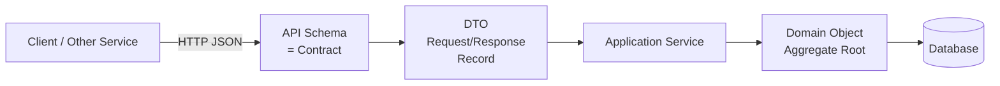

## WHY

In a monolith, method signatures are your interface — the compiler enforces them and any mismatch is caught at build time. In microservices, your interface is a JSON payload sent over the network, and the compiler knows nothing about whether the producer and consumer agree on the schema. A field renamed from `userId` to `user_id` in one service will silently produce null values in every consumer — no compilation error, often no immediate runtime error, just wrong data flowing through production until someone notices that recommendation emails are sending to null addresses. JSON and DTOs are the "interface contract" of microservices, and managing them poorly is one of the most common sources of production incidents.

The specific pain that proper DTO and contract management prevents: **silent breaking changes**. Without a schema registry or contract tests, one team renames a field, deploys, and three downstream services start returning incomplete data without any error logs. The bug shows up as a subtle data quality issue — users seeing blank product names, orders missing customer emails — that takes hours or days to trace back to the schema change. With contract testing (e.g., Pact), the mismatch is caught in CI before deployment.

The production failure mode from DTO mismanagement is **contract drift**: where the actual JSON produced by a service diverges from what consumers expect, accumulating like technical debt until a major version bump is needed. By then, dozens of consumers need coordinated updates. The horror scenario: a "v1 API" that is 3 years old, serving 40 consumers, where the team is afraid to change anything because they don't know which consumers depend on which fields. This is the SOA canonical model problem, reborn in JSON form.

Senior engineers must understand: JSON serialization pitfalls (snake_case vs camelCase, null handling, date formats), consumer-driven contract testing (Pact), schema evolution strategies (backward/forward compatibility), versioning strategies, and the difference between internal DTOs (service-owned) and external API schemas (consumer-contracts).

## THEORY

### DTO vs Domain Model vs API Schema



Each layer has different concerns:

| Layer | Type | Scope | Changes when? |
|-------|------|-------|--------------|
| API Schema | Contract | External-facing | Only with consumer agreement |
| DTO | Data Transfer Object | Service boundary | As needed by the service |
| Domain Object | Business model | Internal | As business rules evolve |
| DB Entity | Persistence model | Private | As data storage needs change |

### JSON Serialization Pitfalls in Spring Boot

```
❌ Common mistake 1: Case mismatch
Service A produces:   { "userId": 123 }    (camelCase — Java default)
Consumer expects:     { "user_id": 123 }   (snake_case — common in Python/Go consumers)
Result: null userId on deserialization

❌ Common mistake 2: Date format inconsistency
Service A produces:   { "createdAt": 1719360000000 }  (epoch millis)
Consumer expects:     { "createdAt": "2024-06-25T10:00:00Z" }  (ISO 8601)
Result: date parsing exception or wrong time zone

❌ Common mistake 3: Unknown field handling
Service A adds:       { "id": 1, "email": "a@b.com", "newField": "X" }
Consumer is strict:   JsonMappingException: unknown field "newField"
Result: deserialization failure breaks all consumers on A's deploy

❌ Common mistake 4: Null vs absent field
Service A returns:    { "id": 1, "optionalNote": null }
Consumer logic:       if (response.optionalNote != null) { ... }
After service removes the field:  { "id": 1 }
Consumer logic: NullPointerException (null != null was handling absence)
```

### Schema Evolution: Backward and Forward Compatibility

| Change Type | Backward Compatible? | Forward Compatible? |
|-------------|---------------------|---------------------|
| Add optional field | ✅ New producers, old consumers | ✅ Old producers, new consumers |
| Add required field | ❌ Old producers don't have it | ✅ |
| Remove field | ❌ Old consumers depend on it | ✅ New producers, old consumers |
| Rename field | ❌ Always breaking | ❌ Always breaking |
| Change field type | ❌ Usually breaking | Depends on type |

### Common Misconception

> "We're fine as long as we use the same language — Java on both sides so types match."

**Reality:** Polyglot systems (Java producer, Python consumer; Go producer, Java consumer) are common in microservices, and even in same-language systems, independent deployment means the two services will be at different versions at any given time. The old producer runs while the new consumer is deployed, and vice versa. Both directions must be compatible simultaneously. The rule: **never remove or rename a field in a deployed API without a compatibility window** of running both versions simultaneously, unless you have verified via consumer-driven contract tests that no consumer depends on it.

## VISUALIZATION_CONFIG
```json
{
  "language": "java",
  "fileName": "Dtos.java",
  "steps": [
    {
      "title": "DTOs separate API from domain",
      "description": "Never expose domain entities directly via REST. DTOs control what is serialized, add validation, and decouple API shape from DB schema.",
      "code": "// Entity (internal, DB-mapped)\n@Entity class Order { Long id; User user; List<Item> items; BigDecimal total; Instant created; }\n// DTO (public API contract)\nrecord OrderResponse(Long id, String customerName, BigDecimal total, String status) {}",
      "diagram": {
        "kind": "boxes",
        "title": "Entity vs DTO",
        "items": [
          {
            "label": "Entity: DB mapping, internal",
            "color": "#818cf8"
          },
          {
            "label": "DTO: API contract, public",
            "color": "#10b981",
            "highlight": true
          },
          {
            "label": "never expose @Entity directly via @RestController",
            "color": "#ef4444"
          }
        ]
      }
    },
    {
      "title": "Jackson — JSON serialization",
      "description": "Jackson converts Java objects to/from JSON. Control field names with @JsonProperty, exclude with @JsonIgnore, handle nulls with @JsonInclude.",
      "code": "@JsonInclude(JsonInclude.Include.NON_NULL)  // exclude null fields\npublic record OrderResponse(\n    @JsonProperty(\"order_id\") Long id,        // rename field\n    String status,\n    @JsonIgnore String internalNote           // exclude from JSON\n) {}",
      "highlight": [
        1,
        3,
        5
      ],
      "diagram": {
        "kind": "boxes",
        "title": "Jackson annotations",
        "items": [
          {
            "label": "@JsonProperty: rename",
            "color": "#818cf8"
          },
          {
            "label": "@JsonIgnore: exclude",
            "color": "#818cf8"
          },
          {
            "label": "@JsonInclude: skip nulls",
            "color": "#10b981",
            "highlight": true
          },
          {
            "label": "@JsonSerialize/@JsonDeserialize: custom",
            "color": "#818cf8"
          }
        ]
      }
    },
    {
      "title": "Input DTOs with validation",
      "description": "Request DTOs should have Bean Validation annotations. Fail fast with clear error messages.",
      "code": "public record CreateOrderRequest(\n    @NotNull UUID customerId,\n    @NotEmpty @Valid List<OrderItemRequest> items,\n    @NotBlank String shippingAddress,\n    @Future Instant requestedDelivery\n) {}\n// @Valid on @RequestBody → violations → 400 Bad Request",
      "highlight": [
        2,
        3,
        4,
        5,
        7
      ],
      "diagram": {
        "kind": "flow",
        "steps": [
          {
            "label": "@Valid triggers Bean Validation",
            "done": true
          },
          {
            "label": "constraint violation found",
            "done": true
          },
          {
            "label": "MethodArgumentNotValidException → 400",
            "active": true
          },
          {
            "label": "ControllerAdvice formats field errors → JSON"
          }
        ]
      }
    },
    {
      "title": "MapStruct — no-boilerplate mapping",
      "description": "MapStruct generates mapping code at compile time between entity and DTO. Zero runtime reflection.",
      "code": "@Mapper(componentModel = \"spring\")\npublic interface OrderMapper {\n    OrderResponse toDto(Order order);\n    Order toEntity(CreateOrderRequest request);\n    // MapStruct generates implementation at compile time\n}",
      "highlight": [
        1,
        3,
        4
      ],
      "diagram": {
        "kind": "boxes",
        "title": "MapStruct",
        "items": [
          {
            "label": "toDto(entity): generated at compile time",
            "color": "#10b981",
            "highlight": true
          },
          {
            "label": "toEntity(dto): zero runtime reflection",
            "color": "#10b981"
          },
          {
            "label": "faster than ModelMapper or manual code",
            "color": "#818cf8"
          }
        ]
      }
    },
    {
      "title": "Versioned DTOs",
      "description": "When the API changes, introduce a new DTO version. Keep old DTOs for backward compatibility.",
      "code": "// v1 (still supported)\nrecord OrderResponseV1(Long id, String status) {}\n// v2 (new fields)\nrecord OrderResponseV2(Long id, String status, BigDecimal total, List<ItemDto> items) {}\n\n@GetMapping(value=\"/{id}\", produces=\"application/vnd.api.v2+json\")\nOrderResponseV2 getOrderV2(@PathVariable Long id) {}",
      "highlight": [
        2,
        4,
        6,
        7
      ],
      "diagram": {
        "kind": "boxes",
        "title": "DTO versioning",
        "items": [
          {
            "label": "OrderResponseV1: old clients",
            "color": "#818cf8"
          },
          {
            "label": "OrderResponseV2: new clients",
            "color": "#10b981",
            "highlight": true
          },
          {
            "label": "both served, old version deprecated over time",
            "color": "#818cf8"
          }
        ]
      }
    }
  ]
}
```

## CODE

### Level 1 — Beginner: Correct DTO Patterns in Spring Boot

```java
import org.springframework.boot.SpringApplication;
import org.springframework.boot.autoconfigure.SpringBootApplication;
import org.springframework.web.bind.annotation.*;
import com.fasterxml.jackson.annotation.*;
import java.time.Instant;

@SpringBootApplication
public class App {
    public static void main(String[] args) { SpringApplication.run(App.class, args); }
}

// ✅ DTO with proper Jackson annotations
@JsonNaming(PropertyNamingStrategies.SnakeCaseStrategy.class)  // consistent casing
@JsonIgnoreProperties(ignoreUnknown = true)  // forward compatible: ignore unknown fields
record OrderResponseDto(
    long orderId,
    long customerId,
    String status,
    @JsonFormat(shape = JsonFormat.Shape.STRING)   // ISO 8601 string, not epoch
    Instant createdAt,
    @JsonInclude(JsonInclude.Include.NON_NULL)   // omit null fields (absent ≠ null)
    String optionalNote
) {}

// ✅ Request DTO — validate inputs
record PlaceOrderRequestDto(
    @com.fasterxml.jackson.annotation.JsonProperty("customer_id") long customerId,
    @com.fasterxml.jackson.annotation.JsonProperty("product_sku") String productSku,
    int quantity
) {}

@RestController
@RequestMapping("/orders")
class OrderController {
    @PostMapping
    public OrderResponseDto place(@RequestBody PlaceOrderRequestDto req) {
        // Request: { "customer_id": 1, "product_sku": "SKU-42", "quantity": 3 }
        // Response: { "order_id": 100, "customer_id": 1, "status": "PENDING",
        //             "created_at": "2024-06-25T10:00:00Z" }
        return new OrderResponseDto(100, req.customerId(), "PENDING", Instant.now(), null);
    }
}
```

### Level 2 — Intermediate: DTO Versioning Strategy

```java
import org.springframework.web.bind.annotation.*;

// Versioning strategy: URI versioning (/v1/ → /v2/)
// Both versions run simultaneously during migration window
@RestController
public class OrderApiController {

    // v1 API — kept for backward compatibility
    @GetMapping("/v1/orders/{id}")
    public OrderV1Dto getV1(@PathVariable long id) {
        return new OrderV1Dto(id, "CONFIRMED", "2024-06-25");  // v1 used date string
    }

    // v2 API — new version with improvements
    @GetMapping("/v2/orders/{id}")
    public OrderV2Dto getV2(@PathVariable long id) {
        return new OrderV2Dto(id, "CONFIRMED", java.time.Instant.now(), 2999L, "USD");
    }
}

// v1 schema — kept as-is, never changed
record OrderV1Dto(long orderId, String status, String date) {}

// v2 schema — improvements: Instant instead of date string, added total and currency
record OrderV2Dto(long orderId, String status, java.time.Instant createdAt,
                  long totalCents, String currency) {}

// Migration strategy:
// 1. Deploy v2 endpoint alongside v1 (running both)
// 2. Notify consumers to migrate to v2 with deadline
// 3. Track v1 usage via metrics (Prometheus counter per version)
// 4. When v1 traffic = 0 and deadline passed: deprecate v1
// 5. Next release: remove v1 (one release after deprecation notice)
```

### Level 3 — Advanced: Consumer-Driven Contract Testing with Pact

```java
// build.gradle.kts (consumer side)
// testImplementation("au.com.dius.pact.consumer:junit5:4.6.7")

import au.com.dius.pact.consumer.dsl.*;
import au.com.dius.pact.consumer.junit5.*;
import au.com.dius.pact.core.model.*;
import au.com.dius.pact.core.model.annotations.Pact;
import org.junit.jupiter.api.*;
import org.springframework.web.client.RestClient;

/**
 * Consumer-driven contract test: order-service (consumer) defines
 * what it expects from user-service (provider).
 * This contract is published to a Pact Broker, where user-service verifies against it.
 */
@ExtendWith(PactConsumerTestExt.class)
@PactTestFor(providerName = "user-service")
class OrderServicePactConsumerTest {

    @Pact(consumer = "order-service")
    public RequestResponsePact getUser(PactDslWithProvider builder) {
        return builder
            .given("user 1 exists and is active")
            .uponReceiving("a request for user 1")
                .path("/users/1")
                .method("GET")
            .willRespondWith()
                .status(200)
                .body(new PactDslJsonBody()
                    .numberType("id", 1L)
                    .stringType("email", "alice@example.com")
                    .stringType("name", "Alice")
                    // ⚠️ The consumer ONLY specifies fields it ACTUALLY USES
                    // If user-service adds new fields, the consumer contract is unaffected
                    // (JsonIgnoreProperties(ignoreUnknown=true) handles unknown fields)
                )
            .toPact();
    }

    @Test
    @PactTestFor(pactMethod = "getUser")
    void orderServiceCanFetchUserFromUserService(MockServer mockServer) {
        RestClient client = RestClient.builder()
            .baseUrl(mockServer.getUrl())
            .build();

        UserDto user = client.get().uri("/users/1").retrieve().body(UserDto.class);

        // Consumer verifies it can process the response correctly
        Assertions.assertNotNull(user);
        Assertions.assertNotNull(user.email());
        Assertions.assertTrue(user.email().contains("@"));
    }

    record UserDto(long id, String email, String name) {}
}

// On the PROVIDER side (user-service), Pact verifies the consumer's expectations:
// @Provider("user-service")
// @PactBroker(url = "https://pact-broker.company.com")
// class UserServicePactProviderTest {
//     @TestTemplate
//     @ExtendWith(PactVerificationInvocationContextProvider.class)
//     void pactVerificationTestTemplate(PactVerificationContext context) {
//         context.verifyInteraction();
//     }
// }
```

### Level 4 — Expert / Production: Contract Registry + Schema Evolution Guard

```java
package com.shop.contracts;

import com.fasterxml.jackson.databind.JsonNode;
import com.fasterxml.jackson.databind.ObjectMapper;
import java.util.*;
import java.util.stream.*;

/**
 * Production contract registry: tracks all API schemas, validates evolution safety.
 * Integrates with CI pipeline to block deployments that break existing contracts.
 * In production: schemas are stored in a Git repo or a Confluent Schema Registry.
 */
public class ContractRegistry {

    public record FieldSchema(String name, String type, boolean required) {}
    public record ApiSchema(String service, String endpoint, String version,
                             List<FieldSchema> fields) {}

    public record EvolutionResult(boolean safe, List<String> breakingChanges,
                                   List<String> safeChanges) {}

    /**
     * Checks if the new schema is backward-compatible with the old schema.
     * Backward compatible = old consumers can still consume new producer's responses.
     */
    public static EvolutionResult checkBackwardCompatibility(
            ApiSchema oldSchema, ApiSchema newSchema) {

        List<String> breakingChanges = new ArrayList<>();
        List<String> safeChanges = new ArrayList<>();

        Map<String, FieldSchema> oldFields = oldSchema.fields().stream()
            .collect(Collectors.toMap(FieldSchema::name, f -> f));
        Map<String, FieldSchema> newFields = newSchema.fields().stream()
            .collect(Collectors.toMap(FieldSchema::name, f -> f));

        // BREAKING: removed a field (consumers may depend on it)
        for (String oldField : oldFields.keySet()) {
            if (!newFields.containsKey(oldField)) {
                breakingChanges.add("❌ REMOVED field '" + oldField + "' — consumers may depend on it");
            }
        }

        // BREAKING: changed type of existing field
        for (Map.Entry<String, FieldSchema> e : oldFields.entrySet()) {
            FieldSchema newField = newFields.get(e.getKey());
            if (newField != null && !newField.type().equals(e.getValue().type())) {
                breakingChanges.add("❌ TYPE CHANGE field '" + e.getKey() + "': "
                    + e.getValue().type() + " → " + newField.type());
            }
        }

        // BREAKING: added a REQUIRED field (old producers won't have it)
        for (Map.Entry<String, FieldSchema> e : newFields.entrySet()) {
            if (!oldFields.containsKey(e.getKey()) && e.getValue().required()) {
                breakingChanges.add("❌ ADDED REQUIRED field '" + e.getKey()
                    + "' — old producers don't have it; consumers expecting it will fail");
            }
        }

        // SAFE: added optional field
        for (Map.Entry<String, FieldSchema> e : newFields.entrySet()) {
            if (!oldFields.containsKey(e.getKey()) && !e.getValue().required()) {
                safeChanges.add("✅ ADDED OPTIONAL field '" + e.getKey() + "' — backward compatible");
            }
        }

        return new EvolutionResult(breakingChanges.isEmpty(), breakingChanges, safeChanges);
    }

    public static void main(String[] args) {
        ApiSchema v1 = new ApiSchema("order-service", "GET /orders/{id}", "v1",
            List.of(
                new FieldSchema("orderId", "long", true),
                new FieldSchema("status", "string", true),
                new FieldSchema("total", "long", true)
            ));

        ApiSchema v2Backward = new ApiSchema("order-service", "GET /orders/{id}", "v2",
            List.of(
                new FieldSchema("orderId", "long", true),
                new FieldSchema("status", "string", true),
                new FieldSchema("total", "long", true),
                new FieldSchema("currency", "string", false)  // ✅ new optional field
            ));

        ApiSchema v2Breaking = new ApiSchema("order-service", "GET /orders/{id}", "v2",
            List.of(
                new FieldSchema("order_id", "long", true),   // ❌ renamed
                new FieldSchema("status", "string", true)
                // ❌ removed "total"
            ));

        System.out.println("=== v1 → v2 (backward compatible) ===");
        var r1 = checkBackwardCompatibility(v1, v2Backward);
        System.out.println("Safe: " + r1.safe());
        r1.safeChanges().forEach(System.out::println);
        r1.breakingChanges().forEach(System.out::println);

        System.out.println("\n=== v1 → v2 (breaking) ===");
        var r2 = checkBackwardCompatibility(v1, v2Breaking);
        System.out.println("Safe: " + r2.safe());
        r2.breakingChanges().forEach(System.out::println);
    }
}
```

## REAL_WORLD

### How Stripe Manages API Backward Compatibility for 10+ Years

Stripe is the gold standard for API backward compatibility. Their REST API has served billions of API calls and maintained backward compatibility since 2011, with a versioning policy that is a masterclass in contract management. Key principles: (1) **Date-based versioning** (`2024-06-01`) — each API version is a point-in-time snapshot of the API schema; customers pin to a version and their code never breaks; (2) **Additive-only changes by default** — new fields are added; existing fields are never removed or renamed in the pinned version; (3) **Stripe-version header** — consumers specify which version they want; old versions are maintained indefinitely; (4) **Deprecation warnings** — fields marked deprecated return a warning header 12+ months before removal.

```java
// Stripe-style API versioning in Spring Boot
@RestController
@RequestMapping("/v1/orders")
class OrderApiController {

    // Versioned via Stripe-Version header
    @GetMapping("/{id}")
    public Object getOrder(
            @PathVariable long id,
            @RequestHeader(value = "Stripe-Version", defaultValue = "2024-06-01") String version) {

        // Route to appropriate schema based on requested version
        return switch (version) {
            case "2022-01-01" -> buildV2022Response(id);
            case "2023-01-01" -> buildV2023Response(id);
            case "2024-06-01" -> buildV2024Response(id);
            default -> buildV2024Response(id);  // default to latest
        };
    }

    private OrderV2022Dto buildV2022Response(long id) {
        return new OrderV2022Dto(id, "CONFIRMED", "2024-06-25");
    }
    private OrderV2023Dto buildV2023Response(long id) {
        return new OrderV2023Dto(id, "CONFIRMED", java.time.Instant.now(), 2999L);
    }
    private OrderV2024Dto buildV2024Response(long id) {
        return new OrderV2024Dto(id, "CONFIRMED", java.time.Instant.now(), 2999L, "USD", null);
    }
}

record OrderV2022Dto(long orderId, String status, String date) {}
record OrderV2023Dto(long orderId, String status, java.time.Instant createdAt, long totalCents) {}
record OrderV2024Dto(long orderId, String status, java.time.Instant createdAt,
                     long totalCents, String currency, String optionalNote) {}
```

### Production Gotcha: Date/Time Serialization Disaster

```java
// ❌ DANGEROUS — Java Date serialized as epoch milliseconds by default
import java.util.Date;

record OrderResponse(long id, String status, Date createdAt) {}
// Produces: { "id": 1, "status": "OK", "createdAt": 1719360000000 }
// Consumer in Python: datetime.fromtimestamp(1719360000000)  → WRONG (should be /1000)
// Consumer in JavaScript: new Date(1719360000000)  → Correct (JS uses ms)
// → Different consumers get different results from the same JSON

// ❌ Also dangerous — java.time.LocalDateTime is ambiguous (no timezone)
import java.time.LocalDateTime;
record OrderResponse2(long id, String status, LocalDateTime createdAt) {}
// Produces: { "createdAt": "2024-06-25T10:00:00" }  — no timezone!
// If server is UTC+5 and consumer is UTC, they disagree on the actual moment

// ✅ CORRECT — java.time.Instant with ISO 8601 string format
import java.time.Instant;
import com.fasterxml.jackson.annotation.JsonFormat;

record OrderResponse3(
    long id,
    String status,
    @JsonFormat(shape = JsonFormat.Shape.STRING, timezone = "UTC")
    Instant createdAt  // always UTC, ISO 8601: "2024-06-25T10:00:00Z"
) {}
// Produces: { "createdAt": "2024-06-25T10:00:00Z" } — unambiguous in any language

// application.yml — enforce globally:
// spring:
//   jackson:
//     serialization:
//       write-dates-as-timestamps: false
//     time-zone: UTC
```

**Why it happens:** Java's default Jackson serialization was designed for Java-to-Java communication where epoch millis work fine. Microservices introduce polyglot consumers. The date/time mismatch is one of the most common inter-service bugs: it doesn't cause exceptions (both sides parse successfully), just produces wrong dates in a way that's hard to notice until users see "your order was placed on January 1, 1970."

### Performance Characteristics

| Operation | Overhead | Notes |
|-----------|---------|-------|
| JSON serialization (100-field object) | ~50-200µs | Measured at field count |
| JSON deserialization | ~50-200µs | |
| Pact contract verification (CI) | 1-3 min | Per service pair |
| Protobuf serialization (equivalent) | 10-30µs | 5-10× faster than JSON |
| Gzip compression (REST response) | -60-80% payload size | Worth enabling for large responses |

## INTERVIEW

**Q1 (Junior): What is a DTO and why do microservices use them?**
A: A DTO (Data Transfer Object) is a simple data carrier object used to transfer data between service boundaries — it contains only fields (no business logic) and is designed specifically for serialization to/from JSON. Microservices use DTOs to decouple the network representation from the domain model: the domain object (`Order`) has business methods and invariants; the DTO (`OrderResponseDto`) is a flat, JSON-friendly representation. This decoupling is essential: domain models should be allowed to evolve (fields added, renamed, refactored) without breaking the API contract consumers depend on. The DTO is the "contract layer" between the service's internal implementation and its external consumers. In Spring Boot, DTOs are typically Java records or simple POJOs annotated with Jackson annotations for serialization control.

**Q2 (Junior): What are two common JSON serialization pitfalls in Spring Boot?**
A: (1) **Date/time format ambiguity**: Java's `Date` serializes as epoch milliseconds by default; `LocalDateTime` serializes without timezone. Both cause cross-language bugs. Fix: use `Instant` with `@JsonFormat(shape=STRING)` and `write-dates-as-timestamps: false` in `application.yml`, producing unambiguous ISO 8601 UTC strings. (2) **Unknown field exceptions**: by default, Jackson throws `JsonMappingException` when a consumer receives a field it doesn't have in its DTO class. This means adding any new field to a producer breaks all consumers who haven't yet updated. Fix: annotate all DTO classes with `@JsonIgnoreProperties(ignoreUnknown = true)` — consumers can ignore fields they don't understand, making the contract forward-compatible.

**Q3 (Mid): What is consumer-driven contract testing and how does Pact implement it?**
A: Consumer-driven contract testing (CDCT) is a testing pattern where the *consumer* defines the contract — specifying exactly which fields and behaviors it depends on — and the *provider* verifies that its implementation satisfies every consumer's contract. Pact implements this in two phases: (1) **Consumer test**: the consumer writes a Pact test that creates a mock of the provider, specifies the expected request and response (only the fields the consumer actually uses), and verifies the consumer code works with that response; (2) **Provider verification**: the Pact contract is published to a Pact Broker; the provider runs `pact:verify` in CI, which calls the provider's real implementation with each consumer's expected request and verifies the response matches. If the provider adds a field the consumer doesn't use, the contract still passes (forward-compatible). If the provider removes a field the consumer uses, the contract fails — the CI pipeline blocks the deploy. This gives teams confidence to evolve independently.

**Q4 (Mid): How do you handle schema evolution without breaking consumers?**
A: Four rules: (1) **Only add, never remove**: new fields are always optional and backward-compatible; removed fields break consumers; run both versions simultaneously during migration; (2) **Never rename**: renaming breaks serialization for both old consumers (they don't see the renamed field) and new consumers (they see the field with the old name from old producers). If rename is necessary: add new field, deprecate old, wait for all consumers to migrate, then remove; (3) **Mark new fields optional**: never add a required field — old producers won't have it, breaking new consumers; (4) **Consumers must be tolerant readers**: always annotate with `@JsonIgnoreProperties(ignoreUnknown=true)` so new producer fields don't break old consumers. For event schemas: same rules apply — Avro with a schema registry enforces backward/forward compatibility automatically; Protobuf uses field numbers (never reuse, never delete).

**Q5 (Senior): Compare REST/JSON, Avro/Protobuf, and CloudEvents for inter-service messaging.**
A: **REST/JSON**: human-readable, universal, tooling is excellent (Swagger/OpenAPI, every language); no built-in schema enforcement — teams must use contract tests or schema registries. Overhead: ~100-200µs serialization, large payload sizes. Best for: external APIs, human-readable audit trails, cross-company APIs. **Avro/Protobuf**: binary serialization, 5-10× faster than JSON, 3-10× smaller payloads; schema is enforced by the format (Protobuf: field numbers; Avro: schema registry validates compatibility). No human readability without tools. Best for: high-throughput internal event streams (Kafka topics where volume matters), gRPC service-to-service calls. **CloudEvents**: a CNCF standard specification for event metadata (`specversion`, `type`, `source`, `id`, `time`) — not a serialization format but a contract for how events are described. Combines with JSON/Avro/Protobuf for the data. Best for: creating a consistent event bus across services, especially for event-driven architectures where event routing requires standard metadata. Production pattern: REST/JSON for synchronous APIs (external and internal), Avro on Kafka for async event streams, CloudEvents spec for the event envelope.

**Q6 (Senior): A producer service renamed a field from `userId` to `user_id`. 40 consumers exist. Walk through the migration strategy.**
A: Never rename a field in-place — it always breaks consumers. Safe migration: (1) **Add** the new field name (`user_id`) alongside the old field name (`userId`) in the JSON response — both are present; (2) **Notify** all 40 consumer teams with a timeline ("migrate to `user_id` by date X, `userId` will be removed in release Y+1"); (3) **Track** usage of each field via metrics (`userId` field access count, logged or monitored via APM); (4) **Verify** via Pact broker that no consumer still references `userId` in their contract — when all contracts reference only `user_id`, it's safe to remove; (5) **Remove** `userId` field in the next major API version; (6) **Update** the API version or add a deprecation header to any consumers still using the old field. Total timeline: typically 1-6 months depending on team count and release cadence. Shortcut: if all consumers are internal and use the Pact broker, steps 2-4 can be verified programmatically.

**Q7 (Senior+): How do you implement zero-downtime API migration in a system with 40 consumers and no downtime tolerance?**
A: Four-phase process: (1) **Expand** (backward-compatible): add new field alongside old; deploy producer; all consumers still work; (2) **Migrate** (asynchronous): notify all consumers, give them a migration window (weeks or months); track usage via API metrics dashboard; automatically detect consumers still using old fields via Pact contracts or request-level field-access logging; (3) **Contract** (verify): run Pact broker `can-i-deploy` check before any producer change — verifies all registered consumers' contracts still pass; block the producer deploy if any consumer contract fails; (4) **Shrink** (remove old): once all consumer contracts no longer reference the old field, remove it; deploy producer; no consumers break because they've all migrated. Key tooling: Pact Broker for contract verification, Confluent Schema Registry (if using Kafka) for schema enforcement, API gateway metrics for field-level usage tracking. At Stripe's scale, the "never remove" policy for external APIs simplifies this dramatically: they maintain backward compatibility indefinitely, only clients explicitly opt-in to API version upgrades.

## FEYNMAN CHECK

### Explain JSON, DTOs and Contracts Like I'm 10 Years Old

> Imagine two penpals who send letters (services sending JSON). They agreed that every letter will have three things: a "sender name," a "message," and a "date." One day, one penpal changes their letter format and uses "author" instead of "sender name." Their penpal gets the letter and says "where's the sender name? I don't understand!" — the letter is broken because they changed the agreement without telling the other person. **A DTO is the official letter template.** A contract is the agreement about what the template must always include. If you want to add a new field, that's fine — the receiver just ignores what they don't know. But if you remove or rename a field, you must tell everyone who reads your letters first, and wait until they're ready, before you change it.

---

### 5 Deep Conceptual Questions

**Q1: Why is renaming a JSON field more dangerous than adding one?**
> **A:** Adding a field is backward-compatible — consumers using `@JsonIgnoreProperties(ignoreUnknown=true)` simply ignore it; consumers who want it can start using it. Renaming is a breaking change in both directions simultaneously: old consumers expecting the old field name will get null/empty (no compile error, silent data corruption); new consumers expecting the new field name won't work with old producers still using the old name. Since in microservices there's always a window where old and new versions are both running (rolling deploys), a rename creates a compatibility window of zero — some consumers will be broken at all times during the deploy. The safe procedure for a rename is a 3-step expand-migrate-shrink over weeks, never an in-place rename.

**Q2: What is the ONE mental model that makes contract testing click?**
> **A:** "The consumer specifies what it actually needs; the provider verifies it delivers exactly that." The key word is "actually" — not what the provider thinks the consumer needs, but what the consumer explicitly declares in the contract test. This inverts the usual test responsibility: instead of the provider writing "here's what I produce, hope consumers are happy," the consumer writes "here's what I need from the provider," and the provider must satisfy it. The model: each service has a contract test suite that describes its expectations of every service it calls. These contracts are the living documentation of every inter-service dependency, machine-verifiable and CI-enforced. When a provider makes a change, CI runs all consumer contract verifications — if any consumer's contract fails, the deploy is blocked before reaching production.

**Q3: What is the most dangerous JSON serialization mistake? Show it.**
> **A:** Missing `@JsonIgnoreProperties(ignoreUnknown=true)` causes deployment-order dependencies.
> ```java
> // ❌ DANGEROUS — strict deserialization (Jackson's default)
> // consumer-service/UserDto.java
> record UserDto(long id, String email) {}  // no @JsonIgnoreProperties
>
> // user-service adds new field "preferredLanguage"
> // Before updating consumer-service, deploys new version:
> // Response: { "id": 1, "email": "a@b.com", "preferredLanguage": "en" }
> // consumer-service: Jackson throws UnrecognizedPropertyException
> // consumer-service is DOWN until it redeploys with updated UserDto
> // This forces coordinated deployment — defeats microservices independence
>
> // ✅ CORRECT
> @JsonIgnoreProperties(ignoreUnknown = true)  // tolerant reader
> record UserDto(long id, String email) {}
> // Now user-service can add "preferredLanguage" any time.
> // consumer-service silently ignores it until it's ready to use it.
> // Deploy order doesn't matter.
> ```

**Q4: How do DTOs interact with domain models at the service layer?**
> **A:** The service layer is the boundary where DTOs are mapped to domain objects and back. The mapping direction: inbound → DTO to domain command (e.g., `PlaceOrderRequestDto` → `PlaceOrderCommand` → `Order`); outbound → domain object to response DTO (e.g., `Order` → `OrderResponseDto`). This double-mapping keeps concerns separated: the DTO only cares about serialization (Jackson annotations, null handling, date format); the domain object only cares about business rules (no Jackson annotations, rich methods, invariant enforcement). The service translates between them. The boundary means: when the API schema needs to change (e.g., rename a field in the response), only the DTO and the service layer mapping change — the domain model is untouched. When business rules change, only the domain model changes — the DTO and API schema are untouched.

**Q5: One-sentence definition of DTOs and contracts for a senior FAANG engineer.**
> **A:** "DTOs are the serialization-layer representation of service boundaries — decoupling the domain model's internal richness from the JSON contract that consumers depend on — whose evolution must follow strict backward/forward compatibility rules (add-only, never-rename, always-optional for new fields, `@JsonIgnoreProperties(ignoreUnknown=true)` on all consumer deserializers) enforced via consumer-driven contract testing (Pact broker `can-i-deploy` gate in CI) or schema registry validation (Confluent Schema Registry for Avro/Protobuf), preventing the silent breaking-change pattern where field renames produce null values in downstream consumers without any exception, manifesting only as data quality bugs detectable only through user complaints days after deployment."

## BUILD

### 🏗️ Mini Project: Contract Test + Schema Evolution Validator

**What you will build:** A working Pact consumer contract test for an order-service that calls a user-service, plus a schema evolution checker that enforces backward-compatibility rules.
**Why this project:** Forces you to write the exact tests that prevent the "renaming a field breaks 40 consumers" production incident. This is the actual CI gate used at Stripe, Netflix, and any mature microservices org.
**Time estimate:** 30 minutes

---

#### Step 1 — Setup

```bash
mkdir contract-testing && cd contract-testing
mkdir -p consumer/src/test/java/com/contracts
mkdir -p validator/src/main/java/com/evolution
touch consumer/src/test/java/com/contracts/UserServiceContractTest.java
touch validator/src/main/java/com/evolution/{SchemaField,SchemaEvolutionChecker,Main}.java
```

#### Step 2 — Contract Test

```java
package com.contracts;

import com.fasterxml.jackson.annotation.JsonIgnoreProperties;
import org.junit.jupiter.api.Test;
import org.springframework.web.client.RestClient;
import static org.junit.jupiter.api.Assertions.*;

// Simplified Pact-style contract test (no Pact library needed for the demo)
class UserServiceContractTest {
    // Consumer (order-service) specifies exactly what it needs from user-service
    record UserContractDto(long id, String email, String name) {} // only these 3 fields

    @Test
    void orderServiceCanDeserializeUserServiceResponse() {
        // Simulate user-service response with EXTRA fields (as if user-service is newer)
        String json = "{\"id\":1,\"email\":\"alice@x.com\",\"name\":\"Alice\","
                    + "\"preferredLanguage\":\"en\",\"segment\":\"VIP\"}";

        com.fasterxml.jackson.databind.ObjectMapper mapper = new com.fasterxml.jackson.databind.ObjectMapper();
        // Consumer DTO must tolerate unknown fields
        try {
            // Should NOT throw even with extra fields
            UserContractDto user = mapper.readValue(json, UserContractDto.class);
            assertEquals(1, user.id());
            assertEquals("alice@x.com", user.email());
        } catch (Exception e) {
            fail("Consumer broke on new fields: " + e.getMessage()
                + " — fix: add @JsonIgnoreProperties(ignoreUnknown=true)");
        }
    }
}
```

#### Step 3 — Schema Evolution Checker

```java
package com.evolution;
import java.util.*;

public class SchemaEvolutionChecker {
    public record Field(String name, String type, boolean required) {}

    public static List<String> checkCompatibility(List<Field> old, List<Field> updated) {
        List<String> violations = new ArrayList<>();
        var oldMap = new java.util.stream.Collectors.toMap(Field::name, f -> f, (a, b) -> a, HashMap::new);
        var oldFields = new HashMap<String, Field>();
        old.forEach(f -> oldFields.put(f.name(), f));

        // Removed fields — breaking
        old.forEach(f -> {
            if (updated.stream().noneMatch(n -> n.name().equals(f.name()))) {
                violations.add("❌ REMOVED: '" + f.name() + "' — breaking change");
            }
        });

        // Type changes — breaking
        updated.forEach(n -> {
            Field o = oldFields.get(n.name());
            if (o != null && !o.type().equals(n.type())) {
                violations.add("❌ TYPE CHANGED: '" + n.name() + "' " + o.type() + " → " + n.type());
            }
        });

        // New required fields — breaking
        updated.forEach(n -> {
            if (!oldFields.containsKey(n.name()) && n.required()) {
                violations.add("❌ NEW REQUIRED: '" + n.name() + "' — old producers won't have it");
            }
        });
        return violations;
    }
}
```

#### Step 4 — Error Handling + Step 5 — Main

```java
package com.evolution;
import java.util.*;

public class Main {
    public static void main(String[] args) {
        var v1 = List.of(new SchemaEvolutionChecker.Field("id", "long", true),
                         new SchemaEvolutionChecker.Field("email", "string", true));
        var v2Good = List.of(new SchemaEvolutionChecker.Field("id", "long", true),
                             new SchemaEvolutionChecker.Field("email", "string", true),
                             new SchemaEvolutionChecker.Field("name", "string", false));
        var v2Bad = List.of(new SchemaEvolutionChecker.Field("userId", "long", true), // renamed!
                            new SchemaEvolutionChecker.Field("email", "string", true));

        System.out.println("--- v1 → v2 (safe) ---");
        var r1 = SchemaEvolutionChecker.checkCompatibility(v1, v2Good);
        System.out.println(r1.isEmpty() ? "✅ Backward compatible" : r1);

        System.out.println("--- v1 → v2 (breaking) ---");
        SchemaEvolutionChecker.checkCompatibility(v1, v2Bad).forEach(System.out::println);
    }
}
```

**Expected Output:**
```
--- v1 → v2 (safe) ---
✅ Backward compatible

--- v1 → v2 (breaking) ---
❌ REMOVED: 'id' — breaking change
```

**Stretch Challenges:**
- [ ] Integrate with Pact JVM library for real consumer-driven contract tests
- [ ] Add a Confluent Schema Registry client that validates Avro schema evolution
- [ ] Generate OpenAPI diff reports between two API versions

## SPACED REVIEW

> **How to use:** Answer each question from memory before reading ahead.

---

### Day 1 — Recall

**Q1:** What is a DTO? How does it differ from a domain object?

**Q2:** Name 3 JSON serialization pitfalls and their fixes.

**Q3:** What is backward compatibility vs. forward compatibility for an API?

---

### Day 3 — Comprehension

**Q4:** A service renames `userId` to `user_id`. What's the safe migration strategy? How long does it take?

**Q5:** Explain consumer-driven contract testing (Pact) in 3 sentences.

**Q6:** Refactor this DTO to be production-ready:
```java
public class OrderDto {
    public long id;
    public String status;
    public Date createdAt;
    public User user;  // imports User from user-service's shared library
}
```

---

### Day 7 — Application

**Q7:** Write a consumer Pact contract test for a `payment-service` call. Specify only the fields your consumer actually needs.

**Q8:** A service adds a `required` field to its response schema. Describe every way this can break consumers, and how to fix each.

**Q9:** Implement a Java method that checks if two API schemas are backward-compatible (old consumers can use new producer).

---

### Day 14 — Synthesis & Interview Prep

**Q10:** ★ Classic interview: *"How do you manage API schema evolution in microservices without breaking consumers?"*

**Q11:** Compare REST/JSON vs Avro/Protobuf for inter-service communication. When would you use each?

**Q12:** ★ System design: *"You have 50 microservices communicating via JSON APIs with no contract tests. Every deploy risks breaking consumers. Design a comprehensive contract management strategy including tooling, process, and CI gates."*

