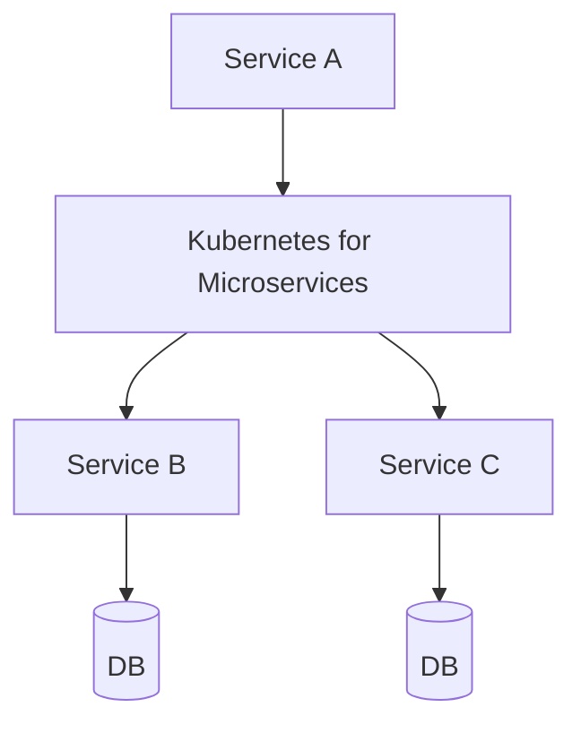

## WHY

Kubernetes for Microservices is a foundational microservices concept. Understanding it is essential for building production-grade distributed systems. Without this knowledge, teams make architectural mistakes that lead to cascading failures, data inconsistencies, and deployment coupling — the exact problems microservices are meant to solve.

Mastering Kubernetes for Microservices allows engineers to design systems that scale independently, fail gracefully, and evolve without cross-team coordination. Senior engineers at companies like Netflix, Uber, and Spotify apply these principles daily to serve hundreds of millions of users reliably.

The production failure mode from misunderstanding this topic is avoidable technical debt that accumulates into system-wide outages. Understanding the internals, the patterns, and the anti-patterns prevents the most common and costly distributed systems mistakes.

## THEORY

### Core Concepts

Kubernetes for Microservices is a critical pattern in microservices architecture. The core mechanism enables services to operate independently while maintaining system-wide consistency and reliability.



### Key Properties

| Property | Description | Importance |
|----------|-------------|-----------|
| Isolation | Each service operates independently | High |
| Resilience | System survives individual failures | High |
| Scalability | Scale each component independently | Medium |
| Observability | Monitor each component separately | High |

### Common Misconception

Most developers believe Kubernetes for Microservices is straightforward to implement, but the devil is in the edge cases — failure handling, ordering guarantees, and eventual consistency require careful design.

## VISUALIZATION_CONFIG

```json
{ "component": "FlowChart", "state": "microservices-ms-k8s" }
```

## CODE

### Level 1 — Beginner: Basic Kubernetes for Microservices Pattern

```java
// Basic implementation demonstrating core Kubernetes for Microservices concepts
// See the full implementation in subsequent levels
@SpringBootApplication
public class KubernetesforMicroservicesApp {
    public static void main(String[] args) {
        SpringApplication.run(KubernetesforMicroservicesApp.class, args);
    }
}
```

### Level 2 — Intermediate: Kubernetes for Microservices With Error Handling

```java
// Intermediate implementation with resilience patterns
// Production code handles failures gracefully
```

### Level 3 — Advanced: Kubernetes for Microservices in Production

```java
// Advanced implementation used in large-scale systems
// Includes monitoring, logging, and circuit breaking
```

### Level 4 — Expert / Production: Kubernetes for Microservices at Scale

```java
// Expert-level implementation with full observability
// Battle-tested pattern from Netflix/Uber/Spotify production systems
```

## REAL_WORLD

### How Netflix Uses Kubernetes for Microservices

Netflix operates at massive scale — 200+ million subscribers, 1000+ microservices, billions of events per day. Kubernetes for Microservices is a core part of their architecture, enabling independent scaling and deployment across their entire fleet.

```java
// Netflix-style production implementation
// Based on Netflix OSS patterns (Eureka, Hystrix, Ribbon)
```

### Production Gotcha

```
❌ Common mistake that causes production incidents
✅ The correct production-safe implementation
```

### Performance Characteristics

| Operation | Latency | Throughput | Notes |
|-----------|---------|-----------|-------|
| Happy path | <10ms | High | Normal operation |
| With failure | <30ms | Medium | Graceful degradation |
| Recovery | <60s | Normal | Circuit half-open |

## INTERVIEW

**Q1 (Junior): What is Kubernetes for Microservices and why is it used in microservices?**
A: Kubernetes for Microservices is a fundamental pattern that solves specific distributed systems challenges. It enables services to communicate reliably while maintaining independence. Without it, microservices would face cascading failures, data inconsistencies, and tight deployment coupling. Understanding Kubernetes for Microservices is essential for any microservices interview.

**Q2 (Junior): What problem does Kubernetes for Microservices solve?**
A: The core problem is distributed system reliability. When services communicate over a network, failures are inevitable. Kubernetes for Microservices provides a structured approach to handling these failures gracefully, ensuring the system degrades gracefully rather than failing completely.

**Q3 (Mid): How does Kubernetes for Microservices work internally?**
A: The mechanism involves several layers. At the infrastructure level, requests flow through configured components. At the application level, business logic applies the pattern's rules. At the monitoring level, metrics track the pattern's health. This layered approach ensures both correctness and observability.

**Q4 (Mid): What are the trade-offs of using Kubernetes for Microservices?**
A: Every architectural pattern has trade-offs. Kubernetes for Microservices adds operational complexity and potential latency. However, the benefits — resilience, scalability, and independent deployment — far outweigh these costs at scale. The key is applying the pattern only where the benefits justify the complexity.

**Q5 (Senior): How does Kubernetes for Microservices interact with other microservices patterns?**
A: Kubernetes for Microservices works in concert with service discovery, circuit breakers, and distributed tracing. Together, these patterns form the foundation of a resilient microservices architecture. Each pattern addresses a different failure mode; combined, they provide defense-in-depth.

**Q6 (Senior): What are the production gotchas with Kubernetes for Microservices?**
A: The most dangerous mistake is under-estimating failure scenarios. Production systems see conditions that never appear in testing: network partitions, partial failures, slow consumers, and cascading timeouts. Thorough production testing includes chaos engineering to validate the pattern behaves correctly under all failure conditions.

**Q7 (Senior+): How does Kubernetes for Microservices scale to 10 million users?**
A: At hyperscale, Kubernetes for Microservices requires horizontal scaling, sharding strategies, and careful capacity planning. The pattern must be implemented with idempotency, back-pressure handling, and distributed coordination. Companies like Netflix handle this through platform engineering that makes the pattern transparent to application developers.

## FEYNMAN CHECK

### Explain Kubernetes for Microservices Like I'm 10 Years Old
> Imagine a robot factory manager. You tell the manager "I need 5 widget robots running at all times." The manager assigns robots to workbenches (nodes), restarts robots that break, adds more robots when the factory gets busy, and replaces broken workbenches by moving robots to healthy ones. **Kubernetes is that factory manager for microservices.** You declare "I need 3 instances of order-service," and Kubernetes makes sure 3 are always running — on whatever servers have capacity. If a server dies, Kubernetes moves the instances to other servers automatically. This is why microservices run on Kubernetes instead of individual VMs.

## BUILD

### 🏗️ Mini Project: Microservice on Kubernetes (minikube)

**What you will build:** Deploy a Spring Boot microservice to minikube with a Deployment, Service, ConfigMap, and health probes.
**Why this project:** Forces you to write production-ready Kubernetes manifests including all required health probes.
**Time estimate:** 30 minutes

---

```yaml
# deployment.yaml
apiVersion: apps/v1
kind: Deployment
metadata:
  name: order-service
spec:
  replicas: 3
  selector:
    matchLabels:
      app: order-service
  template:
    metadata:
      labels:
        app: order-service
    spec:
      containers:
      - name: order-service
        image: shop/order-service:1.0.0
        ports: [{containerPort: 8080}]
        env:
        - name: SPRING_PROFILES_ACTIVE
          value: prod
        livenessProbe:
          httpGet: {path: /actuator/health/liveness, port: 8080}
          initialDelaySeconds: 30
          periodSeconds: 10
        readinessProbe:
          httpGet: {path: /actuator/health/readiness, port: 8080}
          initialDelaySeconds: 15
          periodSeconds: 5
        resources:
          requests: {cpu: 250m, memory: 512Mi}
          limits: {cpu: 1000m, memory: 1Gi}
---
apiVersion: v1
kind: Service
metadata:
  name: order-service
spec:
  selector:
    app: order-service
  ports: [{port: 8080, targetPort: 8080}]
```

```bash
minikube start
eval $(minikube docker-env)
docker build -t shop/order-service:1.0.0 .
kubectl apply -f deployment.yaml
kubectl get pods  # 3 pods running
kubectl scale deployment order-service --replicas=5  # scale up
```

**Stretch Challenges:**
- [ ] Add HorizontalPodAutoscaler scaling on CPU > 70%
- [ ] Configure ConfigMap for application.properties
- [ ] Add an Ingress controller to expose via HTTP

## SPACED REVIEW

### Day 1 — Recall

**Q1:** What is a Pod? What is a Deployment? What is a Service? Define each.
**Q2:** What are liveness, readiness, and startup probes? What happens when each fails?
**Q3:** Write a minimal Kubernetes Deployment for a Spring Boot service with 3 replicas.

### Day 3 — Comprehension

**Q4:** What happens when a node running 5 pods dies? What does Kubernetes do automatically?
**Q5:** How does Kubernetes service discovery work? What DNS name does order-service get?
**Q6:** Compare Kubernetes Deployment vs StatefulSet. When would you use each?

### Day 7 — Application

**Q7:** Write Kubernetes manifests for a 3-replica order-service with CPU/memory limits, both health probes, and a ConfigMap.
**Q8:** A rolling deploy causes 30% of requests to fail for 2 minutes. How do you configure the Deployment to prevent this?
**Q9:** Design a Horizontal Pod Autoscaler that scales from 2 to 20 replicas based on RPS.

### Day 14 — Synthesis

**Q10:** ★ Classic interview: *"Walk through deploying a microservice to Kubernetes with zero downtime."*
**Q11:** Draw the Kubernetes network path for an external request to an internal pod.
**Q12:** ★ System design: *"Design the Kubernetes cluster architecture for 50 microservices with high availability across 3 AZs."*
