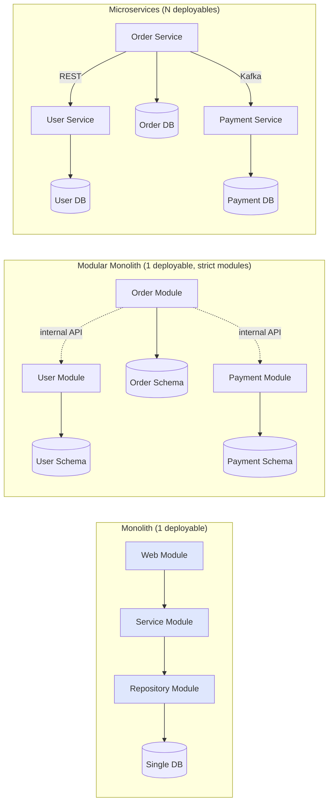

## WHY

The "monolith vs microservices" debate is one of the most consequential architectural decisions a team makes — and one most often made for the wrong reasons. In 2013-2016, every conference talk, every blog post, and every CTO interview proclaimed microservices as the universal answer. The result: thousands of teams of 5-20 engineers adopted microservices for greenfield projects and discovered they had multiplied their operational complexity by 10x while gaining nothing — because their problem wasn't team-coordination overhead, it was building features. Conversely, large organisations (50+ engineers, multiple bounded contexts, multiple release cadences) that clung to their monolith hit a wall where every change required hours of cross-team coordination and every deploy was a synchronised dance involving dozens of teams.

The specific pain that demands the right answer: developer velocity collapses in both wrong directions. Pick a monolith when you should have microservices → release frequency drops, builds take 30 minutes, no team can ship without breaking another, blast radius of every bug is global. Pick microservices when you should have a monolith → developers spend 40% of their time on YAML, Helm charts, dashboards, on-call rotation, and inter-service contracts; building a new feature requires changes in 5 services and 5 PR reviews. Both failure modes ship slower than the right architecture.

The production failure mode of getting this wrong is **organisational, not technical**. A small team running 30 microservices ships nothing because everyone is on infrastructure duty. A 500-person team running one monolith ships nothing because every commit is a 50-engineer coordination problem. The correct answer is dictated by Conway's Law and team topology: the architecture must mirror the team structure, and the team structure must serve the business velocity. Premature microservices is a leading cause of startup product death; obstinate monoliths is a leading cause of enterprise feature paralysis.

Senior engineers must understand: the seven concrete decision criteria (team size, deploy cadence, domain complexity, scaling profile, polyglot needs, ops maturity, fault-tolerance requirements), the existence of the middle option (modular monolith / "moduliths"), and Fowler's "Monolith First" principle that has aged extraordinarily well.

## THEORY

### Architectural Comparison at a Glance



### The Three Architectures

| Aspect | Monolith | Modular Monolith | Microservices |
|--------|----------|------------------|---------------|
| Deployables | 1 | 1 | N |
| Module boundaries | Loose (packages) | Strict (compile-time) | Strict (network) |
| Database | Shared, shared tables | Shared, schema-per-module | Database-per-service |
| Inter-module calls | In-process methods | In-process via internal APIs | Network (REST/Kafka) |
| Tech stack | Uniform | Uniform | Polyglot |
| Deploy granularity | Whole app | Whole app | Per service |
| Team independence | Low | Medium | High |
| Operational complexity | Low | Low | High |
| Best team size | 1–20 | 20–50 | 50+ |
| Failure isolation | None | None | Strong |

### The Seven Decision Criteria

Use this checklist — score each from 1 (low) to 5 (high). Sum > 25 → consider microservices; sum < 15 → use a monolith; in between → modular monolith.

| # | Criterion | Question | High score = microservices |
|---|-----------|----------|---------------------------|
| 1 | Team size | How many engineers? | 50+ → 5; <10 → 1 |
| 2 | Deploy cadence variance | Do teams need different release schedules? | Daily vs quarterly → 5 |
| 3 | Domain complexity | How many bounded contexts? | 10+ contexts → 5 |
| 4 | Scaling profile variance | Does one part need 100x more capacity? | Yes → 5 |
| 5 | Polyglot need | Different languages required? | Java + Python + Go → 5 |
| 6 | Ops maturity | Have CI/CD, observability, on-call? | Mature → 5 |
| 7 | Fault tolerance requirement | Does partial outage > full outage? | Mission-critical → 5 |

### Cost Curve Over Time

```
Monolith:     ___________
            /           |\___________________
        productivity stays high until ~50 engineers, then drops sharply
        due to coordination overhead, shared DB schema conflicts, build times.

Microservices:        ____
                     /    \____
                    /         \________________
        productivity LOWER initially (ops overhead), but stays flat as the team
        scales to 100s of engineers because services are independent.

Cross-over point: typically around 30-50 engineers / 5+ teams
```

### Common Misconception

> "Microservices are a tech upgrade — every modern company should adopt them."

**Reality:** Microservices are a *scaling* solution, not a *modernisation* solution. They make sense when team-coordination cost exceeds operational cost. For a 10-engineer startup, the coordination cost is essentially zero — they can sit in one room and yell at each other. The operational cost of running 20 services (CI/CD per service, dashboards, on-call, tracing, deployment orchestration) at that scale is enormous. Companies like Shopify, Segment, and Istio have publicly migrated FROM microservices BACK to modular monoliths because they over-decomposed. The "right" answer is highly contextual: scale your architecture *only* when your team scale forces it.

## VISUALIZATION_CONFIG

```json
{ "component": "ConceptMap", "state": "microservices-ms-monolith-vs" }
```

## CODE

### Level 1 — Beginner: A Monolithic Spring Boot E-Commerce Skeleton

```java
// Single Spring Boot app — user, order, product all in one process, one DB
package com.shop;

import org.springframework.boot.SpringApplication;
import org.springframework.boot.autoconfigure.SpringBootApplication;
import org.springframework.web.bind.annotation.*;
import java.util.*;
import java.util.concurrent.*;

@SpringBootApplication
public class MonolithApp {
    public static void main(String[] args) {
        SpringApplication.run(MonolithApp.class, args);
    }
}

// All controllers live in the same JVM, share the same DB, deploy together
@RestController
@RequestMapping("/users")
class UserController {
    private final Map<Long, User> users = new ConcurrentHashMap<>();
    @GetMapping("/{id}") User get(@PathVariable long id) { return users.get(id); }
}

@RestController
@RequestMapping("/orders")
class OrderController {
    // In a monolith, OrderController can directly inject UserController
    // — no network call needed
    private final Map<Long, User> users;   // accessed via shared service in real code
    private final Map<Long, Order> orders = new ConcurrentHashMap<>();
    OrderController(@SuppressWarnings("all") Map<Long, User> users) { this.users = users; }

    @PostMapping
    Order place(@RequestBody PlaceOrder req) {
        // ✅ Direct in-process call — nanoseconds, can't fail with network errors
        User u = users.get(req.userId());
        if (u == null) throw new RuntimeException("User not found");
        Order o = new Order(System.nanoTime(), u.id(), req.sku(), req.qty());
        orders.put(o.id(), o);
        return o;
    }
}

record User(long id, String email) {}
record Order(long id, long userId, String sku, int qty) {}
record PlaceOrder(long userId, String sku, int qty) {}
```

### Level 2 — Intermediate: Modular Monolith with Enforced Boundaries

```java
// Same single deployable, but modules can ONLY call each other via published interfaces.
// Spring Modulith / ArchUnit enforces this at compile/test time.

// === Module: users ===
package com.shop.users;

public interface UserApi {                       // PUBLIC API of the users module
    UserDto findById(long id);
}

public record UserDto(long id, String email, String name) {}

@Component
class UserService implements UserApi {           // implementation is package-private
    public UserDto findById(long id) {
        // Reads from users SCHEMA only — other modules cannot touch users tables
        return /* lookup */ new UserDto(id, "x@y", "X");
    }
}

// === Module: orders ===
package com.shop.orders;

import com.shop.users.UserApi;
import com.shop.users.UserDto;

@RestController @RequestMapping("/orders")
class OrderController {
    private final UserApi users;                 // ✅ depend on published API only
    // ❌ Cannot depend on internal UserService — compile error
    // ❌ Cannot query users table directly — schema-per-module enforced

    OrderController(UserApi users) { this.users = users; }

    @PostMapping
    public Order place(@RequestBody PlaceOrder req) {
        UserDto user = users.findById(req.userId());  // in-process call, no network
        // Owns its own SCHEMA (orders) — never references users tables
        return new Order(System.nanoTime(), user.id(), req.sku(), req.qty());
    }
}

record Order(long id, long userId, String sku, int qty) {}
record PlaceOrder(long userId, String sku, int qty) {}

// ArchUnit test enforces the rules:
// @AnalyzeClasses(packages = "com.shop")
// class ArchitectureRulesTest {
//     @ArchTest static final ArchRule modules_only_depend_via_api = noClasses()
//         .that().resideInAPackage("..orders..")
//         .should().dependOnClassesThat().resideInAPackage("..users.internal..");
// }
```

### Level 3 — Advanced: Same Logical System Decomposed Into Microservices

```java
// === Microservice: user-service (separate Spring Boot app, separate DB) ===
@SpringBootApplication
public class UserServiceApp {
    public static void main(String[] args) { SpringApplication.run(UserServiceApp.class, args); }
}

@RestController @RequestMapping("/users")
class UserController {
    private final JdbcTemplate db;
    UserController(JdbcTemplate db) { this.db = db; }

    @GetMapping("/{id}")
    public UserDto get(@PathVariable long id) {
        return db.queryForObject(
            "SELECT id, email, name FROM users WHERE id = ?",
            (rs, n) -> new UserDto(rs.getLong("id"), rs.getString("email"), rs.getString("name")),
            id
        );
    }
}

record UserDto(long id, String email, String name) {}

// === Separate Microservice: order-service (separate Spring Boot app, separate DB) ===
@SpringBootApplication
public class OrderServiceApp {
    public static void main(String[] args) { SpringApplication.run(OrderServiceApp.class, args); }

    @Bean RestClient userServiceClient(@Value("${USER_SERVICE_URL}") String url) {
        return RestClient.builder().baseUrl(url).build();
    }
}

@RestController @RequestMapping("/orders")
class OrderController {
    private final RestClient userClient;
    private final JdbcTemplate db;

    OrderController(RestClient userClient, JdbcTemplate db) {
        this.userClient = userClient;
        this.db = db;
    }

    @PostMapping
    public Order place(@RequestBody PlaceOrder req) {
        // ❌ This is a NETWORK call now — can fail, can be slow, can return stale data
        UserDto user;
        try {
            user = userClient.get().uri("/users/{id}", req.userId())
                .retrieve().body(UserDto.class);
        } catch (Exception e) {
            // Without this guard, your service crashes whenever user-service is slow
            throw new RuntimeException("user-service unreachable", e);
        }

        // Owns its OWN DB — cannot JOIN against users tables
        long id = db.queryForObject(
            "INSERT INTO orders(user_id, sku, qty) VALUES (?, ?, ?) RETURNING id",
            Long.class, user.id(), req.sku(), req.qty()
        );
        return new Order(id, user.id(), req.sku(), req.qty());
    }
}
record Order(long id, long userId, String sku, int qty) {}
record PlaceOrder(long userId, String sku, int qty) {}
```

### Level 4 — Expert / Production: Decision-Matrix Tool That Picks Architecture

```java
package com.architecture;

import java.util.*;
import java.util.stream.*;

/**
 * Production-grade decision tool: given team and product characteristics,
 * recommends architecture (Monolith / Modular Monolith / Microservices).
 * Used in architecture-review meetings to make data-driven decisions
 * rather than résumé-driven design.
 */
public class ArchitectureRecommender {

    public record Inputs(
        int engineerCount,
        DeployCadenceVariance deployVariance,
        int boundedContextCount,
        ScalingProfile scaling,
        boolean polyglotRequired,
        OpsMaturity opsMaturity,
        FaultToleranceRequirement faultTolerance
    ) {}

    public enum DeployCadenceVariance { UNIFORM, MIXED, HIGHLY_DIVERGENT }
    public enum ScalingProfile { UNIFORM, MODERATE_VARIANCE, EXTREME_VARIANCE }
    public enum OpsMaturity { NONE, BASIC, MATURE, PLATFORM_TEAM }
    public enum FaultToleranceRequirement { BEST_EFFORT, STANDARD, MISSION_CRITICAL }
    public enum Architecture { MONOLITH, MODULAR_MONOLITH, MICROSERVICES }

    public record Recommendation(
        Architecture architecture,
        int score,
        List<String> reasoning,
        List<String> warnings
    ) {}

    public static Recommendation recommend(Inputs in) {
        int score = 0;
        List<String> reasoning = new ArrayList<>();
        List<String> warnings = new ArrayList<>();

        // Team size — most important factor
        int teamScore = clamp(in.engineerCount() / 10, 1, 5);
        score += teamScore;
        reasoning.add("Team size " + in.engineerCount() + " → score " + teamScore);

        // Deploy cadence variance
        int cadenceScore = switch (in.deployVariance()) {
            case UNIFORM -> 1;
            case MIXED -> 3;
            case HIGHLY_DIVERGENT -> 5;
        };
        score += cadenceScore;
        reasoning.add("Deploy cadence " + in.deployVariance() + " → score " + cadenceScore);

        // Bounded contexts
        int contextScore = clamp(in.boundedContextCount(), 1, 5);
        score += contextScore;
        reasoning.add("Bounded contexts " + in.boundedContextCount() + " → score " + contextScore);

        // Scaling profile
        int scaleScore = switch (in.scaling()) {
            case UNIFORM -> 1;
            case MODERATE_VARIANCE -> 3;
            case EXTREME_VARIANCE -> 5;
        };
        score += scaleScore;
        reasoning.add("Scaling profile " + in.scaling() + " → score " + scaleScore);

        // Polyglot
        int polyScore = in.polyglotRequired() ? 5 : 1;
        score += polyScore;
        reasoning.add("Polyglot " + (in.polyglotRequired() ? "required" : "not required")
                      + " → score " + polyScore);

        // Ops maturity
        int opsScore = switch (in.opsMaturity()) {
            case NONE -> 1;
            case BASIC -> 2;
            case MATURE -> 4;
            case PLATFORM_TEAM -> 5;
        };
        score += opsScore;
        reasoning.add("Ops maturity " + in.opsMaturity() + " → score " + opsScore);

        // Fault tolerance
        int faultScore = switch (in.faultTolerance()) {
            case BEST_EFFORT -> 1;
            case STANDARD -> 3;
            case MISSION_CRITICAL -> 5;
        };
        score += faultScore;
        reasoning.add("Fault tolerance " + in.faultTolerance() + " → score " + faultScore);

        // Decision
        Architecture arch;
        if (score >= 28) arch = Architecture.MICROSERVICES;
        else if (score >= 18) arch = Architecture.MODULAR_MONOLITH;
        else arch = Architecture.MONOLITH;

        // Sanity-check warnings
        if (arch == Architecture.MICROSERVICES && in.opsMaturity() == OpsMaturity.NONE) {
            warnings.add("⚠️ Microservices without ops maturity = guaranteed pain. "
                       + "Build CI/CD, observability, on-call FIRST, then decompose.");
        }
        if (arch == Architecture.MICROSERVICES && in.engineerCount() < 20) {
            warnings.add("⚠️ <20 engineers running microservices typically suffer. "
                       + "Modular monolith ships faster at this scale.");
        }
        if (arch == Architecture.MONOLITH && in.engineerCount() > 50) {
            warnings.add("⚠️ Large team on a monolith — expect coordination pain. "
                       + "Migrate to modular monolith with strict boundaries.");
        }

        return new Recommendation(arch, score, reasoning, warnings);
    }

    private static int clamp(int v, int lo, int hi) {
        return Math.max(lo, Math.min(hi, v));
    }

    public static void main(String[] args) {
        // Scenario A: 8-engineer startup, simple CRUD
        var startup = new Inputs(8, DeployCadenceVariance.UNIFORM, 2,
            ScalingProfile.UNIFORM, false, OpsMaturity.NONE,
            FaultToleranceRequirement.BEST_EFFORT);
        printRecommendation("Startup (8 engineers)", recommend(startup));

        // Scenario B: 150-engineer enterprise with complex domain
        var enterprise = new Inputs(150, DeployCadenceVariance.HIGHLY_DIVERGENT, 12,
            ScalingProfile.EXTREME_VARIANCE, true, OpsMaturity.PLATFORM_TEAM,
            FaultToleranceRequirement.MISSION_CRITICAL);
        printRecommendation("Enterprise (150 engineers)", recommend(enterprise));

        // Scenario C: Mid-size 40-engineer, 5 bounded contexts
        var midsize = new Inputs(40, DeployCadenceVariance.MIXED, 5,
            ScalingProfile.MODERATE_VARIANCE, false, OpsMaturity.MATURE,
            FaultToleranceRequirement.STANDARD);
        printRecommendation("Mid-size (40 engineers)", recommend(midsize));
    }

    private static void printRecommendation(String label, Recommendation r) {
        System.out.println("\n=== " + label + " ===");
        System.out.println("Architecture: " + r.architecture() + " (score=" + r.score() + ")");
        r.reasoning().forEach(s -> System.out.println("  • " + s));
        r.warnings().forEach(w -> System.out.println("  " + w));
    }
}
```

## REAL_WORLD

### How Shopify Migrated Back From Microservices to a "Majestic Monolith"

Shopify is the most famous example of a company that *deliberately consolidated* microservices into a monolithic Rails app — and is happier for it. In 2017-2019, Shopify had a sprawl of services that arose organically and were causing more pain than they solved: contract evolution was painful, distributed tracing was incomplete, every feature touched 5+ services. CTO Tobias Lütke wrote that the "majestic monolith" was a deliberate choice: one large Rails app with strict module boundaries, owning the entire core commerce logic, deployed thousands of times per day. The result: developer velocity *increased* dramatically, on-call became sane, and they could focus on building features for merchants rather than maintaining inter-service contracts.

Critical insight: Shopify *does* run microservices — for things that genuinely benefit (data warehouse, ML inference, async job processors) — but the *core commerce flow* lives in the monolith. They use [Packwerk](https://github.com/Shopify/packwerk) (their own tool) to enforce module boundaries within the Rails app, achieving 90% of microservice benefits with 10% of the cost.

```ruby
# Shopify-style module boundary enforcement (Rails + Packwerk)
# components/billing/package.yml
# ---
# enforce_dependencies: true
# enforce_privacy: true
# dependencies:
#   - components/identity
#   - components/payments

# components/billing/app/public/billing/invoice_creator.rb
module Billing
  # Public API of the Billing module — other modules CAN call this
  class InvoiceCreator
    def self.create(merchant_id:, amount_cents:)
      # Calls into Identity via its public API only
      merchant = Identity::MerchantLookup.find(merchant_id)
      raise "Merchant not found" unless merchant

      # Calls into Payments via its public API only
      payment = Payments::ChargeProcessor.charge(merchant.payment_method_id, amount_cents)

      Invoice.create!(
        merchant_id: merchant_id,
        amount_cents: amount_cents,
        payment_id: payment.id
      )
    end
  end
end

# components/billing/app/private/billing/invoice.rb
module Billing
  # Private to the Billing module — Packwerk will FAIL the build if any other
  # module references Billing::Invoice directly
  class Invoice < ApplicationRecord
    belongs_to :merchant_id
    # ...
  end
end
```

### Production Gotcha: Microservices Without Ops Maturity

```
❌ DANGEROUS — Adopting microservices without prerequisites:
  - No automated CI/CD per service → manual deploys, 2-hour deploy ceremonies
  - No distributed tracing → debugging takes hours
  - No structured logging → can't correlate logs across services
  - No on-call rotation → no one knows who to page
  - No service catalogue → developers don't know which service does what

Result: A 15-person team adopts microservices, splits the monolith into 20 services,
       and 6 months later velocity is HALF what it was. They blame "microservices
       complexity" — actually they blame their own under-investment in platform tooling.
       Many teams revert to a monolith at this point, incorrectly concluding that
       microservices "don't work."

✅ FIX — Prerequisites BEFORE microservices:
  1. CI/CD that takes <10 min from commit to production per service
  2. Structured logging in JSON with trace_id correlation
  3. Distributed tracing (OpenTelemetry) instrumented in every service
  4. Metrics + dashboards (Prometheus + Grafana) per service
  5. On-call rotation + runbooks for every service
  6. Service catalogue (Backstage) with owners, contracts, dependencies
  7. Then — only then — start decomposing the monolith
```

**Why it happens:** Teams see "microservices" as the architecture and "platform" as an afterthought. In reality, microservices are 20% architecture and 80% platform. Companies like Netflix, Spotify, and Uber have entire dedicated platform teams (typically 10-20% of engineering headcount) just maintaining the substrate.

### Performance Characteristics

| Aspect | Monolith | Modular Monolith | Microservices |
|--------|----------|------------------|---------------|
| Inter-module call | ns (method call) | ns (method call) | 1-10ms (network) |
| Build time | 5-30 min (whole app) | 5-30 min | 1-3 min per service |
| Deploy time | 5-15 min | 5-15 min | 1-5 min per service |
| Cold start | 10-60s | 10-60s | 10-60s × N services |
| Memory footprint | ~1-2 GB single JVM | ~1-2 GB single JVM | ~200-500 MB × N services |
| Mean time to detect bug | minutes (one log) | minutes (one log) | hours (distributed tracing) |
| Mean time to recover | minutes (rollback) | minutes (rollback) | hours (which service?) |
| Linear scalability | ~10× then breaks | ~50× | virtually unlimited |

## INTERVIEW

**Q1 (Junior): What is a monolith?**
A: A monolith is an application packaged as a single deployable unit — one JAR/WAR, one executable, one process. All features (user management, orders, payments, search) live in the same codebase and run in the same JVM. Inter-feature communication is in-process method calls — nanosecond latency, no network failures, no serialisation overhead. The trade-off: any change requires rebuilding and redeploying the entire app, so 20 teams sharing one monolith must coordinate releases. Monoliths are simpler operationally (one thing to run) but harder organisationally at scale (one repo for everyone).

**Q2 (Junior): What are three concrete advantages of a monolith over microservices?**
A: (1) **Simpler operations** — one CI/CD pipeline, one deployment, one dashboard, one log stream. A team of 5 can ship a monolith without an SRE; a team of 5 running 20 microservices needs at least one full-time SRE. (2) **ACID transactions across features** — placing an order, charging payment, updating inventory all happen in one database transaction. In microservices, you need sagas/outbox pattern for this. (3) **Fast inter-module communication** — function call latency is nanoseconds vs ~1-10ms for HTTP. For low-latency workloads (high-frequency trading, game backends), monoliths can be 100× faster end-to-end. Pick a monolith unless you have a concrete reason not to.

**Q3 (Mid): What is a "modular monolith" and why might it be the right answer for many teams?**
A: A modular monolith is a single deployable Spring Boot/Rails/.NET app where the modules have *strict, enforced boundaries* — they can only call each other through published interfaces, never via shared database tables or internal classes. Tools like Spring Modulith, ArchUnit, and Shopify's Packwerk fail the build if a module crosses these boundaries. The point: get the **structural** benefits of microservices (bounded contexts, clear ownership, swappable implementations) without paying the **operational** cost (no service mesh, no distributed tracing, no schema-per-service operations). For teams of 20-50 engineers, a modular monolith ships faster than either a "spaghetti monolith" or premature microservices. When you eventually need to extract a module into its own service, the strict API boundary makes the extraction mechanical rather than archaeological.

**Q4 (Mid): When does the monolith-to-microservices crossover happen for most teams?**
A: The classic signal is *deploy contention*: when teams start blocking each other's deploys because the shared monolith CI/CD pipeline is the bottleneck, or because team A's bug breaks team B's tests, or because a database migration requires coordinating with 4 other teams. This typically happens around 30-50 engineers split across 3-6 teams with distinct business domains. Other signals: divergent deploy cadences (the payments team needs to deploy hourly for fraud signals; the marketing team deploys quarterly), divergent scaling profiles (checkout needs 100x compute during Black Friday; reporting doesn't), divergent tech stacks (the ML team needs Python+GPU; the rest of the app is Java). If you have one or two of these signals, modular monolith is enough. If you have all three, microservices become worth the cost.

**Q5 (Senior): Walk me through the Strangler Fig pattern for migrating a monolith to microservices.**
A: Strangler Fig (named after the strangler fig tree that grows around a host tree until the host dies) is the canonical migration pattern: instead of rewriting the monolith all at once (which fails ~80% of the time per Martin Fowler), you incrementally extract pieces of functionality into new microservices while the monolith keeps running. The steps: (1) Put an API gateway / reverse proxy in front of the monolith — all traffic flows through it; (2) Identify a "seam" — a bounded context with clean boundaries (e.g., notifications, search); (3) Build a new microservice implementing that seam; (4) Have the gateway route `notifications.*` to the new service while everything else still goes to the monolith; (5) Decommission the notifications code in the monolith; (6) Repeat for the next seam. Over 1-3 years, the monolith shrinks and the microservices grow — the strangler fig completes when only "edge cases" remain. The crucial property: at every step, the system is fully working. You never have a "big bang" cutover.

**Q6 (Senior): What's the most common reason "microservices migrations" fail, and how do you prevent it?**
A: The #1 reason is splitting along *technical* lines (auth-service, db-service, cache-service, web-service) rather than along *business* lines (orders, billing, inventory). Technical splits create chatty, tightly-coupled services that can't deploy independently — every order operation must call auth-service, db-service, web-service synchronously, so they're effectively still one system but slower and more fragile. Business splits create cohesive services owned by aligned teams (Conway's Law). Prevention: do an explicit DDD bounded-context analysis BEFORE you split. Identify which business operations should be entirely contained within one service, which require cross-service communication, and which should be eventual-consistent events. If your "service" doesn't make sense as a startup's MVP product (e.g., "an authentication-only company"), it's not a microservice — it's a shared library or a module.

**Q7 (Senior+): Shopify and Segment publicly migrated *back* from microservices to monoliths. What can teams learn from these reversals?**
A: Three deep lessons. **Lesson 1: Premature decomposition is irreversible at scale.** Segment had 100+ microservices serving their data pipeline; the inter-service coordination cost exceeded the team-coordination cost they were trying to escape. They consolidated back to a single "Centrifuge" service. **Lesson 2: Operational maturity is the bottleneck, not architecture.** Shopify's "majestic monolith" succeeds because they invested heavily in Packwerk (boundary enforcement), Toxiproxy (chaos testing), and per-PR canary deploys — most monolith pain comes from under-tooling, not from being a monolith. **Lesson 3: The "right" architecture is the one your team can ship features fastest in, today.** Architecture is a moving target — as your team grows and your product matures, the right answer changes. Shopify's stack is right *for Shopify*. Netflix's is right *for Netflix*. Don't copy architectures; copy the *decision process* (data-driven trade-off analysis based on team size, deploy cadence, domain complexity, ops maturity).

## FEYNMAN CHECK

### Explain Monolith vs Microservices Like I'm 10 Years Old

> Imagine you and your friends are doing a group science fair project. **Monolith**: you all share one giant poster board. Everyone draws on it together. Easy to coordinate if there's 3 of you, but if 30 kids try to draw on the same poster, you bump into each other constantly. **Microservices**: each kid makes their own small poster, and you connect them with strings ("the volcano poster talks to the dinosaur poster"). Now 30 kids can work without bumping each other — but you need to spend extra time making sure the strings work, label which poster goes where, and have a teacher (the "service mesh") helping move kids around. **The lesson**: small group = one big poster. Huge group = many small posters with strings. Don't make 30 little posters if there's only 3 of you — you'll spend all your time managing strings instead of doing science.

---

### 5 Deep Conceptual Questions

**Q1: What fundamental problem do microservices solve that a monolith can't, even with perfect modularity?**
> **A:** Independent deployment cadence and independent scaling. A monolith — even a perfectly modular one — still has one CI/CD pipeline, one deployment artifact, one process to run. If the payments team deploys 5x/day and the reporting team deploys once a quarter, the monolith forces them to the same cadence. If the search subsystem needs 100× more compute during a viral campaign, you can't scale only search in a monolith — you scale the whole thing. Microservices give you the two degrees of freedom (deploy cadence + scaling profile) that no monolith can offer, regardless of code organisation. That's the fundamental thing you're buying — and if you don't need either, you don't need microservices.

**Q2: What is the ONE mental model that makes the monolith-vs-microservices choice obvious?**
> **A:** "The architecture must match the team topology." If your engineering org has one team, you should have one deployable. If you have 10 teams aligned around 10 business capabilities, you should have ~10 deployables. Conway's Law in reverse: don't pick an architecture and then re-organise your teams to match — pick an architecture that *already matches* how your teams are organised. If your teams aren't naturally aligned around bounded contexts, microservices will fail because the service boundaries won't match the team boundaries. The mental model: count your teams, count your business capabilities, and let those numbers dictate the architecture. Trying to force a 1-team org into 20 microservices, or a 50-team org into 1 monolith, both fail predictably.

**Q3: What is the most dangerous misconception about monolith vs microservices? Show it with code/architecture.**
> **A:** "Microservices = small services." This leads to nano-services where each service has 2-3 endpoints and every business operation chains 8 synchronous calls.
> ```
> // ❌ NANO-SERVICE ANTI-PATTERN — "small services" interpreted literally
> // 30 services, each just wrapping 1-2 entities:
> auth-service, user-service, profile-service, settings-service,
> notifications-service, email-service, sms-service, push-service,
> billing-service, invoice-service, payment-service, refund-service ...
>
> // To place an order, 12 synchronous hops:
> placeOrder() → auth → user → profile → cart → catalog → pricing →
>                inventory → payment → billing → notification → email
>
> // Each step adds 5-20ms latency. Total: 200ms+ on a fast day.
> // Reliability: if each service is 99.9%, the chain is 98.8% → 8h/month outage.
>
> // ✅ CORRECT — services aligned to bounded contexts, ~5-10 services for most apps:
> auth-and-identity-service (owns: users, profiles, settings, sessions)
> order-management-service  (owns: cart, checkout, orders)
> catalog-service           (owns: products, inventory, pricing)
> billing-service           (owns: invoices, payments, refunds)
> notification-service      (owns: email, SMS, push, in-app)
>
> // placeOrder() now: auth (1 hop) → order-management (1 hop, internally validates)
> // → catalog (1 hop) → billing (1 hop) = 4 hops vs 12.
> // Latency: ~40ms. Reliability: 99.6% → 3h/month, 60% better.
> ```

**Q4: How does the monolith-vs-microservices choice interact with database transactions and consistency?**
> **A:** In a monolith with one database, all your code can participate in ACID transactions — `BEGIN; insert order; charge payment; update inventory; COMMIT;` either fully happens or fully rolls back. The mental model is "one atomic step." In microservices, each service has its own database, so there's no shared transaction. The same operation becomes: `OrderService.create()` (commits to orders DB), then publishes an event, then `PaymentService.charge()` (commits to payments DB), then publishes an event, then `InventoryService.reserve()` (commits to inventory DB). At any point, the system is in an intermediate, eventually-consistent state. To handle failures, you use the Saga pattern with compensating actions ("if payment failed after order created, publish CancelOrder event"). This fundamental shift from ACID to eventual consistency is the *biggest conceptual cost* of microservices, and many bugs in microservices systems trace to engineers still thinking in transactional terms.

**Q5: One-sentence definition that captures the trade-off for a senior FAANG engineer.**
> **A:** "The choice between monolith and microservices is a trade-off between team-coordination cost (which grows with team size in a monolith) and operational cost (which grows with service count in microservices) — with a third option (modular monolith) preserving most architectural benefits at a fraction of the operational cost — and the correct answer for any given team is the one where the sum of those costs is minimized today, dictated by Conway's Law (architecture mirrors team topology), ops maturity (CI/CD, observability, on-call), domain complexity (number of bounded contexts), and the specific velocity-killing pain points being optimised against — never by résumé-driven design or by which architecture is most fashionable in conference talks."

## BUILD

### 🏗️ Mini Project: Architecture Decision Tool

**What you will build:** A command-line Java tool that takes a YAML description of an engineering org (team size, deploy cadence, bounded contexts, ops maturity) and outputs an architecture recommendation with reasoning and warnings.
**Why this project:** Forces you to internalise the seven decision criteria as concrete, weighted inputs — and to express them as code that produces a justifiable recommendation. This is exactly the kind of artifact you'd present in a real architecture-review meeting.
**Time estimate:** 35 minutes

---

#### Step 1 — Project Setup

```bash
mkdir arch-decision && cd arch-decision
mkdir -p src/main/java/com/arch src/test/java/com/arch
touch src/main/java/com/arch/{ArchitectureRecommender,Inputs,Recommendation,Main}.java
touch src/test/java/com/arch/ArchitectureRecommenderTest.java
```

#### Step 2 — Core Implementation

```java
package com.arch;
import java.util.*;

public class ArchitectureRecommender {
    public enum Architecture { MONOLITH, MODULAR_MONOLITH, MICROSERVICES }

    public record Inputs(int engineers, int contexts, int deployVariance,
                         int scalingVariance, boolean polyglot, int opsMaturity,
                         int faultTolerance) {}

    public record Recommendation(Architecture arch, int score,
                                 List<String> reasoning, List<String> warnings) {}

    public static Recommendation recommend(Inputs in) {
        var reasoning = new ArrayList<String>();
        var warnings = new ArrayList<String>();
        int score = 0;

        int teamScore = Math.min(5, in.engineers() / 10);
        score += teamScore;
        reasoning.add("Team size " + in.engineers() + " → " + teamScore);

        score += Math.min(5, in.contexts());
        reasoning.add("Bounded contexts " + in.contexts() + " → " + Math.min(5, in.contexts()));

        score += clamp(in.deployVariance(), 1, 5);
        score += clamp(in.scalingVariance(), 1, 5);
        score += in.polyglot() ? 5 : 1;
        score += clamp(in.opsMaturity(), 1, 5);
        score += clamp(in.faultTolerance(), 1, 5);

        Architecture arch;
        if (score >= 28) arch = Architecture.MICROSERVICES;
        else if (score >= 18) arch = Architecture.MODULAR_MONOLITH;
        else arch = Architecture.MONOLITH;

        if (arch == Architecture.MICROSERVICES && in.opsMaturity() <= 2) {
            warnings.add("⚠️ Microservices without ops maturity — build CI/CD + observability first.");
        }
        if (arch == Architecture.MICROSERVICES && in.engineers() < 20) {
            warnings.add("⚠️ <20 engineers on microservices typically suffer operational overhead.");
        }
        if (arch == Architecture.MONOLITH && in.engineers() > 50) {
            warnings.add("⚠️ 50+ engineers on a monolith — coordination pain likely. Consider modular monolith.");
        }
        return new Recommendation(arch, score, reasoning, warnings);
    }

    private static int clamp(int v, int lo, int hi) {
        return Math.max(lo, Math.min(hi, v));
    }
}
```

#### Step 3 — Main Entry Point

```java
package com.arch;

public class Main {
    public static void main(String[] args) {
        var scenarios = new ArchitectureRecommender.Inputs[] {
            new ArchitectureRecommender.Inputs(8, 2, 1, 1, false, 1, 1),   // Startup
            new ArchitectureRecommender.Inputs(35, 5, 3, 3, false, 3, 3),  // Mid-size
            new ArchitectureRecommender.Inputs(150, 12, 5, 5, true, 5, 5)  // Enterprise
        };
        String[] labels = { "Startup (8)", "Mid-size (35)", "Enterprise (150)" };

        for (int i = 0; i < scenarios.length; i++) {
            var rec = ArchitectureRecommender.recommend(scenarios[i]);
            System.out.println("\n=== " + labels[i] + " ===");
            System.out.println("Architecture: " + rec.arch() + " (score=" + rec.score() + ")");
            rec.reasoning().forEach(s -> System.out.println("  • " + s));
            rec.warnings().forEach(w -> System.out.println("  " + w));
        }
    }
}
```

#### Step 4 — Error Handling

```java
public static Recommendation recommendSafe(Inputs in) {
    if (in == null) throw new IllegalArgumentException("Inputs required");
    if (in.engineers() < 1) throw new IllegalArgumentException("engineers >= 1");
    if (in.contexts() < 1) throw new IllegalArgumentException("contexts >= 1");
    if (in.deployVariance() < 1 || in.deployVariance() > 5)
        throw new IllegalArgumentException("deployVariance in [1,5]");
    return recommend(in);
}
```

#### Step 5 — Tests

```java
import org.junit.jupiter.api.Test;
import static org.junit.jupiter.api.Assertions.*;
import com.arch.ArchitectureRecommender;
import com.arch.ArchitectureRecommender.*;

class ArchitectureRecommenderTest {
    @Test
    void smallStartupGetsMonolith() {
        var rec = ArchitectureRecommender.recommend(new Inputs(5, 1, 1, 1, false, 1, 1));
        assertEquals(Architecture.MONOLITH, rec.arch());
    }

    @Test
    void enterpriseGetsMicroservices() {
        var rec = ArchitectureRecommender.recommend(new Inputs(200, 15, 5, 5, true, 5, 5));
        assertEquals(Architecture.MICROSERVICES, rec.arch());
    }

    @Test
    void midSizeGetsModularMonolith() {
        var rec = ArchitectureRecommender.recommend(new Inputs(35, 5, 3, 3, false, 3, 3));
        assertEquals(Architecture.MODULAR_MONOLITH, rec.arch());
    }

    @Test
    void warnsOnMicroservicesWithoutOps() {
        var rec = ArchitectureRecommender.recommend(new Inputs(200, 15, 5, 5, true, 1, 5));
        assertTrue(rec.warnings().stream().anyMatch(w -> w.contains("ops maturity")));
    }

    @Test
    void warnsOnLargeTeamMonolith() {
        // Forcing low scores everywhere except engineers — should still get monolith → warning
        var rec = ArchitectureRecommender.recommend(new Inputs(80, 1, 1, 1, false, 1, 1));
        assertTrue(rec.warnings().stream().anyMatch(w -> w.contains("coordination")));
    }
}
```

**Expected Output:**
```
=== Startup (8) ===
Architecture: MONOLITH (score=10)
  • Team size 8 → 0
  • Bounded contexts 2 → 2
  • ...

=== Mid-size (35) ===
Architecture: MODULAR_MONOLITH (score=21)
  • Team size 35 → 3
  • ...

=== Enterprise (150) ===
Architecture: MICROSERVICES (score=35)
  • Team size 150 → 5 (capped)
  • ...
```

**Stretch Challenges:**
- [ ] Load inputs from a YAML file rather than hardcoded scenarios
- [ ] Add a "migration recommendation" output (e.g., "you're on monolith but score 30 — start strangler fig")
- [ ] Visualize the score breakdown as an ASCII bar chart

## SPACED REVIEW

> **How to use:** Answer each question from memory before reading ahead.

---

### Day 1 — Recall

**Q1:** In one sentence, what is the fundamental trade-off between monolith and microservices?

**Q2:** Name the three architectures on the spectrum (from simplest to most distributed) and one defining property of each.

**Q3:** List 5 of the 7 decision criteria for picking an architecture.

---

### Day 3 — Comprehension

**Q4:** A team of 15 engineers wants to "modernise" by adopting microservices. They have no CI/CD, no observability, and a single bounded context. What should you recommend and why?

**Q5:** Describe the "distributed monolith" anti-pattern. How is it different from a "real" microservices architecture?

**Q6:** Refactor this scenario to the right architecture:
```
Company: 8 engineers, simple CRUD product, one bounded context (task management),
         no on-call rotation, no monitoring beyond CloudWatch.
Current: 12 microservices in Kubernetes.
Problem: Velocity has dropped 50% in 6 months. Why? What architecture should they use instead?
```

---

### Day 7 — Application

**Q7:** Design the architecture for an e-commerce startup at three stages: 5 engineers, 30 engineers, 200 engineers. Show how the architecture evolves and where the transitions happen.

**Q8:** A team is debating "should we use microservices?" They have 25 engineers, 4 bounded contexts, mature CI/CD, and uniform scaling needs. Run them through the decision matrix and justify your recommendation.

**Q9:** What is the Strangler Fig pattern? Describe the step-by-step process for migrating a monolithic e-commerce app to microservices using it.

---

### Day 14 — Synthesis & Interview Prep

**Q10:** ★ Classic interview: *"How do you decide between a monolith and microservices for a new project?"*

**Q11:** Draw a 2D plot with team size on the X axis and architecture-complexity-cost on the Y axis. Plot the cost curves for monolith, modular monolith, and microservices. Where do they intersect?

**Q12:** ★ System design: *"You're the new CTO of a 60-engineer company running a 6-year-old Rails monolith. Velocity is collapsing — every PR takes 2 days to land, deploys are weekly, and the database has 400 tables. The board is asking 'should we go microservices?'. Walk through your decision process, your recommendation, and the migration plan you'd propose."*

