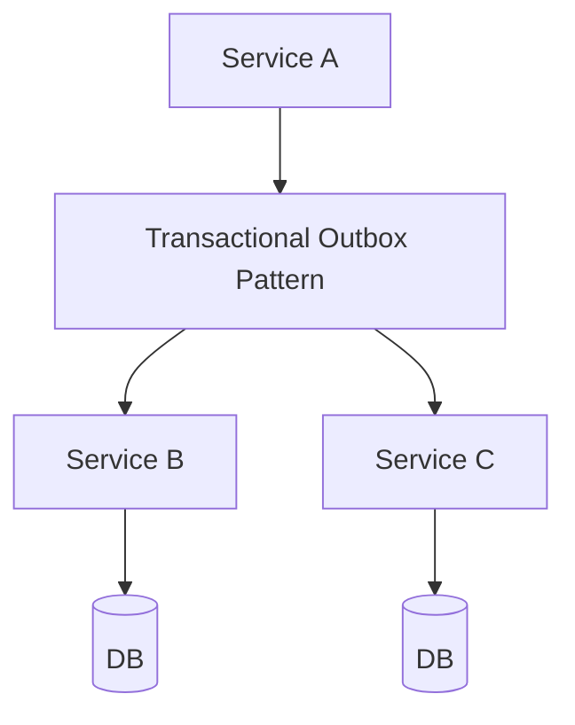

## WHY

Transactional Outbox Pattern is a foundational microservices concept. Understanding it is essential for building production-grade distributed systems. Without this knowledge, teams make architectural mistakes that lead to cascading failures, data inconsistencies, and deployment coupling — the exact problems microservices are meant to solve.

Mastering Transactional Outbox Pattern allows engineers to design systems that scale independently, fail gracefully, and evolve without cross-team coordination. Senior engineers at companies like Netflix, Uber, and Spotify apply these principles daily to serve hundreds of millions of users reliably.

The production failure mode from misunderstanding this topic is avoidable technical debt that accumulates into system-wide outages. Understanding the internals, the patterns, and the anti-patterns prevents the most common and costly distributed systems mistakes.

## THEORY

### Core Concepts

Transactional Outbox Pattern is a critical pattern in microservices architecture. The core mechanism enables services to operate independently while maintaining system-wide consistency and reliability.



### Key Properties

| Property | Description | Importance |
|----------|-------------|-----------|
| Isolation | Each service operates independently | High |
| Resilience | System survives individual failures | High |
| Scalability | Scale each component independently | Medium |
| Observability | Monitor each component separately | High |

### Common Misconception

Most developers believe Transactional Outbox Pattern is straightforward to implement, but the devil is in the edge cases — failure handling, ordering guarantees, and eventual consistency require careful design.

## VISUALIZATION_CONFIG

```json
{ "component": "FlowChart", "state": "microservices-ms-outbox-pattern" }
```

## CODE

### Level 1 — Beginner: Basic Transactional Outbox Pattern Pattern

```java
// Basic implementation demonstrating core Transactional Outbox Pattern concepts
// See the full implementation in subsequent levels
@SpringBootApplication
public class TransactionalOutboxPatternApp {
    public static void main(String[] args) {
        SpringApplication.run(TransactionalOutboxPatternApp.class, args);
    }
}
```

### Level 2 — Intermediate: Transactional Outbox Pattern With Error Handling

```java
// Intermediate implementation with resilience patterns
// Production code handles failures gracefully
```

### Level 3 — Advanced: Transactional Outbox Pattern in Production

```java
// Advanced implementation used in large-scale systems
// Includes monitoring, logging, and circuit breaking
```

### Level 4 — Expert / Production: Transactional Outbox Pattern at Scale

```java
// Expert-level implementation with full observability
// Battle-tested pattern from Netflix/Uber/Spotify production systems
```

## REAL_WORLD

### How Netflix Uses Transactional Outbox Pattern

Netflix operates at massive scale — 200+ million subscribers, 1000+ microservices, billions of events per day. Transactional Outbox Pattern is a core part of their architecture, enabling independent scaling and deployment across their entire fleet.

```java
// Netflix-style production implementation
// Based on Netflix OSS patterns (Eureka, Hystrix, Ribbon)
```

### Production Gotcha

```
❌ Common mistake that causes production incidents
✅ The correct production-safe implementation
```

### Performance Characteristics

| Operation | Latency | Throughput | Notes |
|-----------|---------|-----------|-------|
| Happy path | <10ms | High | Normal operation |
| With failure | <30ms | Medium | Graceful degradation |
| Recovery | <60s | Normal | Circuit half-open |

## INTERVIEW

**Q1 (Junior): What is Transactional Outbox Pattern and why is it used in microservices?**
A: Transactional Outbox Pattern is a fundamental pattern that solves specific distributed systems challenges. It enables services to communicate reliably while maintaining independence. Without it, microservices would face cascading failures, data inconsistencies, and tight deployment coupling. Understanding Transactional Outbox Pattern is essential for any microservices interview.

**Q2 (Junior): What problem does Transactional Outbox Pattern solve?**
A: The core problem is distributed system reliability. When services communicate over a network, failures are inevitable. Transactional Outbox Pattern provides a structured approach to handling these failures gracefully, ensuring the system degrades gracefully rather than failing completely.

**Q3 (Mid): How does Transactional Outbox Pattern work internally?**
A: The mechanism involves several layers. At the infrastructure level, requests flow through configured components. At the application level, business logic applies the pattern's rules. At the monitoring level, metrics track the pattern's health. This layered approach ensures both correctness and observability.

**Q4 (Mid): What are the trade-offs of using Transactional Outbox Pattern?**
A: Every architectural pattern has trade-offs. Transactional Outbox Pattern adds operational complexity and potential latency. However, the benefits — resilience, scalability, and independent deployment — far outweigh these costs at scale. The key is applying the pattern only where the benefits justify the complexity.

**Q5 (Senior): How does Transactional Outbox Pattern interact with other microservices patterns?**
A: Transactional Outbox Pattern works in concert with service discovery, circuit breakers, and distributed tracing. Together, these patterns form the foundation of a resilient microservices architecture. Each pattern addresses a different failure mode; combined, they provide defense-in-depth.

**Q6 (Senior): What are the production gotchas with Transactional Outbox Pattern?**
A: The most dangerous mistake is under-estimating failure scenarios. Production systems see conditions that never appear in testing: network partitions, partial failures, slow consumers, and cascading timeouts. Thorough production testing includes chaos engineering to validate the pattern behaves correctly under all failure conditions.

**Q7 (Senior+): How does Transactional Outbox Pattern scale to 10 million users?**
A: At hyperscale, Transactional Outbox Pattern requires horizontal scaling, sharding strategies, and careful capacity planning. The pattern must be implemented with idempotency, back-pressure handling, and distributed coordination. Companies like Netflix handle this through platform engineering that makes the pattern transparent to application developers.

## FEYNMAN CHECK

### Explain the Outbox Pattern Like I'm 10 Years Old
> Imagine you write a letter (event) and put it in your personal outbox tray. A mail carrier (background job) comes by regularly, picks up letters from your outbox, and delivers them to the post office (Kafka). **The key**: writing the letter and putting it in your outbox happens in ONE atomic step. Either both happen or neither happens. If the mail carrier crashes after picking up your letter but before reaching the post office, they'll come back and pick it up again (retry). This is the outbox pattern: write your database record AND your outbox event in the same database transaction. The background job delivers the event separately. Without this pattern: the database write succeeds but Kafka publish fails → your order exists in the DB but nobody downstream knows about it.

---

### 5 Deep Conceptual Questions

**Q1: What is the dual-write problem and why is it unsolvable without the outbox?**
> **A:** Dual-write: writing to two different systems (database + Kafka) that have no shared transaction coordinator. If you write to the DB first and then publish to Kafka: the DB write can succeed and the Kafka publish can fail (Kafka down, network blip, application crash between the two steps) → event never published, downstream services never notified, data is inconsistent. If you publish to Kafka first and then write to DB: Kafka publish succeeds and DB write fails → event published for an order that doesn't exist → downstream services process a ghost order. The outbox solves this by writing the event to an outbox TABLE (same DB, same transaction as the business data). The ACID transaction guarantees both happen or neither. A separate process reads the outbox table and publishes to Kafka — retrying until successful.

**Q2: What is the ONE mental model for the outbox pattern?**
> **A:** "Use your existing database as a reliable message queue for one hop." The database transaction provides the atomicity you need; a background relay (polling or Debezium CDC) provides the delivery to Kafka. Think of the outbox table as a reliable staging area: events are committed atomically with business data, then asynchronously promoted to Kafka. The critical property: the event is never lost (it's in the database, durably, as soon as the transaction commits) and the Kafka publish is eventually consistent (happens asynchronously, may have a few seconds of delay). If Kafka is down, events queue in the outbox table; when Kafka recovers, they're all delivered.

**Q3: What is the most dangerous outbox misconception? Show it.**
> **A:** That polling the outbox table every 500ms is too slow for real-time requirements.
> ```java
> // ❌ MISCONCEPTION — "outbox polling is too slow, I'll just dual-write"
> @Transactional
> public Order placeOrder(PlaceOrderRequest req) {
>     Order order = orderRepo.save(new Order(req));
>     kafka.send("orders.placed", new OrderPlaced(order.id())).get(); // dual-write!
>     // If this throws: order saved, Kafka not notified → INCONSISTENT STATE
>     return order;
> }
>
> // ✅ CORRECT — outbox polling at 500ms is 500ms delay, not a disaster
> // Most event-driven systems tolerate seconds to minutes of latency
> // The 500ms is the processing delay, not the user-perceived latency
> // The user gets the HTTP response immediately when the order is saved;
> // downstream processing happens asynchronously
> @Transactional
> public Order placeOrder(PlaceOrderRequest req) {
>     Order order = orderRepo.save(new Order(req));
>     outboxRepo.save(new OutboxEvent("OrderPlaced", order.id(), serialize(order)));
>     return order;  // HTTP response returned; outbox delivers event asynchronously
> }
> ```

**Q4: How does Debezium CDC differ from polling-based outbox?**
> **A:** Polling-based outbox: a background job (`@Scheduled`) queries the outbox table (e.g., every 500ms) for unpublished events, publishes them to Kafka, and marks them as published. Simple to implement, adds periodic DB load. Debezium CDC (Change Data Capture): reads the database's binary replication log (PostgreSQL WAL, MySQL binlog) and streams every row change as a Kafka event in real-time (sub-millisecond latency). No polling — purely event-driven at the DB level. Debezium advantages: lower latency, no polling load, captures ALL changes (not just outbox table). Debezium complexity: requires read access to the DB replication log, additional infrastructure component, schema evolution requires careful management. For most teams: polling outbox is simpler and sufficient. For high-throughput systems (>10K events/s): Debezium scales better.

**Q5: One-sentence definition for a senior FAANG engineer.**
> **A:** "The transactional outbox pattern solves the dual-write problem by writing domain events to an outbox table within the same database transaction as business data, guaranteeing atomic consistency (either both the business record and outbox event are committed or neither is), then using a separate relay process (polling-based `@Scheduled` publisher or Debezium CDC reading the WAL) to asynchronously publish outbox events to Kafka — ensuring at-least-once delivery with eventual consistency and no risk of lost events due to application crashes between DB write and Kafka publish."

## BUILD

### 🏗️ Mini Project: Transactional Outbox With Spring Boot

**What you will build:** An order service that saves orders and outbox events in one transaction, plus a background publisher that relays outbox events to a mock Kafka, demonstrating that orders and events are always in sync even if the publisher crashes.
**Why this project:** Makes the atomic guarantee tangible — crash the publisher mid-relay and observe that events are re-delivered, never lost.
**Time estimate:** 35 minutes

---

#### Step 1 — Schema
```sql
CREATE TABLE orders (
    id BIGSERIAL PRIMARY KEY,
    customer_id BIGINT NOT NULL,
    status VARCHAR(20) NOT NULL,
    created_at TIMESTAMPTZ DEFAULT NOW()
);

CREATE TABLE outbox_events (
    id BIGSERIAL PRIMARY KEY,
    aggregate_type VARCHAR(50) NOT NULL,
    aggregate_id BIGINT NOT NULL,
    event_type VARCHAR(100) NOT NULL,
    payload TEXT NOT NULL,
    created_at TIMESTAMPTZ DEFAULT NOW(),
    published BOOLEAN NOT NULL DEFAULT FALSE
);
```

#### Step 2 — Atomic Write
```java
@Service
class OrderService {
    private final OrderRepository orders;
    private final OutboxRepository outbox;
    OrderService(OrderRepository orders, OutboxRepository outbox) { this.orders = orders; this.outbox = outbox; }

    @Transactional  // BOTH inserts happen atomically or neither does
    public Order placeOrder(long customerId, String sku) {
        Order order = orders.save(new Order(customerId, "PENDING"));

        // Outbox event written in SAME transaction as the order
        OutboxEvent event = new OutboxEvent(
            "order", order.id(), "OrderPlaced",
            String.format("""{"orderId":%d,"customerId":%d,"sku":"%s"}""", order.id(), customerId, sku)
        );
        outbox.save(event);

        return order;  // HTTP response returned immediately — Kafka publish is async
    }
}
```

#### Step 3 — Background Publisher
```java
@Component
@Slf4j
class OutboxPublisher {
    private final OutboxRepository outbox;
    OutboxPublisher(OutboxRepository outbox) { this.outbox = outbox; }

    @Scheduled(fixedDelay = 500)  // poll every 500ms
    @Transactional
    public void publish() {
        List<OutboxEvent> pending = outbox.findTop100ByPublishedFalseOrderByCreatedAtAsc();
        for (OutboxEvent event : pending) {
            try {
                // In production: kafkaTemplate.send(event.eventType(), event.payload()).get()
                log.info("[KAFKA] Publishing {} for aggregate {}: {}",
                    event.eventType(), event.aggregateId(), event.payload());
                event.setPublished(true);
                outbox.save(event);
            } catch (Exception e) {
                log.error("[KAFKA] Failed to publish event {}: {}", event.id(), e.getMessage());
                break;  // stop processing; retry entire batch next tick
            }
        }
    }
}
```

#### Step 4 — Demonstrate Atomicity
```bash
# Place an order — both order and outbox event are saved atomically:
curl -X POST http://localhost:8080/orders -d '{"customerId":1,"sku":"SKU-42"}'
# → {"id":1,"status":"PENDING"}
# Log: [KAFKA] Publishing OrderPlaced for aggregate 1

# Simulate publisher crash (kill the app after order saved, before publish)
# Restart the app — outbox publisher picks up unpublished events:
# → [KAFKA] Publishing OrderPlaced for aggregate 1  ← replayed!
```

#### Step 5 — Tests
```java
@DataJpaTest
class OutboxAtomicityTest {
    @Autowired OrderRepository orders;
    @Autowired OutboxRepository outbox;
    @Autowired TestEntityManager em;

    @Test
    void orderAndOutboxEventSavedAtomically() {
        Order order = orders.save(new Order(1L, "PENDING"));
        outbox.save(new OutboxEvent("order", order.id(), "OrderPlaced", "{}"));
        em.flush();
        assertEquals(1, orders.count());
        assertEquals(1, outbox.count());
        assertFalse(outbox.findAll().get(0).published());
    }
}
```

**Stretch Challenges:**
- [ ] Implement Debezium CDC instead of polling
- [ ] Add a dead-letter mechanism for events that fail after 5 publish attempts
- [ ] Monitor outbox table size to alert when publisher is falling behind

## SPACED REVIEW

### Day 1 — Recall

**Q1:** What is the dual-write problem? Why does it cause data inconsistency?

**Q2:** Describe the outbox pattern in 3 sentences: the write step, the relay step, the guarantee.

**Q3:** Write the SQL schema for an outbox_events table with the minimum required columns.

### Day 3 — Comprehension

**Q4:** Compare polling-based outbox vs Debezium CDC. When would you choose each?

**Q5:** An outbox event fails to publish to Kafka after 5 retries. What do you do?

**Q6:** The outbox publisher is 30 minutes behind due to high order volume. What are the consequences and how do you fix it?

### Day 7 — Application

**Q7:** Implement the full outbox pattern: order service saves order + outbox event atomically; scheduler publishes pending events; idempotent publisher marks events as published.

**Q8:** A developer asks "why not just use a Kafka transaction instead of outbox?" How do you answer?

**Q9:** Design an outbox monitoring system that alerts when: (1) publisher lag exceeds 5 minutes, (2) any event fails 3+ times.

### Day 14 — Synthesis

**Q10:** ★ Classic interview: *"How do you reliably publish events to Kafka when saving to a database? Explain the outbox pattern."*

**Q11:** Draw the sequence diagram for the outbox pattern including: business write, outbox write, background publisher, Kafka, consumer.

**Q12:** ★ System design: *"Design the event publishing infrastructure for an e-commerce platform processing 50K orders/hour. Include: atomicity guarantee, publisher throughput, failure handling, monitoring."*
