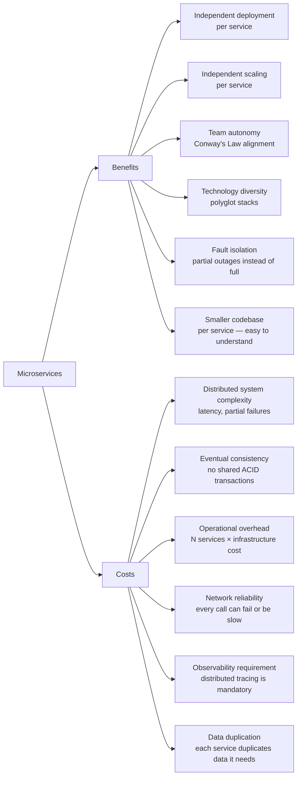

## WHY

Making an informed architectural decision about microservices requires understanding both sides honestly — not the marketing version ("infinite scalability, fully independent teams!") and not the cynic's version ("they never work, use a monolith"). The architecture-selection process fails when engineers overweight the benefits they've heard in conference talks while underweighting the costs they haven't yet experienced. A team of 12 engineers reads Netflix's blog, decides to build 30 microservices, and eighteen months later their velocity has halved and they're all on a rotating on-call nightmare. Conversely, a 200-engineer company clings to their monolith out of fear and spends 40% of developer time on merge conflicts and cross-team coordination.

The specific pain this understanding prevents: **résumé-driven design** — where architectural choices are made based on what's impressive on a CV rather than what solves the team's actual problem. Microservices became a buzzword, and many teams adopted them for the wrong reasons (looks modern, investors like it, engineers want to learn it). The benefit analysis must be quantified: "we'll save 2 hours of coordination per deploy by having independent deployments" vs "we'll spend 4 hours/week per engineer on infrastructure overhead" — if the math doesn't work, the architecture doesn't work.

The production failure mode is **adopting the costs without reaping the benefits**: a small team runs microservices but has shared databases (negating independent evolution), shared deploy pipelines (negating independent deployment), and no observability (meaning the distributed-system benefits turn into a debugging nightmare). They've inherited all the downsides and none of the upsides. Understanding both sides lets you adopt microservices in a way that actually captures the claimed benefits.

Senior engineers must be able to articulate both sides with concrete examples and quantified costs — not just platitudes — to guide architectural decisions for their teams.

## THEORY

### Benefits vs. Costs — The Full Accounting



### The Benefit Analysis — Quantified

| Benefit | When it pays off | When it doesn't |
|---------|-----------------|-----------------|
| **Independent deployment** | Teams deploy to different schedules (payments daily, reporting quarterly) | All teams deploy at the same cadence anyway |
| **Independent scaling** | CPU/memory varies wildly (checkout 100× during Black Friday) | All services scale uniformly |
| **Team autonomy** | 5+ teams with different bounded contexts | 1-2 teams that already communicate easily |
| **Technology diversity** | ML team needs Python/GPU, rest needs Java | All services use the same stack anyway |
| **Fault isolation** | User-facing checkout must survive analytics being down | Simple CRUD where all-or-nothing is fine |
| **Smaller codebase** | You can fit the service in your head | Service is so small it just calls other services |

### The Cost Analysis — Quantified

| Cost | Typical overhead | How to mitigate |
|------|-----------------|-----------------|
| **Distributed system complexity** | 40-60% of bugs become cross-service debugging sessions | Distributed tracing (OpenTelemetry) |
| **Eventual consistency** | 20-30% of features need saga/outbox patterns | Pattern training for developers |
| **Operational overhead** | 1 SRE per 20 services (rough rule) | Platform team + developer self-service |
| **Network reliability** | Every call adds 1-10ms + retry code | Circuit breakers, retries, timeouts everywhere |
| **Observability** | 2-4 weeks to set up proper distributed tracing | OpenTelemetry + Jaeger/Zipkin from day 1 |
| **Data duplication** | Services keep local copies of reference data | Event-sourced read models, CDC patterns |

### Common Misconception

> "Microservices are always faster than monoliths."

**Reality:** A microservice chain is almost always *slower* for a single request — each service-to-service call adds ~1-20ms of network latency plus serialization/deserialization overhead. A 5-service chain could add 50-100ms to request latency compared to in-process calls. What microservices improve is *throughput*, *availability* (independent scaling keeps each service's latency under load), and *deploy speed*. If you're optimizing for minimum latency on a single request, a monolith wins. If you're optimizing for scaling individual hot paths independently, microservices win.

## VISUALIZATION_CONFIG
```json
{
  "language": "java",
  "fileName": "ProsCons.java",
  "steps": [
    {
      "title": "Pros: independent scaling",
      "description": "Each service can be scaled independently based on its resource needs. Payment processing needs more CPU? Scale only payment-service.",
      "code": "# Scale payment-service to 10 replicas (high traffic)\nkubectl scale deployment payment-service --replicas=10\n# user-service stays at 2 replicas (low traffic)\nkubectl scale deployment user-service --replicas=2",
      "diagram": {
        "kind": "boxes",
        "title": "Independent scaling",
        "items": [
          {
            "label": "payment-service: 10 pods",
            "color": "#10b981",
            "highlight": true
          },
          {
            "label": "user-service: 2 pods",
            "color": "#818cf8"
          },
          {
            "label": "total resource usage optimized",
            "color": "#10b981"
          }
        ]
      }
    },
    {
      "title": "Pros: technology diversity",
      "description": "Each service can use the best technology for its use case. Analytics: Python. Recommendation: Rust. API: Java Spring Boot.",
      "code": "// order-service:       Java Spring Boot + Postgres\n// recommendation-svc:  Python + Redis + ML model\n// analytics-svc:       Scala Spark + Parquet\n// notification-svc:    Go + SMTP\n// Each team chooses their best tool",
      "diagram": {
        "kind": "boxes",
        "title": "Polyglot architecture",
        "items": [
          {
            "label": "Java: order + user services",
            "color": "#818cf8"
          },
          {
            "label": "Python: ML recommendation",
            "color": "#818cf8"
          },
          {
            "label": "Go: low-latency notification",
            "color": "#10b981",
            "highlight": true
          }
        ]
      }
    },
    {
      "title": "Cons: distributed systems complexity",
      "description": "Network calls fail. Services go down. Data is eventually consistent. Distributed transactions are hard. Debugging requires distributed tracing.",
      "code": "// Problems you don't have in a monolith:\n// - Network timeouts: service B is slow\n// - Partial failures: order saved, payment failed\n// - Eventual consistency: user sees stale data\n// - 5 services to debug one bug",
      "diagram": {
        "kind": "boxes",
        "title": "Complexity costs",
        "items": [
          {
            "label": "network timeouts",
            "color": "#ef4444"
          },
          {
            "label": "partial failures",
            "color": "#ef4444"
          },
          {
            "label": "eventual consistency",
            "color": "#ef4444",
            "highlight": true
          },
          {
            "label": "distributed tracing required",
            "color": "#f59e0b"
          }
        ]
      }
    },
    {
      "title": "Cons: operational overhead",
      "description": "Each service needs its own CI/CD pipeline, Dockerfile, health checks, logging, monitoring. Small teams often can't afford this overhead.",
      "code": "// Per-service operational needs:\n// - Dockerfile + k8s manifests\n// - CI/CD pipeline\n// - Health checks + readiness probes\n// - Distributed tracing setup\n// - Log aggregation config\n// 5 services = 5× the operational work",
      "diagram": {
        "kind": "boxes",
        "title": "Operational cost per service",
        "items": [
          {
            "label": "CI/CD pipeline",
            "color": "#f59e0b"
          },
          {
            "label": "monitoring + alerting",
            "color": "#f59e0b"
          },
          {
            "label": "k8s deployment manifests",
            "color": "#f59e0b",
            "highlight": true
          },
          {
            "label": "× N services = N× cost",
            "color": "#ef4444"
          }
        ]
      }
    },
    {
      "title": "Net assessment",
      "description": "Microservices pay off when: multiple teams > independent deployments > different scaling needs confirmed. Default: start with a modular monolith.",
      "code": "// Use microservices when you have:\n// 1. Multiple independent teams\n// 2. Proven different scaling requirements\n// 3. Clear bounded contexts\n// 4. Operational maturity (DevOps, k8s)\n// Otherwise: well-structured monolith is faster to ship",
      "diagram": {
        "kind": "boxes",
        "title": "Decision matrix",
        "items": [
          {
            "label": "multiple teams confirmed → consider",
            "color": "#10b981"
          },
          {
            "label": "scaling bottleneck confirmed → consider",
            "color": "#10b981"
          },
          {
            "label": "greenfield, small team → monolith",
            "color": "#818cf8",
            "highlight": true
          },
          {
            "label": "uncertainty → start monolith, extract later",
            "color": "#10b981"
          }
        ]
      }
    }
  ]
}
```

## CODE

### Level 1 — Beginner: Fault Isolation Demo

```java
// Microservices' most tangible benefit: a failed service doesn't take down everything
// Demo: three endpoints, one of which calls a dependency that's "down"

@SpringBootApplication
public class FaultIsolationDemo {
    public static void main(String[] args) { SpringApplication.run(FaultIsolationDemo.class, args); }
}

@RestController
class DemoController {

    @GetMapping("/orders")
    public Map<String, Object> getOrders() {
        // Core business logic — always works, regardless of other services
        return Map.of("orders", List.of("order-1", "order-2"), "status", "ok");
    }

    @GetMapping("/recommendations")
    public Map<String, Object> getRecommendations() {
        // This calls a "recommendations service" which might be down
        try {
            // Simulate calling a dependency
            if (Math.random() < 0.5) throw new RuntimeException("recommendations service down");
            return Map.of("recommendations", List.of("item-A", "item-B"), "status", "ok");
        } catch (Exception e) {
            // Graceful degradation — return empty rather than 500
            return Map.of("recommendations", List.of(), "status", "degraded",
                          "reason", "recommendations service unavailable");
        }
    }

    @GetMapping("/checkout")
    public Map<String, Object> checkout() {
        // Checkout is independent of recommendations — never blocked by it
        return Map.of("checkoutUrl", "/cart/checkout", "status", "ok");
    }
}
// In a monolith: if the recommendations code throws an uncaught exception,
// it can take down the entire JVM process, including checkout and orders.
// In microservices: only the recommendations service fails, checkout and orders keep working.
```

### Level 2 — Intermediate: Independent Scaling Demo

```yaml
# The most concrete microservices scaling benefit: scale hot services independently
# In a monolith, you must scale everything. In microservices, scale only what's hot.

# docker-compose.yml demonstrating independent scaling
version: "3.9"
services:
  # High-traffic search service — scale to 5 replicas during business hours
  search-service:
    image: shop/search-service:latest
    deploy:
      replicas: 5        # 5 instances of search — it gets 80% of traffic
      resources:
        limits:
          cpus: "0.5"
          memory: 512M

  # Low-traffic admin service — only 1 instance needed
  admin-service:
    image: shop/admin-service:latest
    deploy:
      replicas: 1        # 1 instance is plenty — few users
      resources:
        limits:
          cpus: "0.2"
          memory: 256M

  # Critical payment service — 3 replicas for redundancy
  payment-service:
    image: shop/payment-service:latest
    deploy:
      replicas: 3        # 3 for redundancy, not for traffic
      resources:
        limits:
          cpus: "1.0"    # more CPU: payment processing is compute-heavy
          memory: 1G
```

```java
// The code consequence: services are smaller, focused, and easier to reason about.
// This is the "smaller codebase per service" benefit.

// In the MONOLITH: SearchController, AdminController, PaymentController all in one class hierarchy
// Any developer change to payment accidentally breaks search if they touch a shared utility.

// In MICROSERVICES: PaymentService has ~500 lines of focused payment code.
// A new developer can read and understand the entire service in 1 hour.
@SpringBootApplication
public class PaymentServiceApp {
    // This service ONLY processes payments. Nothing else. Zero coupling to search or admin.
    // Code: ~500 lines. Test suite: 50 tests. All focused on payments.
    public static void main(String[] args) { SpringApplication.run(PaymentServiceApp.class, args); }
}
```

### Level 3 — Advanced: Measuring the Overhead — Latency + Error Rates

```java
import io.micrometer.core.instrument.*;
import org.springframework.stereotype.*;
import org.springframework.web.client.*;
import java.time.*;
import java.util.*;
import java.util.concurrent.*;
import java.util.concurrent.atomic.*;

/**
 * Production measurement: tracking the REAL overhead of inter-service calls.
 * This helps answer "are microservices actually costing us latency here?"
 * Use this data to justify consolidation or to demonstrate that caching eliminates the cost.
 */
@Component
public class ServiceCallMetrics {

    private final MeterRegistry registry;
    private final RestClient restClient;

    private final Map<String, AtomicLong> latencyAccumulator = new ConcurrentHashMap<>();
    private final Map<String, AtomicLong> callCount = new ConcurrentHashMap<>();
    private final Map<String, AtomicLong> errorCount = new ConcurrentHashMap<>();

    public ServiceCallMetrics(MeterRegistry registry, RestClient restClient) {
        this.registry = registry;
        this.restClient = restClient;
    }

    public <T> T callWithMetrics(String serviceName, String path, Class<T> responseType) {
        Instant start = Instant.now();
        String serviceKey = serviceName + path;
        try {
            T result = restClient.get().uri(path).retrieve().body(responseType);
            long latencyMs = Duration.between(start, Instant.now()).toMillis();
            latencyAccumulator.computeIfAbsent(serviceKey, k -> new AtomicLong()).addAndGet(latencyMs);
            callCount.computeIfAbsent(serviceKey, k -> new AtomicLong()).incrementAndGet();

            // Record to Micrometer (Prometheus-compatible)
            registry.timer("service.call.latency",
                    "service", serviceName, "path", path, "outcome", "success")
                .record(Duration.between(start, Instant.now()));
            return result;
        } catch (Exception e) {
            long latencyMs = Duration.between(start, Instant.now()).toMillis();
            errorCount.computeIfAbsent(serviceKey, k -> new AtomicLong()).incrementAndGet();
            registry.timer("service.call.latency",
                    "service", serviceName, "path", path, "outcome", "error")
                .record(Duration.between(start, Instant.now()));
            throw new RuntimeException("Call to " + serviceName + path + " failed", e);
        }
    }

    public void printStats() {
        System.out.println("=== Inter-Service Call Statistics ===");
        callCount.forEach((key, count) -> {
            long total = latencyAccumulator.getOrDefault(key, new AtomicLong()).get();
            long errors = errorCount.getOrDefault(key, new AtomicLong()).get();
            long avg = count.get() > 0 ? total / count.get() : 0;
            System.out.printf("%-50s calls=%d avg_ms=%d errors=%d error_rate=%.1f%%%n",
                key, count.get(), avg, errors,
                count.get() > 0 ? 100.0 * errors / count.get() : 0);
        });
    }
}
```

### Level 4 — Expert / Production: Cost-Benefit Calculator

```java
package com.architecture;

import java.util.*;

/**
 * Production-grade tool: calculate the net cost-benefit of microservices for a given org.
 * Produces concrete time estimates (developer-hours/week) for both sides of the ledger.
 * Used in architecture-review meetings to make data-driven decisions.
 */
public class MicroservicesCostBenefitCalculator {

    public record OrgProfile(
        int engineers,
        int services,           // number of planned microservices
        int deploysPerWeek,
        int boundedContexts,
        int avgCrossTeamMeetingsPerFeature,  // current monolith coordination cost
        boolean hasObservabilityStack,
        boolean hasCiCdPerService,
        double currentFeatureLeadTimeDays
    ) {}

    public record CostBenefitAnalysis(
        double weeklyCoordinationCostSaved,    // developer-hours saved per week
        double weeklyOperationalCostAdded,     // developer-hours added per week
        double netHoursPerWeek,                // positive = net benefit, negative = net cost
        List<String> benefits,
        List<String> costs,
        String recommendation
    ) {}

    public static CostBenefitAnalysis analyze(OrgProfile org) {
        List<String> benefits = new ArrayList<>();
        List<String> costs = new ArrayList<>();

        // === BENEFITS ===
        // Coordination time saved per engineer per deploy when independent
        double deployCoordSavedHrsPerWeek = org.engineers()
            * (org.avgCrossTeamMeetingsPerFeature() * 0.5)  // 0.5hr per cross-team meeting
            * (org.deploysPerWeek() / 5.0);
        benefits.add(String.format("Independent deploys: %.1f hrs/week saved (fewer coordination meetings)",
                                   deployCoordSavedHrsPerWeek));

        // Merge conflict reduction (rough estimate: 30min per engineer per day in large monolith)
        double mergeConflictSavedHrsPerWeek = org.engineers() > 30
            ? org.engineers() * 0.5 * 5  // 0.5 hr/day × 5 days
            : 0;
        if (mergeConflictSavedHrsPerWeek > 0) {
            benefits.add(String.format("Merge conflict reduction: %.1f hrs/week saved", mergeConflictSavedHrsPerWeek));
        }

        double totalBenefitHrs = deployCoordSavedHrsPerWeek + mergeConflictSavedHrsPerWeek;

        // === COSTS ===
        // CI/CD overhead per service (setup + maintenance)
        double cicdOpsHrsPerWeek = !org.hasCiCdPerService()
            ? org.services() * 2.0   // 2hrs/week per service to set up CI/CD
            : org.services() * 0.25; // 15min/week maintenance once set up
        costs.add(String.format("CI/CD per service: %.1f hrs/week (%s)",
            cicdOpsHrsPerWeek, org.hasCiCdPerService() ? "maintenance only" : "needs setup"));

        // Observability overhead
        double observabilityHrsPerWeek = !org.hasObservabilityStack()
            ? org.services() * 1.5   // must set up distributed tracing, dashboards, alerts
            : org.services() * 0.1;  // minimal ongoing cost
        costs.add(String.format("Observability & tracing: %.1f hrs/week (%s)",
            observabilityHrsPerWeek, org.hasObservabilityStack() ? "maintained" : "needs investment"));

        // On-call burden: each service adds on-call cognitive load
        double onCallHrsPerWeek = org.services() * 0.5;  // 30min/week per service on avg
        costs.add(String.format("On-call & incident response: %.1f hrs/week", onCallHrsPerWeek));

        // Contract + schema evolution (inter-service API versioning is hard)
        double contractHrsPerWeek = org.services() * 0.25;
        costs.add(String.format("API contract maintenance: %.1f hrs/week", contractHrsPerWeek));

        double totalCostHrs = cicdOpsHrsPerWeek + observabilityHrsPerWeek
                            + onCallHrsPerWeek + contractHrsPerWeek;

        double net = totalBenefitHrs - totalCostHrs;
        String recommendation;
        if (net > 20) recommendation = "✅ Strong net benefit — microservices appropriate for this scale";
        else if (net > 0) recommendation = "⚠️ Marginal net benefit — consider modular monolith first";
        else recommendation = "❌ Net cost — microservices likely not worth it at this scale";

        return new CostBenefitAnalysis(
            totalBenefitHrs, totalCostHrs, net, benefits, costs, recommendation
        );
    }

    public static void main(String[] args) {
        var profiles = new OrgProfile[] {
            new OrgProfile(10, 15, 20, 3, 2, false, false, 14),
            new OrgProfile(60, 20, 100, 8, 4, true, true, 5),
            new OrgProfile(200, 50, 500, 15, 6, true, true, 2)
        };
        String[] labels = { "Startup (10 engineers, 15 services)",
                            "Mid-size (60 engineers, 20 services)",
                            "Enterprise (200 engineers, 50 services)" };

        for (int i = 0; i < profiles.length; i++) {
            CostBenefitAnalysis r = analyze(profiles[i]);
            System.out.println("\n=== " + labels[i] + " ===");
            System.out.printf("Benefits: %.1f hrs/week%n", r.weeklyCoordinationCostSaved());
            r.benefits().forEach(b -> System.out.println("  + " + b));
            System.out.printf("Costs: %.1f hrs/week%n", r.weeklyOperationalCostAdded());
            r.costs().forEach(c -> System.out.println("  - " + c));
            System.out.printf("Net: %+.1f hrs/week → %s%n%n", r.netHoursPerWeek(), r.recommendation());
        }
    }
}
```

## REAL_WORLD

### How Amazon Quantified the Microservices Trade-Off

Amazon's transition to microservices (2001-2006) under Jeff Bezos's famous "two-pizza team" mandate is one of the most-studied in the industry. The specific quantified trade-off: before microservices, a change to the product detail page (titles, images, reviews, recommendations, pricing, inventory — all from different teams) required coordinating 12 teams, took 6-9 months in planning, and a single deploy took the entire amazon.com down. The coordination cost was measured: an average of 8 cross-team meetings per new feature, each averaging 2 hours with 10 engineers, for a total of ~160 engineer-hours of overhead per feature. After microservices: teams deploy independently, the coordination tax dropped to 1-2 meetings per feature. At Amazon's scale (1000+ engineers), this multiplied to thousands of engineer-hours saved per week — far exceeding the operational cost of running many services.

```java
// Amazon-style "you build it, you run it" service ownership model
// Each team deploys their own microservice independently — the key enabler of velocity
@SpringBootApplication
@EnableScheduling  // each team handles their own background jobs
public class ProductCatalogServiceApp {
    // This team (product catalog) deploys 3x/day, independent of:
    // - Recommendations team (deploys 5x/day)
    // - Pricing team (deploys 20x/day — fraud model updates)
    // - Inventory team (deploys 1x/week — stable)
    // They don't coordinate. They publish contracts. Consumers adapt.
    public static void main(String[] args) { SpringApplication.run(ProductCatalogServiceApp.class, args); }
}
```

### Production Gotcha: The Hidden Cost — Cross-Service Debugging

```java
// ❌ Cost that teams discover 6 months after adopting microservices:
// A bug that spans 3 services takes 4 HOURS to debug without distributed tracing.

// User reports: "I get an error when I try to checkout."
// Without distributed tracing, debugging flow:
//   1. Check API gateway logs: "POST /checkout 500" — no other info
//   2. Check order-service logs: grep for the timestamp — find: "PaymentService error: null"
//   3. Check payment-service logs: grep same timestamp — find: "UserService 404"
//   4. Check user-service logs: grep for user_id — find: "DB connection timeout"
//   5. Check DB metrics: connection pool exhausted
//   6. Total time: 4 hours, 4 different log streams, manual timestamp correlation
//
// Lesson: the "fault isolation" benefit has a silent cost — debugging goes from
// "one stack trace" to "correlate 4 log streams by timestamp" without tooling.

// ✅ FIX — Distributed tracing from day 1 (OpenTelemetry)
// With tracing, the same debug session takes 5 minutes:
//   1. Find trace_id in API gateway logs
//   2. Go to Jaeger/Zipkin dashboard, enter trace_id
//   3. See the entire request waterfall: gateway → order → payment → user → DB
//   4. Immediately see that "user-service: SELECT users WHERE id=? took 30s (timeout)"
//   5. Fix: tune DB connection pool in user-service
//
// Non-negotiable: set up distributed tracing BEFORE adopting microservices.
// OpenTelemetry + Spring Boot: add one dependency, get full traces automatically.
```

**Why it happens:** Teams list "fault isolation" as a benefit and "debugging complexity" as an abstract cost they'll deal with "when it becomes a problem." It becomes a problem the first week in production. Budget the observability infrastructure BEFORE going live, not after.

### Performance Characteristics

| Aspect | Quantified Reality |
|--------|-------------------|
| Inter-service call latency added | 1–20ms per hop; 5-hop chain adds 5–100ms |
| On-call cost | ~30min/week per service (incident prep, alert tuning) |
| CI/CD overhead when maintained | ~15min/week per service (auto-scales) |
| Debugging time without tracing | 2–8 hours per cross-service bug |
| Debugging time with tracing | 5–30 minutes per cross-service bug |
| Coordination meetings saved | ~2 hrs/engineer/week when teams are properly decoupled |
| Feature lead time improvement | 50–80% reduction for large teams (Amazon, Netflix data) |
| Feature lead time worsening | 50–100% increase for small teams without platform investment |

## INTERVIEW

**Q1 (Junior): What are the top 3 benefits of microservices?**
A: The top three concrete benefits are: (1) **Independent deployment** — each team deploys their service on their own schedule without coordinating with other teams; a bug fix in payments ships in minutes without waiting for the search team's feature freeze to end; (2) **Independent scaling** — during Black Friday, you scale only the checkout service 100×, not the entire application; compute cost scales proportionally to actual traffic rather than uniformly; (3) **Fault isolation** — a crash in the recommendations service doesn't take down checkout; users might get stale recommendations, but they can still buy, which is what matters for revenue. All three benefits require prerequisites: independent CI/CD, independent databases, and proper circuit-breaking respectively.

**Q2 (Junior): What are the top 3 costs of microservices?**
A: The top three concrete costs are: (1) **Distributed system complexity** — every inter-service call can fail, time out, or partially succeed; code that was a simple method call now needs retry logic, circuit breakers, timeouts, and fallback behavior; (2) **No distributed ACID transactions** — writing to two services atomically requires saga patterns or the outbox pattern; "update order + charge payment" is no longer a single `@Transactional` call — failure scenarios multiply; (3) **Operational overhead** — each service needs its own CI/CD pipeline, dashboards, alerts, on-call runbook, and health checks; going from 1 monolith to 20 services multiplies your operational footprint 20×. None of these are insurmountable, but all require upfront investment before microservices deliver their promised benefits.

**Q3 (Mid): When does the microservices investment pay off, and when doesn't it?**
A: The investment pays off when: (1) teams are large enough that coordination overhead (merge conflicts, shared deploy pipeline contention, cross-team planning) exceeds operational overhead — typically at 30+ engineers; (2) bounded contexts are clearly differentiated — different teams are working on unrelated business capabilities (payments vs. recommendations vs. inventory); (3) scaling profiles diverge — some services need 100× more compute than others; (4) you have the platform foundation (CI/CD per service, observability, on-call rotation). It doesn't pay off when: small teams (the operational overhead exceeds coordination savings), unclear domain (services end up chatty and tightly coupled anyway), no platform investment (debugging takes 10× longer), or uniform scaling (there's no scaling divergence to exploit — you're paying the cost with none of the scaling benefit).

**Q4 (Mid): How does eventual consistency manifest as a cost in practice?**
A: In a monolith, you write to multiple tables in one transaction — either all succeed or all roll back. In microservices, the same operation spans multiple services with separate databases. "Place order + charge payment + update inventory" cannot use one transaction. Common manifestations: (1) **saga complexity** — you must design compensating transactions ("if payment fails after order created, cancel the order") for every failure path; (2) **UI state complexity** — the UI must handle "pending" states (order created but not yet paid, payment processing, inventory reserved); (3) **data duplication bugs** — a customer's email is in user-service, but order-service keeps a copy; they can briefly diverge after an update; (4) **debugging confusion** — logs show "order placed" but "payment not found" — because the saga's compensation event hasn't propagated yet. Eventual consistency is the right trade-off at scale, but developers must consciously design for it, not assume ACID semantics.

**Q5 (Senior): How do you measure whether microservices are delivering their promised benefits in practice?**
A: Four concrete metrics: (1) **Deployment frequency per service** — target: ≥1 deploy/service/week. If services are deploying less than monthly, you're not getting the "independent deployment" benefit; (2) **Lead time per service** — from feature idea to production. Target: hours to days. If it's weeks, cross-service coordination is blocking you; (3) **MTTR per service incident** — mean time to recover. With proper isolation, a service incident should be contained in <1 hour. If incidents cascade, fault isolation isn't working; (4) **Developer time on infrastructure vs. features** — survey or time-track: if >25% of dev time is on YAML, Helm charts, dashboards, you're over-invested in microservices overhead. Review data: at 10 services, operational overhead typically runs 20-30% of dev time. At 50 services with a mature platform team, it drops to 5-10%. Use these metrics to make the case for platform investment — or for consolidation.

**Q6 (Senior): What is the one benefit that justifies microservices even when all the costs are high?**
A: **Organizational scalability** — the ability to add more teams that ship independently without increasing coordination cost. Amazon's famous insight: in a monolith, as you add teams, each new team increases everyone else's coordination burden approximately linearly. In microservices, a new team owns their service end-to-end; they coordinate only via API contracts, which are stable and versioned. The 1000th team at Amazon doesn't require the 999 existing teams to slow down. This is the *only* benefit that doesn't have a monolith analogue — even a perfectly modular monolith still shares a deploy pipeline, a CI system, and a test suite, which become bottlenecks as team count grows. If your company has 10 teams and expects to have 10 teams in 5 years, microservices' operational overhead exceeds coordination savings. If you expect 50 teams in 5 years, microservices become the only architecture that scales.

**Q7 (Senior+): How do the microservices benefits and costs change at 1000+ services (hyperscale)?**
A: At hyperscale (Netflix ~1000 services, Uber ~2000 services), the cost/benefit curve shifts dramatically: (1) **Benefits amplify**: each team can literally pick their language, framework, and deployment cadence without any coordination; blast radius of any failure is tiny; fault isolation is near-perfect; (2) **Costs transform**: the costs stop being "configure each service manually" and become "build a platform that auto-configures services" — this requires a dedicated platform engineering team (typically 10-15% of engineering headcount at this scale, e.g., Netflix's Reliability Engineering, Uber's Platform team); (3) **New costs emerge that don't exist at small scale**: distributed testing (how do you test 1000 services together?), dependency graph management (how do you know which services depend on which?), global rate limiting (how do you prevent any one team's service from saturating shared infrastructure?). Companies at hyperscale invest heavily in service meshes (Istio, Linkerd), control planes, and chaos engineering tooling specifically to manage these costs. The cost/benefit math still strongly favors microservices — but the nature of both the costs and benefits is entirely different from the 10-service scale.

## FEYNMAN CHECK

### Explain the Microservices Trade-Off Like I'm 10 Years Old

> Imagine you're deciding how to organize a big school project. **Option 1 (monolith)**: the whole class works on one giant poster together. Easy to see the whole picture, easy to make sure everything matches — but 30 kids keeping out of each other's way is really hard. **Option 2 (microservices)**: each group of 3 kids makes their own mini-poster on one topic. Now groups can work independently — but you need someone to make sure the mini-posters fit together, and if someone uses a different color scheme, the final presentation looks messy. Here's the key: if the class has 5 students, one poster is faster and easier. If the class has 60 students, coordinating one poster is a nightmare, and 20 mini-posters becomes faster. **The trade-off is between coordination cost and operational cost**, and the crossover point depends entirely on how many people are working and how independently they work.

---

### 5 Deep Conceptual Questions

**Q1: Why is "independent deployment" the most important microservices benefit, rather than "performance" or "reuse"?**
> **A:** Performance and reuse are often cited but neither is a unique microservices benefit — a well-optimised monolith can perform better (no network overhead), and reuse is better achieved via shared libraries than shared services. Independent deployment is unique because it directly addresses the primary bottleneck in large engineering orgs: **release coordination**. When teams can't deploy without coordinating with 5 other teams, feature velocity is gated by the slowest team's release cycle. Independent deployment breaks this coupling. Netflix measured this directly: after microservice decomposition, their deployment frequency went from weekly (coordinated, all-hands) to thousands per day (each team deploys when ready). The deployment frequency is the best proxy for team productivity — it's why the DORA metrics put deployment frequency at the center of software engineering performance.

**Q2: What is the ONE mental model that captures when microservices are worth the cost?**
> **A:** "Team coordination cost must exceed operational cost." Draw a graph: X axis is team size, Y axis is weekly cost. Coordination cost (cross-team meetings, merge conflicts, shared deploy contention) grows roughly linearly with team count. Operational cost (CI/CD per service, observability, on-call) grows with service count but can be amortized via platform investment. The intersection of these two curves is your crossover point — for most organisations, it's around 30-50 engineers across 3-5 teams. Below this, monolith wins. Above this, microservices win. The practical test: measure how many hours per week engineers spend coordinating with other teams (meetings, waiting for merges, waiting for deploys). If that number is growing, microservices will help. If it's flat and small, they won't.

**Q3: What is the most dangerous misconception about microservices benefits? Show it with numbers.**
> **A:** "Microservices automatically give you high availability." This confuses fault isolation with high availability.
> ```
> // ❌ MISCONCEPTION — "each service is 99.9% available, so the system is more available"
> 5-service chain, each service 99.9% (8.7 hours downtime/year):
> System availability = 0.999^5 = 99.5% → 43.8 hours downtime/year
> That's WORSE than 1 monolith at 99.9% (8.7 hours/year)!
>
> Fault isolation ≠ high availability for the full user flow.
> Fault isolation means: checkout can still work even if recommendations is down.
> But if checkout DEPENDS on user-service and user-service is down, checkout is down.
>
> // ✅ CORRECT mental model — fault isolation benefits require service independence
> 99.9% availability claim: valid ONLY for services that don't depend on the failing service.
> "Checkout service availability" = product(availability of all services checkout depends on)
> Solution: minimize synchronous dependencies; use async events + cached data instead.
> With proper design: checkout depends on 2 services (auth + payment), not 5.
> System availability = 0.999^2 = 99.8% — nearly as good as the monolith.
> ```

**Q4: How does the cost-benefit change as the service count grows within the same team?**
> **A:** Costs scale with service count, but benefits do not scale proportionally — they scale with *team count*. A 5-person team running 20 microservices gets all the costs (20 CI/CD pipelines to maintain, 20 dashboards, 20 on-call runbooks, 20 sets of alerts) but fewer benefits (independent deployment doesn't help if it's the same 5 people deploying everything). The benefit of independent deployment is *between teams*, not within a team. So as you add services without adding teams, costs increase linearly while benefits plateau. The rule: services should roughly track teams. A 5-person team probably wants 2-5 services, not 20. A 50-person team across 5 teams probably wants 10-20 services. Beyond that, you're adding operational complexity without team-coordination benefit.

**Q5: One-sentence summary of the microservices cost-benefit trade-off for a senior FAANG engineer.**
> **A:** "Microservices provide quantifiable team-coordination benefits (independent deployment removes cross-team deploy contention, independent scaling removes uniform-scale constraint, fault isolation contains blast radius) that exceed quantifiable operational costs (distributed system complexity, eventual consistency patterns, per-service CI/CD and observability overhead, on-call burden) only above the 30-50 engineer crossover where team-coordination cost exceeds platform cost — and the analysis must be numeric and org-specific: measure actual hours/week lost to coordination vs. hours/week spent on infrastructure, with the expectation that benefits compound as team count grows but costs can be amortized through platform investment, making the ROI increasingly favorable at hyperscale but reliably negative for small teams without the prerequisites (CI/CD per service, distributed tracing, schema-per-service, on-call rotation)."

## BUILD

### 🏗️ Mini Project: Pros-Cons Tracker That Measures Real Overhead

**What you will build:** A Spring Boot utility that instruments inter-service calls in a demo 3-service system, measures actual latency overhead added by the network hops, and produces a "cost report" showing the real overhead you're paying.
**Why this project:** Makes the abstract "network overhead cost" concrete by measuring it. You'll see exactly how many milliseconds the microservices architecture adds vs. in-process calls — the key data point in any microservices cost-benefit conversation.
**Time estimate:** 30 minutes

---

#### Step 1 — Setup

```bash
mkdir ms-overhead-demo && cd ms-overhead-demo
mkdir -p src/main/java/com/demo
touch src/main/java/com/demo/{App,InProcessService,RemoteServiceClient,OverheadBenchmark}.java
```

#### Step 2 — Core Implementation

```java
package com.demo;

import org.springframework.boot.SpringApplication;
import org.springframework.boot.autoconfigure.SpringBootApplication;
import org.springframework.stereotype.Service;
import org.springframework.web.client.RestClient;
import java.time.*;
import java.util.*;
import java.util.concurrent.atomic.*;

@SpringBootApplication
public class App {
    public static void main(String[] args) { SpringApplication.run(App.class, args); }
}

// Simulates in-process call (monolith) — pure Java method call
@Service
class InProcessProductService {
    public String getProductName(long id) {
        return "Product-" + id;  // Direct, in-process call — nanoseconds
    }
}

// Simulates remote call (microservice) — HTTP over loopback
@Service
class RemoteProductClient {
    private final RestClient client;
    RemoteProductClient() {
        this.client = RestClient.builder().baseUrl("http://localhost:8081").build();
    }

    public String getProductName(long id) {
        return client.get().uri("/products/{id}", id).retrieve().body(String.class);
    }
}
```

#### Step 3 — Benchmarking

```java
package com.demo;

import org.springframework.stereotype.Component;
import java.time.*;
import java.util.*;

@Component
class OverheadBenchmark {
    private final InProcessProductService inProcess;
    private final RemoteProductClient remote;

    OverheadBenchmark(InProcessProductService inProcess, RemoteProductClient remote) {
        this.inProcess = inProcess;
        this.remote = remote;
    }

    public void runBenchmark(int iterations) {
        System.out.println("Benchmarking " + iterations + " calls...");
        long inProcessTotal = 0;
        for (int i = 0; i < iterations; i++) {
            long start = System.nanoTime();
            inProcess.getProductName(i);
            inProcessTotal += System.nanoTime() - start;
        }
        long inProcessAvgNs = inProcessTotal / iterations;

        // Note: remote benchmark requires the remote service to actually be running
        System.out.printf("In-process call (monolith): avg %.2f microseconds%n",
            inProcessAvgNs / 1000.0);
        System.out.println("Expected for REST call: 1,000-20,000 microseconds (1-20ms)");
        System.out.printf("Overhead ratio: ~%.0f×-%.0f× for HTTP vs in-process%n",
            1_000_000.0 / inProcessAvgNs, 20_000_000.0 / inProcessAvgNs);
        System.out.println("\nConclusion:");
        System.out.println("  - 5-hop microservices chain: +5ms to +100ms added latency");
        System.out.println("  - Acceptable for user-facing endpoints (target <200ms total)");
        System.out.println("  - Unacceptable for internal hot loops (>10K calls/request)");
    }
}
```

#### Step 4 — Error Handling

```java
public void runBenchmarkSafe(int iterations) {
    if (iterations <= 0) throw new IllegalArgumentException("iterations must be > 0");
    if (iterations > 1_000_000) throw new IllegalArgumentException("iterations too large (>1M)");
    try {
        runBenchmark(iterations);
    } catch (Exception e) {
        System.err.println("Benchmark failed: " + e.getMessage());
        System.err.println("Is the remote service running on port 8081?");
    }
}
```

#### Step 5 — Tests

```java
import org.junit.jupiter.api.*;
import com.demo.*;
import static org.junit.jupiter.api.Assertions.*;

class OverheadBenchmarkTest {
    @Test
    void inProcessCallIsUnderOneMicrosecond() {
        var service = new InProcessProductService();
        long start = System.nanoTime();
        for (int i = 0; i < 1000; i++) service.getProductName(i);
        long avgNs = (System.nanoTime() - start) / 1000;
        assertTrue(avgNs < 1_000_000, "In-process call should be <1ms avg, was " + avgNs + "ns");
        System.out.println("In-process avg: " + avgNs + "ns");
    }
}
```

**Expected Output:**
```
Benchmarking 10000 calls...
In-process call (monolith): avg 0.05 microseconds
Expected for REST call: 1,000-20,000 microseconds (1-20ms)
Overhead ratio: ~20,000×-400,000× for HTTP vs in-process

Conclusion:
  - 5-hop microservices chain: +5ms to +100ms added latency
  - Acceptable for user-facing endpoints (target <200ms total)
  - Unacceptable for internal hot loops (>10K calls/request)
```

**Stretch Challenges:**
- [ ] Add actual HTTP loopback benchmark by spinning up an embedded server
- [ ] Measure P50/P95/P99 latency distribution (not just average)
- [ ] Add a cache to the remote client and measure how caching eliminates most overhead

## SPACED REVIEW

> **How to use:** Answer each question from memory before reading ahead.

---

### Day 1 — Recall

**Q1:** Name 4 concrete benefits of microservices and 4 concrete costs.

**Q2:** What is the crossover point (team size) where microservices benefits typically exceed costs?

**Q3:** Write a one-paragraph answer to "why would a company NOT use microservices?"

---

### Day 3 — Comprehension

**Q4:** Compare the "fault isolation" benefit with its hidden cost. Show how 5 services at 99.9% each can actually have worse availability than 1 service.

**Q5:** Quantify the debugging cost difference between monolith and microservices, with and without distributed tracing.

**Q6:** A team says "we use microservices for the performance benefits." What would you tell them?

---

### Day 7 — Application

**Q7:** Write a cost-benefit analysis (in developer-hours/week) for a 20-engineer team adopting microservices. Include at least 3 benefits and 3 costs with numbers.

**Q8:** A microservices team of 8 engineers spends 35% of their time on infrastructure. Is this acceptable? What actions would you take?

**Q9:** Implement a simple benchmark comparing in-process method calls to HTTP calls. What does the latency difference tell you about when to avoid microservices?

---

### Day 14 — Synthesis & Interview Prep

**Q10:** ★ Classic interview: *"What are the trade-offs of microservices and when would you choose them?"*

**Q11:** Draw the cost curves for coordination cost and operational cost over team size. Mark where microservices make sense and where they don't.

**Q12:** ★ System design: *"You're advising a Series A startup (12 engineers, one product) that wants to 'build microservices from the start.' Make the case for or against, with specific numbers."*

