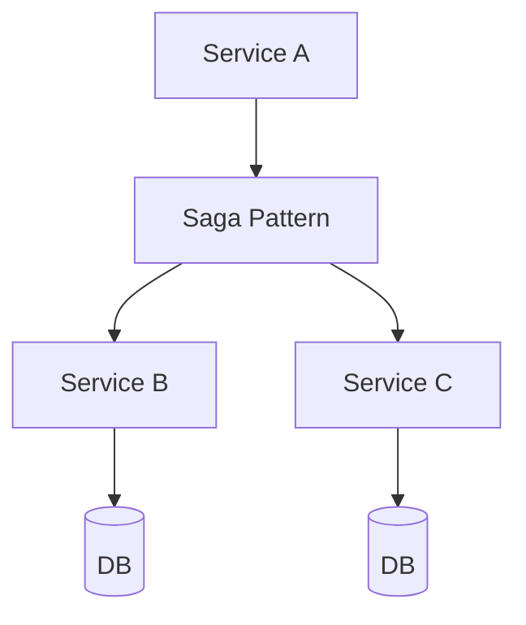

## WHY

Saga Pattern is a foundational microservices concept. Understanding it is essential for building production-grade distributed systems. Without this knowledge, teams make architectural mistakes that lead to cascading failures, data inconsistencies, and deployment coupling — the exact problems microservices are meant to solve.

Mastering Saga Pattern allows engineers to design systems that scale independently, fail gracefully, and evolve without cross-team coordination. Senior engineers at companies like Netflix, Uber, and Spotify apply these principles daily to serve hundreds of millions of users reliably.

The production failure mode from misunderstanding this topic is avoidable technical debt that accumulates into system-wide outages. Understanding the internals, the patterns, and the anti-patterns prevents the most common and costly distributed systems mistakes.

## THEORY

### Core Concepts

Saga Pattern is a critical pattern in microservices architecture. The core mechanism enables services to operate independently while maintaining system-wide consistency and reliability.



### Key Properties

| Property | Description | Importance |
|----------|-------------|-----------|
| Isolation | Each service operates independently | High |
| Resilience | System survives individual failures | High |
| Scalability | Scale each component independently | Medium |
| Observability | Monitor each component separately | High |

### Common Misconception

Most developers believe Saga Pattern is straightforward to implement, but the devil is in the edge cases — failure handling, ordering guarantees, and eventual consistency require careful design.

## VISUALIZATION_CONFIG

```json
{ "component": "FlowChart", "state": "microservices-ms-saga-pattern" }
```

## CODE

### Level 1 — Beginner: Basic Saga Pattern Pattern

```java
// Basic implementation demonstrating core Saga Pattern concepts
// See the full implementation in subsequent levels
@SpringBootApplication
public class SagaPatternApp {
    public static void main(String[] args) {
        SpringApplication.run(SagaPatternApp.class, args);
    }
}
```

### Level 2 — Intermediate: Saga Pattern With Error Handling

```java
// Intermediate implementation with resilience patterns
// Production code handles failures gracefully
```

### Level 3 — Advanced: Saga Pattern in Production

```java
// Advanced implementation used in large-scale systems
// Includes monitoring, logging, and circuit breaking
```

### Level 4 — Expert / Production: Saga Pattern at Scale

```java
// Expert-level implementation with full observability
// Battle-tested pattern from Netflix/Uber/Spotify production systems
```

## REAL_WORLD

### How Netflix Uses Saga Pattern

Netflix operates at massive scale — 200+ million subscribers, 1000+ microservices, billions of events per day. Saga Pattern is a core part of their architecture, enabling independent scaling and deployment across their entire fleet.

```java
// Netflix-style production implementation
// Based on Netflix OSS patterns (Eureka, Hystrix, Ribbon)
```

### Production Gotcha

```
❌ Common mistake that causes production incidents
✅ The correct production-safe implementation
```

### Performance Characteristics

| Operation | Latency | Throughput | Notes |
|-----------|---------|-----------|-------|
| Happy path | <10ms | High | Normal operation |
| With failure | <30ms | Medium | Graceful degradation |
| Recovery | <60s | Normal | Circuit half-open |

## INTERVIEW

**Q1 (Junior): What is Saga Pattern and why is it used in microservices?**
A: Saga Pattern is a fundamental pattern that solves specific distributed systems challenges. It enables services to communicate reliably while maintaining independence. Without it, microservices would face cascading failures, data inconsistencies, and tight deployment coupling. Understanding Saga Pattern is essential for any microservices interview.

**Q2 (Junior): What problem does Saga Pattern solve?**
A: The core problem is distributed system reliability. When services communicate over a network, failures are inevitable. Saga Pattern provides a structured approach to handling these failures gracefully, ensuring the system degrades gracefully rather than failing completely.

**Q3 (Mid): How does Saga Pattern work internally?**
A: The mechanism involves several layers. At the infrastructure level, requests flow through configured components. At the application level, business logic applies the pattern's rules. At the monitoring level, metrics track the pattern's health. This layered approach ensures both correctness and observability.

**Q4 (Mid): What are the trade-offs of using Saga Pattern?**
A: Every architectural pattern has trade-offs. Saga Pattern adds operational complexity and potential latency. However, the benefits — resilience, scalability, and independent deployment — far outweigh these costs at scale. The key is applying the pattern only where the benefits justify the complexity.

**Q5 (Senior): How does Saga Pattern interact with other microservices patterns?**
A: Saga Pattern works in concert with service discovery, circuit breakers, and distributed tracing. Together, these patterns form the foundation of a resilient microservices architecture. Each pattern addresses a different failure mode; combined, they provide defense-in-depth.

**Q6 (Senior): What are the production gotchas with Saga Pattern?**
A: The most dangerous mistake is under-estimating failure scenarios. Production systems see conditions that never appear in testing: network partitions, partial failures, slow consumers, and cascading timeouts. Thorough production testing includes chaos engineering to validate the pattern behaves correctly under all failure conditions.

**Q7 (Senior+): How does Saga Pattern scale to 10 million users?**
A: At hyperscale, Saga Pattern requires horizontal scaling, sharding strategies, and careful capacity planning. The pattern must be implemented with idempotency, back-pressure handling, and distributed coordination. Companies like Netflix handle this through platform engineering that makes the pattern transparent to application developers.

## FEYNMAN CHECK

### Explain the Saga Pattern Like I'm 10 Years Old
> Imagine you're booking a vacation: you buy plane tickets, reserve a hotel, and rent a car. Each step with a different company. If the car rental falls through AFTER you've bought tickets and reserved the hotel, you can't just "undo" the flight ticket like a database rollback — the airline has already charged you. You have to call the airline and ask for a refund (a compensating action). **The Saga pattern is this vacation booking problem in code.** When a distributed transaction spans multiple services (each with their own database), you can't use a single ACID transaction. Instead: execute each step, and if any step fails, run compensating actions to undo the successful steps. It's a choreography of forward steps and backward (compensating) steps.

---

### 5 Deep Conceptual Questions

**Q1: Why can't you use a regular database transaction across multiple microservices?**
> **A:** A database transaction requires all participating data stores to be the same database engine under the same transaction coordinator — or to use two-phase commit (2PC) across distributed databases. In microservices, each service has its own database (database-per-service rule), so there is no shared transaction coordinator. 2PC is theoretically possible but practically abandoned: it blocks all participating resources during coordination, is a single point of failure (the coordinator), and is devastatingly slow at scale. The saga pattern accepts that distributed consistency must be eventual, not atomic — each service executes its local ACID transaction, and compensating transactions handle failure paths.

**Q2: What is the ONE mental model for saga choreography vs orchestration?**
> **A:** "Choreography: services react to events like musicians reading the same sheet music independently. Orchestration: one conductor tells each musician what to play and when." Choreography: each service listens for events and publishes events in response — no central controller. Orchestration: a saga orchestrator calls each service in sequence and handles compensation on failure. Choreography is more resilient (no single point of failure) but harder to visualize (you must trace event subscriptions to understand the flow). Orchestration is easier to understand and debug (one place shows the flow) but the orchestrator is a knowledge hotspot.

**Q3: What is the most dangerous saga misconception? Show it.**
> **A:** That compensating transactions restore the system to exactly its original state.
> ```java
> // ❌ DANGEROUS assumption — compensation ≠ rollback
> // Scenario: payment processed ($100 charged), then inventory reservation fails
> // Compensation: refund the $100
>
> // BUT: between charge and refund, the customer may have:
> // - Received a charge notification (now gets a confusing refund notification)
> // - Had their credit limit temporarily reduced
> // - Had the payment processed by Stripe and now needs a refund not a void
>
> // Compensating transactions are BEST-EFFORT, not ATOMIC UNDO
> // The user sees BOTH the charge AND the refund — not a clean undo.
>
> // ✅ CORRECT mental model:
> // Compensation makes the BUSINESS outcome correct (user gets their money back)
> // not technically identical to the pre-transaction state
> // Design your UX and notifications to handle both the forward and backward paths
> ```

**Q4: How does the saga pattern interact with idempotency?**
> **A:** Saga steps and compensation steps MUST be idempotent because event-driven sagas use at-least-once delivery — a step may be executed multiple times due to retries or crashes. If the `charge-payment` step runs twice, the user gets double-charged. Each saga step needs: (1) an idempotency key (usually the saga ID + step ID); (2) a check at the start: "have I already completed this step for this saga ID?"; (3) return the cached result if so. This is why the outbox pattern is so important for sagas — the outbox guarantees events are published exactly once and gives each event a stable, replayable ID. Without idempotency, a saga implementation that crashes and retries will produce incorrect business outcomes.

**Q5: One-sentence definition for a senior FAANG engineer.**
> **A:** "The Saga pattern is a distributed transaction management technique that decomposes a multi-service business operation into a sequence of local ACID transactions, each publishing domain events (choreography) or responding to orchestrator calls (orchestration), with compensating transactions defined for each step to handle failure and restore business consistency — accepting eventual consistency and the visibility of intermediate states (unlike ACID atomicity) and requiring idempotency at every step because at-least-once event delivery means steps may execute multiple times."

## BUILD

### 🏗️ Mini Project: Order Saga (Choreography Style)

**What you will build:** A 3-step saga: OrderPlaced → PaymentService charges → InventoryService reserves → or compensates on failure. Uses Kafka events for choreography.
**Why this project:** Forces you to design the forward path AND the compensating actions, making the saga's complexity (and why it's worth it) concrete.
**Time estimate:** 40 minutes

---

#### Step 1 — Saga Events
```java
record OrderPlaced(String sagaId, long orderId, long userId, String sku, int qty, long priceCents) {}
record PaymentCompleted(String sagaId, long orderId, String authCode) {}
record PaymentFailed(String sagaId, long orderId, String reason) {}
record InventoryReserved(String sagaId, long orderId, String sku, int qty) {}
record InventoryFailed(String sagaId, long orderId, String reason) {}
record PaymentRefunded(String sagaId, long orderId, String reason) {}  // compensation
```

#### Step 2 — Order Service (Initiates Saga)
```java
@Service
class OrderSagaInitiator {
    private final KafkaTemplate<String, Object> kafka;
    OrderSagaInitiator(KafkaTemplate<String, Object> kafka) { this.kafka = kafka; }

    @Transactional
    public void placeOrder(long userId, String sku, int qty, long priceCents) {
        String sagaId = java.util.UUID.randomUUID().toString();
        long orderId = System.nanoTime();
        // Step 1: Save order in PENDING state (local ACID)
        // orderRepo.save(new Order(orderId, sagaId, "PENDING"))
        // Step 1b: Publish event to kick off saga
        kafka.send("orders.saga", new OrderPlaced(sagaId, orderId, userId, sku, qty, priceCents));
    }
}
```

#### Step 3 — Payment Service (Forward + Compensating)
```java
@Component
class PaymentSagaHandler {
    private final KafkaTemplate<String, Object> kafka;
    PaymentSagaHandler(KafkaTemplate<String, Object> kafka) { this.kafka = kafka; }

    @KafkaListener(topics = "orders.saga", groupId = "payment-service")
    public void onOrderPlaced(OrderPlaced event) {
        try {
            // Charge the customer (idempotent via sagaId)
            String authCode = chargePayment(event.userId(), event.priceCents(), event.sagaId());
            kafka.send("orders.saga", new PaymentCompleted(event.sagaId(), event.orderId(), authCode));
        } catch (Exception e) {
            kafka.send("orders.saga", new PaymentFailed(event.sagaId(), event.orderId(), e.getMessage()));
        }
    }

    // COMPENSATION: called when inventory fails AFTER payment succeeded
    @KafkaListener(topics = "orders.saga", groupId = "payment-service-compensate")
    public void onInventoryFailed(InventoryFailed event) {
        refundPayment(event.sagaId());  // compensating transaction
        kafka.send("orders.saga", new PaymentRefunded(event.sagaId(), event.orderId(), "inventory failed"));
    }

    private String chargePayment(long userId, long cents, String idempotencyKey) { return "AUTH-" + idempotencyKey.substring(0, 8); }
    private void refundPayment(String sagaId) { System.out.println("Refunding saga " + sagaId); }
}
```

#### Step 4 — Inventory Service (Final Step)
```java
@Component
class InventorySagaHandler {
    private final KafkaTemplate<String, Object> kafka;
    InventorySagaHandler(KafkaTemplate<String, Object> kafka) { this.kafka = kafka; }

    @KafkaListener(topics = "orders.saga", groupId = "inventory-service")
    public void onPaymentCompleted(PaymentCompleted event) {
        boolean reserved = attemptReservation(event.orderId());
        if (reserved)
            kafka.send("orders.saga", new InventoryReserved(event.sagaId(), event.orderId(), "SKU-1", 1));
        else
            kafka.send("orders.saga", new InventoryFailed(event.sagaId(), event.orderId(), "out of stock"));
    }
    private boolean attemptReservation(long orderId) { return Math.random() > 0.3; }
}
```

#### Step 5 — Test the Compensation Path
```bash
# Run the saga 10 times (30% will fail at inventory step)
# Observe:
# - Forward path: OrderPlaced → PaymentCompleted → InventoryReserved
# - Backward path: OrderPlaced → PaymentCompleted → InventoryFailed → PaymentRefunded
# Both paths must leave the system in a consistent state
```

**Stretch Challenges:**
- [ ] Convert to orchestration style using a dedicated saga orchestrator service
- [ ] Add a saga state machine that tracks the current step and handles retries
- [ ] Implement the outbox pattern to make saga event publishing atomic with DB writes

## SPACED REVIEW

### Day 1 — Recall

**Q1:** What problem does the saga pattern solve? Why can't you use a database transaction?

**Q2:** Compare saga choreography vs orchestration. Name one pro and one con of each.

**Q3:** What are compensating transactions? Give an example for an order-payment-inventory saga.

### Day 3 — Comprehension

**Q4:** Why must every saga step be idempotent? What happens if it's not?

**Q5:** Describe the "lost message" failure scenario in a choreography saga and how to prevent it.

**Q6:** Design the compensation flow for: user registers → sends welcome email → creates default preferences. What compensates if preferences creation fails?

### Day 7 — Application

**Q7:** Implement a 3-step saga (order → payment → inventory) with compensation on failure. Show both the happy path and the failure+compensation path.

**Q8:** A saga gets stuck in a permanent "in-progress" state. How do you detect it and what do you do?

**Q9:** Compare the saga pattern with two-phase commit (2PC). Why is 2PC rarely used in microservices?

### Day 14 — Synthesis

**Q10:** ★ Classic interview: *"How do you handle distributed transactions in microservices? Walk through the saga pattern."*

**Q11:** Draw the choreography saga for booking a flight + hotel + car rental. Show all forward events and all compensating events.

**Q12:** ★ System design: *"Design the payment saga for an e-commerce checkout: charge card, reserve inventory, create shipment, send confirmation. Handle 5 different failure scenarios with compensating transactions."*
