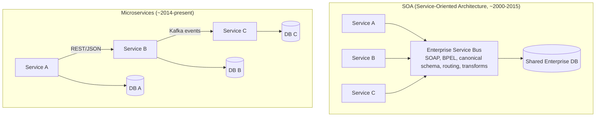

## WHY

Service-Oriented Architecture (SOA) was the enterprise architecture darling of the 2000s — IBM, Oracle, and SAP all promoted SOA as the way to build large enterprise systems. Banks, insurance companies, telcos, and governments invested billions building SOA platforms with WS-* SOAP stacks, BPEL orchestration engines, and Enterprise Service Buses (ESBs) like IBM WebSphere, Oracle Service Bus, and TIBCO. Yet by 2015, SOA had developed a toxic reputation: vendor lock-in, multi-million-dollar ESB licenses, year-long implementations that failed, and a runtime architecture so heavy that simple operations took hundreds of milliseconds through the ESB. When microservices emerged, many SOA veterans dismissed them as "SOA done right" or "SOA without the ESB" — and that framing is partially correct.

The specific pain that motivates understanding the distinction: companies still confuse the two and inherit SOA's failure modes when building microservices. A team starts a microservices project and immediately reaches for an ESB (Kafka used as an ESB), a central orchestration engine (Camunda used as a BPEL engine), and a canonical data model (a "shared schema" all services must use). Six months later, they have rebuilt the SOA monolith — one central piece of infrastructure that all services depend on, that one team owns, and that becomes the bottleneck for every change.

The production failure mode is **central-coordination tyranny**: when one platform team owns the message broker, the canonical schema, the orchestration engine, and the governance — every service change requires their approval. Velocity drops to SOA-era levels (quarterly releases, multi-team coordination meetings). The promise of microservices (independent teams, independent deployments) evaporates because the team-coordination cost was simply moved from "code coordination" to "platform coordination."

Senior engineers must understand: the historical context (SOA emerged from EAI in the 1990s, microservices emerged from Internet-scale companies in the 2010s), the specific philosophical differences (smart pipes vs dumb pipes; canonical data model vs schema-per-service; orchestration vs choreography), and how to spot when their "microservices" architecture has accidentally regressed into SOA.

## THEORY

### Architectural Comparison



### Key Philosophical Differences

| Dimension | SOA | Microservices |
|-----------|-----|---------------|
| Communication style | "Smart pipes, dumb endpoints" — ESB does routing, transformation, orchestration | "Dumb pipes, smart endpoints" — services own their logic, network is just transport |
| Data model | Canonical Enterprise Data Model — all services use shared schemas | Schema-per-service — each service owns its data model |
| Database | Often shared enterprise DB | Database-per-service (strict) |
| Protocol | SOAP/WSDL, WS-* standards (security, transactions, addressing) | REST/JSON, gRPC, async messaging (Kafka) |
| Orchestration | BPEL workflows in a central engine | Choreography via events; or saga pattern; or lightweight orchestrators |
| Service size | Large (often whole business capability — "Customer Service") | Small to medium (bounded context) |
| Reuse goal | Maximum reuse via shared services | Loose coupling; reuse is secondary |
| Team structure | Centralized platform team + business services teams | Decentralized; each team owns service end-to-end |
| Governance | Top-down via central architecture board | Bottom-up via contracts and decentralized standards |
| Deployment | Often coordinated, quarterly releases | Independent, hourly per service |
| Failure mode | ESB bottleneck and SPOF | Cascading failures across many services |
| Era | Enterprise on-premises (2000s) | Cloud-native (2010s+) |

### The ESB — The Defining Feature of SOA

```
"ESB" stands for Enterprise Service Bus. It's a central piece of infrastructure
that sits between services and provides:
  1. Routing — "route messages from A to B"
  2. Transformation — "convert XML format X to format Y"
  3. Orchestration — "when service A finishes, call B then C then D"
  4. Protocol bridging — "service A speaks SOAP, B speaks JMS — convert"
  5. Policy enforcement — "all messages must be signed, encrypted, logged"

The "smart pipes" philosophy: put intelligence into the messaging infrastructure
so services can stay simple.

Problem: the ESB becomes a monolith.
  - One team owns it (the "integration team")
  - Every new service requires updates to ESB routing/transforms
  - Every release requires the ESB team's review
  - The ESB is a single point of failure for the entire enterprise
```

### Microservices Inverted the Smart/Dumb Architecture

```
"Dumb pipes, smart endpoints":
  - The network just delivers bytes (Kafka, HTTP, gRPC)
  - The services contain all the business logic, validation, routing
  - No central transformation engine — services agree on contracts
  - Failure is isolated — a service failure doesn't take out shared infrastructure

This works only when:
  - Teams own their services end-to-end (Conway's Law)
  - Contracts are versioned and stable
  - Observability is good enough to debug distributed traces
  - Domain-driven design has identified the right bounded contexts
```

### Common Misconception

> "Microservices are just modern SOA with better tooling."

**Reality:** While there's lineage (both decompose monoliths into services), the *philosophy* is opposite. SOA pushed intelligence into the messaging layer (ESB) and aimed for maximum reuse via canonical models. Microservices push intelligence into the services and aim for loose coupling via independent schemas. SOA was an **integration-oriented** architecture; microservices is a **product-team-oriented** architecture. A microservices system with an ESB-like central broker is *not* a microservices system — it's SOA with a different name. The defining test: can two teams deploy their services independently without coordinating with a central platform team? If no, it's SOA.

## VISUALIZATION_CONFIG
```json
{
  "language": "java",
  "fileName": "SoaVsMs.java",
  "steps": [
    {
      "title": "SOA — Service-Oriented Architecture",
      "description": "SOA (mid-2000s): large services share an Enterprise Service Bus (ESB). Services communicate via standardized SOAP/XML protocols. Heavy governance.",
      "code": "// SOA characteristics:\n// - Enterprise Service Bus (ESB) in the middle\n// - SOAP/WSDL protocols\n// - Services can be large (still monolithic-ish)\n// - Centralized governance and registry",
      "diagram": {
        "kind": "boxes",
        "title": "SOA structure",
        "items": [
          {
            "label": "ESB: central integration bus",
            "color": "#f59e0b"
          },
          {
            "label": "SOAP/WSDL: heavy protocols",
            "color": "#818cf8"
          },
          {
            "label": "large coarse-grained services",
            "color": "#818cf8",
            "highlight": true
          }
        ]
      }
    },
    {
      "title": "Microservices — evolution of SOA",
      "description": "Microservices (2010s): fine-grained, independently deployable services. REST/events replace ESB. Decentralized governance.",
      "code": "// Microservices vs SOA:\n// - No ESB: services talk directly (REST/Kafka)\n// - REST/gRPC/events: lightweight protocols\n// - Fine-grained: small, focused services\n// - Decentralized: each team owns their service",
      "diagram": {
        "kind": "boxes",
        "title": "Key differences",
        "items": [
          {
            "label": "SOA: ESB → MS: direct communication",
            "color": "#818cf8"
          },
          {
            "label": "SOA: SOAP → MS: REST/gRPC",
            "color": "#818cf8"
          },
          {
            "label": "SOA: coarse → MS: fine-grained",
            "color": "#10b981",
            "highlight": true
          },
          {
            "label": "SOA: centralized → MS: decentralized",
            "color": "#10b981"
          }
        ]
      }
    },
    {
      "title": "Smart endpoints, dumb pipes",
      "description": "SOA put intelligence in the ESB (routing, transformation, orchestration). Microservices put intelligence in the endpoints; keep the message bus simple.",
      "code": "// SOA: smart ESB does routing, transformation\nESB.route(message).transform().deliver();\n// Microservices: smart services, dumb Kafka\nkafkaTemplate.send(\"order-events\", event);  // just publish\nOrderConsumer.onMessage(event);             // consumer handles logic",
      "diagram": {
        "kind": "boxes",
        "title": "Smart endpoints, dumb pipes",
        "items": [
          {
            "label": "SOA: ESB handles logic (fragile)",
            "color": "#f59e0b"
          },
          {
            "label": "MS: services handle logic",
            "color": "#10b981",
            "highlight": true
          },
          {
            "label": "Kafka: just a dumb pipe",
            "color": "#10b981"
          }
        ]
      }
    },
    {
      "title": "SOA still relevant",
      "description": "SOA patterns apply at larger organizational levels (enterprise integration). EDA (Event-Driven Architecture) merges SOA and microservices ideas.",
      "code": "// SOA concepts still used today:\n// - Service contracts (OpenAPI = modern WSDL)\n// - Service registry (Eureka, Consul = modern UDDI)\n// - Message transformation (MapStruct = modern XSLT)",
      "diagram": {
        "kind": "boxes",
        "title": "SOA patterns in MS",
        "items": [
          {
            "label": "service registry: Eureka (SOA: UDDI)",
            "color": "#818cf8"
          },
          {
            "label": "service contract: OpenAPI (SOA: WSDL)",
            "color": "#818cf8",
            "highlight": true
          },
          {
            "label": "message bus: Kafka (SOA: ESB, simpler)",
            "color": "#10b981"
          }
        ]
      }
    },
    {
      "title": "Choose based on context",
      "description": "Microservices for independent teams and deployments. SOA for enterprise integration across organizational boundaries.",
      "code": "// Use microservices when:\n// - One company, multiple teams, one product\n// Use ESB/SOA when:\n// - Multiple organizations integrating their systems\n// - Legacy system integration required",
      "diagram": {
        "kind": "boxes",
        "title": "When to use each",
        "items": [
          {
            "label": "microservices: within one org/product",
            "color": "#10b981",
            "highlight": true
          },
          {
            "label": "SOA/EAI: cross-org integration",
            "color": "#818cf8"
          },
          {
            "label": "both: clear service contracts essential",
            "color": "#818cf8"
          }
        ]
      }
    }
  ]
}
```

## CODE

### Level 1 — Beginner: SOA-Style Communication (SOAP)

```java
// SOA service interface — defined via WSDL, communicated via SOAP/XML
// This is what enterprise Java looked like in 2005-2010

import jakarta.jws.*;
import jakarta.xml.ws.*;

@WebService(targetNamespace = "http://shop.com/customer")
public interface CustomerService {
    @WebMethod
    Customer getCustomer(@WebParam(name = "id") long id);

    @WebMethod
    void updateCustomer(@WebParam(name = "customer") Customer customer);
}

@WebService(endpointInterface = "com.shop.soa.CustomerService")
public class CustomerServiceImpl implements CustomerService {
    public Customer getCustomer(long id) {
        // Looks up from CENTRAL enterprise database
        // Uses canonical data model — same Customer schema as every other service
        return /* JDBC call */ new Customer(id, "alice@example.com", "Alice");
    }

    public void updateCustomer(Customer customer) {
        // Writes back through ESB so other services are notified via canonical events
        // ...
    }
}

// Canonical data model — shared across ALL services in the enterprise
// Defined in a central XSD schema, every service imports the same Customer.java
public class Customer {
    private long id;
    private String email;
    private String name;
    private String legalEntityId;          // ⚠️ required by Compliance service
    private String preferredLanguage;      // ⚠️ required by Notification service
    private String accountingCustomerCode; // ⚠️ required by Finance service
    private LocalDateTime createdAt;
    private LocalDateTime updatedAt;
    private boolean gdprConsent;
    private String customerSegment;
    // ... 50+ fields because EVERY service's needs are in the canonical schema
    // Any field change requires consensus across all consumer teams.
}
```

### Level 2 — Intermediate: Microservice Equivalent (REST/JSON)

```java
// Same business capability, microservices style: REST + service-specific schema
// Compare to the SOA version — radically different philosophy

import org.springframework.boot.SpringApplication;
import org.springframework.boot.autoconfigure.SpringBootApplication;
import org.springframework.web.bind.annotation.*;

@SpringBootApplication
public class CustomerServiceApp {
    public static void main(String[] args) {
        SpringApplication.run(CustomerServiceApp.class, args);
    }
}

@RestController
@RequestMapping("/customers")
class CustomerController {

    private final CustomerRepository repo;
    CustomerController(CustomerRepository repo) { this.repo = repo; }

    // SERVICE-SPECIFIC schema — only the fields THIS service needs
    // Compliance service has its own ComplianceCustomerDto with different fields
    // Notification service has its own NotificationCustomerDto, etc.
    @GetMapping("/{id}")
    public CustomerDto get(@PathVariable long id) {
        Customer c = repo.findById(id)
            .orElseThrow(() -> new RuntimeException("Not found"));
        return new CustomerDto(c.id(), c.email(), c.name());
    }

    @PostMapping
    public CustomerDto create(@RequestBody CreateCustomerRequest req) {
        Customer c = repo.save(new Customer(0, req.email(), req.name()));
        return new CustomerDto(c.id(), c.email(), c.name());
    }
}

// Schema owned by THIS service only — small, focused, evolvable
// Other services get their own representation via their own boundaries
record CustomerDto(long id, String email, String name) {}
record CreateCustomerRequest(String email, String name) {}
record Customer(long id, String email, String name) {}

interface CustomerRepository {
    java.util.Optional<Customer> findById(long id);
    Customer save(Customer c);
}
```

### Level 3 — Advanced: The "Accidental SOA" Anti-Pattern in a Microservices Project

```java
// ❌ ANTI-PATTERN — microservices project that has accidentally re-implemented SOA
// All the signs of SOA hidden behind "microservices" branding

// 1. CENTRAL CANONICAL EVENT SCHEMA — every team must use this Customer class
//    Owned by a central "platform team" — every change requires their approval
package com.shop.canonical;
public class CanonicalCustomerEvent {
    private long id;
    private String email;
    private String name;
    private String legalEntityId;       // required by Compliance team
    private String preferredLanguage;   // required by Notification team
    private String segment;             // required by Marketing team
    private String accountingCode;      // required by Finance team
    // 60+ fields. Adding a field requires sign-off from 8 teams.
    // Sound familiar? It's the canonical model from SOA, rebadged.
}

// 2. KAFKA-AS-ESB — a single "events" topic owned by the platform team
//    All services publish/subscribe via this central topic with central routing rules
@Component
class CentralEventRouter {
    @KafkaListener(topics = "events.canonical.all")
    public void route(CanonicalCustomerEvent event, ConsumerRecord<?, ?> record) {
        // Central routing logic — "if customerSegment == VIP, route to vip-handler"
        // This is the ESB routing pattern. Every routing rule change goes through platform team.
        if ("VIP".equals(event.getSegment())) {
            kafkaTemplate.send("events.vip.customer", event);
        }
        // ... 100 more routing rules
    }
}

// 3. CENTRAL ORCHESTRATION ENGINE — a workflow service that calls each service in turn
//    The workflow XML/BPEL is owned by the platform team
@Service
class CustomerOnboardingOrchestrator {
    // This is BPEL, written in Java. Same patterns: synchronous orchestration,
    // central control, single team owns the workflow.
    public void onboardCustomer(long customerId) {
        customerService.activate(customerId);    // Step 1
        complianceService.verify(customerId);    // Step 2
        notificationService.welcome(customerId); // Step 3
        marketingService.enroll(customerId);     // Step 4
        // If any step fails, this orchestrator handles rollback.
        // This is the SOA orchestration model — central engine, smart pipes.
    }
}

// ✅ TRUE MICROSERVICES — no central canonical schema, no central router, choreography
// 1. Each service publishes its OWN event schema, versioned, on its own topic
package com.shop.customer;
public record CustomerCreated(
    long customerId, String email, String name, Instant occurredAt, int schemaVersion
) {}
// Only the fields the Customer SERVICE cares about. Other services subscribe and
// transform into THEIR own internal representation.

// 2. NO central router — each service subscribes to events it cares about
@Component
class NotificationServiceEventHandler {
    @KafkaListener(topics = "customer.created")
    public void onCustomerCreated(CustomerCreated event) {
        // Notification service's OWN view: it cares about email, name
        // It doesn't care about legalEntityId, accountingCode — those are someone else's problem
        emailService.sendWelcome(event.email(), event.name());
    }
}

// 3. NO central orchestrator — choreography via events
@Component
class CustomerSaga {
    @KafkaListener(topics = "customer.created")
    public void onCustomerCreated(CustomerCreated event) {
        // Compliance service decides for itself what to do; doesn't need orchestrator
        complianceService.startVerification(event.customerId());
    }
    // Each service decides its own reactions. No central workflow.
}
```

### Level 4 — Expert / Production: Migration Pattern — SOA Monolith to Microservices

```java
package com.migration;

import java.util.*;
import java.util.concurrent.*;
import java.time.*;

/**
 * Strangler Fig migration: peel a capability off the SOA ESB into a microservice
 * without breaking existing consumers. Production pattern used in large bank/insurance migrations.
 */

// === The ANTI-CORRUPTION LAYER ===
// Translates between the legacy SOA canonical model and the new microservice's clean model.
// Both can evolve independently — no big-bang migration.

public class CustomerAntiCorruptionLayer {

    // Legacy SOA canonical model (60+ fields, defined elsewhere)
    public record LegacySoapCustomer(
        long id, String emailAddress, String fullName, String legalEntityId,
        String preferredLanguage, String customerSegment, String accountingCode,
        String complianceStatus, Map<String, String> additionalAttributes
    ) {}

    // New microservice's clean model (focused, only what THIS service needs)
    public record ModernCustomer(
        long id, String email, String name, Instant createdAt
    ) {}

    public static ModernCustomer fromLegacy(LegacySoapCustomer legacy) {
        return new ModernCustomer(
            legacy.id(),
            legacy.emailAddress(),       // legacy field name → modern field name
            legacy.fullName(),
            Instant.now()                // synthesize if legacy doesn't carry timestamp
        );
    }

    public static LegacySoapCustomer toLegacy(ModernCustomer modern,
                                              String legalEntityId,
                                              String complianceStatus) {
        // When the modern service writes back, ACL fills in the legacy-required fields
        // with sensible defaults or values fetched from a legacy service
        return new LegacySoapCustomer(
            modern.id(),
            modern.email(),
            modern.name(),
            legalEntityId,               // fetched from legacy entity service
            "en-US",                     // sensible default
            "STANDARD",
            "ACCT-" + modern.id(),
            complianceStatus,
            new HashMap<>()
        );
    }
}

// === The STRANGLER ROUTER ===
// Sits in front of both legacy SOA and new microservice. Routes traffic gradually.
@org.springframework.stereotype.Component
public class CustomerRouter {

    private final LegacySoapCustomerService legacy;
    private final ModernCustomerService modern;
    private final java.util.concurrent.atomic.AtomicInteger pctToModern =
        new java.util.concurrent.atomic.AtomicInteger(0);

    public CustomerRouter(LegacySoapCustomerService legacy, ModernCustomerService modern) {
        this.legacy = legacy;
        this.modern = modern;
    }

    public CustomerAntiCorruptionLayer.ModernCustomer getCustomer(long id) {
        // Gradually shift traffic: pctToModern starts at 0, increases over weeks
        int pct = pctToModern.get();
        if (ThreadLocalRandom.current().nextInt(100) < pct) {
            // Route to new microservice
            try {
                return modern.getCustomer(id);
            } catch (Exception e) {
                // Fall back to legacy on any error — safety net during migration
                return CustomerAntiCorruptionLayer.fromLegacy(legacy.getCustomer(id));
            }
        } else {
            // Route to legacy SOA service via ESB
            return CustomerAntiCorruptionLayer.fromLegacy(legacy.getCustomer(id));
        }
    }

    public void setPercentToModern(int percent) {
        if (percent < 0 || percent > 100) throw new IllegalArgumentException();
        pctToModern.set(percent);
    }
}

// === Dual-write during migration ===
// Writes go to BOTH systems to keep them in sync, then we switch reads, then stop writing legacy
@org.springframework.stereotype.Component
class CustomerDualWriter {
    private final LegacySoapCustomerService legacy;
    private final ModernCustomerService modern;

    CustomerDualWriter(LegacySoapCustomerService legacy, ModernCustomerService modern) {
        this.legacy = legacy;
        this.modern = modern;
    }

    public void updateCustomer(CustomerAntiCorruptionLayer.ModernCustomer modernCustomer) {
        // Always write to modern (it's our source of truth going forward)
        modern.update(modernCustomer);

        // ALSO write to legacy so SOA consumers still see consistent data
        // Until all consumers migrate, both must stay in sync.
        var legacyForm = CustomerAntiCorruptionLayer.toLegacy(modernCustomer, "DEFAULT-ENT", "OK");
        try {
            legacy.update(legacyForm);
        } catch (Exception e) {
            // Log but don't fail — the modern write is the canonical one
            System.err.println("Legacy write failed (will be reconciled): " + e.getMessage());
        }
    }
}

// Stubs for compilation
interface LegacySoapCustomerService {
    CustomerAntiCorruptionLayer.LegacySoapCustomer getCustomer(long id);
    void update(CustomerAntiCorruptionLayer.LegacySoapCustomer customer);
}
interface ModernCustomerService {
    CustomerAntiCorruptionLayer.ModernCustomer getCustomer(long id);
    void update(CustomerAntiCorruptionLayer.ModernCustomer customer);
}
```

## REAL_WORLD

### How ING Bank Migrated From SOA to Microservices

ING Bank, one of Europe's largest banks, ran a classic SOA architecture from 2005-2015: hundreds of SOAP services connected by an Oracle Service Bus, with a canonical Customer model and centralized BPEL workflows for processes like loan approval and account opening. Every change required navigating 8+ teams, ESB releases happened twice a year, and adding a new field to the Customer schema took 6-9 months of cross-team coordination. They publicly documented their migration to microservices (2015-2020) in talks at QCon and Spring One — a multi-year effort that consolidated the central ESB into per-team Kafka topics, replaced the canonical schema with service-owned schemas, and dissolved BPEL workflows into Kafka-based choreography.

The migration patterns: (1) **Strangler fig** — each capability was peeled off the ESB into a new microservice, with an anti-corruption layer between; (2) **Outbox + Kafka** — replaced ESB pub/sub with Kafka events emitted via outbox tables in service databases; (3) **API Gateway** (Spring Cloud Gateway) — replaced the ESB's routing role with a simpler gateway that does no transformation; (4) **Independent CI/CD** — each service got its own pipeline, deploying 10-50× per day vs the old quarterly ESB releases. By 2020, the central ESB was decommissioned, deploy frequency was 100× higher, and new features that took 6 months were shipping in 2 weeks.

```java
// ING-style anti-corruption layer between legacy SOA and new microservice
@Component
public class AccountAcl {
    private final LegacyAccountSoapClient legacyClient;  // SOAP/WSDL client to old ESB

    public AccountAcl(LegacyAccountSoapClient legacyClient) {
        this.legacyClient = legacyClient;
    }

    /**
     * Modern services call this method; it hides the SOAP/canonical mess underneath.
     * When legacy is decommissioned, only this class needs to change.
     */
    public Optional<Account> findById(String accountId) {
        try {
            var legacy = legacyClient.getAccountByCanonicalId(accountId);
            if (legacy == null) return Optional.empty();
            return Optional.of(new Account(
                legacy.getAccountIdentifier(),
                legacy.getAccountHolderName(),
                BigDecimal.valueOf(legacy.getBalanceAmount()).movePointLeft(2),
                legacy.getCurrencyIsoCode(),
                legacy.getStatusCode().equals("ACT")
            ));
        } catch (LegacySoapException e) {
            // Legacy down → graceful degradation, not a cascade
            return Optional.empty();
        }
    }
}

record Account(String id, String holderName, BigDecimal balance, String currency, boolean active) {}
class LegacySoapException extends RuntimeException {}
interface LegacyAccountSoapClient {
    LegacyAccount getAccountByCanonicalId(String id);
}
class LegacyAccount {
    public String getAccountIdentifier() { return ""; }
    public String getAccountHolderName() { return ""; }
    public long getBalanceAmount() { return 0; }
    public String getCurrencyIsoCode() { return ""; }
    public String getStatusCode() { return ""; }
}
```

### Production Gotcha: Kafka Used as an ESB

```
❌ DANGEROUS — Kafka has all the same "central pipeline" failure modes as an ESB when used wrong:
  - Single "all-events" topic that every service must subscribe to
  - Central "canonical-events" schema all services share
  - Central transformation/enrichment job that all events flow through
  - Central platform team that owns and gates all topic/schema changes
  - Every new service requires updates to the central topic config

Symptom: a "microservices" team has 30 services, all reading from one topic owned
        by the platform team. Adding a field requires platform-team approval.
        It's an ESB. The bytes are different, the failure mode is identical.

✅ FIX — Kafka used properly:
  - Each service owns its own topics (publishes to "orders.events", "users.events")
  - Each service publishes its own schema; consumers translate to their own format
  - No central "all events" topic — point-to-point or fan-out per business domain
  - No platform team gating topic creation; teams create topics as needed within their namespace
  - Schema registry is permissive — services can add fields without coordination (forward-compatible evolution)
```

**Why it happens:** Kafka is so flexible that teams accidentally rebuild SOA. The tooling doesn't prevent it. The discipline must come from architectural principles: services own their data + schemas + topics; the platform team provides infrastructure (Kafka cluster, observability, security) but does not own the application-level coordination. The test: can two teams add a new event type without filing a ticket? If no, you have an ESB.

### Performance Characteristics

| Operation | SOA (with ESB) | Microservices |
|-----------|----------------|---------------|
| Service-to-service call | 50-200ms (through ESB, SOAP, XSLT) | 1-20ms (direct REST) |
| Add new field to data model | 3-9 months (canonical schema change) | minutes (service-owned schema) |
| Deploy a service | quarterly (coordinated with ESB) | hourly (independent) |
| Number of teams to coordinate per change | 5-15 | 0-2 |
| Mean time to onboard new service | months (ESB integration, governance) | days (Kafka topics, API gateway) |
| Mean time to debug cross-service issue | hours (correlate logs across ESB) | hours (correlate via distributed tracing) |

## INTERVIEW

**Q1 (Junior): What is SOA and how does it differ from microservices?**
A: SOA (Service-Oriented Architecture) is an architectural style from the 2000s where applications are decomposed into reusable services connected by an Enterprise Service Bus (ESB) — a central piece of infrastructure that handles routing, transformation, and orchestration of inter-service communication. Microservices is a related but distinct style from the 2010s where services communicate directly via lightweight protocols (REST/JSON or Kafka events), without a central transformation/orchestration layer. The defining motto difference: SOA uses "smart pipes, dumb endpoints" (intelligence in the ESB), microservices use "dumb pipes, smart endpoints" (intelligence in the services). SOA emphasizes maximum reuse and canonical data models; microservices emphasize loose coupling and schema-per-service.

**Q2 (Junior): Why did SOA get a bad reputation in the industry?**
A: SOA developed a toxic reputation for three reasons: (1) **ESB became a monolith** — the Enterprise Service Bus, supposed to be infrastructure, became a place where business logic accumulated (routing rules, transformations, orchestrations), owned by a central team that became the bottleneck for every change; (2) **canonical data models created coordination tax** — every team needed to agree on the shared Customer/Order/Account schema before changes could ship, leading to 6-9 month feature cycles; (3) **vendor lock-in and complexity** — WS-* SOAP stacks, BPEL workflow engines, and proprietary ESBs from IBM/Oracle/TIBCO required specialized skills and multi-million-dollar licenses. Many SOA programs were declared failures after 2-3 years of investment without delivering value. Microservices intentionally avoided these patterns: no ESB, schema-per-service, open-source protocols.

**Q3 (Mid): What is the "smart endpoints, dumb pipes" philosophy and why is it considered superior?**
A: It's the core architectural principle of microservices, coined by Martin Fowler and James Lewis in their seminal 2014 article. Rationale: putting business logic in the network layer (ESB transformations, BPEL orchestrations) couples that logic to a piece of shared infrastructure owned by one team — every change requires their coordination, making the architecture brittle and slow to evolve. Putting business logic in the services (and using the network only as a transport for byte messages) means each service is autonomous: a team can change their service's behavior, schema, even technology stack without coordinating with the platform team. The cost: services must contain more logic (validation, routing, retries) rather than delegating to infrastructure. The benefit: independent evolution, which is the whole point of microservices.

**Q4 (Mid): How can a microservices project accidentally regress into SOA? Give concrete signs.**
A: Six classic signs your "microservices" are actually SOA: (1) **a canonical event schema** that every service must use — owned by a platform team that gates all changes; (2) **a single "all-events" Kafka topic** that every service publishes to or consumes from; (3) **a central orchestration service** (workflow engine) that calls each service in turn — services don't react to events autonomously; (4) **a central data store** all services query directly; (5) **the platform team gates all topic/schema/contract changes** with formal approval processes; (6) **deploys are coordinated** because schema changes ripple through many services. If you have three or more of these, your team is suffering the same coordination tax SOA created, just with Kafka instead of WebSphere. The fix: services own their topics, schemas, and react via choreography; the platform team owns only the substrate (Kafka cluster, observability, security policies).

**Q5 (Senior): When migrating from SOA to microservices, what's the role of an anti-corruption layer?**
A: An anti-corruption layer (ACL) is a translation boundary between the legacy SOA world and the new microservices world. The ACL exposes a clean, microservice-friendly API to the new services and internally translates calls to/from the legacy SOA protocols (SOAP, canonical schemas). Without an ACL, the legacy mess leaks into your new code: microservices end up using the old canonical Customer schema, the old WSDL types, the old field naming conventions — defeating the migration's purpose. With an ACL, the legacy mess is quarantined in one component; the new services evolve their own clean models. When legacy is finally decommissioned, only the ACL needs to be updated/removed. The pattern comes from Eric Evans's Domain-Driven Design book (2003) and is the canonical migration technique for any old → new system transition, not just SOA → microservices.

**Q6 (Senior): What is the strangler fig pattern and why is it preferred over big-bang rewrites?**
A: The strangler fig pattern (named after the strangler fig vine that grows around a host tree until the host dies) is the canonical strategy for replacing a legacy system with a new one *incrementally* while the legacy keeps running. Steps: (1) Put a router/gateway in front of the legacy; (2) Implement one capability in the new system; (3) Route that capability's traffic to the new system, everything else still goes to legacy; (4) Repeat for each capability; (5) When legacy has zero traffic, decommission it. The new system "strangles" the legacy over months/years. It's preferred over big-bang rewrites because: (a) at every step the system is fully working — no flag day, no risk of "the rewrite never ships" (Martin Fowler estimates 70%+ of big-bang rewrites fail); (b) you can validate the new design against real production traffic before committing; (c) you can roll back any capability instantly if it misbehaves. Big-bang rewrites fail because they require predicting the future correctly — strangler fig lets you learn as you migrate.

**Q7 (Senior+): What enterprise architecture trends followed from microservices that explicitly reject SOA's centralization?**
A: Three major trends: (1) **Service mesh** (Istio, Linkerd, Consul Connect) — moves cross-cutting concerns (auth, observability, traffic management) out of services AND out of any central broker, into sidecar proxies running alongside each service. Each service still owns its logic; the mesh provides uniform infrastructure capabilities without being a centralized chokepoint. (2) **Decentralized data ownership** (data mesh, by Zhamak Dehghani, 2019) — rejects the centralized data warehouse in favor of "data as a product" owned by each domain team. Inverse of SOA's "central canonical data model." (3) **GitOps and team-owned platforms** (Backstage, Argo CD, Crossplane) — instead of a central platform team gating infrastructure, teams use self-service platforms with policies-as-code. The platform team builds tools; the product teams use them autonomously. Common theme: **autonomy with constraints** rather than **centralization with approval gates**. SOA's failure mode is the cautionary tale these patterns are designed to avoid.

## FEYNMAN CHECK

### Explain SOA vs Microservices Like I'm 10 Years Old

> Imagine a school where there are 5 classrooms (services) that need to send messages to each other. **SOA way**: there's one teacher (the ESB) who collects every message from every classroom, translates them, decides who gets what, and delivers them. Sounds organized! But if the teacher is sick, no classroom can talk to any other. And if you want to send a new kind of message, you must ask the teacher first — and the teacher is so busy that you wait weeks. **Microservices way**: each classroom has its own walkie-talkie. They talk directly. No central teacher. If one classroom's walkie-talkie breaks, the others still work. But now each classroom needs to know how to handle messages itself. The trade-off: more work for each classroom, but they can talk much faster and don't all depend on one teacher being available.

---

### 5 Deep Conceptual Questions

**Q1: What problem did SOA fundamentally try to solve, and why did its solution backfire?**
> **A:** SOA tried to solve enterprise integration: large companies had 50-100 monolithic applications (mainframes, CRMs, ERPs, custom Java apps) that needed to talk to each other. SOA's solution was to put a central translation layer (ESB) between them, with a canonical data model so every system could understand every other system. The solution backfired because the ESB became a knowledge hotspot and bottleneck: one team owned the ESB; every change to any service required ESB changes; the canonical data model required cross-team consensus that took months. The architecture optimized for *integration* at the cost of *autonomy*. Microservices invert this: optimize for autonomy by eliminating the central layer, accepting that each service must handle its own integration concerns. SOA solved a real problem but produced a worse problem.

**Q2: What is the ONE mental model that makes SOA-vs-microservices click?**
> **A:** "Where does the business logic live — in the pipes, or at the endpoints?" SOA puts logic in pipes (ESB does routing, transformation, orchestration). Microservices put logic at endpoints (services own all their logic; the network is dumb transport). Once you internalise this, every design decision follows: SOA wants a canonical schema (so the pipe can do meaningful transformations); microservices want service-specific schemas (because services do their own translation). SOA wants central orchestration (the pipe coordinates the workflow); microservices want choreography (services react to events autonomously). The mental model is: smart pipes → centralization → slow evolution; dumb pipes → decentralization → fast evolution.

**Q3: What is the most dangerous SOA-microservices misconception? Show it with code/architecture.**
> **A:** "We have Kafka, so we have microservices." Kafka is a tool; using it doesn't make you microservices. You can use Kafka as an ESB.
> ```
> // ❌ SOA in microservices clothing — Kafka used as a central ESB
> Architecture:
>   - One Kafka topic: "events.canonical.all"
>   - One canonical event schema in a Git repo owned by "platform team"
>   - Every service subscribes to this topic
>   - Every event has 50+ fields because every consumer's needs are in the schema
>   - Schema changes require platform-team approval — 2-week review cycle
>   - Adding a new event type requires updating the canonical model — coordination across 8 teams
>
> Result: you have an ESB. The bytes are different (Avro vs SOAP), the coordination tax is identical.
>
> // ✅ Real microservices with Kafka — services own topics and schemas
> Architecture:
>   - Each service owns its own topics: "orders.created", "orders.shipped", "users.signed-up"
>   - Each service owns its own event schemas, evolved freely with forward-compatibility
>   - Consumers translate events into their own internal models (anti-corruption boundary)
>   - No central "events" topic, no central schema, no central team approval
>   - Adding a new event type: create a topic in your namespace, document the schema, ship
>
> Result: services evolve independently. Coordination tax stays low. Adding fields is minutes, not months.
> ```

**Q4: How does the SOA-vs-microservices choice interact with team structure (Conway's Law)?**
> **A:** Conway's Law states "organizations design systems that mirror their communication structure." SOA's centralized ESB and canonical model imply (and require) a centralized integration team that owns the cross-cutting concerns. The team structure mirrors the architecture: business teams build services, but anything cross-service goes through the integration team. This works when business teams are organized around technical layers (auth, billing, customer-data) but fails when business teams are organized around business capabilities (orders, payments, fulfilment) — the central integration team becomes a coordination bottleneck. Microservices assume team-aligned-with-business-capability: each team owns a service end-to-end, including its events and integrations. This requires *decentralized governance* — the team structure must already support autonomy. If you adopt microservices but keep a central architecture team that gates schema changes, you've inherited SOA's coordination tax with extra steps.

**Q5: One-sentence definition for a senior FAANG engineer.**
> **A:** "SOA and microservices are both architectural styles for decomposing monolithic systems into services, but differ fundamentally in their philosophy of integration: SOA puts business logic into a centralized Enterprise Service Bus that performs routing, protocol transformation, and orchestration ('smart pipes, dumb endpoints'), couples services via a canonical data model owned by a central team, and emphasizes maximum reuse — making it integration-oriented but coordination-bound, whereas microservices push business logic into autonomous service endpoints ('dumb pipes, smart endpoints'), enforce schema-per-service and database-per-service, and prefer choreographed event-driven communication over central orchestration — making them product-team-oriented and evolution-friendly at the cost of distributed-system complexity (eventual consistency, observability requirements, no shared ACID transactions)."

## BUILD

### 🏗️ Mini Project: Anti-Corruption Layer Between Legacy SOA and a Microservice

**What you will build:** A Spring Boot microservice that wraps a legacy SOAP CustomerService and exposes a clean REST API to modern consumers, with an anti-corruption layer translating between the canonical SOA schema and the modern service's clean model.
**Why this project:** Forces you to internalize how to migrate FROM SOA TO microservices safely — the strangler-fig anti-corruption pattern is the production-proven technique used by ING, Deutsche Bank, and dozens of large enterprises.
**Time estimate:** 35 minutes

---

#### Step 1 — Project Setup

```bash
mkdir customer-acl && cd customer-acl
mkdir -p src/main/java/com/customer
touch src/main/java/com/customer/{CustomerServiceApp,LegacyCustomer,ModernCustomer,CustomerAcl,CustomerController}.java
touch src/test/java/com/customer/CustomerAclTest.java
```

#### Step 2 — Core Implementation

```java
package com.customer;
import org.springframework.boot.SpringApplication;
import org.springframework.boot.autoconfigure.SpringBootApplication;
import org.springframework.stereotype.*;
import org.springframework.web.bind.annotation.*;
import java.util.*;
import java.util.concurrent.*;

@SpringBootApplication
public class CustomerServiceApp {
    public static void main(String[] args) { SpringApplication.run(CustomerServiceApp.class, args); }
}

// Simulates the legacy SOA service — bloated canonical schema
record LegacyCustomer(
    long customerId, String emailAddress, String fullName, String legalEntityId,
    String preferredLanguageCode, String customerSegmentCode, String accountingCode,
    String complianceStatusFlag, String createdTimestamp
) {}

// Modern, clean schema — only what the microservice actually needs
record ModernCustomer(long id, String email, String name) {}

// Simulates the legacy SOAP client (in real life this would be a SOAP/WSDL client)
@Component
class LegacySoapClient {
    private final Map<Long, LegacyCustomer> legacyStore = new ConcurrentHashMap<>();
    {
        legacyStore.put(1L, new LegacyCustomer(1, "alice@old.com", "Alice Anderson",
            "ENT-001", "en-US", "VIP", "ACCT-1", "ACT", "2010-01-01"));
        legacyStore.put(2L, new LegacyCustomer(2, "bob@old.com", "Bob Brown",
            "ENT-002", "en-GB", "STD", "ACCT-2", "ACT", "2012-06-15"));
    }
    public LegacyCustomer getById(long id) {
        LegacyCustomer c = legacyStore.get(id);
        if (c == null) throw new RuntimeException("Legacy: not found");
        return c;
    }
}

// THE ANTI-CORRUPTION LAYER — the heart of the migration pattern
@Component
class CustomerAcl {
    private final LegacySoapClient legacy;
    CustomerAcl(LegacySoapClient legacy) { this.legacy = legacy; }

    public ModernCustomer findById(long id) {
        LegacyCustomer l = legacy.getById(id);
        // Translate legacy field names to modern field names; drop fields the modern service doesn't need
        return new ModernCustomer(l.customerId(), l.emailAddress(), l.fullName());
    }
}

// Modern REST controller — completely unaware of SOA, canonical schemas, or legacy
@RestController
@RequestMapping("/customers")
class CustomerController {
    private final CustomerAcl acl;
    CustomerController(CustomerAcl acl) { this.acl = acl; }

    @GetMapping("/{id}")
    public ModernCustomer get(@PathVariable long id) {
        return acl.findById(id);
    }
}
```

#### Step 3 — Service Boundary Adapter

```java
package com.customer;
import org.springframework.stereotype.Component;

// Future: when legacy SOA is decommissioned, only this class changes.
// It pretends to be the source of truth — internally delegates to whichever backend is alive.
@Component
class CustomerSource {
    private final CustomerAcl legacyAcl;
    // private final ModernRepository modernRepo;  // future: direct DB access after migration

    CustomerSource(CustomerAcl legacyAcl) { this.legacyAcl = legacyAcl; }

    public ModernCustomer findById(long id) {
        // During migration: read from legacy via ACL
        return legacyAcl.findById(id);
        // After migration: return modernRepo.findById(id);
        // The ACL contains all the legacy complexity — quarantined here, not leaking out.
    }
}
```

#### Step 4 — Error Handling

```java
package com.customer;
import org.springframework.http.*;
import org.springframework.web.bind.annotation.*;
import java.util.Map;

@ControllerAdvice
class ErrorHandler {
    @ExceptionHandler(RuntimeException.class)
    public ResponseEntity<Map<String, String>> handleRuntime(RuntimeException e) {
        if (e.getMessage() != null && e.getMessage().contains("not found")) {
            return ResponseEntity.status(HttpStatus.NOT_FOUND)
                .body(Map.of("error", "Customer not found"));
        }
        if (e.getMessage() != null && e.getMessage().toLowerCase().contains("legacy")) {
            return ResponseEntity.status(HttpStatus.SERVICE_UNAVAILABLE)
                .body(Map.of("error", "Legacy system unavailable — try again later"));
        }
        return ResponseEntity.status(HttpStatus.INTERNAL_SERVER_ERROR)
            .body(Map.of("error", e.getMessage() == null ? "unknown" : e.getMessage()));
    }
}
```

#### Step 5 — Tests

```java
import org.junit.jupiter.api.*;
import com.customer.*;
import static org.junit.jupiter.api.Assertions.*;

class CustomerAclTest {
    private CustomerAcl acl;
    private LegacySoapClient legacy;

    @BeforeEach
    void setup() {
        legacy = new LegacySoapClient();
        acl = new CustomerAcl(legacy);
    }

    @Test
    void translatesLegacyFieldsToModern() {
        ModernCustomer modern = acl.findById(1);
        assertEquals(1, modern.id());
        assertEquals("alice@old.com", modern.email());
        assertEquals("Alice Anderson", modern.name());
        // ⚠️ Confirm modern record does NOT have legalEntityId, accountingCode, etc.
        // The ACL strips canonical schema bloat.
    }

    @Test
    void hidesLegacyExceptionsBehindCleanInterface() {
        // Modern code should NOT need to know about LegacySoapException
        // The ACL converts legacy errors into something the modern service understands
        assertThrows(RuntimeException.class, () -> acl.findById(999));
    }

    @Test
    void doesNotLeakLegacyFieldNamesToCallers() {
        ModernCustomer modern = acl.findById(2);
        // Modern record should use "email" not "emailAddress", "name" not "fullName"
        // The canonical schema's verbose naming is quarantined inside the ACL
        assertEquals("bob@old.com", modern.email());
        assertEquals("Bob Brown", modern.name());
    }
}
```

**Expected Output:**
```
$ ./gradlew bootRun
$ curl http://localhost:8080/customers/1
{"id":1,"email":"alice@old.com","name":"Alice Anderson"}
# Notice: no legalEntityId, accountingCode, or other legacy bloat
# The ACL has cleanly translated SOA canonical → modern microservice schema

$ curl http://localhost:8080/customers/999
# 404 Not Found
{"error":"Customer not found"}
```

**Stretch Challenges:**
- [ ] Add a feature toggle that gradually migrates traffic from legacy to a new modern source (strangler fig)
- [ ] Implement dual-write to legacy + modern during the migration window
- [ ] Add an outbox event so consumers can react to the modern view without coupling to legacy

## SPACED REVIEW

> **How to use:** Answer each question from memory before reading ahead.

---

### Day 1 — Recall

**Q1:** What does ESB stand for? What role did it play in SOA?

**Q2:** State the "smart pipes, dumb endpoints" vs "dumb pipes, smart endpoints" distinction in one sentence each.

**Q3:** Name 3 of the 6 signs that your microservices architecture has accidentally regressed into SOA.

---

### Day 3 — Comprehension

**Q4:** Compare SOA's canonical data model with microservices' schema-per-service. Why does each choice make sense in its context?

**Q5:** Describe how Kafka can be used as either a "true microservices" pipe or an "SOA-style ESB." Give a concrete configuration for each.

**Q6:** Refactor this SOA-style architecture into a true microservices architecture:
```
Central Kafka topic "events.canonical.all" — all services subscribe
Central canonical schema "GlobalEvent" with 80 fields, owned by platform team
Central transformer service that enriches events with extra data
All services use the same Customer.java class
```

---

### Day 7 — Application

**Q7:** Design an anti-corruption layer for migrating a legacy SOAP-based BookingService to a new REST microservice. Show the legacy schema, the modern schema, and the ACL translation methods.

**Q8:** You are leading a migration from a 10-year-old SOA platform (Oracle Service Bus, BPEL workflows, canonical XSDs) to microservices. Write a 6-step migration plan using the strangler-fig pattern.

**Q9:** What is the relationship between Conway's Law and SOA-vs-microservices? Explain why team topology must match before architecture decomposition can succeed.

---

### Day 14 — Synthesis & Interview Prep

**Q10:** ★ Classic interview: *"Are microservices just SOA done right?"*

**Q11:** Draw a timeline showing the evolution of enterprise architecture from monoliths (1990s) → SOA (2000s) → microservices (2010s) → service mesh + data mesh (2020s). Mark the key shifts (where intelligence moves: services → ESB → back to services → sidecars).

**Q12:** ★ System design: *"You're the chief architect of a 25-year-old bank with 200+ SOAP services on an Oracle Service Bus. The CTO wants to 'go microservices' in 18 months. Design a migration strategy that doesn't bankrupt the company or take down banking operations."*

