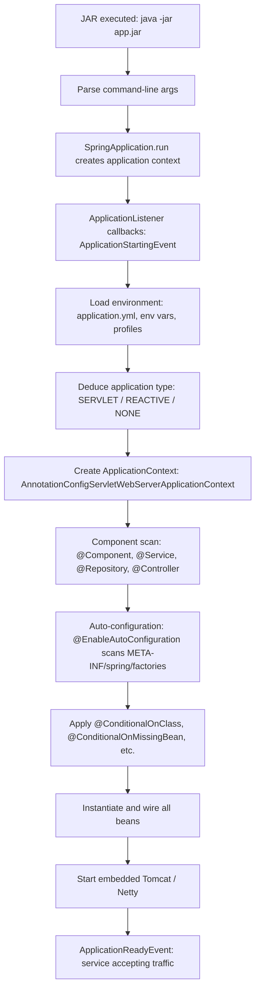

## WHY

Spring Boot became the dominant Java microservices framework because it solved the most painful problem of pre-2014 Spring development: configuration hell. Building a Spring-based REST service in 2010 required 200+ lines of XML configuration, separate web.xml, application context XML, manually assembled beans, and a heavyweight application server (Tomcat, JBoss, WebLogic). Bringing up a new service took days of configuration archaeology. Spring Boot's "auto-configuration" and "opinionated defaults" flipped the model: Spring Boot infers the correct configuration from classpath presence, providing sensible defaults that can be overridden but don't need to be specified when they're correct. A fully functional REST microservice requires fewer than 10 lines of Java and runs as a standalone JAR.

The specific pain Spring Boot solves in the microservices context: **service bootstrapping speed**. In a microservices architecture, you may spin up 5-20 new services per year. With traditional Spring, each new service requires 3-5 days of configuration setup. With Spring Boot, a new service is running in 30 minutes: `spring init` generates a project, one `@SpringBootApplication` annotation, one `@RestController`, and `./gradlew bootRun`. Spring Boot also solves: embedded servers (no external Tomcat needed — fat JAR is the deployable), production readiness (Actuator provides health checks, metrics, and environment exposure out of the box), and external configuration (application.yml + environment variables + Spring Cloud Config Server integration).

The production failure mode from not understanding Spring Boot's auto-configuration model is **conflicting dependencies silently disabling features**. A team adds a library that provides a custom `DataSource` bean — Spring Boot's auto-configured DataSource silently backs off. The database connection pool that was tuning itself is gone, replaced by an untuned custom one. No error. No warning. Different behavior in production. Understanding Spring Boot's conditional auto-configuration lets teams debug these "why is our config not applying?" issues without spending days in the debugger.

Senior engineers must understand: the full Spring Boot startup lifecycle, `@Conditional*` annotations and how auto-configuration works, Actuator endpoints and their production use, configuration hierarchy (application.yml vs profiles vs environment variables vs Spring Cloud Config), and Spring Boot's integration with the broader Spring Cloud microservices ecosystem.

## THEORY

### Spring Boot Application Startup Lifecycle



### Auto-Configuration — How @ConditionalOnClass Works

```
Spring Boot scans META-INF/spring/org.springframework.boot.autoconfigure.AutoConfiguration.imports
→ Loads all auto-configuration classes (e.g., DataSourceAutoConfiguration)

DataSourceAutoConfiguration has:
  @ConditionalOnClass(DataSource.class, EmbeddedDatabaseType.class)
  → Only activates if DataSource class is on the classpath (spring-jdbc dependency present)

  @ConditionalOnMissingBean(DataSource.class)
  → Backs off if you've already defined your own DataSource bean

  @ConditionalOnProperty(prefix="spring.datasource", name="url", matchIfMissing=false)
  → Backs off if no datasource URL is configured

If all conditions pass: auto-configures HikariCP connection pool with your spring.datasource.* properties
If you define your own DataSource @Bean: auto-config backs off silently
```

### Spring Boot Microservice Anatomy

```
Typical Spring Boot microservice structure:
src/main/java/com/shop/orders/
  OrderServiceApplication.java         @SpringBootApplication
  api/
    OrderController.java               @RestController
    dto/
      PlaceOrderRequest.java           record/DTO
      OrderResponse.java               record/DTO
  domain/
    Order.java                         @Entity
    OrderRepository.java               extends JpaRepository
  service/
    OrderService.java                  @Service — business logic
  infrastructure/
    MessagingConfig.java               @Configuration — Kafka config
    SecurityConfig.java                @Configuration — security
  exceptions/
    GlobalExceptionHandler.java        @RestControllerAdvice

src/main/resources/
  application.yml                      base config
  application-dev.yml                  dev overrides
  application-prod.yml                 prod overrides

src/test/java/com/shop/orders/
  OrderControllerTest.java             @WebMvcTest — web layer tests
  OrderServiceTest.java                @SpringBootTest — integration tests
```

### Common Misconception

> "@SpringBootApplication is magic — I don't need to understand what it does."

**Reality:** `@SpringBootApplication` is just a shortcut for three annotations: `@Configuration` (this class can define beans), `@EnableAutoConfiguration` (scan META-INF for auto-configs), `@ComponentScan` (scan this package and sub-packages for Spring components). Understanding these three means you can debug configuration issues, narrow component scans for test performance, and understand why adding a dependency suddenly changes behavior.

## VISUALIZATION_CONFIG

```json
{ "component": "FlowChart", "state": "microservices-ms-spring-boot" }
```

## CODE

### Level 1 — Beginner: Minimal Spring Boot Microservice

```java
package com.shop.products;

import org.springframework.boot.SpringApplication;
import org.springframework.boot.autoconfigure.SpringBootApplication;
import org.springframework.web.bind.annotation.*;
import java.util.*;
import java.util.concurrent.*;

@SpringBootApplication
public class ProductServiceApplication {
    public static void main(String[] args) {
        SpringApplication.run(ProductServiceApplication.class, args);
    }
}

@RestController
@RequestMapping("/products")
class ProductController {

    private final Map<Long, Product> products = new ConcurrentHashMap<>();
    private long nextId = 1;

    public ProductController() {
        // Seed data
        products.put(1L, new Product(1L, "Laptop", "High-performance laptop", 99999L));
        products.put(2L, new Product(2L, "Mouse", "Wireless mouse", 2999L));
        nextId = 3;
    }

    @GetMapping
    public List<Product> list() {
        return new ArrayList<>(products.values());
    }

    @GetMapping("/{id}")
    public Product get(@PathVariable long id) {
        Product p = products.get(id);
        if (p == null) throw new NoSuchElementException("Product not found: " + id);
        return p;
    }

    @PostMapping
    @org.springframework.http.ResponseStatus(org.springframework.http.HttpStatus.CREATED)
    public Product create(@RequestBody CreateProduct req) {
        long id = nextId++;
        Product p = new Product(id, req.name(), req.description(), req.priceInCents());
        products.put(id, p);
        return p;
    }
}

record Product(long id, String name, String description, long priceInCents) {}
record CreateProduct(String name, String description, long priceInCents) {}
```

### Level 2 — Intermediate: Spring Boot + JPA + Actuator + Configuration

```java
package com.shop.orders;

import jakarta.persistence.*;
import org.springframework.boot.SpringApplication;
import org.springframework.boot.autoconfigure.SpringBootApplication;
import org.springframework.boot.context.properties.ConfigurationProperties;
import org.springframework.context.annotation.Bean;
import org.springframework.data.jpa.repository.*;
import org.springframework.http.*;
import org.springframework.stereotype.Service;
import org.springframework.transaction.annotation.*;
import org.springframework.web.bind.annotation.*;
import java.time.Instant;
import java.util.*;

@SpringBootApplication
public class OrderServiceApplication {
    public static void main(String[] args) {
        SpringApplication.run(OrderServiceApplication.class, args);
    }
}

// application.yml:
// spring:
//   datasource:
//     url: jdbc:postgresql://localhost:5432/orders
//   jpa:
//     hibernate.ddl-auto: validate
//     show-sql: false
// management:
//   endpoints:
//     web:
//       exposure:
//         include: health,info,metrics
//   endpoint:
//     health:
//       show-details: when-authorized
// order:
//   max-items-per-order: 50
//   payment-timeout-seconds: 10

@ConfigurationProperties(prefix = "order")  // binds order.max-items-per-order to this bean
record OrderProperties(int maxItemsPerOrder, int paymentTimeoutSeconds) {}

@Entity @Table(name = "orders")
class OrderEntity {
    @Id @GeneratedValue(strategy = GenerationType.IDENTITY)
    private Long id;
    @Column(nullable = false) private Long customerId;
    @Column(nullable = false) private String status;
    @Column(nullable = false) private Instant createdAt;
    @Version private Long version;

    protected OrderEntity() {}
    public OrderEntity(Long customerId) {
        this.customerId = customerId;
        this.status = "PENDING";
        this.createdAt = Instant.now();
    }
    public Long getId() { return id; }
    public String getStatus() { return status; }
    public void confirm() { this.status = "CONFIRMED"; }
}

interface OrderRepository extends JpaRepository<OrderEntity, Long> {
    List<OrderEntity> findByCustomerId(long customerId);
}

@Service
class OrderService {
    private final OrderRepository repo;
    private final OrderProperties props;

    OrderService(OrderRepository repo, OrderProperties props) {
        this.repo = repo;
        this.props = props;
    }

    @Transactional
    public OrderEntity placeOrder(long customerId) {
        OrderEntity order = new OrderEntity(customerId);
        return repo.save(order);
    }
}

@RestController @RequestMapping("/orders")
class OrderController {
    private final OrderService service;
    OrderController(OrderService service) { this.service = service; }

    @PostMapping
    public ResponseEntity<OrderEntity> place(@RequestBody Map<String, Long> body) {
        return ResponseEntity.status(HttpStatus.CREATED)
            .body(service.placeOrder(body.get("customerId")));
    }
}
```

### Level 3 — Advanced: Spring Boot Microservice with Full Production Setup

```java
package com.shop.orders;

import io.micrometer.core.instrument.*;
import io.micrometer.core.aop.TimedAspect;
import io.micrometer.core.annotation.Timed;
import org.springframework.boot.*;
import org.springframework.boot.autoconfigure.SpringBootApplication;
import org.springframework.boot.context.properties.*;
import org.springframework.context.annotation.*;
import org.springframework.security.config.annotation.web.builders.HttpSecurity;
import org.springframework.security.config.annotation.web.configuration.EnableWebSecurity;
import org.springframework.security.web.SecurityFilterChain;
import org.springframework.stereotype.*;
import org.springframework.transaction.annotation.*;
import org.springframework.web.bind.annotation.*;
import jakarta.validation.constraints.*;
import java.time.Instant;
import java.util.List;

@SpringBootApplication
@EnableConfigurationProperties(OrderServiceProperties.class)
public class OrderServiceApp {
    public static void main(String[] args) {
        SpringApplication.run(OrderServiceApp.class, args);
    }

    // Micrometer @Timed annotation support
    @Bean
    public TimedAspect timedAspect(MeterRegistry registry) {
        return new TimedAspect(registry);
    }
}

@ConfigurationProperties(prefix = "order-service")
@Validated
record OrderServiceProperties(
    @Min(1) @Max(100) int maxItemsPerOrder,
    @NotBlank String paymentServiceUrl,
    boolean featureFlagAsync
) {}

@Configuration
@EnableWebSecurity
class SecurityConfig {
    @Bean
    public SecurityFilterChain securityFilterChain(HttpSecurity http) throws Exception {
        return http
            .authorizeHttpRequests(auth -> auth
                .requestMatchers("/actuator/health", "/actuator/info").permitAll()
                .requestMatchers("/orders/**").authenticated()
                .anyRequest().denyAll()
            )
            .oauth2ResourceServer(oauth2 -> oauth2.jwt(jwt -> {}))
            .build();
    }
}

@Service
class OrderApplicationService {
    private final MeterRegistry metrics;

    OrderApplicationService(MeterRegistry metrics) {
        this.metrics = metrics;
    }

    @Transactional
    @Timed(value = "orders.place", description = "Time to place an order")
    public OrderCreatedDto placeOrder(@NotNull @Valid PlaceOrderCommand command) {
        metrics.counter("orders.placed", "customer_tier", "standard").increment();
        // Business logic here
        return new OrderCreatedDto(System.nanoTime(), command.customerId(), "PENDING", Instant.now());
    }
}

record PlaceOrderCommand(@NotNull Long customerId, @NotEmpty List<String> skus) {}
record OrderCreatedDto(long id, long customerId, String status, Instant createdAt) {}
```

### Level 4 — Expert / Production: Spring Boot Startup Lifecycle Customization

```java
package com.shop;

import org.springframework.boot.*;
import org.springframework.boot.autoconfigure.SpringBootApplication;
import org.springframework.boot.context.event.*;
import org.springframework.context.*;
import org.springframework.context.annotation.*;
import org.springframework.context.event.*;
import org.springframework.core.env.Environment;
import org.springframework.stereotype.Component;
import jakarta.annotation.*;
import java.time.Instant;

/**
 * Production Spring Boot lifecycle management:
 * - Warm-up tasks before accepting traffic
 * - Graceful shutdown: drain in-flight requests before stopping
 * - Ready/not-ready health probe coordination (Kubernetes)
 * - Startup vs. liveness vs. readiness health checks
 */
@SpringBootApplication
public class ProductionMicroserviceApp {
    public static void main(String[] args) {
        SpringApplication app = new SpringApplication(ProductionMicroserviceApp.class);
        // Fail fast: throw on startup errors rather than starting in a broken state
        app.setAddCommandLineProperties(true);
        SpringApplication.run(ProductionMicroserviceApp.class, args);
    }
}

@Component
class WarmupRunner implements ApplicationRunner {
    @Override
    public void run(ApplicationArguments args) {
        System.out.println("[STARTUP] Running warmup tasks...");
        // Pre-warm: JIT compilation, cache loading, connection pool validation
        // These run BEFORE traffic is accepted (before ApplicationReadyEvent)
        warmUpConnectionPool();
        loadEssentialCache();
        System.out.println("[STARTUP] Warmup complete");
    }
    private void warmUpConnectionPool() { /* Make initial DB queries to validate pool */ }
    private void loadEssentialCache() { /* Load frequently-accessed reference data */ }
}

@Component
class StartupHealthLogger implements ApplicationListener<ApplicationReadyEvent> {
    private final Environment env;
    StartupHealthLogger(Environment env) { this.env = env; }

    @Override
    public void onApplicationEvent(ApplicationReadyEvent event) {
        System.out.printf("[READY] Service started at %s | profiles=%s | port=%s%n",
            Instant.now(),
            String.join(",", env.getActiveProfiles()),
            env.getProperty("server.port", "8080"));
    }
}

@Component
class GracefulShutdownListener {
    @PreDestroy
    public void onShutdown() {
        System.out.println("[SHUTDOWN] Pre-destroy: flushing metrics, closing connections...");
        // Spring Boot's built-in graceful shutdown (spring.lifecycle.timeout-per-shutdown-phase=30s)
        // waits for in-flight requests to complete before stopping.
        // This @PreDestroy adds cleanup of resources that Spring doesn't manage.
    }
}

// application.yml for production Kubernetes deployment:
// server:
//   shutdown: graceful                        # wait for in-flight requests to finish
// spring:
//   lifecycle:
//     timeout-per-shutdown-phase: 30s         # max 30s to drain
// management:
//   health:
//     livenessState:
//       enabled: true
//     readinessState:
//       enabled: true
//   endpoint:
//     health:
//       probes:
//         enabled: true                       # /actuator/health/liveness, /readiness
// # Kubernetes probes:
// # livenessProbe: GET /actuator/health/liveness  (is the app alive? restart if not)
// # readinessProbe: GET /actuator/health/readiness (is it ready for traffic?)
// # startupProbe: GET /actuator/health/liveness with longer initialDelaySeconds
```

## REAL_WORLD

### How Netflix Uses Spring Boot as Their Microservices Foundation

Netflix open-sourced much of their Java microservices stack, and the "Netflix OSS" layer on top of Spring Boot became the blueprint for Spring Cloud. Their production Spring Boot services include: (1) **Eureka** as service discovery — Spring Boot services annotate with `@EnableDiscoveryClient` and register automatically; (2) **Ribbon** (client-side load balancing) — Spring Boot's `RestTemplate` or `WebClient` with `@LoadBalanced` distributes calls across instances; (3) **Hystrix** (circuit breakers — now Resilience4j) — Spring Boot's auto-configuration wires Resilience4j into all `@FeignClient` calls automatically; (4) **Zuul/Gateway** — Spring Cloud Gateway, built on Spring Boot + WebFlux, handles routing.

```java
// Netflix-style Spring Boot microservice with full Spring Cloud integration
@SpringBootApplication
@EnableDiscoveryClient   // registers with Eureka on startup
@EnableFeignClients      // enables declarative REST clients
public class PaymentServiceApp {
    public static void main(String[] args) { SpringApplication.run(PaymentServiceApp.class, args); }
}

// Declarative REST client — Spring Cloud generates implementation from interface
// Service name "order-service" is resolved via Eureka to an actual IP:port
@org.springframework.cloud.openfeign.FeignClient(
    name = "order-service",
    fallback = OrderClientFallback.class
)
interface OrderServiceClient {
    @org.springframework.web.bind.annotation.GetMapping("/orders/{id}")
    OrderSummary getOrder(@org.springframework.web.bind.annotation.PathVariable long id);
}

@org.springframework.stereotype.Component
class OrderClientFallback implements OrderServiceClient {
    public OrderSummary getOrder(long id) {
        // Fallback when order-service is down — return null/empty rather than throwing
        return null;
    }
}

record OrderSummary(long id, String status, long totalCents) {}
```

### Production Gotcha: Profile-Specific Bean Leaking Into Tests

```java
// ❌ COMMON MISTAKE — @Profile("prod") bean accidentally activated in tests
@Component
@org.springframework.context.annotation.Profile("prod")
class StripePaymentGateway implements PaymentGateway {
    public PaymentResult charge(long customerId, long cents) {
        // Real Stripe API call — should NEVER run in tests
        return realStripeApi.charge(customerId, cents);  // charges real money if activated!
    }
}

// Problem: developer runs tests with SPRING_PROFILES_ACTIVE=prod in their IDE
// → StripePaymentGateway activates → real API calls in tests → real charges

// ✅ FIX — use @TestConfiguration + explicit mock beans in tests
@SpringBootTest
@TestPropertySource(properties = "spring.profiles.active=test")
@Import(TestPaymentConfig.class)
class PaymentServiceTest {
    @Test
    void test() { /* uses mock, not real Stripe */ }
}

@org.springframework.boot.test.context.TestConfiguration
class TestPaymentConfig {
    @Bean
    @org.springframework.context.annotation.Primary  // overrides real bean
    PaymentGateway mockPaymentGateway() {
        return (customerId, cents) -> new PaymentResult("mock-auth-code");
    }
}

interface PaymentGateway { Object charge(long customerId, long cents); }
record PaymentResult(String authCode) {}
```

**Why it happens:** `SPRING_PROFILES_ACTIVE` is set in environment for convenience and forgotten. The fix: always explicitly set `spring.profiles.active=test` in test properties, never rely on the ambient profile.

### Performance Characteristics

| Aspect | Value | Notes |
|--------|-------|-------|
| Cold start time (standard) | 3-10 seconds | AOT compilation: 1-3s |
| Cold start time (Spring AOT + GraalVM native) | 50-300ms | Native image, much faster start |
| Memory footprint (base) | 200-500 MB | JVM overhead + Spring context |
| Memory footprint (native) | 50-150 MB | No JVM overhead |
| Throughput (servlet) | 10,000-50,000 req/s | Depends on hardware |
| Throughput (WebFlux reactive) | 50,000-200,000 req/s | Non-blocking I/O |
| Bean startup overhead | +50-200ms per 100 beans | Minimize beans for faster startup |
| Component scan overhead | +50-100ms | Narrow packages for faster startup |

## INTERVIEW

**Q1 (Junior): What does @SpringBootApplication do?**
A: `@SpringBootApplication` is a composed annotation that combines three annotations: (1) `@Configuration` — marks the class as a source of bean definitions; (2) `@EnableAutoConfiguration` — instructs Spring to scan `META-INF/spring/` for auto-configuration classes and apply conditional ones based on the classpath; (3) `@ComponentScan` — scans the current package and all sub-packages for `@Component`, `@Service`, `@Repository`, and `@Controller` beans. The key piece is `@EnableAutoConfiguration`: it's what makes "adding a dependency changes behavior" possible — when you add `spring-boot-starter-web`, Spring Boot auto-detects Tomcat is on the classpath and auto-configures it. When you add `spring-boot-starter-data-jpa`, it auto-configures Hibernate and a connection pool. You can customize or override any auto-configuration by defining your own beans.

**Q2 (Junior): What is Actuator and what does it provide for microservices?**
A: Spring Boot Actuator is a production-ready observability sub-system. It exposes HTTP endpoints for monitoring and management without writing any code. Key endpoints: `/actuator/health` — returns service health (UP/DOWN/DEGRADED) including health of all registered components (database, message brokers, custom health indicators); `/actuator/metrics` — Micrometer-format metrics (request latency, JVM memory, custom counters); `/actuator/info` — application metadata (version, build time); `/actuator/env` — current configuration values (sensitive data is masked by default); `/actuator/loggers` — change log levels at runtime without restart. In Kubernetes, Actuator's `/actuator/health/liveness` and `/actuator/health/readiness` probes are used to control traffic routing — readiness probe failing removes the pod from the load balancer while it recovers, without killing it.

**Q3 (Mid): How does Spring Boot's auto-configuration conditional mechanism work?**
A: Spring Boot includes ~150 auto-configuration classes on the classpath. Each is annotated with `@ConditionalOn*` annotations that control whether the configuration is applied. `@ConditionalOnClass(DataSource.class)` — only activates if the named class is on the classpath. `@ConditionalOnMissingBean(DataSource.class)` — only activates if no DataSource bean has been defined (backs off if you provide your own). `@ConditionalOnProperty("spring.datasource.url")` — only activates if the property is present. The mechanism: after the application context is initialized, Spring Boot iterates through all registered auto-configurations in dependency order and evaluates their conditions. If all conditions pass, the beans defined in that auto-configuration are added to the context. Debugging tip: add `--debug` to the command line to see a "Conditions Evaluation Report" showing which auto-configurations were applied, which were backed off, and why.

**Q4 (Mid): What is the Spring Boot configuration hierarchy and how do profiles work?**
A: Spring Boot loads configuration in priority order (higher overrides lower): (1) command-line arguments (`--server.port=9090`); (2) OS environment variables (`SERVER_PORT=9090`); (3) `application-{profile}.yml` / `.properties`; (4) `application.yml`; (5) `@ConfigurationProperties` defaults. Profiles (`spring.profiles.active=prod`) activate profile-specific configuration files (`application-prod.yml`) that override values in `application.yml`. Spring Cloud Config Server adds another layer: it serves configuration from a Git repo, and Spring Boot fetches it on startup via `/actuator/refresh` (or on restart). The practical hierarchy for a microservice: `application.yml` (base defaults, works locally), `application-docker.yml` (Docker Compose overrides), `application-prod.yml` (production overrides from Spring Cloud Config), `environment variables` (container runtime secrets like passwords). Secret rotation: environment variables or Kubernetes secrets are changed by the platform; the application picks them up on next restart.

**Q5 (Senior): How do you optimize Spring Boot startup time for Kubernetes?**
A: Four main strategies: (1) **Spring AOT + GraalVM native image** — ahead-of-time compilation eliminates runtime reflection, reduces JVM startup from 5-10s to 50-300ms; costs: build time is minutes, not seconds; native images require all reflection/proxying to be pre-registered; (2) **Lazy bean initialization** (`spring.main.lazy-initialization=true`) — beans created on first use rather than at startup; reduces startup time by 20-50%; risk: first requests are slower and startup may succeed even if required beans are misconfigured; (3) **Narrow component scan** — specify exact packages in `@SpringBootApplication(scanBasePackages="com.shop.orders")` rather than scanning entire classpath; (4) **Reduce unnecessary auto-configuration** using `spring.autoconfigure.exclude` — exclude data source auto-config if the service has no database. For Kubernetes specifically: configure startup probe with longer `initialDelaySeconds` to give the JVM time to start, and liveness/readiness probes separately — the service might be alive (JVM running) but not yet ready (still loading caches).

**Q6 (Senior): How do you write different levels of Spring Boot tests for a microservice?**
A: Three testing levels: (1) **Unit tests** — no Spring context; test plain Java classes (service, domain model); use `Mockito.mock()` for dependencies; fastest (milliseconds); annotate with `@ExtendWith(MockitoExtension.class)`; (2) **Slice tests** — partial Spring context loading only the relevant layer; `@WebMvcTest(OrderController.class)` loads only web layer (controller, advice, filters) — not service or repository; use `@MockBean` for services; catches serialization, validation, and HTTP mapping bugs without a full context; runs in 1-3 seconds; (3) **Integration tests** — full Spring context with `@SpringBootTest`; uses `@AutoConfigureTestDatabase` or a real test database (Testcontainers) for repository tests; use `WireMock` for external service mocks; verifies the full stack end-to-end; runs in 10-30 seconds. Strategy: 70% unit tests, 20% slice tests, 10% integration tests. Never mock everything in integration tests — that defeats their purpose.

**Q7 (Senior+): How does Spring Boot's graceful shutdown work in Kubernetes and what can go wrong?**
A: Spring Boot 2.3+ supports graceful shutdown via `server.shutdown=graceful`. When the JVM receives SIGTERM (Kubernetes sends this before killing the pod): (1) Spring sets the application status to `IN_GRACEFUL_SHUTDOWN`; (2) The readiness probe returns DOWN — Kubernetes routes stops sending new traffic; (3) Spring waits for in-flight requests to complete (up to `spring.lifecycle.timeout-per-shutdown-phase=30s`); (4) Once all requests complete (or timeout), Spring shuts down beans and exits. What can go wrong: (1) Kubernetes kills the pod after `terminationGracePeriodSeconds` (default 30s) — if your timeout is also 30s, there's a race; set timeout to 25s and terminationGracePeriodSeconds to 35s; (2) Pre-stop hooks — Kubernetes doesn't immediately stop traffic on SIGTERM; add a `lifecycle.preStop: exec: command: ["sleep", "5"]` to give the load balancer time to remove the pod before SIGTERM; (3) Non-daemon threads — custom threads not managed by Spring won't stop gracefully; register them as `DisposableBean`; (4) Kafka consumer rebalance — takes 15-30s; if not handled, in-flight messages may be re-delivered.

## FEYNMAN CHECK

### Explain Spring Boot for Microservices Like I'm 10 Years Old

> Imagine you're building a LEGO robot. Before Spring Boot, you had to find every single gear, motor, and wire separately, and connect them all yourself — a week of work. Spring Boot is like a LEGO starter kit where the most common parts are already snapped together for you: the motor is already connected to the wheels, the batteries are already in the compartment, the instruction manual covers all the basics. You just add your special parts on top. If you want a different motor, you can swap it out — the default just works "out of the box." This is why a 10-line Spring Boot app can run a REST server: all the complicated web server, routing, and configuration wiring is already done; you just add your business logic.

---

### 5 Deep Conceptual Questions

**Q1: Why did Spring Boot become the default Java microservices framework?**
> **A:** Spring Boot solved the most painful problem of the 2010 Spring ecosystem: configuration overhead. Before Spring Boot, building a Spring REST service required XML configuration files, separate web.xml, manually assembled beans, and an external application server. Each new service took days to configure correctly. Spring Boot's three innovations — auto-configuration (classpath-driven defaults), fat JAR packaging (no external app server), and production-ready Actuator endpoints — let teams create a new microservice and have it running in 30 minutes. Combined with Spring's deep ecosystem (JPA, Security, Cloud), it became the default Java microservices platform. The spring.io initializr further lowered the barrier: generate a project in seconds, add dependencies, run.

**Q2: What is the ONE mental model for Spring Boot auto-configuration?**
> **A:** "Spring Boot auto-configures itself based on what's on the classpath, and backs off when you provide your own implementation." The mental model: every `spring-boot-starter-*` dependency has a matching auto-configuration class with `@ConditionalOn*` annotations. Add `spring-boot-starter-web` → Tomcat and DispatcherServlet auto-configure. Add `spring-boot-starter-data-jpa` → Hibernate and HikariCP auto-configure. Add your own `@Bean DataSource` → Spring Boot backs off its auto-configured DataSource. This model resolves every "why is my configuration not applying?" question: either your bean type matches what Spring is looking for (so auto-config backs off), or it doesn't (and both configurations compete). Debug with `--debug` to see the Conditions Evaluation Report.

**Q3: What is the most dangerous Spring Boot configuration mistake? Show it.**
> **A:** Not separating dev/test/prod configuration, causing production secrets to be used in tests.
> ```java
> // ❌ DANGEROUS — single application.yml with prod database URL
> // spring.datasource.url: jdbc:postgresql://prod-db.example.com:5432/orders
> // If no profile is active, tests use the prod database — modifying real data!
>
> // ❌ Also dangerous — spring.jpa.hibernate.ddl-auto=create in prod
> // Spring Boot creates schema on startup → drops and recreates ALL tables → data loss!
>
> // ✅ CORRECT — separate profiles
> // application.yml (base):
> //   spring.jpa.hibernate.ddl-auto: validate   ← prod: just validate, never create
>
> // application-dev.yml:
> //   spring.datasource.url: jdbc:postgresql://localhost:5432/orders_dev
> //   spring.jpa.hibernate.ddl-auto: update
>
> // application-test.yml (for @SpringBootTest):
> //   spring.datasource.url: jdbc:h2:mem:testdb;MODE=PostgreSQL
> //   spring.jpa.hibernate.ddl-auto: create-drop
>
> // application-prod.yml (served from Spring Cloud Config Server):
> //   spring.datasource.url: ${POSTGRES_URL}  ← from environment variable
> //   spring.jpa.hibernate.ddl-auto: validate
> ```

**Q4: How does Spring Boot Actuator interact with Kubernetes health probes?**
> **A:** Kubernetes has three probe types that map directly to Spring Boot Actuator: (1) `startupProbe` — checks if the application has started successfully; maps to `/actuator/health/liveness` with long `failureThreshold`; prevents liveness probe from killing a slow-starting JVM; (2) `readinessProbe` — checks if the application is ready to serve traffic; maps to `/actuator/health/readiness`; when this fails, Kubernetes removes the pod from the Service endpoints (stops sending traffic) without killing it; Spring Boot sets this to DOWN during graceful shutdown; (3) `livenessProbe` — checks if the application is alive; maps to `/actuator/health/liveness`; when this fails, Kubernetes restarts the container. The critical distinction: readiness DOWN → "don't send traffic, but I'm still running"; liveness DOWN → "restart me." A deadlocked application should fail liveness; a dependency being unavailable should fail readiness.

**Q5: One-sentence definition of Spring Boot's value for microservices.**
> **A:** "Spring Boot is a production-ready Java microservice framework that eliminates infrastructure configuration overhead via classpath-driven auto-configuration (every spring-boot-starter-* automatically configures the corresponding technology with sensible defaults, backing off when developers provide their own beans), fat-JAR packaging (runnable without an external application server), and built-in Actuator observability (health probes, metrics, and configuration endpoints that integrate with Kubernetes, Prometheus, and Jaeger out of the box) — reducing the bootstrap cost of a new microservice from days to minutes while providing the full power of the Spring ecosystem (JPA, Security, Cloud, Messaging, WebFlux) for any production concern."

## BUILD

### 🏗️ Mini Project: Production-Ready Spring Boot Microservice

**What you will build:** A Spring Boot microservice with all production essentials: JPA persistence, structured error handling, Actuator health/metrics, profile-based configuration, and graceful shutdown.
**Why this project:** Every production Spring Boot microservice needs these exact components. Building it from scratch forces you to understand each piece and why it's there.
**Time estimate:** 40 minutes

---

#### Step 1 — Setup

```bash
curl -s https://start.spring.io/starter.zip \
  -d dependencies=web,actuator,data-jpa,h2,validation \
  -d type=gradle-project \
  -d javaVersion=21 \
  -d name=order-service \
  -o order-service.zip
unzip order-service.zip -d order-service && cd order-service
```

#### Step 2 — Core Implementation

```java
// OrderServiceApplication.java
@SpringBootApplication
public class OrderServiceApplication {
    public static void main(String[] args) { SpringApplication.run(OrderServiceApplication.class, args); }
}

@Entity @Table(name = "orders")
class Order {
    @Id @GeneratedValue Long id;
    @Column(nullable = false) Long customerId;
    @Column(nullable = false) String status = "PENDING";
    @Column(nullable = false) Instant createdAt = Instant.now();
    protected Order() {}
    Order(Long customerId) { this.customerId = customerId; }
    Long getId() { return id; }
    String getStatus() { return status; }
}

interface OrderRepository extends JpaRepository<Order, Long> {}

@RestController @RequestMapping("/orders")
class OrderController {
    private final OrderRepository repo;
    OrderController(OrderRepository repo) { this.repo = repo; }

    @PostMapping
    @ResponseStatus(HttpStatus.CREATED)
    Order create(@RequestBody @Validated Map<String, Long> body) {
        return repo.save(new Order(body.get("customerId")));
    }

    @GetMapping("/{id}")
    Order get(@PathVariable Long id) {
        return repo.findById(id).orElseThrow(() -> new NoSuchElementException("Not found: " + id));
    }
}
```

#### Step 3 — application.yml

```yaml
spring:
  application:
    name: order-service
  datasource:
    url: jdbc:h2:mem:orders;MODE=MySQL
  jpa:
    hibernate:
      ddl-auto: create-drop
server:
  shutdown: graceful
spring.lifecycle.timeout-per-shutdown-phase: 20s
management:
  endpoints.web.exposure.include: health,info,metrics
  endpoint.health.show-details: always
```

#### Step 4 — Error Handling

```java
@RestControllerAdvice
class ApiExceptionHandler {
    @ExceptionHandler(NoSuchElementException.class)
    ResponseEntity<ProblemDetail> notFound(NoSuchElementException e) {
        return ResponseEntity.status(404).body(
            ProblemDetail.forStatusAndDetail(HttpStatus.NOT_FOUND, e.getMessage()));
    }
}
```

#### Step 5 — Tests

```java
@SpringBootTest(webEnvironment = RANDOM_PORT)
class OrderServiceIntegrationTest {
    @Autowired TestRestTemplate http;

    @Test
    void createAndRetrieveOrder() {
        var created = http.postForEntity("/orders",
            Map.of("customerId", 1L), Order.class);
        assertEquals(HttpStatus.CREATED, created.getStatusCode());
        long id = created.getBody().getId();
        var fetched = http.getForEntity("/orders/" + id, Order.class);
        assertEquals(HttpStatus.OK, fetched.getStatusCode());
        assertEquals("PENDING", fetched.getBody().getStatus());
    }

    @Test
    void missingOrderReturns404() {
        var resp = http.getForEntity("/orders/99999", String.class);
        assertEquals(HttpStatus.NOT_FOUND, resp.getStatusCode());
    }
}
```

**Expected Output:**
```
POST /orders {"customerId":1} → 201 Created {"id":1,"status":"PENDING",...}
GET /orders/1                 → 200 OK {"id":1,"status":"PENDING",...}
GET /orders/99999             → 404 Not Found {"title":"Not Found","detail":"Not found: 99999"}
GET /actuator/health          → 200 OK {"status":"UP","components":{"db":{"status":"UP"}}}
```

**Stretch Challenges:**
- [ ] Add `@ConfigurationProperties` for type-safe configuration binding
- [ ] Add an `ApplicationReadyEvent` listener that logs startup time
- [ ] Add a custom Actuator health indicator for a downstream dependency

## SPACED REVIEW

> **How to use:** Answer each question from memory before reading ahead.

---

### Day 1 — Recall

**Q1:** What 3 annotations does @SpringBootApplication combine? What does each do?

**Q2:** Name 5 Spring Boot Actuator endpoints and their purpose.

**Q3:** What does @ConditionalOnMissingBean do? Give a practical example.

---

### Day 3 — Comprehension

**Q4:** How does Spring Boot's profile system work? List the configuration priority order.

**Q5:** What is the difference between @SpringBootTest, @WebMvcTest, and plain @ExtendWith(MockitoExtension.class)? When do you use each?

**Q6:** Refactor this problematic Spring Boot configuration:
```yaml
spring:
  datasource:
    url: jdbc:postgresql://prod-db.example.com:5432/orders
    username: admin
    password: secret123
  jpa:
    hibernate:
      ddl-auto: create  # creates/drops tables on every startup!
```

---

### Day 7 — Application

**Q7:** Build a Spring Boot microservice for a product catalog with: GET /products, GET /products/{id}, POST /products. Include proper error handling and Actuator.

**Q8:** A Spring Boot service is slow to start (15 seconds). List 5 strategies to reduce startup time, with the expected improvement for each.

**Q9:** Configure graceful shutdown for a Kubernetes-deployed Spring Boot service. Show the application.yml configuration and the corresponding Kubernetes deployment spec.

---

### Day 14 — Synthesis & Interview Prep

**Q10:** ★ Classic interview: *"How does Spring Boot auto-configuration work? How do you debug when your configuration isn't being applied?"*

**Q11:** Draw the Spring Boot startup sequence from JAR execution to accepting the first HTTP request. Mark the points where you can hook into the lifecycle.

**Q12:** ★ System design: *"You need to deploy 30 Spring Boot microservices in Kubernetes. Design the configuration management strategy (profiles, secrets, per-service config) and the health probe setup for each service. What tools and patterns do you use?"*

