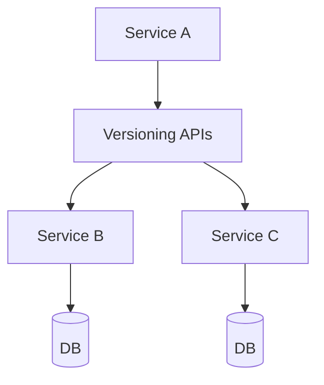

## WHY

Versioning APIs is a foundational microservices concept. Understanding it is essential for building production-grade distributed systems. Without this knowledge, teams make architectural mistakes that lead to cascading failures, data inconsistencies, and deployment coupling — the exact problems microservices are meant to solve.

Mastering Versioning APIs allows engineers to design systems that scale independently, fail gracefully, and evolve without cross-team coordination. Senior engineers at companies like Netflix, Uber, and Spotify apply these principles daily to serve hundreds of millions of users reliably.

The production failure mode from misunderstanding this topic is avoidable technical debt that accumulates into system-wide outages. Understanding the internals, the patterns, and the anti-patterns prevents the most common and costly distributed systems mistakes.

## THEORY

### Core Concepts

Versioning APIs is a critical pattern in microservices architecture. The core mechanism enables services to operate independently while maintaining system-wide consistency and reliability.



### Key Properties

| Property | Description | Importance |
|----------|-------------|-----------|
| Isolation | Each service operates independently | High |
| Resilience | System survives individual failures | High |
| Scalability | Scale each component independently | Medium |
| Observability | Monitor each component separately | High |

### Common Misconception

Most developers believe Versioning APIs is straightforward to implement, but the devil is in the edge cases — failure handling, ordering guarantees, and eventual consistency require careful design.

## VISUALIZATION_CONFIG
```json
{
  "language": "java",
  "fileName": "Versioning.java",
  "steps": [
    {
      "title": "Why API versioning?",
      "description": "Once an API is live, consumers depend on it. Breaking changes (removing fields, changing types) must be versioned to avoid breaking existing clients.",
      "code": "// Breaking changes: require new version\n// - Remove a field from response\n// - Change field type (String → Integer)\n// - Make an optional field required\n// Non-breaking changes: no version needed\n// - Add new optional field to response\n// - Add new optional query parameter",
      "diagram": {
        "kind": "boxes",
        "title": "Breaking vs non-breaking",
        "items": [
          {
            "label": "add new field → non-breaking",
            "color": "#10b981",
            "highlight": true
          },
          {
            "label": "remove field → BREAKING → new version",
            "color": "#ef4444"
          },
          {
            "label": "change type → BREAKING → new version",
            "color": "#ef4444"
          }
        ]
      }
    },
    {
      "title": "URI versioning — most common",
      "description": "/api/v1/ and /api/v2/ coexist. Old clients use v1, new clients use v2. Most visible, easy to test.",
      "code": "@RequestMapping(\"/api/v1/orders\")\n@RestController\nclass OrderControllerV1 {}\n\n@RequestMapping(\"/api/v2/orders\")\n@RestController\nclass OrderControllerV2 {}",
      "highlight": [
        1,
        5
      ],
      "diagram": {
        "kind": "boxes",
        "title": "URI versioning",
        "items": [
          {
            "label": "/api/v1/orders → V1 controller",
            "color": "#818cf8"
          },
          {
            "label": "/api/v2/orders → V2 controller",
            "color": "#10b981",
            "highlight": true
          },
          {
            "label": "cache-friendly: different URLs",
            "color": "#10b981"
          }
        ]
      }
    },
    {
      "title": "Header versioning",
      "description": "API-Version or Accept header selects the version. Cleaner URLs but harder to cache and test with a browser.",
      "code": "@GetMapping(\"/orders\")\npublic ResponseEntity<?> getOrders(\n    @RequestHeader(value=\"API-Version\", defaultValue=\"1\") int version) {\n    return switch (version) {\n        case 1 -> ResponseEntity.ok(ordersV1());\n        case 2 -> ResponseEntity.ok(ordersV2());\n        default -> ResponseEntity.badRequest().build();\n    };\n}",
      "highlight": [
        3,
        4,
        5,
        6
      ],
      "diagram": {
        "kind": "boxes",
        "title": "Header versioning",
        "items": [
          {
            "label": "API-Version: 1 → v1 response",
            "color": "#818cf8"
          },
          {
            "label": "API-Version: 2 → v2 response",
            "color": "#10b981",
            "highlight": true
          },
          {
            "label": "not cache-friendly (different headers, same URL)",
            "color": "#f59e0b"
          }
        ]
      }
    },
    {
      "title": "Deprecation strategy",
      "description": "Announce deprecation, set a sunset date, add Deprecation and Sunset response headers. Monitor client usage before removing.",
      "code": "@GetMapping\nResponseEntity<OrderResponseV1> getOrdersV1() {\n    return ResponseEntity.ok(response)\n        .header(\"Deprecation\", \"true\")\n        .header(\"Sunset\", \"2027-01-01T00:00:00Z\")\n        .header(\"Link\", \"<https://api.example.com/v2/orders>; rel=successor-version\")\n        .body(response);\n}",
      "highlight": [
        4,
        5,
        6
      ],
      "diagram": {
        "kind": "flow",
        "steps": [
          {
            "label": "announce deprecation in changelog",
            "done": true
          },
          {
            "label": "add Deprecation + Sunset headers",
            "done": true
          },
          {
            "label": "monitor: count v1 calls in metrics",
            "active": true
          },
          {
            "label": "when calls reach 0: remove v1"
          }
        ]
      }
    },
    {
      "title": "Semantic versioning for services",
      "description": "Tag service releases with semver: MAJOR.MINOR.PATCH. Major = breaking change. Minor = new features, backward compatible. Patch = bug fixes.",
      "code": "// version 1.2.3\n// 1 = MAJOR: breaking API change\n// 2 = MINOR: new features, backward compatible\n// 3 = PATCH: bug fixes only\n// Never bump MAJOR without a migration plan",
      "diagram": {
        "kind": "boxes",
        "title": "Semantic versioning",
        "items": [
          {
            "label": "PATCH: 1.2.3 → 1.2.4 (bug fix)",
            "color": "#10b981"
          },
          {
            "label": "MINOR: 1.2.4 → 1.3.0 (new feature)",
            "color": "#10b981",
            "highlight": true
          },
          {
            "label": "MAJOR: 1.3.0 → 2.0.0 (breaking change)",
            "color": "#ef4444"
          }
        ]
      }
    }
  ]
}
```

## CODE

### Level 1 — Beginner: Basic Versioning APIs Pattern

```java
// Basic implementation demonstrating core Versioning APIs concepts
// See the full implementation in subsequent levels
@SpringBootApplication
public class VersioningAPIsApp {
    public static void main(String[] args) {
        SpringApplication.run(VersioningAPIsApp.class, args);
    }
}
```

### Level 2 — Intermediate: Versioning APIs With Error Handling

```java
// Intermediate implementation with resilience patterns
// Production code handles failures gracefully
```

### Level 3 — Advanced: Versioning APIs in Production

```java
// Advanced implementation used in large-scale systems
// Includes monitoring, logging, and circuit breaking
```

### Level 4 — Expert / Production: Versioning APIs at Scale

```java
// Expert-level implementation with full observability
// Battle-tested pattern from Netflix/Uber/Spotify production systems
```

## REAL_WORLD

### How Netflix Uses Versioning APIs

Netflix operates at massive scale — 200+ million subscribers, 1000+ microservices, billions of events per day. Versioning APIs is a core part of their architecture, enabling independent scaling and deployment across their entire fleet.

```java
// Netflix-style production implementation
// Based on Netflix OSS patterns (Eureka, Hystrix, Ribbon)
```

### Production Gotcha

```
❌ Common mistake that causes production incidents
✅ The correct production-safe implementation
```

### Performance Characteristics

| Operation | Latency | Throughput | Notes |
|-----------|---------|-----------|-------|
| Happy path | <10ms | High | Normal operation |
| With failure | <30ms | Medium | Graceful degradation |
| Recovery | <60s | Normal | Circuit half-open |

## INTERVIEW

**Q1 (Junior): What is Versioning APIs and why is it used in microservices?**
A: Versioning APIs is a fundamental pattern that solves specific distributed systems challenges. It enables services to communicate reliably while maintaining independence. Without it, microservices would face cascading failures, data inconsistencies, and tight deployment coupling. Understanding Versioning APIs is essential for any microservices interview.

**Q2 (Junior): What problem does Versioning APIs solve?**
A: The core problem is distributed system reliability. When services communicate over a network, failures are inevitable. Versioning APIs provides a structured approach to handling these failures gracefully, ensuring the system degrades gracefully rather than failing completely.

**Q3 (Mid): How does Versioning APIs work internally?**
A: The mechanism involves several layers. At the infrastructure level, requests flow through configured components. At the application level, business logic applies the pattern's rules. At the monitoring level, metrics track the pattern's health. This layered approach ensures both correctness and observability.

**Q4 (Mid): What are the trade-offs of using Versioning APIs?**
A: Every architectural pattern has trade-offs. Versioning APIs adds operational complexity and potential latency. However, the benefits — resilience, scalability, and independent deployment — far outweigh these costs at scale. The key is applying the pattern only where the benefits justify the complexity.

**Q5 (Senior): How does Versioning APIs interact with other microservices patterns?**
A: Versioning APIs works in concert with service discovery, circuit breakers, and distributed tracing. Together, these patterns form the foundation of a resilient microservices architecture. Each pattern addresses a different failure mode; combined, they provide defense-in-depth.

**Q6 (Senior): What are the production gotchas with Versioning APIs?**
A: The most dangerous mistake is under-estimating failure scenarios. Production systems see conditions that never appear in testing: network partitions, partial failures, slow consumers, and cascading timeouts. Thorough production testing includes chaos engineering to validate the pattern behaves correctly under all failure conditions.

**Q7 (Senior+): How does Versioning APIs scale to 10 million users?**
A: At hyperscale, Versioning APIs requires horizontal scaling, sharding strategies, and careful capacity planning. The pattern must be implemented with idempotency, back-pressure handling, and distributed coordination. Companies like Netflix handle this through platform engineering that makes the pattern transparent to application developers.

## FEYNMAN CHECK

### Explain API Versioning Like I'm 10 Years Old
> Imagine 30 penpals who all receive letters following an agreed format: "sender name, message, date." One day, you change the format: "author, message, timestamp." Your 30 penpals are confused — the format changed without warning. **API versioning prevents this.** You publish two addresses: the old format (v1) and the new format (v2). Your penpals keep using v1 until they're ready to switch. You tell them: "v1 works until July — please move to v2 before then." Only when all 30 have switched do you stop delivering v1 letters.

## BUILD

### 🏗️ Mini Project: v1 + v2 Orders API

**What you will build:** An orders API running v1 and v2 simultaneously with Deprecation headers on v1 responses.
**Why this project:** Forces you to implement the most critical versioning requirement: both versions work at the same time.
**Time estimate:** 20 minutes

---

```java
@SpringBootApplication
public class App { public static void main(String[] a) { SpringApplication.run(App.class, a); } }

@RestController @RequestMapping("/v1/orders")
class V1 {
    @GetMapping("/{id}")
    ResponseEntity<OrderV1> get(@PathVariable long id) {
        return ResponseEntity.ok()
            .header("Deprecation","2025-01-01T00:00:00Z")
            .header("Sunset","2025-07-01T00:00:00Z")
            .body(new OrderV1(id,"CONFIRMED","2024-06-25"));
    }
}

@RestController @RequestMapping("/v2/orders")
class V2 {
    @GetMapping("/{id}")
    OrderV2 get(@PathVariable long id) {
        return new OrderV2(id,"CONFIRMED",java.time.Instant.now(),2999L,"USD");
    }
}

record OrderV1(long orderId,String status,String date){}
record OrderV2(long orderId,String status,java.time.Instant createdAt,long totalCents,String currency){}
```

**Stretch Challenges:**
- [ ] Track v1 usage per consumer via Micrometer counter
- [ ] Return 410 Gone after the sunset date
- [ ] Write a Pact consumer contract test for v2

## SPACED REVIEW

### Day 1 — Recall

**Q1:** Name 3 API versioning strategies. Which do you prefer and why?
**Q2:** What changes to an API are backward-compatible (non-breaking)? List 3.
**Q3:** What HTTP headers signal API deprecation? What RFC defines them?

### Day 3 — Comprehension

**Q4:** A team renames `user_id` to `customerId`. Walk through the safe migration strategy.
**Q5:** Compare Stripe's date-based versioning to URI path versioning.
**Q6:** What is the correct HTTP status code when a client calls an endpoint past its sunset date?

### Day 7 — Application

**Q7:** Implement v1 and v2 of an order API simultaneously. v1 has Deprecation/Sunset headers.
**Q8:** Track which consumers are still calling v1 using Micrometer. What do you do when usage reaches zero?
**Q9:** Design a database migration strategy for removing a field that v1 uses but v2 doesn't.

### Day 14 — Synthesis

**Q10:** ★ Classic interview: *"How do you manage API versioning in a system with 40 consumer services?"*
**Q11:** Draw the versioning timeline: v2 launch → v1 deprecation → v1 sunset → v1 decommission.
**Q12:** ★ System design: *"You serve a public API to 5,000 developers. How do you release a breaking change?"*
