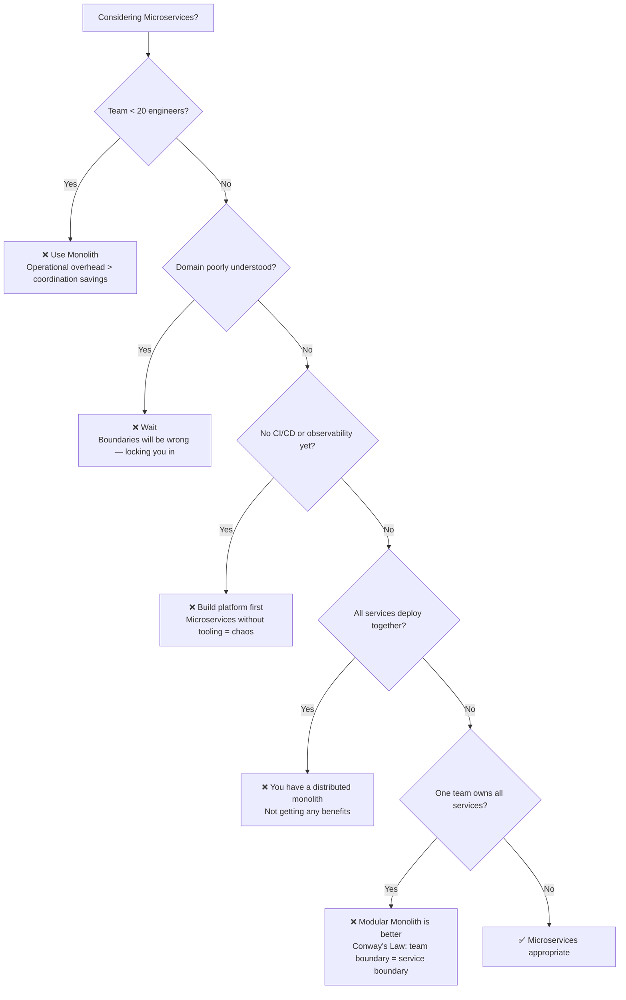

## WHY

The hardest architectural advice to give — and to hear — is "don't use microservices." The industry has so thoroughly marketed microservices as the modern default that declining to use them can feel like technical regression. Yet "when not to use microservices" is the most practically important question in architecture, because the cost of adopting them inappropriately is enormous and often irreversible: once you've split your monolith into 40 microservices, re-merging them requires a multi-year effort few organisations will approve. The asymmetry matters: starting with a monolith and later decomposing is 10× easier than starting with microservices and later consolidating.

The specific pain that motivated this topic: startup graveyard analysis. Companies that adopted microservices as their founding architecture — before finding product-market fit, before their domain was understood, before their team reached critical mass — consistently report 2× slower feature development in years 1-3 compared to peers who used monoliths. The engineering time consumed by setting up CI/CD for 20 services, debugging distributed-system failures, and maintaining service contracts was time *not* spent iterating on product. Several startups have blamed premature microservices for missing their market window.

The production failure mode from premature microservices is **accidental early service boundaries that are wrong**. Domain understanding evolves as you learn from users — the "bounded contexts" that seemed obvious at month 3 are often completely wrong by month 18. In a monolith, refactoring bounded contexts costs hours (rename a package, move some classes). In microservices, it costs months (merge services, re-design APIs, migrate databases, update consumers). Early microservices lock you into incorrect boundaries at the highest-cost possible time.

Senior engineers must have the courage and tools to recommend "use a monolith" when the situation calls for it, and must be able to articulate the specific criteria that make microservices the wrong choice — not out of laziness, but out of engineering rigor.

## THEORY

### The Five Red Flags That Indicate "Not Microservices Yet"



### When to Use Each Architecture

| Situation | Recommendation | Reason |
|-----------|---------------|--------|
| <20 engineers, single product | Monolith | Ops overhead > coordination savings |
| Early startup, <18 months old | Monolith | Domain is too unknown; boundaries will be wrong |
| Single team, no plan to split | Modular monolith | Conway's Law: one team = one service |
| No CI/CD pipeline | Monolith first | Microservices without CI/CD = manual deploy hell |
| No observability stack | Monolith first | Distributed debugging without tracing is impossible |
| All services always deploy together | Consolidate to monolith | You have a distributed monolith — no benefit, all cost |
| Domain very simple (CRUD only) | Monolith | No complexity to decompose |
| High read/write coupling across all data | Monolith | Every service will call every other — worse than a monolith |
| 30-50 engineers, 3+ clear domains | Modular monolith | Halfway point — get benefits without full cost |
| 50+ engineers, 5+ teams, different deploy cadences | Microservices | Benefits outweigh costs |

### The "Not Microservices" Alternative: Modular Monolith

A modular monolith is the often-overlooked middle option that gets 80% of microservices' architectural benefits at 10% of the operational cost:

```
Monolith advantages:         Microservices advantages:     Modular Monolith gets:
✅ Simple deployment         ✅ Clear module ownership      ✅ Both
✅ ACID transactions         ✅ Bounded contexts            ✅ Both (via schemas per module)
✅ In-process calls          ✅ Testable in isolation        ✅ Both
✅ Single CI/CD              ✅ Independent scalability      ❌ Only vertical scaling
                             ✅ Independent deploy cadence   ❌ Still one deployable
                             ✅ Polyglot stacks              ❌ One tech stack
                             ✅ Fault isolation              ❌ One process
```

### Common Misconception

> "If you start with a monolith, you'll always be stuck with a monolith."

**Reality:** The Strangler Fig pattern lets you extract individual bounded contexts into microservices incrementally while the monolith keeps running. Amazon, Twitter, Uber, and Netflix all started as monoliths and decomposed them over years. The key insight: starting with a modular monolith (clean bounded-context boundaries in code) makes the eventual extraction mechanical — you just "promote" an existing module to its own service. The bounded context is already defined; you're just adding network and a separate deploy pipeline. This is far easier than starting with microservices and getting the boundaries wrong.

## VISUALIZATION_CONFIG

```json
{ "component": "FlowChart", "state": "microservices-ms-when-not" }
```

## CODE

### Level 1 — Beginner: Recognizing a Distributed Monolith

```java
// ❌ DISTRIBUTED MONOLITH — "microservices" that must always deploy together
// Signs: services call each other synchronously in chains, can't function independently

// UserService calls AddressService calls PhoneService in every request
@RestController
class UserController {
    private final RestClient addressClient;  // requires address-service to be UP
    private final RestClient phoneClient;    // requires phone-service to be UP

    @GetMapping("/users/{id}")
    public UserProfile getUser(@PathVariable long id) {
        // ❌ If either dependency is down, this entire service is down
        // ❌ If you change address or phone schema, you must redeploy ALL services together
        // ❌ You get ALL the operational cost of microservices with NONE of the fault-isolation benefit
        Address address = addressClient.get().uri("/addresses/user/" + id).retrieve().body(Address.class);
        Phone phone = phoneClient.get().uri("/phones/user/" + id).retrieve().body(Phone.class);
        return new UserProfile(id, address, phone);
    }
}

// Symptom: you can't stop any one service — stopping address-service breaks users, orders, payments

// ✅ MODULAR MONOLITH ALTERNATIVE — same code, one deployable, no distributed-system cost
@Service
class UserProfileService {
    private final UserRepository users;
    private final AddressRepository addresses;  // same JVM, same database (different schema)
    private final PhoneRepository phones;

    public UserProfile getProfile(long id) {
        // ✅ In-process call — nanoseconds, always available, transactional
        User user = users.findById(id).orElseThrow();
        Address address = addresses.findByUserId(id).orElseThrow();
        Phone phone = phones.findByUserId(id).orElseThrow();
        return new UserProfile(id, address, phone);
        // All three are in the same bounded context — they BELONG together
    }
}

record UserProfile(long id, Object address, Object phone) {}
record Address(String street, String city) {}
record Phone(String number) {}
```

### Level 2 — Intermediate: Modular Monolith with Spring Modulith

```java
// Spring Modulith (2022+) — strict module boundaries in a monolith
// Compile-time enforcement of "no cross-module internal class access"
// This is the recommended alternative to microservices for most teams

// Project structure:
// src/main/java/com/shop/
//   orders/         ← Orders module: owns order logic + orders DB schema
//     OrdersModule.java
//     api/PlaceOrderRequest.java    ← PUBLIC API
//     api/OrderSummary.java         ← PUBLIC
//     internal/OrderEntity.java     ← PRIVATE (cannot be accessed from other modules)
//     internal/OrderRepository.java ← PRIVATE
//   users/          ← Users module: owns user logic + users DB schema
//     api/UserSummary.java          ← PUBLIC
//     internal/UserEntity.java      ← PRIVATE (orders module CANNOT use this)
//   payments/       ← Payments module

package com.shop.orders.api;

// PUBLIC interface of the Orders module
public interface OrderService {
    OrderSummary placeOrder(PlaceOrderRequest request);
    OrderSummary findOrder(long orderId);
}

public record PlaceOrderRequest(long userId, String sku, int quantity) {}
public record OrderSummary(long id, long userId, String sku, int quantity, String status) {}

package com.shop.orders.internal;

import com.shop.orders.api.*;
import com.shop.users.api.UserSummary;  // ✅ CAN access users' PUBLIC api
import org.springframework.stereotype.Service;

@Service
class OrderServiceImpl implements OrderService {
    private final OrderRepository repo;
    private final com.shop.users.api.UserLookupService userService;

    OrderServiceImpl(OrderRepository repo,
                     com.shop.users.api.UserLookupService userService) {
        this.repo = repo;
        this.userService = userService;
    }

    public OrderSummary placeOrder(PlaceOrderRequest req) {
        UserSummary user = userService.findById(req.userId());  // in-process call
        OrderEntity entity = new OrderEntity(req.userId(), req.sku(), req.quantity(), "PENDING");
        repo.save(entity);
        return new OrderSummary(entity.id(), user.id(), req.sku(), req.quantity(), "PENDING");
    }

    public OrderSummary findOrder(long orderId) {
        return repo.findById(orderId).map(e ->
            new OrderSummary(e.id(), e.userId(), e.sku(), e.qty(), e.status())
        ).orElseThrow();
    }
}

// ArchUnit test that Spring Modulith auto-generates — fails build if boundaries crossed
// @ApplicationModuleTest
// class OrdersModuleTest { ... }  // runs orders module IN ISOLATION — same isolation as microservices!

class OrderEntity {
    long id; long userId; String sku; int qty; String status;
    OrderEntity(long userId, String sku, int qty, String status) {
        this.userId = userId; this.sku = sku; this.qty = qty; this.status = status;
    }
    long id() { return id; } long userId() { return userId; }
    String sku() { return sku; } int qty() { return qty; } String status() { return status; }
}
interface OrderRepository {
    void save(OrderEntity e);
    java.util.Optional<OrderEntity> findById(long id);
}
```

### Level 3 — Advanced: The Decision Framework in Code

```java
package com.architecture;

import java.util.*;

/**
 * Decision framework: should this feature/system use microservices?
 * Produces concrete recommendations with justifications.
 * Use this as a template for architecture decision records (ADRs).
 */
public class MicroservicesDecisionFramework {

    public enum Verdict { MONOLITH, MODULAR_MONOLITH, MICROSERVICES, NOT_YET }

    public record ArchitectureDecision(
        Verdict verdict,
        List<String> blockers,   // reasons this can't be microservices yet
        List<String> triggers,   // conditions that would change the verdict
        String rationale
    ) {}

    /**
     * Check each criterion in priority order.
     * Returns NOT_YET if any prerequisite is missing — don't adopt microservices
     * until the prerequisites are in place, regardless of other factors.
     */
    public static ArchitectureDecision decide(
            int engineers,
            boolean domainWellUnderstood,
            boolean hasCiCdPerService,
            boolean hasDistributedTracing,
            boolean hasOnCallProcess,
            int clearBoundedContexts,
            boolean teamsAlignedToContexts,
            boolean divergentDeployCadences) {

        List<String> blockers = new ArrayList<>();
        List<String> triggers = new ArrayList<>();

        // HARD BLOCKERS — prerequisites without which microservices cause more harm than good
        if (!hasCiCdPerService) {
            blockers.add("❌ No CI/CD per service — cannot deploy independently without automation");
            triggers.add("Establish automated CI/CD for each service (<10 min pipeline)");
        }
        if (!hasDistributedTracing) {
            blockers.add("❌ No distributed tracing — debugging cross-service failures is nearly impossible");
            triggers.add("Deploy OpenTelemetry + Jaeger/Zipkin BEFORE first microservice");
        }
        if (!domainWellUnderstood) {
            blockers.add("❌ Domain not well-understood — bounded context boundaries will be wrong");
            triggers.add("Build a monolith until the domain is stable (typically 12-18 months)");
        }

        // If any hard blocker, return NOT_YET
        if (!blockers.isEmpty()) {
            return new ArchitectureDecision(
                Verdict.NOT_YET,
                blockers,
                triggers,
                "Prerequisites missing. Fix blockers first, then re-evaluate."
            );
        }

        // SOFT CRITERIA — inform monolith vs modular monolith vs microservices
        if (engineers < 15) {
            return new ArchitectureDecision(
                Verdict.MONOLITH,
                List.of("Small team: operational overhead > coordination savings"),
                List.of("Re-evaluate when team exceeds 20 engineers"),
                "Team too small — a monolith ships faster and has lower ops cost"
            );
        }

        if (!teamsAlignedToContexts || clearBoundedContexts < 3) {
            return new ArchitectureDecision(
                Verdict.MODULAR_MONOLITH,
                List.of("Teams not yet aligned to bounded contexts",
                        "Fewer than 3 clear bounded contexts"),
                List.of("Restructure teams around bounded contexts first (Conway's Law)",
                        "Use Spring Modulith to establish strict module boundaries"),
                "Modular monolith gets 80% of the benefits at 10% of the operational cost"
            );
        }

        if (!divergentDeployCadences && engineers < 40) {
            return new ArchitectureDecision(
                Verdict.MODULAR_MONOLITH,
                List.of("No divergent deploy cadences — independent deployment not needed",
                        "Team not large enough for ops overhead to pay off"),
                List.of("Re-evaluate when teams deploy at different rates",
                        "Re-evaluate when engineers exceed 40"),
                "Modular monolith is the right size — no reason to pay microservices tax yet"
            );
        }

        return new ArchitectureDecision(
            Verdict.MICROSERVICES,
            List.of(),  // no blockers
            List.of(),  // no triggers needed
            "All prerequisites met and criteria satisfied — microservices appropriate"
        );
    }
}
```

### Level 4 — Expert / Production: Microservices Debt Scorecard

```java
package com.architecture;

import java.util.*;
import java.util.stream.*;

/**
 * Production use: quarterly architecture health review.
 * Score each microservice on criteria that indicate it should be merged back into a modular monolith.
 * Used to identify "nano-service debt" — services too small to be worth running independently.
 */
public class ServiceHealthScorecard {

    public record ServiceMetrics(
        String serviceName,
        int deploysPerMonth,         // Actual independent deploys (not part of a coordinated group)
        int linesOfCode,             // Lines of production Java code
        int teamMembers,             // Number of engineers on the owning team
        double errorRatePct,         // Avg error rate over last 30 days
        double avgLatencyMs,         // P50 response latency
        int crossServiceDependencies,// Number of OTHER services this service synchronously calls
        boolean hasOwnDatabase,      // Does it have its own DB schema?
        boolean hasOwnCI,            // Does it have its own CI pipeline?
        String owningTeam            // Team name
    ) {}

    public enum ServiceHealth {
        HEALTHY,           // Good as a microservice
        AT_RISK,           // Warning: consider consolidation
        SHOULD_CONSOLIDATE // Strong recommendation: merge this service
    }

    public record ServiceAssessment(
        String serviceName,
        ServiceHealth health,
        int score,             // 0-100, higher is healthier as a microservice
        List<String> issues,
        List<String> actions
    ) {}

    public static ServiceAssessment assess(ServiceMetrics m) {
        List<String> issues = new ArrayList<>();
        List<String> actions = new ArrayList<>();
        int score = 100;

        // Penalty: very small service (nano-service)
        if (m.linesOfCode() < 200) {
            score -= 30;
            issues.add("Very small service (" + m.linesOfCode() + " LOC) — consider if this warrants independent deployment");
            actions.add("Evaluate merging with " + m.owningTeam() + "'s other services");
        }

        // Penalty: rare independent deploys
        if (m.deploysPerMonth() < 2) {
            score -= 25;
            issues.add("Deploys only " + m.deploysPerMonth() + "× per month — not getting independent-deploy benefit");
            actions.add("If deploy cadence won't increase, merge into adjacent service");
        }

        // Penalty: many cross-service dependencies (chatty service)
        if (m.crossServiceDependencies() > 5) {
            score -= 20;
            issues.add("High dependency count (" + m.crossServiceDependencies() + " synchronous deps) — likely distributed monolith pattern");
            actions.add("Move to async event-based communication or consolidate dependencies into this service");
        }

        // Penalty: no own database
        if (!m.hasOwnDatabase()) {
            score -= 15;
            issues.add("No dedicated database — shares schema with other services (database coupling)");
            actions.add("Either assign dedicated schema/tables or merge into the service that owns the data");
        }

        // Penalty: high error rate (may indicate integration complexity > benefits)
        if (m.errorRatePct() > 5.0) {
            score -= 10;
            issues.add(String.format("High error rate %.1f%% — inter-service complexity may be causing issues", m.errorRatePct()));
            actions.add("Audit whether errors are from network complexity vs. business logic bugs");
        }

        ServiceHealth health = score >= 70 ? ServiceHealth.HEALTHY
            : score >= 40 ? ServiceHealth.AT_RISK
            : ServiceHealth.SHOULD_CONSOLIDATE;

        return new ServiceAssessment(m.serviceName(), health, score, issues, actions);
    }

    public static void main(String[] args) {
        List<ServiceMetrics> services = List.of(
            new ServiceMetrics("order-service", 25, 2500, 4, 0.5, 45, 2, true, true, "orders-team"),
            new ServiceMetrics("product-name-formatter", 0, 80, 1, 2.0, 3, 1, false, true, "catalog-team"),
            new ServiceMetrics("legacy-adapter", 1, 150, 1, 8.0, 120, 7, false, false, "platform-team"),
            new ServiceMetrics("payment-service", 20, 1800, 3, 0.1, 89, 1, true, true, "payments-team")
        );

        System.out.println("=== Service Health Scorecard ===\n");
        services.stream()
            .map(ServiceHealthScorecard::assess)
            .sorted(Comparator.comparing(ServiceAssessment::score))
            .forEach(a -> {
                System.out.printf("[%s] %s (score=%d)%n", a.health(), a.serviceName(), a.score());
                a.issues().forEach(i -> System.out.println("  ⚠ " + i));
                a.actions().forEach(x -> System.out.println("  → " + x));
                System.out.println();
            });
    }
}
```

## REAL_WORLD

### How Segment Publicly Consolidated 130 Microservices Into One

Segment — the customer data platform — is the most famous public story of microservices consolidation. In 2016-2017, they built ~130 small microservices for their data pipeline (ingest → transform → route → deliver). By 2019, they had a severe problem: these 130 services had enormous interdependencies, shared infrastructure failed across all of them simultaneously (defeating fault isolation), and the team of 6 engineers spent most of their time on infrastructure rather than features. In a widely-read blog post, they documented consolidating everything into a single service they called "Centrifuge" — a monolith optimized for data processing. The result: 3× throughput improvement, 97% reduction in incident response time, and a team that could actually build features instead of babysitting 130 services. The key lesson: microservices are not appropriate for a 6-engineer team processing a pipeline where all stages have uniform scaling needs.

```java
// The pattern Segment used: a SINGLE Java service with internal pipeline stages
// vs their previous 130 microservices each handling one pipeline step

@SpringBootApplication
public class CentrifugeApp {
    public static void main(String[] args) { SpringApplication.run(CentrifugeApp.class, args); }
}

@Service
class DataPipeline {
    private final List<PipelineStage> stages;

    DataPipeline() {
        // All stages in ONE process — previously 130 separate services
        this.stages = List.of(
            new IngestStage(),       // was: ingest-service
            new ValidateStage(),     // was: validate-service
            new EnrichStage(),       // was: enrich-service
            new RouteStage(),        // was: route-service
            new DeliverStage()       // was: deliver-service
        );
    }

    public ProcessingResult process(RawEvent event) {
        Object current = event;
        for (PipelineStage stage : stages) {
            current = stage.process(current);  // in-process — microseconds vs. ms
        }
        return new ProcessingResult(true, current);
    }
}

interface PipelineStage { Object process(Object input); }
class IngestStage implements PipelineStage { public Object process(Object in) { return in; } }
class ValidateStage implements PipelineStage { public Object process(Object in) { return in; } }
class EnrichStage implements PipelineStage { public Object process(Object in) { return in; } }
class RouteStage implements PipelineStage { public Object process(Object in) { return in; } }
class DeliverStage implements PipelineStage { public Object process(Object in) { return in; } }
record RawEvent(String data) {}
record ProcessingResult(boolean ok, Object result) {}
// Result: 3× throughput, 97% fewer incidents, 5× engineering velocity
```

### Production Gotcha: Domain That's Too Unknown

```
❌ Classic microservices premature adoption: starting a new product domain with microservices
before you know what the bounded contexts are.

Real scenario (2018, B2B SaaS startup):
  - Month 1: team of 8 engineers, new product, starts with 20 microservices
  - Month 3: user-service, company-service, employee-service, membership-service
    are discovered to be 90% the same bounded context
  - Month 6: team needs to refactor — what should have been one "identity" service
    is spread across 4 separate services with separate databases
  - Refactoring cost: 3 months of engineering time, zero features shipped
  - Additional cost: all API consumers must be updated, all migrations coordinated

If they had started with a modular monolith:
  - Month 3 same discovery: rename package, move classes → 1 day
  - Month 6: new bounded context understanding is reflected in code
  - Cost: hours, not months
  - Features shipped during those 3 months: significant

✅ FIX — the "Monolith First" rule (Martin Fowler):
  1. Start with a modular monolith with STRICT module boundaries
  2. After 12-18 months of running the product in production, you will understand
     the ACTUAL bounded contexts (often completely different from initial assumptions)
  3. Then extract modules into microservices along the now-correct boundaries
  4. The boundary in code (module) becomes the boundary in infrastructure (service)
     with minimal refactoring cost
```

**Why it happens:** Engineers design microservice boundaries from a theoretical domain model in a whiteboard session before writing a single line of production code. Domain understanding REQUIRES running a real product with real users — every domain expert who says "the boundaries are obvious" has usually discovered 6 months later that they weren't. Microservices lock in boundaries at the cost of months of engineering to change; monoliths make boundary changes cheap until you're confident.

### Performance Characteristics

| Approach | Feature velocity (early stage) | Feature velocity (at scale) | Ops cost |
|----------|-------------------------------|----------------------------|----------|
| Monolith | High | Low (coordination) | Low |
| Modular Monolith | High | Medium | Low |
| Microservices (premature) | Very Low | High | Very High |
| Microservices (well-timed) | Medium | High | High (mitigated by platform) |

## INTERVIEW

**Q1 (Junior): Name three situations where you should NOT use microservices.**
A: Three clear situations: (1) **Small teams** (<20 engineers) — the operational overhead (CI/CD per service, distributed tracing, on-call rotation) exceeds the coordination overhead the team has in a monolith; a 10-person team can coordinate by talking, which costs far less than running 20 CI/CD pipelines; (2) **Early-stage products** (< 18 months old, no product-market fit) — the domain is not yet understood, so bounded-context boundaries drawn today will be wrong in 12 months; refactoring microservice boundaries costs months vs. hours in a monolith; (3) **No observability or CI/CD** — without distributed tracing, debugging cross-service failures takes hours; without automated CI/CD per service, "independent deployment" becomes manual coordination ceremonies that are worse than a shared monolith pipeline.

**Q2 (Junior): What is the "distributed monolith" anti-pattern?**
A: A distributed monolith is a system that has been split into multiple services but retains all the coupling of a monolith — services must deploy together because they share databases, share internal schemas, or have deep synchronous dependency chains that mean any one service down = all services down. You get all the costs of microservices (network overhead, distributed debugging, multiple CI/CD pipelines) with none of the benefits (fault isolation, independent deployment). Classic signs: you always deploy 3+ services together when shipping a feature; stopping any one service breaks others; changing a data structure requires updates to multiple services simultaneously. The fix is either to consolidate back into a modular monolith, or to properly decouple services (database-per-service, async communication, versioned APIs).

**Q3 (Mid): What is Martin Fowler's "Monolith First" principle and why does it matter?**
A: Fowler's principle: "you shouldn't start a new project with microservices, even if you're sure your application will be big enough to make it worthwhile." The reason: almost all successful microservice systems start as monoliths and then decompose, not the reverse. The microservice decomposition requires understanding the correct bounded contexts — which only emerges from running the product in production for 12-18 months. Starting with microservices locks you into today's (wrong) bounded-context guesses. Starting with a well-modularized monolith lets you decompose incrementally along the (now correct) boundaries. The practical corollary: "if you're not sure whether you'll need microservices, you probably don't — yet." Build a modular monolith with strict module boundaries, ship to production, learn from real users, then extract the parts that truly benefit from independence.

**Q4 (Mid): How do you recognize that a microservices system should be consolidated back into a monolith?**
A: Five concrete indicators: (1) **Services always deploy together** — if your deploy process touches 5+ services for every feature, you've lost the independent-deployment benefit; (2) **Team spends >25% of time on infrastructure** — on-call, CI/CD, dashboards, Helm charts; if your 8 engineers dedicate 2 full headcounts to infrastructure, you're over-invested; (3) **Average incidents span 3+ services** — means fault isolation isn't working; if failures cascade routinely, you're paying distributed-system cost with no fault-tolerance gain; (4) **Nano-services** — services with <500 LOC that deploy rarely; every deploy they do is still coordinated with other services; (5) **Bounded contexts are wrong** — multiple services always change together because they represent one logical domain that was artificially split. Any 3 of these 5 is a strong signal to consolidate.

**Q5 (Senior): A startup CTO tells you "we're building microservices from day one to avoid migration later." How do you advise them?**
A: The argument sounds reasonable but has a fatal flaw: migration from monolith to microservices is hard primarily because of **wrong bounded-context boundaries** in the existing code, not because of the technology. If you start with a monolith that has correctly-identified bounded contexts (module boundaries in code that match the real domain), migration is mostly mechanical — add a network layer between modules. If you start with microservices with incorrectly-identified boundaries (which is almost guaranteed for a new product), you've locked the wrong boundaries into separate services with separate databases, and fixing them costs months. The advice: start with a **modular monolith using Spring Modulith or Packwerk** — this gives you correct domain boundaries, a fast development experience, and simple operations. When the team grows to 30+ and the domain is stable (12-18 months), extract services along the established module boundaries. This path is demonstrably faster than "microservices from day one" for 95% of startups.

**Q6 (Senior): Segment consolidated 130 microservices into a monolith. Does this mean microservices are a bad idea?**
A: Segment's consolidation shows microservices are a **context-dependent tool**, not a universal good. Their specific context: a 6-engineer team running a uniform data-pipeline workload where all 130 "services" had the same scaling needs, the same failure modes, and were always deployed together. This is exactly the case where microservices add maximum cost and minimum benefit. The consolidation was correct for *that* context. Contrast with Netflix: 1000+ engineers, radically different services (streaming, recommendations, billing, device SDKs), different scaling profiles, different tech stacks — microservices are clearly the right call there. The lesson isn't "don't use microservices," it's "match the architecture to the team topology and problem space." Segment got the pairing wrong initially (130 services for 6 engineers). Netflix got it right. The decision framework should be data-driven, not buzzword-driven.

**Q7 (Senior+): How would you use a Service Health Scorecard to drive microservices consolidation at an organization with 400 services?**
A: At 400 services, manual review is impractical — you need a data-driven approach. Build automated collection of: deploys-per-service per month (from CI/CD system), cross-service call graph (from distributed tracing data), team ownership (from service catalogue like Backstage), lines of code (from Git), error rates and latencies (from Prometheus). Feed this into a scorecard that flags: services with <2 deploys/month (losing independent-deployment benefit), services with >5 synchronous dependencies (distributed monolith candidate), services with <500 LOC (nano-service candidate), services owned by teams that also own 10+ other services (one team can't afford to maintain 10 CI/CD pipelines properly). Present the scorecard quarterly in architecture reviews. Establish a "consolidation backlog" for at-risk services. Track the metric "number of services maintained per engineer" — healthy range is roughly 1-3 services per engineer; above 5 indicates over-decomposition. For Netflix/Uber at hyperscale, this is managed by their platform team providing fully self-service tools — at that point the overhead per service drops dramatically, allowing higher service-per-engineer ratios.

## FEYNMAN CHECK

### Explain "When NOT to Use Microservices" Like I'm 10 Years Old

> Imagine you're building a sandcastle. A 3-person sandcastle group (monolith) — everyone can see the whole castle and pass sand directly. No problem. Now imagine forcing 3 people to work on the sandcastle using a walkie-talkie each, wearing special gloves, never directly touching another person's section. That's microservices for 3 people. **All the overhead, none of the benefit** — they're too close together to need walkie-talkies. **But at 30 people, it makes sense**: without walkie-talkies, 30 people trying to build one castle bumps into each other constantly. The rule: use walkie-talkies (microservices) when there are too many people to shout across the construction site (monolith). **Don't use walkie-talkies when you can just turn to the person next to you and talk.**

---

### 5 Deep Conceptual Questions

**Q1: Why is starting with a monolith faster even if you know you'll eventually need microservices?**
> **A:** Microservices boundaries are hard to get right before you have production experience with the domain. A monolith with module boundaries gives you the same conceptual separation, but boundary changes cost hours (refactor a package, move a class) instead of months (merge services, migrate databases, update all API consumers). The "migration from monolith" cost that people dread is almost entirely caused by *incorrect* module boundaries in the monolith, not the fact that it's a monolith. A correctly-modularised monolith (using Spring Modulith or similar) extracts to microservices as easily as "add a network layer and separate deploy pipeline to each module" — the hard domain work is already done.

**Q2: What is the ONE criterion that should veto microservices regardless of team size?**
> **A:** "Domain not well understood yet." If the correct bounded-context boundaries are not known, microservices will lock in the wrong boundaries. This matters even for large teams: a 100-engineer team building a new product in an unfamiliar domain should still start with a modular monolith until production reveals the real domain structure. Bounded context discovery requires: user research, production usage data, multiple iterations of the product, and deep domain expert collaboration. None of these are available before launch. Every retrospective study of failed microservices migrations finds that the #1 technical problem was incorrect service boundaries — teams split along technical lines or org chart lines rather than actual domain lines.

**Q3: What is the most dangerous "when not to use microservices" mistake? Show it with architecture.**
> **A:** Adopting microservices for a new product before understanding the domain — locking in incorrect bounded contexts.
> ```
> // ❌ INCORRECT — microservices defined in week 1 for a new SaaS product
> // Team assumes these are the correct bounded contexts:
> user-service     (manages users)
> profile-service  (manages user profiles)
> preference-service (manages user preferences)
> settings-service (manages user settings)
> notification-service-preferences (manages notification settings... per user)
>
> // 8 months later, after running in production:
> // "Users, profiles, preferences, settings, and notification preferences
>  are all ONE bounded context — they're all just 'identity.'"
>
> // Cost of fixing in microservices: 3-month consolidation project
>   - Merge 5 DBs into one → data migration scripts
>   - Rewrite 5 APIs into 1 → update every consumer
>   - Update 5 CI/CD pipelines → ops work
>   - Coordinate with 6 other teams that call these services
>
> // ✅ CORRECT — start with modular monolith:
> module: identity (contains users, profiles, preferences, settings)
>
> // 8 months later: same discovery, different cost:
> // Move some classes around within the identity module → 2 hours
> // No API changes, no DB migrations, no consumer updates
> ```

**Q4: How does Conway's Law become a "not microservices" argument?**
> **A:** Conway's Law: "organizations design systems that mirror their communication structure." Its inverse (the Inverse Conway Maneuver): structure your teams the way you want your architecture to be, then let the architecture emerge. If a team of 5 engineers tries to own 20 microservices, each "service boundary" isn't a real team boundary — it's artificial. The services will be maintained by one person each, or by rotating engineers, without clear ownership. Without clear ownership, services drift: no one fully understands any one service, documentation rots, and the "independent operation" promise evaporates because no one is truly accountable for each service. Conway's Law dictates that microservices only work when service boundaries map to team boundaries — one dedicated team per service or small group of related services. If you have 5 engineers and 20 services, either merge services until you have 5-10, or accept that "team autonomy" is marketing fiction in your case.

**Q5: One-sentence definition of "when not to use microservices" for a senior FAANG engineer.**
> **A:** "Microservices should not be adopted when: (1) team size is below the coordination-overhead crossover (~30 engineers) where operational cost exceeds coordination savings; (2) the domain is insufficiently understood to correctly identify bounded contexts — incorrect microservice boundaries incur months to fix vs. hours in a modular monolith; (3) prerequisites are absent — no automated CI/CD per service, no distributed tracing, no on-call process — since without these, microservices' distributed-system costs materialize without the promised benefits; (4) Conway's Law alignment is missing — no team-per-service means no independent ownership, negating the autonomy argument; or (5) the system is a distributed monolith (services always deploy together, high synchronous coupling) — in which case you're paying microservices cost without the microservices benefit and should consolidate to a modular monolith."

## BUILD

### 🏗️ Mini Project: Service Health Scorecard CLI

**What you will build:** A command-line tool that takes service metrics as input and produces a health assessment: whether each service is a good microservice, at risk, or should be consolidated back into a monolith.
**Why this project:** Forces you to apply all "when not to use microservices" criteria as concrete, measurable thresholds — the artifact you'd use in a real architecture review meeting to justify consolidation or continued investment.
**Time estimate:** 30 minutes

---

#### Step 1 — Setup

```bash
mkdir service-scorecard && cd service-scorecard
mkdir -p src/main/java/com/scorecard
touch src/main/java/com/scorecard/{ServiceScorecard,ServiceMetrics,Main}.java
touch src/test/java/com/scorecard/ScorecardTest.java
```

#### Step 2 — Core Implementation

```java
package com.scorecard;
import java.util.*;

public class ServiceScorecard {
    public enum Health { HEALTHY, AT_RISK, CONSOLIDATE }
    public record Metrics(String name, int deploysPerMonth, int loc,
                          int syncDependencies, boolean hasOwnDb, double errorRatePct) {}
    public record Assessment(String name, Health health, int score, List<String> findings) {}

    public static Assessment assess(Metrics m) {
        var findings = new ArrayList<String>();
        int score = 100;

        if (m.deploysPerMonth() < 2) {
            score -= 30;
            findings.add("⚠ Deploys only " + m.deploysPerMonth() + "/month — no independent-deploy benefit");
        }
        if (m.loc() < 300) {
            score -= 25;
            findings.add("⚠ Nano-service (" + m.loc() + " LOC) — consider merging");
        }
        if (m.syncDependencies() > 4) {
            score -= 20;
            findings.add("⚠ " + m.syncDependencies() + " sync deps — distributed monolith risk");
        }
        if (!m.hasOwnDb()) {
            score -= 15;
            findings.add("⚠ No dedicated database — data coupling present");
        }
        if (m.errorRatePct() > 5) {
            score -= 10;
            findings.add(String.format("⚠ Error rate %.1f%% — review inter-service complexity", m.errorRatePct()));
        }

        Health h = score >= 70 ? Health.HEALTHY : score >= 40 ? Health.AT_RISK : Health.CONSOLIDATE;
        return new Assessment(m.name(), h, score, findings);
    }
}
```

#### Step 3 — CLI Output

```java
package com.scorecard;
import java.util.*;

public class Main {
    public static void main(String[] args) {
        var services = List.of(
            new ServiceScorecard.Metrics("order-service", 25, 2500, 2, true, 0.5),
            new ServiceScorecard.Metrics("address-formatter", 0, 85, 0, false, 0.1),
            new ServiceScorecard.Metrics("legacy-adapter", 1, 200, 7, false, 9.0),
            new ServiceScorecard.Metrics("payment-service", 18, 1800, 1, true, 0.2)
        );

        System.out.println("=== SERVICE HEALTH SCORECARD ===\n");
        services.stream()
            .map(ServiceScorecard::assess)
            .sorted(Comparator.comparing(ServiceScorecard.Assessment::score))
            .forEach(a -> {
                String icon = switch (a.health()) {
                    case HEALTHY -> "✅";
                    case AT_RISK -> "⚠️";
                    case CONSOLIDATE -> "❌";
                };
                System.out.printf("%s [%s] %s (score: %d/100)%n",
                    icon, a.health(), a.name(), a.score());
                a.findings().forEach(f -> System.out.println("   " + f));
                System.out.println();
            });
    }
}
```

#### Step 4 — Error Handling

```java
public static Assessment assessSafe(Metrics m) {
    Objects.requireNonNull(m, "Metrics required");
    Objects.requireNonNull(m.name(), "Service name required");
    if (m.loc() < 0) throw new IllegalArgumentException("LOC cannot be negative");
    if (m.errorRatePct() < 0 || m.errorRatePct() > 100)
        throw new IllegalArgumentException("Error rate must be 0-100");
    return assess(m);
}
```

#### Step 5 — Tests

```java
import org.junit.jupiter.api.*;
import com.scorecard.*;
import static org.junit.jupiter.api.Assertions.*;

class ScorecardTest {
    @Test
    void healthyServiceScoresAbove70() {
        var m = new ServiceScorecard.Metrics("good-service", 20, 2000, 1, true, 0.1);
        assertEquals(ServiceScorecard.Health.HEALTHY, ServiceScorecard.assess(m).health());
    }

    @Test
    void nanoServiceShouldConsolidate() {
        var m = new ServiceScorecard.Metrics("tiny", 0, 80, 0, false, 0.0);
        assertEquals(ServiceScorecard.Health.CONSOLIDATE, ServiceScorecard.assess(m).health());
    }

    @Test
    void highDependencyServiceIsAtRisk() {
        var m = new ServiceScorecard.Metrics("chatty", 5, 800, 6, true, 1.0);
        var result = ServiceScorecard.assess(m);
        assertTrue(result.health() != ServiceScorecard.Health.HEALTHY);
    }
}
```

**Expected Output:**
```
=== SERVICE HEALTH SCORECARD ===

❌ [CONSOLIDATE] legacy-adapter (score: 25/100)
   ⚠ Deploys only 1/month — no independent-deploy benefit
   ⚠ Nano-service (200 LOC) — consider merging
   ⚠ 7 sync deps — distributed monolith risk
   ⚠ No dedicated database — data coupling present
   ⚠ Error rate 9.0% — review inter-service complexity

❌ [CONSOLIDATE] address-formatter (score: 30/100)
   ⚠ Deploys only 0/month — no independent-deploy benefit
   ⚠ Nano-service (85 LOC) — consider merging
   ⚠ No dedicated database — data coupling present

✅ [HEALTHY] payment-service (score: 100/100)
✅ [HEALTHY] order-service (score: 100/100)
```

**Stretch Challenges:**
- [ ] Load metrics from a YAML file and produce a full HTML report
- [ ] Add a "consolidation plan" recommending which services should merge and why
- [ ] Connect to Prometheus API to fetch real metrics rather than hardcoded input

## SPACED REVIEW

> **How to use:** Answer each question from memory before reading ahead.

---

### Day 1 — Recall

**Q1:** Name the 5 "hard blockers" that should veto microservices regardless of team size.

**Q2:** Define the "distributed monolith" anti-pattern in 2 sentences.

**Q3:** What is Martin Fowler's "Monolith First" rule?

---

### Day 3 — Comprehension

**Q4:** A 10-engineer startup building their first SaaS product wants microservices. Walk through the decision framework — what architecture do you recommend and why?

**Q5:** Why does starting with microservices in a poorly-understood domain cause more pain than a monolith in the same domain?

**Q6:** What 3 metrics would you track to decide whether to consolidate a set of microservices back into a modular monolith?

---

### Day 7 — Application

**Q7:** You're reviewing 30 services owned by a 12-engineer team. Design a scorecard with 5 criteria to identify which services should be consolidated. Include thresholds.

**Q8:** A team argues "we started microservices so we can't go back." What are the three strongest counterarguments to this sunk-cost fallacy?

**Q9:** Implement a modular monolith for a simple e-commerce app (users, orders, products) using Spring Modulith concepts. Show how module boundaries are enforced.

---

### Day 14 — Synthesis & Interview Prep

**Q10:** ★ Classic interview: *"When would you use a monolith instead of microservices? Give concrete examples."*

**Q11:** Draw a timeline for a startup: Month 0 (launch with modular monolith) → Month 18 (domain understood, team at 25) → Month 36 (team at 60, extract first service). Show what changes at each stage.

**Q12:** ★ System design: *"You're CTO of a 5-year-old company with 40 engineers, a monolith that's starting to slow them down, and pressure from engineering to 'go microservices.' Design the migration path, including how you'd identify correct bounded contexts, how you'd use the strangler-fig pattern, and what prerequisites you'd need before extracting the first service."*

