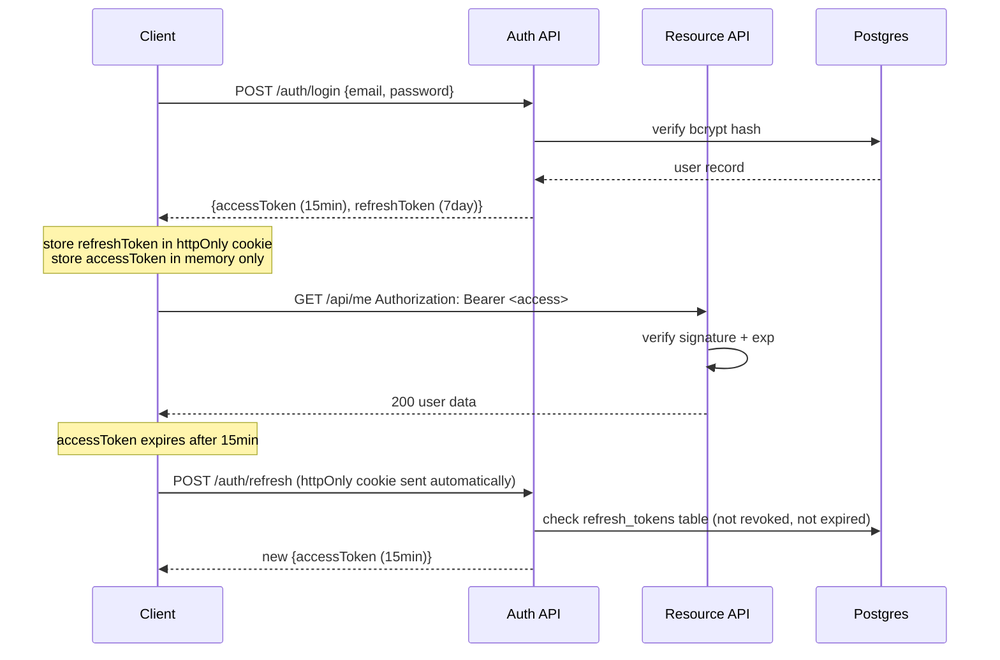

## WHY

Authentication is the front door of every system. Get it wrong — sign with a
weak secret, store tokens in localStorage, skip expiry validation — and your
security model collapses regardless of how good the rest of the code is.

JWT (JSON Web Token) is the authentication mechanism behind every major SaaS
platform, every OAuth 2.0 flow, and every Spring Security + Next.js combination
you will encounter on the job. Building it from scratch forces you to understand
what the three parts of a token actually mean, why signature verification is
not the same as authentication, and what `exp`, `iat`, `sub`, and `jti` claims
do. Reading the RFC is not enough — you need to implement the attack vectors
(token replay, alg=none bypass, weak secret brute-force) to appreciate why
each defense exists.

## THEORY

### JWT structure

```
eyJhbGciOiJIUzI1NiIsInR5cCI6IkpXVCJ9   ← header  (base64url)
.
eyJzdWIiOiJ1c2VyXzQyIiwiZXhwIjoxNzIwMDAwMDYwfQ  ← payload (base64url)
.
SflKxwRJSMeKKF2QT4fwpMeJf36POk6yJV_adQssw5c    ← signature (HMAC-SHA256)
```

The signature is `HMAC-SHA256(base64url(header) + "." + base64url(payload), secret)`.
The server recomputes the signature on every request and rejects tokens where
it doesn't match. **The payload is not encrypted — anyone can base64-decode it.**
The signature only proves the token was issued by someone who knows the secret.

### Access + refresh token pattern



### Claims to always validate

| Claim | Meaning | Attack if skipped |
|-------|---------|-------------------|
| `exp` | Expiry timestamp | Token valid forever after theft |
| `iat` | Issued-at (detect clock skew) | Accept tokens from the future |
| `iss` | Issuer | Accept tokens from another service |
| `aud` | Audience | Service A's token accepted by Service B |
| `jti` | JWT ID (unique) | Replay attack with stolen token |

### The `alg=none` attack

If the server reads `alg` from the token header to decide verification:
```json
{"alg":"none","typ":"JWT"}
```
An attacker strips the signature and sets `alg=none`. A naive verifier with
`if (header.alg == "none") skip_verification()` will accept any payload.
**Always hard-code the expected algorithm on the server. Never trust the
token's declared algorithm.**

## VISUALIZATION_CONFIG

```json
{ "component": "SequenceDiagram", "state": "jwt-auth-refresh-flow" }
```

## CODE

### Level 1 — Beginner: manual JWT creation with no library

```java
// Minimal JWT: understand the format before using a library.
class MinimalJwt {
    static final String SECRET = "dev-secret-min-32-chars-required!";

    static String create(String userId) throws Exception {
        String header  = b64url("{\"alg\":\"HS256\",\"typ\":\"JWT\"}");
        long   exp     = Instant.now().plusSeconds(900).getEpochSecond();
        String payload = b64url("{\"sub\":\"" + userId + "\",\"exp\":" + exp + "}");
        String sig     = hmac(header + "." + payload, SECRET);
        return header + "." + payload + "." + sig;
    }

    static String verify(String token) throws Exception {
        String[] parts = token.split("\\.");
        if (parts.length != 3) throw new IllegalArgumentException("bad token");
        String expected = hmac(parts[0] + "." + parts[1], SECRET);
        if (!expected.equals(parts[2])) throw new SecurityException("bad signature");
        String json = new String(Base64.getUrlDecoder().decode(parts[1]));
        // parse exp manually
        long exp = Long.parseLong(json.replaceAll(".*\"exp\":(\\d+).*", "$1"));
        if (exp < Instant.now().getEpochSecond()) throw new SecurityException("expired");
        return json.replaceAll(".*\"sub\":\"([^\"]+)\".*", "$1");
    }

    static String b64url(String s) {
        return Base64.getUrlEncoder().withoutPadding().encodeToString(s.getBytes());
    }
    static String hmac(String data, String secret) throws Exception {
        Mac mac = Mac.getInstance("HmacSHA256");
        mac.init(new SecretKeySpec(secret.getBytes(), "HmacSHA256"));
        return Base64.getUrlEncoder().withoutPadding().encodeToString(mac.doFinal(data.getBytes()));
    }
}
```

### Level 2 — Intermediate: Spring Boot JWT filter with JJWT

```java
@Component
public class JwtService {
    @Value("${app.jwt.secret}")  private String secret;
    @Value("${app.jwt.access-ttl-sec:900}") private long accessTtl;
    @Value("${app.jwt.refresh-ttl-sec:604800}") private long refreshTtl;

    private SecretKey key() {
        return Keys.hmacShaKeyFor(Decoders.BASE64.decode(secret));
    }

    public String createAccessToken(String userId, String email) {
        return Jwts.builder()
                .subject(userId)
                .claim("email", email)
                .claim("type", "access")
                .issuedAt(new Date())
                .expiration(new Date(System.currentTimeMillis() + accessTtl * 1000))
                .signWith(key())
                .compact();
    }

    public String createRefreshToken(String userId) {
        return Jwts.builder()
                .subject(userId)
                .claim("type", "refresh")
                .id(UUID.randomUUID().toString())   // jti — for revocation
                .issuedAt(new Date())
                .expiration(new Date(System.currentTimeMillis() + refreshTtl * 1000))
                .signWith(key())
                .compact();
    }

    public Claims verify(String token) {
        return Jwts.parser()
                .verifyWith(key())   // hard-codes expected algorithm — alg=none cannot pass
                .build()
                .parseSignedClaims(token)
                .getPayload();
    }
}

@Component
public class JwtAuthFilter extends OncePerRequestFilter {
    private final JwtService jwt;
    private final UserDetailsService uds;

    @Override
    protected void doFilterInternal(HttpServletRequest req,
                                    HttpServletResponse res,
                                    FilterChain chain) throws ServletException, IOException {
        String auth = req.getHeader("Authorization");
        if (auth == null || !auth.startsWith("Bearer ")) { chain.doFilter(req, res); return; }
        try {
            Claims claims = jwt.verify(auth.substring(7));
            if (!"access".equals(claims.get("type"))) throw new JwtException("wrong token type");
            UsernamePasswordAuthenticationToken authentication =
                    new UsernamePasswordAuthenticationToken(
                            claims.getSubject(), null,
                            List.of(new SimpleGrantedAuthority("ROLE_USER")));
            SecurityContextHolder.getContext().setAuthentication(authentication);
        } catch (JwtException e) {
            res.setStatus(401);
            res.getWriter().write("{\"error\":\"" + e.getMessage() + "\"}");
            return;
        }
        chain.doFilter(req, res);
    }
}
```

### Level 3 — Advanced: refresh token rotation with revocation table

```java
@Service
@Transactional
public class AuthService {
    private final UserRepository users;
    private final RefreshTokenRepository tokens;
    private final JwtService jwt;
    private final PasswordEncoder encoder;

    public AuthResponse login(LoginRequest req) {
        User user = users.findByEmail(req.email())
                .orElseThrow(() -> new BadCredentialsException("invalid credentials"));
        if (!encoder.matches(req.password(), user.getPasswordHash()))
            throw new BadCredentialsException("invalid credentials");

        String refresh = jwt.createRefreshToken(user.getId().toString());
        // Persist refresh token (hashed) for revocation checks
        tokens.save(new RefreshToken(
                UUID.randomUUID(),
                user.getId(),
                hashToken(refresh),
                Instant.now().plusSeconds(604800),
                false));
        return new AuthResponse(jwt.createAccessToken(user.getId().toString(), user.getEmail()),
                               refresh);
    }

    public AuthResponse refresh(String rawRefresh) {
        Claims claims = jwt.verify(rawRefresh);
        if (!"refresh".equals(claims.get("type"))) throw new JwtException("not a refresh token");

        RefreshToken stored = tokens.findByTokenHash(hashToken(rawRefresh))
                .orElseThrow(() -> new JwtException("token not found — possible replay"));
        if (stored.isRevoked()) {
            // Revoke ALL tokens for this user — refresh token theft detected
            tokens.revokeAllForUser(stored.getUserId());
            throw new JwtException("token reuse detected — all sessions revoked");
        }
        if (stored.getExpiresAt().isBefore(Instant.now())) throw new JwtException("refresh expired");

        // Rotation: revoke old, issue new
        stored.setRevoked(true);
        tokens.save(stored);

        User user = users.findById(stored.getUserId()).orElseThrow();
        String newRefresh = jwt.createRefreshToken(user.getId().toString());
        tokens.save(new RefreshToken(UUID.randomUUID(), user.getId(),
                hashToken(newRefresh), Instant.now().plusSeconds(604800), false));
        return new AuthResponse(jwt.createAccessToken(user.getId().toString(), user.getEmail()),
                               newRefresh);
    }

    public void logout(String rawRefresh) {
        tokens.findByTokenHash(hashToken(rawRefresh)).ifPresent(t -> {
            t.setRevoked(true); tokens.save(t);
        });
    }

    private String hashToken(String raw) {
        // SHA-256 so the DB doesn't store raw tokens
        try {
            MessageDigest md = MessageDigest.getInstance("SHA-256");
            return Base64.getEncoder().encodeToString(md.digest(raw.getBytes()));
        } catch (NoSuchAlgorithmException e) { throw new RuntimeException(e); }
    }
}
```

### Level 4 — Expert: RS256 (asymmetric) + JWKS endpoint + microservice verification

```java
/**
 * Asymmetric JWT with RSA-256:
 *  Auth service holds the PRIVATE key (signs tokens).
 *  All other services hold only the PUBLIC key (verify tokens).
 *  → Compromising a resource service never exposes the signing key.
 *
 * JWKS (JSON Web Key Set) endpoint allows services to auto-rotate
 * public keys without redeployment.
 */
@RestController @RequestMapping("/.well-known")
class JwksController {
    private final RSAPublicKey publicKey;

    @GetMapping("/jwks.json")
    public Map<String, Object> jwks() {
        // Expose only the public key — RSAKey from nimbus-jose-jwt
        RSAKey jwk = new RSAKey.Builder(publicKey)
                .keyUse(KeyUse.SIGNATURE)
                .algorithm(JWSAlgorithm.RS256)
                .keyID("auth-2026-07")
                .build();
        return Map.of("keys", List.of(jwk.toJSONObject()));
    }
}

// In any other microservice — verify with the public JWKS:
@Bean
JwtDecoder jwtDecoder(@Value("${app.auth.jwks-uri}") String jwksUri) {
    NimbusJwtDecoder decoder = NimbusJwtDecoder.withJwkSetUri(jwksUri).build();
    // Validate issuer and audience to prevent token confusion across services
    decoder.setJwtValidator(JwtValidators.createDefaultWithIssuer("https://auth.devmastery.io"));
    return decoder;
}
```

## REAL_WORLD

**Auth0 and Okta** both use RS256 with JWKS rotation. Their tokens contain
standard OIDC claims (`sub`, `iss`, `aud`, `exp`, `iat`, `nonce`) plus
custom claims in the `https://` namespace. Token expiry is typically 3600s
(1 hour); refresh tokens are opaque strings mapped to sessions in Auth0's DB.

**GitHub** issues PATs (Personal Access Tokens) as opaque tokens stored in
a DB, not JWTs. This gives GitHub fine-grained revocation (one row delete)
and the ability to scan repositories for leaked tokens. JWTs can't be
"unissued" without a token revocation list.

**Amazon Cognito** and **Firebase Auth** use JWTs for their identity service.
Their JWKS endpoint rotates signing keys every 24 hours; clients cache the
JWKS and re-fetch if they get a verification failure (key roll).

**The JWT attack history**:
- 2015: `alg=none` bypass discovered in multiple libraries.
- 2016: RS256→HS256 confusion attack: a resource server that accepts both
  can be tricked into verifying a JWT signed with the *public key* using
  HS256 — because the public key is, by definition, public.
- 2018: `kid` injection attacks — the `kid` header was passed directly to
  SQL or filesystem lookups without sanitisation.

All three are prevented by a single rule: **hard-code the expected algorithm**.

## INTERVIEW

### Q1 (Junior): What are the three parts of a JWT and what does each contain?

**Header**: algorithm (`alg`) and type (`typ`). Always base64url-encoded JSON.
**Payload**: claims — registered (`sub`, `exp`, `iat`, `iss`, `aud`, `jti`)
plus custom ones. Base64url-encoded JSON. *Not encrypted* — visible to anyone.
**Signature**: HMAC (symmetric) or RSA/ECDSA (asymmetric) over the first two
parts. Proves the token was issued by the holder of the secret/private key.

### Q2 (Junior→Mid): Where should the refresh token be stored on the client?

In an `httpOnly; Secure; SameSite=Strict` cookie. Not in `localStorage`
(vulnerable to XSS — any injected script can `document.cookie` it out, but
*not* steal an httpOnly cookie). Not in `sessionStorage` (lost on tab close
but same XSS risk). The `httpOnly` flag tells the browser to never expose
the cookie to JavaScript, making it invisible to XSS attacks. The access
token should live only in memory (React state, not localStorage) and be
re-obtained from the refresh endpoint on page load.

### Q3 (Mid): Why is the `jti` claim important for refresh token security?

`jti` (JWT ID) is a unique identifier per token. When you store refresh
tokens in a DB, you index by `jti` (or a hash of the token). On use, you
look up the `jti`, verify it hasn't been revoked, revoke it, and issue a
new one (rotation). Without `jti`, you can't distinguish "this is the original
refresh token" from "this is a replay of a stolen token".

The advanced pattern: if you ever see a revoked `jti` being presented, it
means someone is replaying a stolen token. Revoke *all* sessions for that user
immediately — the attacker has the token, but so might the legitimate user, and
only one of them sent it first.

### Q4 (Mid→Senior): What is the RS256 vs HS256 trade-off?

**HS256** (HMAC-SHA256): symmetric. The same secret signs and verifies. Simple.
Both sides must know the secret — so every service that verifies tokens must
have the secret. If any verifying service is compromised, the signing secret
is exposed.

**RS256** (RSA-SHA256): asymmetric. Private key signs (only the auth service
has it). Public key verifies (every service can have it). Compromising a
resource service never exposes the signing capability. Downside: RSA signatures
are ~10× slower to compute and ~4× larger than HMAC. For most systems with
<100K req/sec, the difference is negligible.

### Q5 (Senior): How do you revoke a JWT before its natural expiry?

JWTs are stateless — the server has no record of issued tokens, so
"revocation" requires adding statefulness back. Three approaches:

1. **Token revocation list (TRL)** — a Redis set of revoked `jti` values.
   Every verification checks the set. O(1) lookup. TTL on Redis key = token
   expiry so the set self-cleans. Downside: one Redis RTT per request.
2. **Short access token TTL** — make access tokens expire in 60–120 seconds.
   An attacker's stolen token is useless after 2 minutes. Refresh tokens are
   revocable because they're stored in a DB.
3. **Asymmetric invalidation** — don't issue short-lived tokens; instead,
   include a `user_version` claim. Each user has a `token_version` field in
   the DB. To revoke all sessions, increment the version. Verification checks
   `claims.version == db.version`. One DB read per verify, but revokes all
   tokens instantly.

Most systems use option 2 (short access TTL) + option 1 (DB revocation for
refresh tokens).

### Q6 (Senior): What is the token confusion attack?

Some JWT libraries supported both RS256 and HS256. If a service said "accept
any algorithm in the token header", an attacker could take a valid RS256 token
issued by the auth server, change `alg` to `HS256` in the header, sign the
modified payload with the server's *public key* (which is publicly available),
and submit it. The verifying service would read `alg=HS256`, use its configured
HS256 secret — which happens to be the RSA public key — and accept the token.
Fix: always hard-code the expected algorithm in verification code.

## FEYNMAN CHECK

Explain a JWT to someone who has never programmed: *A JWT is like a signed
government ID. It has your details (payload), a seal proving the government
issued it (signature), and an expiry date. Any business can verify the seal
without calling the government — just by checking the seal's pattern. But if
the ID expires or the seal is missing, they reject it.*

### Q1: Why is the JWT payload visible but trusted?

The payload is base64-encoded, not encrypted. Anyone can decode it. What makes
it trusted is the *signature* — you can read the payload, but you can't change
it without invalidating the signature. Confidential data should not be in a
JWT payload unless the token is transmitted inside TLS (which it is) and even
then, consider encryption (JWE) for truly sensitive claims.

### Q2: Why does an expired JWT fail even if the signature is valid?

The signature proves authenticity (origin) but not timeliness. A valid
signature on an expired token means "the auth server definitely issued this,
but it was issued more than N minutes ago, which our policy says is too old."
Expiry is a *policy check* separate from *integrity check*. Both must pass.

### Q3: What attack does refresh token rotation prevent?

Token theft + replay. If an attacker steals your refresh token and uses it,
the server rotates it: the old token is marked revoked, a new one is issued to
the attacker. When *you* (the legitimate user) next try to use your old token,
the server sees a revoked token being presented — evidence of theft — and
revokes all your sessions. Yes, this logs you out, but it also locks out the
attacker. Without rotation, the attacker can keep refreshing indefinitely
with the stolen token.

### Q4: What is the minimum secret length for HS256 and why?

256 bits = 32 bytes. HS256 produces a 256-bit signature; the security level
of HMAC is limited by `min(key_len, hash_output_len)`. A 16-byte key gives
only 128-bit security — brute-force resistant but below the 256-bit standard.
Use `Keys.secretKeyFor(SignatureAlgorithm.HS256)` in JJWT, which generates
a cryptographically random 256-bit key. Never use a human-readable password.

### Q5: Why should the access token be stored in memory, not localStorage?

`localStorage` is accessible from any JavaScript on the page — including
third-party scripts, browser extensions, or an injected XSS payload. A single
`console.log(localStorage.getItem('access_token'))` exfiltrates the token.
In-memory storage (a React `useState`, a closure) is wiped on page close and
is not accessible by DOM/script injection. The access token's short TTL (15
minutes) further limits the damage window even if leaked.

## BUILD

**Mini-project (4–5 hours):** Complete auth flow: register + login + protected
endpoint + refresh + logout.

### Implement — checklist

- [ ] `POST /auth/register` — hash password with BCrypt, store user
- [ ] `POST /auth/login` — verify password, return access + refresh tokens
- [ ] `GET /api/me` — returns user profile, requires valid access token
- [ ] `POST /auth/refresh` — rotates refresh token, returns new access token
- [ ] `POST /auth/logout` — revokes refresh token
- [ ] Refresh tokens stored (hashed with SHA-256) in `refresh_tokens` table
- [ ] Access token TTL: 15 minutes; refresh TTL: 7 days
- [ ] `alg=none` attack: write a test that proves it's rejected

### Test

```bash
# Register
curl -s -X POST http://localhost:8080/auth/register \
  -H 'Content-Type: application/json' \
  -d '{"email":"alice@example.com","password":"S3cr3tP@ss!"}'

# Login
TOKENS=$(curl -s -X POST http://localhost:8080/auth/login \
  -H 'Content-Type: application/json' \
  -d '{"email":"alice@example.com","password":"S3cr3tP@ss!"}')
ACCESS=$(echo $TOKENS | jq -r '.accessToken')

# Protected endpoint
curl -s http://localhost:8080/api/me -H "Authorization: Bearer $ACCESS"
```

### Stretch goals

1. Add RS256 with a generated RSA key pair; expose `/.well-known/jwks.json`.
2. Add `ROLE_ADMIN` claim and protect `/admin/**` with `@PreAuthorize("hasRole('ADMIN')")`.
3. Implement `user_version` revocation: a single `PATCH /auth/revoke-all` increments the version and invalidates all tokens.

## SPACED REVIEW

Day 1
1. What are the three parts of a JWT?
2. Where should the refresh token be stored in the browser?
3. What does the `exp` claim protect against?

Day 3
4. Why is the JWT payload not secret even though it's base64-encoded?
5. What is the `alg=none` attack and how is it prevented?
6. What is the difference between HS256 and RS256?

Day 7
7. Explain refresh token rotation and what attack it detects.
8. Why is the access token stored in memory instead of localStorage?
9. What is the `jti` claim used for?

Day 14
10. Design a JWT revocation strategy that adds minimal latency to the
    verification path.
11. Explain the token confusion attack (RS256→HS256).
12. A user's account is compromised. How do you invalidate all their tokens
    across all devices without a token revocation list?

