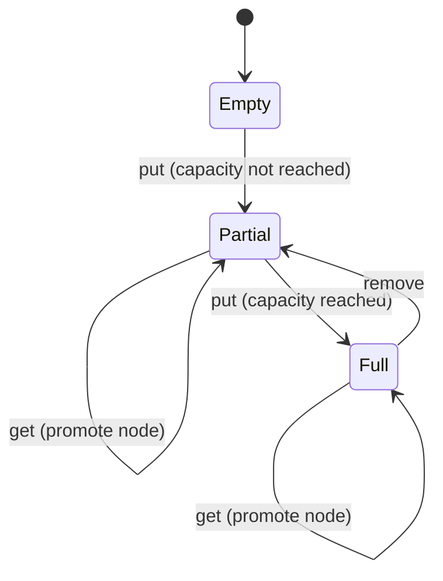

## WHY

Every system that reads more than it writes eventually needs a cache. And every
cache that has a memory bound needs an eviction policy. LRU — *Least Recently
Used* — is the policy that ships in Redis, Linux's page cache, CPU L1/L2, and
the JVM class-data-sharing file. If you can't build LRU in 30 minutes in an
interview, you have a gap that interviewers at Google, Meta, and Amazon will
find.

The deeper lesson is *data-structure composition*: LRU's magic is that it
combines a HashMap (O(1) lookup) with a Doubly-Linked List (O(1) eviction of
the tail and O(1) promotion of a hit to the head). Neither structure alone
suffices, but together they give you O(1) for every operation. That pattern —
composing structures to achieve better asymptotic bounds than either alone —
recurs in bloom filters, skip lists, and log-structured merge trees.

In production, cache misses under load kill services. The Instagram grid broke
for 40 minutes in 2019 when their Memcached cluster lost one shard and every
miss hit Postgres simultaneously — the textbook cache stampede. Building your
own LRU teaches you *exactly* why `maximumSize` + `expireAfterWrite` +
`refreshAfterWrite` in Caffeine exist, and when each knob matters.

## THEORY

### The O(1) insight

A naive LRU using only a `LinkedList` requires O(n) to remove an arbitrary
element. A naive one using only a `HashMap` can't track insertion order.
Combining them gives us both:

```
HashMap: key → Node   ← O(1) lookup
Doubly-Linked List:   ← O(1) move-to-front and remove-from-tail

    HEAD ↔ [A] ↔ [C] ↔ [B] ↔ TAIL
            MRU                LRU
```

On `get(key)`:
1. Look up the node in the HashMap — O(1).
2. Detach it from its current position — O(1) with prev/next pointers.
3. Attach it right after HEAD — O(1).

On `put(key, val)`:
1. If key exists: update value, promote to front — same as get.
2. If cache is full: evict TAIL.prev (the LRU node), remove from HashMap — O(1).
3. Insert new node at front, add to HashMap — O(1).

### State machine diagram



### Variants worth knowing

| Variant | What changes | Use case |
|---------|-------------|----------|
| LFU (Least-Frequently-Used) | evict by access count, not recency | read-heavy with stable hot set |
| ARC (Adaptive Replacement Cache) | ghost lists track evicted keys | ZFS, database buffer pools |
| W-TinyLFU | frequency sketch + LRU + LFU | Caffeine, Guava |
| 2Q | two queues: probationary + protected | PostgreSQL page cache |

### Thread safety

A single-threaded LRU needs no locks. A concurrent one has three options:

1. **Global lock (`synchronized`)** — simple, correct, bottleneck under contention.
2. **Striped lock (Caffeine approach)** — N independent caches behind a hash of the key, O(N) memory overhead.
3. **Lock-free (compare-and-swap)** — the approach in Linux's page cache; complex but scales linearly with cores.

## VISUALIZATION_CONFIG

```json
{ "component": "LinkedListVisualizer", "state": "lru-cache-doubly-linked" }
```

## CODE

### Level 1 — Beginner: LinkedHashMap one-liner

```java
// Java's LinkedHashMap with accessOrder=true IS an LRU cache.
// This is the correct interview answer for "implement in one line".
class LRUCache<K, V> extends LinkedHashMap<K, V> {
    private final int capacity;

    public LRUCache(int capacity) {
        // accessOrder=true: get() moves the entry to the tail (most-recent).
        super(capacity, 0.75f, true);
        this.capacity = capacity;
    }

    @Override
    protected boolean removeEldestEntry(Map.Entry<K, V> eldest) {
        return size() > capacity;   // evict when over capacity
    }

    public static void main(String[] args) {
        LRUCache<Integer, String> cache = new LRUCache<>(3);
        cache.put(1, "one");
        cache.put(2, "two");
        cache.put(3, "three");
        cache.get(1);              // promote key 1 → MRU
        cache.put(4, "four");      // evicts key 2 (now LRU)
        System.out.println(cache.containsKey(2)); // false — evicted
    }
}
```

### Level 2 — Intermediate: explicit doubly-linked list + HashMap

```java
class LRUCache {
    private final int capacity;
    private final Map<Integer, Node> map = new HashMap<>();

    // Sentinel head and tail — eliminates null-checks in link/unlink.
    private final Node head = new Node(0, 0);
    private final Node tail = new Node(0, 0);

    public LRUCache(int capacity) {
        this.capacity = capacity;
        head.next = tail;
        tail.prev = head;
    }

    public int get(int key) {
        Node node = map.get(key);
        if (node == null) return -1;
        moveToFront(node);   // O(1)
        return node.val;
    }

    public void put(int key, int val) {
        Node node = map.get(key);
        if (node != null) {
            node.val = val;
            moveToFront(node);
            return;
        }
        if (map.size() == capacity) {
            Node lru = tail.prev;   // node just before sentinel tail
            unlink(lru);
            map.remove(lru.key);
        }
        Node fresh = new Node(key, val);
        linkAfterHead(fresh);
        map.put(key, fresh);
    }

    private void unlink(Node n) {
        n.prev.next = n.next;
        n.next.prev = n.prev;
    }

    private void linkAfterHead(Node n) {
        n.next = head.next;
        n.prev = head;
        head.next.prev = n;
        head.next = n;
    }

    private void moveToFront(Node n) {
        unlink(n);
        linkAfterHead(n);
    }

    private static class Node {
        int key, val;
        Node prev, next;
        Node(int k, int v) { key = k; val = v; }
    }
}
```

### Level 3 — Advanced: generic, thread-safe, with metrics

```java
public class ConcurrentLRUCache<K, V> {
    private final int capacity;
    private final ReentrantReadWriteLock lock = new ReentrantReadWriteLock();
    private final Map<K, Node<K, V>> map;
    private final Node<K, V> head, tail;

    // Metrics
    private final LongAdder hits = new LongAdder();
    private final LongAdder misses = new LongAdder();
    private final LongAdder evictions = new LongAdder();

    @SuppressWarnings("unchecked")
    public ConcurrentLRUCache(int capacity) {
        this.capacity = capacity;
        map = new HashMap<>(capacity * 2);
        head = new Node<>(null, null);
        tail = new Node<>(null, null);
        head.next = tail;
        tail.prev = head;
    }

    public Optional<V> get(K key) {
        lock.writeLock().lock();     // write lock: we promote the node
        try {
            Node<K, V> node = map.get(key);
            if (node == null) { misses.increment(); return Optional.empty(); }
            moveToFront(node);
            hits.increment();
            return Optional.of(node.val);
        } finally { lock.writeLock().unlock(); }
    }

    public void put(K key, V val) {
        lock.writeLock().lock();
        try {
            Node<K, V> existing = map.get(key);
            if (existing != null) { existing.val = val; moveToFront(existing); return; }
            if (map.size() == capacity) {
                Node<K, V> lru = tail.prev;
                unlink(lru);
                map.remove(lru.key);
                evictions.increment();
            }
            Node<K, V> n = new Node<>(key, val);
            linkAfterHead(n);
            map.put(key, n);
        } finally { lock.writeLock().unlock(); }
    }

    public CacheStats stats() {
        return new CacheStats(hits.sum(), misses.sum(), evictions.sum());
    }

    // unlink / linkAfterHead / moveToFront — same as Level 2

    public record CacheStats(long hits, long misses, long evictions) {
        public double hitRate() {
            long total = hits + misses;
            return total == 0 ? 0.0 : (double) hits / total;
        }
    }

    private static class Node<K, V> {
        K key; V val;
        Node<K, V> prev, next;
        Node(K k, V v) { key = k; val = v; }
    }
}
```

### Level 4 — Expert: Caffeine integration + Spring cache abstraction

```java
/**
 * Production LRU/W-TinyLFU cache using Caffeine — the right answer in
 * real code. Use the hand-rolled version to win interviews;
 * use Caffeine in production.
 *
 * Key settings explained:
 *   maximumSize        — hard capacity bound, eviction uses W-TinyLFU
 *   expireAfterWrite   — TTL from insert: forces refresh after data goes stale
 *   expireAfterAccess  — TTL from last use: evicts cold entries faster
 *   refreshAfterWrite  — async refresh before expiry: avoids cold-miss spike
 *   recordStats()      — enables hit-rate / eviction Micrometer metrics
 */
@Configuration
class CacheConfig {
    @Bean
    public CaffeineCache userProfileCache() {
        return new CaffeineCache("userProfiles",
            Caffeine.newBuilder()
                .maximumSize(50_000)
                .expireAfterWrite(Duration.ofMinutes(10))
                .refreshAfterWrite(Duration.ofMinutes(8))
                .recordStats()
                .build(key -> loadProfileFromDb(key)));  // async loader
    }
}

// Spring @Cacheable transparently uses Caffeine under the hood:
@Service
class ProfileService {
    @Cacheable(value = "userProfiles", key = "#userId")
    public UserProfile getProfile(UUID userId) {
        return profileRepository.findById(userId).orElseThrow();
    }

    @CacheEvict(value = "userProfiles", key = "#profile.id")
    public void updateProfile(UserProfile profile) {
        profileRepository.save(profile);
    }
}

// Expose cache stats as Prometheus metrics:
@Component
class CacheMetricsExporter {
    @Autowired CaffeineCache cache;
    @Autowired MeterRegistry registry;

    @PostConstruct
    void bind() {
        CaffeineCacheMetrics.monitor(registry, cache.getNativeCache(), "userProfiles");
    }
}
```

## REAL_WORLD

**Redis** implements LRU via `maxmemory-policy allkeys-lru`. When memory hits
the `maxmemory` limit, Redis picks one of N random keys (default 5, tunable
via `maxmemory-samples`) and evicts the one accessed least recently. This is
*approximate LRU*, not exact — running the exact algorithm on 10 billion keys
would require a 64-bit timestamp per key (80 GB of overhead on a 10GB dataset).
The approximation is within 1–2% of exact for most workloads.

**Linux page cache** uses a two-list LRU (2Q): a small "inactive" list holds
new pages, a larger "active" list holds hot pages. Accessing a page once
doesn't promote it to the hot list — you need two accesses. This prevents a
single sequential `cat bigfile.txt` from evicting your entire working set.

**CPU caches** (L1/L2/L3) are fully-associative inside each set and use
a pseudo-LRU bit matrix per set. The hardware can't afford a true doubly-linked
list across 32,768 cache lines at nanosecond access times.

**Caffeine's W-TinyLFU** (used in Spring Boot's default cache) outperforms
LRU by 10–50% on real traces because it tracks frequency via a
Count-Min Sketch — a 4-bit counter per 4 hash buckets, totaling ≈8 KB for
1M entries — and uses that to decide *which* LRU evictee to actually remove.

## INTERVIEW

### Q1 (Junior): What is the time complexity of each operation in your LRU?

`get` and `put` are both O(1) — constant time regardless of cache size. The
HashMap gives O(1) lookup by key. The doubly-linked list gives O(1) unlink
and relink because we hold a direct pointer to the node (no traversal). The
only way to accidentally make it O(n) is to use `ArrayList` or `LinkedList`
instead of a custom node with pointers, because those structures need O(n) to
find and remove an arbitrary element.

### Q2 (Junior→Mid): Why do you need a doubly-linked list instead of singly-linked?

To unlink a node in O(1), you need both its `next` pointer (to patch the
forward link of its predecessor) and its `prev` pointer (to patch the backward
link of its successor). With only a `next` pointer, unlinking requires
traversing from the head to find the predecessor — O(n). The sentinel head and
tail nodes eliminate null-checks at both ends, which is why every real
implementation adds them even though they cost 2 extra nodes.

### Q3 (Mid): How does `LinkedHashMap(capacity, 0.75f, true)` implement LRU?

`accessOrder=true` makes every `get()` move the accessed entry to the *tail*
of the internal doubly-linked list — so the tail is the MRU end. Overriding
`removeEldestEntry` to return `size() > capacity` tells the map to evict the
*head* entry (LRU) whenever the map exceeds capacity. The HashMap backing
provides O(1) lookup; the linked structure provides O(1) order maintenance.
The only downside: it is not thread-safe. Use `Collections.synchronizedMap`
or replace with Caffeine for concurrent access.

### Q4 (Mid→Senior): When would you prefer LFU over LRU?

LFU wins when the working set is **stable** — the same hot keys stay hot for
the lifetime of the cache. LRU is susceptible to *cache pollution*: a single
sequential scan evicts your entire working set because every new key looks
MRU. LFU resists scans because a key accessed once has frequency 1, while
a key accessed 10K times keeps frequency 10K. Real systems (Caffeine, ARC)
combine both: LFU to protect hot items, LRU to handle recency when all
frequencies are equal.

### Q5 (Senior): How does Caffeine's W-TinyLFU improve on plain LRU?

W-TinyLFU uses a Count-Min Sketch (a probabilistic frequency counter in ≈8 KB)
to estimate how many times each key has been accessed. When eviction is
needed, it compares the incoming new key's frequency against the eviction
candidate from the LRU list; only if the new key has been seen more does it
replace the candidate. This makes it pollution-resistant (no scan evicts hot
items) *and* recency-aware (LRU still drives eviction order within the cold
set). The result: 10–50% higher hit rate than plain LRU on production access
traces. It ships as the default in Spring Boot's auto-configured cache.

### Q6 (Senior): How would you make this cache distributed across three nodes?

Three layers to address:

1. **Routing**: consistent hashing (or a virtual-node ring) maps each key
   deterministically to one primary node — no coordination on read/write path.
2. **Replication for hot keys**: the top-N keys (measured by hit rate) can
   be replicated to all nodes. Reads are entirely local; invalidations
   must fan out to all replicas (write amplification ×N, acceptable for
   hot-key minority).
3. **Eviction coordination**: each node runs independent LRU locally. Global
   eviction is emergent — the distributed system's effective capacity is the
   sum of all nodes' `maximumSize`. No distributed lock needed because
   eviction is best-effort.

Redis Cluster does exactly this with 16,384 hash slots distributed across
nodes.

## FEYNMAN CHECK

Explain an LRU cache to a 10-year-old: *Imagine you have a small desk with
room for 3 books. When you need a 4th book, you put the one you haven't
touched the longest back on the shelf. That's LRU — the desk is the cache,
the shelf is the database.*

### Q1: Why are both a HashMap and a linked list necessary?

HashMap alone: O(1) find, but no ordering — you can't tell which entry is
oldest. Linked list alone: O(1) evict tail, but O(n) find by key — you'd
have to scan the whole list. Together: HashMap finds the node in O(1), the
list removes and reorders it in O(1). You need both because the two
operations have incompatible requirements.

### Q2: What happens without sentinel head/tail nodes?

You need null-checks on every link and unlink: "if `prev == null` then update
`head`, else update `prev.next`". Sentinels make `head.next` always valid and
`tail.prev` always valid, so unlink is always the same three pointer swaps
regardless of position. Without them, every edge-case (evicting the head, the
tail, the only node) is a separate code branch. Bugs hide in branches.

### Q3: Why does `ConcurrentHashMap` + separate linked list require a write lock for `get`?

Because `get` must atomically read the value *and* move the node to the front.
If two threads call `get(k)` at the same instant, both see the same node and
try to relink it. Without a lock, you can corrupt the list's `prev`/`next`
pointers — classic double-free scenario. A ReadWriteLock with a *write* lock
on `get` seems wrong but is correct: "read" in LRU mutates structure.

### Q4: When does the hit rate drop even though capacity is not exceeded?

When the access pattern shifts (a new set of hot keys arrives). Old hot keys
are still in the cache but are now cold; new hot keys aren't in the cache yet.
During the transition window, hit rate plummets until the cache's MRU end
fills with the new hot set. This is the *cold-start* problem for caches after
a deploy that changes the usage pattern.

### Q5: What does `expireAfterWrite` protect against that `maximumSize` does not?

Stale data. `maximumSize` only evicts when the cache is *full*. If you have a
cache of size 100K and the database changes a key that's in the cache, that
stale value stays indefinitely — until the key is evicted by a new insertion.
`expireAfterWrite(10, MINUTES)` forces a refresh after 10 minutes regardless
of whether capacity was exceeded. You need both: `maximumSize` to bound memory,
`expireAfterWrite` to bound staleness.

## BUILD

**Mini-project (3–4 hours):** A `ConcurrentLRUCache<K, V>` with hit-rate
metrics, used as a Spring Boot `@Bean`.

### Implement — checklist

- [ ] `get(key)` returns `Optional.empty()` on miss, moves hit to front
- [ ] `put(key, val)` evicts LRU tail when at capacity
- [ ] All operations O(1)
- [ ] Thread-safe under 100 concurrent threads (write lock on get + put)
- [ ] `stats()` returns hit count, miss count, eviction count, hit rate
- [ ] JUnit test: capacity-1 cache evicts LRU on second put
- [ ] JUnit test: get on evicted key returns empty
- [ ] JUnit test: concurrent 100-thread stress test — no `ConcurrentModificationException`

### Test

```java
@Test void lruEviction() {
    var cache = new ConcurrentLRUCache<Integer, String>(2);
    cache.put(1, "a");
    cache.put(2, "b");
    cache.get(1);          // promote 1 → MRU; 2 is now LRU
    cache.put(3, "c");     // evicts 2
    assertEquals(Optional.empty(), cache.get(2));
    assertEquals(Optional.of("a"), cache.get(1));
    assertEquals(Optional.of("c"), cache.get(3));
}
```

### Stretch goals

1. Add `expireAfterWrite(Duration)` — store the write timestamp in the node
   and skip returning the value if expired.
2. Replace the global write lock with a striped lock (8 stripes, hash by key).
3. Compare your implementation's hit rate vs Caffeine on 1M random accesses
   with Zipf distribution (80% of hits on top 20% of keys).

## SPACED REVIEW

Day 1
1. Name the two data structures combined in an LRU cache.
2. What is the time complexity of `get` and `put`?
3. What role do sentinel head/tail nodes play?

Day 3
4. Why does `get()` require a write lock in a concurrent LRU?
5. What is the difference between `expireAfterWrite` and `expireAfterAccess`?
6. How does `LinkedHashMap(capacity, 0.75f, true)` implement LRU?

Day 7
7. When does LFU outperform LRU? Give a concrete example.
8. Describe the W-TinyLFU algorithm in two sentences.
9. What is a cache stampede and how does request coalescing prevent it?

Day 14
10. How would you distribute this cache across 3 nodes without a distributed
    lock on the eviction path?
11. Why does Redis use approximate LRU instead of exact LRU?
12. Design the metrics you would alert on for a production cache — name
    the three most important and explain the threshold for each.

