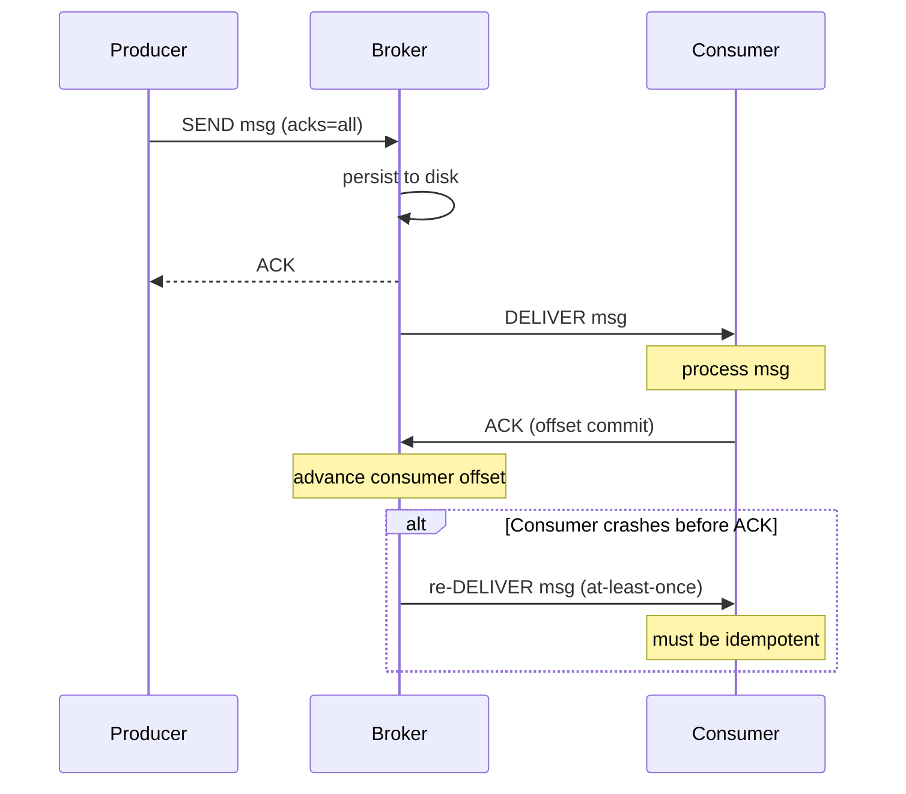

## WHY

Kafka, RabbitMQ, and AWS SQS are not magic. They are persistent queues with
durability guarantees, consumer groups, and acknowledgement protocols. Building
a mini broker from scratch teaches you every concept that trips up engineers in
production: what "at-least-once" means in practice, why you need idempotency keys,
what a consumer group is and how offset tracking works, and why Kafka uses a
log (append-only file) instead of a queue (remove on consume).

This is the project that makes distributed system design interviews click.

## THEORY

### Queue vs Topic (Log)

```
Queue (RabbitMQ style):              Topic / Log (Kafka style):
┌────────────────────────┐           ┌────────────────────────────────┐
│  Message A  B  C  D   │           │  Offset: 0   1   2   3   4    │
│  Consumer 1 takes A    │           │  Messages: A   B   C   D   E  │
│  Consumer 2 takes B    │           │                                │
│  Message removed on ACK│           │  Consumer Group 1:  offset=3  │
└────────────────────────┘           │  Consumer Group 2:  offset=1  │
                                     │  Messages NEVER deleted (TTL)  │
                                     └────────────────────────────────┘
```

A queue is for work distribution: each message is consumed by exactly one
consumer, then deleted. A log is for event broadcast: every consumer group
maintains its own offset; multiple groups can read the same messages
independently. Kafka is a log; RabbitMQ is (primarily) a queue.

### Delivery semantics



### Persistence: write-ahead log

```
messages.log  (append-only, sequential writes = max disk throughput)
offset: 0     1     2     3     4
        [A]   [B]   [C]   [D]   [E]

index.log (sparse: offset → byte position in messages.log)
0:0   1:48   2:96   3:144   4:192
```

Sequential writes to a single file can achieve 500 MB/s on commodity hardware.
Random writes (like a B-Tree) top out at ~10K IOPS × 4KB = 40 MB/s.
Kafka's throughput secret: **sequential appends + OS page cache**.

## VISUALIZATION_CONFIG

```json
{ "component": "MessageBrokerVisualizer", "state": "mini-broker-log-offset" }
```

## CODE

### Level 1 — Beginner: in-memory blocking queue broker

```java
public class MiniBroker {
    private final Map<String, BlockingQueue<Message>> topics = new ConcurrentHashMap<>();
    private final Map<String, Long> offsets = new ConcurrentHashMap<>();

    public void createTopic(String name) {
        topics.put(name, new LinkedBlockingQueue<>(10_000));
    }

    public void publish(String topic, String payload) {
        Message msg = new Message(System.currentTimeMillis(), payload);
        if (!topics.get(topic).offer(msg))
            throw new RuntimeException("Topic " + topic + " is full");
    }

    public Message consume(String topic, String consumerGroup) {
        return topics.get(topic).poll();   // removes on consume (queue semantics)
    }

    public record Message(long ts, String payload) {}
}
```

### Level 2 — Intermediate: log-based broker with offset tracking

```java
public class LogBroker {
    private final Map<String, List<Message>> logs = new ConcurrentHashMap<>();
    private final Map<String, Map<String, Long>> groupOffsets = new ConcurrentHashMap<>();

    public void publish(String topic, String payload) {
        logs.computeIfAbsent(topic, k -> Collections.synchronizedList(new ArrayList<>()))
            .add(new Message(UUID.randomUUID().toString(),
                             System.currentTimeMillis(), payload));
    }

    public List<Message> poll(String topic, String group, int maxMessages) {
        List<Message> log = logs.getOrDefault(topic, List.of());
        long offset = groupOffsets
                .computeIfAbsent(group, g -> new ConcurrentHashMap<>())
                .getOrDefault(topic, 0L);

        List<Message> batch = log.stream()
                .skip(offset)
                .limit(maxMessages)
                .toList();
        return batch;
    }

    public void commit(String topic, String group, long newOffset) {
        groupOffsets.computeIfAbsent(group, g -> new ConcurrentHashMap<>())
                    .put(topic, newOffset);
    }

    public record Message(String id, long ts, String payload) {}
}
```

### Level 3 — Advanced: file-backed persistence + exactly-once via idempotency

```java
public class PersistentTopic implements Closeable {
    private final Path logFile;
    private final Path indexFile;
    private final FileChannel channel;
    private final ObjectMapper mapper = new ObjectMapper();

    private long nextOffset = 0;

    public PersistentTopic(Path dir, String name) throws IOException {
        Files.createDirectories(dir);
        logFile   = dir.resolve(name + ".log");
        indexFile = dir.resolve(name + ".idx");
        channel   = FileChannel.open(logFile,
                StandardOpenOption.CREATE, StandardOpenOption.APPEND,
                StandardOpenOption.READ);
        // Recover next offset from existing log
        nextOffset = recoverOffset();
    }

    public synchronized long append(String payload) throws IOException {
        byte[] data = (mapper.writeValueAsString(
                Map.of("offset", nextOffset, "ts", Instant.now(), "payload", payload)) + "\n")
                .getBytes(StandardCharsets.UTF_8);
        channel.write(ByteBuffer.wrap(data));
        channel.force(false);              // fsync — durable
        return nextOffset++;
    }

    public List<LogEntry> read(long fromOffset, int limit) throws IOException {
        List<LogEntry> result = new ArrayList<>();
        try (BufferedReader reader = Files.newBufferedReader(logFile)) {
            String line; long off = 0;
            while ((line = reader.readLine()) != null && result.size() < limit) {
                if (off >= fromOffset) {
                    result.add(mapper.readValue(line, LogEntry.class));
                }
                off++;
            }
        }
        return result;
    }

    // Idempotency: producer sends a unique key; broker deduplicates
    private final Set<String> seenKeys = Collections.synchronizedSet(
            Collections.newSetFromMap(new LinkedHashMap<>() {
                protected boolean removeEldestEntry(Map.Entry<String, Boolean> e) {
                    return size() > 100_000;  // bounded dedup window
                }
            }));

    public long appendIdempotent(String idempotencyKey, String payload) throws IOException {
        if (seenKeys.contains(idempotencyKey)) return -1;  // duplicate, skip
        long offset = append(payload);
        seenKeys.add(idempotencyKey);
        return offset;
    }

    public record LogEntry(long offset, String ts, String payload) {}
    private long recoverOffset() throws IOException { /* count lines */ return 0; }
    public void close() throws IOException { channel.close(); }
}
```

### Level 4 — Expert: consumer group rebalancing

```java
/**
 * Consumer groups: multiple consumers share a topic's partitions.
 * When a consumer joins or leaves, the group rebalances.
 *
 * This is the core of Kafka's consumer group protocol, simplified.
 */
public class ConsumerGroupCoordinator {
    private final Map<String, List<String>> groupMembers = new ConcurrentHashMap<>();
    private final Map<String, Map<String, List<Integer>>> assignments = new ConcurrentHashMap<>();
    private final int partitionCount;

    public ConsumerGroupCoordinator(int partitionCount) {
        this.partitionCount = partitionCount;
    }

    public synchronized void join(String group, String consumerId) {
        groupMembers.computeIfAbsent(group, g -> new ArrayList<>()).add(consumerId);
        rebalance(group);
    }

    public synchronized void leave(String group, String consumerId) {
        List<String> members = groupMembers.getOrDefault(group, new ArrayList<>());
        members.remove(consumerId);
        rebalance(group);
    }

    private void rebalance(String group) {
        List<String> members = groupMembers.getOrDefault(group, List.of());
        if (members.isEmpty()) { assignments.remove(group); return; }

        // Round-robin partition assignment
        Map<String, List<Integer>> assign = new HashMap<>();
        members.forEach(m -> assign.put(m, new ArrayList<>()));
        for (int p = 0; p < partitionCount; p++) {
            assign.get(members.get(p % members.size())).add(p);
        }
        assignments.put(group, assign);
        log.info("Group {} rebalanced: {}", group, assign);
    }

    public List<Integer> assignedPartitions(String group, String consumerId) {
        return assignments.getOrDefault(group, Map.of())
                          .getOrDefault(consumerId, List.of());
    }
}
```

## REAL_WORLD

**Kafka's durability secret**: messages are written to the OS page cache via
a `FileChannel`. The OS flushes to disk asynchronously, and `fsync` is called
on a configurable schedule. Consumers read from the page cache (memory) most
of the time — disk is only accessed for old messages. This is why Kafka is
fast for both producers and consumers without a separate cache layer.

**RabbitMQ** uses AMQP and a different mental model: exchanges route messages
to queues via binding keys. Messages are transient by default (lost on restart)
unless declared `durable`. Acknowledgements are per-message; unacked messages
are re-delivered on consumer reconnect. RabbitMQ shines for complex routing
(dead-letter queues, delayed messages, fanout exchanges) where Kafka's simple
topic-partition model is a worse fit.

**AWS SQS** is the serverless queue: no consumer groups, no offset tracking,
no replay. Each message has a visibility timeout: after a consumer picks it up,
it's invisible to others for N seconds. If not deleted within N seconds (crash),
it reappears. At-least-once delivery. For exactly-once, add a DynamoDB
idempotency table keyed by `MessageId`.

## INTERVIEW

### Q1 (Junior): What is the difference between a message queue and a pub/sub topic?

Queue: point-to-point, message consumed by one consumer, deleted after ACK.
Used for task distribution (email sending, image processing jobs).

Pub/sub topic: broadcast, every subscriber gets a copy, message retained.
Used for event broadcast (a user signed up → notify billing AND analytics AND
marketing, all independently, all independently replay-able).

Kafka is pub/sub. SQS is a queue. RabbitMQ supports both via exchange types.

### Q2 (Mid): What is at-least-once delivery and what does it require of consumers?

At-least-once: the broker guarantees every message is delivered at least once.
It may be delivered more than once (network timeout after delivery, before ACK).
Consumers must be **idempotent** — processing the same message twice produces
the same result as processing it once. Common pattern: include a unique message
ID in every event; consumer checks a `processed_events` table before acting.

### Q3 (Mid→Senior): Why does Kafka use sequential disk writes, and what throughput does that enable?

A disk seek takes ~1–5ms for a spinning drive (8ms average). A sequential
write to a file already open incurs no seek — the OS writes to the current
end of the file. On an NVMe SSD, sequential writes reach 3–5 GB/s vs ~500K
random IOPS × 4KB = 2 GB/s. Kafka's append-only log maximises sequential
writes. The OS page cache serves reads from memory. This is how Kafka achieves
100s of MB/s throughput on commodity hardware with no special caching layer.

### Q4 (Senior): What happens during a Kafka consumer group rebalance?

Rebalance is triggered when: a consumer joins or leaves the group, a topic's
partition count changes, or a heartbeat timeout fires (consumer assumed dead).
During rebalance:
1. The group coordinator (a Kafka broker) revokes all partition assignments.
2. All consumers in the group stop consuming ("stop-the-world" in classic
   protocol; "cooperative incremental" rebalance in newer Kafka avoids stopping
   non-affected consumers).
3. The coordinator assigns partitions to consumers (round-robin or sticky).
4. Consumers resume from their committed offsets.

Rebalance duration is typically 100ms–10s depending on group size. This is why
Kafka consumers should commit offsets frequently — a rebalance after a 10K-message
batch means all 10K messages are re-delivered.

### Q5 (Senior): How would you implement exactly-once delivery end-to-end?

Three layers required:
1. **Producer**: idempotent producer (Kafka: `enable.idempotence=true`) +
   transactions (`producer.beginTransaction()`). Each message gets a sequence
   number; the broker deduplicates retries.
2. **Broker**: transactional topics store uncommitted messages but don't
   deliver them until committed.
3. **Consumer**: consumer reads in `read_committed` isolation; processes
   the message *and* commits the Kafka offset within a single DB transaction
   (write result to DB + update offset table atomically). If the consumer
   crashes, it re-reads from the last committed offset — but since the DB
   write is also rolled back, processing the same message again is safe.

This is called the "transactional outbox" pattern: DB transaction commits
both the business result and the consumed offset atomically.

## FEYNMAN CHECK

A message broker is like a post office. Producers are senders, consumers are
recipients. The post office holds letters until recipients pick them up. A
queue is a mailbox: one letter goes to one recipient. A topic is a bulletin
board: the same notice is seen by everyone who checks the board.

### Q1: Why does committing an offset before processing a message cause data loss?

If you commit offset N+1 (mark message N as "done") before processing it, and
then your process crashes, the broker considers N processed and won't re-deliver
it. Processing N happens in memory; the crash deletes that work. Commit after
successful processing ensures re-delivery on crash — at the cost of possible
duplicate processing (at-least-once).

### Q2: What is a consumer group and why does it enable parallel processing?

A consumer group is a set of consumers that collectively read a topic. Each
partition is assigned to exactly one consumer in the group at a time. With 4
partitions and 4 consumers, each consumer reads one partition — 4× parallelism
vs one consumer reading all 4 partitions. If a consumer fails, its partitions
are reassigned to others. More consumers than partitions means some consumers
are idle — partitions are the unit of parallelism.

### Q3: What is a dead-letter queue (DLQ)?

A DLQ is a separate queue where messages go when they fail processing after N
retries. Without a DLQ, a poison message (one that always fails processing) would
be retried indefinitely, blocking all subsequent messages. The DLQ quarantines
it: an operator can inspect, fix the bug, and re-process it. RabbitMQ's
dead-letter exchange and SQS's redrive policy implement this pattern.

### Q4: Why does a partitioned topic limit ordering guarantees?

Kafka guarantees message order *within a partition*. If a topic has 3 partitions
and you publish messages A, B, C, D — they may land in different partitions.
Consumer 1 sees A, C; consumer 2 sees B, D. The global order A→B→C→D is lost.
Solution: use a partition key so related messages (same user ID, same order ID)
always land in the same partition, preserving order for that key.

### Q5: Why is a blocking queue not a good broker for multiple consumers?

A `BlockingQueue` holds messages; `poll()` removes and returns the head.
With multiple consumers, each message goes to exactly one consumer (queue
semantics). If you want multiple consumers to each receive all messages (pub/sub),
you need a separate copy per consumer group — or a log where each group tracks
its own offset. A log never removes messages; it's the offset that moves forward.

## BUILD

**Mini-project (4–5 hours):** A persistent log-based topic broker with
consumer group offset tracking.

### Implement — checklist

- [ ] `PersistentTopic.append(payload)` writes to append-only file with `fsync`
- [ ] `PersistentTopic.read(fromOffset, limit)` returns messages from offset
- [ ] `ConsumerGroupCoordinator` assigns partitions on join/leave
- [ ] `appendIdempotent(key, payload)` deduplicates within a 100K key window
- [ ] `ConsumerGroupCoordinator.rebalance` distributes partitions round-robin
- [ ] Test: append 100 messages, read from offset 50 — returns 50 messages
- [ ] Test: consumer joins group, leaves, joins again — always gets messages

### Stretch goals

1. Add a REST API: `POST /topics/:name/messages`, `GET /topics/:name/messages?group=&offset=`.
2. Implement a configurable retention policy: delete messages older than N hours.
3. Benchmark: measure throughput (messages/sec) for sequential writes vs random writes to a HashMap.

## SPACED REVIEW

Day 1
1. What is the difference between a queue and a log (topic)?
2. What is a consumer group?
3. What is at-least-once delivery?

Day 3
4. Why does Kafka use sequential disk writes?
5. What happens during a consumer group rebalance?
6. What is a dead-letter queue?

Day 7
7. Why must consumers be idempotent for at-least-once delivery?
8. What is a partition key and when do you need it?
9. Why does committing offset before processing cause data loss?

Day 14
10. Describe the three layers needed for exactly-once delivery end-to-end.
11. Compare Kafka vs RabbitMQ for complex routing use cases.
12. How does the OS page cache contribute to Kafka's throughput?

