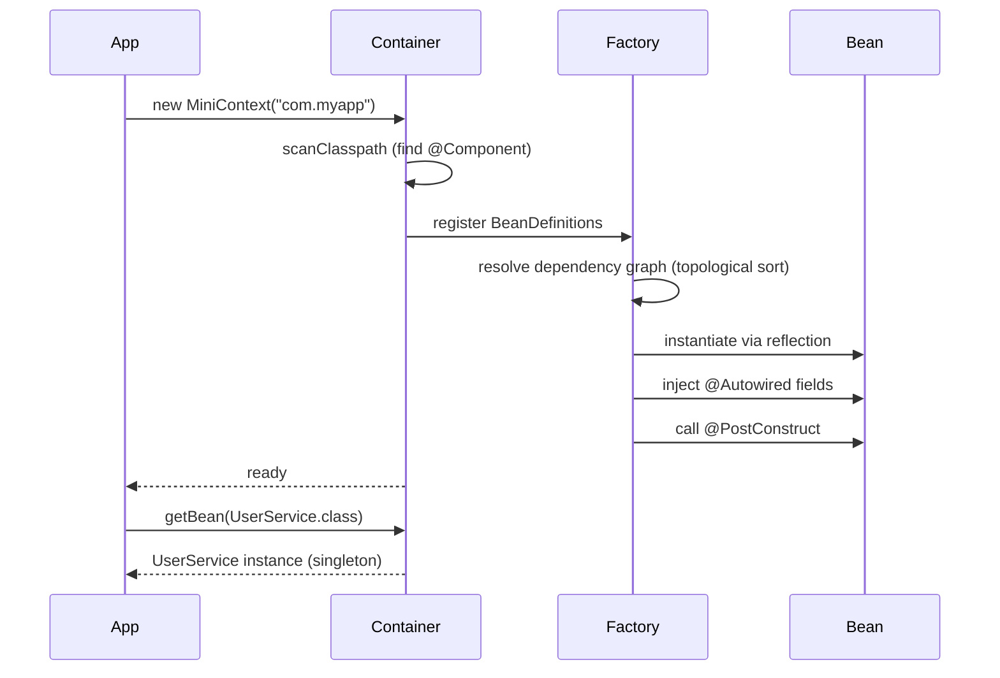

## WHY

Spring is the framework you use every day without understanding. "It just works"
until it doesn't — and when it doesn't, you're staring at a circular dependency,
a proxy that breaks `@Transactional`, or a `BeanCreationException` with a 50-line
stack trace. Building a miniature Spring from scratch demystifies all of it.

This project teaches you: reflection-based component scanning, dependency injection
graphs (and how to detect cycles), scope (singleton vs prototype), post-processors,
and how AOP proxies work. After this, Spring's internals are no longer magic.

## THEORY

### The IoC container lifecycle



### Dependency graph and cycle detection

Each bean is a node; each `@Autowired` field creates a directed edge. The
container must topologically sort the graph to instantiate beans in dependency
order. A cycle (`A → B → A`) has no valid topological order → throw a
`CircularDependencyException`.

Detection: DFS with three states per node:
- WHITE (unvisited): not yet processed
- GRAY (in-stack): currently being resolved
- BLACK (done): fully resolved

If DFS reaches a GRAY node, a cycle exists.

## VISUALIZATION_CONFIG

```json
{ "component": "DependencyGraphVisualizer", "state": "ioc-bean-graph" }
```

## CODE

### Level 1 — Beginner: manual wiring (no reflection)

```java
// The simplest IoC: a map from type to instance, manually populated.
// This is what frameworks do automatically; understand it manually first.
class SimpleContainer {
    private final Map<Class<?>, Object> beans = new HashMap<>();

    public <T> void register(Class<T> type, T instance) {
        beans.put(type, instance);
    }

    @SuppressWarnings("unchecked")
    public <T> T get(Class<T> type) {
        T bean = (T) beans.get(type);
        if (bean == null) throw new RuntimeException("No bean: " + type.getName());
        return bean;
    }

    // Usage:
    public static void main(String[] args) {
        SimpleContainer c = new SimpleContainer();
        UserRepository repo = new UserRepositoryImpl();
        c.register(UserRepository.class, repo);
        c.register(UserService.class, new UserServiceImpl(repo));

        UserService svc = c.get(UserService.class);
        svc.createUser("alice@example.com");
    }
}
```

### Level 2 — Intermediate: reflection-based wiring with `@Autowired`

```java
@Retention(RetentionPolicy.RUNTIME) @Target(ElementType.TYPE)
public @interface Component {}

@Retention(RetentionPolicy.RUNTIME) @Target(ElementType.FIELD)
public @interface Autowired {}

public class MiniContainer {
    private final Map<Class<?>, Object> singletons = new HashMap<>();

    public void register(Class<?>... classes) throws Exception {
        // Phase 1: instantiate all classes (no-arg constructor)
        for (Class<?> cls : classes) {
            singletons.put(cls, cls.getDeclaredConstructor().newInstance());
        }
        // Phase 2: inject @Autowired fields
        for (Object bean : singletons.values()) {
            for (Field field : bean.getClass().getDeclaredFields()) {
                if (field.isAnnotationPresent(Autowired.class)) {
                    Object dep = singletons.get(field.getType());
                    if (dep == null) throw new RuntimeException(
                            "No bean for " + field.getType().getName() +
                            " required by " + bean.getClass().getName());
                    field.setAccessible(true);
                    field.set(bean, dep);
                }
            }
        }
        // Phase 3: call @PostConstruct
        for (Object bean : singletons.values()) {
            for (Method m : bean.getClass().getDeclaredMethods()) {
                if (m.isAnnotationPresent(PostConstruct.class)) {
                    m.invoke(bean);
                }
            }
        }
    }

    @SuppressWarnings("unchecked")
    public <T> T get(Class<T> type) {
        return (T) singletons.get(type);
    }
}
```

### Level 3 — Advanced: classpath scanning + cycle detection

```java
public class MiniApplicationContext {
    private final Map<Class<?>, Object> singletons = new HashMap<>();
    private final Map<Class<?>, BeanDefinition> definitions = new HashMap<>();

    public MiniApplicationContext(String basePackage) throws Exception {
        scan(basePackage);
        buildGraph();
        instantiateAll();
    }

    private void scan(String pkg) throws IOException, ClassNotFoundException {
        String path = pkg.replace('.', '/');
        URL url = getClass().getClassLoader().getResource(path);
        File dir = new File(url.getFile());
        for (File file : Objects.requireNonNull(dir.listFiles())) {
            if (!file.getName().endsWith(".class")) continue;
            String className = pkg + "." + file.getName().replace(".class", "");
            Class<?> cls = Class.forName(className);
            if (cls.isAnnotationPresent(Component.class)) {
                definitions.put(cls, new BeanDefinition(cls));
            }
        }
    }

    private void buildGraph() {
        for (BeanDefinition def : definitions.values()) {
            for (Field f : def.type.getDeclaredFields()) {
                if (f.isAnnotationPresent(Autowired.class)) {
                    BeanDefinition dep = definitions.get(f.getType());
                    if (dep == null) throw new RuntimeException("Unsatisfied: " + f.getType());
                    def.dependencies.add(dep);
                }
            }
        }
    }

    private void instantiateAll() throws Exception {
        Set<Class<?>> visited = new HashSet<>();
        Set<Class<?>> inStack  = new HashSet<>();
        for (BeanDefinition def : definitions.values()) {
            instantiate(def, visited, inStack);
        }
    }

    private Object instantiate(BeanDefinition def,
                                Set<Class<?>> visited,
                                Set<Class<?>> inStack) throws Exception {
        if (singletons.containsKey(def.type)) return singletons.get(def.type);
        if (inStack.contains(def.type))
            throw new CircularDependencyException(def.type.getName());
        inStack.add(def.type);

        Object instance = def.type.getDeclaredConstructor().newInstance();
        for (Field f : def.type.getDeclaredFields()) {
            if (!f.isAnnotationPresent(Autowired.class)) continue;
            BeanDefinition depDef = definitions.get(f.getType());
            Object dep = instantiate(depDef, visited, inStack);
            f.setAccessible(true);
            f.set(instance, dep);
        }
        // @PostConstruct
        for (Method m : def.type.getDeclaredMethods()) {
            if (m.isAnnotationPresent(PostConstruct.class)) m.invoke(instance);
        }
        inStack.remove(def.type);
        visited.add(def.type);
        singletons.put(def.type, instance);
        return instance;
    }

    @SuppressWarnings("unchecked")
    public <T> T getBean(Class<T> type) {
        T bean = (T) singletons.get(type);
        if (bean == null) throw new NoSuchBeanException(type.getName());
        return bean;
    }

    record BeanDefinition(Class<?> type, List<BeanDefinition> dependencies) {
        BeanDefinition(Class<?> type) { this(type, new ArrayList<>()); }
    }
}
```

### Level 4 — Expert: AOP proxy for `@Transactional` simulation

```java
/**
 * Mini-AOP: wrap beans annotated with @Transactional in a JDK dynamic proxy
 * that begins/commits/rollbacks a transaction around the method.
 *
 * This is exactly what Spring does with @Transactional.
 */
public class TransactionalProxyFactory {

    @SuppressWarnings("unchecked")
    public static <T> T wrap(T target, TransactionManager tm) {
        return (T) Proxy.newProxyInstance(
                target.getClass().getClassLoader(),
                target.getClass().getInterfaces(),
                (proxy, method, args) -> {
                    // Only wrap methods or classes annotated with @Transactional
                    boolean txMethod = method.isAnnotationPresent(Transactional.class) ||
                            target.getClass().isAnnotationPresent(Transactional.class);
                    if (!txMethod) return method.invoke(target, args);

                    tm.begin();
                    try {
                        Object result = method.invoke(target, args);
                        tm.commit();
                        return result;
                    } catch (InvocationTargetException e) {
                        tm.rollback();
                        throw e.getCause();  // unwrap reflection wrapper
                    }
                });
    }
}

// MiniContainer applies this in its post-processing phase:
for (Class<?> type : definitions.keySet()) {
    if (type.isAnnotationPresent(Transactional.class) && type.getInterfaces().length > 0) {
        Object raw   = singletons.get(type);
        Object proxy = TransactionalProxyFactory.wrap(raw, transactionManager);
        singletons.put(type, proxy);  // replace with proxy
    }
}
```

## REAL_WORLD

**Spring Framework's `ClassPathScanningCandidateComponentProvider`** does
exactly what Level 3 does but handles JAR files, ASM bytecode reading
(no class loading for scanning), and candidate filtering. The full classpath
scan of a large Spring Boot app reads ~10MB of `.class` files at startup,
which is why Spring Boot's component-scan is bounded to the application's
base package.

**`BeanPostProcessor`** is Spring's extension point for the proxy-wrapping step
in Level 4. `AutowiredAnnotationBeanPostProcessor`, `AsyncAnnotationBeanPostProcessor`,
and `TransactionInterceptor` are all `BeanPostProcessor` implementations that
wrap beans in proxies.

**Guice** (Google's alternative to Spring) uses a `Module`-based approach where
bindings are explicit rather than annotation-scanned. No reflection-based field
injection by default — constructor injection only, which makes cycles detectable
at compile time (Dagger, Guice's compile-time sibling).

## INTERVIEW

### Q1 (Junior): What is dependency injection and why does it improve testability?

DI means: don't instantiate your dependencies inside the class — receive them
as constructor or field arguments. Without DI: `new UserService()` calls
`new UserRepositoryImpl()` internally. In a test, you can't substitute a
mock repository. With DI: `new UserService(mockRepo)`. Testing is just calling
the constructor with a mock. Spring automates the wiring in production code.

### Q2 (Mid): Why does Spring default to singleton scope for beans?

Most service and repository beans are stateless — every user can share the
same instance. Creating a new `UserService` for every request would add
allocation and GC pressure for no benefit. Singleton means one instance per
Spring context; it's created once, injected everywhere, and collected when
the context closes. Stateful beans (like session state) use prototype or
request scope.

### Q3 (Mid→Senior): Why does `@Transactional` not work when called from within the same class?

Because Spring's `@Transactional` works by wrapping the bean in a JDK proxy
(or CGLIB subclass). When external code calls `service.save()`, the call goes
through the proxy, which starts a transaction, then delegates to the real
object. When the *real object* calls `this.save()` internally, it bypasses the
proxy — self-invocation goes directly to the concrete class, skipping the proxy
and any transaction logic. Fix: inject the service into itself
(`@Autowired UserService self`) and call `self.save()`, or restructure into
two separate beans.

### Q4 (Senior): What is the difference between JDK dynamic proxy and CGLIB proxy?

**JDK dynamic proxy**: requires the bean to implement an interface. Creates a
new class at runtime that implements the interface; each method delegates to
an `InvocationHandler`. Cannot proxy concrete classes.

**CGLIB**: generates a subclass of the bean class at runtime. Can proxy
concrete classes. Does not require an interface. Cannot proxy `final` classes
or `final` methods (can't subclass them).

Spring Boot prefers CGLIB for `@Transactional` and `@Cacheable` since Spring 4
because most beans don't implement interfaces. The proxy target class is
set via `proxyTargetClass=true`.

### Q5 (Senior): How does Spring resolve a circular dependency, and when does it fail?

Spring resolves circular dependencies among **singleton beans** using a
three-level cache (early bean reference). When bean A is being created and
needs B, which needs A: A is added to the "singletons in creation" set and
its partially-constructed instance is cached. B finds A in the early cache
and uses it. Spring then finishes creating A. This works because both beans
end up with the same instance.

This *fails* for **constructor injection** (A's constructor needs B before A
exists, so no early reference is possible) and for **prototype-scoped** beans
(a new instance every time — no shared reference to cache). `@Lazy` on one
dependency breaks the cycle by deferring the proxy's actual initialization.

## FEYNMAN CHECK

An IoC container is like a restaurant kitchen manager: you tell them "I need
a chef and a sous-chef". The manager figures out which chef needs which tools,
hires everyone in the right order, and hands them to you ready to cook. You
never worry about *who* trained under *whom* — the manager handles the graph.

### Q1: What is the difference between inversion of control and dependency injection?

IoC is the principle: "don't call us, we'll call you" — your code doesn't
control its own dependencies; something else (the framework) does. DI is one
implementation of IoC: the container injects (provides) dependencies rather
than the class creating them. There are other IoC patterns (service locator,
event-driven) but DI is by far the most common.

### Q2: Why is constructor injection preferred over field injection?

With field injection, the class can be instantiated without its dependencies
(using `new MyService()`) — the fields are just null. This makes it easy to
forget to set up dependencies in tests. With constructor injection, the class
*cannot be instantiated* without providing all dependencies — the compiler
enforces them. Constructor injection also makes circular dependencies fail at
compile time (with Dagger) or at startup (not at runtime).

### Q3: Why does classpath scanning cause slow startup in large Spring Boot apps?

Scanning reads `.class` files from the filesystem (or JAR) and checks for
annotations. On a large classpath (hundreds of JARs, thousands of classes),
this reads tens of megabytes of bytecode at startup. Mitigation: bound
`@ComponentScan` to your application's base package, use Spring Boot's
auto-configuration (which uses `spring.factories` meta-index), or use GraalVM
native-image (scans at build time, not runtime).

### Q4: What problem does `@Lazy` solve?

`@Lazy` defers a bean's instantiation until first use (instead of at context
startup). It solves two problems: (1) circular dependencies in constructor-
injected singletons — one side of the cycle can be `@Lazy`, breaking the
bootstrap deadlock; (2) expensive beans that are rarely used (a PDF renderer,
an S3 client in a test environment) don't consume startup time.

### Q5: What is a `BeanPostProcessor` used for?

It's a callback that Spring calls immediately after a bean is instantiated.
Before returning the bean to the caller, Spring passes it through every
registered `BeanPostProcessor`. AOP proxying, `@Transactional` wrapping,
`@Async` wrapping, `@Cacheable` wrapping — all are implemented as
`BeanPostProcessor`s that replace the original bean with a proxy. You can
register your own to add cross-cutting behavior without modifying beans.

## BUILD

**Mini-project (4–5 hours):** A `MiniApplicationContext` that supports
`@Component`, `@Autowired`, `@PostConstruct`, cycle detection, and `@Transactional`
proxy.

### Implement — checklist

- [ ] `@Component` scanning of a given package by classpath reflection
- [ ] `@Autowired` field injection with dependency graph resolution
- [ ] DFS-based cycle detection — throws `CircularDependencyException`
- [ ] `@PostConstruct` callback invocation after wiring
- [ ] `getBean(Class<T>)` returns singleton
- [ ] JDK dynamic proxy for `@Transactional` on interface-backed beans
- [ ] Test: circular A→B→A throws `CircularDependencyException`
- [ ] Test: `@PostConstruct` method called exactly once per singleton

### Stretch goals

1. Add prototype scope: `@Scope("prototype")` creates a new instance on every `getBean`.
2. Implement `@Value("${property.key}")` field injection reading from a `.properties` file.
3. Add `@Qualifier` to resolve ambiguity when multiple beans implement the same interface.

## SPACED REVIEW

Day 1
1. What does "Inversion of Control" mean?
2. What is a BeanDefinition?
3. What does `@PostConstruct` mark?

Day 3
4. How does DFS cycle detection work (3 node colors)?
5. What is the difference between singleton and prototype scope?
6. Why does field injection make testing harder than constructor injection?

Day 7
7. Why does `@Transactional` fail on internal self-calls?
8. What is the difference between JDK proxy and CGLIB proxy?
9. When does Spring's circular-dependency resolution fail?

Day 14
10. Explain the three-level cache Spring uses to resolve circular singleton deps.
11. How does `BeanPostProcessor` enable AOP without modifying beans?
12. Design an alternative to classpath scanning that works at build time (hint:
    annotation processors).

