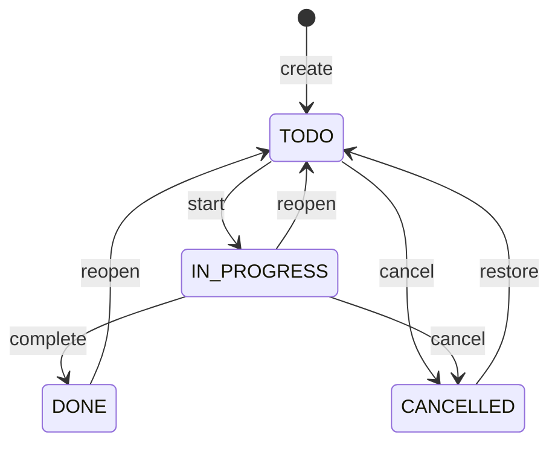

## WHY

A task manager is the "Hello World" of CRUD applications — but a production-quality
one reveals every non-trivial API design decision: pagination strategies,
hierarchical data (tasks → subtasks), status state machines, optimistic locking
for concurrent edits, soft deletes vs hard deletes, and audit trails.

This is also the project where you learn that "simple CRUD" is never simple at
scale. Todoist handles 50M+ tasks. Linear.app (the modern version) shows how
offline-first sync with CRDTs changes every design decision from the database
schema up. Building this teaches you the full REST + Postgres stack in
production form.

## THEORY

### State machine for a task



Encoding this as a state machine (not ad-hoc `if` checks) prevents invalid
transitions (e.g., DONE → IN_PROGRESS without a reopen step).

### Pagination strategies

| Strategy | Query | Pros | Cons |
|----------|-------|------|------|
| Offset `LIMIT 20 OFFSET 200` | Simple | Items skip/duplicate on concurrent inserts |
| Keyset `WHERE id > last_seen_id` | Stable, O(index) | Requires sort key |
| Cursor (opaque) | `LIMIT 20 AFTER <cursor>` | Stable + forward/backward | Complex impl |

Always use **keyset pagination** for large, frequently-updated datasets. Offset
pagination re-scans all preceding rows on every page — O(n) for page n.

### Optimistic locking

Two users edit the same task simultaneously:

```
User A reads task {version:1, title:"Buy milk"}
User B reads task {version:1, title:"Buy milk"}
User A updates: {version:1→2, title:"Buy oat milk"}
User B updates: {version:1, title:"Buy whole milk"}  ← UPDATE WHERE version=1 matches 0 rows → 409
```

`@Version` in JPA, or `UPDATE tasks SET ... WHERE id=? AND version=?` returning
row count = 0 means conflict detected.

## VISUALIZATION_CONFIG

```json
{ "component": "StateMachineVisualizer", "state": "task-status-state-machine" }
```

## CODE

### Level 1 — Beginner: in-memory task list

```java
@RestController @RequestMapping("/tasks")
public class TaskController {
    private final Map<Long, Task> store = new ConcurrentHashMap<>();
    private final AtomicLong ids = new AtomicLong();

    @GetMapping
    public Collection<Task> list() { return store.values(); }

    @PostMapping
    @ResponseStatus(HttpStatus.CREATED)
    public Task create(@RequestBody @Valid CreateTaskRequest req) {
        Task t = new Task(ids.incrementAndGet(), req.title(), "TODO");
        store.put(t.id(), t);
        return t;
    }

    @PatchMapping("/{id}/complete")
    public Task complete(@PathVariable long id) {
        Task task = store.computeIfPresent(id, (k, t) -> t.withStatus("DONE"));
        if (task == null) throw new ResponseStatusException(HttpStatus.NOT_FOUND);
        return task;
    }

    @DeleteMapping("/{id}")
    @ResponseStatus(HttpStatus.NO_CONTENT)
    public void delete(@PathVariable long id) {
        if (store.remove(id) == null)
            throw new ResponseStatusException(HttpStatus.NOT_FOUND);
    }

    public record Task(long id, String title, String status) {
        Task withStatus(String s) { return new Task(id, title, s); }
    }
    public record CreateTaskRequest(@NotBlank String title) { }
}
```

### Level 2 — Intermediate: Spring Data JPA + keyset pagination

```java
@Entity @Table(name = "tasks")
public class TaskEntity {
    @Id @GeneratedValue(strategy = GenerationType.IDENTITY) Long id;
    @NotBlank String title;
    String description;
    @Enumerated(EnumType.STRING) TaskStatus status = TaskStatus.TODO;
    UUID ownerId;
    UUID projectId;
    LocalDate dueDate;
    @Version Long version;  // optimistic locking
    Instant createdAt;
    Instant updatedAt;
    Instant deletedAt;      // soft-delete
}

public enum TaskStatus { TODO, IN_PROGRESS, DONE, CANCELLED }

@Repository
public interface TaskRepository extends JpaRepository<TaskEntity, Long> {
    // Keyset pagination: tasks after a given ID (forward scroll)
    @Query("SELECT t FROM TaskEntity t WHERE t.ownerId = :owner " +
           "AND t.deletedAt IS NULL AND (:afterId IS NULL OR t.id > :afterId) " +
           "ORDER BY t.id ASC LIMIT :limit")
    List<TaskEntity> findPage(@Param("owner") UUID owner,
                              @Param("afterId") Long afterId,
                              @Param("limit") int limit);
}

@Service @Transactional
public class TaskService {
    private final TaskRepository repo;

    public TaskEntity transition(Long id, TaskStatus target, UUID actor) {
        TaskEntity task = repo.findById(id).orElseThrow(NotFoundException::new);
        if (!task.getOwnerId().equals(actor)) throw new ForbiddenException();
        validateTransition(task.getStatus(), target);
        task.setStatus(target);
        task.setUpdatedAt(Instant.now());
        return repo.save(task);  // @Version prevents concurrent overwrites
    }

    private void validateTransition(TaskStatus from, TaskStatus to) {
        Set<TaskStatus> allowed = switch (from) {
            case TODO        -> Set.of(TaskStatus.IN_PROGRESS, TaskStatus.CANCELLED);
            case IN_PROGRESS -> Set.of(TaskStatus.DONE, TaskStatus.TODO, TaskStatus.CANCELLED);
            case DONE        -> Set.of(TaskStatus.TODO);
            case CANCELLED   -> Set.of(TaskStatus.TODO);
        };
        if (!allowed.contains(to))
            throw new InvalidTransitionException(from + " → " + to + " is not allowed");
    }
}
```

### Level 3 — Advanced: subtasks + priority queue + due-date reminders

```java
// Hierarchical tasks: a task can have subtasks (one level deep, like Todoist)
@Entity
public class TaskEntity {
    // ...existing fields...
    @ManyToOne(fetch = FetchType.LAZY)
    @JoinColumn(name = "parent_id")
    TaskEntity parent;

    @OneToMany(mappedBy = "parent", cascade = CascadeType.ALL, orphanRemoval = true)
    List<TaskEntity> subtasks = new ArrayList<>();

    int priority;  // 1=urgent, 4=normal (Todoist's P1–P4)
}

// Scheduled reminder job
@Component
public class DueDateReminderJob {
    private final TaskRepository repo;
    private final ApplicationEventPublisher events;

    @Scheduled(fixedDelay = 60_000)  // every minute
    public void checkDueDates() {
        LocalDate tomorrow = LocalDate.now().plusDays(1);
        List<TaskEntity> due = repo.findByDueDateAndStatusAndReminderSentFalse(
                tomorrow, TaskStatus.TODO);
        due.forEach(task -> {
            events.publishEvent(new TaskDueReminderEvent(task.getId(), task.getOwnerId()));
            task.setReminderSent(true);
            repo.save(task);
        });
    }
}
```

### Level 4 — Expert: audit trail + offline-sync conflict resolution

```java
/**
 * Audit trail: every mutation creates an AuditEvent row.
 * This enables "undo", activity feed, and compliance logging.
 */
@EntityListeners(AuditEntityListener.class)
@Entity public class TaskEntity { /* ... */ }

@Component
public class AuditEntityListener {
    @PostUpdate
    public void onUpdate(TaskEntity task) {
        AuditEvent event = new AuditEvent(
                UUID.randomUUID(),
                "TASK_UPDATED",
                task.getId().toString(),
                task.getOwnerId(),
                Instant.now(),
                captureSnapshot(task));
        // Save via a separate transaction so audit isn't rolled back with the main tx
        auditRepo.save(event);
    }
}

/**
 * Offline sync: client sends a batch of changes with client-side timestamps.
 * Server applies changes only if the server-side version hasn't advanced past
 * the client's last-known version (last-write-wins with vector clock).
 */
@PostMapping("/sync")
public SyncResult sync(@RequestBody SyncRequest req, @AuthenticationPrincipal UUID userId) {
    List<TaskPatch> accepted = new ArrayList<>();
    List<TaskConflict> conflicts = new ArrayList<>();

    for (TaskPatch patch : req.patches()) {
        TaskEntity current = repo.findById(patch.taskId()).orElse(null);
        if (current == null || current.getVersion() <= patch.baseVersion()) {
            applyPatch(current, patch);
            accepted.add(patch);
        } else {
            conflicts.add(new TaskConflict(patch, current));
        }
    }
    return new SyncResult(accepted, conflicts);
}
```

## REAL_WORLD

**Todoist** stores 50M+ tasks in a horizontally sharded MySQL cluster, sharded
by user ID. All of a user's tasks are co-located on one shard, which allows
their "get all tasks" query to avoid cross-shard joins. The trade-off: tasks
shared between users (collaborative projects) require cross-shard reads.

**Linear.app** built their own CRDT-based sync engine (similar to Automerge).
Every change is a small delta operation (not a full document replace). Offline
changes are applied locally, then synced; conflicts are resolved by the CRDT
merge algorithm, not by last-write-wins. This is why Linear feels instant even
on flaky connections.

**Notion** uses a block-based data model — every paragraph, todo, heading is
a "block" with a UUID. This makes hierarchical content (page → section → list
→ item) a tree of blocks joinable by parent ID, which is more flexible than
a `parent_id` foreign key but requires careful pagination and rendering.

## INTERVIEW

### Q1 (Junior): Why is soft delete better than hard delete for tasks?

Hard delete removes the row permanently — no undo, no audit trail, foreign key
violations if other tables reference the task. Soft delete sets `deleted_at =
NOW()` and filters `WHERE deleted_at IS NULL` on all queries. Benefits:
undelete (undo), compliance logs, analytics on deleted tasks. Downside: indexes
must include `deleted_at` or queries scan deleted rows. Partial index: `CREATE
INDEX ON tasks(owner_id) WHERE deleted_at IS NULL`.

### Q2 (Mid): Explain keyset pagination and why it is superior to OFFSET.

`OFFSET 1000 LIMIT 20` tells Postgres to scan 1020 rows, discard the first
1000, return 20. O(offset) per page — page 50 scans 1020 rows. Under concurrent
inserts, items shift position and may be skipped or duplicated across pages.

Keyset: `WHERE id > :lastSeenId LIMIT 20` scans exactly 20 rows starting from
the index seek on `id`. O(1) per page regardless of page number. Stable under
inserts because we anchor to an ID, not a row count. The only downside: no
random access ("jump to page 50") — only forward/backward navigation.

### Q3 (Mid→Senior): How does `@Version` prevent the lost-update problem?

When User A loads task (version=1) and User B loads the same task (version=1),
then both submit edits:
- A's `UPDATE tasks SET title=..., version=2 WHERE id=1 AND version=1` → 1 row affected. ✅
- B's `UPDATE tasks SET title=..., version=2 WHERE id=1 AND version=1` → 0 rows affected. ❌

JPA sees 0 rows updated and throws `OptimisticLockException`. User B gets a
409 Conflict and must reload the task and re-apply their edit. Without this,
A's edit is silently overwritten by B's.

### Q4 (Senior): How would you implement an activity feed for tasks?

Event-sourced approach: every state change publishes a `TaskEvent` (`CREATED`,
`ASSIGNED`, `STATUS_CHANGED`, `COMMENTED`). These are stored in an
`activity_events` table with `(task_id, actor_id, event_type, payload, created_at)`.
The activity feed query is simply `SELECT * FROM activity_events WHERE task_id=?
ORDER BY created_at DESC LIMIT 50`. Advantages: no schema changes needed for
new event types, replay-able for undo/redo, exportable for webhooks.

### Q5 (Senior): Design the schema for hierarchical tasks (subtasks of subtasks).

Three approaches:

1. **Adjacency list** (`parent_id FK`) — simple, but recursive queries need
   CTEs (`WITH RECURSIVE`). Good for up to 3–5 levels.
2. **Materialized path** (`path TEXT = "1.5.12"`) — quick prefix scans for
   subtree, easy ordering. Update requires updating all descendants on move.
3. **Nested sets** (`lft, rgt` integers) — O(1) subtree query but O(n) insert.
   Used in old CMS systems; rarely worth the complexity today.

Todoist limits to one level of subtasks — adjacency list is perfect.
Linear allows unlimited nesting — they use adjacency list with CTE queries.

## FEYNMAN CHECK

A task manager is a to-do list where every item has a name, a status, and
an owner. When you "complete" a task, its status changes from to-do to done.
Everything else — priorities, due dates, subtasks, sharing — layers on top of
those basics.

### Q1: Why model task status as a state machine instead of a boolean `is_done`?

A boolean only allows two states. Real tasks are: not started, in progress,
blocked, done, cancelled, archived. Each transition has business rules
(can't go from DONE to IN_PROGRESS without a reopen). A state machine enforces
valid transitions and makes adding new states safe (adding BLOCKED doesn't
break existing code).

### Q2: What SQL index do you need for `WHERE owner_id = ? AND deleted_at IS NULL`?

A **partial index**: `CREATE INDEX tasks_active_owner ON tasks(owner_id)
WHERE deleted_at IS NULL`. This index only contains non-deleted rows, which
is typically 95%+ of the query pattern. It is smaller than a full index on
`(owner_id, deleted_at)` and faster for the common query.

### Q3: What is an optimistic lock exception and how should the client handle it?

A `409 Conflict` response meaning: "You tried to update a version of this
resource that has since been changed by someone else. Reload the latest version
and re-submit your changes." The client should: fetch the current task, show
the user both versions (their change vs the server's current), let them merge,
and resubmit with the new base version. This is the standard behavior in GitHub
when a PR merge conflicts with main.

### Q4: Why is `Instant.now()` preferred over `LocalDateTime.now()` for task timestamps?

`Instant` is a UTC timestamp — no timezone. `LocalDateTime` has no timezone
information, so it's ambiguous: `2026-07-04T10:00` could be London or Tokyo.
When users in multiple time zones use the app, storing `LocalDateTime` means
timestamps are stored in the server's timezone and display incorrectly for
other users. `Instant` always stores UTC and converts to local on display.

### Q5: How does soft-delete affect unique constraints?

If you have `UNIQUE(owner_id, title)` and a user soft-deletes "Buy milk", they
can never create another "Buy milk" task — the deleted row still holds the
unique slot. Fix: partial unique index `UNIQUE(owner_id, title) WHERE deleted_at
IS NULL`, or include `deleted_at` in the constraint (then the same title can
be re-created after deletion).

## BUILD

**Mini-project (3–4 hours):** REST API for a personal task manager.

### Implement — checklist

- [ ] `POST /tasks` — create task with title, description, priority, dueDate
- [ ] `GET /tasks?afterId=&limit=` — keyset-paginated list (owned, not deleted)
- [ ] `PATCH /tasks/:id` — update (title, description, priority, dueDate)
- [ ] `POST /tasks/:id/transitions` — status transition with validation
- [ ] `DELETE /tasks/:id` — soft delete
- [ ] `GET /tasks/:id/activity` — event log
- [ ] Optimistic lock on `PATCH` — returns 409 on version conflict
- [ ] Partial index for active tasks by owner

### Stretch goals

1. Add subtasks (`POST /tasks/:id/subtasks`), completing a parent auto-completes all subtasks.
2. Add `POST /sync` for offline-first batch sync with conflict detection.
3. Add due-date reminder scheduled job that publishes to an in-process event bus.

## SPACED REVIEW

Day 1
1. Name the four task statuses in the state machine.
2. What is the difference between hard delete and soft delete?
3. What does `@Version` do in JPA?

Day 3
4. Compare offset pagination vs keyset pagination.
5. What SQL index supports `WHERE owner_id = ? AND deleted_at IS NULL` efficiently?
6. What HTTP status code signals an optimistic lock conflict?

Day 7
7. Explain the lost-update problem and how optimistic locking solves it.
8. How does an event-sourced activity feed differ from just logging to a table?
9. Why is `Instant` preferred over `LocalDateTime` for database timestamps?

Day 14
10. Design a subtask hierarchy schema supporting arbitrary nesting.
11. Describe Linear.app's CRDT-based sync approach and when you would use it.
12. How does Todoist shard its database and what trade-off does that create for
    collaborative projects?

