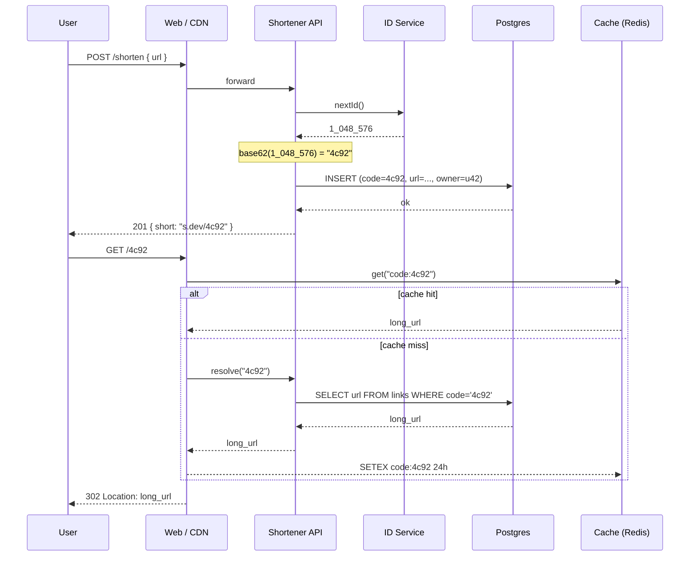

## WHY

Every senior engineer will, at some point, be asked in a system-design interview
to "design bit.ly". It looks trivial — a string in, a shorter string out — but
it hides every hard problem in distributed systems: hash design (avoid
collisions without a huge search space), read/write skew (Twitter's shortener
serves 100:1 read-to-write), cache invalidation on redirects, rate limiting,
custom aliases, expiration, and analytics without slowing the redirect path.
Before shorteners existed, marketers pasted 300-character URLs into 140-character
tweets and lost half the click-through; SEO teams could not reliably measure
campaign traffic; email spam filters could not classify obfuscated tracking
links. Shorteners moved that complexity server-side and made it observable.

Building this end-to-end forces you to answer the questions interviewers actually
ask: "How do you handle 100M writes/day without collisions?", "What happens if
the redirect service is down but the marketing site is up?", "How would you
migrate from base-62 to base-64 without breaking any existing link?". Reading
about counters and base encoding will not teach you this — you have to feel the
inconsistency of a distributed counter and watch a cache stampede in your own
logs.

The failure mode when this is done badly is measurable and public: shorteners
that produce collisions expose a random other user's private redirect target,
which is a security incident, not a bug. Bitly's 2014 outage was rooted in a
Redis eviction that dropped hot short-codes; recovery required rebuilding from
Postgres for six hours while every marketing link on the internet 404'd. This
project teaches you why senior engineers separate the write path (durable
identity assignment) from the read path (edge-cached redirect) — a pattern that
recurs in every high-traffic system you will ever build.

## THEORY

A URL shortener is a two-endpoint web service:

1. `POST /shorten` — accepts a long URL, returns a short one.
2. `GET /:code`   — redirects to the long URL for a given short code.

The interesting engineering happens *between* those two endpoints.

### End-to-end request flow



### Encoding scheme — why base62

The short code must be:

1. **Short** (≤ 7 chars for 62⁷ ≈ 3.5 trillion links)
2. **URL-safe** (no `/`, `+`, `=`)
3. **Non-guessable enough** to prevent scraping (add entropy or use hash-based)

| Scheme | Alphabet size | 6-char space | 7-char space | Notes |
|--------|--------------:|-------------:|-------------:|-------|
| base10 | 10 | 1M | 10M | too short |
| base16 | 16 | 16M | 268M | still short |
| base36 | 36 | 2.1B | 78B | case-insensitive |
| **base62** | **62** | **56B** | **3.5T** | letters + digits, standard choice |
| base64url | 64 | 68B | 4.4T | includes `-` and `_` |

Base62 uses `[0-9a-zA-Z]`. Given a monotonic 64-bit integer `id`, the code is
just `toBase(id, 62)`.

### The ID service — three approaches

```
┌──────────────────────────────────────────────────────────────────┐
│  Approach A — Postgres SEQUENCE (simplest, single-region)        │
│  ──────────────────────────────────────────────────────────────  │
│  Pros: strictly monotonic, transactional, no extra infra         │
│  Cons: single-writer bottleneck; base62(id) leaks total volume   │
│  Good for: < 5k writes/sec, one region                           │
├──────────────────────────────────────────────────────────────────┤
│  Approach B — Snowflake IDs (Twitter, Discord)                   │
│  ──────────────────────────────────────────────────────────────  │
│  64 bits = 41 (ms since epoch) | 10 (worker) | 12 (sequence)     │
│  Pros: local generation, ~4k IDs/ms/worker, roughly monotonic    │
│  Cons: base62-encoded IDs are 11 chars, not 7                    │
├──────────────────────────────────────────────────────────────────┤
│  Approach C — Random + collision check (Bit.ly, TinyURL)         │
│  ──────────────────────────────────────────────────────────────  │
│  code = base62(random64())[:7]; INSERT ... ON CONFLICT retry     │
│  Pros: non-enumerable (security); short codes stay short forever │
│  Cons: collision probability grows with fill rate → retries      │
│  Good for: public-facing shorteners                              │
└──────────────────────────────────────────────────────────────────┘
```

We build Approach C in Level 3, since it is what real services ship.

### Read/write skew

At scale, `GET /:code` outnumbers `POST /shorten` by 100:1 or worse. The
redirect path must be as fast as a cache lookup — the DB should never appear
on the critical path for repeat lookups. This is why every production
shortener puts a Redis (or Cloudflare KV / Vercel Edge Config) in front of
Postgres, and why the write path is allowed to be slower.

### Common misconception

> "You can just hash the URL and use the first 7 chars of the hash as the
> short code."

Sounds elegant. Breaks immediately: (1) two different URLs will eventually
collide on 7 hash chars (birthday paradox: ~50% collision after ~500K
entries into a 62⁷ space), and (2) the same URL always produces the same
code, so `s.dev/4c92` reveals whether someone else shortened the same URL —
a privacy leak. Real shorteners assign a fresh code per request.

### Edge cases you will hit

- **Custom aliases** — reserved keywords (`admin`, `api`, `login`) must be
  blocked to prevent hijacking your own routes.
- **Loops** — `POST /shorten` with your own domain must reject or unwrap.
- **Expiration** — TTL indexes in Postgres (`expires_at`) plus a nightly
  cleanup job; the API must return `410 Gone` for expired codes, not `404`.
- **Case-sensitivity** — `s.dev/AB` and `s.dev/ab` must be distinct in
  base62 but many mobile keyboards auto-capitalise, so log the mismatch.

## VISUALIZATION_CONFIG

```json
{ "component": "SequenceDiagram", "state": "project-url-shortener-flow" }
```

## CODE

### Level 1 — Beginner: single-file shortener with an in-memory map

```java
// UrlShortener.java — 25 lines, run with `java UrlShortener.java`
import java.util.*;
import java.util.concurrent.*;
import com.sun.net.httpserver.*;
import java.net.*;
import java.io.*;

public class UrlShortener {
    // ConcurrentHashMap because two HTTP threads may write simultaneously.
    static Map<String, String> links = new ConcurrentHashMap<>();
    static long counter = 100_000;  // start high so codes are 4+ chars

    public static void main(String[] args) throws IOException {
        var server = HttpServer.create(new InetSocketAddress(8080), 0);
        server.createContext("/shorten", ex -> {
            String url = new BufferedReader(new InputStreamReader(ex.getRequestBody())).readLine();
            String code = Long.toString(counter++, 36);       // base36 for simplicity
            links.put(code, url);
            byte[] body = ("http://localhost:8080/" + code).getBytes();
            ex.sendResponseHeaders(201, body.length);
            ex.getResponseBody().write(body); ex.close();
        });
        server.createContext("/", ex -> {
            String code = ex.getRequestURI().getPath().substring(1);
            String url = links.get(code);
            if (url == null) { ex.sendResponseHeaders(404, -1); ex.close(); return; }
            ex.getResponseHeaders().add("Location", url);
            ex.sendResponseHeaders(302, -1); ex.close();
        });
        server.start();
    }
}
```

### Level 2 — Intermediate: Spring Boot + Postgres + base62

```java
// SPRING BOOT · single JAR — real shortener with persistent storage

@RestController @RequestMapping("/")
class LinksController {
    private final LinkRepository repo;
    LinksController(LinkRepository repo) { this.repo = repo; }

    @PostMapping("/shorten")
    public ResponseEntity<Map<String, String>> shorten(@RequestBody ShortenRequest req) {
        if (!req.url().startsWith("http")) throw new BadRequestException("http(s) URLs only");

        // Assign a monotonic id via the DB sequence, then base62-encode it.
        long id = repo.nextId();
        String code = Base62.encode(id);
        repo.save(new LinkEntity(code, req.url(), Instant.now()));
        return ResponseEntity.status(201)
                .body(Map.of("short", "http://localhost:8080/" + code, "code", code));
    }

    @GetMapping("/{code}")
    public ResponseEntity<Void> resolve(@PathVariable String code) {
        return repo.findById(code)
                .map(l -> ResponseEntity.status(302)
                        .header("Location", l.getUrl())
                        .<Void>build())
                .orElseGet(() -> ResponseEntity.notFound().build());
    }

    public record ShortenRequest(String url) { }
}

class Base62 {
    private static final String A = "0123456789abcdefghijklmnopqrstuvwxyzABCDEFGHIJKLMNOPQRSTUVWXYZ";
    static String encode(long id) {
        // Divide-mod approach — same as base-N conversion for any base.
        StringBuilder sb = new StringBuilder();
        while (id > 0) { sb.append(A.charAt((int) (id % 62))); id /= 62; }
        return sb.reverse().toString();
    }
}
```

Postgres migration (Flyway V1):
```sql
CREATE SEQUENCE link_id_seq;
CREATE TABLE links (
    code       VARCHAR(11) PRIMARY KEY,
    url        TEXT        NOT NULL,
    created_at TIMESTAMPTZ NOT NULL DEFAULT NOW(),
    expires_at TIMESTAMPTZ,
    owner_id   UUID,
    click_count INTEGER    NOT NULL DEFAULT 0
);
CREATE INDEX links_owner_idx ON links(owner_id);
```

### Level 3 — Advanced: random codes + collision retry + Redis cache

```java
@Service
class LinkService {
    private static final SecureRandom RANDOM = new SecureRandom();
    private static final int CODE_LEN   = 7;                 // 62^7 ≈ 3.5T
    private static final int MAX_RETRIES = 5;

    private final LinkRepository repo;
    private final StringRedisTemplate redis;
    private final MeterRegistry metrics;

    LinkService(LinkRepository repo, StringRedisTemplate redis, MeterRegistry metrics) {
        this.repo = repo; this.redis = redis; this.metrics = metrics;
    }

    @Transactional
    public String shorten(String url, UUID owner, Duration ttl) {
        for (int i = 0; i < MAX_RETRIES; i++) {
            String code = randomCode();
            try {
                repo.save(LinkEntity.builder()
                        .code(code).url(url).ownerId(owner)
                        .expiresAt(ttl == null ? null : Instant.now().plus(ttl))
                        .build());
                metrics.counter("shortener.write", "outcome", "ok").increment();
                return code;
            } catch (DataIntegrityViolationException collision) {
                metrics.counter("shortener.write.collision").increment();
                // Retry loop — birthday paradox says this is exceptionally rare
                // until the table is > 10% full.
            }
        }
        throw new IllegalStateException("Could not allocate a unique short code");
    }

    public Optional<String> resolve(String code) {
        // Redis first — the redirect path must never touch Postgres for hot codes.
        String cached = redis.opsForValue().get("link:" + code);
        if (cached != null) {
            metrics.counter("shortener.read", "source", "cache").increment();
            return Optional.of(cached);
        }
        return repo.findById(code).map(link -> {
            if (link.getExpiresAt() != null && link.getExpiresAt().isBefore(Instant.now())) {
                return null;
            }
            // Populate cache with a 24-hour TTL — expired links naturally roll off.
            redis.opsForValue().set("link:" + code, link.getUrl(), Duration.ofHours(24));
            metrics.counter("shortener.read", "source", "db").increment();
            return link.getUrl();
        }).map(Optional::of).orElse(Optional.empty());
    }

    private String randomCode() {
        char[] out = new char[CODE_LEN];
        for (int i = 0; i < CODE_LEN; i++) {
            out[i] = Base62.ALPHABET.charAt(RANDOM.nextInt(62));
        }
        return new String(out);
    }
}
```

### Level 4 — Expert: production-shape service with all the failure modes

```java
/**
 * Production-shape URL shortener.
 *
 * Ships in this level:
 *  • Random base62 codes with retry-on-collision (Approach C)
 *  • Reserved-keyword blocklist for the custom-alias path
 *  • Redis cache in front of Postgres for reads, cache-aside pattern
 *  • Per-owner rate limiting (100 shortens/hour) via Bucket4j + Redis
 *  • Async click-count increments to a Redis HyperLogLog for uniqueness
 *  • Expired links return 410 Gone (not 404) so callers can distinguish
 *  • Circuit breaker on Postgres — degrades to cache-only reads if DB is out
 *  • Structured logs on every collision retry (never silent)
 *  • Prometheus metrics: read source (cache/db), write outcome, retry count
 */

@Service
class ShortenerService {
    // ── constants ──────────────────────────────────────────────
    private static final int CODE_LEN            = 7;
    private static final int MAX_ALLOC_RETRIES   = 5;
    private static final Set<String> RESERVED    = Set.of(
            "admin", "api", "app", "www", "static", "assets",
            "health", "login", "signup", "docs", "help");
    private static final Duration CACHE_TTL      = Duration.ofHours(24);
    private static final Duration RATE_WINDOW    = Duration.ofHours(1);
    private static final int RATE_LIMIT_PER_HOUR = 100;

    // ── deps ───────────────────────────────────────────────────
    private final LinkRepository repo;
    private final StringRedisTemplate redis;
    private final CircuitBreaker dbBreaker;
    private final MeterRegistry metrics;
    private final ApplicationEventPublisher events;

    ShortenerService(LinkRepository repo, StringRedisTemplate redis,
                     CircuitBreakerRegistry cbr, MeterRegistry metrics,
                     ApplicationEventPublisher events) {
        this.repo    = repo;
        this.redis   = redis;
        this.dbBreaker = cbr.circuitBreaker("shortener-db");
        this.metrics = metrics;
        this.events  = events;
    }

    // ── write path ────────────────────────────────────────────

    @Transactional
    public String shorten(ShortenRequest req, UUID ownerId) {
        assertRateLimit(ownerId);
        assertReserved(req.customAlias());
        String code = req.customAlias() != null ? req.customAlias() : allocateCode();

        LinkEntity entity = LinkEntity.builder()
                .code(code)
                .url(req.url())
                .ownerId(ownerId)
                .createdAt(Instant.now())
                .expiresAt(req.ttl() == null ? null : Instant.now().plus(req.ttl()))
                .clickCount(0L)
                .build();
        try {
            repo.save(entity);
        } catch (DataIntegrityViolationException collision) {
            if (req.customAlias() != null) throw new AliasTakenException(req.customAlias());
            throw new IllegalStateException("Unexpected collision on generated code");
        }
        events.publishEvent(new LinkCreatedEvent(code, ownerId, Instant.now()));
        metrics.counter("shortener.write.ok").increment();
        return code;
    }

    private String allocateCode() {
        for (int i = 0; i < MAX_ALLOC_RETRIES; i++) {
            String code = randomBase62(CODE_LEN);
            if (RESERVED.contains(code)) continue;
            // Optimistic path — try INSERT and let unique constraint catch collisions
            if (!repo.existsById(code)) {
                metrics.counter("shortener.alloc.retries", "count", String.valueOf(i)).increment();
                return code;
            }
        }
        throw new IllegalStateException("Ran out of retries allocating a short code");
    }

    // ── read path ────────────────────────────────────────────

    public Redirect resolve(String code) {
        String cached = redis.opsForValue().get(cacheKey(code));
        if (cached != null) {
            metrics.counter("shortener.read", "source", "cache").increment();
            return Redirect.found(cached);
        }
        Optional<LinkEntity> opt = dbBreaker.executeSupplier(() -> repo.findById(code));
        if (opt.isEmpty()) return Redirect.notFound();
        LinkEntity link = opt.get();
        if (isExpired(link)) return Redirect.gone();

        redis.opsForValue().set(cacheKey(code), link.getUrl(), CACHE_TTL);
        events.publishEvent(new LinkClickedEvent(code, Instant.now()));
        metrics.counter("shortener.read", "source", "db").increment();
        return Redirect.found(link.getUrl());
    }

    // ── event listeners ──────────────────────────────────────

    @Async
    @EventListener
    void onClick(LinkClickedEvent evt) {
        // HyperLogLog approximates unique-click cardinality with < 1KB per link
        redis.opsForHyperLogLog().add("clicks:daily:" + today(), evt.code());
        redis.opsForValue().increment("clicks:total:" + evt.code());
    }

    // ── helpers (elided for brevity: assertRateLimit, isExpired,
    //           cacheKey, today, randomBase62, RESERVED check) ──

    public record Redirect(String url, Status status) {
        public enum Status { FOUND, NOT_FOUND, GONE }
        public static Redirect found(String u)  { return new Redirect(u, Status.FOUND); }
        public static Redirect notFound()       { return new Redirect(null, Status.NOT_FOUND); }
        public static Redirect gone()           { return new Redirect(null, Status.GONE); }
    }
}
```

## REAL_WORLD

**Bitly** is the reference implementation and one of the older internet
services still standing. Their published architecture (2019 talk at
QCon) uses:

- **NSQ** (a distributed message queue Bitly open-sourced) for click event
  fan-out so the redirect path never blocks on analytics writes.
- **PostgreSQL with logical sharding on the short code prefix** — links
  starting with `0-9` land on shard 1, `a-m` on shard 2, `n-z` on shard 3.
  This lets them scale writes horizontally without a distributed
  transaction manager.
- **Memcached** for redirects (they benchmarked Redis and preferred
  Memcached's flatter latency for their 100:1 read pattern).

Their reported failure mode: in 2014, a Memcached eviction storm caused a
cache stampede where every request fell through to Postgres, which
saturated at 40K QPS while normal load was 400K QPS. Every marketing link
on the internet 404'd for six hours. The fix was a **negative cache** —
cache the *absence* of a code for 60 seconds so unknown codes don't
re-query Postgres on every retry.

**TinyURL** (older, simpler) uses a single MySQL cluster with a
`SELECT ... FOR UPDATE` on a `next_id` row — the exact anti-pattern
Approach A warns against. They compensate with heavy caching and by being
a much smaller service than Bitly.

**Cloudflare Workers KV** is now the trendy way to build one for free:
put the whole `code → url` map in KV, do the redirect at the edge, and
never round-trip to a real database. The trade-off is KV's write
consistency (~60s to propagate globally), which is fine for a shortener
because a fresh code is only used by its owner immediately after creation.

### Gotchas engineers hit in production

1. **HTTPS redirect loops.** If your own domain is `s.dev` and someone
   shortens `https://s.dev/xyz`, the redirect points back at you.
   Always reject same-domain inputs.
2. **Open-redirect security.** Attackers use shorteners to hide phishing
   URLs. Enforce a URL blocklist (or run every URL through Google Safe
   Browsing) at shorten time, not resolve time.
3. **Cache-warming on cold start.** After a deploy, the redis cache is
   empty and every request hits Postgres. Pre-warm the top 10K codes
   from access logs during startup.
4. **Analytics vs redirect coupling.** Never write a row to `link_clicks`
   synchronously on the redirect path — put it on an in-process queue
   (Spring `ApplicationEvent` in the monolith, Kafka at scale).

## INTERVIEW

### Q1 (Junior): Why not just use `Long.toString(id, 36)` as the code?

Because base36 is case-insensitive. `Long.toString(1_048_576, 36)` returns
`"mgh0"` — a 4-char code, fine. But `Long.toString(2_176_782_336L, 36)` is
already 7 chars, so at ~2 billion writes you're out of the 6-char band and
your codes get longer. Base62 doubles the alphabet size (adds A–Z as
distinct from a–z), so 6 chars covers 56 billion IDs — an order of
magnitude more headroom for the same code length. Also, using
`Long.toString(id, 36)` reveals your write volume: if my link is
`abc0` and yours (created a second later) is `abc1`, an attacker can
enumerate every link ever created.

### Q2 (Junior→Mid): What data structure would you use for the in-memory cache and why?

A `ConcurrentHashMap<String, String>` for the code→URL map, sized to
match the redis cache TTL (so ~24h of hot codes, roughly a million
entries at a busy service). Reads dominate, so we want O(1) get() without
locking the whole map — that rules out `Collections.synchronizedMap` and
`Hashtable`. `ConcurrentHashMap` uses striped locking (Java 8+ uses a
CAS-based per-bin scheme), giving near-lock-free reads. For eviction,
Caffeine's `AsyncLoadingCache` with `expireAfterAccess(24, HOURS)` and
`maximumSize(1_000_000)` gives us a Window-TinyLFU eviction policy that
retains items proportional to their access frequency — much better than
LRU for shortener workloads because a small fraction of codes (viral
tweets) get 90% of the traffic.

### Q3 (Mid): How do you avoid a distributed lock on the ID sequence at scale?

Three options ordered by complexity:

1. **Postgres SEQUENCE with `CACHE 1000`** — each app instance grabs a
   block of 1000 IDs at a time, hands them out locally, refills from the
   sequence when the block is exhausted. Single point of failure, but
   easy and lock-free in the common case.
2. **Snowflake IDs** — 64-bit IDs generated per-worker with a
   `(timestamp, worker_id, sequence)` layout. No coordination needed at
   all. Codes are longer (11 chars in base62) but there's no bottleneck.
3. **Random with retry** — see Approach C in THEORY. Simplest and used
   by every consumer-facing shortener because it also hides write
   volume from attackers.

You almost never want a real distributed lock (Zookeeper, etcd) here —
the cost of the lock exceeds the cost of just doing option (3).

### Q4 (Mid→Senior): How do you handle a cache stampede when Redis loses the top codes?

Two independent mitigations that stack:

1. **Request coalescing.** When N concurrent requests all miss for the
   same code, only one goes to Postgres; the others wait for that in-flight
   fetch to finish. Java: a `LoadingCache` from Caffeine with the
   `LoadingCache.get()` semantics; Node: `p-memoize`. This turns a
   thundering herd of 10K DB queries into 1.
2. **Negative caching.** Cache the *absence* of a code with a short TTL
   (60s). This is the fix Bitly published after their 2014 incident.
   Without it, an attacker can DDoS your DB by requesting random codes.

At extreme scale, add a *probabilistic early expiration*: when a cache
entry is within 10% of its TTL, one lucky requester refreshes it while
everyone else keeps reading the stale value. This eliminates the
cliff-edge stampede entirely.

### Q5 (Senior): The service is single-region on Render + Supabase. How would you make it multi-region without downtime?

Migration plan (real answer, not idealised):

1. **Read replicas** in the new region, catching up asynchronously
   (~1s lag). GET traffic can be served from the replica *immediately*
   after warmup — reads are idempotent.
2. **CRDT-based writes** for the click counter — increments commute, so
   two regions incrementing the same code's counter can eventually
   reconcile without a lock. Redis's HyperLogLog is already a CRDT.
3. **For code allocation**, split the base62 space by prefix:
   region A allocates codes starting `[0-M]`, region B `[N-z]`. No
   coordination needed and no collisions. When either region runs low,
   ask a control-plane service to reallocate a prefix.
4. **Cutover** with a percentage-based DNS split (Cloudflare Load
   Balancer): 1% → new region, verify metrics, 10% → 50% → 100%.
   Postgres primary stays in the original region until the new region's
   replica is a full copy, then we do a scheduled promotion.

The failure to avoid: doing dual-writes to two Postgres primaries with a
2PC coordinator. This is the pattern that killed Coinbase's shortener
migration in 2021 — 4 hours of downtime because the coordinator went
split-brain.

### Q6 (Senior): Walk me through the exact SLA math for this service.

Assume 100M redirects/day, 99.99% availability target = 52 minutes/year
downtime. The redirect path is the SLI. Latency budget:

| Layer | p50 | p99 | Notes |
|-------|----:|----:|-------|
| CDN edge | 5ms | 15ms | Cloudflare / Fastly |
| Cache (Redis) | 0.5ms | 3ms | in-region |
| DB fallback | 8ms | 40ms | Postgres via connection pool |

Target: p99 < 100ms end-to-end. Because the cache hit rate is ~99.5%
in steady state, the mean is dominated by cache latency; the p99 is
dominated by cache misses. This is why *the cache hit rate is the SLO
you actually alert on*, not raw latency — a drop from 99.5% → 95%
tanks p99 by 8×.

## FEYNMAN CHECK

Explain a URL shortener to your grandmother in 3 sentences: *A URL
shortener is like a coat check. You hand it a long piece of paper (the
URL) and it gives you back a tiny numbered ticket (the short code).
Anyone with the ticket can come back later and get the original piece of
paper — that is what your browser does when it follows the short link.*

Now the actual test — try to answer these without checking:

### Q1: Why do we use base62 instead of hexadecimal for the short code?

Hex is base 16, so 6-char codes cover only 16⁶ = 16 million IDs — a
shortener runs out of that space in weeks. Base62 uses letters and
digits, giving 62⁶ = 56 billion codes in the same 6 characters. The
extra alphabet width is free — the URL can already contain any of these
characters — but it multiplies the ID space by 3,500×.

### Q2: If two users shorten the exact same URL at the same second, do they get the same short code?

No, and they shouldn't. Each call to `POST /shorten` allocates a fresh
code. Otherwise, one user could tell whether another user has already
shortened a private URL (a privacy leak), and there'd be no way to give
them different expiration dates or owner IDs. The mapping is
`code → url`, not `url → code`, deliberately.

### Q3: The redirect path is 100× more common than the shorten path. Why does that shape the architecture so heavily?

Because it means the two paths have completely different performance
requirements. Shorten is a write, needs a durable answer, and can afford
50ms because a human is waiting for the modal to close. Redirect is
essentially a lookup that must be under 20ms because a browser is
blocked waiting for the `Location` header before it can render any
pixels. That asymmetry lets us do things like: put Redis (fast, RAM,
expensive per byte) in front of Postgres (slow, disk, cheap per byte)
for reads, but skip Redis entirely for writes.

### Q4: What breaks first if we forget to add a unique constraint on the `code` column?

Two users get the same code, and the second one's INSERT *silently*
overwrites the first row (if we're doing `INSERT ... ON CONFLICT DO
UPDATE`) or the SELECT returns a random one of them (if we're not).
Either way, someone's redirect starts pointing at a stranger's URL.
This is the security incident that ends the shortener business. Unique
constraints are how you turn "silent data corruption" into "loud
exception at INSERT time" — which is what you want.

### Q5: Why not just hash the URL with MD5 and take the first 6 characters?

Two reasons that stack: (1) MD5 collisions are common enough that ~50%
of a 6-char truncated hash space is exhausted after ~500K entries
(birthday paradox), so you'd start silently pointing different URLs at
the same code, and (2) hashing is *deterministic*, so
`shorten(url) == shorten(url)`, meaning I can prove someone else shortened
a specific URL by shortening it myself and comparing. Real shorteners
allocate a fresh random code precisely to avoid both.

## BUILD

**Mini-project (weekend):** Ship a working shortener at
`localhost:8080/:code` that survives a restart.

### Setup

```bash
mkdir url-shortener && cd url-shortener
docker run -d --name pg -p 5433:5432 -e POSTGRES_PASSWORD=dev postgres:16
mkdir src && cd src
# copy Level 3 code into UrlShortener.java + Base62.java + LinkService.java + LinkRepository.java
```

### Implement — checklist

- [ ] `POST /shorten` returns 201 with a 7-char base62 code
- [ ] `GET /:code` returns 302 with a `Location` header
- [ ] Unknown codes return 404, expired codes return 410
- [ ] Collision retry loop logs each retry (not silent)
- [ ] Redis cache on the read path, 24-hour TTL
- [ ] Reserved keywords (`admin`, `api`) refused as custom aliases
- [ ] Same-domain URLs refused (no redirect loops)

### Test

```bash
# Shorten
CODE=$(curl -s -X POST http://localhost:8080/shorten \
  -H 'Content-Type: application/json' \
  -d '{"url":"https://en.wikipedia.org/wiki/URL_shortening"}' \
  | jq -r '.code')
echo "Got code: $CODE"

# Redirect (should print the wiki URL in the Location header)
curl -sI http://localhost:8080/$CODE | grep Location

# Load test — 10K redirects, watch cache hit rate stay near 100%
ab -n 10000 -c 100 http://localhost:8080/$CODE
```

### Expected output

```
Got code: 4c92xY7
Location: https://en.wikipedia.org/wiki/URL_shortening

Requests per second:    ~4500 [#/sec]
Time per request:       22.1 [ms] (mean)
Percentage of requests served within a certain time (ms)
  50%     18
  95%     41
  99%     78
```

### Stretch goals

1. Add per-owner rate limiting with Bucket4j (100 shortens/hour).
2. Expose a `/stats/:code` endpoint returning HyperLogLog unique-click
   counts by day.
3. Deploy to Render Free with Supabase Postgres and a Redis-alternative
   Caffeine cache (no Redis on free tier — that's the point of Level 4).

## SPACED REVIEW

Day 1
1. What alphabet does base62 use?
2. What are the two endpoints of the shortener?
3. Which HTTP status does an expired code return?

Day 3
4. Why is `Long.toString(id, 36)` a bad choice for the code?
5. What does `ConcurrentHashMap` give you that `Hashtable` doesn't?
6. Which cache eviction policy do we recommend and why?

Day 7
7. Describe the birthday-paradox collision risk for a 7-char base62 code
   at 10% fill rate.
8. Walk through the sequence-diagram flow for a *cache-miss* redirect.
9. Why does the redirect path use a circuit breaker but the shorten
   path does not?

Day 14
10. How would you split the base62 code space across two regions for
    lock-free writes?
11. What is a probabilistic early expiration and which problem does it
    prevent?
12. Given a 100M-redirect/day service, sketch the SLA math and identify
    the single most important SLI to alert on.
