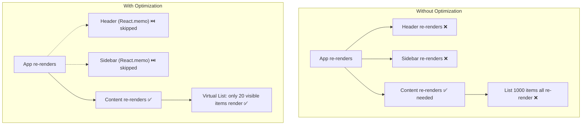

## WHY

A React app that renders smoothly at 100 items becomes unusable at 10,000. A dashboard that's snappy in development becomes sluggish in production with real data. Performance is not optional — it's what separates a senior frontend engineer from a junior one.

The most common interview question for React seniors: "Your component re-renders 60 times per second causing jank. Walk me through how you'd diagnose and fix it." If you can't answer with concrete tools and techniques, you're not senior level.

---

## THEORY

### Why React Re-renders

React re-renders a component when:
1. **State changes** (`useState`, `useReducer`)
2. **Props change** (parent passes new reference)
3. **Context value changes** (anything consuming the context re-renders)
4. **Parent re-renders** (ALL children re-render by default, even if props are identical!)

Rule #4 surprises most developers. In a tree of 50 components, changing state at the top re-renders ALL 50 — even if only 1 needed the new data.

### The Three Performance Pillars

**1. Prevent Unnecessary Renders**
- `React.memo()` — skip re-render if props haven't changed (shallow compare)
- `useMemo()` — cache expensive computed values
- `useCallback()` — cache function references (prevents children from re-rendering)

**2. Reduce Render Cost**
- Virtualization (react-window / TanStack Virtual) — only render visible items
- Code splitting (dynamic `import()`) — don't load what's not visible
- Lazy loading images / heavy components

**3. Optimize State Management**
- Co-locate state close to where it's used (don't lift everything up)
- Split contexts (don't put everything in one massive context)
- Use selectors (Zustand/Redux) — subscribe to specific slices, not entire store

### When NOT to Optimize

> "Premature optimization is the root of all evil" — Donald Knuth

Don't memo everything. Memoization has a cost (memory + comparison overhead). Only optimize when:
1. You can **measure** the problem (React DevTools Profiler shows >16ms renders)
2. The component renders **frequently** with **unchanged props**
3. The render is **expensive** (large lists, heavy calculations, deep component trees)

---

## VISUALIZATION_CONFIG



---

## CODE

### Level 1 — React.memo for Expensive Components

```tsx
// WITHOUT memo: Header re-renders every time parent state changes
// even though its props (userName, onLogout) never change
const Header = ({ userName, onLogout }: HeaderProps) => {
  console.log('Header rendered!'); // Fires on EVERY parent render
  return (
    <header>
      <h1>DevMastery</h1>
      <span>{userName}</span>
      <button onClick={onLogout}>Logout</button>
    </header>
  );
};

// WITH memo: Only re-renders when userName or onLogout ACTUALLY change
const Header = React.memo(({ userName, onLogout }: HeaderProps) => {
  console.log('Header rendered!'); // Only fires when props change
  return (
    <header>
      <h1>DevMastery</h1>
      <span>{userName}</span>
      <button onClick={onLogout}>Logout</button>
    </header>
  );
});

// CRITICAL: Parent must stabilize the onLogout reference!
function App() {
  const [count, setCount] = useState(0);

  // BAD: new function on every render → breaks memo
  const onLogout = () => { /* logout */ };

  // GOOD: stable reference across renders
  const onLogout = useCallback(() => { /* logout */ }, []);

  return (
    <>
      <Header userName="John" onLogout={onLogout} />
      <button onClick={() => setCount(c => c + 1)}>Count: {count}</button>
    </>
  );
  // With useCallback: Header doesn't re-render when count changes ✅
}
```

### Level 2 — useMemo for Expensive Computations

```tsx
function ProductList({ products, filterText, sortBy }: Props) {
  // WITHOUT useMemo: filters + sorts 10,000 products on EVERY keystroke
  // const filteredProducts = products
  //   .filter(p => p.title.includes(filterText))
  //   .sort((a, b) => a[sortBy] - b[sortBy]);

  // WITH useMemo: only recalculates when products, filterText, or sortBy changes
  const filteredProducts = useMemo(() => {
    console.log('Filtering and sorting...'); // Only runs when dependencies change
    return products
      .filter(p => p.title.toLowerCase().includes(filterText.toLowerCase()))
      .sort((a, b) => {
        if (sortBy === 'price') return a.price - b.price;
        if (sortBy === 'rating') return b.rating - a.rating;
        return a.title.localeCompare(b.title);
      });
  }, [products, filterText, sortBy]);

  return (
    <div>
      {filteredProducts.map(product => (
        <ProductCard key={product.id} product={product} />
      ))}
    </div>
  );
}
```

### Level 3 — Virtualization for Large Lists

```tsx
import { useVirtualizer } from '@tanstack/react-virtual';

function VirtualizedList({ items }: { items: Product[] }) {
  const parentRef = useRef<HTMLDivElement>(null);

  const virtualizer = useVirtualizer({
    count: items.length,        // Total items (can be 100,000+)
    getScrollElement: () => parentRef.current,
    estimateSize: () => 72,     // Estimated row height in px
    overscan: 5,                // Render 5 extra items above/below viewport
  });

  return (
    <div ref={parentRef} style={{ height: '600px', overflow: 'auto' }}>
      <div style={{ height: `${virtualizer.getTotalSize()}px`, position: 'relative' }}>
        {virtualizer.getVirtualItems().map(virtualRow => (
          <div
            key={virtualRow.key}
            style={{
              position: 'absolute',
              top: 0,
              left: 0,
              width: '100%',
              height: `${virtualRow.size}px`,
              transform: `translateY(${virtualRow.start}px)`,
            }}
          >
            <ProductCard product={items[virtualRow.index]} />
          </div>
        ))}
      </div>
    </div>
  );
  // Only ~15-20 DOM nodes exist regardless of list size!
  // 100,000 items? Still only 20 DOM nodes. 🚀
}
```

### Level 4 — Context Splitting (Avoiding Global Re-renders)

```tsx
// BAD: Single context with everything → entire app re-renders on any change
const AppContext = createContext({ user: null, theme: 'dark', notifications: [] });

// GOOD: Split into focused contexts
const AuthContext = createContext<AuthState | null>(null);
const ThemeContext = createContext<ThemeState>({ theme: 'dark' });
const NotificationContext = createContext<NotificationState>({ items: [] });

// Components only subscribe to what they need:
function Header() {
  const { user } = useContext(AuthContext);  // Only re-renders on auth change
  return <span>{user?.name}</span>;
}

function ThemeToggle() {
  const { theme, setTheme } = useContext(ThemeContext); // Only re-renders on theme change
  return <button onClick={() => setTheme(theme === 'dark' ? 'light' : 'dark')}>Toggle</button>;
}

// BEST: Use Zustand with selectors for surgical subscriptions
import { create } from 'zustand';

const useStore = create((set) => ({
  user: null,
  theme: 'dark',
  notifications: [],
  setTheme: (theme) => set({ theme }),
}));

// This component ONLY re-renders when theme changes, not when notifications update
function ThemeToggle() {
  const theme = useStore(state => state.theme);      // Selector!
  const setTheme = useStore(state => state.setTheme);
  return <button onClick={() => setTheme(theme === 'dark' ? 'light' : 'dark')}>Toggle</button>;
}
```

### Level 5 — Profiling with React DevTools

```tsx
// Wrap specific sections to measure render performance
import { Profiler } from 'react';

function App() {
  const onRender = (
    id: string,           // Component being profiled
    phase: string,        // "mount" or "update"
    actualDuration: number, // Time spent rendering (ms)
    baseDuration: number,   // Estimated time without memoization
    startTime: number,
    commitTime: number
  ) => {
    if (actualDuration > 16) { // Exceeds 60fps budget
      console.warn(`[PERF] ${id} ${phase} took ${actualDuration.toFixed(1)}ms — SLOW!`);
    }
  };

  return (
    <Profiler id="Dashboard" onRender={onRender}>
      <Dashboard />
    </Profiler>
  );
}

// React DevTools → Profiler tab:
// 1. Click Record, interact with app, stop recording
// 2. See flame graph of component render times
// 3. Identify components taking >16ms (breaking 60fps)
// 4. Check "Why did this render?" to see which props/state changed
```

---

## REAL_WORLD

### How Discord Handles 100,000+ Messages

Discord's message list uses **virtualization** — only messages visible in the viewport are rendered as DOM nodes. Scrolling up loads older messages lazily. Combined with `React.memo` on each message bubble (messages never change after render), their chat UI handles channels with 100,000+ messages smoothly. Without virtualization, rendering 100K DOM nodes would crash the browser.

### Figma's Canvas Rendering Approach

Figma renders their design canvas using `<canvas>` WebGL, not DOM elements — because React/DOM simply cannot handle 50,000 design elements with real-time drag/drop at 60fps. For their UI panels (layers, properties, comments), they use aggressive memoization with `React.memo` + `useMemo` and custom equality functions that check only the specific properties that would change the visual output.

---

## INTERVIEW

**Q1: Your dashboard re-renders all 50 components when typing in a search box. How do you fix it?**
> (1) Move the search state DOWN to the search component (co-location) — don't store it in the parent. (2) If the search results need to render in a sibling, use `useDeferredValue` to deprioritize the results update. (3) Wrap expensive child components in `React.memo`. (4) If using context for search state, split it into a separate `SearchContext` so only search-related components re-render. (5) For the results list: virtualize it so only visible items render.

**Q2: When should you NOT use React.memo?**
> (1) Components that already render fast (<1ms) — memo's comparison overhead isn't worth it. (2) Components that almost always receive new props (the memo check always fails, so you pay comparison cost + re-render). (3) Components that receive complex objects/arrays as props without stable references — memo's shallow compare will always see them as "different." (4) Leaf components with no children — the render cost is minimal.

**Q3: What is the difference between useMemo and useCallback?**
> `useMemo(() => computeValue(), [deps])` — caches a **computed value** (the result of calling the function). `useCallback(fn, [deps])` — caches the **function itself** (the reference). `useCallback(fn, deps)` is equivalent to `useMemo(() => fn, deps)`. Use `useMemo` for expensive calculations. Use `useCallback` for functions passed as props to memoized children (to prevent breaking their `React.memo`).

**Q4: A list of 10,000 items causes scroll jank. Solution?**
> **Virtualization**: Use `@tanstack/react-virtual` or `react-window`. Only render items currently visible in the viewport (typically 10-20 items), plus a small overscan buffer. The DOM stays at ~30 elements regardless of list size. The virtual list calculates positions with `transform: translateY()` for smooth scrolling. Bonus: combine with infinite scroll — load more data on scroll rather than rendering all 10K upfront.

---

## FEYNMAN CHECK

Imagine React as a painter redoing an entire wall every time you change one pixel.

**React.memo** = putting a "Do Not Disturb" sign on walls that haven't changed. The painter checks: "Has anything on this wall changed? No? Skip it."

**useMemo** = pre-calculating a complex color mix once and storing it, instead of re-mixing 500 paint colors every time the painter walks by.

**useCallback** = giving the painter a PERMANENT instruction card instead of writing a new one each visit. If the child wall has a "Don't repaint unless instructions change" sign (memo), a new instruction card (different reference) would make them repaint unnecessarily.

**Virtualization** = instead of painting a 100-floor building, only paint the 3 floors visible through the window. As you move the window (scroll), paint the newly visible floor and unpaint the one that left view.

---

## BUILD

**Challenge: Optimize a slow product catalog page.**

Starting point: A product page with 5,000 products rendering all at once, a search filter, sorting, and a sidebar with filters — all causing 200ms+ re-renders.

Requirements:
1. Implement virtualized product grid using `@tanstack/react-virtual` — only render visible items
2. Memoize the product card component with `React.memo` and custom equality (only re-render if price or title changes)
3. Use `useMemo` to cache the filtered/sorted product list (only recalculate when filter/sort changes)
4. Use `useCallback` for onClick handlers passed to product cards
5. Split the global context into `FilterContext` and `CartContext` so cart updates don't re-render filters
6. Add React Profiler and verify: typing in search box causes <16ms render time
7. Use `useDeferredValue` for search results so typing remains instant (60fps) while results update in background
8. Target: page loads 5,000 products with <100ms initial render, <16ms per filter keystroke

---

## SPACED REVIEW

- React re-renders children when parent re-renders — even if props unchanged (default behavior)
- `React.memo(Component)` — shallow-compares props, skips re-render if same
- `useMemo(fn, deps)` — caches computed value; `useCallback(fn, deps)` — caches function reference
- `useCallback` + `React.memo` = must use TOGETHER to prevent unnecessary child re-renders
- **Virtualization** (TanStack Virtual): only render visible items — 10K items = 20 DOM nodes
- **Context splitting**: separate contexts by update frequency (auth rarely, theme rarely, data often)
- **State co-location**: keep state as close to where it's used as possible
- **Zustand selectors**: `useStore(state => state.theme)` — only re-renders when that slice changes
- React DevTools Profiler: Record → interact → see flame graph → identify >16ms renders
- `useDeferredValue`: low-priority update — keeps UI responsive during heavy re-renders
- Don't memo everything — only when render is expensive AND props rarely change

