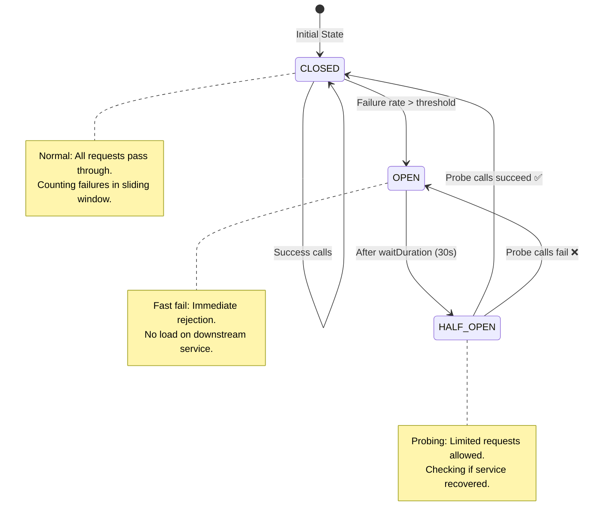

## WHY

In a microservices architecture, a slow or failing dependency doesn't just cause errors — it causes **cascading failures** that can bring down your entire system. If Service A calls Service B which calls Service C, and C is slow (taking 30 seconds per request), threads pile up in B waiting for C, then pile up in A waiting for B. In seconds, the entire system is deadlocked with thread exhaustion.

This is the cascading failure problem. Netflix famously lost their entire streaming service in 2012 because of it. Their response was **Hystrix** (now retired) and later **Resilience4j** — the circuit breaker library now used in virtually every production Java microservice.

Every senior engineer and architect interview includes questions about resilience patterns.

---

## THEORY

### Circuit Breaker — The Core Pattern

Named after the electrical circuit breaker in your home's fuse box. When a fault is detected, it "opens" and stops current (requests) from flowing, protecting the downstream system from overload.

**Three States:**

1. **CLOSED** (normal operation): Requests pass through. The breaker counts failures. If failures exceed a threshold in a time window, it **OPENS**.

2. **OPEN** (failing fast): ALL requests immediately fail with a `CallNotPermittedException`. No calls reach the downstream service. The service gets time to recover. After a configured timeout, transitions to HALF_OPEN.

3. **HALF_OPEN** (probing): A limited number of "probe" requests are allowed through. If they succeed, the breaker **CLOSES** (service recovered). If they fail, it **OPENS** again.

### Related Resilience Patterns

| Pattern | Problem It Solves | How |
|---------|------------------|-----|
| **Circuit Breaker** | Cascading failures from slow/failing services | Fail fast when failure rate is high |
| **Retry** | Transient failures (network blip, brief overload) | Retry with backoff |
| **Rate Limiter** | Overloading a service / preventing abuse | Throttle requests above a threshold |
| **Bulkhead** | One heavy consumer exhausts all thread/connection pools | Isolate resources per consumer |
| **Timeout** | Slow calls tying up threads indefinitely | Cancel calls that exceed time limit |
| **Fallback** | Graceful degradation when service fails | Return cached/default data |

### Resilience4j Configuration Explained

```yaml
resilience4j:
  circuitbreaker:
    instances:
      paymentService:
        slidingWindowType: COUNT_BASED       # or TIME_BASED
        slidingWindowSize: 10                 # last 10 calls
        minimumNumberOfCalls: 5              # need at least 5 calls before tripping
        failureRateThreshold: 50             # OPEN when 50%+ of last 10 calls fail
        waitDurationInOpenState: 30s         # Stay OPEN for 30s before probing
        permittedNumberOfCallsInHalfOpenState: 3  # Allow 3 probe calls
        slowCallRateThreshold: 80            # Also trip if 80%+ calls are "slow"
        slowCallDurationThreshold: 2s        # "slow" = takes more than 2 seconds
```

---

## VISUALIZATION_CONFIG



---

## CODE

### Level 1 — Basic Circuit Breaker with Resilience4j

```java
// build.gradle.kts
// implementation("io.github.resilience4j:resilience4j-spring-boot3:2.2.0")
// implementation("org.springframework.boot:spring-boot-starter-aop")

@Service
@RequiredArgsConstructor
@Slf4j
public class PaymentGatewayService {

    private final PaymentClient paymentClient;

    // Circuit breaker + fallback
    @CircuitBreaker(name = "paymentService", fallbackMethod = "fallbackPayment")
    @Retry(name = "paymentService")
    @TimeLimiter(name = "paymentService")
    public CompletableFuture<PaymentResult> processPayment(PaymentRequest request) {
        return CompletableFuture.supplyAsync(() ->
            paymentClient.charge(request)
        );
    }

    // Fallback: called when circuit is OPEN or retries exhausted
    private CompletableFuture<PaymentResult> fallbackPayment(
            PaymentRequest request, Throwable ex) {
        log.warn("Payment service unavailable ({}). Queuing for async processing.",
            ex.getClass().getSimpleName());
        return CompletableFuture.completedFuture(
            PaymentResult.queued(request.getOrderId())
        );
    }
}
```

```yaml
# application.yml
resilience4j:
  circuitbreaker:
    instances:
      paymentService:
        slidingWindowSize: 10
        minimumNumberOfCalls: 5
        failureRateThreshold: 50
        waitDurationInOpenState: 30s
        permittedNumberOfCallsInHalfOpenState: 3
  retry:
    instances:
      paymentService:
        maxAttempts: 3
        waitDuration: 500ms
        enableExponentialBackoff: true
        exponentialBackoffMultiplier: 2  # 500ms, 1000ms, 2000ms
        retryExceptions:
          - java.net.ConnectException
          - java.net.SocketTimeoutException
  timelimiter:
    instances:
      paymentService:
        timeoutDuration: 5s
```

### Level 2 — Bulkhead Pattern (Thread Pool Isolation)

```java
@Service
@RequiredArgsConstructor
@Slf4j
public class ProductService {

    private final ProductRepository productRepository;

    // SEMAPHORE bulkhead: max 10 concurrent calls
    @Bulkhead(name = "productService", type = Bulkhead.Type.SEMAPHORE,
              fallbackMethod = "productFallback")
    public List<Product> getProducts(String category) {
        return productRepository.findByCategory(category);
    }

    // THREAD_POOL bulkhead: dedicated thread pool, non-blocking rejection
    @Bulkhead(name = "reportService", type = Bulkhead.Type.THREADPOOL)
    public CompletableFuture<Report> generateReport(String type) {
        return CompletableFuture.supplyAsync(() -> buildReport(type));
    }

    private List<Product> productFallback(String category, BulkheadFullException ex) {
        log.warn("Product service bulkhead full. Returning cached data.");
        return cacheService.getCachedProducts(category);
    }
}
```

```yaml
resilience4j:
  bulkhead:
    instances:
      productService:
        maxConcurrentCalls: 10
        maxWaitDuration: 100ms  # wait 100ms for a slot before rejecting
  thread-pool-bulkhead:
    instances:
      reportService:
        maxThreadPoolSize: 4
        coreThreadPoolSize: 2
        queueCapacity: 2   # reject if 4 threads busy + 2 queued
```

### Level 3 — Circuit Breaker with Registry and Custom Events

```java
@Service
@RequiredArgsConstructor
@Slf4j
public class CircuitBreakerMonitor implements ApplicationListener<ApplicationReadyEvent> {

    private final CircuitBreakerRegistry circuitBreakerRegistry;
    private final MeterRegistry meterRegistry;

    @Override
    public void onApplicationEvent(ApplicationReadyEvent event) {
        // Subscribe to all circuit breaker state transitions for monitoring
        circuitBreakerRegistry.getAllCircuitBreakers().forEach(this::subscribeToEvents);
    }

    private void subscribeToEvents(CircuitBreaker cb) {
        cb.getEventPublisher()
            .onStateTransition(e -> {
                log.warn("[CIRCUIT-BREAKER] {} transitioned: {} → {}",
                    e.getCircuitBreakerName(),
                    e.getStateTransition().getFromState(),
                    e.getStateTransition().getToState());

                // Increment Prometheus counter for alerting
                meterRegistry.counter("circuit.breaker.transitions",
                    "name", e.getCircuitBreakerName(),
                    "from", e.getStateTransition().getFromState().name(),
                    "to", e.getStateTransition().getToState().name()
                ).increment();
            })
            .onCallNotPermitted(e ->
                meterRegistry.counter("circuit.breaker.rejected",
                    "name", e.getCircuitBreakerName()).increment()
            );
    }

    // Programmatic circuit breaker for dynamic use cases
    public <T> T executeWithCircuitBreaker(String name, Supplier<T> supplier, Supplier<T> fallback) {
        CircuitBreaker cb = circuitBreakerRegistry.circuitBreaker(name);

        try {
            return CircuitBreaker.decorateSupplier(cb, supplier).get();
        } catch (Exception e) {
            return fallback.get();
        }
    }
}
```

### Level 4 — Retry with Exponential Backoff and Jitter

```java
@Service
@Slf4j
public class ExternalApiService {

    private final RetryRegistry retryRegistry;

    // Manual retry with jitter to prevent thundering herd
    public <T> T callWithRetry(String operationName, Supplier<T> operation) {
        RetryConfig config = RetryConfig.custom()
            .maxAttempts(5)
            .intervalBiFunction((attempt, throwable) -> {
                // Exponential backoff: 100ms, 200ms, 400ms, 800ms, 1600ms
                long baseDelay = (long) (100 * Math.pow(2, attempt - 1));
                // Add random jitter ±30% to prevent thundering herd
                long jitter = (long) (baseDelay * 0.3 * (Math.random() * 2 - 1));
                return baseDelay + jitter;
            })
            .retryOnException(e ->
                e instanceof ConnectException ||
                e instanceof ServiceUnavailableException
            )
            .build();

        Retry retry = Retry.of(operationName, config);

        retry.getEventPublisher().onRetry(e ->
            log.warn("Retry attempt {} for '{}' after {}",
                e.getNumberOfRetryAttempts(), operationName,
                e.getWaitInterval())
        );

        return retry.executeSupplier(operation);
    }
}
```

---

## REAL_WORLD

### Netflix Hystrix → Resilience4j Migration

Netflix invented the circuit breaker pattern for microservices in their **Hystrix** library (2012). When they had 10,000+ microservices making millions of calls per second, a single slow service could cascade and take down recommendations, search, and playback simultaneously. Hystrix "shed load" to fallbacks (showing cached/default content) instead of crashing. Netflix served a degraded experience rather than no experience. Hystrix is now deprecated; **Resilience4j** is the modern Java standard.

### Amazon's Retail Holiday Traffic

Amazon's Black Friday traffic can spike 10x within minutes. Their services use time-based sliding window circuit breakers to detect overloaded downstream services faster than count-based ones during ramp-up. Their bulkhead configuration dedicates separate thread pools to critical (checkout, payment) vs. non-critical (recommendations, reviews) paths, ensuring a recommendation service crash never blocks a purchase.

---

## INTERVIEW

**Q1: Explain the three states of a circuit breaker.**
> **CLOSED**: Normal operation. All requests pass through. Failures are tracked in a sliding window. If the failure rate exceeds the threshold (e.g., 50% of last 10 calls fail), the circuit **OPENS**. **OPEN**: All requests immediately fail with `CallNotPermittedException`. No calls reach the downstream service. After a configured wait time (e.g., 30s), transitions to **HALF_OPEN**. **HALF_OPEN**: A limited number of probe requests are allowed through to test if the service has recovered. If they succeed → **CLOSED**. If they fail → back to **OPEN**.

**Q2: What is the difference between Circuit Breaker and Retry patterns? When do you use each?**
> **Retry** handles **transient** failures — brief glitches that resolve on their own (network packet loss, brief overload spike). Use retry for recoverable failures with backoff. **Circuit Breaker** handles **persistent** failures — the service is down or overloaded and won't recover in milliseconds. Use circuit breaker to fail fast and prevent cascading failures. Best practice: combine both — retry a few times, then circuit breaker opens to prevent hammering a dead service.

**Q3: What is the Bulkhead pattern? How does it differ from a Circuit Breaker?**
> **Bulkhead** (named after ship compartments that prevent one flooding compartment from sinking the ship) isolates resources so a failure in one area doesn't exhaust resources globally. It limits concurrent calls (semaphore) or provides dedicated thread pools (thread pool isolation) per service. **Circuit Breaker** stops calls when failure rate is high. **Bulkhead** limits how many concurrent calls can happen at all. They're complementary.

**Q4: What is a "thundering herd" and how does jitter in retry logic prevent it?**
> When a service goes down and recovers, ALL clients that were retrying simultaneously attempt to reconnect at the same moment — creating a massive spike that immediately overwhelms the newly-recovered service. **Jitter** adds random variance to the retry delay (e.g., ±30% of the base delay) so clients retry at slightly different times, spreading the load instead of hitting at once.

**Q5: How do you monitor circuit breakers in production?**
> Use Resilience4j's built-in Micrometer integration. Key metrics to monitor: `resilience4j.circuitbreaker.state` (CLOSED/OPEN/HALF_OPEN), `resilience4j.circuitbreaker.calls.failed.rate`, `resilience4j.circuitbreaker.not_permitted.calls`. Set up Grafana alerts when any circuit is OPEN for more than 60 seconds. Add structured log events on state transitions for incident analysis.

---

## FEYNMAN CHECK

Think of a circuit breaker in your home's electrical panel. When too much current flows (the electrical equivalent of too many failed requests), the breaker "trips" and cuts the power. This protects your appliances from damage (protects your service from thread exhaustion). After a while, you try flipping the switch back on (HALF_OPEN state). If it stays on, great (service recovered). If it trips again immediately, there's still a problem.

Without this, an overloaded dryer would keep pulling power until it overheats and burns your house down (one failing service takes down all services). The breaker is the safety mechanism that contains the damage.

The Retry pattern is like trying the light switch a few times when the bulb flickers — transient problem, usually fixes itself. Circuit Breaker is for when the whole neighborhood loses power — no amount of switch flipping helps, you need to stop and wait.

---

## BUILD

**Challenge: Build a resilient product catalog service.**

Requirements:
1. Create `ProductService` that calls a `ProductApiClient` (simulated with random 30% failure rate)
2. Configure a Circuit Breaker: trip at 50% failure rate, 30s wait, 3 probe calls
3. Add Retry: 3 attempts with exponential backoff (500ms base, 2x multiplier) + jitter
4. Add a Bulkhead: max 5 concurrent calls
5. Add a 2-second timeout
6. Fallback: return products from local in-memory cache
7. Subscribe to circuit breaker events and log all state transitions
8. Expose `/actuator/metrics/resilience4j.circuitbreaker.*` and verify in a browser
9. Write integration tests that verify: fallback is called when circuit is open, metrics are incremented

---

## SPACED REVIEW

- Circuit Breaker states: **CLOSED** → (failure rate > threshold) → **OPEN** → (wait timeout) → **HALF_OPEN** → (probe success) → **CLOSED**
- OPEN state: **fail fast** — no calls reach downstream, immediate exception
- Retry: for **transient** failures (add jitter to prevent thundering herd)
- Bulkhead: **isolate resources** — separate thread pools or semaphore limits per service
- Time Limiter: cancel calls exceeding time limit to free blocked threads
- Fallback: graceful degradation — return cached/default data
- **Thundering herd**: all clients retry simultaneously on recovery → use jitter
- Resilience4j = modern standard; integrates with Spring Boot, Micrometer, Prometheus
- Key config: `slidingWindowSize`, `failureRateThreshold`, `waitDurationInOpenState`, `permittedNumberOfCallsInHalfOpenState`
- Always combine: Timeout + Retry (transient) + CircuitBreaker (persistent) + Bulkhead (isolation)

