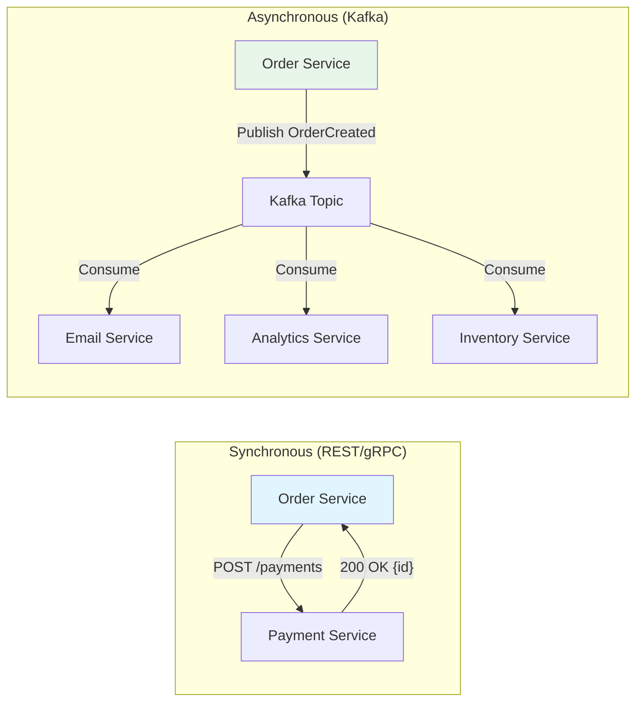

## WHY

In a monolith, services communicate via method calls. In microservices, they communicate over the network — and how you choose to do this (synchronous REST, gRPC, or asynchronous messaging via Kafka/RabbitMQ) determines your system's latency, coupling, reliability, and failure modes.

Choosing wrong means: cascading failures from synchronous chains, data inconsistency from fire-and-forget async, or operational nightmares from event schema evolution. This is a core topic in every system design and architecture interview.

---

## THEORY

### Synchronous Communication (Request-Response)

The caller sends a request and **blocks waiting** for the response before continuing.

**Protocols:**
- **REST/HTTP**: JSON over HTTP/1.1 or HTTP/2. Universal, simple, well-tooled.
- **gRPC**: Protocol Buffers over HTTP/2. Binary serialization, streaming, code-gen. 7-10x faster than REST for internal service communication.

**When to use:**
- The caller NEEDS the response to continue (e.g., auth check, data fetch for API response)
- Low latency critical (gRPC < 5ms internal, REST ~10-20ms)
- Simple request-response semantics

**Drawbacks:**
- Temporal coupling: both services must be UP at the same time
- Cascading failures: if downstream is slow, upstream threads pile up
- Chain amplification: A → B → C → D — one slow service affects the entire chain

### Asynchronous Communication (Event-Driven)

The sender publishes a message/event and **does not wait** for a response. The consumer processes it later.

**Technologies:**
- **Apache Kafka**: Distributed log-based broker. Events stored durably. Replay possible. Best for event streaming.
- **RabbitMQ**: Traditional message queue. Point-to-point or pub/sub. Best for task queues and simple async.
- **AWS SQS/SNS**: Managed alternatives.

**When to use:**
- The sender doesn't need an immediate response (email, notification, analytics)
- Decoupling: services can be deployed/scaled independently
- Resilience: if consumer is down, messages queue up and process later
- Event sourcing / CQRS architectures

**Drawbacks:**
- Eventual consistency (not immediately visible)
- Debugging is harder (distributed trace required)
- Message ordering, deduplication, and schema evolution add complexity

### Comparison Matrix

| Criterion | REST (Sync) | gRPC (Sync) | Kafka (Async) |
|-----------|-------------|-------------|---------------|
| Coupling | High (temporal) | High (temporal) | Low (decoupled) |
| Latency | ~10-20ms | ~1-5ms | Variable (ms to seconds) |
| Reliability | Both must be UP | Both must be UP | Producer/consumer independent |
| Schema | JSON (flexible) | Protobuf (strict, versioned) | Avro/JSON (schema registry) |
| Debugging | Easy (request/response) | Moderate | Hard (distributed traces) |
| Best for | External APIs, simple CRUD | Internal high-perf comms | Event streaming, side effects |

### Service Discovery

How does Service A find Service B's address? Options:
1. **Client-side discovery**: Eureka/Consul — client queries registry, load-balances itself
2. **Server-side discovery**: AWS ALB/Kubernetes Service — platform routes to healthy instances
3. **Service mesh**: Istio/Linkerd — sidecar proxy handles discovery + retry + circuit breaking transparently

---

## VISUALIZATION_CONFIG



---

## CODE

### Level 1 — REST Communication with RestTemplate/WebClient

```java
// Modern approach: WebClient (non-blocking) over RestTemplate (deprecated for new code)
@Service
@RequiredArgsConstructor
public class PaymentClient {

    private final WebClient webClient;

    public PaymentResult chargePayment(UUID orderId, BigDecimal amount) {
        return webClient.post()
            .uri("/v1/payments/charge")
            .bodyValue(new ChargeRequest(orderId, amount))
            .retrieve()
            .onStatus(HttpStatusCode::is4xxClientError, response ->
                Mono.error(new PaymentDeclinedException("Payment declined")))
            .onStatus(HttpStatusCode::is5xxServerError, response ->
                Mono.error(new PaymentServiceException("Payment service unavailable")))
            .bodyToMono(PaymentResult.class)
            .timeout(Duration.ofSeconds(5)) // Don't wait forever!
            .block(); // Block for synchronous usage
    }
}

// WebClient configuration with connection pooling
@Configuration
public class WebClientConfig {

    @Bean
    public WebClient paymentWebClient() {
        HttpClient httpClient = HttpClient.create()
            .responseTimeout(Duration.ofSeconds(5))
            .option(ChannelOption.CONNECT_TIMEOUT_MILLIS, 3000);

        return WebClient.builder()
            .baseUrl("http://payment-service:8082")
            .clientConnector(new ReactorClientHttpConnector(httpClient))
            .defaultHeader("Content-Type", "application/json")
            .build();
    }
}
```

### Level 2 — Kafka Event Publishing

```java
// Producer: publishes domain events
@Service
@RequiredArgsConstructor
@Slf4j
public class OrderEventPublisher {

    private final KafkaTemplate<String, Object> kafkaTemplate;

    public void publishOrderCreated(Order order) {
        OrderCreatedEvent event = new OrderCreatedEvent(
            order.getId(),
            order.getUserId(),
            order.getItems(),
            order.getTotalAmount(),
            Instant.now()
        );

        // Use orderId as key → ensures ordering per order
        kafkaTemplate.send("order.events", order.getId().toString(), event)
            .whenComplete((result, ex) -> {
                if (ex != null) {
                    log.error("Failed to publish OrderCreated for {}", order.getId(), ex);
                } else {
                    log.info("Published OrderCreated to partition {} offset {}",
                        result.getRecordMetadata().partition(),
                        result.getRecordMetadata().offset());
                }
            });
    }
}

// Consumer: processes events asynchronously
@Service
@RequiredArgsConstructor
@Slf4j
public class OrderEventConsumer {

    private final EmailService emailService;
    private final AnalyticsService analyticsService;

    @KafkaListener(topics = "order.events", groupId = "email-service")
    public void handleOrderCreated(OrderCreatedEvent event) {
        log.info("Processing OrderCreated event: {}", event.getOrderId());

        try {
            emailService.sendOrderConfirmation(event);
        } catch (Exception e) {
            log.error("Failed to process order event {}: {}", event.getOrderId(), e.getMessage());
            // In production: send to DLQ (Dead Letter Queue) for manual investigation
            throw e; // Rethrow → Kafka retries with backoff
        }
    }
}
```

### Level 3 — Kafka Configuration for Production

```yaml
# application.yml
spring:
  kafka:
    bootstrap-servers: ${KAFKA_SERVERS:localhost:9092}
    producer:
      key-serializer: org.apache.kafka.common.serialization.StringSerializer
      value-serializer: org.springframework.kafka.support.serializer.JsonSerializer
      acks: all                          # Wait for all replicas to acknowledge
      retries: 3
      properties:
        enable.idempotence: true         # Exactly-once semantics for producer
        max.in.flight.requests.per.connection: 5
    consumer:
      group-id: ${spring.application.name}
      auto-offset-reset: earliest        # Start from beginning if no offset exists
      key-deserializer: org.apache.kafka.common.serialization.StringDeserializer
      value-deserializer: org.springframework.kafka.support.serializer.JsonDeserializer
      properties:
        spring.json.trusted.packages: "com.devmastery.*"
        max.poll.interval.ms: 300000     # 5 min max processing time before rebalance
```

```java
// Dead Letter Queue configuration for failed messages
@Configuration
public class KafkaConfig {

    @Bean
    public ConcurrentKafkaListenerContainerFactory<String, Object> kafkaListenerContainerFactory(
            ConsumerFactory<String, Object> consumerFactory,
            KafkaTemplate<String, Object> kafkaTemplate) {

        ConcurrentKafkaListenerContainerFactory<String, Object> factory =
            new ConcurrentKafkaListenerContainerFactory<>();
        factory.setConsumerFactory(consumerFactory);
        factory.setConcurrency(3); // 3 consumer threads

        // Dead Letter Queue: after 3 retries, send to *.DLT topic
        factory.setCommonErrorHandler(new DefaultErrorHandler(
            new DeadLetterPublishingRecoverer(kafkaTemplate),
            new FixedBackOff(1000, 3)  // 1s delay, 3 attempts
        ));

        return factory;
    }
}
```

### Level 4 — gRPC for High-Performance Internal Communication

```protobuf
// product_service.proto
syntax = "proto3";
package com.devmastery.product;

service ProductService {
  rpc GetProduct (GetProductRequest) returns (ProductResponse);
  rpc ListProducts (ListProductsRequest) returns (stream ProductResponse); // Server streaming
}

message GetProductRequest {
  string product_id = 1;
}

message ProductResponse {
  string id = 1;
  string title = 2;
  double price = 3;
  int32 stock_quantity = 4;
}
```

```java
// gRPC Client (Spring Boot + grpc-spring-boot-starter)
@Service
@RequiredArgsConstructor
public class ProductGrpcClient {

    @GrpcClient("product-service")
    private ProductServiceGrpc.ProductServiceBlockingStub productStub;

    public ProductResponse getProduct(String productId) {
        try {
            return productStub
                .withDeadlineAfter(3, TimeUnit.SECONDS) // Timeout
                .getProduct(GetProductRequest.newBuilder()
                    .setProductId(productId)
                    .build());
        } catch (StatusRuntimeException e) {
            if (e.getStatus().getCode() == Status.Code.NOT_FOUND) {
                throw new ProductNotFoundException(productId);
            }
            throw new ServiceUnavailableException("Product service unavailable", e);
        }
    }
}
```

---

## REAL_WORLD

### How Uber Uses Both Sync and Async

Uber's ride-matching is **synchronous** (gRPC): the app calls the matching service, which must respond in <100ms with a driver assignment. But everything AFTER the match is **async**: driver notification (push), ETA calculation updates (Kafka stream), trip analytics (Kafka → data lake). The rule: sync for user-facing real-time, async for everything else.

### Airbnb's Event-Driven Architecture

When a guest books a stay on Airbnb, the booking service publishes a `BookingConfirmed` event to Kafka. Independent consumers: payment service charges the guest, host notification service emails the host, calendar service blocks the dates, analytics service logs the booking, and fraud detection service scores the transaction. None of these need to be real-time from the guest's perspective — eventual consistency is fine.

---

## INTERVIEW

**Q1: When would you choose synchronous over asynchronous communication?**
> **Synchronous (REST/gRPC)**: when the caller NEEDS the response to proceed: data queries, validation checks (auth, credit check), real-time user-facing operations where the response builds the HTTP response directly. **Asynchronous (Kafka/RabbitMQ)**: when the caller doesn't need an immediate response: notifications, analytics, audit logging, cross-service data replication, long-running processes. Rule of thumb: if removing the downstream service would break the user experience, it's sync. If it's a side effect, it's async.

**Q2: How do you handle the situation where an async consumer is down?**
> That's the entire benefit of messaging brokers: messages are **durably stored** and wait for the consumer to come back. Kafka retains messages for a configurable time (7 days default). When the consumer restarts, it reads from its last committed offset and catches up. For critical messages where order matters, ensure the consumer uses `acks` properly and DLQ handles poison messages. For SQS, unprocessed messages become visible again after the visibility timeout.

**Q3: What is the Outbox Pattern? Why is it needed?**
> Problem: You need to update a database AND publish a Kafka event atomically. If the DB commits but Kafka publish fails, you have inconsistency. The Outbox Pattern: (1) Write the event to an `outbox` table in the SAME database transaction as the main write. (2) A separate CDC (Change Data Capture) tool like Debezium reads the outbox table and publishes to Kafka. (3) This guarantees at-least-once delivery because the DB commit is the single source of truth. It eliminates the dual-write problem.

**Q4: gRPC vs REST — when would you choose gRPC?**
> gRPC when: (1) Internal service-to-service calls where you control both client and server. (2) Performance critical — Protobuf binary serialization is 7-10x smaller/faster than JSON. (3) You need streaming (bidirectional or server-side). (4) Strict schema enforcement with code generation. REST when: (1) Public-facing APIs (better browser/tool support). (2) You need human-readable payloads for debugging. (3) Integration with third parties who expect REST. (4) Simple CRUD operations where performance isn't the bottleneck.

---

## FEYNMAN CHECK

**Synchronous = Phone call**: You call your friend, they pick up, you ask a question, they answer. You're stuck on the phone the whole time. If they don't pick up, you're blocked.

**Asynchronous = Text message**: You send a text and go about your day. They respond when they can. If their phone is off, the message waits in the system until they turn it on.

**Kafka = Billboard**: You post a message on a public billboard (topic). Anyone who's subscribed to that billboard (consumer group) reads it. Multiple groups can read the same billboard independently. The billboard keeps old messages visible for days (retention) even after they've been read.

**gRPC vs REST**: REST is like mailing a letter (text-based, human-readable, universal). gRPC is like sending a binary file over a dedicated fiber line (fast, compact, requires special tools to read, but 10x more efficient).

---

## BUILD

**Challenge: Build a multi-service e-commerce flow using both sync and async.**

Requirements:
1. `OrderService` receives `POST /orders` — creates order and returns orderId (sync)
2. `OrderService` calls `InventoryService` via REST (sync) to reserve stock — must succeed before order is confirmed
3. After successful order creation, `OrderService` publishes `OrderCreatedEvent` to Kafka
4. `EmailService` consumes `OrderCreatedEvent` and logs "email sent" (async consumer)
5. `AnalyticsService` consumes the same event independently (separate consumer group)
6. Configure Kafka DLQ: if email sending fails 3 times, message goes to `order.events.DLT` topic
7. Write integration test using embedded Kafka (`spring-kafka-test`) verifying the full flow

---

## SPACED REVIEW

- **Synchronous**: caller blocks waiting for response — temporal coupling, cascading failure risk
- **Asynchronous**: fire-and-forget/event-driven — temporal decoupling, eventual consistency
- REST: JSON/HTTP, universal, human-readable; gRPC: Protobuf/HTTP2, fast, streaming, codegen
- Kafka: distributed log (ordered, replay, durable); RabbitMQ: message queue (acknowledgement, routing)
- **Outbox Pattern**: write event to DB table + CDC to Kafka → avoids dual-write consistency issue
- **Consumer group**: multiple instances consume same topic with partition assignment (parallelism)
- **Dead Letter Queue (DLQ)**: failed messages after max retries → manual investigation
- **Idempotency**: consumer must handle receiving the same message twice safely
- Service discovery: Eureka (client-side), K8s Service (server-side), Istio (mesh)
- Key rule: sync for user-facing real-time responses, async for side effects and decoupled processing

