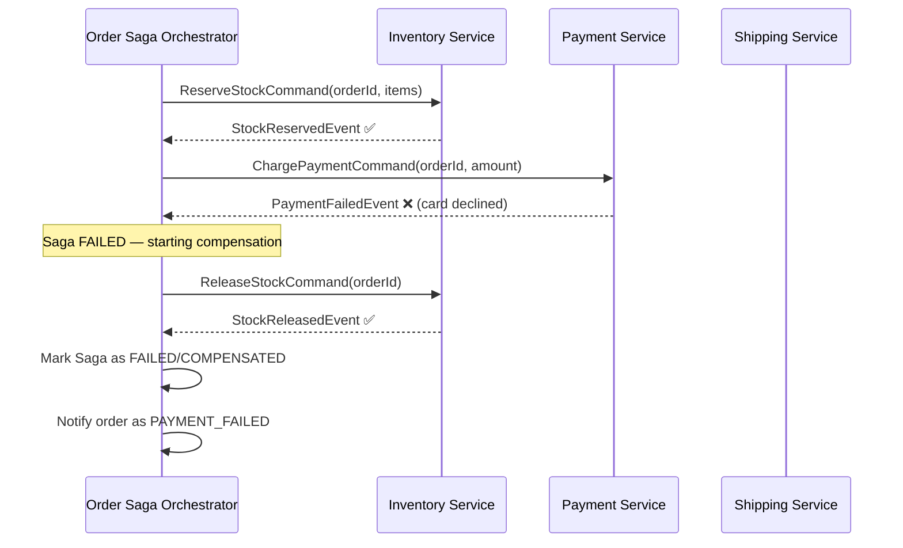

## WHY

In microservices, you can't use a single database transaction across multiple services — each service owns its data. But you still need to coordinate multi-step operations that must be consistent: placing an order involves deducting inventory, charging payment, and sending a confirmation. If payment fails, inventory must be restored.

This is the **distributed transaction problem**, and the Saga pattern is the industry standard solution. Every senior backend engineer, solutions architect, and distributed systems interview will probe your understanding of Sagas vs. 2PC, orchestration vs. choreography, and how to handle compensating transactions.

---

## THEORY

### What is a Saga?

A Saga is a sequence of **local transactions** where each step publishes an event or sends a command that triggers the next step. If any step fails, **compensating transactions** are executed in reverse to undo the completed steps.

Key property: **Eventual consistency**, not ACID. The system will be consistent eventually, but there's a window where it's in an intermediate state.

### Two Implementation Styles

**1. Choreography (Event-Driven)**
Each service listens for events and reacts. No central coordinator. Services communicate via events (Kafka, RabbitMQ).

```
OrderService → publishes OrderCreated
    InventoryService listens → reserves stock → publishes StockReserved
        PaymentService listens → charges card → publishes PaymentProcessed
            ShippingService listens → creates shipment
```

**Pros**: Loose coupling, no single point of failure.
**Cons**: Hard to trace/debug, implicit workflow scattered across services, risk of cyclic dependencies.

**2. Orchestration (Central Coordinator)**
A dedicated Saga Orchestrator sends commands to each service and reacts to replies. The workflow is explicit and centralized.

```
SagaOrchestrator → send ReserveStockCommand to InventoryService
SagaOrchestrator ← receives StockReservedEvent
SagaOrchestrator → send ChargePaymentCommand to PaymentService
SagaOrchestrator ← receives PaymentFailedEvent
SagaOrchestrator → send ReleaseStockCommand to InventoryService (compensation!)
```

**Pros**: Clear workflow, easier debugging, centralized state.
**Cons**: Orchestrator can become a bottleneck; coupling to orchestrator.

### Compensating Transactions

For each forward transaction, you must define its compensating transaction (undo operation):

| Step | Forward Transaction | Compensating Transaction |
|------|-------------------|--------------------------|
| 1 | Reserve Inventory | Release Inventory |
| 2 | Charge Payment | Refund Payment |
| 3 | Create Shipment | Cancel Shipment |

**Critical**: Compensating transactions must be **idempotent** — if they're called multiple times due to retries, the result must be the same.

### Saga vs. Two-Phase Commit (2PC)

| | Saga | 2PC |
|--|------|-----|
| Locking | No global locks | Holds locks across all participants |
| Failure handling | Compensating transactions | Abort and rollback |
| Performance | High (async, no locks) | Low (blocking, lock contention) |
| Complexity | High (must design compensations) | Lower (protocol handles it) |
| Availability | High | Low (coordinator is SPOF) |
| Consistency | **Eventual** | **Strong (ACID)** |

2PC is rarely used in modern microservices because holding distributed locks kills availability.

---

## VISUALIZATION_CONFIG



---

## CODE

### Level 1 — Choreography with Spring Kafka

```java
// OrderService — publishes event after creating order
@Service
@RequiredArgsConstructor
public class OrderService {

    private final OrderRepository orderRepository;
    private final KafkaTemplate<String, Object> kafkaTemplate;

    @Transactional
    public Order createOrder(CreateOrderRequest req) {
        Order order = orderRepository.save(new Order(req, OrderStatus.PENDING));

        // Publish event — Inventory Service will react
        kafkaTemplate.send("order.created", new OrderCreatedEvent(
            order.getId(),
            req.getUserId(),
            req.getItems(),
            req.getTotalAmount()
        ));

        return order;
    }

    // Called when PaymentService publishes PaymentFailedEvent
    @KafkaListener(topics = "payment.failed")
    public void handlePaymentFailed(PaymentFailedEvent event) {
        orderRepository.findById(event.getOrderId()).ifPresent(order -> {
            order.setStatus(OrderStatus.FAILED);
            orderRepository.save(order);
        });
    }
}

// InventoryService — listens and reacts
@Service
@RequiredArgsConstructor
public class InventoryService {

    private final InventoryRepository inventoryRepository;
    private final KafkaTemplate<String, Object> kafkaTemplate;

    @KafkaListener(topics = "order.created")
    @Transactional
    public void handleOrderCreated(OrderCreatedEvent event) {
        try {
            event.getItems().forEach(item ->
                inventoryRepository.reserve(item.getProductId(), item.getQuantity())
            );
            kafkaTemplate.send("inventory.reserved", new InventoryReservedEvent(event.getOrderId()));
        } catch (InsufficientStockException e) {
            kafkaTemplate.send("inventory.failed", new InventoryFailedEvent(event.getOrderId(), e.getMessage()));
        }
    }

    // Compensation: listen for payment failure, release reserved stock
    @KafkaListener(topics = "payment.failed")
    @Transactional
    public void handlePaymentFailed(PaymentFailedEvent event) {
        inventoryRepository.releaseReservation(event.getOrderId());
        kafkaTemplate.send("inventory.released", new InventoryReleasedEvent(event.getOrderId()));
    }
}
```

### Level 2 — Orchestration with Spring State Machine

```java
@Component
@RequiredArgsConstructor
@Slf4j
public class OrderSagaOrchestrator {

    private final InventoryClient inventoryClient;
    private final PaymentClient paymentClient;
    private final ShippingClient shippingClient;
    private final SagaStateRepository sagaStateRepository;

    public void executeSaga(Order order) {
        SagaState state = sagaStateRepository.save(new SagaState(order.getId(), SagaStatus.STARTED));

        try {
            // Step 1: Reserve Inventory
            log.info("Saga[{}]: Reserving inventory", order.getId());
            inventoryClient.reserve(order.getId(), order.getItems());
            state.complete(SagaStep.INVENTORY_RESERVED);
            sagaStateRepository.save(state);

            // Step 2: Charge Payment
            log.info("Saga[{}]: Processing payment", order.getId());
            paymentClient.charge(order.getId(), order.getTotalAmount());
            state.complete(SagaStep.PAYMENT_CHARGED);
            sagaStateRepository.save(state);

            // Step 3: Create Shipment
            log.info("Saga[{}]: Creating shipment", order.getId());
            shippingClient.createShipment(order.getId());
            state.complete(SagaStep.SHIPMENT_CREATED);
            state.setStatus(SagaStatus.COMPLETED);
            sagaStateRepository.save(state);

        } catch (PaymentException e) {
            log.error("Saga[{}]: Payment failed — compensating", order.getId());
            compensate(state, order);
        } catch (ShippingException e) {
            log.error("Saga[{}]: Shipping failed — compensating", order.getId());
            compensate(state, order);
        }
    }

    private void compensate(SagaState state, Order order) {
        // Compensate in REVERSE order
        if (state.isCompleted(SagaStep.SHIPMENT_CREATED)) {
            shippingClient.cancelShipment(order.getId());
        }
        if (state.isCompleted(SagaStep.PAYMENT_CHARGED)) {
            paymentClient.refund(order.getId()); // Idempotent!
        }
        if (state.isCompleted(SagaStep.INVENTORY_RESERVED)) {
            inventoryClient.releaseReservation(order.getId()); // Idempotent!
        }
        state.setStatus(SagaStatus.COMPENSATED);
        sagaStateRepository.save(state);
    }
}
```

### Level 3 — Idempotency Key Pattern (Critical for Production)

```java
@Service
@RequiredArgsConstructor
public class PaymentService {

    private final PaymentRepository paymentRepository;
    private final IdempotencyKeyStore idempotencyStore;

    /**
     * Idempotent payment processing.
     * If the same orderId is charged twice (e.g., due to retry), return the existing result.
     */
    @Transactional
    public PaymentResult charge(UUID orderId, BigDecimal amount) {
        // Check if we've already processed this orderId
        return idempotencyStore.findByKey(orderId.toString())
            .map(record -> record.getResult(PaymentResult.class))
            .orElseGet(() -> {
                PaymentResult result = processCharge(orderId, amount);
                idempotencyStore.store(orderId.toString(), result);
                return result;
            });
    }

    @Transactional
    public PaymentResult refund(UUID orderId) {
        // Idempotent: if already refunded, return the existing refund record
        return paymentRepository.findRefundByOrderId(orderId)
            .map(r -> new PaymentResult(r.getId(), "ALREADY_REFUNDED"))
            .orElseGet(() -> {
                Payment original = paymentRepository.findByOrderId(orderId)
                    .orElseThrow(() -> new PaymentNotFoundException(orderId));
                return processRefund(original);
            });
    }
}
```

---

## REAL_WORLD

### Amazon's Order Fulfillment

Amazon's checkout involves 20+ microservices: inventory check, fraud detection, payment processing, warehouse allocation, carrier selection, and email notification. Each is a Saga step. Amazon uses **orchestration** for the critical payment flow (explicit, auditable, compensatable) and **choreography** for notification events (loosely coupled). When a warehouse runs out of stock after an order is placed, the compensation logic automatically finds the next available warehouse or cancels and refunds.

### Uber Eats Order Flow

When you place a food order: the restaurant is notified (step 1), a driver is assigned (step 2), your payment is charged when pickup is confirmed (step 3). If the restaurant cancels after a driver is assigned, Uber's saga orchestrator runs compensations: release the driver, don't charge the customer. The key insight: **charge happens LAST** to minimize compensation complexity.

---

## INTERVIEW

**Q1: What is the Saga pattern and why is it needed in microservices?**
> A Saga is a sequence of local transactions with compensating transactions for failure rollback. It's needed because in microservices, each service owns its own database, making distributed ACID transactions impossible (or impractical). The Saga pattern achieves eventual consistency without distributed locks.

**Q2: Choreography vs. Orchestration — when would you choose each?**
> **Choreography**: Choose when you want loose coupling, have simple workflows, and the team is comfortable debugging distributed event flows. Good for domain events that multiple services care about. **Orchestration**: Choose when the workflow is complex, has many conditional branches, requires centralized monitoring/auditing, or the business process is the core domain. Netflix uses orchestration for critical billing flows for exactly this reason.

**Q3: What is a compensating transaction? What properties must it have?**
> A compensating transaction reverses the effect of a completed Saga step when the overall Saga needs to roll back. It must be: (1) **Idempotent** — safe to execute multiple times. (2) **Always succeeds** — or retried until it does (cannot fail and leave the system inconsistent). (3) **Semantically correct** — a "refund" is not just deleting the charge record; it's a credit back with proper accounting.

**Q4: How do you ensure exactly-once processing in a Saga?**
> Use **idempotency keys** (also called deduplication IDs). Each Saga step checks if it has already processed the given ID before acting. In Kafka, set `enable.idempotence=true` for producers and use consumer group offsets carefully. Store the result of each step so retries return the cached result instead of double-processing.

**Q5: What happens if the orchestrator crashes mid-Saga?**
> This is why **saga state persistence** is critical. The orchestrator must persist the current step and all completed steps to a database before executing each step. On restart, it reads the persisted state and continues from where it left off (or starts compensation if it was mid-compensation). Tools like **Axon Framework** and **Eventuate Tram** handle this out of the box.

---

## FEYNMAN CHECK

Imagine you're booking a vacation involving 3 separate vendors: a flight, a hotel, and a rental car. You can't book all three "atomically" — they're separate companies. So you:

1. Book the flight (step 1, forward transaction)
2. Book the hotel (step 2, forward transaction)
3. Try to book the car — it's unavailable! (failure!)

Now you have to **undo what you did**:
- Cancel the hotel (compensating transaction 2)
- Cancel the flight (compensating transaction 1)

That's a Saga. Each step is reversible, and you execute those reversals in the opposite order when something goes wrong.

The "orchestration" version: a travel agency (orchestrator) makes all the bookings on your behalf and handles cancellations.

The "choreography" version: you book the flight, the hotel automatically gets notified and books itself (you printed the flight confirmation on the booking form), the car rental does the same. If the car fails, it publishes a "car unavailable" event, and the hotel automatically cancels itself. No travel agency involved.

---

## BUILD

**Challenge: Implement an order placement Saga with full compensation.**

Requirements:
1. Services: `OrderService`, `InventoryService`, `PaymentService`
2. Create an `OrderSagaOrchestrator` that executes steps sequentially
3. If `PaymentService` throws `PaymentDeclinedException`, automatically call `InventoryService.releaseReservation()`
4. All compensating transactions must be idempotent (verify with tests that calling them twice has no side effects)
5. Persist saga state to a database after each step completion
6. Write integration tests simulating: (a) full success, (b) payment failure with compensation, (c) orchestrator "crash" and restart resuming from saved state

---

## SPACED REVIEW

- Saga = sequence of local transactions + compensating transactions for rollback
- **Eventual consistency** (not ACID) — system converges to consistent state over time
- **Choreography** = event-driven, no coordinator, loose coupling, hard to debug
- **Orchestration** = central coordinator, explicit flow, easier to audit
- Compensating transactions must be **idempotent** (safe to run multiple times)
- **Idempotency key** = unique ID stored to prevent double-processing on retries
- Saga vs 2PC: Saga = no locks + eventual consistency; 2PC = distributed locks + strong consistency
- Persist saga state after each step to survive orchestrator crashes
- Never charge the customer first — charge last to minimize compensation complexity
- Tools: Axon Framework, Eventuate Tram, Apache Camel, Temporal.io

