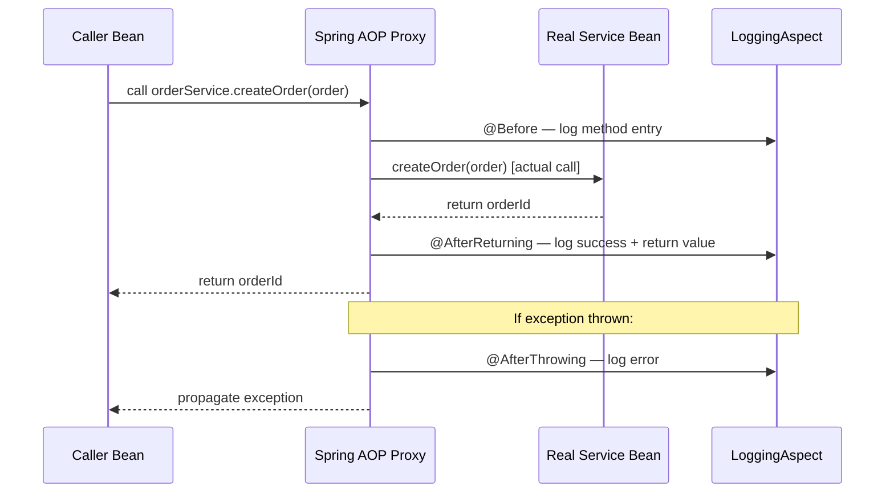

## WHY

Cross-cutting concerns — logging, security checks, performance monitoring, retry logic, transaction management — are required by almost every method in an enterprise application. Without AOP, you're copy-pasting the same boilerplate into hundreds of methods, violating DRY and making code a maintenance nightmare.

AOP lets you define this behaviour **once** as an `@Aspect` and weave it into any matching method automatically. Spring uses AOP internally for `@Transactional`, `@Cacheable`, `@Async`, `@Retryable`, and `@Secured`. Understanding AOP is how you graduate from "Spring user" to "Spring expert."

---

## THEORY

### Core AOP Concepts

| Term | Definition |
|------|-----------|
| **Aspect** | A class annotated `@Aspect` that encapsulates cross-cutting concern (e.g., logging) |
| **Join Point** | Any point in execution where advice can be injected (Spring only supports method execution) |
| **Pointcut** | An expression that defines WHICH join points to intercept |
| **Advice** | The code to run at a join point (`@Before`, `@After`, `@Around`, etc.) |
| **Weaving** | The process of linking aspects to the target object. Spring does this at runtime via proxies |

### Advice Types

- `@Before` — runs **before** the method. Cannot prevent execution (use `@Around` for that).
- `@After` — runs **after** the method, regardless of outcome (like `finally`).
- `@AfterReturning` — runs only if the method returned normally. Can inspect the return value.
- `@AfterThrowing` — runs only if the method threw an exception. Can inspect the exception.
- `@Around` — wraps the entire method. Most powerful: can prevent execution, modify args/return, time the call.

### How Spring AOP Works (Proxy Pattern)

Spring creates a **dynamic proxy** wrapping your bean. When another bean calls your method, the call goes through the proxy, which intercepts it according to defined pointcuts. Two types:

1. **JDK Dynamic Proxy** (interface-based): if bean implements an interface, Spring proxies the interface.
2. **CGLIB Proxy** (subclass-based): if bean has no interface, Spring creates a subclass at runtime.

**Limitation**: AOP only works on beans calling OTHER beans. Self-invocation (`this.method()`) bypasses the proxy.

### Pointcut Expressions (AspectJ Syntax)

```
execution(modifiers? return-type declaring-type.method(params) throws?)
```

Examples:
- `execution(* com.myapp.service.*.*(..))` — any method in any service class
- `execution(public * com.myapp..*.*(..))` — any public method anywhere in `com.myapp`
- `@annotation(org.springframework.transaction.annotation.Transactional)` — any `@Transactional` method
- `within(com.myapp.controller..*)` — any method in controller package or sub-packages

---

## VISUALIZATION_CONFIG



---

## CODE

### Level 1 — Basic Logging Aspect

```java
package com.devmastery.aspect;

import lombok.extern.slf4j.Slf4j;
import org.aspectj.lang.JoinPoint;
import org.aspectj.lang.annotation.*;
import org.springframework.stereotype.Component;
import java.util.Arrays;

@Slf4j
@Aspect
@Component
public class LoggingAspect {

    // Pointcut: all public methods in any service class
    @Pointcut("execution(public * com.devmastery.service..*(..))")
    private void serviceLayer() {}

    @Before("serviceLayer()")
    public void logMethodEntry(JoinPoint jp) {
        log.info("→ Entering: {}.{}() with args: {}",
            jp.getTarget().getClass().getSimpleName(),
            jp.getSignature().getName(),
            Arrays.toString(jp.getArgs()));
    }

    @AfterReturning(pointcut = "serviceLayer()", returning = "result")
    public void logMethodExit(JoinPoint jp, Object result) {
        log.info("← Exiting: {}.{}() → returned: {}",
            jp.getTarget().getClass().getSimpleName(),
            jp.getSignature().getName(),
            result);
    }

    @AfterThrowing(pointcut = "serviceLayer()", throwing = "ex")
    public void logException(JoinPoint jp, Exception ex) {
        log.error("✗ Exception in {}.{}(): {}",
            jp.getTarget().getClass().getSimpleName(),
            jp.getSignature().getName(),
            ex.getMessage());
    }
}
```

### Level 2 — Performance Monitoring with `@Around`

```java
@Slf4j
@Aspect
@Component
public class PerformanceAspect {

    // Apply to any method annotated with custom @Monitored annotation
    @Around("@annotation(com.devmastery.annotation.Monitored)")
    public Object measureExecutionTime(ProceedingJoinPoint pjp) throws Throwable {
        String method = pjp.getSignature().toShortString();
        long startTime = System.currentTimeMillis();

        try {
            Object result = pjp.proceed(); // Execute the actual method
            long duration = System.currentTimeMillis() - startTime;
            log.info("[PERF] {} completed in {}ms", method, duration);

            if (duration > 500) {
                log.warn("[PERF] SLOW QUERY: {} took {}ms — investigate!", method, duration);
            }
            return result;
        } catch (Throwable t) {
            long duration = System.currentTimeMillis() - startTime;
            log.error("[PERF] {} FAILED after {}ms", method, duration);
            throw t; // Re-throw — never swallow exceptions in @Around
        }
    }
}

// Custom annotation to mark methods for monitoring
@Target(ElementType.METHOD)
@Retention(RetentionPolicy.RUNTIME)
public @interface Monitored {}

// Usage
@Service
public class ProductService {
    @Monitored
    public List<Product> searchProducts(String query) { ... }
}
```

### Level 3 — Retry Aspect (Production Pattern)

```java
@Slf4j
@Aspect
@Component
public class RetryAspect {

    @Around("@annotation(retryable)")
    public Object retryOnFailure(ProceedingJoinPoint pjp, Retryable retryable) throws Throwable {
        int maxAttempts = retryable.maxAttempts();
        long delayMs = retryable.delayMs();
        Class<? extends Throwable>[] retryOn = retryable.retryOn();

        Exception lastException = null;

        for (int attempt = 1; attempt <= maxAttempts; attempt++) {
            try {
                return pjp.proceed();
            } catch (Exception e) {
                // Only retry for specified exception types
                boolean shouldRetry = Arrays.stream(retryOn)
                    .anyMatch(cls -> cls.isAssignableFrom(e.getClass()));

                if (!shouldRetry || attempt == maxAttempts) {
                    throw e;
                }

                lastException = e;
                log.warn("Attempt {}/{} failed for {}. Retrying in {}ms...",
                    attempt, maxAttempts, pjp.getSignature().getName(), delayMs);

                Thread.sleep(delayMs * attempt); // Exponential backoff
            }
        }
        throw lastException;
    }
}

// Annotation definition
@Target(ElementType.METHOD)
@Retention(RetentionPolicy.RUNTIME)
public @interface Retryable {
    int maxAttempts() default 3;
    long delayMs() default 100;
    Class<? extends Throwable>[] retryOn() default {RuntimeException.class};
}

// Usage
@Service
public class PaymentGatewayService {
    @Retryable(maxAttempts = 3, delayMs = 200, retryOn = {NetworkException.class})
    public PaymentResult charge(CreditCard card, BigDecimal amount) { ... }
}
```

### Level 4 — Security Audit Aspect

```java
@Slf4j
@Aspect
@Component
@RequiredArgsConstructor
public class SecurityAuditAspect {

    private final AuditLogRepository auditLogRepository;

    // Intercept any method annotated with Spring's @PreAuthorize
    @AfterReturning("@annotation(org.springframework.security.access.prepost.PreAuthorize)")
    public void auditSecureMethodAccess(JoinPoint jp) {
        String username = SecurityContextHolder.getContext()
            .getAuthentication().getName();
        String action = jp.getSignature().toShortString();

        auditLogRepository.save(AuditLog.builder()
            .username(username)
            .action(action)
            .timestamp(Instant.now())
            .build());
    }

    @AfterThrowing(
        pointcut = "@annotation(org.springframework.security.access.prepost.PreAuthorize)",
        throwing = "ex"
    )
    public void auditSecurityViolation(JoinPoint jp, AccessDeniedException ex) {
        String username = SecurityContextHolder.getContext()
            .getAuthentication().getName();
        log.warn("SECURITY: User '{}' denied access to '{}'", username, jp.getSignature());
    }
}
```

---

## REAL_WORLD

### How Spring `@Transactional` Uses AOP

`@Transactional` is implemented entirely as an AOP aspect internally. Spring's `TransactionInterceptor` is an `@Around` advice that:
1. Opens a connection and begins a transaction before the method
2. Commits if the method returns normally
3. Rolls back if a `RuntimeException` is thrown

You can see this by adding `org.springframework.transaction=TRACE` to your logs — you'll see the proxy intercepting calls.

### Uber's Use of AOP for Rate Limiting

Uber's Java microservices use a custom `@RateLimit(rpm = 1000)` annotation processed by an AOP aspect. The aspect checks a Lua-scripted Redis counter before allowing the method to proceed, rejecting calls that exceed the limit with HTTP 429. This keeps the rate-limiting logic completely separated from business logic.

---

## INTERVIEW

**Q1: What are the two proxy types in Spring AOP? When is each used?**
> **JDK Dynamic Proxy**: Used when the target bean implements at least one interface. Creates a proxy that implements the same interface(s). **CGLIB Proxy**: Used when the target bean doesn't implement any interface. Creates a runtime subclass. In Spring Boot, CGLIB is the default for `@Configuration` classes. Note: CGLIB cannot proxy `final` classes or methods.

**Q2: Why doesn't AOP work with `this.method()` calls?**
> Spring AOP is proxy-based. When you call `this.method()`, you're calling the real object directly, completely bypassing the proxy. The proxy never gets involved, so no advice is executed. Fix: get the Spring-managed proxy via `(MyService) AopContext.currentProxy()` after enabling `@EnableAspectJAutoProxy(exposeProxy = true)`.

**Q3: What is the difference between `@Before` and `@Around`?**
> `@Before` runs before the method but cannot prevent its execution or modify arguments. `@Around` wraps the entire method — you call `pjp.proceed()` to execute it, and can choose NOT to call it (blocking execution), modify arguments before calling, modify the return value, or catch and rethrow exceptions. `@Around` is the most powerful advice but also the easiest to misuse (forgetting to call `proceed()`, swallowing exceptions).

**Q4: What is AOP weaving? When does Spring do it?**
> Weaving is the process of linking aspect code to the target object. Spring does **runtime weaving** — proxy objects are created at application startup, wrapping target beans. This differs from AspectJ's **compile-time** or **load-time weaving** which modifies bytecode directly. Spring's runtime proxy approach is simpler but limited to method-level join points. AspectJ supports field access, constructor calls, etc.

**Q5: How would you apply an AOP aspect to all methods except one?**
> Use `!` negation in the pointcut: `@Pointcut("execution(* com.app.service..*(..)) && !execution(* com.app.service.UserService.login(..))")`. Alternatively, create a custom annotation `@NoLogging` and use `!@annotation(NoLogging)`.

---

## FEYNMAN CHECK

Imagine you work in an office building. Every time someone enters a conference room (calls a method), a security guard (AOP proxy) is standing at the door.

Before you enter, the guard checks your badge (runs `@Before` advice — logging, security check). After you leave, the guard notes the time (runs `@AfterReturning` advice — performance monitoring). If there's a fire alarm while you're inside (exception), the guard calls the fire department (`@AfterThrowing` — error logging).

The guard doesn't care what meeting you're having inside. They only care about the door. That's the beauty of AOP — the cross-cutting concerns (guarding the door) are completely separate from the business logic (the meeting inside).

The only catch: if you're already inside the room and you walk into a smaller room within it (self-invocation), the guard at the outer door doesn't see you go in — that's the proxy bypass problem.

---

## BUILD

**Challenge: Build a complete observability aspect for a REST API.**

Requirements:
1. Create `@Around` advice that times every method in `com.app.service` and logs slow queries (>200ms).
2. Create `@AfterThrowing` advice that catches `RuntimeException`s and publishes a `MeterRegistry` counter (`api.errors.count` tagged with `method` and `exception` name).
3. Create a custom `@Audited(action = "ORDER_CREATE")` annotation and an `@AfterReturning` advice that saves audit records to a repository.
4. Ensure the retry aspect from the theory section exponentially backs off (delay × attempt).
5. Write tests using `@SpringBootTest` verifying the aspect fires and the audit log is populated.

---

## SPACED REVIEW

- AOP Concepts: Aspect → Join Point → Pointcut → Advice → Weaving
- Spring AOP = **runtime proxy** (JDK interface proxy or CGLIB subclass proxy)
- Self-invocation (`this.method()`) **bypasses** the AOP proxy
- `@Before` = before, cannot stop; `@Around` = full wrap, can stop/modify
- `@AfterReturning` = only on success; `@AfterThrowing` = only on exception; `@After` = always (like finally)
- `ProceedingJoinPoint.proceed()` — MUST call this in `@Around` to actually run the method
- Pointcut syntax: `execution(modifiers return-type package.class.method(params))`
- `@annotation(...)` pointcut — targets methods annotated with a specific annotation
- Spring's `@Transactional`, `@Cacheable`, `@Async` are all AOP aspects internally

