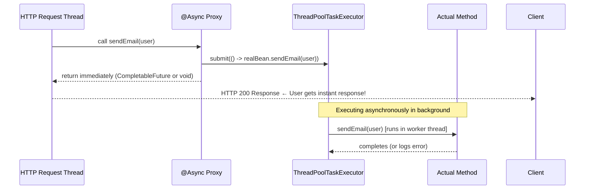

## WHY

Synchronous processing means your HTTP thread blocks while sending an email, pushing a notification, or writing to an audit log. For operations that don't need to complete before you respond to the user, this is wasted latency and wasted threads. `@Async` lets you fire-and-forget or parallelize operations with zero reactive boilerplate.

Real production use cases: sending confirmation emails, pushing webhooks, generating reports, warm-up cache after writes, posting to analytics systems.

---

## THEORY

### How @Async Works

Like `@Transactional`, `@Async` works via **AOP proxy**. When you call an `@Async` method, the proxy submits the work to a `TaskExecutor` (thread pool) and immediately returns a `CompletableFuture` or `void` to the caller. The original thread is free to continue.

**Rules:**
1. `@EnableAsync` must be on a `@Configuration` class
2. `@Async` only works when called from **another Spring bean** (proxy bypass applies)
3. The method must be `public` (CGLIB proxy requirement)
4. Self-invocation (`this.method()`) does **not** apply the async behaviour

### Thread Pool Configuration

If you don't configure a custom executor, Spring uses `SimpleAsyncTaskExecutor` which creates a **new thread for every call** — catastrophic in production. Always configure `ThreadPoolTaskExecutor`.

---

## VISUALIZATION_CONFIG



---

## CODE

### Level 1 — Basic Setup

```java
// Enable async on your main config or Spring Boot application
@SpringBootApplication
@EnableAsync
public class DevMasteryApplication { ... }

// Configure a proper thread pool — CRITICAL for production
@Configuration
@EnableAsync
public class AsyncConfig implements AsyncConfigurer {

    @Override
    @Bean(name = "taskExecutor")
    public Executor getAsyncExecutor() {
        ThreadPoolTaskExecutor executor = new ThreadPoolTaskExecutor();
        executor.setCorePoolSize(5);          // Always-alive threads
        executor.setMaxPoolSize(20);          // Max threads during burst
        executor.setQueueCapacity(100);       // Queue tasks before spawning new threads
        executor.setThreadNamePrefix("async-"); // Visible in thread dumps
        executor.setRejectedExecutionHandler(
            new ThreadPoolExecutor.CallerRunsPolicy() // Slow down caller if queue full
        );
        executor.initialize();
        return executor;
    }

    @Override
    public AsyncUncaughtExceptionHandler getAsyncUncaughtExceptionHandler() {
        // Handle exceptions from void @Async methods
        return (ex, method, params) ->
            log.error("Async error in method {}: {}", method.getName(), ex.getMessage(), ex);
    }
}
```

### Level 2 — Fire-and-Forget

```java
@Service
@RequiredArgsConstructor
@Slf4j
public class NotificationService {

    private final EmailClient emailClient;
    private final PushNotificationClient pushClient;
    private final AuditService auditService;

    // Fire-and-forget: caller doesn't wait for email to be sent
    @Async("taskExecutor")
    public void sendWelcomeEmail(User user) {
        try {
            emailClient.send(EmailRequest.builder()
                .to(user.getEmail())
                .subject("Welcome to DevMastery!")
                .template("welcome")
                .variable("name", user.getFullName())
                .build());
            log.info("Welcome email sent to {}", user.getEmail());
        } catch (Exception e) {
            log.error("Failed to send welcome email to {}: {}", user.getEmail(), e.getMessage());
            // Don't rethrow — this is async void, caller can't handle it anyway
        }
    }

    // Fire multiple notifications in parallel
    @Async("taskExecutor")
    public void notifyUserOrderShipped(UUID orderId, User user) {
        emailClient.sendOrderUpdate(user.getEmail(), orderId, "SHIPPED");
        pushClient.send(user.getDeviceToken(), "Your order is on its way! 🚚");
        auditService.record("ORDER_SHIPPED", orderId, user.getId());
    }
}

// In your service — registration completes instantly, email sent in background
@Service
@RequiredArgsConstructor
public class UserService {

    private final UserRepository userRepository;
    private final NotificationService notificationService;

    @Transactional
    public User register(RegisterRequest req) {
        User user = userRepository.save(new User(req));
        notificationService.sendWelcomeEmail(user); // Returns immediately!
        return user; // HTTP response sent without waiting for email
    }
}
```

### Level 3 — Returning Results with CompletableFuture

```java
@Service
@RequiredArgsConstructor
public class ReportService {

    private final SalesRepository salesRepository;
    private final InventoryRepository inventoryRepository;
    private final UserRepository userRepository;

    // Parallel data fetching using @Async + CompletableFuture
    @Async("taskExecutor")
    public CompletableFuture<SalesSummary> getSalesSummary(YearMonth month) {
        return CompletableFuture.completedFuture(
            salesRepository.summarizeByMonth(month)
        );
    }

    @Async("taskExecutor")
    public CompletableFuture<InventorySummary> getInventorySummary() {
        return CompletableFuture.completedFuture(
            inventoryRepository.getCurrentSnapshot()
        );
    }

    @Async("taskExecutor")
    public CompletableFuture<UserStats> getUserStats(YearMonth month) {
        return CompletableFuture.completedFuture(
            userRepository.getMonthlyStats(month)
        );
    }
}

// Controller — triggers all 3 in parallel, waits for all
@RestController
@RequiredArgsConstructor
public class DashboardController {

    private final ReportService reportService;

    @GetMapping("/dashboard/report/{year}/{month}")
    public DashboardReport getReport(@PathVariable int year, @PathVariable int month) {
        YearMonth period = YearMonth.of(year, month);

        CompletableFuture<SalesSummary> sales = reportService.getSalesSummary(period);
        CompletableFuture<InventorySummary> inventory = reportService.getInventorySummary();
        CompletableFuture<UserStats> users = reportService.getUserStats(period);

        CompletableFuture.allOf(sales, inventory, users).join(); // Wait for all 3

        return new DashboardReport(sales.join(), inventory.join(), users.join());
        // Total time ≈ max(each query) instead of sum!
    }
}
```

### Level 4 — Scheduled + Async Background Jobs

```java
@Component
@RequiredArgsConstructor
@Slf4j
public class CacheWarmupScheduler {

    private final ProductService productService;
    private final CacheService cacheService;

    // Runs every 5 minutes
    @Scheduled(fixedDelay = 5 * 60 * 1000)
    public void warmupProductCache() {
        log.info("Starting product cache warmup...");
        List<String> popularCategories = cacheService.getTopCategories();

        // Warm each category in parallel using @Async
        popularCategories.forEach(productService::warmCategoryCache);
        log.info("Cache warmup triggered for {} categories", popularCategories.size());
    }
}

@Service
public class ProductService {

    @Async("taskExecutor")
    public void warmCategoryCache(String category) {
        List<Product> products = productRepository.findTopByCategory(category, 100);
        cacheService.put("products:category:" + category, products, Duration.ofMinutes(10));
    }
}
```

---

## REAL_WORLD

### Shopify's Order Confirmation Flow

When a customer completes checkout on Shopify: the HTTP request creates the order record and returns "Order confirmed!" immediately. In the background, `@Async` tasks handle: sending the confirmation email, notifying the merchant, updating inventory in their fulfillment service, and triggering abandoned cart cleanup. Each step is async because the customer shouldn't wait 500ms for email delivery latency during checkout. The async task executor is sized based on email throughput (peak ~50K emails/minute).

---

## INTERVIEW

**Q1: What is the difference between `@Async` and submitting to a thread pool manually?**
> Functionally identical — `@Async` is syntactic sugar for `executor.submit(() -> method())`. The benefit of `@Async` is cleaner code, integration with Spring's exception handling (`AsyncUncaughtExceptionHandler`), and testability (you can replace with `SyncTaskExecutor` in tests). The disadvantage: the proxy restriction (can't self-invoke) which confuses developers.

**Q2: What happens if you don't configure a custom executor for @Async?**
> Spring falls back to `SimpleAsyncTaskExecutor`, which creates a **new OS thread for every async call**. Under load, this causes uncontrolled thread creation, memory exhaustion, and ultimately OOM or context-switching overhead. Always provide a bounded `ThreadPoolTaskExecutor`.

**Q3: An `@Async` method with `void` return throws an exception. Where does it go?**
> It goes to the `AsyncUncaughtExceptionHandler` configured in `AsyncConfigurer.getAsyncUncaughtExceptionHandler()`. If not configured, the exception is silently swallowed and only logged at `WARN` level by Spring's default handler. This is a common bug in production: async operations fail silently. Always configure an `AsyncUncaughtExceptionHandler` that at minimum logs the error with the method name and arguments.

**Q4: How do you test code that uses @Async?**
> In tests, replace the async executor with a synchronous one: `@Bean public Executor taskExecutor() { return new SyncTaskExecutor(); }` — this makes `@Async` execute in the calling thread, making tests deterministic without sleep/wait. Alternatively, have tests await the `CompletableFuture` result directly. Avoid `Thread.sleep()` in tests — it's brittle and slow.

---

## FEYNMAN CHECK

Imagine a post office. Normally, when you hand a letter to the counter (synchronous), you wait at the counter while the clerk hand-delivers it. That's 30 minutes wasted for you.

`@Async` is like a mailbox. You drop the letter in (call the async method), the clerk says "got it!" and you leave immediately. The clerk delivers it later in the background.

The thread pool is the number of delivery workers. If you have 100 letters but only 5 workers, 95 letters queue up. If the queue gets too long (queue full), new letters are rejected or the person dropping them in has to wait (CallerRunsPolicy).

The tricky part: if you write the letter AND deliver it yourself (self-invocation), you don't use the mailbox system — you're back to blocking mode.

---

## BUILD

**Challenge: Build an order processing system with async side effects.**

Requirements:
1. `OrderService.create(OrderRequest)` completes synchronously (saves order to DB, returns order ID)
2. Async side effects triggered on order creation:
   - `EmailService.sendConfirmation(order)` — simulated 200ms latency
   - `AnalyticsService.track(order)` — simulated 50ms latency
   - `InventoryService.reserveAsync(order)` — simulated 100ms latency
3. All three run in **parallel** using `@Async` with a thread pool of 10 workers
4. HTTP response must return in < 20ms (not waiting for side effects)
5. Configure `AsyncUncaughtExceptionHandler` that logs failures and publishes a metric
6. Write a test using `SyncTaskExecutor` that verifies all three side effects are called
7. Verify performance: 100 concurrent order requests, each completing in < 20ms

---

## SPACED REVIEW

- `@EnableAsync` on `@Configuration` — required to activate async processing
- Always configure a named `ThreadPoolTaskExecutor` — never rely on default `SimpleAsyncTaskExecutor`
- `@Async("executorName")` — specify which thread pool to use
- `void` return = fire-and-forget; `CompletableFuture<T>` = async result
- Self-invocation (`this.method()`) bypasses proxy — async is NOT applied
- `AsyncUncaughtExceptionHandler` — catches exceptions from void async methods
- Test with `SyncTaskExecutor` to run async methods synchronously in tests
- For parallel work: multiple `@Async` methods → `CompletableFuture.allOf(...)` to combine
- Pool sizing: I/O-bound tasks → coreSize=10, maxSize=50; CPU-bound → maxSize = num CPUs
- `CallerRunsPolicy` = graceful degradation when pool full (slow down caller rather than reject)

