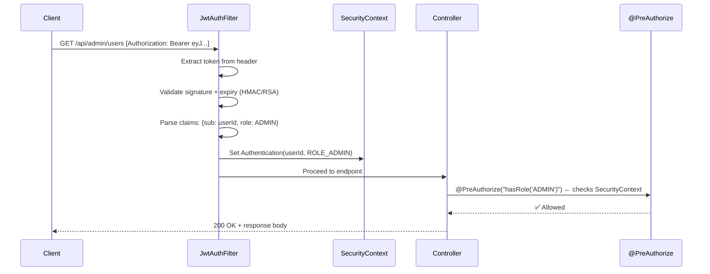

## WHY

Security vulnerabilities are the fastest way to sink a company. XSS, CSRF, JWT misconfigurations, insecure password storage, broken access control — these are OWASP Top 10 issues that Spring Security handles, but ONLY if configured correctly. Most developers slap `@EnableWebSecurity` on a class and call it done, but they don't understand the **Filter Chain**, **SecurityContext**, **Authentication vs Authorization**, or how JWT validation actually works internally.

Senior interviews always include: "Walk me through how a request is authenticated in your system from HTTP header to method execution."

---

## THEORY

### Spring Security Filter Chain (The Backbone)

Every HTTP request passes through a **chain of servlet filters** before reaching your controller. Spring Security injects ~15 filters in order:

```
Request → SecurityContextPersistenceFilter → CsrfFilter → LogoutFilter
→ UsernamePasswordAuthenticationFilter (or JwtAuthFilter) → ExceptionTranslationFilter
→ FilterSecurityInterceptor → YOUR CONTROLLER
```

Key filters:
1. **SecurityContextPersistenceFilter**: Loads/saves SecurityContext per request
2. **UsernamePasswordAuthenticationFilter**: Handles form login (extracts credentials)
3. **BasicAuthenticationFilter**: Handles HTTP Basic auth headers
4. **JwtAuthFilter (custom)**: YOUR custom filter that validates JWT tokens
5. **ExceptionTranslationFilter**: Converts AccessDeniedException → 403, AuthenticationException → 401
6. **FilterSecurityInterceptor**: Final check — is the authenticated user authorized for this endpoint?

### Authentication vs Authorization

| | Authentication | Authorization |
|--|---------------|--------------|
| Question | "Who are you?" | "Are you allowed to do this?" |
| When | Before controller (filter chain) | At controller/method level |
| Spring class | `AuthenticationManager` | `AccessDecisionManager` |
| Failure response | 401 Unauthorized | 403 Forbidden |
| Typical implementation | JWT validation, DB lookup | Role/permission check |

### JWT Token Lifecycle

```
1. User logs in: POST /auth/login {email, password}
2. Server validates credentials against DB (BCrypt)
3. Server generates JWT: {sub: userId, role: ADMIN, exp: 1day}
4. Client stores JWT in memory (NOT localStorage for XSS safety!)
5. Every subsequent request: Authorization: Bearer <jwt>
6. JwtAuthFilter extracts token, validates signature + expiry
7. Sets SecurityContext with authenticated user
8. FilterSecurityInterceptor checks role against endpoint rules
```

### Stateless JWT vs Session-Based Auth

| | JWT (Stateless) | Session (Stateful) |
|--|----------------|-------------------|
| Server storage | None (token is self-contained) | Session in Redis/DB |
| Scalability | ✅ Any server can validate | ❌ Sticky sessions or shared store |
| Revocation | ❌ Hard (token valid until expiry) | ✅ Delete session |
| Token size | Large (includes claims) | Small (just session ID) |
| Best for | Microservices, APIs | Monoliths, server-rendered apps |

---

## VISUALIZATION_CONFIG



---

## CODE

### Level 1 — Complete JWT Security Configuration (Spring Boot 3)

```java
@Configuration
@EnableWebSecurity
@EnableMethodSecurity  // Enables @PreAuthorize, @Secured
@RequiredArgsConstructor
public class SecurityConfig {

    private final JwtAuthFilter jwtAuthFilter;

    @Bean
    public SecurityFilterChain filterChain(HttpSecurity http) throws Exception {
        return http
            .csrf(AbstractHttpConfigurer::disable)       // Disable for stateless JWT APIs
            .cors(cors -> cors.configurationSource(corsSource()))
            .sessionManagement(session ->
                session.sessionCreationPolicy(SessionCreationPolicy.STATELESS))
            .authorizeHttpRequests(auth -> auth
                // Public endpoints
                .requestMatchers("/v1/auth/**").permitAll()
                .requestMatchers("/actuator/health").permitAll()
                .requestMatchers("/swagger-ui/**", "/v3/api-docs/**").permitAll()
                // Role-based access
                .requestMatchers("/v1/admin/**").hasRole("ADMIN")
                .requestMatchers(HttpMethod.GET, "/v1/content/**").permitAll()
                .requestMatchers(HttpMethod.POST, "/v1/content/**").hasAnyRole("ADMIN", "AUTHOR")
                // Everything else requires authentication
                .anyRequest().authenticated()
            )
            // Add our custom JWT filter BEFORE Spring's default auth filter
            .addFilterBefore(jwtAuthFilter, UsernamePasswordAuthenticationFilter.class)
            .build();
    }

    @Bean
    public PasswordEncoder passwordEncoder() {
        return new BCryptPasswordEncoder(12); // Work factor 12 (industry standard)
    }

    @Bean
    public AuthenticationManager authManager(AuthenticationConfiguration config) throws Exception {
        return config.getAuthenticationManager();
    }

    private CorsConfigurationSource corsSource() {
        CorsConfiguration config = new CorsConfiguration();
        config.setAllowedOrigins(List.of("http://localhost:3000", "https://devmastery.app"));
        config.setAllowedMethods(List.of("GET", "POST", "PUT", "DELETE", "PATCH"));
        config.setAllowedHeaders(List.of("*"));
        config.setAllowCredentials(true);
        UrlBasedCorsConfigurationSource source = new UrlBasedCorsConfigurationSource();
        source.registerCorsConfiguration("/**", config);
        return source;
    }
}
```

### Level 2 — JWT Authentication Filter

```java
@Component
@RequiredArgsConstructor
@Slf4j
public class JwtAuthFilter extends OncePerRequestFilter {

    private final JwtTokenProvider tokenProvider;

    @Override
    protected void doFilterInternal(HttpServletRequest request,
                                    HttpServletResponse response,
                                    FilterChain filterChain) throws ServletException, IOException {
        // 1. Extract token from Authorization header
        String header = request.getHeader("Authorization");
        if (header == null || !header.startsWith("Bearer ")) {
            filterChain.doFilter(request, response); // No token → proceed unauthenticated
            return;
        }

        String token = header.substring(7);

        try {
            // 2. Validate token and extract claims
            Claims claims = tokenProvider.parseToken(token);
            String userId = claims.getSubject();
            String role = claims.get("role", String.class);

            // 3. Build Spring Security Authentication object
            List<SimpleGrantedAuthority> authorities = List.of(
                new SimpleGrantedAuthority("ROLE_" + role.toUpperCase())
            );

            UsernamePasswordAuthenticationToken auth =
                new UsernamePasswordAuthenticationToken(userId, null, authorities);
            auth.setDetails(new WebAuthenticationDetailsSource().buildDetails(request));

            // 4. Set SecurityContext — this user is now "authenticated" for this request
            SecurityContextHolder.getContext().setAuthentication(auth);

        } catch (ExpiredJwtException e) {
            log.debug("JWT expired for request: {}", request.getRequestURI());
            // Don't set SecurityContext → request proceeds as unauthenticated → 401
        } catch (JwtException e) {
            log.debug("Invalid JWT: {}", e.getMessage());
        }

        filterChain.doFilter(request, response);
    }

    @Override
    protected boolean shouldNotFilter(HttpServletRequest request) {
        // Skip JWT filter for public auth endpoints
        return request.getServletPath().startsWith("/v1/auth/");
    }
}
```

### Level 3 — JWT Token Provider

```java
@Component
public class JwtTokenProvider {

    @Value("${app.jwt.secret}")
    private String jwtSecret;

    @Value("${app.jwt.expiration-ms:86400000}")
    private long expirationMs;

    private SecretKey getSigningKey() {
        return Keys.hmacShaKeyFor(jwtSecret.getBytes(StandardCharsets.UTF_8));
    }

    public String generateToken(UUID userId, String email, String role) {
        return Jwts.builder()
            .subject(userId.toString())
            .claim("email", email)
            .claim("role", role)
            .issuedAt(new Date())
            .expiration(new Date(System.currentTimeMillis() + expirationMs))
            .signWith(getSigningKey())
            .compact();
    }

    public Claims parseToken(String token) {
        return Jwts.parser()
            .verifyWith(getSigningKey())
            .build()
            .parseSignedClaims(token)
            .getPayload();
    }

    public boolean isTokenValid(String token) {
        try {
            parseToken(token);
            return true;
        } catch (JwtException e) {
            return false;
        }
    }
}
```

### Level 4 — Method-Level Security

```java
@RestController
@RequestMapping("/v1/users")
@RequiredArgsConstructor
public class UserController {

    private final UserService userService;

    // Only accessible by ADMIN
    @GetMapping
    @PreAuthorize("hasRole('ADMIN')")
    public List<UserDto> getAllUsers() {
        return userService.findAll();
    }

    // User can only access their own profile (or ADMIN can access any)
    @GetMapping("/{userId}")
    @PreAuthorize("#userId == authentication.principal or hasRole('ADMIN')")
    public UserDto getUser(@PathVariable String userId) {
        return userService.findById(UUID.fromString(userId));
    }

    // Custom SpEL expression
    @DeleteMapping("/{userId}")
    @PreAuthorize("@securityService.canDeleteUser(authentication.principal, #userId)")
    public void deleteUser(@PathVariable UUID userId) {
        userService.deleteUser(userId);
    }
}

// Custom security service for complex authorization rules
@Service("securityService")
@RequiredArgsConstructor
public class SecurityService {
    private final UserRepository userRepository;

    public boolean canDeleteUser(String currentUserId, UUID targetUserId) {
        User current = userRepository.findById(UUID.fromString(currentUserId)).orElse(null);
        if (current == null) return false;
        if (current.getRole() == Role.ADMIN) return true;
        // Users can only delete themselves
        return current.getId().equals(targetUserId);
    }
}
```

---

## REAL_WORLD

### How Netflix Handles Token Revocation

JWT's biggest weakness: you can't invalidate a token after issuance. Netflix solved this with a "token blacklist" in Redis. On logout or password change, the token's JTI (JWT ID) is added to a Redis SET with TTL matching the token's remaining lifetime. The JwtAuthFilter checks Redis before trusting the token. Overhead: one Redis GET per request (~0.5ms). Combined with short-lived access tokens (15 minutes) and refresh tokens, this gives the best of both worlds: stateless validation + revocation capability.

### Google's Beyond Identity (Zero Trust)

Google's internal security model treats every request as potentially hostile — even from inside the corporate network. Every microservice-to-microservice call requires a signed JWT from their identity service. The JWT includes device health, user identity, AND the target service. This means even if an attacker compromises Service A, they can't forge a token valid for Service B.

---

## INTERVIEW

**Q1: Walk me through what happens when a request with a JWT hits your Spring Boot application.**
> 1. Request enters the servlet filter chain. 2. Our custom `JwtAuthFilter` (added before `UsernamePasswordAuthenticationFilter`) extracts the Bearer token from the `Authorization` header. 3. The filter calls `JwtTokenProvider.parseToken()` which validates the HMAC signature and checks expiry. 4. If valid, we extract the `sub` (userId) and `role` claims. 5. We create a `UsernamePasswordAuthenticationToken` with granted authorities and set it in `SecurityContextHolder`. 6. The request proceeds to `FilterSecurityInterceptor` which checks if the authenticated user's roles satisfy the endpoint's `authorizeHttpRequests` rules. 7. If the controller method has `@PreAuthorize`, it's checked via AOP at method invocation time. 8. If any check fails: `AuthenticationException` → 401 or `AccessDeniedException` → 403.

**Q2: Why is storing JWT in localStorage dangerous? What's the alternative?**
> `localStorage` is accessible via JavaScript — any XSS vulnerability leaks the token to an attacker. The alternative: store JWT in an **HTTP-only, Secure, SameSite=Strict cookie**. This makes the token invisible to JavaScript (immune to XSS) while still being sent automatically with every request. For SPAs, another pattern: keep the access token in memory only (JavaScript variable) and use a refresh token in an HTTP-only cookie to silently refresh.

**Q3: How do you handle JWT revocation in a stateless architecture?**
> Three strategies: (1) **Short-lived tokens + refresh tokens**: Access token expires in 15 minutes. Refresh token (stored securely) is used to get new access tokens. Revoke refresh token on logout. (2) **Token blacklist**: Store revoked JTI (token IDs) in Redis with TTL matching remaining token lifetime. Check blacklist on every request. (3) **Token versioning**: Store a `tokenVersion` per user in DB. Include version in JWT. On password change/logout, increment version. Reject tokens with old version.

**Q4: What's the difference between `@Secured`, `@PreAuthorize`, and `@RolesAllowed`?**
> `@Secured("ROLE_ADMIN")`: Simple role check. No SpEL expressions supported. `@RolesAllowed("ADMIN")`: JSR-250 annotation (Java EE standard). Equivalent to `@Secured`. `@PreAuthorize("hasRole('ADMIN') and #userId == authentication.principal")`: Most powerful — supports Spring Expression Language (SpEL) for complex conditions including method arguments, authentication object, and custom bean methods. Always prefer `@PreAuthorize` for its flexibility.

---

## FEYNMAN CHECK

Imagine a VIP club with a bouncer at the door.

**Authentication** (Filter): The bouncer checks your ID (JWT token). Is it real? (valid signature) Is it expired? (exp claim) Once verified, they stamp your hand with your name and "VIP level" (set SecurityContext with userId and role).

**Authorization** (Controller/Method): Inside the club, different areas have different access. The main bar is open to everyone (permitAll). The VIP lounge checks your stamp — only "GOLD" level allowed (@PreAuthorize("hasRole('GOLD')")). The DJ booth — only if your stamp says "DJ" AND you're on tonight's list (custom SpEL expression).

**Stateless JWT**: The bouncer doesn't keep a guest list (no server-side session). Your ID card (JWT) contains ALL the info they need. Advantage: any bouncer at any door can verify you without calling HQ. Disadvantage: if your ID is stolen, they can't "revoke" it until it naturally expires.

---

## BUILD

**Challenge: Implement a complete JWT auth system.**

Requirements:
1. `POST /v1/auth/register` — BCrypt password, save user, return JWT
2. `POST /v1/auth/login` — validate credentials, return JWT with userId + role in claims
3. `JwtAuthFilter` — validates token, sets SecurityContext
4. `GET /v1/users/me` — returns current user profile (requires auth)
5. `GET /v1/admin/users` — returns all users (requires ADMIN role)
6. `@PreAuthorize` on a method that only allows users to update their OWN profile
7. Handle expired tokens gracefully (401 + JSON error body, not HTML)
8. Write tests: unauthenticated request → 401, wrong role → 403, valid admin → 200

---

## SPACED REVIEW

- Spring Security = **filter chain** of ~15 servlet filters processing every request
- Authentication (who?) happens in filters; Authorization (allowed?) happens at endpoint/method level
- JWT flow: Login → generate token → client stores → sends in `Authorization: Bearer <token>` header
- Custom `JwtAuthFilter extends OncePerRequestFilter`: extract → validate → set SecurityContext
- `SecurityContextHolder.getContext().setAuthentication(auth)` — sets authenticated user for this request
- `@PreAuthorize` supports SpEL: `hasRole()`, `#paramName`, `authentication.principal`, `@beanName.method()`
- BCrypt with work factor 12 for password hashing (industry standard)
- Never store JWT in localStorage (XSS vulnerable) — use HTTP-only cookies or memory-only
- Token revocation strategies: short-lived + refresh, blacklist in Redis, or token versioning
- `SessionCreationPolicy.STATELESS` — Spring won't create HTTP sessions (pure JWT)
- 401 = Authentication failed (who are you?); 403 = Authorization failed (not allowed)

