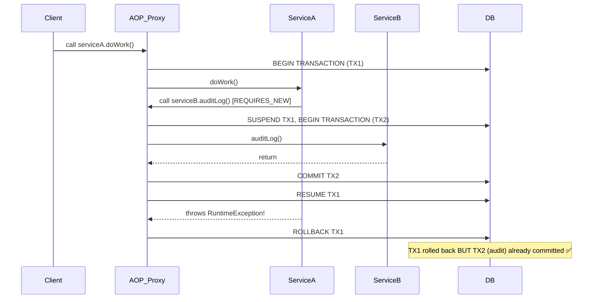

## WHY

Transaction management is the most commonly misunderstood topic in Spring and one of the most frequent causes of data corruption bugs in production. A developer who blindly adds `@Transactional` to every service method without understanding **propagation**, **isolation levels**, and **rollback rules** is a liability. FAANG and enterprise Java interviews will probe this deeply.

The wrong transaction configuration causes: lost updates, phantom reads, dirty reads, partial data commits, and deadlocks. The right configuration is the difference between a rock-solid financial system and one that occasionally loses money.

---

## THEORY

### How Spring Transactions Work Internally

Spring uses **AOP proxies** under the hood. When you annotate a method with `@Transactional`, Spring creates a proxy around your bean. The proxy intercepts the call, starts a transaction (or joins an existing one based on propagation), runs your method, then commits or rolls back.

**Critical implication**: Calling a `@Transactional` method from *within the same class* bypasses the proxy — the transaction is NOT applied. This is one of the most common Spring bugs.

```java
// BROKEN: self-invocation bypasses proxy
@Service
public class OrderService {
    public void processOrder() {
        this.saveOrder(); // Direct call — @Transactional is IGNORED
    }

    @Transactional
    public void saveOrder() { ... }
}
```

### Propagation Behaviour (The 7 Types)

Propagation defines what happens when a transactional method is called from another transactional method.

| Propagation | Behaviour | Use Case |
|-------------|-----------|----------|
| `REQUIRED` (default) | Join existing tx or create new | Standard service methods |
| `REQUIRES_NEW` | Always suspend existing tx and create a new one | Audit logging — must commit even if parent rolls back |
| `NESTED` | Creates a savepoint in the current tx | Partial rollbacks in batch processing |
| `SUPPORTS` | Run in tx if one exists, otherwise non-transactionally | Read-only queries that *can* be in a tx |
| `NOT_SUPPORTED` | Always suspend the current tx | Legacy code that breaks under transactions |
| `MANDATORY` | Must be called within an existing tx | DAOs that assume a tx is already active |
| `NEVER` | Must NOT be called within an existing tx | Background jobs that should never be transactional |

### Isolation Levels (Preventing Concurrency Anomalies)

| Isolation Level | Dirty Read | Non-Repeatable Read | Phantom Read |
|-----------------|-----------|---------------------|--------------|
| `READ_UNCOMMITTED` | ✅ Possible | ✅ Possible | ✅ Possible |
| `READ_COMMITTED` (PG default) | ❌ Prevented | ✅ Possible | ✅ Possible |
| `REPEATABLE_READ` (MySQL default) | ❌ Prevented | ❌ Prevented | ✅ Possible |
| `SERIALIZABLE` | ❌ Prevented | ❌ Prevented | ❌ Prevented |

### Rollback Rules

By default, `@Transactional` **only rolls back for `RuntimeException` and `Error`**. Checked exceptions do NOT trigger a rollback! This shocks many developers.

```java
@Transactional(
    rollbackFor = Exception.class,        // rollback on any exception
    noRollbackFor = BusinessException.class // don't rollback for business errors
)
```

---

## VISUALIZATION_CONFIG



---

## CODE

### Level 1 — Basic `@Transactional` Usage

```java
@Service
@RequiredArgsConstructor
public class PaymentService {

    private final PaymentRepository paymentRepository;
    private final AccountRepository accountRepository;

    // REQUIRED (default): joins existing tx or creates new
    @Transactional
    public void processPayment(UUID fromId, UUID toId, BigDecimal amount) {
        Account from = accountRepository.findById(fromId)
            .orElseThrow(() -> new AccountNotFoundException(fromId));
        Account to = accountRepository.findById(toId)
            .orElseThrow(() -> new AccountNotFoundException(toId));

        if (from.getBalance().compareTo(amount) < 0) {
            throw new InsufficientFundsException(); // RuntimeException → triggers ROLLBACK
        }

        from.debit(amount);
        to.credit(amount);

        // Both updates are in the SAME transaction — either BOTH commit or BOTH rollback
        accountRepository.save(from);
        accountRepository.save(to);
        paymentRepository.save(new Payment(fromId, toId, amount));
    }
}
```

### Level 2 — `REQUIRES_NEW` for Independent Audit Logging

```java
@Service
@RequiredArgsConstructor
public class AuditService {

    private final AuditLogRepository auditLogRepository;

    // REQUIRES_NEW: suspends any existing transaction
    // Audit log ALWAYS commits, even if the calling transaction rolls back
    @Transactional(propagation = Propagation.REQUIRES_NEW)
    public void log(String action, String detail) {
        auditLogRepository.save(new AuditLog(
            LocalDateTime.now(),
            SecurityContextHolder.getContext().getAuthentication().getName(),
            action,
            detail
        ));
    }
}

@Service
@RequiredArgsConstructor
public class TransferService {

    private final PaymentService paymentService;
    private final AuditService auditService;

    @Transactional
    public void transfer(TransferRequest req) {
        auditService.log("TRANSFER_INITIATED", req.toString()); // TX2 commits immediately
        paymentService.processPayment(req.from(), req.to(), req.amount()); // TX1
        // If processPayment throws → TX1 rolls back, but audit log (TX2) is PRESERVED
    }
}
```

### Level 3 — Read-Only Transactions for Performance

```java
@Service
@RequiredArgsConstructor
public class ReportService {

    private final OrderRepository orderRepository;

    // readOnly=true: tells JPA to skip dirty-checking (massive performance win!)
    // Also communicates intent — routing to read replicas in some setups
    @Transactional(readOnly = true)
    public List<OrderSummary> getMonthlyReport(YearMonth month) {
        return orderRepository.findAllByMonth(month)
            .stream()
            .map(OrderSummary::from)
            .collect(Collectors.toList());
    }
}
```

### Level 4 — Programmatic Transaction Management

```java
@Service
@RequiredArgsConstructor
public class BulkImportService {

    private final TransactionTemplate transactionTemplate;
    private final ProductRepository productRepository;

    public ImportResult importProducts(List<ProductDto> products) {
        AtomicInteger successCount = new AtomicInteger(0);
        AtomicInteger failCount = new AtomicInteger(0);

        for (ProductDto dto : products) {
            // Each product import is its OWN independent transaction
            transactionTemplate.execute(status -> {
                try {
                    productRepository.save(dto.toEntity());
                    successCount.incrementAndGet();
                } catch (Exception e) {
                    status.setRollbackOnly(); // mark current tx for rollback
                    failCount.incrementAndGet();
                }
                return null;
            });
        }
        return new ImportResult(successCount.get(), failCount.get());
    }
}
```

---

## REAL_WORLD

### How Stripe Handles Payment Atomicity

Stripe's ledger system requires that debiting one account and crediting another NEVER partially succeeds. They use `REPEATABLE_READ` isolation to prevent phantom transactions from appearing between their two reads of account balances. Their `REQUIRES_NEW` audit trail records every attempted transaction regardless of outcome — essential for dispute resolution and regulatory compliance.

### Netflix's Use of Read-Only Transactions

Netflix's recommendation engine makes hundreds of database reads per second to build personalized homepages. By annotating all read operations with `@Transactional(readOnly = true)`, Hibernate bypasses dirty-checking, saving significant CPU overhead. Combined with routing read-only transactions to Postgres read replicas, they achieve 40% better read throughput on their main cluster.

---

## INTERVIEW

**Q1: Why does calling `@Transactional` within the same class not work?**
> Spring's transaction management works via AOP proxy. When you call `this.method()`, you're bypassing the proxy entirely and calling the real object directly. No proxy = no interceptor = no transaction. Fix: inject the bean into itself (`@Autowired private YourService self`) or use `ApplicationContext.getBean()`.

**Q2: What is the default rollback behavior? How do you change it?**
> By default, `@Transactional` only rolls back for **unchecked exceptions** (`RuntimeException` and `Error`). Checked exceptions are NOT rolled back. Use `rollbackFor = Exception.class` to roll back on all exceptions, or `noRollbackFor = SpecificException.class` to prevent rollback for specific cases.

**Q3: When would you use `REQUIRES_NEW` vs `NESTED`?**
> `REQUIRES_NEW`: Suspends the outer transaction and creates a completely independent new transaction. Changes in the inner transaction commit regardless of what happens to the outer. Use for: audit logs, metrics recording, anything that must persist even on failure. `NESTED`: Creates a savepoint within the SAME transaction. If the nested part fails, only it is rolled back (to the savepoint). The outer transaction can still commit. Use for: batch processing where partial failures are acceptable.

**Q4: A `@Transactional` method throws a checked `IOException`. Does it rollback?**
> **No!** Default behavior does NOT rollback for checked exceptions. You must add `@Transactional(rollbackFor = IOException.class)`.

**Q5: What does `readOnly = true` actually do?**
> 1. Tells Hibernate to skip the dirty-check phase at flush time (big CPU savings). 2. Sets `Connection.setReadOnly(true)` which some JDBC drivers use as a hint. 3. In some setups (e.g., Spring Data with read replica routing), routes the query to a read-only replica. It does NOT prevent writes at the database level.

**Q6: How do you handle transactions in a multi-datasource Spring application?**
> You need `@Primary` on the main `DataSourceTransactionManager`, and qualify the secondary manager with a name. Use `@Transactional("secondaryTransactionManager")` to target the secondary datasource. For true distributed transactions (across two databases), you need JTA (Java Transaction API) with an XA-compliant datasource and a transaction coordinator like Atomikos.

---

## FEYNMAN CHECK

Imagine you're at a bank, making a transfer from Account A to Account B. The teller has a notepad (the transaction).

- They write "subtract $100 from A" — but don't do it yet.
- They write "add $100 to B" — but don't do it yet.
- Only if BOTH steps succeed, they stamp "COMMIT" and the changes are real.
- If anything fails (system crash, A has insufficient funds), they crumple the notepad and throw it away. The database is unchanged.

That's a transaction. `@Transactional` tells Spring to manage this notepad automatically. Propagation rules decide what to do with the notepad when one teller hands off work to another teller:
- `REQUIRED`: "Use the same notepad if you already have one"
- `REQUIRES_NEW`: "Get a brand new notepad regardless"
- `NESTED`: "Draw a line on the current notepad — if this section fails, erase back to the line"

---

## BUILD

**Challenge: Implement a safe bank transfer API with proper transaction handling.**

Requirements:
1. Create a `TransferService.transfer(fromId, toId, amount)` method that atomically debits/credits two accounts.
2. Create a separate `TransactionAuditService.recordAttempt()` that uses `REQUIRES_NEW` and commits the audit log even when the transfer fails.
3. Write a test that:
   - Verifies the audit log is present even when the transfer fails due to insufficient funds.
   - Verifies account balances didn't change when the transfer failed.
4. Add `readOnly = true` to all query-only service methods.
5. Use `rollbackFor = Exception.class` on the transfer method.

Expected output: A test that proves the audit log exists AND balances are unchanged after a failed transfer.

---

## SPACED REVIEW

- `@Transactional` uses **AOP proxy** — self-invocation bypasses it
- Default rollback: **only** `RuntimeException` and `Error`
- `REQUIRED` (default): join existing or create new
- `REQUIRES_NEW`: always creates independent transaction — inner commits regardless of outer
- `NESTED`: savepoint within outer transaction — partial rollback possible
- `readOnly = true`: skips Hibernate dirty-check + enables read-replica routing
- Isolation levels in order: READ_UNCOMMITTED → READ_COMMITTED → REPEATABLE_READ → SERIALIZABLE
- `SERIALIZABLE` = safest, but slowest (row locks on all reads)
- Programmatic alternative: `TransactionTemplate.execute()`

