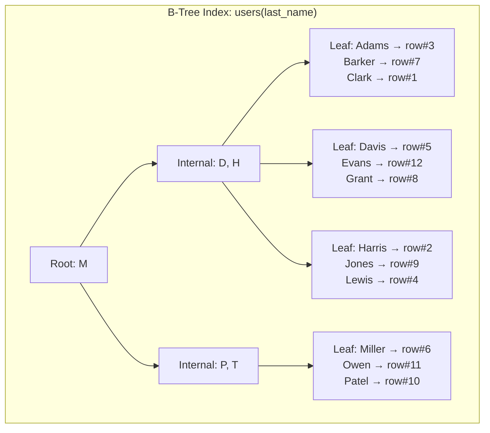

## WHY

A single missing index can make a query 10,000x slower. A poorly designed index strategy can make writes 10x slower. Database indexing is tested in every backend/full-stack interview because it's where real-world performance lives or dies.

Understanding how indexes work at the B-Tree level — not just "add index to speed up queries" — lets you predict query performance, design schemas that leverage indexes, and debug slow queries by reading EXPLAIN plans.

---

## THEORY

### How a B-Tree Index Works

A B-Tree (Balanced Tree) is a self-balancing tree structure stored on disk. Each node contains keys and pointers:

- **Leaf nodes**: Store the indexed column values + pointers to the actual table rows (heap)
- **Internal nodes**: Store routing keys that guide the search
- **Root node**: Entry point for all lookups

**Time complexity**: O(log N) for lookup, insert, and delete.

For a table with 10 million rows:
- Without index (sequential scan): reads ALL 10M rows = O(N)
- With B-Tree index: ~24 levels deep at most = 24 page reads = O(log N) ≈ milliseconds

### Index Types in PostgreSQL

| Index Type | Use Case | Data Structure |
|-----------|----------|----------------|
| B-Tree (default) | Equality and range queries (`=`, `<`, `>`, `BETWEEN`, `LIKE 'abc%'`) | Balanced tree |
| Hash | Equality only (`=`) — rarely used, B-Tree is usually better | Hash table |
| GIN (Generalized Inverted) | Full-text search, JSONB containment, array elements | Posting lists |
| GiST (Generalized Search Tree) | Geometry, range types, nearest-neighbor | R-tree variant |
| BRIN (Block Range Index) | Large sorted tables (time-series), very small index size | Min/max per block range |

### Composite (Multi-Column) Index

```sql
CREATE INDEX idx_users_country_city ON users(country, city);
```

The **leftmost prefix rule**: This index helps queries that filter on:
- `country` alone ✅
- `country AND city` ✅
- `city` alone ❌ (index not used — can't skip the first column!)

Order matters: put the column used in equality first, range columns last.

### Covering Index (Index-Only Scan)

If the index contains ALL columns needed for a query, PostgreSQL can answer from the index alone without touching the table heap — dramatically faster.

```sql
-- Query needs: name, email WHERE country = 'US'
CREATE INDEX idx_covering ON users(country) INCLUDE (name, email);
-- PostgreSQL answers entirely from the index → no heap access!
```

### Partial (Conditional) Index

Index only rows matching a condition — smaller, faster, less storage.

```sql
-- Only index active users (90% of queries filter active=true anyway)
CREATE INDEX idx_active_users ON users(email) WHERE is_active = true;
-- Index is 10x smaller if only 10% of users are active!
```

### When Indexes HURT

Indexes speed up reads but SLOW DOWN writes:
- Every `INSERT` must update ALL relevant indexes
- Every `UPDATE` on an indexed column requires index maintenance
- Every `DELETE` leaves dead index entries (require VACUUM in PostgreSQL)

Rule: A table with 20 indexes will have noticeably slow writes. Balance read speed vs write cost.

---

## VISUALIZATION_CONFIG



---

## CODE

### Level 1 — Reading EXPLAIN Plans

```sql
-- Always check your query's execution plan before deploying!
EXPLAIN ANALYZE SELECT * FROM orders WHERE user_id = 'abc123' AND status = 'completed';

-- GOOD output (index used):
-- Index Scan using idx_orders_user_status on orders (cost=0.43..8.45 rows=1 width=200)
--   Index Cond: (user_id = 'abc123' AND status = 'completed')
--   Planning Time: 0.1 ms
--   Execution Time: 0.05 ms ✅

-- BAD output (sequential scan):
-- Seq Scan on orders (cost=0.00..125000.00 rows=5000000 width=200)
--   Filter: (user_id = 'abc123' AND status = 'completed')
--   Rows Removed by Filter: 4999999
--   Planning Time: 0.1 ms
--   Execution Time: 3200 ms ❌ (scans ALL 5M rows!)
```

### Level 2 — Designing Indexes for Real Queries

```sql
-- Scenario: E-commerce order queries

-- Query 1: "Get all orders for user X, newest first"
-- → Composite index with user_id (equality) + created_at (range, DESC)
CREATE INDEX idx_orders_user_date ON orders(user_id, created_at DESC);

-- Query 2: "Count pending orders per day"
-- → Partial index on status (only pending) + covering for date
CREATE INDEX idx_orders_pending_date ON orders(created_at)
    WHERE status = 'PENDING';

-- Query 3: "Full-text search on product titles"
-- → GIN index for text search
CREATE INDEX idx_products_fts ON products
    USING GIN(to_tsvector('english', title || ' ' || description));

-- Query 4: "Find products with JSON attribute color=blue"
CREATE INDEX idx_products_attrs ON products USING GIN(attributes jsonb_path_ops);
-- Now this is fast:
SELECT * FROM products WHERE attributes @> '{"color": "blue"}';

-- Query 5: "Find nearby restaurants" (PostGIS geometry)
CREATE INDEX idx_restaurants_location ON restaurants USING GIST(location);
SELECT * FROM restaurants
WHERE ST_DWithin(location, ST_MakePoint(-73.935242, 40.730610)::geography, 1000);
```

### Level 3 — Index-Only Scans (Covering Indexes)

```sql
-- Slow: requires heap access for name and email
CREATE INDEX idx_users_country ON users(country);
EXPLAIN SELECT name, email FROM users WHERE country = 'US';
-- Index Scan → then Heap Fetch for name, email (2 disk operations per row!)

-- Fast: covering index includes all needed columns
CREATE INDEX idx_users_country_covering ON users(country) INCLUDE (name, email);
EXPLAIN SELECT name, email FROM users WHERE country = 'US';
-- Index Only Scan ✅ → zero heap access (1 disk operation per row!)
-- 2-3x faster for large result sets
```

### Level 4 — Identifying Missing Indexes (PostgreSQL)

```sql
-- Find slow queries (pg_stat_statements extension)
SELECT query, calls, mean_exec_time, rows
FROM pg_stat_statements
ORDER BY mean_exec_time DESC
LIMIT 20;

-- Find tables with lots of sequential scans (potential missing indexes)
SELECT schemaname, relname, seq_scan, idx_scan,
       seq_scan - idx_scan AS too_many_seq_scans
FROM pg_stat_user_tables
WHERE seq_scan > idx_scan
ORDER BY too_many_seq_scans DESC;

-- Find unused indexes (candidates for removal — they slow writes!)
SELECT indexrelid::regclass AS index_name,
       idx_scan AS times_used,
       pg_size_pretty(pg_relation_size(indexrelid)) AS index_size
FROM pg_stat_user_indexes
WHERE idx_scan = 0
  AND indexrelid NOT IN (SELECT conindid FROM pg_constraint) -- Keep PK/UNIQUE
ORDER BY pg_relation_size(indexrelid) DESC;
```

### Level 5 — Spring JPA Indexing (Code-First)

```java
@Entity
@Table(name = "orders", indexes = {
    @Index(name = "idx_orders_user_date", columnList = "userId, createdAt DESC"),
    @Index(name = "idx_orders_status", columnList = "status")
})
public class Order {
    @Id
    @GeneratedValue(strategy = GenerationType.UUID)
    private UUID id;

    @Column(nullable = false)
    private UUID userId;

    @Column(nullable = false)
    @Enumerated(EnumType.STRING)
    private OrderStatus status;

    @Column(nullable = false)
    private OffsetDateTime createdAt;

    @Column(nullable = false)
    private BigDecimal totalAmount;
}

// Flyway migration (production-safe approach)
-- V7__add_orders_indexes.sql
CREATE INDEX CONCURRENTLY idx_orders_user_date ON orders(user_id, created_at DESC);
-- CONCURRENTLY = doesn't lock the table during creation!
-- Without CONCURRENTLY: table is LOCKED for writes until index build completes (minutes for large tables!)
```

---

## REAL_WORLD

### How Shopify Handles 80 Billion Rows

Shopify's orders table has 80+ billion rows across their sharded MySQL clusters. Their indexing strategy: (1) Composite indexes for every known query pattern. (2) `EXPLAIN` is required in every PR that adds a query. (3) An automated "query analyzer" tool runs in CI and rejects queries that trigger sequential scans on tables > 1M rows. (4) Unused indexes are automatically flagged and removed quarterly (they found 30% of indexes were never used — just slowing writes).

### Stack Overflow's Database Optimization

Stack Overflow serves 1.3 billion monthly page views with just 2 SQL Server instances. Their secret: aggressive indexing + covering indexes on their most common queries (question list, user profile, tag filtering). They maintain only 4-5 carefully tuned indexes per table instead of 20 naive ones, and use `INCLUDE` columns to enable index-only scans on their hottest paths.

---

## INTERVIEW

**Q1: A query on a table with 50 million rows is taking 5 seconds. How do you debug it?**
> (1) Run `EXPLAIN ANALYZE` on the query. Check for `Seq Scan` vs `Index Scan`. (2) If Seq Scan: identify which WHERE clause column needs an index. (3) Check if the query uses functions on the column: `WHERE LOWER(email) = 'x'` won't use a normal index — need a functional index: `CREATE INDEX ON users(LOWER(email))`. (4) Check cardinality: if the column has very low cardinality (e.g., status with 3 values), PostgreSQL might choose Seq Scan intentionally (faster for large percentage of table). (5) Check if statistics are stale: `ANALYZE table_name` to update.

**Q2: Explain the leftmost prefix rule for composite indexes.**
> A composite index `(A, B, C)` can be used for queries filtering: `A`, `A+B`, or `A+B+C`. It CANNOT help queries filtering only on `B` or `C` or `B+C` because the B-Tree is sorted by A first. Think of it like a phone book sorted by last name, first name, city — you can look up by last name, or last name + first name, but you can't efficiently look up by city alone.

**Q3: What is an index-only scan? How do you achieve it?**
> An index-only scan is when PostgreSQL answers a query entirely from the index without accessing the table heap. This happens when ALL columns in SELECT and WHERE are present in the index. Use `INCLUDE (col1, col2)` to add non-searchable columns to the index leaf nodes. This eliminates random I/O to the heap — critical for performance when scanning thousands of rows.

**Q4: When should you NOT add an index?**
> (1) Write-heavy tables where insert/update speed matters more than read speed. (2) Columns with very low cardinality (boolean, status enum with 3 values) — the index won't help much because it still returns a large % of the table. (3) Small tables (<1000 rows) — sequential scan is faster than index lookup due to overhead. (4) Columns only used in expressions or functions (the index won't be used unless you create a functional index). (5) Tables that are being bulk-loaded (drop indexes, load, recreate).

**Q5: What is the difference between BRIN and B-Tree? When use BRIN?**
> BRIN (Block Range Index) stores min/max values per block range (e.g., per 128 pages). It's 100-1000x smaller than B-Tree but only works well on physically-sorted data (like time-series with `created_at`). Use BRIN for: large append-only tables where data is naturally ordered (logs, events, sensor data). B-Tree is better for random-access patterns. Example: A 100GB time-series table — B-Tree index = 5GB, BRIN index = 50KB!

---

## FEYNMAN CHECK

Imagine a library with 10 million books on shelves in random order.

**No index** (Seq Scan): To find "Harry Potter", you walk through every shelf, checking every book. Takes hours.

**B-Tree index** (like the card catalog): The catalog is sorted alphabetically. You open to "H", then "Ha", then "Har" — in 4 steps you find the location. Walk directly to that shelf.

**Composite index** (catalog sorted by author, then title): You can find "all books by Rowling" (uses first column). You can find "Rowling + Harry Potter" (uses both). You CANNOT find "all books titled Harry Potter" efficiently (can't skip the first column — the catalog is sorted by AUTHOR first).

**Covering index**: The card catalog not only tells you WHERE the book is, but also lists the page count and ISBN right on the card. You never need to walk to the shelf — the card has everything you need.

**Partial index**: A separate mini-catalog that ONLY lists books currently available (not checked out). 90% smaller than the full catalog, perfect for "find available books" queries.

---

## BUILD

**Challenge: Optimize a slow e-commerce database.**

Given schema with 5 million orders, 1 million users, 500K products:

1. Run `EXPLAIN ANALYZE` on these queries and create optimal indexes:
   - `SELECT * FROM orders WHERE user_id = ? ORDER BY created_at DESC LIMIT 20`
   - `SELECT COUNT(*) FROM orders WHERE status = 'PENDING' AND created_at > NOW() - INTERVAL '1 day'`
   - `SELECT p.title, p.price FROM products p WHERE p.attributes @> '{"brand": "Nike"}'`
   - `SELECT u.name, u.email FROM users u WHERE u.country = 'US' AND u.is_active = true`
2. Create a covering index that enables index-only scan for the users query
3. Create a partial index for the pending orders query
4. Run `EXPLAIN ANALYZE` again and verify each query is < 5ms
5. Create a `CREATE INDEX CONCURRENTLY` migration in Flyway
6. Identify and drop one unused index
7. Benchmark: 1000 concurrent requests for query 1 — target p95 < 10ms

---

## SPACED REVIEW

- B-Tree: O(log N) lookups; default for `=`, `<`, `>`, `BETWEEN`, `LIKE 'prefix%'`
- **Leftmost prefix rule**: composite index `(A, B, C)` serves `A`, `A+B`, `A+B+C` — not `B` alone
- **Covering index**: `INCLUDE(col)` — enables index-only scan (no heap access)
- **Partial index**: `WHERE condition` — smaller, faster, indexes only matching rows
- GIN: full-text search + JSONB + arrays; GiST: geometry + ranges; BRIN: sorted time-series
- `EXPLAIN ANALYZE`: always check execution plan before deploying queries
- `Seq Scan` on large table = missing index; `Index Only Scan` = ideal
- Functions on columns bypass indexes: `WHERE LOWER(email)` needs functional index
- `CREATE INDEX CONCURRENTLY` — non-blocking index creation (production-safe)
- Unused indexes slow writes with zero benefit — audit and remove quarterly
- Low cardinality columns (boolean, 3-value enum): indexes often useless (planner chooses Seq Scan)

