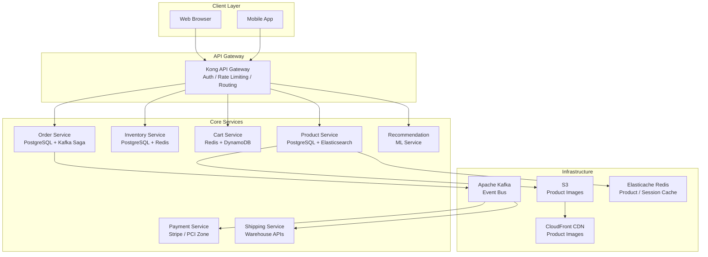

## WHY

Designing an e-commerce platform like Amazon is the ultimate full-stack system design challenge. It tests your understanding of product catalog search, inventory management, the ordering pipeline, payment processing, recommendation engines, and global-scale CDN delivery — all simultaneously.

Amazon serves 300M+ customers, processes $1.3B+ in revenue per day, and deploys software to production every 11 seconds. Understanding how this works separates senior from staff engineer.

---

## THEORY

### Core Subsystems of an E-Commerce Platform

1. **Product Catalog & Search** — Millions of products with complex attributes, full-text search, filtering
2. **Inventory Management** — Real-time stock levels, warehouse routing, reservation
3. **Shopping Cart** — Session-based, persistent, high read/write, eventual consistency acceptable
4. **Order Management** — Saga-based distributed transaction across inventory, payment, fulfillment
5. **Payment Processing** — PCI compliance, idempotency, fraud detection
6. **Recommendation Engine** — Collaborative filtering, ML-based personalization
7. **Review & Rating System** — Write-heavy, eventually consistent reads
8. **Search & Discovery** — ElasticSearch/OpenSearch full-text with faceted filtering
9. **Pricing & Promotions** — Dynamic pricing, flash sales, coupon application
10. **Notifications** — Order confirmation, shipping updates, promotions

### Key Design Decisions

**Product Catalog**: Products have heterogeneous attributes (a shoe has size/color, a TV has resolution/inches). Store in a flexible schema using **PostgreSQL with JSONB** for attributes, or **DynamoDB** with a generic attribute map. Use **Elasticsearch** for full-text product search with faceted filtering.

**Inventory Reservation Problem**: When a user adds to cart, do you reserve inventory? If yes, you prevent other purchases but carts are abandoned 70% of the time. Amazon's answer: **soft reservation** at add-to-cart (soft hold, short TTL), **hard reservation** at checkout, **release** if not purchased within 15 minutes.

**Cart as a Service**: Cart is ephemeral but must survive browser restarts. Store in **Redis** (fast, TTL-based), with DynamoDB as persistent backup.

---

## VISUALIZATION_CONFIG



---

## CODE

### Level 1 — Capacity Estimation

```
SCALE ASSUMPTIONS (Amazon-like):
- 300M registered users, 30M Daily Active Users
- 500M product listings
- Peak: 120,000 searches/second (Black Friday)
- 10M orders per day = ~115 orders/second (peak 1,000/second)

STORAGE:
- Product catalog: 500M products × 2KB metadata = 1 TB
- Product images: 500M products × 5 images × 200KB = 500 TB → S3 + CDN
- Orders: 10M/day × 365 × 5 years × 2KB = ~36 TB
- Cart data: 30M active users × 2KB = 60 GB → fits in Redis cluster

BANDWIDTH (CDN):
- Product page: 200KB images × 10M page views/hour = ~555 MB/s
- Must serve from CDN, NOT origin — CDN absorbs 95%+ of image traffic

READS vs WRITES:
- Product pages: 1000:1 read-to-write ratio → heavy caching essential
- Orders: write-heavy during flash sales → shard by user/order ID
```

### Level 2 — Data Model

```sql
-- Product catalog (PostgreSQL)
CREATE TABLE products (
    id           UUID PRIMARY KEY DEFAULT gen_random_uuid(),
    seller_id    UUID NOT NULL,
    title        VARCHAR(500) NOT NULL,
    description  TEXT,
    category_id  INTEGER,
    base_price   NUMERIC(12,2) NOT NULL,
    attributes   JSONB,  -- flexible: {"size": "XL", "color": "blue", "material": "cotton"}
    is_active    BOOLEAN DEFAULT true,
    created_at   TIMESTAMPTZ DEFAULT now()
);

-- GIN index for fast JSONB attribute filtering
CREATE INDEX idx_products_attributes ON products USING GIN(attributes);
-- Full-text search index
CREATE INDEX idx_products_fts ON products USING GIN(
    to_tsvector('english', title || ' ' || COALESCE(description, ''))
);

-- Inventory with optimistic locking
CREATE TABLE inventory (
    product_id      UUID PRIMARY KEY REFERENCES products(id),
    warehouse_id    UUID NOT NULL,
    quantity_total  INTEGER NOT NULL DEFAULT 0,
    quantity_reserved INTEGER NOT NULL DEFAULT 0,
    version         BIGINT NOT NULL DEFAULT 0,  -- optimistic lock
    updated_at      TIMESTAMPTZ DEFAULT now()
);

-- Orders
CREATE TABLE orders (
    id              UUID PRIMARY KEY DEFAULT gen_random_uuid(),
    user_id         UUID NOT NULL,
    status          VARCHAR(50) NOT NULL,  -- PENDING, CONFIRMED, SHIPPED, DELIVERED
    total_amount    NUMERIC(12,2) NOT NULL,
    shipping_address JSONB NOT NULL,
    created_at      TIMESTAMPTZ DEFAULT now()
) PARTITION BY RANGE (created_at);  -- Monthly partitions

-- Order Items
CREATE TABLE order_items (
    id          UUID PRIMARY KEY,
    order_id    UUID NOT NULL REFERENCES orders(id),
    product_id  UUID NOT NULL,
    quantity    INTEGER NOT NULL,
    unit_price  NUMERIC(12,2) NOT NULL,
    total_price NUMERIC(12,2) NOT NULL
);

-- Cart (Redis preferred, but SQL schema for reference)
CREATE TABLE carts (
    user_id     UUID PRIMARY KEY,
    items       JSONB NOT NULL DEFAULT '[]',
    updated_at  TIMESTAMPTZ DEFAULT now()
);
```

### Level 3 — Inventory Reservation (Critical Race Condition)

```java
@Service
@RequiredArgsConstructor
public class InventoryService {

    private final InventoryRepository inventoryRepository;
    private final RedisTemplate<String, Object> redis;

    /**
     * Reserve inventory for an order.
     * Uses optimistic locking to prevent overselling.
     */
    @Transactional(isolation = Isolation.READ_COMMITTED)
    public boolean reserve(UUID productId, int quantity) {
        // 1. Check Redis cache first (fast path)
        Integer cachedQty = (Integer) redis.opsForValue()
            .get("inventory:" + productId);
        if (cachedQty != null && cachedQty < quantity) {
            return false; // Quick rejection without DB hit
        }

        // 2. Optimistic locking: read current state
        Inventory inventory = inventoryRepository.findByProductIdWithLock(productId)
            .orElseThrow(() -> new ProductNotFoundException(productId));

        int available = inventory.getQuantityTotal() - inventory.getQuantityReserved();

        if (available < quantity) {
            return false; // Insufficient stock
        }

        // 3. CAS-style update with version check (optimistic lock)
        int updated = inventoryRepository.reserveWithOptimisticLock(
            productId,
            quantity,
            inventory.getVersion()
        );

        if (updated == 0) {
            // Another transaction modified it — retry or throw
            throw new ConcurrentModificationException("Inventory modified concurrently, retry");
        }

        // 4. Invalidate cache
        redis.delete("inventory:" + productId);
        return true;
    }
}

// Repository with version-based optimistic lock
@Query("UPDATE inventory SET quantity_reserved = quantity_reserved + :qty, version = version + 1 " +
       "WHERE product_id = :productId AND version = :version " +
       "AND (quantity_total - quantity_reserved) >= :qty")
int reserveWithOptimisticLock(UUID productId, int qty, long version);
```

### Level 4 — Search with Elasticsearch

```java
@Repository
@RequiredArgsConstructor
public class ProductSearchRepository {

    private final ElasticsearchClient esClient;

    public SearchResult<ProductDocument> search(ProductSearchQuery query) throws IOException {
        SearchRequest.Builder builder = new SearchRequest.Builder()
            .index("products")
            .from(query.getPage() * query.getSize())
            .size(query.getSize())
            .query(buildQuery(query))
            .aggregations(buildFacets());

        SearchResponse<ProductDocument> response = esClient.search(
            builder.build(), ProductDocument.class);

        return buildResult(response);
    }

    private Query buildQuery(ProductSearchQuery q) {
        return Query.of(qb -> qb.bool(b -> {
            // Full-text search on title and description
            if (q.getKeyword() != null) {
                b.must(m -> m.multiMatch(mm -> mm
                    .fields("title^3", "description^1", "brand^2")  // ^N = boost
                    .query(q.getKeyword())
                    .fuzziness("AUTO")  // typo tolerance
                ));
            }
            // Category filter
            if (q.getCategoryId() != null) {
                b.filter(f -> f.term(t -> t.field("category_id").value(q.getCategoryId())));
            }
            // Price range filter
            if (q.getMinPrice() != null || q.getMaxPrice() != null) {
                b.filter(f -> f.range(r -> {
                    r.field("price");
                    if (q.getMinPrice() != null) r.gte(JsonData.of(q.getMinPrice()));
                    if (q.getMaxPrice() != null) r.lte(JsonData.of(q.getMaxPrice()));
                    return r;
                }));
            }
            return b;
        }));
    }

    private Map<String, Aggregation> buildFacets() {
        return Map.of(
            "brands", Aggregation.of(a -> a.terms(t -> t.field("brand.keyword").size(20))),
            "price_ranges", Aggregation.of(a -> a.range(r -> r
                .field("price")
                .ranges(
                    ranges -> ranges.to("25").key("Under $25"),
                    ranges -> ranges.from("25").to("50").key("$25-$50"),
                    ranges -> ranges.from("50").to("100").key("$50-$100"),
                    ranges -> ranges.from("100").key("Over $100")
                )
            ))
        );
    }
}
```

---

## REAL_WORLD

### Amazon's Actual Architecture

Amazon pioneered the **SOA (Service-Oriented Architecture)** that became microservices. Each team owns a service with a strict "two-pizza team" rule (< 8 people). Services communicate only via APIs — no shared databases. This led to AWS (they built infrastructure to manage their own services, then sold it). Key technologies: DynamoDB (invented for shopping cart scale), S3 (invented for product images), SQS (invented for order queue processing).

### Flash Sale Problem

When Amazon runs a Lightning Deal, thousands of customers try to buy 100 units in seconds. Naive solution: distributed lock on inventory → severe contention. Amazon's solution:
1. Pre-sell estimate cached in Redis using `DECR` (atomic decrement)
2. Redis `DECR` returns the new value — if negative, reject immediately (no DB hit)
3. Confirmed purchases written to DB asynchronously via Kafka
4. Periodic reconciliation ensures Redis and DB stay in sync

---

## INTERVIEW

**Q1: How would you design the product search to handle 120,000 searches/second?**
> Use Elasticsearch/OpenSearch cluster: (1) Products are indexed in ES when created/updated via Kafka consumer (async). (2) Read queries go directly to ES cluster (not PostgreSQL). (3) ES scales horizontally — 10 nodes × 12,000 searches/sec each. (4) Search results cached in Redis for popular queries (30-second TTL). (5) Products DB stays normalized in PostgreSQL for write consistency; ES is a read replica optimized for search.

**Q2: How do you prevent overselling during a flash sale?**
> Multi-layer approach: (1) Redis atomic DECR for fast pre-check: `DECRBY inventory:{productId} {quantity}` — if result < 0, immediately reject without touching DB. (2) Optimistic locking in PostgreSQL for actual reservation: UPDATE with WHERE version = current_version. (3) Saga pattern for final order: reserve inventory → process payment → confirm. If any step fails, compensate. (4) Background reconciliation: Kafka consumer periodically syncs Redis counts with DB.

**Q3: How would you scale the shopping cart to 30M concurrent users?**
> Shopping cart data is perfect for Redis: (1) Key: `cart:{userId}`, Value: JSON array of items. (2) Redis cluster with consistent hashing — cart data sharded by userId. (3) TTL: 30 days for guest carts, no TTL for logged-in users. (4) On cart conversion to order: persist to PostgreSQL within the order Saga. (5) Redis handles 30M users trivially — each cart ~2KB × 30M = 60GB, fits in a modest Redis cluster.

**Q4: How would you design the recommendation engine?**
> Offline batch + online serving separation: (1) Batch: Apache Spark ML job runs nightly, computes collaborative filtering matrix factorization (users × products → similarity scores). Outputs stored in Redis/DynamoDB as `recommendations:{userId}` → list of product IDs. (2) Online serving: simple Redis GET, return pre-computed recs. (3) Real-time signals: recently viewed products stored in Redis (LIST with RPUSH/LTRIM). Online model re-ranks batch recs based on recent behavior. (4) Cold start (new user): use category-based popularity rankings.

---

## FEYNMAN CHECK

Amazon is like a massive city with specialized districts:

- **Product Search** is the city directory — Elasticsearch is like a super-fast phone book that can find "blue shoes under $50" in milliseconds.
- **Inventory** is the warehouse — Postgres tracks what's physically there, Redis tracks what's been "called dibs on" (reserved carts).
- **Cart** is your shopping basket that follows you around (stored in Redis — it's the fastest "shelf" in the store).
- **Order processing** is the checkout process — a Saga ensuring you only pay if the item is actually in stock, and you get a refund if anything goes wrong.
- **CDN** is the store's display photos — instead of every customer calling the main warehouse to see product photos, copies are kept in local distribution centers (edge nodes) worldwide.

---

## BUILD

**Challenge: Build a minimal but production-quality product catalog and cart service.**

Requirements:
1. `ProductService`: CRUD + search via PostgreSQL full-text search (`ts_vector`)
2. `InventoryService`: `reserve(productId, quantity)` using optimistic locking (version column)
3. `CartService`: Redis-backed cart with TTL, `add/remove/clear` operations
4. `OrderService`: Saga — reserve inventory → create order record → publish `OrderCreated` event
5. Compensation: if order creation fails, release inventory reservation
6. Elasticsearch integration for product search with price range facets
7. Load test: simulate 50 concurrent requests to `reserve()` for a product with quantity=10 — verify exactly 10 succeed and 40 fail gracefully
8. Write integration tests with Testcontainers (PostgreSQL + Redis + Elasticsearch)

---

## SPACED REVIEW

- Product catalog: PostgreSQL + JSONB for attributes + Elasticsearch for search
- Inventory reservation: Redis DECR (fast pre-check) + optimistic locking in DB (final reservation)
- Cart: Redis with TTL (30 days guest, persistent for logged-in)
- Order pipeline: Saga pattern (reserve inventory → charge payment → confirm)
- Flash sale: Redis atomic DECR prevents overselling without DB lock contention
- Product images: S3 for storage, CloudFront CDN for global delivery
- Search: Elasticsearch supports full-text, fuzzy matching, price range aggregations/facets
- Recommendations: Offline batch (Spark ML) + Online serving (Redis) + Real-time re-ranking
- Partition orders table by date — fast range queries, easy archival
- Read-to-write ratio on product pages: 1000:1 → aggressive caching with Redis

