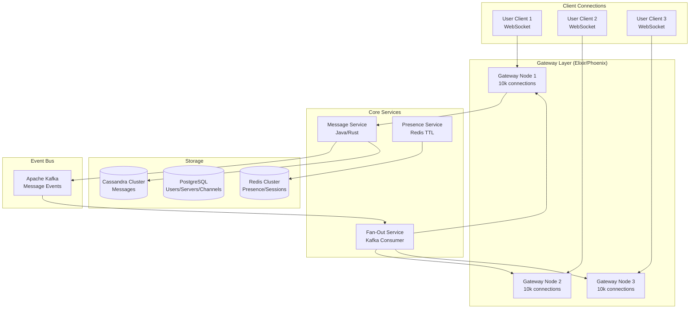

## WHY

Discord serves 19 million concurrent users across 750,000+ servers, delivering messages in under 50ms globally. Designing it tests your understanding of WebSocket at scale, fan-out messaging, presence systems (online/offline indicators), and how to shard a chat application across distributed infrastructure.

Discord's engineering blog is one of the most cited in system design interviews — they've openly shared how they moved from MongoDB to Cassandra, implemented CQRS for read-heavy workloads, and use Elixir for their real-time gateway.

---

## THEORY

### Core Challenges

**1. Message Fan-Out**: When a user sends a message in a server with 100,000 members, how do you deliver it to all active members?

**2. Presence System**: How do you track which of 500M users are online? A naive approach (DB poll every 10 seconds) = 500M × every 10s = catastrophic.

**3. Message History**: Users scroll back years of chat history. How do you serve old messages fast with new ones appearing in real-time?

**4. Read Receipts at Scale**: Showing "last seen" for each message requires tracking every user's read state — billions of records.

### Architecture Overview

**Gateway Service**: Maintains persistent WebSocket connections with clients. Each gateway pod handles ~10,000 connections. Implemented in Elixir (Phoenix Framework) — chosen for its actor model (1M+ concurrent processes in a single node).

**Message Service**: Receives messages, validates, stores, and publishes to fan-out queues.

**Fan-Out Service**: Reads server membership, finds online members, pushes messages via WebSocket gateways.

**Presence Service**: Tracks online/offline state with TTL-based heartbeats.

**Storage**:
- **Messages**: Cassandra (high-write throughput, time-series ordering)
- **Server/Channel metadata**: PostgreSQL
- **Presence data**: Redis (TTL-based heartbeats)
- **File uploads**: GCS/S3 + CDN

### Why Cassandra for Messages?

Messages are time-series data: you write once, read in chronological ranges. Cassandra's data model is perfect:
- Partition key: `(channel_id, bucket)` where bucket = time period (e.g., per-month)
- Clustering key: `message_id` (snowflake, encodes time)
- This gives fast range queries: "give me messages in channel X from timestamp A to B"
- Write throughput: 1M writes/second across cluster (Discord processes 26,000 msg/second peak)

---

## VISUALIZATION_CONFIG



---

## CODE

### Level 1 — Capacity Estimation

```
DISCORD SCALE:
- 500M registered users, 19M concurrent users
- 750,000 servers (guilds)
- 26,000 messages per second (peak)
- ~70% messages in servers, ~30% DMs

MESSAGE STORAGE:
- 26,000 msg/sec × 86,400 sec/day = 2.25 BILLION messages per day
- Average message: 200 bytes
- Daily storage: 2.25B × 200B = 450 GB/day
- 5-year storage: 450GB × 365 × 5 = ~820 TB → Cassandra cluster needed

WEBSOCKET CONNECTIONS:
- 19M concurrent users, each holds 1 WebSocket connection
- 19M connections ÷ 10,000 connections/node = 1,900 gateway nodes
- With 100K connections/optimized Elixir node: only 190 nodes!

PRESENCE HEARTBEATS:
- 19M active users send heartbeat every 5 seconds
- 19M / 5 = 3.8M heartbeat ops/second → Redis cluster essential
```

### Level 2 — Data Model (Cassandra Messages)

```sql
-- Cassandra schema for messages
-- Partition key: (channel_id, bucket) — keeps partitions bounded
-- Bucket = month bucket: channel messages are partitioned by month to prevent
-- "super partitions" (single partition growing infinitely)

CREATE TABLE messages (
    channel_id  BIGINT,
    bucket      INT,           -- YYYYMM, e.g., 202501
    message_id  BIGINT,        -- Snowflake ID: encodes timestamp + worker + sequence
    author_id   BIGINT,
    content     TEXT,
    attachments LIST<FROZEN<attachment>>,
    mentions    LIST<BIGINT>,
    edited_at   TIMESTAMP,
    deleted     BOOLEAN,
    PRIMARY KEY ((channel_id, bucket), message_id)
) WITH CLUSTERING ORDER BY (message_id DESC);  -- Latest messages first

-- Index to find which bucket to query for a given timestamp
CREATE TABLE message_channel_buckets (
    channel_id  BIGINT,
    bucket      INT,
    PRIMARY KEY (channel_id, bucket)
);
```

```java
// Message retrieval service
@Repository
@RequiredArgsConstructor
public class MessageRepository {

    private final CqlSession session;

    public List<Message> getMessages(long channelId, long beforeMessageId, int limit) {
        // Determine bucket from message_id timestamp
        long timestamp = SnowflakeId.extractTimestamp(beforeMessageId);
        int bucket = toBucket(timestamp); // YYYYMM

        List<Message> results = new ArrayList<>();

        // May need to query multiple buckets if crossing month boundary
        while (results.size() < limit && bucket >= OLDEST_BUCKET) {
            PreparedStatement stmt = session.prepare(
                "SELECT * FROM messages WHERE channel_id = ? AND bucket = ? " +
                "AND message_id < ? LIMIT ? ALLOW FILTERING"
            );

            List<Row> rows = session.execute(
                stmt.bind(channelId, bucket, beforeMessageId, limit - results.size())
            ).all();

            rows.stream()
                .map(this::mapToMessage)
                .forEach(results::add);

            bucket--; // Go to previous month's bucket
        }

        return results;
    }
}
```

### Level 3 — Fan-Out via Kafka

```java
@Service
@RequiredArgsConstructor
public class MessageFanOutService {

    private final GuildMembershipCache membershipCache;
    private final PresenceService presenceService;
    private final GatewayRouter gatewayRouter;

    @KafkaListener(topics = "discord.messages", groupId = "fanout-group")
    public void fanOutMessage(MessageCreatedEvent event) {
        long channelId = event.getChannelId();
        long serverId = event.getServerId();

        // 1. Get all members of the server (from cache)
        Set<Long> serverMembers = membershipCache.getMemberIds(serverId);

        // 2. Filter to only ONLINE members (presence check)
        Set<Long> onlineMembers = serverMembers.stream()
            .filter(userId -> presenceService.isOnline(userId))
            .collect(Collectors.toSet());

        // 3. Find which gateway each online user is connected to
        // (users might be on different gateway nodes)
        Map<String, List<Long>> gatewayToUsers = onlineMembers.stream()
            .collect(Collectors.groupingBy(
                userId -> gatewayRouter.getGatewayNode(userId)
            ));

        // 4. Send message to each gateway node (it pushes via WebSocket to clients)
        gatewayToUsers.forEach((gatewayNode, userIds) -> {
            gatewayRouter.deliverToNode(gatewayNode, new GatewayDelivery(
                event.getMessage(),
                userIds
            ));
        });

        log.debug("Fan-out complete: {} msg to {} online members across {} gateways",
            event.getMessage().getId(), onlineMembers.size(), gatewayToUsers.size());
    }
}
```

### Level 4 — Presence System (Heartbeat + Redis TTL)

```java
@Service
@RequiredArgsConstructor
public class PresenceService {

    private final RedisTemplate<String, String> redis;
    private static final Duration HEARTBEAT_TTL = Duration.ofSeconds(15);
    private static final String PRESENCE_KEY = "presence:";

    /**
     * Client sends heartbeat every 5 seconds.
     * If no heartbeat for 15 seconds, user is considered offline.
     */
    public void heartbeat(long userId, String sessionId, String status) {
        String key = PRESENCE_KEY + userId;

        // SETEX: set with expiry — if client disconnects, key expires automatically
        redis.opsForValue().set(key,
            status + ":" + sessionId,
            HEARTBEAT_TTL
        );
    }

    public boolean isOnline(long userId) {
        return redis.hasKey(PRESENCE_KEY + userId);
    }

    /**
     * Check presence for many users at once (bulk).
     * Used during fan-out to filter online users.
     */
    public Set<Long> filterOnline(Set<Long> userIds) {
        // Pipeline all EXISTS checks in one Redis round-trip
        List<Object> results = redis.executePipelined(conn -> {
            userIds.forEach(id ->
                conn.keyCommands().exists((PRESENCE_KEY + id).getBytes())
            );
            return null;
        });

        Iterator<Long> userIdIter = userIds.iterator();
        Set<Long> onlineUsers = new HashSet<>();
        for (Object exists : results) {
            Long userId = userIdIter.next();
            if (Boolean.TRUE.equals(exists)) {
                onlineUsers.add(userId);
            }
        }
        return onlineUsers;
    }
}
```

---

## REAL_WORLD

### Discord's MongoDB → Cassandra Migration

In 2017, Discord stored messages in MongoDB. As they grew, a single server's message collection exceeded 100 million documents, causing random I/O patterns on spinning disks, leading to database CPU pegging at 100%. MongoDB's document-based sharding required hot partition resharding as traffic grew.

The solution: Cassandra's wide-column model maps perfectly to message retrieval patterns. The `(channel_id, bucket, message_id)` primary key ensures:
- All messages for a channel in a time range are on the same nodes (data locality)
- Writes are sequential on disk (LSM tree) — extremely fast
- No hot partition problem: bucket divides the data evenly over time

Result: message read latency dropped from 80ms p95 to 5ms p95.

---

## INTERVIEW

**Q1: How does Discord handle the fan-out problem for large servers (100K members)?**
> The naive approach of querying all 100K members in real-time per message is too slow. Discord uses: (1) Server membership cached in Redis/in-memory: `Set<Long> memberIds` per server. (2) Presence service to filter to only online members: presence keys in Redis with TTL. (3) The fan-out service only delivers to online members — typical large server may have 2-5% online. (4) For "mega servers" (millions of members like Minecraft), they use "lazy" fan-out — only actively-scrolling users get real-time delivery; others pull on reconnect.

**Q2: How do you design the presence system to scale to 19M concurrent users?**
> Using Redis TTL-based heartbeats: (1) Each client sends a heartbeat every 5 seconds. (2) Server does `SET presence:{userId} online EX 15` (expires in 15s). (3) If client disconnects without sending a goodbye, key naturally expires after 15 seconds — eventually consistent offline detection. (4) 19M users × 1 heartbeat/5s = 3.8M SET operations/second → Redis cluster with 10 nodes × 500K ops/sec handles this comfortably. (5) Bulk presence checks use Redis pipeline to check thousands of users in one network round-trip.

**Q3: Why is Cassandra better than PostgreSQL for message storage?**
> Messages are pure time-series append-only data with the following patterns: writes always go to "now" (appended in time order), reads are always "give me messages before ID X, limit 50." PostgreSQL B-tree indexes handle time-range queries but struggle under millions of writes/second (lock contention, vacuuming overhead). Cassandra's LSM-tree handles writes sequentially (no random I/O), and the `(channel_id, bucket, message_id)` primary key makes time-range reads a sequential scan of a single partition — optimal for SSDs. Discord processes 26K msg/s; Cassandra handles this with linear horizontal scaling.

**Q4: How do you handle message ordering when multiple clients submit messages simultaneously?**
> Discord uses Snowflake IDs (same concept as Twitter): 64-bit integers encoding `(timestamp, worker_id, sequence)`. The timestamp component (41 bits) ensures IDs sort chronologically. If two messages arrive at the same millisecond, `sequence` differentiates them deterministically within the same worker. This provides total ordering of messages per channel without requiring a distributed lock. Cassandra's `CLUSTERING ORDER BY (message_id DESC)` stores them already sorted, making recent-first queries zero additional sort cost.

---

## FEYNMAN CHECK

Think of Discord like a massive building with rooms (channels) and billions of sticky notes (messages).

**The fan-out problem**: When you yell something in Room 500 (a popular server), 100,000 people are members, but only 2,000 are currently listening (online). How do you tell only those 2,000? You don't ring all 100,000 doorbells — you check your "who's home?" board (presence/Redis), find the 2,000 who are, and use their room numbers (gateway node IDs) to deliver the message only to them.

**Cassandra for messages**: Imagine a filing cabinet sorted by (room number, month, time). "Give me all notes from Room 500, January 2026, after 3pm" is one clean section of one drawer — no searching through other rooms. PostgreSQL would be like a mixed filing cabinet requiring a sorted index scan through millions of entries from all rooms.

**WebSocket vs HTTP**: HTTP is like sending a letter — you write, send, wait for reply. WebSocket is like a phone call — once connected, both sides can talk anytime. Discord needs WebSocket because the server must PUSH messages to you the instant they arrive. HTTP polling (checking "any new messages?" every second) would flood servers with 19M × 1 request/second = catastrophic.

---

## BUILD

**Challenge: Build a simplified Discord-like group messaging service.**

Requirements:
1. WebSocket endpoint using Spring WebSocket: `WS /ws/connect` with user authentication
2. `MessageService`: persist messages to PostgreSQL (or Cassandra if available) with Snowflake ID ordering
3. `PresenceService`: Redis TTL heartbeat — client sends `PING` every 5s, server marks online
4. `FanOutService`: when a message is sent, fetch channel members, filter online ones, push via WebSocket
5. Support 3 concurrent server rooms with multiple users each
6. Load test: 100 concurrent WebSocket connections, each sending 1 msg/second for 60 seconds
7. Message history: `GET /channels/{id}/messages?before={id}&limit=50`
8. Bonus: Implement message delivery acknowledgement — client ACKs receipt, mark as delivered

---

## SPACED REVIEW

- WebSocket: persistent bidirectional connection — server can PUSH to client anytime
- Fan-out problem: message to large server → only deliver to ONLINE members (presence filter)
- Presence: Redis TTL heartbeat (`SET presence:{userId} EX 15`) — auto-expires if disconnected
- Cassandra message schema: partition by `(channel_id, bucket)` + cluster by `message_id DESC`
- Bucket = time period (month/week) to prevent infinitely growing partitions
- Snowflake ID: 64-bit = timestamp (41) + worker (10) + sequence (12) — self-sorting chronologically
- Fan-out scales: fetch members from cache → filter online via Redis pipeline → route to gateway nodes
- Gateway: Elixir/Phoenix chosen for actor model — 1M+ lightweight processes per node
- Discord switched MongoDB → Cassandra: sequential writes (LSM) + data locality by channel
- For mega-servers: lazy fan-out — only deliver to actively-scrolling users, others pull on reconnect

