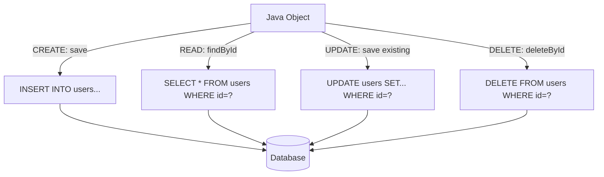
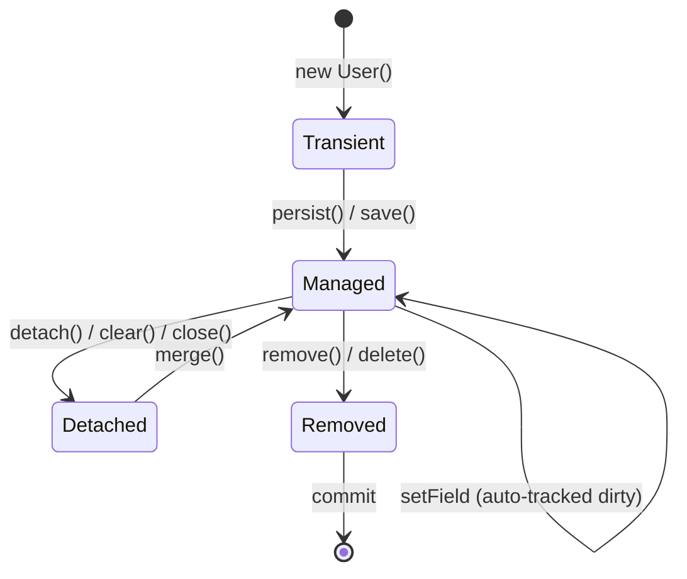

## WHY

CRUD — Create, Read, Update, Delete — is the bedrock of nearly every business application. Before standardized data access frameworks like JPA (Java Persistence API, 2006) and Spring Data (2011), Java developers wrote raw JDBC for every database operation: 30 lines of boilerplate for a single insert, manual ResultSet parsing for queries, manual transaction management, and ad-hoc connection pooling. A simple "save a User to the database" required 50+ lines, half of which was error handling for SQLException — a checked exception forcing try/catch even when you just wanted to read a row.

The specific pain CRUD frameworks solve: **N+1 queries, connection leaks, SQL injection vulnerabilities, manual mapping between rows and objects, and inconsistent transaction boundaries.** Each of these was a production-incident category before standardization. Hibernate (2001) introduced ORM (Object-Relational Mapping) to eliminate manual row-to-object mapping; JPA (2006) standardized the annotations across vendors; Spring Data (2011) eliminated the boilerplate of writing repository implementations by generating them at runtime from interface method names.

The production failure mode that CRUD frameworks attempt to prevent but often cause is **the N+1 query problem**: code that looks like one query but actually executes N+1 queries — one to load N parent records and then N more to load each parent's children. A naive `userRepository.findAll().forEach(u -> u.getOrders().size())` produces 1 query for users + 1 query per user for orders. On a list of 1000 users, this is 1001 queries to the database — a 30-second response time when it should be 50ms. Production systems must use eager fetching, projection queries, or explicit JOIN FETCH to avoid this.

Senior engineers must understand: the lifecycle states of JPA entities (transient, managed, detached, removed), the difference between `EntityManager.persist()` and `merge()`, transaction propagation semantics, the JPA cache layers (first-level vs second-level), and why "everything looks like one query in Java" can hide catastrophic database load.

## THEORY

### CRUD Operations in JPA / Spring Data



### Entity Lifecycle States



### Spring Data Repository Hierarchy

| Interface | Methods | Use Case |
|-----------|---------|----------|
| `Repository<T, ID>` | (marker, no methods) | Custom repository signatures |
| `CrudRepository<T, ID>` | save, findById, deleteById, count, existsById | Basic CRUD |
| `PagingAndSortingRepository<T, ID>` | + findAll(Pageable), findAll(Sort) | List views, pagination |
| `JpaRepository<T, ID>` | + saveAndFlush, deleteAllInBatch, getReferenceById | JPA-specific batch ops |

### N+1 Problem Visualization

```
Bad query pattern:
SELECT * FROM users           ← 1 query, returns 1000 users
For each user:
  SELECT * FROM orders        ← 1000 queries, one per user
  WHERE user_id = ?
Total: 1001 queries → catastrophic latency

Good query pattern with JOIN FETCH:
SELECT u.*, o.* FROM users u  ← 1 query, joins orders eagerly
  LEFT JOIN orders o ON o.user_id = u.id
Total: 1 query → 50ms response
```

### Common Misconception

> "Spring Data findAll() loads everything I need in one query."

**Reality:** `findAll()` loads the entity rows only. If the entity has lazy-loaded relationships (`@OneToMany(fetch=LAZY)`, the default), accessing them later triggers additional queries. The infamous "N+1 problem" happens silently — the code looks like one method call. Use `@EntityGraph`, `JOIN FETCH` in JPQL, or DTO projections to control exactly which data loads in a single query.

## VISUALIZATION_CONFIG

```json
{ "component": "SequenceDiagram", "state": "java-mastery-crud-operations" }
```

## CODE

### Level 1 — Beginner: Entity, Repository, Basic CRUD

```java
import jakarta.persistence.*;
import org.springframework.data.jpa.repository.JpaRepository;
import org.springframework.stereotype.Service;
import java.time.Instant;
import java.util.*;

// Entity — maps to a database table
@Entity
@Table(name = "users")
public class User {
    @Id
    @GeneratedValue(strategy = GenerationType.IDENTITY)
    private Long id;

    @Column(nullable = false, unique = true)
    private String email;

    @Column(nullable = false)
    private String name;

    @Column(name = "created_at", nullable = false, updatable = false)
    private Instant createdAt;

    @PrePersist
    void onCreate() { this.createdAt = Instant.now(); }

    // Constructors
    protected User() {} // JPA requires no-arg constructor
    public User(String email, String name) {
        this.email = email;
        this.name = name;
    }

    // Getters/setters
    public Long getId() { return id; }
    public String getEmail() { return email; }
    public void setEmail(String e) { this.email = e; }
    public String getName() { return name; }
    public void setName(String n) { this.name = n; }
    public Instant getCreatedAt() { return createdAt; }
}

// Spring Data repository — Spring generates the implementation
public interface UserRepository extends JpaRepository<User, Long> {
    // Query method — Spring derives SQL from method name
    Optional<User> findByEmail(String email);
    boolean existsByEmail(String email);
}

// Service using the repository
@Service
public class UserService {
    private final UserRepository repository;

    public UserService(UserRepository repository) {
        this.repository = repository;
    }

    public User create(String email, String name) {
        if (repository.existsByEmail(email)) {
            throw new IllegalStateException("Email already exists: " + email);
        }
        return repository.save(new User(email, name));
    }

    public User findById(Long id) {
        return repository.findById(id)
            .orElseThrow(() -> new NoSuchElementException("User not found: " + id));
    }

    public User update(Long id, String newName) {
        User user = findById(id);
        user.setName(newName);
        return repository.save(user);  // saves changes
    }

    public void delete(Long id) {
        repository.deleteById(id);
    }
}
```

### Level 2 — Intermediate: Pagination, Sorting, Custom Queries

```java
import org.springframework.data.domain.*;
import org.springframework.data.jpa.repository.*;
import org.springframework.data.repository.query.Param;
import java.util.*;

public interface UserRepository extends JpaRepository<User, Long> {

    // Pagination — returns Page<T> with total count, navigation metadata
    Page<User> findByNameContainingIgnoreCase(String namePart, Pageable pageable);

    // Custom JPQL query with named parameter
    @Query("SELECT u FROM User u WHERE u.createdAt > :since ORDER BY u.createdAt DESC")
    List<User> findRecentUsers(@Param("since") java.time.Instant since);

    // Native SQL when JPQL is insufficient
    @Query(value = """
            SELECT * FROM users
            WHERE email ILIKE :pattern
            AND created_at > NOW() - INTERVAL '30 days'
            """, nativeQuery = true)
    List<User> findActiveUsersByEmailPattern(@Param("pattern") String pattern);

    // Modifying query — INSERT/UPDATE/DELETE
    @Modifying
    @Query("UPDATE User u SET u.name = :newName WHERE u.id = :id")
    int updateNameById(@Param("id") Long id, @Param("newName") String newName);
}

@Service
@org.springframework.transaction.annotation.Transactional
public class UserService {
    private final UserRepository repository;
    public UserService(UserRepository repository) { this.repository = repository; }

    // Paginated listing
    public Page<User> listUsers(int page, int size, String search) {
        Pageable pageable = PageRequest.of(page, size,
            Sort.by(Sort.Direction.DESC, "createdAt"));
        return search != null && !search.isBlank()
            ? repository.findByNameContainingIgnoreCase(search, pageable)
            : repository.findAll(pageable);
    }

    // Batch operations
    public List<User> createMany(List<User> users) {
        return repository.saveAll(users);  // efficient batch insert
    }

    // Update via modifying query — no need to load entity first
    public int rename(Long id, String newName) {
        return repository.updateNameById(id, newName);
    }
}
```

### Level 3 — Advanced: Avoiding N+1, Projections, Transactions

```java
import jakarta.persistence.*;
import org.springframework.data.jpa.repository.*;
import org.springframework.data.repository.query.Param;
import java.util.*;

@Entity @Table(name = "users")
public class User {
    @Id @GeneratedValue private Long id;
    private String email;
    private String name;

    @OneToMany(mappedBy = "user", fetch = FetchType.LAZY,
               cascade = CascadeType.ALL, orphanRemoval = true)
    private List<Order> orders = new ArrayList<>();

    public List<Order> getOrders() { return orders; }
    public Long getId() { return id; }
    public String getEmail() { return email; }
    public String getName() { return name; }
}

@Entity @Table(name = "orders")
public class Order {
    @Id @GeneratedValue private Long id;

    @ManyToOne(fetch = FetchType.LAZY)
    @JoinColumn(name = "user_id", nullable = false)
    private User user;

    private java.math.BigDecimal total;
    public java.math.BigDecimal getTotal() { return total; }
}

// DTO for projection — avoids loading full entity
public record UserSummary(Long id, String name, long orderCount) {}

public interface UserRepository extends JpaRepository<User, Long> {

    // ✅ JOIN FETCH — eager-loads orders in a single query
    @Query("SELECT u FROM User u LEFT JOIN FETCH u.orders WHERE u.id = :id")
    Optional<User> findByIdWithOrders(@Param("id") Long id);

    // ✅ EntityGraph — declarative eager loading
    @EntityGraph(attributePaths = {"orders"})
    @Query("SELECT u FROM User u WHERE u.id IN :ids")
    List<User> findByIdsWithOrders(@Param("ids") List<Long> ids);

    // ✅ DTO Projection — only loads needed fields, no entity overhead
    @Query("""
        SELECT new com.app.UserSummary(u.id, u.name, COUNT(o.id))
        FROM User u LEFT JOIN u.orders o
        GROUP BY u.id, u.name
        """)
    List<UserSummary> findAllAsSummary();

    // ✅ Streaming for large result sets — doesn't load all into memory
    @Query("SELECT u FROM User u")
    java.util.stream.Stream<User> streamAllUsers();
}

@Service
public class UserService {
    private final UserRepository repository;
    public UserService(UserRepository repository) { this.repository = repository; }

    // Transactional boundary — all queries within share one DB transaction
    @org.springframework.transaction.annotation.Transactional(readOnly = true)
    public java.math.BigDecimal totalSpendForUser(Long userId) {
        return repository.findByIdWithOrders(userId)
            .map(u -> u.getOrders().stream()
                .map(Order::getTotal)
                .reduce(java.math.BigDecimal.ZERO, java.math.BigDecimal::add))
            .orElse(java.math.BigDecimal.ZERO);
    }
}
```

### Level 4 — Expert / Production: Complete CRUD Service with Optimistic Locking, Audit

```java
import jakarta.persistence.*;
import org.springframework.data.annotation.*;
import org.springframework.data.jpa.domain.support.AuditingEntityListener;
import org.springframework.data.jpa.repository.*;
import org.springframework.dao.OptimisticLockingFailureException;
import org.springframework.stereotype.Service;
import org.springframework.transaction.annotation.*;
import java.time.Instant;
import java.util.*;

@Entity
@Table(name = "products", indexes = {
    @Index(name = "idx_products_sku", columnList = "sku", unique = true),
    @Index(name = "idx_products_created", columnList = "createdAt")
})
@EntityListeners(AuditingEntityListener.class)
public class Product {
    @Id
    @GeneratedValue(strategy = GenerationType.IDENTITY)
    private Long id;

    @Column(nullable = false, unique = true, length = 100)
    private String sku;

    @Column(nullable = false, length = 255)
    private String name;

    @Column(nullable = false, precision = 19, scale = 4)
    private java.math.BigDecimal price;

    @Column(nullable = false)
    private int stockQuantity;

    @Version
    private Long version;  // optimistic locking — auto-incremented on update

    @CreatedDate @Column(updatable = false)
    private Instant createdAt;

    @LastModifiedDate
    private Instant updatedAt;

    @CreatedBy @Column(updatable = false, length = 50)
    private String createdBy;

    @LastModifiedBy @Column(length = 50)
    private String updatedBy;

    protected Product() {}
    public Product(String sku, String name, java.math.BigDecimal price, int stock) {
        this.sku = sku;
        this.name = name;
        this.price = price;
        this.stockQuantity = stock;
    }

    // Getters/setters omitted for brevity
    public Long getId() { return id; }
    public String getSku() { return sku; }
    public String getName() { return name; }
    public void setName(String name) { this.name = name; }
    public java.math.BigDecimal getPrice() { return price; }
    public void setPrice(java.math.BigDecimal price) { this.price = price; }
    public int getStockQuantity() { return stockQuantity; }
    public void setStockQuantity(int stockQuantity) { this.stockQuantity = stockQuantity; }
    public Long getVersion() { return version; }
}

public interface ProductRepository extends JpaRepository<Product, Long> {
    Optional<Product> findBySku(String sku);

    @Lock(jakarta.persistence.LockModeType.PESSIMISTIC_WRITE)
    @Query("SELECT p FROM Product p WHERE p.id = :id")
    Optional<Product> findByIdForUpdate(@Param("id") Long id);
}

@Service
@Transactional
public class ProductService {

    private final ProductRepository repository;

    public ProductService(ProductRepository repository) { this.repository = repository; }

    public Product create(String sku, String name, java.math.BigDecimal price, int stock) {
        Objects.requireNonNull(sku, "SKU required");
        if (repository.findBySku(sku).isPresent()) {
            throw new IllegalStateException("SKU already exists: " + sku);
        }
        return repository.save(new Product(sku, name, price, stock));
    }

    @Transactional(readOnly = true)
    public Product findById(Long id) {
        return repository.findById(id)
            .orElseThrow(() -> new NoSuchElementException("Product not found: " + id));
    }

    // Optimistic locking — retries on concurrent modification
    public Product updatePrice(Long id, java.math.BigDecimal newPrice) {
        try {
            Product product = findById(id);
            product.setPrice(newPrice);
            return repository.save(product);
        } catch (OptimisticLockingFailureException ex) {
            throw new IllegalStateException(
                "Product was modified concurrently — retry", ex);
        }
    }

    // Pessimistic locking — for inventory decrement under high contention
    public void decrementStock(Long id, int quantity) {
        Product product = repository.findByIdForUpdate(id)
            .orElseThrow(() -> new NoSuchElementException("Product not found"));
        if (product.getStockQuantity() < quantity) {
            throw new IllegalStateException("Insufficient stock");
        }
        product.setStockQuantity(product.getStockQuantity() - quantity);
        // Lock released on transaction commit
    }

    public void delete(Long id) {
        if (!repository.existsById(id)) {
            throw new NoSuchElementException("Product not found: " + id);
        }
        repository.deleteById(id);
    }
}
```

## REAL_WORLD

### How LinkedIn Uses Spring Data for Their Member API

LinkedIn — one of the largest Spring deployments globally (handling 800M+ member profiles) — uses Spring Data JPA for many of its read-heavy member services. Their pattern: every read-only query uses `@Transactional(readOnly = true)` to enable the database driver's read-replica routing (Spring's transaction abstraction propagates this hint to the JDBC driver). Updates use optimistic locking via `@Version` to prevent the "last writer wins" data loss. Their high-traffic endpoints use DTO projections (records with only the needed fields) to avoid loading full entities — a member profile entity might have 100 fields, but a "show in search results" query only needs 4 (id, name, headline, photo).

```java
// LinkedIn-style read-optimized member service
import org.springframework.data.jpa.repository.*;
import org.springframework.data.repository.query.Param;
import org.springframework.stereotype.Service;
import org.springframework.transaction.annotation.Transactional;
import java.util.*;

// DTO projection — only the fields needed for search results
public record MemberSearchResult(Long id, String name, String headline, String photoUrl) {}

public interface MemberRepository extends JpaRepository<Member, Long> {

    // High-throughput read — uses index, DTO projection, no entity loading
    @Query("""
        SELECT new com.linkedin.MemberSearchResult(m.id, m.fullName, m.headline, m.photoUrl)
        FROM Member m
        WHERE LOWER(m.fullName) LIKE LOWER(CONCAT('%', :query, '%'))
        AND m.visibility = 'PUBLIC'
        ORDER BY m.influencerScore DESC
        """)
    List<MemberSearchResult> searchByName(@Param("query") String query,
                                          org.springframework.data.domain.Pageable page);
}

@Service
public class MemberSearchService {
    private final MemberRepository repository;
    public MemberSearchService(MemberRepository repository) { this.repository = repository; }

    @Transactional(readOnly = true)  // routes to read replica
    public List<MemberSearchResult> search(String query, int page, int pageSize) {
        return repository.searchByName(query,
            org.springframework.data.domain.PageRequest.of(page, pageSize));
    }
}

class Member {} // stub for compilation
```

### Production Gotcha: The N+1 Query Disaster

```java
// ❌ DANGEROUS — looks like one query, actually executes 1 + N queries
// On 1000 users, this triggers 1001 SQL queries
@GetMapping("/users")
public List<UserDto> getAllUsers() {
    List<User> users = userRepository.findAll();  // 1 query: SELECT * FROM users
    return users.stream()
        .map(u -> new UserDto(
            u.getName(),
            u.getOrders().size()  // ❌ TRIGGERS LAZY LOAD — one query per user!
        ))
        .toList();
}

// ✅ PRODUCTION-SAFE — single query using JOIN FETCH
@Query("SELECT u FROM User u LEFT JOIN FETCH u.orders")
List<User> findAllWithOrders();

@GetMapping("/users")
public List<UserDto> getAllUsers() {
    return userRepository.findAllWithOrders().stream()
        .map(u -> new UserDto(u.getName(), u.getOrders().size()))
        .toList();
}

// ✅ EVEN BETTER — DTO projection with COUNT, no entity loading
@Query("""
    SELECT new com.app.UserDto(u.name, COUNT(o.id))
    FROM User u LEFT JOIN u.orders o
    GROUP BY u.id, u.name
    """)
List<UserDto> findAllSummaries();
```

**Why it happens:** JPA's default `FetchType.LAZY` means relationships are loaded on first access. Each call to `getOrders()` issues a `SELECT * FROM orders WHERE user_id = ?`. The code looks innocent in Java but produces hundreds of database round-trips. Always use Hibernate's `spring.jpa.properties.hibernate.show_sql=true` during development to see actual SQL emitted.

### Performance Characteristics

| Operation | Time (avg) | Notes |
|-----------|-----------|-------|
| `findById` (primary key lookup) | 1-5ms | Database index + L1 cache |
| `findAll` (1000 rows) | 20-50ms | Single SELECT + ResultSet mapping |
| `save` (insert) | 5-15ms | Single INSERT + flush |
| `save` (update) | 5-15ms | Dirty checking + UPDATE |
| N+1 query (1000 users) | 5-30 seconds | 1001 round-trips |
| JOIN FETCH 1000 users | 50-100ms | Single SQL query |
| Batch insert 1000 rows | 100-500ms | With `hibernate.jdbc.batch_size=50` |

## INTERVIEW

**Q1 (Junior): What are the four basic CRUD operations and how do they map to SQL?**
A: CRUD stands for Create (INSERT), Read (SELECT), Update (UPDATE), Delete (DELETE) — the four operations performed on persistent data. In JPA/Spring Data: Create maps to `repository.save(newEntity)` which becomes `INSERT INTO table_name (...) VALUES (...)`; Read maps to `repository.findById(id)` which becomes `SELECT * FROM table_name WHERE id = ?`; Update maps to `repository.save(existingEntity)` after modification, which becomes `UPDATE table_name SET ... WHERE id = ?`; Delete maps to `repository.deleteById(id)` which becomes `DELETE FROM table_name WHERE id = ?`. The repository abstraction hides the SQL, but understanding what's actually executed is critical for diagnosing performance issues.

**Q2 (Junior): What is the difference between `EntityManager.persist()` and `EntityManager.merge()`?**
A: `persist()` makes a transient entity (one not yet in the persistence context) into a managed entity — it's used for **inserting new records**. The entity must not have an ID, or have an ID that doesn't exist in the database. `merge()` is used for **updating detached entities** — entities that were once managed but became detached (e.g., serialized over a wire and sent back). `merge()` copies the state of the detached entity to a managed entity, which it loads from the database or creates if needed; it returns the managed copy, not the original. The practical rule: `persist()` for new entities, `merge()` for entities that came from outside the current transaction (e.g., HTTP request bodies).

**Q3 (Mid): What is the N+1 query problem and how do you fix it in Spring Data JPA?**
A: The N+1 problem occurs when fetching N parent entities triggers an additional N queries to load each parent's lazy-loaded relationships — total of N+1 queries instead of just 1. Example: `userRepository.findAll().forEach(u -> u.getOrders().size())` issues 1 query for users + 1 query per user for orders. The fix has three approaches: (1) **JOIN FETCH** in JPQL — `@Query("SELECT u FROM User u LEFT JOIN FETCH u.orders")`; (2) **`@EntityGraph`** — declarative eager loading attached to a query method; (3) **DTO projection** — load only the needed fields directly into a DTO, bypassing entity loading entirely. Always enable `spring.jpa.show-sql=true` during development to see actual queries; `hibernate-statistics` in production helps detect N+1 patterns.

**Q4 (Mid): What is optimistic vs. pessimistic locking? When do you use each?**
A: **Optimistic locking** assumes conflicts are rare. Use `@Version` annotation: every update increments the version field, and concurrent updates fail with `OptimisticLockingFailureException`. The caller can retry. No database locks are taken — high concurrency, but updates can fail. Use for: low-contention scenarios, user-edits-then-saves patterns. **Pessimistic locking** holds a database lock from query until transaction commit. Use `@Lock(LockModeType.PESSIMISTIC_WRITE)` on the query method: `SELECT ... FOR UPDATE` in PostgreSQL/MySQL. Other transactions block until release. Use for: high-contention scenarios where conflicts are common, like inventory decrement under flash-sale traffic. Trade-off: pessimistic locking serializes operations (slower throughput), optimistic allows parallelism but requires retry logic.

**Q5 (Senior): How does Hibernate's first-level cache work and what are the implications?**
A: The first-level cache (also called the persistence context or session cache) is per-`EntityManager`/per-transaction. Within a transaction, repeated calls to `findById(42L)` for the same entity return the *same Java object* — the second call doesn't hit the database; it returns the cached instance from the persistence context. Implications: (1) **identity guarantee** — `findById(42L) == findById(42L)` within a transaction; (2) **automatic dirty checking** — changes to managed entities are persisted on commit without explicit `save()`; (3) **memory growth** — a long-running transaction that loads thousands of entities holds them all in memory until commit. Best practices: keep transactions short, use `@Transactional(readOnly=true)` for read paths (disables dirty checking, smaller memory footprint), explicitly `EntityManager.clear()` for batch operations to prevent memory bloat.

**Q6 (Senior): What is `@Transactional(readOnly = true)` and what does it actually do?**
A: `readOnly = true` is a hint to both Spring and the underlying JPA provider that the transaction will only execute SELECT statements. Effects: (1) **Hibernate skips dirty checking** at flush time — significant performance gain for large read transactions because Hibernate doesn't iterate over the persistence context comparing snapshots; (2) **Spring may route to read replicas** — connection pool/driver configurations can use this hint to direct the connection to a read replica DB, reducing load on the primary; (3) **PostgreSQL driver sets `SET TRANSACTION READ ONLY`** — the database itself prevents accidental writes. It does NOT mean Spring won't allow you to write — calling `save()` will still execute the INSERT, but Hibernate's behavior optimizations assume you won't. Use it on every read-only service method for performance and safety.

**Q7 (Senior+): How would you design a CRUD layer for a microservice handling 100K writes per second?**
A: At this scale, traditional Spring Data JPA hits walls. Mitigations: (1) **Write batching** — accumulate writes in a queue (Kafka), batch-insert every 100ms with `hibernate.jdbc.batch_size=500`; (2) **Avoid optimistic locking on hot rows** — use database-side `INSERT ... ON CONFLICT UPDATE` (PostgreSQL) instead of read-then-write; (3) **Partition data** — shard by user_id or tenant_id so writes distribute across many database instances; (4) **Use append-only patterns** — instead of UPDATE, INSERT new events and compute current state via materialized views (event sourcing pattern); (5) **Skip Hibernate for hot paths** — use jdbcTemplate or even raw JDBC for the hottest queries, accepting more code in exchange for 5-10x throughput; (6) **Read/write separation** — writes go to primary, reads (eventually consistent) go to replicas. At 100K WPS, the architecture matters more than the framework: the JPA pattern is fine for control plane (low write rate), but data plane needs different tools.

## FEYNMAN CHECK

### Explain CRUD Operations Like I'm 10 Years Old

> Imagine a digital filing cabinet for keeping track of your friends. **Create** is adding a new index card with a friend's info ("name: Alice, age: 10, favorite color: blue"). **Read** is finding the card to look up info ("what's Alice's favorite color?"). **Update** is erasing something on the card and writing new info ("Alice turned 11 today"). **Delete** is shredding the card when you're no longer friends. The Java code (JPA) lets you do this with regular Java objects — you don't write the SQL filing-cabinet instructions yourself. But under the hood, JPA is still doing the four basic filing operations. The trick: if you grab a friend's card and ask "show me a list of all the parties Alice has been to," JPA will go fetch THAT list of cards too — sometimes you accidentally fetch a thousand party cards when you just wanted one friend card. That's the famous N+1 bug.

---

### 5 Deep Conceptual Questions

**Q1: Why do JPA entities have lifecycle states (transient, managed, detached, removed)?**
> **A:** The lifecycle states track each entity's relationship with the persistence context (essentially, the transaction's in-memory copy of the database). **Transient** entities are pure Java objects with no database awareness — `new User()` creates a transient object. **Managed** entities are tracked by JPA — changes to their fields will be automatically persisted on commit (dirty checking). **Detached** entities were once managed but are no longer in any persistence context (e.g., the transaction ended) — changes aren't tracked. **Removed** entities are scheduled for deletion at commit. Understanding the states is critical because the same `setName()` call has different effects: on a managed entity, it triggers an UPDATE; on a transient entity, it does nothing; on a detached entity, you must `merge()` to apply changes.

**Q2: What is the one mental model that makes JPA's persistence context click?**
> **A:** "The persistence context is a Map<EntityId, Entity> — a cache of entities currently tracked by JPA." When you call `findById(42)`, JPA first checks if entity ID=42 is already in the map; if yes, returns the cached instance; if no, queries the DB and adds it to the map. When you modify a managed entity, JPA notes the change but defers the actual SQL UPDATE until flush time (typically commit). The mental model: every transaction has its own in-memory map; commit time means "serialize all changes in the map to SQL and send to the database." This explains identity (same ID returns same object), dirty checking (changes are tracked because the entity reference is held), and the N+1 problem (lazy-loaded collections aren't in the map yet, so accessing them triggers a fetch).

**Q3: What is the most dangerous CRUD anti-pattern? Show it with code.**
> **A:** The N+1 query problem — code that looks like one query but issues hundreds.
> ```java
> // ❌ N+1 PROBLEM — one query to load users, then one per user for orders
> List<User> users = userRepository.findAll();  // 1 query
> for (User user : users) {
>     System.out.println(user.getName() + ": " + user.getOrders().size());
>     // ❌ Each getOrders() triggers a SQL query!
> }
> // For 1000 users → 1001 queries → 30-second response time
>
> // ✅ FIXED — single query with JOIN FETCH
> @Query("SELECT u FROM User u LEFT JOIN FETCH u.orders")
> List<User> findAllWithOrders();
>
> List<User> users = userRepository.findAllWithOrders();  // 1 query
> for (User user : users) {
>     System.out.println(user.getName() + ": " + user.getOrders().size());  // no extra queries
> }
> ```

**Q4: How does `@Transactional` actually work at the bytecode level?**
> **A:** Spring's `@Transactional` is implemented via runtime proxies. When you autowire a `@Transactional`-annotated service, Spring creates a proxy object that wraps your service — the proxy intercepts each method call, opens a transaction (via the platform transaction manager), invokes your method, and commits or rolls back on exit. This means: (1) `@Transactional` only works for *public methods called from outside the class* — calling a `@Transactional` method from within the same class bypasses the proxy and no transaction is opened (a common bug); (2) Spring uses CGLIB proxies for classes and JDK dynamic proxies for interfaces; (3) The proxy reads transaction propagation rules to decide whether to join an existing transaction or open a new one. The "self-invocation problem" is the #1 surprise: a `@Transactional` method calling another `@Transactional` method on `this` skips the proxy and runs in the outer transaction — sometimes unexpectedly.

**Q5: One-sentence definition of CRUD in Java for a senior FAANG engineer.**
> **A:** "CRUD in Java is the standardized set of persistence operations — Create, Read, Update, Delete — typically implemented via JPA repository abstractions (Spring Data's `JpaRepository`, `@Query`-annotated methods, derived query parsing from method names) that translate Java method calls to SQL while managing entity lifecycle states (transient → managed → detached → removed), the persistence context (per-transaction first-level cache enabling identity guarantee and dirty checking), and locking semantics (optimistic via `@Version` for concurrency control, pessimistic via `@Lock` for high-contention scenarios) — all of which abstract away JDBC boilerplate at the cost of hiding the actual query count, making the N+1 query problem the most insidious production failure mode in this stack."

## BUILD

### 🏗️ Mini Project: Bookstore CRUD API with Spring Data JPA

**What you will build:** A complete REST API for managing books with Create, Read, Update, Delete operations, pagination, search, and optimistic locking.
**Why this project:** Forces you to apply every CRUD operation, handle real-world concerns (validation, pagination, optimistic locking), and write tests against an in-memory H2 database.
**Time estimate:** 40 minutes

---

#### Step 1 — Setup

```bash
mkdir bookstore-api && cd bookstore-api
mkdir -p src/main/java/com/bookstore src/main/resources src/test/java/com/bookstore
touch src/main/java/com/bookstore/{Book,BookRepository,BookService,BookController}.java
touch src/main/resources/application.yml
```

Add to `pom.xml`:
```xml
<dependencies>
    <dependency>
        <groupId>org.springframework.boot</groupId>
        <artifactId>spring-boot-starter-data-jpa</artifactId>
    </dependency>
    <dependency>
        <groupId>org.springframework.boot</groupId>
        <artifactId>spring-boot-starter-web</artifactId>
    </dependency>
    <dependency>
        <groupId>com.h2database</groupId>
        <artifactId>h2</artifactId>
    </dependency>
</dependencies>
```

#### Step 2 — Core Implementation

```java
package com.bookstore;
import jakarta.persistence.*;
import org.springframework.data.domain.*;
import org.springframework.data.jpa.repository.*;
import org.springframework.stereotype.*;
import org.springframework.transaction.annotation.*;
import org.springframework.web.bind.annotation.*;
import java.math.BigDecimal;
import java.util.*;

@Entity @Table(name = "books")
class Book {
    @Id @GeneratedValue(strategy = GenerationType.IDENTITY) Long id;
    @Column(nullable = false, unique = true) String isbn;
    @Column(nullable = false) String title;
    @Column(nullable = false) String author;
    @Column(nullable = false, precision = 19, scale = 2) BigDecimal price;
    @Column(nullable = false) int stock;
    @Version Long version;

    protected Book() {}
    Book(String isbn, String title, String author, BigDecimal price, int stock) {
        this.isbn = isbn; this.title = title; this.author = author;
        this.price = price; this.stock = stock;
    }
    public Long getId() { return id; }
    public String getIsbn() { return isbn; }
    public String getTitle() { return title; }
    public String getAuthor() { return author; }
    public BigDecimal getPrice() { return price; }
    public int getStock() { return stock; }
    public void setPrice(BigDecimal p) { this.price = p; }
    public void setStock(int s) { this.stock = s; }
}

interface BookRepository extends JpaRepository<Book, Long> {
    Optional<Book> findByIsbn(String isbn);
    Page<Book> findByAuthorContainingIgnoreCase(String author, Pageable pageable);
    boolean existsByIsbn(String isbn);
}

@Service
class BookService {
    private final BookRepository repository;
    BookService(BookRepository repository) { this.repository = repository; }

    @Transactional
    public Book create(String isbn, String title, String author, BigDecimal price, int stock) {
        if (repository.existsByIsbn(isbn))
            throw new IllegalStateException("ISBN exists: " + isbn);
        return repository.save(new Book(isbn, title, author, price, stock));
    }

    @Transactional(readOnly = true)
    public Book findById(Long id) {
        return repository.findById(id)
            .orElseThrow(() -> new NoSuchElementException("Book not found: " + id));
    }

    @Transactional(readOnly = true)
    public Page<Book> search(String author, int page, int size) {
        Pageable pageable = PageRequest.of(page, size, Sort.by("title"));
        return author == null
            ? repository.findAll(pageable)
            : repository.findByAuthorContainingIgnoreCase(author, pageable);
    }

    @Transactional
    public Book updatePrice(Long id, BigDecimal newPrice) {
        Book book = findById(id);
        book.setPrice(newPrice);
        return repository.save(book);
    }

    @Transactional
    public void delete(Long id) {
        if (!repository.existsById(id))
            throw new NoSuchElementException("Book not found: " + id);
        repository.deleteById(id);
    }
}

@RestController @RequestMapping("/books")
class BookController {
    private final BookService service;
    BookController(BookService service) { this.service = service; }

    @PostMapping
    Book create(@RequestBody Book request) {
        return service.create(request.isbn, request.title, request.author,
                              request.price, request.stock);
    }

    @GetMapping("/{id}")
    Book getOne(@PathVariable Long id) { return service.findById(id); }

    @GetMapping
    Page<Book> list(@RequestParam(required = false) String author,
                    @RequestParam(defaultValue = "0") int page,
                    @RequestParam(defaultValue = "10") int size) {
        return service.search(author, page, size);
    }

    @PutMapping("/{id}/price")
    Book updatePrice(@PathVariable Long id, @RequestParam BigDecimal price) {
        return service.updatePrice(id, price);
    }

    @DeleteMapping("/{id}")
    void delete(@PathVariable Long id) { service.delete(id); }
}
```

#### Step 3 — Configuration

```yaml
# src/main/resources/application.yml
spring:
  datasource:
    url: jdbc:h2:mem:bookstore
    username: sa
    password:
  jpa:
    hibernate:
      ddl-auto: create-drop
    show-sql: true
    properties:
      hibernate.format_sql: true
  h2:
    console.enabled: true
```

#### Step 4 — Error Handling

```java
@RestControllerAdvice
class GlobalExceptionHandler {
    @ExceptionHandler(NoSuchElementException.class)
    public ResponseEntity<Map<String, String>> handleNotFound(NoSuchElementException e) {
        return ResponseEntity.status(404).body(Map.of("error", e.getMessage()));
    }
    @ExceptionHandler(IllegalStateException.class)
    public ResponseEntity<Map<String, String>> handleConflict(IllegalStateException e) {
        return ResponseEntity.status(409).body(Map.of("error", e.getMessage()));
    }
}
```

#### Step 5 — Tests

```java
import org.junit.jupiter.api.*;
import org.springframework.beans.factory.annotation.Autowired;
import org.springframework.boot.test.context.SpringBootTest;
import org.springframework.transaction.annotation.Transactional;
import java.math.BigDecimal;
import static org.junit.jupiter.api.Assertions.*;

@SpringBootTest
@Transactional
class BookServiceTest {
    @Autowired BookService service;

    @Test
    void createAndFindById() {
        Book created = service.create("978-1", "Test Book", "Author A",
                                       new BigDecimal("29.99"), 10);
        Book found = service.findById(created.getId());
        assertEquals("Test Book", found.getTitle());
    }

    @Test
    void duplicateIsbnThrowsConflict() {
        service.create("978-2", "Book", "A", new BigDecimal("10"), 5);
        assertThrows(IllegalStateException.class, () ->
            service.create("978-2", "Other", "B", new BigDecimal("20"), 3));
    }

    @Test
    void updatePriceChangesAndIncreasesVersion() {
        Book b = service.create("978-3", "B", "A", new BigDecimal("10"), 5);
        Long originalVersion = b.version;
        Book updated = service.updatePrice(b.getId(), new BigDecimal("15"));
        assertEquals(new BigDecimal("15"), updated.getPrice());
        assertTrue(updated.version > originalVersion);
    }

    @Test
    void deleteRemovesBook() {
        Book b = service.create("978-4", "Del", "A", new BigDecimal("10"), 1);
        service.delete(b.getId());
        assertThrows(NoSuchElementException.class, () -> service.findById(b.getId()));
    }
}
```

**Expected Output:**
```
$ curl -X POST http://localhost:8080/books -H "Content-Type: application/json" \
  -d '{"isbn":"978-0", "title":"Java", "author":"Bloch", "price":40, "stock":100}'
{"id":1,"isbn":"978-0","title":"Java","author":"Bloch","price":40.00,"stock":100,"version":0}

$ curl http://localhost:8080/books/1
{"id":1,"isbn":"978-0","title":"Java","author":"Bloch","price":40.00,"stock":100,"version":0}
```

**Stretch Challenges:**
- [ ] Add validation: ISBN format regex, title length, price >= 0
- [ ] Add a `decrementStock` endpoint with pessimistic locking
- [ ] Add full-text search with PostgreSQL's `tsvector`

## SPACED REVIEW

> **How to use:** Answer from memory before reading ahead.

---

### Day 1 — Recall

**Q1:** What are the four CRUD operations? Map each to a SQL statement and a Spring Data method.

**Q2:** Write the minimal `@Entity` class and `@Repository` interface for a `User` with id, email, and name.

**Q3:** What are the four JPA entity lifecycle states? Draw the transitions between them.

---

### Day 3 — Comprehension

**Q4:** What is the N+1 query problem? Write code that demonstrates it and code that fixes it.

**Q5:** Difference between `persist()` and `merge()`. When would you use each?

**Q6:** Refactor this code to use JPQL `JOIN FETCH` instead of lazy loading:
```java
List<User> users = userRepository.findAll();
users.forEach(u -> u.getOrders().forEach(o -> process(o)));
```

---

### Day 7 — Application

**Q7:** Implement a `ProductService.decrementStock(id, quantity)` method that prevents overselling under high concurrency. Use both optimistic and pessimistic locking variants.

**Q8:** Design a paginated, searchable book listing endpoint. Return `Page<Book>` with total count and navigation.

**Q9:** A `findAll()` call returns 10,000 entities and triggers OOM. What are 3 ways to handle this?

---

### Day 14 — Synthesis & Interview Prep

**Q10:** ★ Classic interview: *"Design a REST API for an e-commerce product catalog with CRUD operations. What entities, repositories, and endpoints would you create?"*

**Q11:** Draw the SQL queries Hibernate would emit for: (a) `userRepository.findAll()`, (b) `userRepository.findAll().get(0).getOrders().size()`, (c) the JOIN FETCH version.

**Q12:** ★ System design: *"You're building a microservice handling 50K writes/second to a product inventory table. How would you design the CRUD layer, transactions, and concurrency control to handle Black Friday traffic?"*

