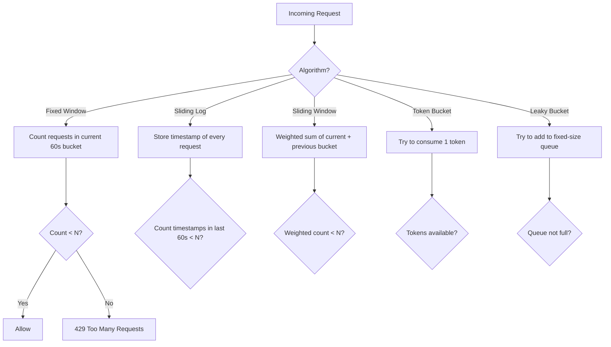

## WHY

Rate limiters are essential infrastructure: without them, a single misbehaving client can take down your entire service. Before rate limiters became standard in 2010s API design, large outages were caused by: a buggy mobile client polling at 1000 requests/second instead of 1/minute, a scraping bot hitting public endpoints with no throttle, a downstream service retry storm during a partial outage, or a DDoS attack that simply overwhelmed servers. Every modern web API — Twitter, GitHub, Stripe, AWS — exposes published rate limits, and every modern microservice imposes internal rate limits between services.

The specific pain rate limiters solve: **protecting expensive resources from disproportionate consumption**. A free-tier user shouldn't be able to consume 80% of the database connection pool. A retry loop shouldn't multiply load on an already-degraded service. A single tenant shouldn't be able to monopolize compute capacity in a multi-tenant system. Each of these scenarios has caused production outages at companies you've heard of, and each is mitigated by appropriate rate limiting.

The production failure mode from designing rate limiters incorrectly is **the thundering herd problem after rate limit reset**: when a fixed-window rate limiter resets at minute boundaries, all blocked clients retry simultaneously at 00:00, 00:01, 00:02, creating massive traffic spikes that overwhelm the very systems the rate limit was supposed to protect. Sliding window and token bucket algorithms avoid this by smoothing traffic over time, not allowing instantaneous catch-up after reset.

Senior engineers must understand: the four primary rate limiting algorithms (fixed window, sliding window log, sliding window counter, token bucket, leaky bucket), their accuracy/memory/CPU trade-offs, distributed rate limiting challenges (Redis-backed counters with race conditions), and how rate limiters interact with retry strategies and circuit breakers.

## THEORY

### Rate Limiting Algorithm Comparison



### Algorithm Properties

| Algorithm | Accuracy | Memory | CPU | Burst Handling |
|-----------|----------|--------|-----|---------------|
| Fixed Window | Low | O(1) per key | O(1) | ❌ Allows 2N at boundary |
| Sliding Log | Perfect | O(N) per key | O(N) for count | ✅ Smooth |
| Sliding Window Counter | High | O(1) per key | O(1) | ✅ Smooth |
| Token Bucket | High | O(1) per key | O(1) | ✅ Configurable burst |
| Leaky Bucket | High | O(N) queue | O(1) | ❌ Drops over-limit |

### Token Bucket Algorithm (Most Common)

```
State: { tokens: int, lastRefillTime: long }
Config: { capacity: int, refillRate: tokens/sec }

On request:
  now = currentTimeMillis()
  elapsedMs = now - lastRefillTime
  newTokens = (elapsedMs / 1000) * refillRate
  tokens = min(capacity, tokens + newTokens)
  lastRefillTime = now

  if tokens >= 1:
    tokens -= 1
    return ALLOW
  else:
    return DENY
```

### Fixed Window Boundary Problem

```
Time:     12:00:30  12:00:59  12:01:00  12:01:01
Window:   [W1: 0-59s]          [W2: 60-119s]
Requests: 0/100      100/100    101/100 reset to 0, then 100 more
Effective: 100 in 1s before boundary + 100 in 1s after = 200 in 2 seconds
This exceeds the intended 100 requests/min limit!
```

### Common Misconception

> "Rate limiting is just `if (count > N) reject`."

**Reality:** Naive `if (count > N)` has three production problems: (1) **race conditions** — two threads can both pass the check before either increments the counter, allowing N+1 requests through; (2) **clock-skew issues** in distributed systems — the "current window" depends on each server's clock; (3) **persistence challenges** — counters must survive restarts and be shared across instances. Production rate limiters use atomic operations (`Redis INCR` or Java `AtomicLong.incrementAndGet()`), time-bucketed keys with TTLs, and distributed consensus on the time window boundaries.

## VISUALIZATION_CONFIG

```json
{ "component": "SequenceDiagram", "state": "java-mastery-design-rate-limiter" }
```

## CODE

### Level 1 — Beginner: Fixed Window Rate Limiter

```java
import java.util.concurrent.*;
import java.util.concurrent.atomic.*;

public class FixedWindowRateLimiter {
    private final int limit;
    private final long windowMillis;
    private final ConcurrentHashMap<String, Window> windows = new ConcurrentHashMap<>();

    static class Window {
        final long windowStart;
        final AtomicInteger count;
        Window(long windowStart) {
            this.windowStart = windowStart;
            this.count = new AtomicInteger(0);
        }
    }

    public FixedWindowRateLimiter(int limit, long windowMillis) {
        this.limit = limit;
        this.windowMillis = windowMillis;
    }

    public boolean tryAcquire(String key) {
        long now = System.currentTimeMillis();
        long windowStart = (now / windowMillis) * windowMillis;  // align to window

        // Atomic get-or-create: if window has rolled over, create a new one
        Window window = windows.compute(key, (k, existing) -> {
            if (existing == null || existing.windowStart != windowStart) {
                return new Window(windowStart);
            }
            return existing;
        });

        return window.count.incrementAndGet() <= limit;
    }

    public static void main(String[] args) {
        var limiter = new FixedWindowRateLimiter(5, 1000); // 5 req per second

        for (int i = 1; i <= 7; i++) {
            boolean allowed = limiter.tryAcquire("user-1");
            System.out.println("Request " + i + ": " + (allowed ? "✅ allowed" : "❌ denied"));
        }
        // Request 1-5: allowed, Request 6-7: denied
    }
}
```

### Level 2 — Intermediate: Token Bucket with Lazy Refill

```java
import java.util.concurrent.*;
import java.util.concurrent.locks.*;

public class TokenBucketRateLimiter {
    private final int capacity;
    private final double refillRatePerMillis;
    private final ConcurrentHashMap<String, Bucket> buckets = new ConcurrentHashMap<>();

    static class Bucket {
        double tokens;
        long lastRefillTimeMillis;
        final ReentrantLock lock = new ReentrantLock();

        Bucket(int capacity, long now) {
            this.tokens = capacity;
            this.lastRefillTimeMillis = now;
        }
    }

    public TokenBucketRateLimiter(int capacity, double refillRatePerSecond) {
        this.capacity = capacity;
        this.refillRatePerMillis = refillRatePerSecond / 1000.0;
    }

    public boolean tryAcquire(String key) {
        Bucket bucket = buckets.computeIfAbsent(key,
            k -> new Bucket(capacity, System.currentTimeMillis()));

        bucket.lock.lock();
        try {
            long now = System.currentTimeMillis();
            long elapsedMs = now - bucket.lastRefillTimeMillis;
            // Refill tokens proportional to elapsed time
            double newTokens = elapsedMs * refillRatePerMillis;
            bucket.tokens = Math.min(capacity, bucket.tokens + newTokens);
            bucket.lastRefillTimeMillis = now;

            if (bucket.tokens >= 1.0) {
                bucket.tokens -= 1.0;
                return true;
            }
            return false;
        } finally {
            bucket.lock.unlock();
        }
    }

    public static void main(String[] args) throws InterruptedException {
        // 10 tokens capacity, refilling at 2 tokens/second
        var limiter = new TokenBucketRateLimiter(10, 2);

        // Burst — consume initial 10 tokens
        for (int i = 1; i <= 12; i++) {
            System.out.println("Burst " + i + ": " +
                (limiter.tryAcquire("user-1") ? "✅" : "❌"));
        }
        // First 10 allowed (bucket capacity), last 2 denied

        // Wait 1 second — refills 2 tokens
        Thread.sleep(1000);

        for (int i = 1; i <= 3; i++) {
            System.out.println("After wait " + i + ": " +
                (limiter.tryAcquire("user-1") ? "✅" : "❌"));
        }
        // 2 allowed (refilled), 3rd denied
    }
}
```

### Level 3 — Advanced: Sliding Window Counter

```java
import java.util.concurrent.*;
import java.util.concurrent.atomic.*;

/**
 * Sliding window counter — combines accuracy of sliding log with O(1) memory.
 * Tracks current and previous window counts, weights the previous window by
 * the fraction of overlap with the sliding window.
 */
public class SlidingWindowRateLimiter {
    private final int limit;
    private final long windowMillis;
    private final ConcurrentHashMap<String, WindowState> state = new ConcurrentHashMap<>();

    static class WindowState {
        long currentWindowStart;
        AtomicInteger currentCount = new AtomicInteger();
        AtomicInteger previousCount = new AtomicInteger();
    }

    public SlidingWindowRateLimiter(int limit, long windowMillis) {
        this.limit = limit;
        this.windowMillis = windowMillis;
    }

    public synchronized boolean tryAcquire(String key) {
        long now = System.currentTimeMillis();
        long currentWindowStart = (now / windowMillis) * windowMillis;

        WindowState ws = state.computeIfAbsent(key, k -> {
            var s = new WindowState();
            s.currentWindowStart = currentWindowStart;
            return s;
        });

        // If window has advanced, slide the values
        if (ws.currentWindowStart != currentWindowStart) {
            long elapsed = currentWindowStart - ws.currentWindowStart;
            if (elapsed == windowMillis) {
                // Adjacent window — current becomes previous
                ws.previousCount.set(ws.currentCount.get());
            } else {
                // Skipped windows — previous is gone too
                ws.previousCount.set(0);
            }
            ws.currentCount.set(0);
            ws.currentWindowStart = currentWindowStart;
        }

        // Weighted count: previous count × (fraction of previous window still in sliding window)
        double previousWeight = (windowMillis - (now - ws.currentWindowStart)) / (double) windowMillis;
        double weightedCount = ws.previousCount.get() * previousWeight + ws.currentCount.get();

        if (weightedCount < limit) {
            ws.currentCount.incrementAndGet();
            return true;
        }
        return false;
    }
}
```

### Level 4 — Expert / Production: Distributed Rate Limiter with Redis-Like Backend

```java
import java.util.concurrent.*;
import java.util.concurrent.atomic.*;
import java.util.*;
import java.util.function.*;

/**
 * Production-grade rate limiter with:
 * - Pluggable backend (in-memory or Redis-like distributed)
 * - Multiple tier support (per-IP + per-user + per-endpoint)
 * - Metrics: allowed, denied, current rate
 * - Atomic Lua-like script semantics
 */
public class DistributedRateLimiter {

    public interface CounterBackend {
        long incrementAndGet(String key, long ttlMillis);
        long get(String key);
    }

    // In-memory backend for testing/single-node
    public static class InMemoryBackend implements CounterBackend {
        private final ConcurrentHashMap<String, AtomicLong> counters = new ConcurrentHashMap<>();
        private final ConcurrentHashMap<String, Long> expirations = new ConcurrentHashMap<>();

        public long incrementAndGet(String key, long ttlMillis) {
            cleanupExpired();
            expirations.putIfAbsent(key, System.currentTimeMillis() + ttlMillis);
            return counters.computeIfAbsent(key, k -> new AtomicLong()).incrementAndGet();
        }

        public long get(String key) {
            cleanupExpired();
            AtomicLong counter = counters.get(key);
            return counter != null ? counter.get() : 0;
        }

        private void cleanupExpired() {
            long now = System.currentTimeMillis();
            expirations.entrySet().removeIf(entry -> {
                if (entry.getValue() < now) {
                    counters.remove(entry.getKey());
                    return true;
                }
                return false;
            });
        }
    }

    public record RateLimitRule(String name, int limit, long windowMillis) {}
    public record RateLimitResult(boolean allowed, long current, long limit,
                                  long retryAfterMillis, String ruleName) {}

    private final CounterBackend backend;
    private final AtomicLong allowedCount = new AtomicLong();
    private final AtomicLong deniedCount = new AtomicLong();

    public DistributedRateLimiter(CounterBackend backend) {
        this.backend = backend;
    }

    // Check multiple tiers: any limit hit → deny with the most restrictive
    public RateLimitResult check(String identifier, List<RateLimitRule> rules) {
        for (RateLimitRule rule : rules) {
            long windowStart = (System.currentTimeMillis() / rule.windowMillis()) * rule.windowMillis();
            String key = String.format("%s:%s:%d", rule.name(), identifier, windowStart);

            long count = backend.incrementAndGet(key, rule.windowMillis());
            if (count > rule.limit()) {
                deniedCount.incrementAndGet();
                long retryAfter = (windowStart + rule.windowMillis()) - System.currentTimeMillis();
                return new RateLimitResult(false, count, rule.limit(),
                                          retryAfter, rule.name());
            }
        }
        allowedCount.incrementAndGet();
        return new RateLimitResult(true, 0, 0, 0, null);
    }

    public long getAllowedCount() { return allowedCount.get(); }
    public long getDeniedCount() { return deniedCount.get(); }

    public static void main(String[] args) throws InterruptedException {
        var limiter = new DistributedRateLimiter(new InMemoryBackend());
        var rules = List.of(
            new RateLimitRule("per-second", 10, 1000),
            new RateLimitRule("per-minute", 100, 60_000),
            new RateLimitRule("per-hour", 1000, 3_600_000)
        );

        for (int i = 1; i <= 15; i++) {
            var result = limiter.check("user-123", rules);
            System.out.printf("Request %d: %s (rule: %s, retry after %dms)%n",
                i, result.allowed() ? "✅" : "❌",
                result.ruleName(), result.retryAfterMillis());
        }

        System.out.printf("Stats: allowed=%d, denied=%d%n",
            limiter.getAllowedCount(), limiter.getDeniedCount());
    }
}
```

## REAL_WORLD

### How Stripe Implements Rate Limiting for Their API

Stripe — processing billions of dollars annually — uses a sophisticated multi-tier rate limiting system. The official Stripe blog post "Scaling our API rate limiter" (2017) describes their architecture: every request passes through 4 layers of rate limiters: (1) **per-IP** to block crude DDoS; (2) **per-API-key** to enforce account-level quotas; (3) **per-endpoint** to protect specific resources (e.g., `/v1/charges` has tighter limits than `/v1/customers`); (4) **per-resource** to prevent hammering a single object (e.g., 1000 retrievals of the same customer in 1 second). Stripe uses **Redis with Lua scripts** for atomic check-and-increment operations across their distributed fleet.

```java
// Simplified Stripe-style multi-tier rate limiter
import java.util.*;
import java.util.concurrent.*;

public class StripeStyleRateLimiter {

    // Different limits for different operations
    static final Map<String, EndpointLimits> ENDPOINT_LIMITS = Map.of(
        "POST /v1/charges",        new EndpointLimits(100, 1000),  // 100/sec, 1000/min
        "GET /v1/charges",         new EndpointLimits(1000, 10000),
        "POST /v1/refunds",        new EndpointLimits(25, 250),     // payment-sensitive
        "GET /v1/customers",       new EndpointLimits(1000, 10000)
    );

    record EndpointLimits(int perSecond, int perMinute) {}

    private final DistributedRateLimiter limiter;
    public StripeStyleRateLimiter(DistributedRateLimiter limiter) { this.limiter = limiter; }

    public DistributedRateLimiter.RateLimitResult check(String apiKey, String ip, String endpoint) {
        EndpointLimits endpointLimit = ENDPOINT_LIMITS.getOrDefault(endpoint,
            new EndpointLimits(100, 1000));

        // Tier 1: per-IP (DDoS protection)
        var ipRules = List.of(
            new DistributedRateLimiter.RateLimitRule("ip-sec", 50, 1000),
            new DistributedRateLimiter.RateLimitRule("ip-min", 500, 60000)
        );

        // Tier 2: per-API-key (account quota)
        var keyRules = List.of(
            new DistributedRateLimiter.RateLimitRule("key-sec", 100, 1000),
            new DistributedRateLimiter.RateLimitRule("key-min", 1000, 60000)
        );

        // Tier 3: per-endpoint per-key (operation quota)
        var endpointRules = List.of(
            new DistributedRateLimiter.RateLimitRule(
                "endpoint-sec", endpointLimit.perSecond(), 1000),
            new DistributedRateLimiter.RateLimitRule(
                "endpoint-min", endpointLimit.perMinute(), 60000)
        );

        // Check each tier — first failure wins (deny with most restrictive)
        for (var rule : List.of(ipRules, keyRules, endpointRules)) {
            String id = rule == ipRules ? ip :
                       rule == keyRules ? apiKey :
                       apiKey + ":" + endpoint;
            var result = limiter.check(id, rule);
            if (!result.allowed()) return result;
        }
        return new DistributedRateLimiter.RateLimitResult(true, 0, 0, 0, null);
    }
}
```

### Production Gotcha: Race Condition in Naive Rate Limiter

```java
// ❌ DANGEROUS — non-atomic check-then-increment causes overshoot
public class BuggyRateLimiter {
    private final ConcurrentHashMap<String, Integer> counts = new ConcurrentHashMap<>();
    private final int limit = 100;

    public boolean tryAcquire(String key) {
        int current = counts.getOrDefault(key, 0);  // ❌ READ
        if (current >= limit) return false;
        counts.put(key, current + 1);                // ❌ WRITE — not atomic with read!
        return true;
        // Two threads can both pass the check at current=99 → both increment → final=101
    }
}

// ✅ PRODUCTION-SAFE — atomic operation
public class CorrectRateLimiter {
    private final ConcurrentHashMap<String, AtomicInteger> counts = new ConcurrentHashMap<>();
    private final int limit = 100;

    public boolean tryAcquire(String key) {
        AtomicInteger counter = counts.computeIfAbsent(key, k -> new AtomicInteger());
        // Atomic check-and-increment using updateAndGet
        return counter.updateAndGet(current ->
            current < limit ? current + 1 : current  // increment only if under limit
        ) <= limit;
    }
}

// ✅ EVEN BETTER for distributed — use Redis INCR with Lua script
// (Redis guarantees atomic execution of Lua scripts)
/*
local key = KEYS[1]
local limit = tonumber(ARGV[1])
local current = redis.call('INCR', key)
if current == 1 then redis.call('EXPIRE', key, 60) end
return current > limit and 0 or 1
*/
```

**Why it happens:** Concurrent threads execute the `read` and `write` sequence in interleaved order. Both can read `count=99`, both check "99 < 100, allowed," both increment to 100. The counter shows 100 (within limit), but two requests passed through when only one should have. In single-server: use `AtomicInteger.updateAndGet`. In distributed: use Redis INCR (atomic) or Lua scripts (atomic compound operations).

### Performance Characteristics

| Operation | Time | Memory | Notes |
|-----------|------|--------|-------|
| Fixed window check | ~100ns | O(K) keys | Cache-friendly counter |
| Token bucket check | ~200ns | O(K) keys | Single lock + arithmetic |
| Sliding window log | ~1µs (n=100) | O(N×K) | O(N) per check |
| Sliding window counter | ~200ns | O(2×K) | Two counters per key |
| Redis-backed (network) | 0.5-2ms | O(K) on server | Network round-trip dominates |
| Local Caffeine cache | ~100ns | O(K) | High-throughput single-node |

## INTERVIEW

**Q1 (Junior): What is rate limiting and why do you need it?**
A: Rate limiting restricts the number of requests a client can make in a given time window. It's essential for: (1) **preventing abuse** — stopping a single client from monopolizing resources; (2) **DDoS protection** — automatically blocking traffic spikes; (3) **fair resource allocation** — ensuring no tenant in a multi-tenant system consumes disproportionate capacity; (4) **cost control** — preventing runaway costs from external API calls; (5) **system stability** — protecting downstream services from being overwhelmed during retry storms. Without rate limiting, a single misbehaving client can cause an outage affecting all other users.

**Q2 (Junior): Compare fixed window and sliding window rate limiting. Which is better and why?**
A: **Fixed window** counts requests in a discrete time bucket (e.g., 00:00:00–00:00:59). It's simple — O(1) memory, O(1) check — but has the **boundary problem**: a client can make N requests at 00:00:59 and N more at 00:01:00, effectively 2N requests in 2 seconds despite a "N per minute" limit. **Sliding window** uses a continuously moving window — for "N per minute," it counts all requests in the last 60 seconds from now. It's more accurate but more expensive: sliding window log stores every timestamp (O(N) memory), sliding window counter approximates with weighted counts (O(1) memory, slightly less accurate). For most cases, sliding window counter is the right choice — it avoids the boundary problem with O(1) cost.

**Q3 (Mid): Explain the token bucket algorithm and how it handles bursts.**
A: Token bucket maintains a bucket with capacity C. Tokens are added at refill rate R per second (capped at C). Each request consumes 1 token; if no tokens available, request is denied. The algorithm naturally supports **bursts up to bucket capacity**: an idle client accumulates tokens over time (up to C), then can spend them all in a quick burst. Once empty, requests are rate-limited to R per second. This matches real user behavior — users browse intermittently, then click rapidly, then browse again. Compare to leaky bucket which doesn't allow bursts at all (requests flow at constant rate). Token bucket parameters: high C for bursty applications (single user UI), low C for steady applications (API integration). The lazy refill optimization: instead of a background thread adding tokens every X ms, compute tokens at request time as `min(capacity, tokens + elapsed_seconds × R)`.

**Q4 (Mid): How would you handle rate limiting in a distributed system?**
A: Single-node `AtomicInteger` doesn't work across multiple servers — each server has its own counter, so the effective rate limit is N × server_count. Solutions: (1) **Shared external counter** (Redis) — every server increments a Redis key with atomic INCR + EXPIRE; trade-off: 1-2ms network latency per check; (2) **Token bucket with lease** — periodically pull a budget of N tokens from Redis to local memory, refresh when running low; reduces network calls; (3) **Probabilistic algorithms** — Sliding Window with Probabilistic Sampling sends only a sample of requests to the global counter, accepting some inaccuracy for performance; (4) **Local + global hybrid** — local rate limiter (fast, approximate) + periodic global check (slow, authoritative) for spike protection. Stripe and Cloudflare use combinations of these. Critical: use Redis Lua scripts for atomic compound operations (check + increment + set expiry in one round-trip).

**Q5 (Senior): What is the difference between rate limiting and circuit breaking? When would you use each?**
A: **Rate limiting** restricts how many requests a *client* can make to YOU — protects YOU from misbehaving clients. **Circuit breaking** restricts how many requests YOU make to a *downstream service* — protects THEM (and your latency) from cascade failures. Rate limiting decisions are based on the *requester*: "this user has hit 1000 requests/minute, deny." Circuit breaking decisions are based on the *target*: "the payment service has failed 50% of recent requests, stop sending until it recovers." Both are essential and complementary — a typical request pipeline: incoming request → rate limiter (per-client) → circuit breaker (per-downstream-service) → actual work. Hystrix, Resilience4j, and Envoy all combine these patterns. Rate limiting uses token bucket / sliding window; circuit breaking uses error percentage thresholds with state machine (closed/open/half-open).

**Q6 (Senior): How do you communicate rate limit information to the client?**
A: HTTP rate limiters should return: (1) **HTTP 429 Too Many Requests** when limit exceeded — never 500 or 503; (2) **`X-RateLimit-Limit` header** — max requests allowed in window; (3) **`X-RateLimit-Remaining` header** — requests remaining; (4) **`X-RateLimit-Reset` header** — Unix timestamp when limit resets; (5) **`Retry-After` header** — seconds until the client should retry. Modern API standards (GitHub, Stripe, Twitter) include all of these. Good clients use these headers to implement exponential backoff with jitter — without them, clients retry blindly, causing the "thundering herd" problem when rate limits reset. The headers should be present on EVERY response (allowed or denied), not just on 429s, so clients can preemptively slow down before hitting the limit.

**Q7 (Senior+): How would you design a rate limiter for a service handling 1 million requests per second across 100 servers?**
A: At this scale, every microsecond matters. Architecture: (1) **Local rate limiter per server** — token bucket with budget allocated by a coordinator (e.g., 10,000 RPS per server for a global 1M RPS limit); (2) **Coordinator service** — runs every 1-5 seconds, redistributes tokens to servers based on actual usage; (3) **Global enforcement only for critical limits** — per-user limits go to Redis (some accuracy loss acceptable), per-IP limits stay local; (4) **Sliding window with sub-second buckets** — 10 buckets of 100ms each, rotated FIFO; (5) **Bloom filter for known abusers** — fast O(1) check before any rate limit logic; (6) **Stream-processing for analytics** — Kafka topic of allow/deny decisions, processed by Flink for real-time dashboards. Critical pitfall: avoid synchronous Redis calls in the hot path — at 1M RPS, even 1ms latency adds 1000 CPU-seconds per real second, requiring massive over-provisioning.

## FEYNMAN CHECK

### Explain Rate Limiting Like I'm 10 Years Old

> Imagine you're at an all-you-can-eat ice cream buffet, but the rule is "max 3 scoops per minute." **Rate limiting is the rule itself** — you can have 3 scoops, then have to wait until the minute resets. Different ways to enforce it: (1) **Fixed window** — the clock starts at 12:00, you get 3 scoops, then have to wait until 12:01 for 3 more. The bug: you could grab 3 scoops at 12:00:59 and 3 more at 12:01:00 — that's 6 scoops in 2 seconds! (2) **Token bucket** — you have a jar of tokens. Every 20 seconds a new token appears. Each scoop costs 1 token. If the jar is empty, no scoop. This way you can save up (if you wait 5 minutes you have 15 tokens for a big sundae burst), but on average you average 3 per minute. The server needs to do this because if everyone took unlimited scoops, the buffet runs out for everyone else.

---

### 5 Deep Conceptual Questions

**Q1: Why is the fixed window algorithm problematic in production?**
> **A:** The fixed window's boundary effect allows up to 2N requests in a 2-second period at the window boundary, defeating the intended "N per minute" limit. Worse, this is exploitable: an attacker times their requests to hit the boundary, achieving twice the allowed rate. Production systems use sliding window or token bucket to avoid this. The fixed window is acceptable only for non-adversarial scenarios where occasional bursts are tolerable — like billing meters that aggregate at minute granularity.

**Q2: What is the one mental model that makes token bucket click?**
> **A:** "Tokens are credit — you can save them (up to a cap) and spend them as fast as you want." The bucket capacity is your maximum burst size. The refill rate is your sustainable long-term rate. If you make 0 requests for an hour, you have a full bucket — you can burst at full capacity. If you exhaust the bucket, you're throttled to the refill rate. This matches real user behavior: bursts of activity (user clicks 10 things rapidly) followed by quiet periods. Compare to leaky bucket: leaky bucket forces constant rate (no burst tolerance) — fine for hardware queues but unpleasant for users.

**Q3: What is the most dangerous rate limiter mistake? Show it with code.**
> **A:** Non-atomic check-then-increment, allowing race conditions to bypass the limit.
> ```java
> // ❌ RACE CONDITION
> int current = counts.get(key);  // Read
> if (current < limit) {
>     counts.put(key, current + 1);  // Write — gap between read and write!
>     return true;
> }
> // Thread A and B both read current=99, both increment to 100,
> // both think they passed. Counter says 100 (within limit) but 2 requests
> // got through where only 1 should have. Under high concurrency, this can
> // let through hundreds of extra requests.
>
> // ✅ ATOMIC
> AtomicInteger counter = counts.computeIfAbsent(key, k -> new AtomicInteger());
> return counter.updateAndGet(c -> c < limit ? c + 1 : c) <= limit;
> // Atomic check-and-increment — no race possible
> ```

**Q4: How do rate limiters interact with retry strategies?**
> **A:** Rate limiters and retries can amplify each other catastrophically. Scenario: a downstream service rate-limits client X with 429. Client X retries immediately. The retry counts against the new minute's quota. After 100 retries, the client has used its entire minute's quota with no successful requests. Worse: if many clients retry simultaneously after rate-limit reset (synchronized retry storm), they all get 429s again. The solutions: (1) `Retry-After` header — tells client exactly when to retry; (2) **exponential backoff with jitter** — random delays prevent synchronized retries; (3) **circuit breakers on the client side** — after N consecutive 429s, stop retrying for a longer period; (4) **don't count retries against the quota** if the server can identify them via a request ID.

**Q5: One-sentence definition of rate limiting for a senior FAANG engineer.**
> **A:** "Rate limiting is a traffic-shaping technique that constrains request rates using one of several algorithms — fixed window (O(1) memory, boundary-unfair), sliding window log (O(N) memory, perfect accuracy), sliding window counter (O(1) memory, ~98% accurate), token bucket (O(1) memory, burst-friendly), leaky bucket (O(N) memory, smooth rate) — typically deployed at multiple tiers (per-IP, per-API-key, per-endpoint, per-resource) using atomic counters (AtomicInteger or Redis INCR with Lua scripts), and communicated to clients via standard HTTP 429 responses with X-RateLimit-* headers — protecting services from abuse, DDoS, retry storms, and unfair resource consumption, while interacting with retry/circuit-breaker patterns to prevent thundering herd amplification effects."

## BUILD

### 🏗️ Mini Project: Multi-Tier Rate Limiter

**What you will build:** A production-grade rate limiter supporting multiple algorithms (fixed window, token bucket, sliding window counter) with per-tier limits and HTTP-style rate limit headers.
**Why this project:** Forces you to implement the core rate limiting algorithms, handle concurrency safely, and produce production-quality output that real services use.
**Time estimate:** 40 minutes

---

#### Step 1 — Setup

```bash
mkdir rate-limiter && cd rate-limiter
mkdir -p src/main/java/com/ratelimit src/test/java/com/ratelimit
touch src/main/java/com/ratelimit/{RateLimiter,TokenBucketLimiter,RateLimitHeaders}.java
touch src/test/java/com/ratelimit/RateLimiterTest.java
```

#### Step 2 — Core Implementation

```java
package com.ratelimit;
import java.util.concurrent.*;
import java.util.concurrent.atomic.*;
import java.util.concurrent.locks.*;
import java.time.*;

public interface RateLimiter {
    Decision tryAcquire(String key);
    record Decision(boolean allowed, long remaining, long limit, Duration retryAfter) {}
}

public class TokenBucketLimiter implements RateLimiter {
    private final int capacity;
    private final double refillPerMs;
    private final ConcurrentHashMap<String, Bucket> buckets = new ConcurrentHashMap<>();

    static class Bucket {
        double tokens;
        long lastRefillMs;
        final ReentrantLock lock = new ReentrantLock();
        Bucket(int capacity, long now) { this.tokens = capacity; this.lastRefillMs = now; }
    }

    public TokenBucketLimiter(int capacity, double refillPerSecond) {
        this.capacity = capacity;
        this.refillPerMs = refillPerSecond / 1000.0;
    }

    @Override
    public Decision tryAcquire(String key) {
        Bucket bucket = buckets.computeIfAbsent(key,
            k -> new Bucket(capacity, System.currentTimeMillis()));
        bucket.lock.lock();
        try {
            long now = System.currentTimeMillis();
            double newTokens = (now - bucket.lastRefillMs) * refillPerMs;
            bucket.tokens = Math.min(capacity, bucket.tokens + newTokens);
            bucket.lastRefillMs = now;

            if (bucket.tokens >= 1.0) {
                bucket.tokens -= 1.0;
                return new Decision(true, (long) bucket.tokens, capacity, Duration.ZERO);
            }
            long retryMs = (long) Math.ceil((1.0 - bucket.tokens) / refillPerMs);
            return new Decision(false, 0, capacity, Duration.ofMillis(retryMs));
        } finally {
            bucket.lock.unlock();
        }
    }
}
```

#### Step 3 — HTTP Header Integration

```java
package com.ratelimit;
import java.util.*;

public class RateLimitHeaders {
    public static Map<String, String> from(RateLimiter.Decision decision) {
        Map<String, String> headers = new LinkedHashMap<>();
        headers.put("X-RateLimit-Limit", String.valueOf(decision.limit()));
        headers.put("X-RateLimit-Remaining", String.valueOf(decision.remaining()));
        long resetSec = System.currentTimeMillis() / 1000
                       + decision.retryAfter().getSeconds();
        headers.put("X-RateLimit-Reset", String.valueOf(resetSec));
        if (!decision.allowed()) {
            headers.put("Retry-After", String.valueOf(decision.retryAfter().getSeconds()));
        }
        return headers;
    }
}

public class Main {
    public static void main(String[] args) throws InterruptedException {
        var limiter = new TokenBucketLimiter(5, 2);  // 5 burst, 2/sec sustained

        for (int i = 1; i <= 8; i++) {
            var decision = limiter.tryAcquire("user-1");
            var headers = RateLimitHeaders.from(decision);
            System.out.printf("Request %d: %s | Headers: %s%n",
                i, decision.allowed() ? "✅ 200" : "❌ 429", headers);
            Thread.sleep(100);
        }
    }
}
```

#### Step 4 — Error Handling

```java
public Decision tryAcquireSafe(String key) {
    if (key == null || key.isBlank()) {
        throw new IllegalArgumentException("Key must not be null or blank");
    }
    return tryAcquire(key);
}

// Distributed-safe wrapper with fallback
public class FallbackRateLimiter implements RateLimiter {
    private final RateLimiter primary;
    private final RateLimiter fallback;

    public FallbackRateLimiter(RateLimiter primary, RateLimiter fallback) {
        this.primary = primary;
        this.fallback = fallback;
    }

    public Decision tryAcquire(String key) {
        try {
            return primary.tryAcquire(key);
        } catch (Exception e) {
            // If primary (e.g., Redis) is down, fall back to local
            return fallback.tryAcquire(key);
        }
    }
}
```

#### Step 5 — Tests

```java
import org.junit.jupiter.api.*;
import java.util.concurrent.*;
import static org.junit.jupiter.api.Assertions.*;

class RateLimiterTest {
    @Test
    void allowsBurstUpToCapacity() {
        var limiter = new TokenBucketLimiter(5, 1);  // cap=5
        for (int i = 0; i < 5; i++) {
            assertTrue(limiter.tryAcquire("k").allowed(), "Request " + i + " should be allowed");
        }
        assertFalse(limiter.tryAcquire("k").allowed(), "6th request should be denied");
    }

    @Test
    void refillsTokensOverTime() throws InterruptedException {
        var limiter = new TokenBucketLimiter(2, 10);  // 10 tokens/sec
        limiter.tryAcquire("k");
        limiter.tryAcquire("k");
        assertFalse(limiter.tryAcquire("k").allowed());

        Thread.sleep(200);  // wait for 2 tokens to refill
        assertTrue(limiter.tryAcquire("k").allowed());
    }

    @Test
    void differentKeysAreIndependent() {
        var limiter = new TokenBucketLimiter(2, 1);
        limiter.tryAcquire("user-1");
        limiter.tryAcquire("user-1");
        assertFalse(limiter.tryAcquire("user-1").allowed());
        assertTrue(limiter.tryAcquire("user-2").allowed());  // different key, fresh bucket
    }

    @Test
    void concurrentRequestsRespectLimit() throws InterruptedException {
        var limiter = new TokenBucketLimiter(100, 0);  // no refill
        var allowed = new java.util.concurrent.atomic.AtomicInteger();
        var executor = Executors.newFixedThreadPool(20);
        var latch = new CountDownLatch(1000);

        for (int i = 0; i < 1000; i++) {
            executor.submit(() -> {
                if (limiter.tryAcquire("k").allowed()) allowed.incrementAndGet();
                latch.countDown();
            });
        }
        latch.await(5, TimeUnit.SECONDS);
        executor.shutdown();

        assertEquals(100, allowed.get(), "Exactly 100 requests should be allowed");
    }
}
```

**Expected Output:**
```
Request 1: ✅ 200 | Headers: {X-RateLimit-Limit=5, X-RateLimit-Remaining=4, ...}
Request 2: ✅ 200 | Headers: {X-RateLimit-Limit=5, X-RateLimit-Remaining=3, ...}
...
Request 6: ❌ 429 | Headers: {..., Retry-After=1}
```

**Stretch Challenges:**
- [ ] Implement sliding window counter with 10 sub-buckets of 100ms each
- [ ] Add a `BulkheadLimiter` that limits concurrent requests (not just rate)
- [ ] Add Redis backend for distributed rate limiting

## SPACED REVIEW

> **How to use:** Answer from memory before reading ahead.

---

### Day 1 — Recall

**Q1:** What is rate limiting? Name 3 reasons to use it.

**Q2:** Implement a fixed window rate limiter in 20 lines using `ConcurrentHashMap` and `AtomicInteger`.

**Q3:** What HTTP status code is used for rate limit exceeded? What headers should be included?

---

### Day 3 — Comprehension

**Q4:** What is the boundary problem in fixed window rate limiting? Give a numeric example.

**Q5:** Explain the token bucket algorithm. What's the difference between capacity and refill rate?

**Q6:** Refactor this buggy rate limiter to be thread-safe:
```java
public boolean tryAcquire(String key) {
    int count = counts.getOrDefault(key, 0);
    if (count >= 100) return false;
    counts.put(key, count + 1);
    return true;
}
```

---

### Day 7 — Application

**Q7:** Design a multi-tier rate limiter (per-IP + per-user + per-endpoint). Show the data structures and check order.

**Q8:** You're seeing thundering herd retries after rate limit reset. What 3 mitigations would you implement?

**Q9:** Compare token bucket and leaky bucket for: (a) API endpoints, (b) network packet shaping, (c) database connection pool admission.

---

### Day 14 — Synthesis & Interview Prep

**Q10:** ★ Classic interview: *"Design a rate limiter for an API that needs to support 1 million requests per second with per-API-key limits."*

**Q11:** Draw the architecture diagram for Stripe-style distributed rate limiting: client → CDN → API gateway (rate limiter) → service → Redis. Where do checks happen, what's stored where?

**Q12:** ★ System design: *"You're designing rate limiting for a multi-tenant SaaS API with 10,000 customers. Each customer has different limits based on their subscription tier. Design the system to support 100K requests/sec total with sub-millisecond decision latency."*

