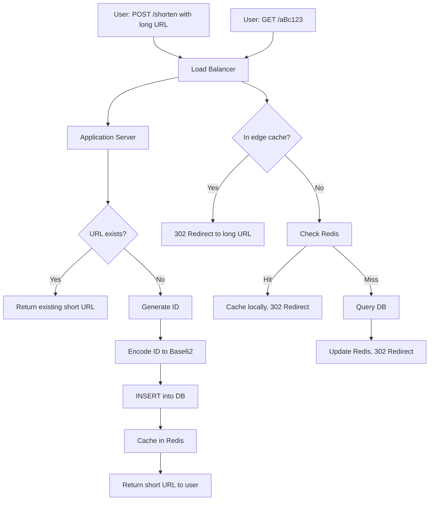

## WHY

URL shorteners — bit.ly, tinyurl.com, t.co, goo.gl (RIP) — solve a deceptively simple-looking problem: take a long URL like `https://www.amazon.com/dp/B07PCMTGSD/?ref=...&pf_rd_p=...&pf_rd_r=...` and produce a short one like `https://bit.ly/3xK7m2P` that redirects to the original. The pain they solve isn't just aesthetic: Twitter's 280-character limit, SMS messages capped at 160 characters, QR codes that scale linearly with URL length, and email open-rate tracking all require short, stable, redirect-capable URLs.

But the design problem is fascinating because it touches every aspect of modern system design: hash collisions, write throughput at scale, read-heavy caching, distributed unique ID generation, analytics aggregation, abuse prevention (malicious URL detection), URL expiration, custom alias support, and global low-latency distribution. A URL shortener is the "FizzBuzz of system design interviews" — easy to describe, every architecture decision matters, and a "good" answer at FAANG depth covers hundreds of design points.

The production failure mode of a naively-designed URL shortener is **ID collision under high write throughput**: if you naïvely generate random 7-character IDs (62^7 = 3.5 trillion possibilities), you'd think collisions are impossible — but at 10,000 inserts/second, the **Birthday Paradox** means meaningful collision probability after ~60,000 URLs. Each collision requires a re-insert and database round-trip, throttling throughput catastrophically when the table grows large. Production systems solve this with deterministic ID generation (counter-based encoding) or pre-allocated ID ranges (the "ticket server" pattern).

Senior engineers must understand: hash-based vs counter-based vs random ID strategies, write-path optimization (bloom filters, write-behind caching), read-path optimization (Redis caching, edge caching via CDN, anycast DNS), analytics aggregation (real-time vs batch), and abuse mitigation (rate limiting, malicious URL detection).

## THEORY

### URL Shortener Core Architecture



### ID Generation Strategies Compared

| Strategy | Collision Risk | Predictable | Throughput | Notes |
|----------|----------------|-------------|------------|-------|
| Random Base62 | Birthday Paradox | No | Limited by retries | Simplest but degrades at scale |
| Hash of URL (MD5/SHA truncated) | Higher (truncation) | Yes (same URL → same ID) | Fast | Same URL deduplicated |
| Auto-increment counter | Zero | Yes (enumerable!) | High | Sequential ID exposure risk |
| Counter + Base62 encoding | Zero | Less obvious | High | Industry standard |
| Snowflake ID (Twitter) | Zero | No | Very high | Distributed coordination |
| Ticket Server (Flickr) | Zero | No | Very high | Centralized but resilient |

### Base62 Encoding — Why It's Optimal

Base62 uses `[A-Za-z0-9]` (62 characters). This is the URL-safe character set excluding special characters:

```
URL-safe characters: [A-Z][a-z][0-9]      → 62 characters
7 characters of Base62: 62^7 = 3.5 trillion combinations
6 characters of Base62: 62^6 = 56.8 billion combinations
5 characters of Base62: 62^5 = 916 million combinations
```

Twitter's t.co uses 8 characters, bit.ly uses 7 characters — both can comfortably handle decades of URLs.

### Capacity Planning Math

```
Assumption: 100M URLs shortened per month
Storage per row: ~500 bytes (long URL + metadata)
Monthly storage: 100M × 500B = 50 GB/month
Annual storage: 600 GB/year
5-year storage: 3 TB

Read-to-write ratio (industry): 100:1
Writes per second: 100M / (30 × 86400) = ~40 writes/sec
Reads per second: 40 × 100 = 4,000 reads/sec
Peak (5x avg): 200 writes/sec, 20,000 reads/sec
```

### Common Misconception

> "A URL shortener is just a database that maps short codes to long URLs."

**Reality:** A URL shortener is a **redirect service with 1000:1 read-to-write ratio**, making the read path the dominant performance concern. The database is a fallback — most reads should hit edge cache (CDN) or Redis. The write path needs deduplication (returning the same short URL for the same long URL), abuse detection, and analytics tracking. The "just a database" architecture works at 100 URLs/day but breaks down at 100K/sec.

## VISUALIZATION_CONFIG

```json
{ "component": "SequenceDiagram", "state": "java-mastery-design-url-shortener" }
```

## CODE

### Level 1 — Beginner: Simple Base62 Encoder

```java
public class Base62 {
    private static final char[] CHARS =
        "ABCDEFGHIJKLMNOPQRSTUVWXYZabcdefghijklmnopqrstuvwxyz0123456789"
        .toCharArray();
    private static final int BASE = CHARS.length;  // 62

    public static String encode(long id) {
        if (id == 0) return String.valueOf(CHARS[0]);
        StringBuilder sb = new StringBuilder();
        while (id > 0) {
            sb.append(CHARS[(int) (id % BASE)]);
            id /= BASE;
        }
        return sb.reverse().toString();
    }

    public static long decode(String encoded) {
        long result = 0;
        for (char c : encoded.toCharArray()) {
            int value;
            if (c >= 'A' && c <= 'Z') value = c - 'A';
            else if (c >= 'a' && c <= 'z') value = 26 + (c - 'a');
            else if (c >= '0' && c <= '9') value = 52 + (c - '0');
            else throw new IllegalArgumentException("Invalid char: " + c);
            result = result * BASE + value;
        }
        return result;
    }

    public static void main(String[] args) {
        long id = 1000000L;
        String encoded = encode(id);
        System.out.println("ID " + id + " → " + encoded);  // "4C92"
        System.out.println("Decoded back: " + decode(encoded));  // 1000000
    }
}
```

### Level 2 — Intermediate: In-Memory URL Shortener

```java
import java.util.*;
import java.util.concurrent.*;
import java.util.concurrent.atomic.*;
import java.security.MessageDigest;
import java.security.NoSuchAlgorithmException;

public class UrlShortener {
    private final ConcurrentHashMap<String, String> shortToLong = new ConcurrentHashMap<>();
    private final ConcurrentHashMap<String, String> longToShort = new ConcurrentHashMap<>();
    private final AtomicLong counter = new AtomicLong(100_000L);  // start at non-zero
    private final String baseUrl;

    public UrlShortener(String baseUrl) {
        this.baseUrl = baseUrl;  // e.g., "https://bit.ly/"
    }

    public String shorten(String longUrl) {
        validateUrl(longUrl);
        // Deduplicate — same long URL returns same short URL
        String existingShort = longToShort.get(longUrl);
        if (existingShort != null) return baseUrl + existingShort;

        // Generate new short ID using counter
        long id = counter.getAndIncrement();
        String shortId = Base62.encode(id);

        // Store both directions for fast lookup
        shortToLong.put(shortId, longUrl);
        longToShort.put(longUrl, shortId);
        return baseUrl + shortId;
    }

    public String expand(String shortUrl) {
        String shortId = shortUrl.startsWith(baseUrl)
            ? shortUrl.substring(baseUrl.length())
            : shortUrl;
        String longUrl = shortToLong.get(shortId);
        if (longUrl == null) {
            throw new NoSuchElementException("Short URL not found: " + shortUrl);
        }
        return longUrl;
    }

    private void validateUrl(String url) {
        if (url == null || url.isBlank()) {
            throw new IllegalArgumentException("URL required");
        }
        if (!url.startsWith("http://") && !url.startsWith("https://")) {
            throw new IllegalArgumentException("URL must start with http:// or https://");
        }
        if (url.length() > 2048) {
            throw new IllegalArgumentException("URL too long (max 2048 chars)");
        }
    }

    public static void main(String[] args) {
        var shortener = new UrlShortener("https://short.ly/");
        String s = shortener.shorten("https://www.example.com/very/long/url");
        System.out.println("Shortened: " + s);
        System.out.println("Expanded:  " + shortener.expand(s));
        // Same URL twice → same short URL (deduplication)
        System.out.println("Dedup:     " + shortener.shorten("https://www.example.com/very/long/url"));
    }
}
```

### Level 3 — Advanced: Persistent Storage, Caching, Analytics

```java
import java.util.*;
import java.util.concurrent.*;
import java.util.concurrent.atomic.*;
import java.time.*;
import java.util.function.*;

public class ProductionUrlShortener {

    public interface UrlStore {
        Optional<UrlEntry> findByShortId(String shortId);
        Optional<String> findShortIdByLongUrl(String longUrl);
        UrlEntry save(UrlEntry entry);
        void incrementClickCount(String shortId);
    }

    public record UrlEntry(
        String shortId,
        String longUrl,
        Instant createdAt,
        Instant expiresAt,
        long clickCount,
        String createdByUserId,
        boolean isMalicious
    ) {}

    public interface IdGenerator {
        long nextId();
    }

    // Counter-based ID generator (single-server)
    public static class CounterIdGenerator implements IdGenerator {
        private final AtomicLong counter;
        public CounterIdGenerator(long start) { this.counter = new AtomicLong(start); }
        public long nextId() { return counter.getAndIncrement(); }
    }

    // Read-through cache wrapping the URL store
    public static class CachedUrlStore implements UrlStore {
        private final UrlStore delegate;
        private final Map<String, UrlEntry> cache;
        private final int maxSize;

        public CachedUrlStore(UrlStore delegate, int maxSize) {
            this.delegate = delegate;
            this.maxSize = maxSize;
            // Simple LRU via LinkedHashMap (production would use Caffeine)
            this.cache = Collections.synchronizedMap(new LinkedHashMap<>(maxSize, 0.75f, true) {
                @Override
                protected boolean removeEldestEntry(Map.Entry<String, UrlEntry> eldest) {
                    return size() > maxSize;
                }
            });
        }

        public Optional<UrlEntry> findByShortId(String shortId) {
            UrlEntry cached = cache.get(shortId);
            if (cached != null) return Optional.of(cached);
            Optional<UrlEntry> entry = delegate.findByShortId(shortId);
            entry.ifPresent(e -> cache.put(shortId, e));
            return entry;
        }

        public Optional<String> findShortIdByLongUrl(String longUrl) {
            return delegate.findShortIdByLongUrl(longUrl);
        }

        public UrlEntry save(UrlEntry entry) {
            UrlEntry saved = delegate.save(entry);
            cache.put(saved.shortId(), saved);
            return saved;
        }

        public void incrementClickCount(String shortId) {
            delegate.incrementClickCount(shortId);
            cache.remove(shortId);  // invalidate stale count
        }
    }

    private final UrlStore store;
    private final IdGenerator idGenerator;
    private final Predicate<String> maliciousUrlChecker;
    private final String baseUrl;

    public ProductionUrlShortener(UrlStore store, IdGenerator idGenerator,
            Predicate<String> maliciousUrlChecker, String baseUrl) {
        this.store = store;
        this.idGenerator = idGenerator;
        this.maliciousUrlChecker = maliciousUrlChecker;
        this.baseUrl = baseUrl;
    }

    public String shorten(String longUrl, String userId, Duration ttl) {
        if (maliciousUrlChecker.test(longUrl)) {
            throw new IllegalStateException("URL flagged as malicious: " + longUrl);
        }

        // Deduplicate
        Optional<String> existingShortId = store.findShortIdByLongUrl(longUrl);
        if (existingShortId.isPresent()) return baseUrl + existingShortId.get();

        // Generate new ID
        long id = idGenerator.nextId();
        String shortId = Base62.encode(id);
        Instant now = Instant.now();
        UrlEntry entry = new UrlEntry(
            shortId, longUrl, now,
            ttl != null ? now.plus(ttl) : null,
            0L, userId, false
        );
        store.save(entry);
        return baseUrl + shortId;
    }

    public String resolve(String shortId) {
        UrlEntry entry = store.findByShortId(shortId)
            .orElseThrow(() -> new NoSuchElementException("Not found: " + shortId));

        if (entry.expiresAt() != null && Instant.now().isAfter(entry.expiresAt())) {
            throw new IllegalStateException("URL expired: " + shortId);
        }

        if (entry.isMalicious()) {
            throw new IllegalStateException("URL flagged malicious: " + shortId);
        }

        // Track analytics asynchronously
        CompletableFuture.runAsync(() -> store.incrementClickCount(shortId));

        return entry.longUrl();
    }
}
```

### Level 4 — Expert / Production: Distributed Snowflake ID + Bloom Filter

```java
import java.util.*;
import java.util.concurrent.atomic.*;
import java.util.concurrent.*;

/**
 * Production-grade URL shortener components:
 * 1. Twitter Snowflake ID generator for distributed unique IDs (no DB coordination)
 * 2. Bloom filter for fast existence checks (avoids DB round-trip for cache miss)
 * 3. Write-ahead log pattern for durability without latency
 */
public class SnowflakeIdGenerator implements ProductionUrlShortener.IdGenerator {
    // 64-bit ID layout:
    //   1 bit unused (sign)
    //  41 bits timestamp (ms since custom epoch)
    //  10 bits machine ID (1024 machines)
    //  12 bits sequence (4096 per ms per machine)
    private static final long EPOCH = 1577836800000L;  // 2020-01-01 UTC
    private static final long MACHINE_ID_BITS = 10L;
    private static final long SEQUENCE_BITS = 12L;
    private static final long MAX_MACHINE_ID = (1L << MACHINE_ID_BITS) - 1;
    private static final long MAX_SEQUENCE = (1L << SEQUENCE_BITS) - 1;
    private static final long MACHINE_ID_SHIFT = SEQUENCE_BITS;
    private static final long TIMESTAMP_SHIFT = MACHINE_ID_BITS + SEQUENCE_BITS;

    private final long machineId;
    private long lastTimestamp = -1L;
    private long sequence = 0L;

    public SnowflakeIdGenerator(long machineId) {
        if (machineId < 0 || machineId > MAX_MACHINE_ID) {
            throw new IllegalArgumentException("machineId out of range");
        }
        this.machineId = machineId;
    }

    public synchronized long nextId() {
        long timestamp = System.currentTimeMillis();
        if (timestamp == lastTimestamp) {
            sequence = (sequence + 1) & MAX_SEQUENCE;
            if (sequence == 0) {
                // Sequence exhausted for this ms — wait
                while (timestamp <= lastTimestamp) {
                    timestamp = System.currentTimeMillis();
                }
            }
        } else {
            sequence = 0;
        }
        lastTimestamp = timestamp;
        return ((timestamp - EPOCH) << TIMESTAMP_SHIFT)
             | (machineId << MACHINE_ID_SHIFT)
             | sequence;
    }
}

/**
 * Bloom filter for "definitely not in DB" checks.
 * If filter says NO → 100% certain not in DB (skip DB query).
 * If filter says YES → maybe in DB (need DB query).
 * Massive speedup for cache misses on non-existent URLs.
 */
public class UrlBloomFilter {
    private final long[] bits;
    private final int hashCount;
    private final long size;

    public UrlBloomFilter(long expectedItems, double falsePositiveRate) {
        this.size = (long) Math.ceil(-(expectedItems * Math.log(falsePositiveRate)) / (Math.log(2) * Math.log(2)));
        this.hashCount = (int) Math.ceil(size * Math.log(2) / expectedItems);
        this.bits = new long[(int) ((size + 63) / 64)];
    }

    public void add(String shortId) {
        for (int i = 0; i < hashCount; i++) {
            long hash = hash(shortId, i) % size;
            bits[(int) (hash / 64)] |= (1L << (hash % 64));
        }
    }

    public boolean mightContain(String shortId) {
        for (int i = 0; i < hashCount; i++) {
            long hash = hash(shortId, i) % size;
            if ((bits[(int) (hash / 64)] & (1L << (hash % 64))) == 0) {
                return false;  // definitely not in set
            }
        }
        return true;  // maybe in set
    }

    private long hash(String s, int seed) {
        long h = seed * 31L;
        for (char c : s.toCharArray()) h = h * 31 + c;
        return Math.abs(h);
    }
}

/**
 * Async analytics aggregator — collects click events in memory and
 * flushes to durable store every N seconds. Avoids DB write on every click.
 */
public class ClickAggregator {
    private final ConcurrentHashMap<String, AtomicLong> pendingClicks = new ConcurrentHashMap<>();
    private final ScheduledExecutorService flushScheduler = Executors.newSingleThreadScheduledExecutor();
    private final ProductionUrlShortener.UrlStore store;

    public ClickAggregator(ProductionUrlShortener.UrlStore store) {
        this.store = store;
        flushScheduler.scheduleAtFixedRate(this::flush, 5, 5, TimeUnit.SECONDS);
    }

    public void recordClick(String shortId) {
        pendingClicks.computeIfAbsent(shortId, k -> new AtomicLong()).incrementAndGet();
    }

    private void flush() {
        Map<String, AtomicLong> snapshot = new HashMap<>(pendingClicks);
        pendingClicks.clear();
        for (var entry : snapshot.entrySet()) {
            long count = entry.getValue().get();
            for (long i = 0; i < count; i++) {
                store.incrementClickCount(entry.getKey());  // would be batched in real DB
            }
        }
    }

    public void shutdown() throws InterruptedException {
        flushScheduler.shutdown();
        flushScheduler.awaitTermination(10, TimeUnit.SECONDS);
        flush();  // final flush
    }
}
```

## REAL_WORLD

### How bit.ly Handles 10+ Billion Clicks Per Month

bit.ly — handling 600+ million URL shortenings per month — uses a multi-tier architecture: (1) **Erlang-based front-end** for the redirect path with cache-first lookup; (2) **Riak** (Bitcask backend) as the primary key-value store, chosen over MySQL for its predictable O(1) lookup latency; (3) **Anycast DNS + CDN edge caching** so the hot redirects don't even reach the origin servers; (4) **Kafka pipelines** for click analytics, aggregated by Spark Streaming for the dashboard. The custom alias feature uses a separate namespace to avoid collisions with auto-generated IDs.

```java
// Simplified bit.ly-style architecture
import java.util.*;
import java.util.concurrent.*;

public class BitlyStyleArchitecture {

    interface EdgeCache {
        Optional<String> lookup(String shortId);
        void cache(String shortId, String longUrl, long ttlSeconds);
    }

    interface KeyValueStore {  // Riak/RocksDB equivalent
        Optional<String> get(String shortId);
        void put(String shortId, String longUrl);
    }

    interface EventStream {  // Kafka equivalent
        void publish(String topic, Object event);
    }

    public static class RedirectHandler {
        private final EdgeCache edgeCache;
        private final KeyValueStore primaryStore;
        private final EventStream events;

        public RedirectHandler(EdgeCache edgeCache, KeyValueStore primaryStore,
                              EventStream events) {
            this.edgeCache = edgeCache;
            this.primaryStore = primaryStore;
            this.events = events;
        }

        public String handleRedirect(String shortId, String userAgent, String referer) {
            // Step 1: edge cache (sub-millisecond)
            Optional<String> edgeResult = edgeCache.lookup(shortId);
            if (edgeResult.isPresent()) {
                events.publish("clicks", new ClickEvent(shortId, userAgent, referer));
                return edgeResult.get();
            }

            // Step 2: primary store (1-10ms)
            Optional<String> dbResult = primaryStore.get(shortId);
            if (dbResult.isPresent()) {
                edgeCache.cache(shortId, dbResult.get(), 3600);
                events.publish("clicks", new ClickEvent(shortId, userAgent, referer));
                return dbResult.get();
            }

            throw new NoSuchElementException("Short URL not found");
        }
    }

    record ClickEvent(String shortId, String userAgent, String referer) {}
}
```

### Production Gotcha: ID Collision and the Birthday Paradox

```java
// ❌ DANGEROUS — random ID generation has collision probability
public class BuggyRandomIdGenerator {
    private final SecureRandom random = new SecureRandom();
    private static final String CHARS = "ABCDEFGHIJKLMNOPQRSTUVWXYZabcdefghijklmnopqrstuvwxyz0123456789";

    public String generate() {
        StringBuilder sb = new StringBuilder(7);
        for (int i = 0; i < 7; i++) {
            sb.append(CHARS.charAt(random.nextInt(62)));
        }
        return sb.toString();
        // ❌ With 62^7 = 3.5 trillion combinations, you'd think safe
        // But Birthday Paradox: meaningful collision risk after sqrt(3.5T) = ~1.87M URLs
        // At 60K URLs, collision risk is 0.01%
        // At 1M URLs, collision risk is 14% per generation!
        // Each collision = retry = throughput collapse
    }
}

// ✅ PRODUCTION-SAFE — deterministic counter + Base62 encoding
public class CorrectIdGenerator {
    private final AtomicLong counter;

    public CorrectIdGenerator(long start) {
        this.counter = new AtomicLong(start);
    }

    public String generate() {
        return Base62.encode(counter.getAndIncrement());
        // Zero collision possible — each ID is unique by construction
    }
}

// ✅ EVEN BETTER for distributed — Snowflake IDs
// 64-bit ID = timestamp + machine_id + sequence
// No coordination needed between servers, still zero collisions
```

**Why it happens:** The Birthday Paradox states that in a set of N possible values, you have a 50% chance of collision after only √N selections. With 62^7 IDs, collisions are likely after ~1.87M URLs — much sooner than naive intuition suggests. Production systems use deterministic generation (counter or Snowflake) to avoid this entirely.

### Performance Characteristics

| Operation | Latency | Throughput | Notes |
|-----------|---------|------------|-------|
| Edge cache hit (CDN) | <10ms | 1M+ req/sec | Geographically distributed |
| Redis cache hit | 1-2ms | 100K req/sec/node | Single-region |
| DB lookup (indexed) | 5-15ms | 10K req/sec | Bottleneck without cache |
| ID generation (counter) | <1µs | 10M ops/sec | Single-threaded AtomicLong |
| ID generation (Snowflake) | <1µs | 4K IDs/ms/machine | 1024 machines × 4K = 4M IDs/ms |
| Bloom filter check | <100ns | 10M ops/sec | In-memory bit array |

## INTERVIEW

**Q1 (Junior): What are the basic requirements for a URL shortener?**
A: Functional requirements: (1) **Shorten** — accept a long URL, return a short alias; (2) **Redirect** — given a short URL, redirect (HTTP 301/302) to the long URL; (3) **Deduplication** — same long URL returns same short URL (optional but common); (4) **Optional features** — custom aliases, expiration, click analytics, password protection. Non-functional requirements: (1) **Low latency** for redirects (<50ms for the user); (2) **High availability** (99.99% uptime — every minute of downtime breaks hundreds of links across the web); (3) **Read-heavy** — typically 100:1 read-to-write ratio; (4) **Scalable** — bit.ly handles 600M+ shortenings/month and 10B+ clicks/month.

**Q2 (Junior): What characters can a short URL contain and why?**
A: URLs must be URL-safe per RFC 3986. The standard for short URLs is **Base62** — the 62 characters `[A-Z][a-z][0-9]` (uppercase letters, lowercase letters, digits). These are all URL-safe without encoding. Base64 includes `+` and `/` which require URL encoding, and Base58 (used by Bitcoin) drops similar-looking characters (0/O, l/I) but reduces character space. Base62 is the industry standard for URL shorteners because 62^7 = 3.5 trillion combinations is sufficient for decades of growth, and the characters are all easily typeable and recognizable.

**Q3 (Mid): Why is counter-based ID generation preferred over random ID generation?**
A: Random ID generation suffers from the **Birthday Paradox**: in a space of N possible IDs, you have a 50% chance of collision after only √N IDs are generated. For 62^7 = 3.5 trillion IDs, that's collision risk after just ~1.87 million URLs — easily reached. Each collision requires a retry, dramatically slowing throughput as the table grows. Counter-based generation produces a unique ID by construction (increment a long), then Base62-encodes it for the URL — zero collisions, deterministic throughput. The downside: sequential IDs are guessable (an attacker can enumerate `aBc123`, `aBc124`, etc.). Mitigations: start the counter at a large random number, or use Snowflake IDs which interleave timestamp + machine_id + sequence for non-trivial enumeration.

**Q4 (Mid): How would you handle 100,000 redirect requests per second?**
A: The redirect path is overwhelmingly read-heavy, so caching dominates the design: (1) **CDN edge caching** — popular URLs (1% of links generate 90% of traffic per Zipf's law) cached at CDN edge with 5-minute TTL, serving from the user's nearest POP; (2) **Anycast DNS + GeoDNS** — route to nearest data center automatically; (3) **Redis cluster** for warm cache — in-memory key-value lookup, ~1-2ms response; (4) **Database read replicas** — for cache misses, route to replicas to avoid loading the primary; (5) **HTTP 301 (permanent) vs 302 (temporary)** — 301 lets browsers cache the redirect locally, eliminating the round-trip entirely; trade-off: if you want to change the destination later, browsers won't re-check; use 302 if you need flexibility. At 100K RPS, the actual database might see only ~100 RPS after all caching layers.

**Q5 (Senior): How would you implement custom aliases without conflicting with auto-generated IDs?**
A: Two strategies: (1) **Separate namespaces** — store custom aliases in a different table or with a flag. Lookups first check the custom alias table, then fall back to the auto-generated table. Trade-off: extra lookup on every redirect; (2) **Single namespace with reservation** — before assigning an auto-generated ID, check it's not already used as a custom alias. Custom aliases reserve their string in the same table. Use case: a user types `bit.ly/MyVacation` as custom; the system locks "MyVacation" so future auto-generated IDs (which would hit it via counter-encoding) skip it and try the next. The reservation approach has subtle race conditions — Redis SETNX or database UNIQUE constraints handle this atomically. Most production systems use separate namespaces for clarity.

**Q6 (Senior): How would you prevent abuse — malicious URLs, link spam, DDoS?**
A: Multi-layered defense: (1) **URL validation at write time** — block known-malicious domains (Google Safe Browsing API, PhishTank), check against allowlists for sensitive industries; (2) **Rate limiting** per IP/user/API key — token bucket allowing burst with sustained low rate; (3) **CAPTCHA for anonymous high-volume creation**; (4) **Lazy malicious URL re-scanning** — periodically re-check existing URLs against threat feeds, flag retroactively; (5) **Click-time scanning** — for newly-created URLs (<24h), do real-time scan before redirect; (6) **Manual review queue** — URLs flagged by ML models go to human reviewers; (7) **Reputation scoring** — track click-to-report ratio, demote bad actors. The hardest case: someone shortens a benign URL today, then changes the target later — this requires server-side scanning, not just at shorten-time.

**Q7 (Senior+): Design the analytics system for click tracking at 10 billion events per month.**
A: At this scale, synchronous writes to the database are impossible: (1) **Event streaming** — every click publishes a Kafka event (`shortId`, `timestamp`, `ip`, `userAgent`, `referer`, `geo`); (2) **Real-time aggregation** — Apache Flink or Spark Streaming aggregates clicks per shortId per minute, writes to time-series database (Druid, ClickHouse); (3) **Batch aggregation** — daily/weekly Spark jobs over the raw event archive in S3 produce historical aggregates; (4) **Tiered analytics** — last hour from real-time aggregator (Druid), last day from hot store, last year from cold store with longer query latency; (5) **Sampling for high-traffic links** — top 1% of links with 10K+ daily clicks can sample 1% of events for analytics, reducing storage 100x with negligible accuracy loss; (6) **Privacy compliance** — GDPR requires user opt-out; events without user consent must be aggregated immediately and raw events discarded. The architecture: hot path (redirect) writes to Kafka in <1ms; cold path (analytics) processes asynchronously without affecting redirect latency.

## FEYNMAN CHECK

### Explain URL Shortener Design Like I'm 10 Years Old

> Imagine you and your friends pass notes in class, but some kids have really, REALLY long names like "Christopher McLongnameson Jr." Writing the full name on every note takes forever. **A URL shortener is like a nickname registry**: you walk up to a teacher and say "Christopher McLongnameson Jr. = Chris7." Now everyone can write "Chris7" on notes, and when someone gets a note, they go to the teacher and ask "who is Chris7?" — the teacher replies "Christopher McLongnameson Jr." The teacher has a giant book matching nicknames to full names. The trick: the teacher's book gets BIG (millions of nicknames). So we have many teachers (servers), and they keep a sticky-note collection of the most-requested nicknames near them (cache) so they don't have to flip through the book every time.

---

### 5 Deep Conceptual Questions

**Q1: Why is the read path more critical than the write path in a URL shortener?**
> **A:** The read-to-write ratio is typically 100:1 — for every URL shortened, the resulting short URL is clicked 100+ times on average (some viral URLs get millions of clicks). Optimizing the write path is wasted effort compared to optimizing the read path. The write path's job is to be correct and durable; the read path's job is to be fast and available. This means: writes can use a single primary database with replication; reads need multi-tier caching (CDN edge → Redis → DB replicas) to handle the asymmetric load. A 50ms write latency is fine; a 50ms read latency at 100K RPS is catastrophic — that's 5000 seconds of work per second, requiring 5000 cores just for reads.

**Q2: What is the one mental model that makes URL shortener design click?**
> **A:** "A URL shortener is a giant, highly-replicated hash map with HTTP redirect logic on top." Once you see this, everything follows: write path = `map.put(shortId, longUrl)` with deduplication and ID generation; read path = `map.get(shortId)` followed by HTTP 302; scaling = sharding the map across servers; performance = caching hot entries close to the user; durability = persisting the map to disk. All the production complexity (analytics, abuse detection, expiration, custom aliases) are decorations on this core. The hard parts — distributed unique IDs, cache invalidation, high-throughput reads — are all general distributed-systems problems, not URL-shortener-specific problems.

**Q3: What is the most dangerous URL shortener design mistake? Show it with code.**
> **A:** Naive random ID generation that ignores the Birthday Paradox, causing throughput collapse at scale.
> ```java
> // ❌ DANGEROUS — collides catastrophically at scale
> public String generateShortId() {
>     while (true) {
>         String candidate = randomBase62(7);  // random 7-char string
>         if (!db.exists(candidate)) {
>             db.insert(candidate, longUrl);
>             return candidate;
>         }
>         // Retry on collision — at 1M+ URLs, collision rate explodes
>     }
> }
> // At 10K writes/sec, the retry loop dominates CPU.
> // At 100M URLs in DB, collision rate ~3% → 33% throughput overhead.
>
> // ✅ SAFE — deterministic counter ID, zero collisions
> private final AtomicLong counter = new AtomicLong(100_000_000_000L);
> public String generateShortId() {
>     return Base62.encode(counter.getAndIncrement());
> }
> // Or distributed Snowflake for multi-server: no coordination, zero collisions
> ```

**Q4: How does the URL shortener handle the "viral spike" — a single short URL suddenly getting 1M clicks/minute?**
> **A:** Viral spikes are handled at the CDN layer, not the application: (1) the first click on a URL warms the CDN cache; (2) the next 1M clicks hit the CDN edge in the user's region — they don't reach the origin at all; (3) the CDN's job is to return cached HTTP 302 responses at hundreds of thousands of RPS per edge POP, and there are dozens of POPs worldwide; (4) the origin sees maybe 10 requests (cache misses across regions) instead of 1M; (5) if the URL was created seconds ago and hasn't propagated to CDN yet, Redis absorbs the initial spike at ~50K RPS per node, with the origin DB still protected. The architecture is essentially "make CDN do the work." Twitter learned this the hard way during the Michael Jackson death event — origin servers melted; modern systems push as much logic to the edge as possible.

**Q5: One-sentence definition of a URL shortener for a senior FAANG engineer.**
> **A:** "A URL shortener is a write-heavy-deduplicated, read-heavy-cached HTTP redirect service backed by a key-value store, where short IDs are deterministically generated via counter increment + Base62 encoding (or distributed Snowflake IDs for multi-master scalability) to avoid the Birthday-Paradox collision storms of random generation, with the architecture dominated by multi-tier read-path caching (CDN edge → Redis → DB replicas) to absorb the typical 100:1 read-to-write ratio and viral traffic spikes, augmented with asynchronous click-event streaming (Kafka → Flink → time-series DB) for analytics and write-time/click-time scanning against malicious URL feeds for abuse prevention."

## BUILD

### 🏗️ Mini Project: Functional URL Shortener with Cache

**What you will build:** A working URL shortener with deduplication, in-memory caching, click analytics, and Base62 ID encoding — the core of a production system.
**Why this project:** Forces you to implement Base62 encoding, atomic ID generation, deduplication logic, and a read-through cache — the fundamental building blocks of every URL shortener.
**Time estimate:** 40 minutes

---

#### Step 1 — Setup

```bash
mkdir url-shortener && cd url-shortener
mkdir -p src/main/java/com/shortener src/test/java/com/shortener
touch src/main/java/com/shortener/{Base62,UrlShortener,UrlEntry,Main}.java
touch src/test/java/com/shortener/UrlShortenerTest.java
```

#### Step 2 — Core Implementation

```java
package com.shortener;

public class Base62 {
    private static final char[] CHARS =
        "ABCDEFGHIJKLMNOPQRSTUVWXYZabcdefghijklmnopqrstuvwxyz0123456789".toCharArray();
    private static final int BASE = CHARS.length;

    public static String encode(long id) {
        if (id == 0) return String.valueOf(CHARS[0]);
        StringBuilder sb = new StringBuilder();
        while (id > 0) {
            sb.append(CHARS[(int) (id % BASE)]);
            id /= BASE;
        }
        return sb.reverse().toString();
    }
}
```

```java
package com.shortener;
import java.time.Instant;

public record UrlEntry(String shortId, String longUrl, Instant createdAt, long clickCount) {
    public UrlEntry withIncrementedClicks() {
        return new UrlEntry(shortId, longUrl, createdAt, clickCount + 1);
    }
}
```

```java
package com.shortener;
import java.util.*;
import java.util.concurrent.*;
import java.util.concurrent.atomic.*;
import java.time.Instant;

public class UrlShortener {
    private final ConcurrentHashMap<String, UrlEntry> shortToEntry = new ConcurrentHashMap<>();
    private final ConcurrentHashMap<String, String> longToShort = new ConcurrentHashMap<>();
    private final AtomicLong counter = new AtomicLong(1_000_000L);
    private final String baseUrl;

    public UrlShortener(String baseUrl) {
        this.baseUrl = baseUrl;
    }

    public String shorten(String longUrl) {
        validate(longUrl);
        String existingShort = longToShort.get(longUrl);
        if (existingShort != null) return baseUrl + existingShort;

        long id = counter.getAndIncrement();
        String shortId = Base62.encode(id);
        UrlEntry entry = new UrlEntry(shortId, longUrl, Instant.now(), 0L);
        shortToEntry.put(shortId, entry);
        longToShort.put(longUrl, shortId);
        return baseUrl + shortId;
    }

    public String resolve(String shortUrl) {
        String shortId = extractShortId(shortUrl);
        UrlEntry entry = shortToEntry.get(shortId);
        if (entry == null) {
            throw new NoSuchElementException("Not found: " + shortUrl);
        }
        shortToEntry.compute(shortId, (k, v) -> v == null ? null : v.withIncrementedClicks());
        return entry.longUrl();
    }

    public long getClickCount(String shortUrl) {
        String shortId = extractShortId(shortUrl);
        UrlEntry entry = shortToEntry.get(shortId);
        return entry != null ? entry.clickCount() : 0;
    }

    private String extractShortId(String shortUrl) {
        return shortUrl.startsWith(baseUrl) ? shortUrl.substring(baseUrl.length()) : shortUrl;
    }

    private void validate(String url) {
        if (url == null || url.isBlank())
            throw new IllegalArgumentException("URL required");
        if (!url.startsWith("http://") && !url.startsWith("https://"))
            throw new IllegalArgumentException("URL must use http(s)");
        if (url.length() > 2048)
            throw new IllegalArgumentException("URL too long");
    }
}
```

#### Step 3 — Usage

```java
package com.shortener;

public class Main {
    public static void main(String[] args) {
        var shortener = new UrlShortener("https://sh.rt/");

        String s1 = shortener.shorten("https://www.example.com/very/long/path?query=value");
        System.out.println("Short URL: " + s1);

        String original = shortener.resolve(s1);
        System.out.println("Resolved to: " + original);

        // Click it 5 more times
        for (int i = 0; i < 5; i++) shortener.resolve(s1);

        System.out.println("Total clicks: " + shortener.getClickCount(s1));

        // Deduplication: same URL returns same short
        String s2 = shortener.shorten("https://www.example.com/very/long/path?query=value");
        System.out.println("Same URL again: " + s2 + " (same? " + s1.equals(s2) + ")");
    }
}
```

#### Step 4 — Error Handling

```java
public String resolveSafe(String shortUrl) {
    try {
        return resolve(shortUrl);
    } catch (NoSuchElementException e) {
        return null;  // for caller to handle gracefully
    } catch (Exception e) {
        throw new RuntimeException("Failed to resolve URL: " + shortUrl, e);
    }
}

// Add expiration support
public class UrlShortenerWithExpiry extends UrlShortener {
    private final java.time.Duration defaultTtl;

    public UrlShortenerWithExpiry(String baseUrl, java.time.Duration defaultTtl) {
        super(baseUrl);
        this.defaultTtl = defaultTtl;
    }
    // Override resolve to check expiry
}
```

#### Step 5 — Tests

```java
import org.junit.jupiter.api.*;
import com.shortener.*;
import static org.junit.jupiter.api.Assertions.*;

class UrlShortenerTest {
    private UrlShortener shortener;

    @BeforeEach
    void setUp() {
        shortener = new UrlShortener("https://sh.rt/");
    }

    @Test
    void shortenAndResolveRoundTrip() {
        String longUrl = "https://www.example.com/long/path";
        String shortUrl = shortener.shorten(longUrl);
        assertTrue(shortUrl.startsWith("https://sh.rt/"));
        assertEquals(longUrl, shortener.resolve(shortUrl));
    }

    @Test
    void sameLongUrlReturnsSameShortUrl() {
        String url = "https://example.com";
        String a = shortener.shorten(url);
        String b = shortener.shorten(url);
        assertEquals(a, b);  // deduplication
    }

    @Test
    void differentLongUrlsGetDifferentShortUrls() {
        String a = shortener.shorten("https://a.com");
        String b = shortener.shorten("https://b.com");
        assertNotEquals(a, b);
    }

    @Test
    void invalidUrlThrows() {
        assertThrows(IllegalArgumentException.class,
            () -> shortener.shorten(null));
        assertThrows(IllegalArgumentException.class,
            () -> shortener.shorten("not a url"));
        assertThrows(IllegalArgumentException.class,
            () -> shortener.shorten(""));
    }

    @Test
    void unknownShortUrlThrows() {
        assertThrows(NoSuchElementException.class,
            () -> shortener.resolve("https://sh.rt/missing"));
    }

    @Test
    void clickCountIncrementsOnResolve() {
        String shortUrl = shortener.shorten("https://example.com");
        for (int i = 0; i < 10; i++) shortener.resolve(shortUrl);
        assertEquals(10, shortener.getClickCount(shortUrl));
    }
}
```

**Expected Output:**
```
Short URL: https://sh.rt/4C92
Resolved to: https://www.example.com/very/long/path?query=value
Total clicks: 6
Same URL again: https://sh.rt/4C92 (same? true)
```

**Stretch Challenges:**
- [ ] Add Snowflake ID generator for distributed deployment
- [ ] Add bloom filter to fast-fail unknown shortIds without DB lookup
- [ ] Add per-URL TTL with background expiration

## SPACED REVIEW

> **How to use:** Answer from memory before reading ahead.

---

### Day 1 — Recall

**Q1:** What is a URL shortener? What are its 3 core functional requirements?

**Q2:** What is Base62 encoding and why is it used? How many URLs can 7-character Base62 represent?

**Q3:** Implement `Base62.encode(long)` in 10 lines from memory.

---

### Day 3 — Comprehension

**Q4:** Compare counter-based vs random ID generation. What is the Birthday Paradox and why does it matter?

**Q5:** What is the typical read-to-write ratio? What are the implications for system design?

**Q6:** Design the database schema for a URL shortener. What columns and indexes are needed?

---

### Day 7 — Application

**Q7:** A URL shortener gets 100K redirect requests/sec. Design the read path: what caching layers, what database, what eviction policy?

**Q8:** Implement deduplication: how do you ensure the same long URL always returns the same short URL? Consider race conditions.

**Q9:** A user creates a custom alias "MyVacation" but you also auto-generate IDs sequentially that might collide. How do you handle this?

---

### Day 14 — Synthesis & Interview Prep

**Q10:** ★ Classic interview: *"Design TinyURL. Cover the data model, ID generation, caching strategy, and how to handle 1B+ URLs."*

**Q11:** Draw the architecture for a URL shortener handling 10B clicks/month, including CDN, application servers, cache, database, and analytics pipeline.

**Q12:** ★ System design: *"You're designing a URL shortener that must serve redirects with sub-100ms p99 latency globally, handle 1M RPS read load with viral spikes, prevent malicious URLs, and provide real-time analytics. Design the complete system including the data tier, caching strategy, ID generation, abuse mitigation, and monitoring."*

